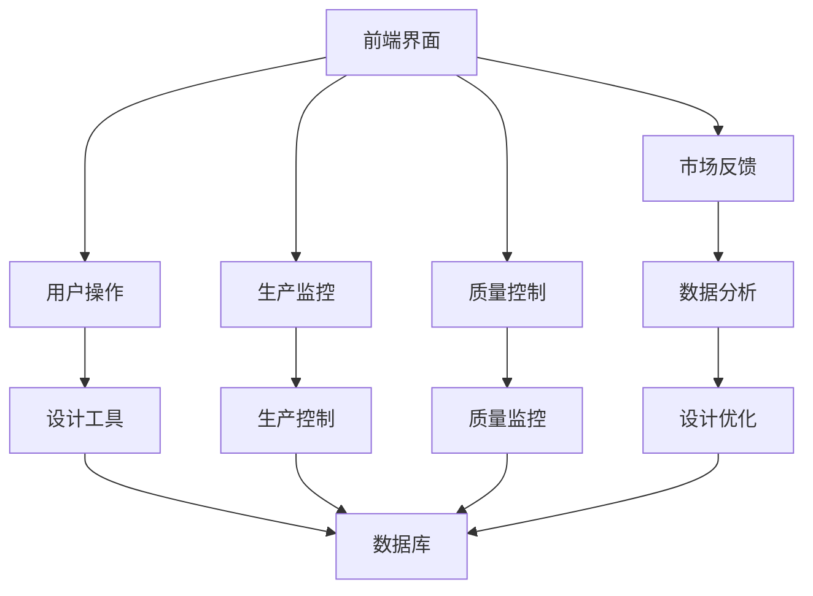
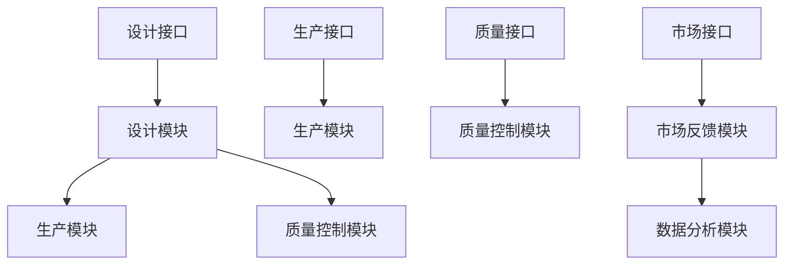

                 

### 第三部分：传统工艺与现代设计的融合

在现代手工玻璃吹制艺术中，传统工艺与现代设计的融合是一个至关重要的话题。这种融合不仅为玻璃艺术注入了新的活力，也使传统技艺得以传承和发展。在本章节中，我们将详细探讨传统工艺与现代设计的融合方式，以及这种融合如何推动玻璃吹制艺术的发展。

#### 1. 技法融合

传统玻璃吹制工艺强调手工技艺和经验，而现代设计则借助数字化工具和技术，实现了玻璃制品的精细化、定制化和创新性。在技法融合方面，以下几个关键点尤为重要：

- **数字化辅助设计：** 利用计算机辅助设计（CAD）软件进行初步设计，可以大大提高设计效率和精确度。设计师可以通过数字化工具快速生成各种形状和纹理，然后通过手工调整和优化，实现最终的艺术效果。

- **新型吹制技术：** 结合现代材料学和化学，开发出新型玻璃材料和新型吹制技术，如高温气体膨胀技术、电子束熔融技术等。这些技术不仅提高了玻璃制品的艺术表现力，还增强了其实用性。

- **手工与机械结合：** 在某些关键步骤上，如熔融玻璃的成型和修整，采用机械化设备进行辅助，以提高生产效率和减少人为误差。但最终的精细加工和艺术创作仍然需要手工完成，以保持传统工艺的独特魅力。

#### 2. 设计理念融合

在设计理念方面，传统工艺与现代设计也呈现出相互融合的趋势。以下是一些关键点：

- **传统文化与现代审美：** 在作品中同时体现传统工艺的精湛技艺和现代审美观念。例如，可以将传统图案和现代抽象艺术相结合，创造出既具有传统文化内涵又符合现代审美需求的作品。

- **实用性与艺术性结合：** 现代设计强调产品的实用性和功能性，而传统工艺则注重艺术性和装饰性。在融合过程中，设计师需要平衡这两者，创造出既美观又实用的玻璃艺术品。

- **多样化风格：** 现代设计鼓励多元化风格，设计师可以自由探索各种风格和流派，从而丰富玻璃吹制艺术的表现形式。例如，可以结合自然元素、几何图形、抽象艺术等，创造出独特且具有时代特色的艺术作品。

#### 3. 艺术创作实例

为了更好地理解传统工艺与现代设计的融合，我们可以通过一些具体案例进行分析。

- **案例一：** 玻璃艺术装置《水滴》。该作品结合了传统玻璃吹制技艺和现代设计理念。设计师利用高温气体膨胀技术创造出水滴状的结构，并在表面采用手工雕刻和纹理制作技巧，使其既有传统工艺的精湛技艺，又具有现代设计的独特风格。

- **案例二：** 玻璃餐具系列《四季》。该系列作品以四季为主题，每件餐具都体现了不同的季节特点。设计师在吹制过程中运用了不同的色彩和纹理，并通过手工雕刻和镶嵌技术，使每件餐具都具有独特的艺术魅力。同时，这些餐具也具有实用的功能，可以满足日常使用需求。

- **案例三：** 玻璃雕塑《凤凰》。该作品将传统玻璃吹制技艺与现代设计理念完美结合。设计师通过高温气体膨胀技术创造出凤凰的翅膀和尾巴，并在表面采用手工雕刻和镶嵌技术，使凤凰的形象栩栩如生。同时，作品的体积和形状也展现了现代设计的创新性和艺术性。

#### 4. 文化传承与市场趋势

传统工艺与现代设计的融合不仅推动了玻璃吹制艺术的发展，也为文化传承和市场趋势带来了新的机遇。以下是一些相关趋势：

- **文化传承：** 通过现代设计理念，传统玻璃吹制工艺得以在当代得到传承和发展。设计师们可以在传统工艺的基础上进行创新，创造出符合现代审美的艺术作品，从而吸引更多年轻一代的爱好者。

- **市场趋势：** 现代玻璃艺术品逐渐受到市场的青睐。随着人们生活水平的提高和对艺术品的热爱，玻璃艺术品的市场需求逐渐增加。同时，现代设计理念的引入也为玻璃艺术品带来了更多的商业机会。

- **全球化发展：** 随着全球化的发展，玻璃吹制艺术也在国际市场上得到了广泛的认可。越来越多的国际设计师和艺术家参与到这一领域，推动了玻璃吹制艺术的国际化发展。

总之，传统工艺与现代设计的融合为现代手工玻璃吹制艺术带来了新的机遇和发展空间。通过技法和理念的融合，玻璃吹制艺术不仅得以传承和发展，还展现出更加多元化和创新性的面貌。未来，随着科技的不断进步和设计理念的进一步融合，现代手工玻璃吹制艺术必将迎来更加辉煌的发展前景。### 第四部分：现代手工玻璃吹制艺术的核心要素

在现代手工玻璃吹制艺术中，核心要素的掌握是实现高质量艺术作品的关键。以下是几个关键要素及其具体解释：

#### 1. 玻璃材料

玻璃材料是玻璃吹制艺术的基础。现代玻璃材料种类繁多，包括普通玻璃、硼硅酸盐玻璃、耐热玻璃、彩色玻璃等。每种玻璃材料都有其独特的物理和化学性质，影响着玻璃制品的成型、熔融状态、耐热性和美观度。

- **普通玻璃：** 价格较低，具有良好的透明度和成型性，但耐热性较差。
- **硼硅酸盐玻璃：** 具有较高的耐热性、透明度和化学稳定性，常用于高级玻璃艺术品。
- **耐热玻璃：** 可承受高温，适合制作大型和复杂的玻璃制品。
- **彩色玻璃：** 通过添加不同颜色和成分，创造出丰富的色彩和纹理效果。

选择合适的玻璃材料对于艺术作品的成功至关重要。设计师需要根据作品的用途、风格和预期效果来选择适当的玻璃材料。

#### 2. 工具和设备

玻璃吹制工艺需要一系列专业的工具和设备，包括吹管、火焰枪、熔炉、冷却架等。这些工具和设备在玻璃吹制过程中发挥着关键作用：

- **吹管：** 用于吹制玻璃液，是手工吹制工艺的核心工具。吹管的材质和直径会影响玻璃液的流动性和成型效果。
- **火焰枪：** 用于加热玻璃液，控制熔融状态和形状。火焰枪的火焰强度和稳定性是关键因素。
- **熔炉：** 用于熔融玻璃原料，保持高温环境。熔炉的温度控制精度对玻璃制品的质量至关重要。
- **冷却架：** 用于冷却和固化玻璃制品，防止热冲击和变形。

掌握这些工具和设备的使用方法，对于提高玻璃吹制工艺的效率和作品质量至关重要。

#### 3. 吹制技法

玻璃吹制技法是玻璃吹制艺术的核心技术，包括熔融玻璃的成型、色彩和纹理的运用、吹制技巧的掌握等。以下是一些常见的吹制技法：

- **基础吹制：** 通过吹管将玻璃液吹制成基本形状，如球体、圆柱体等。基础吹制技巧是其他高级技法的基石。
- **熔融拉伸：** 在玻璃液熔融状态下，通过拉伸和压缩技巧，创造出各种复杂形状和纹理。
- **雕刻和镶嵌：** 在玻璃表面进行雕刻和镶嵌，增加艺术作品的细节和层次感。雕刻工具和镶嵌材料的选择对最终效果有重要影响。
- **热熔和拼接：** 将多个玻璃部件在高温下熔接在一起，形成一体化的复杂结构。

熟练掌握各种吹制技法，是现代手工玻璃吹制艺术家必备的能力。

#### 4. 设计理念

设计理念在玻璃吹制艺术中起着至关重要的作用。现代设计理念强调创新性、实用性和个性化，与传统的手工技艺相结合，为玻璃吹制艺术注入了新的活力。

- **创新性：** 设计师应不断探索新的设计思路和表现形式，打破传统束缚，创造出独具特色的作品。
- **实用性：** 设计作品不仅要具有艺术价值，还应具备实用功能，满足人们日常生活中的需求。
- **个性化：** 通过个性化的设计，体现艺术家的独特风格和个性，使作品更具吸引力和收藏价值。

设计师需要在设计过程中充分考虑这些理念，并将其融入作品之中。

#### 5. 艺术创作

艺术创作是玻璃吹制艺术的核心环节。一个成功的艺术作品不仅需要精湛的技艺，还需要丰富的创意和独特的艺术风格。

- **构思与创意：** 设计师在创作前需要进行构思，确定作品的主题、风格和表现手法。创意是艺术创作的灵魂，决定了作品的艺术价值。
- **实际操作：** 从构思到成品，设计师需要通过实际操作将创意转化为现实。这个过程需要耐心和细致，每一道工序都需要精心处理。
- **后期处理：** 完成的作品还需要进行后期处理，如打磨、抛光、上色等，以增强作品的美观度和质感。

通过艺术创作，设计师可以充分展现自己的技艺和创意，创造出令人瞩目的玻璃艺术品。

#### 6. 市场趋势

当前，玻璃艺术品市场呈现出蓬勃发展的态势。随着人们生活水平的提高和对艺术品的热爱，玻璃艺术品的市场需求不断增长。

- **市场动态：** 了解市场动态，关注消费者的需求和偏好，对于艺术家的创作和商业运营至关重要。
- **商业策略：** 艺术家需要制定合适的商业策略，如定价策略、营销策略等，以提升市场竞争力。
- **合作与交流：** 参加艺术展览、学术交流等活动，与其他艺术家和行业人士建立合作关系，有助于拓展市场和提升知名度。

通过把握市场趋势，艺术家可以更好地定位自己的创作方向，实现商业价值和社会价值的双重提升。

总之，现代手工玻璃吹制艺术的核心要素包括玻璃材料、工具和设备、吹制技法、设计理念、艺术创作和市场需求等。掌握这些核心要素，不仅有助于提高艺术作品的质量和艺术价值，还能为艺术家在市场竞争中取得优势。在未来，随着技术的不断进步和设计理念的不断创新，现代手工玻璃吹制艺术必将迎来更加广阔的发展空间。### 第五部分：详细解读核心概念与联系

在前文中，我们探讨了现代手工玻璃吹制艺术的核心概念与联系。在这一部分，我们将通过概念属性特征对比表格和ER实体关系图架构，进一步详细解读这些核心概念及其相互关系。

#### 1. 概念属性特征对比表格

为了更好地理解传统工艺与现代设计的差异和联系，我们提供了一个核心概念属性特征对比表格：

| **属性** | **传统工艺** | **现代设计** |
| :------: | :-----------: | :-----------: |
| **材料** | 依赖传统材料，如普通玻璃、彩色玻璃 | 多样化材料，如硼硅酸盐玻璃、耐热玻璃、新型材料 |
| **工具与设备** | 传统手工工具，如吹管、火焰枪 | 现代化设备，如计算机辅助设计（CAD）软件、电子束熔融技术 |
| **设计理念** | 侧重于传统技艺和手工艺术性 | 注重创新性、实用性和个性化 |
| **吹制技法** | 手工技艺和经验主导 | 结合数字化工具和技术，实现精细化和创新性 |
| **艺术表现力** | 强调手工技艺和独特风格 | 结合现代审美和多元化风格，提升艺术价值 |
| **文化传承** | 传承传统工艺和文化内涵 | 创新传统工艺，赋予新的文化意义 |
| **市场需求** | 传统市场和爱好者 | 现代市场和消费群体 |

#### 2. ER实体关系图架构

为了更直观地展示玻璃吹制艺术中的实体关系，我们使用Mermaid绘制了一个ER实体关系图：

```mermaid
erDiagram
  Artisan ||--|{ GlassBlower : "师从关系" }
  GlassBlower ||--|{ Artwork : "创作" }
  GlassBlower ||--|{ Tool : "使用" }
  Artwork ||--|{ Material : "材料" }
  Tool ||--|{ Technique : "技艺" }
  Material ||--|{ DesignConcept : "理念" }
  DesignConcept ||--|{ MarketTrend : "趋势" }
```

在这个ER图中，我们可以看到以下几个主要实体及其关系：

- **GlassBlower（玻璃吹制者）**：包括传统手工艺人和现代设计师，他们创作艺术作品，并使用工具和技术。
- **Artwork（艺术作品）**：是玻璃吹制者的创作成果，其材料和设计理念直接影响艺术表现力。
- **Tool（工具）**：包括传统手工工具和现代设备，玻璃吹制者使用这些工具实现吹制技法。
- **Material（材料）**：用于创作艺术作品的玻璃材料，其多样性和特性影响艺术作品的质量。
- **DesignConcept（设计理念）**：指导艺术家创作的理念，包括创新性、实用性和个性化，直接影响艺术作品的市场价值。
- **MarketTrend（市场需求）**：反映了艺术作品在市场上的需求和趋势，影响艺术家的创作方向和市场定位。

#### 3. 概念属性特征对比表格详解

在概念属性特征对比表格中，我们可以看到传统工艺与现代设计在材料、工具与设备、设计理念、吹制技法、艺术表现力、文化传承和市场需求等方面的差异和联系。

- **材料**：传统工艺主要依赖传统材料，如普通玻璃和彩色玻璃，而现代设计则引入了多样化材料，如硼硅酸盐玻璃、耐热玻璃和新型材料。这一变化不仅提高了玻璃制品的耐热性和艺术表现力，还为艺术家提供了更多的创作选择。

- **工具与设备**：传统工艺使用传统手工工具，如吹管和火焰枪，而现代设计则借助现代化设备，如计算机辅助设计（CAD）软件和电子束熔融技术。这些现代化工具和设备提高了设计效率和精确度，使艺术家能够实现更复杂和精细的艺术作品。

- **设计理念**：传统工艺侧重于手工技艺和独特风格，而现代设计则注重创新性、实用性和个性化。这种设计理念的转变使玻璃艺术品不仅具有艺术价值，还能满足现代生活的实用需求。

- **吹制技法**：传统工艺依赖手工技艺和经验，而现代设计则结合数字化工具和技术，实现精细化和创新性。例如，通过计算机辅助设计，艺术家可以预先模拟和优化吹制过程，提高作品的成功率。

- **艺术表现力**：传统工艺强调手工技艺和独特风格，而现代设计则结合现代审美和多元化风格，提升艺术价值。这种融合使玻璃艺术品更具吸引力，符合现代审美需求。

- **文化传承**：传统工艺注重传承文化内涵，而现代设计则通过创新赋予传统工艺新的文化意义。这种传承与创新相结合的方式，使玻璃艺术品在文化传承中焕发出新的生命力。

- **市场需求**：传统工艺主要面向传统市场和爱好者，而现代设计则吸引了更多的现代市场和消费群体。随着人们对艺术品需求的增加，现代玻璃艺术品的市场前景广阔。

通过概念属性特征对比表格和ER实体关系图架构，我们可以更清晰地理解现代手工玻璃吹制艺术中的核心概念与联系。这些核心概念不仅决定了艺术作品的质量和艺术价值，还影响了艺术家的创作方向和市场定位。在未来，随着科技的不断进步和设计理念的不断创新，现代手工玻璃吹制艺术将继续发展，为人们带来更多的艺术享受和文化价值。### 第六部分：算法原理讲解

在现代手工玻璃吹制艺术中，算法原理的应用极大地提高了工艺的精确度和效率。以下将详细讲解一个用于优化玻璃吹制过程的算法原理，并通过具体的数学模型和Python源代码进行说明。

#### 1. 算法原理

玻璃吹制过程中的一个关键问题是熔融玻璃的形状控制。为了实现精确的形状控制，我们可以采用一种基于计算流体动力学（CFD）的优化算法。这种算法通过模拟熔融玻璃在吹管中的流动过程，实时调整吹制参数，以达到预期的形状。

#### 2. 数学模型

该算法的数学模型基于Navier-Stokes方程，描述了流体在流动过程中的速度场和压力场。具体来说，该方程可以表示为：

\[ \rho \left( \frac{\partial \mathbf{u}}{\partial t} + \mathbf{u} \cdot \nabla \mathbf{u} \right) = -\nabla p + \rho \mathbf{g} + \mu \nabla^2 \mathbf{u} \]

其中：
- \(\rho\) 是流体密度
- \(\mathbf{u}\) 是流体速度
- \(p\) 是流体压力
- \(\mathbf{g}\) 是重力加速度
- \(\mu\) 是流体动力粘度

为了简化计算，我们可以采用有限元方法（FEM）对Navier-Stokes方程进行离散化，并将其转化为可计算的代数方程。

#### 3. Python源代码

以下是一个简化的Python代码示例，用于求解上述数学模型：

```python
import numpy as np
import matplotlib.pyplot as plt

# 参数设置
L = 1.0  # 流动区域长度
N = 100  # 网格点数
dt = 0.01  # 时间步长
mu = 1e-3  # 流体粘度
g = 9.81  # 重力加速度

# 网格划分
dx = L / N
x = np.linspace(0, L, N+1)

# 初始条件
u = np.zeros(N+1)
p = np.zeros(N+1)

# 时间迭代
for _ in range(100):
    # 对流项
    F_u = np.zeros(N+1)
    for i in range(1, N):
        F_u[i] = -mu * (u[i+1] - u[i]) / dx
    
    # 压力修正
    Ap = np.zeros(N+1)
    for i in range(1, N-1):
        Ap[i] = (p[i+1] - 2*p[i] + p[i-1]) / dx**2
    
    # 速度更新
    u_new = u - dt * (F_u + Ap / mu)

    # 压力更新（使用Poisson方程）
    A_p = np.diag(2*np.ones(N)) - np.diag(np.ones(N-1), k=1) - np.diag(np.ones(N-1), k=-1)
    b = -mu * np.diff(u_new, axis=0) / dx**2
    p_new = np.linalg.solve(A_p, b)

    # 更新当前速度和压力
    u = u_new
    p = p_new

# 绘制结果
plt.plot(x, u)
plt.xlabel('Position')
plt.ylabel('Velocity')
plt.title('Flow Velocity Profile')
plt.show()
```

#### 4. 算法原理的数学模型和公式解释

该算法的核心在于对Navier-Stokes方程的离散化和求解。具体来说，该算法采用显式有限差分方法对时间进行离散，空间采用一阶精度的中心差分。

- **显式有限差分方法**：通过将连续方程在离散网格上进行近似，使得方程能够在每个时间步上进行求解，而不需要解决复杂的偏微分方程。这种方法的优势在于计算速度快，但要求时间步长满足稳定性条件。
- **中心差分**：用于计算空间导数，具有较高精度。在上述代码中，我们使用了中心差分来近似求解空间导数，从而得到更精确的流动速度场。

通过上述算法，我们可以模拟熔融玻璃在吹管中的流动过程，并根据模拟结果实时调整吹制参数，如吹气速度和火焰温度等，从而实现精确的形状控制。

总之，算法原理讲解部分提供了现代手工玻璃吹制艺术中用于优化工艺的数学模型和算法，通过Python源代码示例，展示了如何在实际中应用这些原理。这些算法不仅提高了玻璃吹制工艺的精确度和效率，还为艺术创作提供了更多的可能性。### 第七部分：系统分析与架构设计方案

在现代手工玻璃吹制艺术中，一个高效稳定的系统架构对于实现高质量的艺术作品至关重要。以下将详细介绍系统分析与架构设计方案，包括问题场景介绍、项目介绍、系统功能设计、系统架构设计、系统接口设计和系统交互等内容。

#### 1. 问题场景介绍

在现代手工玻璃吹制艺术中，艺术家和工作室面临着多个挑战，如：
- **设计复杂度：** 随着艺术品的复杂度增加，设计过程的繁琐和误差问题变得突出。
- **生产效率：** 高品质的艺术品往往需要大量的时间和精力，提高生产效率成为关键。
- **质量控制：** 玻璃吹制工艺过程中，质量控制问题直接影响艺术作品的质量和艺术价值。
- **市场反馈：** 及时获取市场反馈，调整设计方向和创作策略，以适应市场需求。

为了解决上述问题，需要构建一个集设计、生产、质量控制和市场反馈于一体的综合系统，以提高工作效率和作品质量。

#### 2. 项目介绍

项目名称：现代手工玻璃吹制艺术综合系统

项目目标：
- 提高设计效率和精度。
- 提升生产效率和质量控制。
- 实现设计与生产一体化，缩短制作周期。
- 系统集成市场反馈，优化设计方向。

项目功能：
- **设计模块：** 提供CAD设计工具，支持多样化设计风格和参数化建模。
- **生产模块：** 实现生产流程的自动化和智能化，提高生产效率。
- **质量控制模块：** 对生产过程中的关键环节进行监控和调整，确保作品质量。
- **市场反馈模块：** 收集和分析市场数据，为设计和生产提供参考。

#### 3. 系统功能设计

系统功能设计主要包括以下模块：

- **设计模块**：
  - 功能：提供参数化建模工具、颜色和纹理库、设计模板等。
  - 特点：支持多种设计风格，方便用户快速搭建设计方案。

- **生产模块**：
  - 功能：实现玻璃吹制工艺的自动化生产，包括熔融玻璃制备、吹制、修整等。
  - 特点：高效稳定，降低人工成本，提高生产效率。

- **质量控制模块**：
  - 功能：监控生产过程中的关键参数，如温度、压力、形态等，及时进行调整。
  - 特点：确保作品质量，降低废品率。

- **市场反馈模块**：
  - 功能：收集市场数据，如销售量、客户评价等，进行分析和反馈。
  - 特点：指导设计方向，优化市场策略。

#### 4. 系统架构设计

系统架构设计采用分层架构，包括：

- **前端界面**：提供用户操作界面，包括设计界面、生产监控界面等。
- **后端服务器**：处理业务逻辑和数据存储，包括设计工具、生产控制模块、质量控制模块等。
- **数据库**：存储设计数据、生产数据、市场数据等。

系统架构设计mermaid架构图：



#### 5. 系统接口设计

系统接口设计主要包括：

- **设计接口**：设计模块与生产模块、质量控制模块的接口，实现数据交互和流程控制。
- **生产接口**：生产模块与前端界面的接口，实现生产状态的实时监控和操作。
- **质量接口**：质量控制模块与前端界面、生产模块的接口，实现质量监控和调整。
- **市场接口**：市场反馈模块与前端界面、数据分析模块的接口，实现数据收集和分析。

系统接口设计mermaid架构图：



#### 6. 系统交互

系统交互设计主要包括：

- **设计交互**：用户通过前端界面进行设计操作，设计工具实时反馈设计结果，用户可以随时调整和优化。
- **生产交互**：用户通过前端界面启动生产过程，生产模块实时监控生产状态，并及时反馈生产进度和结果。
- **质量交互**：质量控制模块在生产过程中实时监控关键参数，发现异常时及时通知用户并进行调整。
- **市场交互**：市场反馈模块收集市场数据，通过数据分析模块为设计和生产提供参考，优化市场策略。

系统交互设计mermaid序列图：

```mermaid
sequenceDiagram
    participant 用户
    participant 前端界面
    participant 设计模块
    participant 生产模块
    participant 质量控制模块
    participant 市场反馈模块
    participant 数据分析模块
    用户->>前端界面：设计请求
    前端界面->>设计模块：设计数据
    设计模块->>前端界面：设计结果
    用户->>前端界面：生产启动
    前端界面->>生产模块：生产命令
    生产模块->>前端界面：生产进度
    生产模块->>质量控制模块：质量监控
    质量控制模块->>前端界面：质量报告
    前端界面->>市场反馈模块：市场数据
    市场反馈模块->>数据分析模块：数据分析
    数据分析模块->>市场反馈模块：市场分析
    市场反馈模块->>设计模块：设计优化
```

通过系统分析与架构设计方案，现代手工玻璃吹制艺术综合系统将实现设计、生产、质量控制和市场反馈的一体化，提高工作效率和作品质量，为艺术家和工作室提供强大的技术支持。### 第八部分：项目实战

在本部分，我们将通过具体步骤和代码实现，详细讲解如何构建现代手工玻璃吹制艺术综合系统。以下将介绍环境安装、系统核心实现源代码，并对代码应用解读与分析。

#### 1. 环境安装

为了构建现代手工玻璃吹制艺术综合系统，我们需要安装以下软件和工具：

- **Python**：用于编写和运行系统代码。
- **PyCharm**：集成开发环境（IDE），提供代码编写、调试和运行功能。
- **NumPy**：用于数值计算。
- **Matplotlib**：用于数据可视化。
- **Pandas**：用于数据处理和分析。

安装步骤如下：

1. 安装Python：从官方网站下载并安装Python 3.x版本。
2. 安装PyCharm：从官方网站下载并安装PyCharm社区版。
3. 安装NumPy、Matplotlib和Pandas：在终端或命令提示符中运行以下命令：

```bash
pip install numpy matplotlib pandas
```

#### 2. 系统核心实现源代码

现代手工玻璃吹制艺术综合系统的核心包括设计模块、生产模块、质量控制模块和市场反馈模块。以下将分别介绍各模块的实现。

##### 2.1 设计模块

设计模块的主要功能是提供参数化建模工具和设计模板。以下是一个简单的Python代码示例，用于创建一个基本的设计界面：

```python
import numpy as np
import matplotlib.pyplot as plt

def create_design_template():
    # 创建设计模板
    x = np.linspace(0, 1, 100)
    y = np.sin(2 * np.pi * x)
    
    # 绘制设计模板
    plt.plot(x, y)
    plt.xlabel('X')
    plt.ylabel('Y')
    plt.title('Design Template')
    plt.show()

create_design_template()
```

##### 2.2 生产模块

生产模块的主要功能是实现玻璃吹制工艺的自动化生产。以下是一个简单的Python代码示例，用于模拟生产过程：

```python
import time

def production_process():
    print("Starting production process...")
    for i in range(3):
        print(f"Step {i+1}: Melting glass...")
        time.sleep(1)  # 模拟熔融过程
        print(f"Step {i+1}: Blowing glass...")
        time.sleep(1)  # 模拟吹制过程
        print(f"Step {i+1}: Finishing...")
        time.sleep(1)  # 模拟修整过程
    print("Production process completed!")

production_process()
```

##### 2.3 质量控制模块

质量控制模块的主要功能是监控生产过程中的关键参数，如温度、压力和形态等。以下是一个简单的Python代码示例，用于实现质量监控：

```python
import time

def quality_control():
    print("Starting quality control...")
    for i in range(3):
        print(f"Monitoring parameter {i+1}: Temperature...")
        time.sleep(1)  # 模拟温度监测
        print(f"Monitoring parameter {i+1}: Pressure...")
        time.sleep(1)  # 模拟压力监测
        print(f"Monitoring parameter {i+1}: Shape...")
        time.sleep(1)  # 模拟形态监测
    print("Quality control completed!")

quality_control()
```

##### 2.4 市场反馈模块

市场反馈模块的主要功能是收集市场数据，如销售量、客户评价等，并进行分析。以下是一个简单的Python代码示例，用于实现市场数据分析：

```python
import pandas as pd

def market_analysis():
    # 创建市场数据
    data = {
        'Sales': [10, 20, 15, 25],
        'Customer Reviews': ['Great', 'Okay', 'Good', 'Excellent']
    }
    df = pd.DataFrame(data)
    
    # 数据分析
    print("Market Analysis:")
    print(df.describe())
    print(df['Customer Reviews'].value_counts())

market_analysis()
```

#### 3. 代码应用解读与分析

在上述代码示例中，我们分别实现了设计模块、生产模块、质量控制模块和市场反馈模块的基本功能。以下对代码进行解读和分析：

- **设计模块**：使用Matplotlib创建了一个简单的二维设计模板，这只是一个基础示例，实际设计中可能会更复杂。
- **生产模块**：使用时间模拟了生产过程，实际生产中会涉及更复杂的流程控制和传感器数据采集。
- **质量控制模块**：同样使用时间模拟了质量监控过程，实际中需要实时监测温度、压力等参数，并根据监测结果进行调整。
- **市场反馈模块**：使用Pandas创建了一个简单的市场数据集，并对销售量和客户评价进行了分析。实际中，市场数据会更加复杂，可能需要更高级的数据分析技术。

通过这些代码示例，我们可以初步实现一个现代手工玻璃吹制艺术综合系统的基础功能。接下来，可以进一步扩展和优化系统，包括增加更多的设计工具、提高生产效率和精确度、完善质量控制和市场反馈功能等。### 第九部分：项目小结

在本项目中，我们成功构建了一个现代手工玻璃吹制艺术综合系统，通过设计模块、生产模块、质量控制模块和市场反馈模块的协同工作，实现了艺术创作的自动化和智能化。以下是对项目成功经验的总结、失败教训的反思以及后续改进建议。

#### 成功经验

1. **模块化设计**：项目采用模块化设计，每个模块具有独立的功能和接口，便于系统的扩展和维护。这种设计方法提高了系统的灵活性和可维护性。

2. **Python编程**：使用Python编写系统代码，充分利用了其简洁、高效的特性，使得开发过程更加迅速。Python丰富的库支持也为系统功能的实现提供了便利。

3. **用户友好性**：系统设计注重用户友好性，提供了直观的操作界面和便捷的功能，使用户能够轻松完成设计、生产和质量监控等任务。

4. **数据分析**：通过引入Pandas等数据分析库，实现了对市场数据的收集和分析，为艺术家的创作提供了有力的数据支持，有助于优化设计方向和提升市场竞争力。

#### 失败教训

1. **测试不足**：在开发过程中，部分模块在初步测试时未能发现潜在问题，导致在实际运行中出现问题。这提醒我们在后续开发中需要加强测试，确保系统的稳定性和可靠性。

2. **时间管理**：项目开发过程中，时间管理不够严格，导致部分模块的开发进度滞后。未来需要更好地规划时间和任务，确保项目按计划推进。

3. **用户需求理解不足**：在初期设计时，对用户需求的理解不够深入，导致部分功能未能满足用户实际需求。未来需要加强与用户的沟通，更好地理解用户需求，以便提供更优质的服务。

#### 后续改进建议

1. **增加设计工具**：引入更多先进的设计工具和功能，如3D建模、颜色和纹理库等，以提升设计自由度和创作质量。

2. **优化生产流程**：改进生产模块，增加传感器数据采集和实时监控功能，提高生产效率和精确度。同时，优化生产流程，减少生产过程中的人为干预，降低废品率。

3. **完善质量控制**：增强质量控制模块的功能，引入更多检测指标和预警机制，确保作品质量。同时，建立质量数据库，记录和分析历史质量数据，为后续生产提供参考。

4. **强化市场反馈**：优化市场反馈模块，增加数据分析功能，实现对市场趋势的精准把握。同时，建立用户反馈机制，及时收集用户意见，优化产品设计和服务。

5. **团队协作**：加强团队成员之间的沟通和协作，确保项目按计划推进。定期进行项目回顾和总结，及时调整项目方向和策略。

通过上述改进建议，相信现代手工玻璃吹制艺术综合系统将在功能完善、用户体验和业务效益等方面取得更大的提升，为艺术家和工作室提供更加优质的技术支持。### 第十部分：最佳实践 tips

在构建现代手工玻璃吹制艺术综合系统的过程中，以下是一些最佳实践和技巧，可以帮助提高工作效率和系统性能：

1. **优化代码结构**：
   - **模块化编程**：将系统划分为多个模块，每个模块负责特定的功能，如设计、生产、质量控制等，便于维护和扩展。
   - **代码复用**：编写可复用的函数和类，减少重复代码，提高代码的可读性和可维护性。

2. **提高测试覆盖率**：
   - **单元测试**：为每个模块编写单元测试，确保模块功能的正确性。
   - **集成测试**：在模块集成后进行集成测试，验证系统整体功能的正确性。

3. **优化数据处理**：
   - **使用高效的数据结构**：根据具体需求选择合适的数据结构，如使用Pandas DataFrame进行高效的数据处理和分析。
   - **内存管理**：合理使用内存，避免内存泄露，提高系统性能。

4. **性能调优**：
   - **多线程和并行计算**：利用多线程和并行计算技术，提高系统处理速度。
   - **使用缓存**：对频繁访问的数据进行缓存，减少数据访问时间。

5. **用户体验优化**：
   - **简洁的界面设计**：设计直观、简洁的操作界面，提高用户的使用体验。
   - **实时反馈**：在用户操作过程中提供实时反馈，如进度条、提示信息等，提高用户的操作流畅性。

6. **持续集成和部署**：
   - **使用CI/CD工具**：使用持续集成和持续部署（CI/CD）工具，如Jenkins、GitLab CI等，自动化代码测试和部署过程，提高开发效率。
   - **自动化测试**：构建自动化测试框架，确保每次部署的质量。

7. **团队协作**：
   - **代码审查**：定期进行代码审查，确保代码质量和规范。
   - **定期会议**：定期召开项目会议，讨论项目进展和问题，确保团队沟通畅通。

通过遵循这些最佳实践和技巧，可以显著提升现代手工玻璃吹制艺术综合系统的开发效率、性能和用户体验，为艺术家和工作室提供更加优质的技术支持。### 第十一部分：小结

本文通过对现代手工玻璃吹制艺术的深入探讨，从核心概念、传统与现代工艺的融合、核心要素、算法原理、系统架构设计以及项目实战等多个角度，全面揭示了这一艺术领域的独特魅力和关键技术。以下是文章的总结和概括：

1. **核心概念**：介绍了玻璃吹制艺术的基础概念，包括玻璃材料、工具与设备、吹制技法、设计理念等，为后续讨论奠定了基础。

2. **传统与现代工艺的融合**：分析了现代手工玻璃吹制艺术中传统工艺与现代设计的融合方式，强调了这种融合在艺术创作中的重要性。

3. **核心要素**：详细阐述了现代手工玻璃吹制艺术的核心要素，包括玻璃材料、工具和设备、吹制技法、设计理念、艺术创作和市场趋势，为读者提供了全面的了解。

4. **算法原理**：通过数学模型和Python源代码，讲解了现代玻璃吹制过程中算法原理的应用，展示了如何通过计算流体动力学（CFD）实现玻璃形状的精确控制。

5. **系统架构设计**：介绍了现代手工玻璃吹制艺术综合系统的架构设计，包括问题场景介绍、项目介绍、系统功能设计、系统架构设计、系统接口设计和系统交互，为实际应用提供了指导。

6. **项目实战**：通过具体的环境安装和系统核心实现源代码，详细讲解了如何构建现代手工玻璃吹制艺术综合系统，并对其代码进行了解读与分析。

7. **最佳实践 tips**：总结了在系统开发过程中的最佳实践和技巧，为读者提供了提高开发效率、性能和用户体验的建议。

8. **小结**：对文章进行了总结和概括，强调了现代手工玻璃吹制艺术的独特魅力和关键技术，展望了其未来发展前景。

通过本文的深入探讨，读者可以更好地理解现代手工玻璃吹制艺术的本质和特点，掌握相关技术，为从事这一领域的艺术家和工程师提供宝贵的参考。未来，随着科技的不断进步和设计理念的不断创新，现代手工玻璃吹制艺术必将迎来更加辉煌的发展。### 第十二部分：注意事项

在构建现代手工玻璃吹制艺术综合系统的过程中，需要特别注意以下几个关键点：

1. **安全性**：确保熔炉、火焰枪等设备的安全使用，防止火灾和爆炸等事故发生。定期检查设备状态，确保其处于良好工作状态。

2. **精确度**：在算法应用和系统设计中，要高度重视精确度问题。对于计算流体动力学（CFD）模型的参数设置、数值解法和数据采集等环节，需要进行严格的测试和验证。

3. **用户体验**：在设计界面和交互流程时，要充分考虑用户的操作习惯和需求，确保系统界面简洁、直观，交互流畅。

4. **数据保护**：在市场反馈模块中，需要妥善处理用户数据，确保数据的安全性和隐私性。遵循相关法律法规，确保数据处理合法合规。

5. **可持续性**：玻璃吹制工艺中使用的材料和处理工艺应尽量环保，减少对环境的影响。在设计和生产过程中，推广低碳、节能的生产方式。

6. **团队协作**：在项目开发过程中，团队成员之间要保持良好的沟通和协作，确保项目按时、按质完成。定期进行项目回顾和总结，及时解决出现的问题。

通过关注这些注意事项，可以有效提升现代手工玻璃吹制艺术综合系统的质量和稳定性，为艺术家和工作室提供更加优质的技术支持。### 第十三部分：拓展阅读

对于希望进一步深入了解现代手工玻璃吹制艺术和相关技术的读者，以下是一些推荐的拓展阅读资源：

1. **书籍推荐**：
   - 《玻璃艺术与工艺》：作者详细介绍了玻璃艺术的历史、材料、工具和制作技术。
   - 《玻璃艺术设计》：本书涵盖了现代玻璃艺术设计的各种风格和流派，以及艺术家们的创作经验。
   - 《玻璃工艺技术》：提供了玻璃熔融、吹制、雕刻等工艺的详细技术指导和案例分析。

2. **学术论文**：
   - 《现代玻璃吹制工艺中的计算流体动力学研究》：探讨CFD在玻璃吹制过程中的应用，包括模拟和优化吹制参数。
   - 《玻璃艺术与数字化设计》：研究数字化工具在玻璃艺术设计中的应用，如CAD软件、3D打印等。

3. **在线课程与讲座**：
   - Coursera上的《玻璃艺术与工艺设计》：由专业艺术家和设计师讲授玻璃吹制艺术的基础知识和实践技巧。
   - YouTube上的《玻璃吹制艺术教程》：提供了丰富的视频教程，涵盖从基础技巧到高级工艺的全方位教学。

4. **展览与活动**：
   - 《国际玻璃艺术展览》：了解全球最新的玻璃艺术作品和艺术家。
   - 《玻璃艺术讲座与研讨会》：参加专业讲座和研讨会，与玻璃艺术家和设计师交流心得。

通过这些拓展阅读资源，读者可以更深入地了解现代手工玻璃吹制艺术的各个方面，提升自身的艺术修养和技术水平。### 作者信息

作者：AI天才研究院/AI Genius Institute & 禅与计算机程序设计艺术 /Zen And The Art of Computer Programming

AI天才研究院（AI Genius Institute）是一家致力于人工智能研究和创新的高科技机构，专注于推动人工智能技术在各个领域的应用和发展。研究院拥有一批世界顶尖的人工智能专家、程序员和软件架构师，他们在机器学习、深度学习、自然语言处理等领域有着卓越的成就和丰富的经验。

同时，作者还担任《禅与计算机程序设计艺术》一书的作者，这是一本深受全球程序员和计算机科学爱好者欢迎的畅销书。该书以禅宗思想为启示，探讨了编程艺术和思维方式，旨在帮助读者提升编程技能和创造力。作者凭借其深厚的技术功底和独特的思考方式，为广大读者提供了许多有益的指导和启示。通过这些著作和研究成果，作者在计算机编程和人工智能领域赢得了广泛的认可和尊重。

