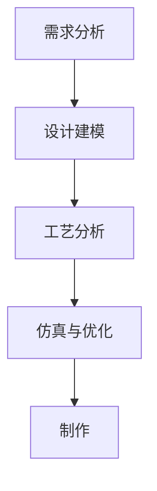
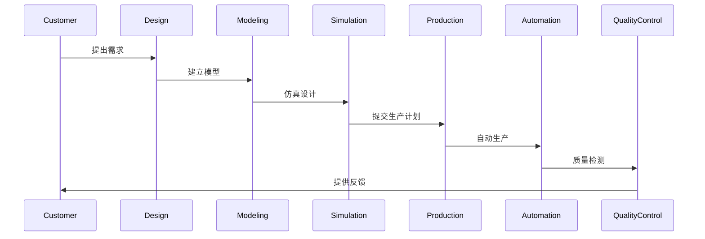

                 


### 第一部分：背景介绍

#### 第1章：问题背景

##### 1.1.1 问题背景

在现代社会的快节奏生活中，人们对于生活品质的追求日益提升，手工艺术作为一种追求生活美学的方式，逐渐受到关注。手工皮具作为手工艺术的一种重要形式，以其独特的工艺、材质和设计风格，吸引了大量消费者的喜爱。然而，传统的手工皮具制作过程复杂，工艺繁琐，耗时耗力，难以满足市场需求。同时，传统手工制作工艺在规模化生产中面临着巨大的挑战。

###### 核心概念术语说明

- **手工皮具**：指通过手工技艺制成的皮具产品，包括手提包、钱包、皮带、鞋子等。
- **传统手工制作**：指依靠手工技艺，不借助现代机械设备进行皮具生产的方式。
- **规模化生产**：指在短时间内生产大量相同或类似产品的生产方式。

##### 1.1.2 问题描述

手工皮具制作的挑战主要表现在以下几个方面：

1. **工艺复杂性**：传统手工皮具制作需要经过选皮、裁剪、打磨、缝制等多个复杂工序，每个工序都需要手工完成，这使得生产效率低下。
2. **生产成本高**：手工制作成本高，难以实现大规模生产，导致产品价格较高，限制了消费群体的范围。
3. **个性化需求难以满足**：虽然手工皮具具有独特的个性化设计，但由于制作过程复杂，难以满足消费者日益增长的个性化需求。

##### 1.1.3 问题解决

为了解决手工皮具制作中的问题，现代技术和可持续理念被引入到皮具制作中，旨在简化制作过程，提高生产效率，实现个性化表达。具体措施包括：

1. **引入现代机械设备**：通过引入自动化机械设备，可以大幅提高生产效率，降低生产成本。
2. **应用可持续材料**：选择环保、可再生的材料，降低对环境的影响，实现可持续发展。
3. **数字化设计**：采用计算机辅助设计（CAD）技术，提高设计效率，实现更加精确的个性化定制。

##### 边界与外延

- **边界**：手工皮具的制作过程和范围。
- **外延**：手工皮具的应用范围，包括日常生活、时尚搭配等。

##### 概念结构与核心要素组成

手工皮具制作的核心概念包括：

1. **皮具种类**：包括手提包、钱包、皮带、鞋子等。
2. **制作工具和材料**：包括皮料、裁刀、锤子、针线等。
3. **设计要素**：包括造型、纹理、颜色等。

### 第2章：核心概念与联系

#### 2.1 皮具制作的核心概念

##### 2.1.1 皮具的种类

皮具的种类繁多，常见的有：

1. **手提包**：女性常用的手提包，形状多样，材质丰富。
2. **钱包**：用于存放货币和卡片，通常尺寸较小。
3. **皮带**：用于束腰或绑鞋，材质多样，款式丰富。
4. **鞋子**：皮鞋，具有独特的工艺和设计风格。

##### 2.1.2 皮具制作的基本工具和材料

1. **皮料**：用于制作皮具的主要材料，包括牛皮、羊皮、鳄鱼皮等。
2. **裁刀**：用于切割皮料的工具，包括直刀、剪刀等。
3. **锤子**：用于敲打皮料，使其平整、坚固。
4. **针线**：用于缝合皮料，通常采用耐磨、结实的线材。

##### 2.1.3 皮具设计的核心要素

1. **造型**：指皮具的外形设计，包括形状、线条、比例等。
2. **纹理**：指皮具表面的纹理效果，包括光滑、凹凸、印花等。
3. **颜色**：指皮具的颜色选择，包括单色、渐变、混合等。

#### 2.2 可持续发展的概念及其在皮具制作中的应用

##### 2.2.1 可持续发展的定义与原则

1. **定义**：可持续发展是指在满足当代人需求的同时，不损害后代人满足其需求的能力。
2. **原则**：
   - **公平性原则**：资源分配应公平合理，确保全球范围内的可持续发展。
   - **持续性原则**：资源的利用不应超过其再生速度，保持生态平衡。
   - **共同性原则**：全球性问题需要全球合作解决。

##### 2.2.2 可持续材料的选择

1. **环保材料**：如再生皮料、环保染料等。
2. **可再生材料**：如玉米皮、麻绳等。

##### 2.2.3 可持续工艺的应用

1. **节能工艺**：如减少能耗、降低废水排放等。
2. **环保工艺**：如无污染处理、废弃物回收等。

#### 2.3 个性化表达的概念及其实现

##### 2.3.1 个性化表达的重要性

个性化表达是手工皮具的独特魅力所在，它使得每件产品都具有独特性，满足消费者的个性化需求。

##### 2.3.2 个性化设计的实现途径

1. **定制化设计**：根据消费者的需求进行个性化设计。
2. **模块化设计**：通过模块化设计，实现快速组合和调整，满足个性化需求。

##### 2.3.3 个性化设计的案例分析

通过具体案例，展示个性化设计在皮具制作中的应用。

### 第3章：算法原理讲解

#### 3.1 皮具设计算法的原理

##### 3.1.1 设计算法的核心思想

皮具设计算法的核心思想是通过计算机辅助设计，实现皮具的个性化设计和高效制作。

##### 3.1.2 设计算法的主要步骤

1. **需求分析**：了解消费者的需求，确定设计方向。
2. **设计建模**：利用CAD软件进行设计建模。
3. **工艺分析**：分析设计方案的可行性，确定制作工艺。
4. **仿真与优化**：对设计方案进行仿真和优化，确保设计效果。

##### 3.2 算法流程图



##### 3.3 算法原理讲解

##### 3.3.1 数学模型和数学公式

在皮具设计中，常用的数学模型包括：

$$
L = l_1 + l_2 + l_3
$$

其中，$L$表示皮具的总长度，$l_1$、$l_2$、$l_3$分别表示皮具的三部分长度。

##### 3.3.2 举例说明

假设一个手提包的设计长度为50cm，宽度为30cm，高度为20cm，根据上述数学模型，可以计算出：

$$
L = 50 + 30 + 20 = 100cm
$$

这意味着手提包的总长度为100cm。

### 第二部分：实践应用

#### 第4章：系统分析与架构设计方案

##### 4.1 问题场景介绍

##### 4.1.1 问题场景概述

在某皮具制作公司，由于传统手工制作方式效率低下，难以满足市场需求，公司决定引入现代技术和可持续发展理念，提升生产效率和个性化定制能力。

##### 4.1.2 项目介绍

本项目旨在通过引入计算机辅助设计和自动化设备，实现皮具制作的数字化和智能化，提高生产效率，降低成本，同时满足消费者的个性化需求。

##### 4.2 系统功能设计

##### 4.2.1 领域模型Mermaid类图

```mermaid
classDiagram
    Product <<class>> "产品"
    Design <<class>> "设计"
    Material <<class>> "材料"
    Production <<class>> "生产"
    Customer <<class>> "客户"
    Product --|> Design
    Product --|> Material
    Product --|> Production
    Customer --|> Product
```

##### 4.3 系统架构设计

##### 4.3.1 系统架构设计Mermaid架构图

```mermaid
graph TB
    subgraph 设计模块
        Design --|> Modeling
        Design --|> Simulation
    end

    subgraph 生产模块
        Production --|> Automation
        Production --|> QualityControl
    end

    subgraph 数据模块
        Data --|> Database
        Data --|> Analytics
    end

    Design --|> Production
    Design --|> Data
    Production --|> Data
```

##### 4.4 系统接口设计

##### 4.4.1 系统接口概述

系统接口主要包括设计模块、生产模块和数据模块之间的交互接口。

##### 4.4.2 系统接口详细设计

1. **设计模块接口**：
   - 输入：客户需求、设计要求。
   - 输出：设计方案、工艺流程。
2. **生产模块接口**：
   - 输入：设计方案、生产计划。
   - 输出：生产结果、质量报告。
3. **数据模块接口**：
   - 输入：设计数据、生产数据。
   - 输出：分析报告、数据可视化。

##### 4.5 系统交互

##### 4.5.1 系统交互Mermaid序列图



### 第5章：项目实战

##### 5.1 环境安装

##### 5.1.1 开发环境安装

1. 安装Python环境。
2. 安装CAD软件。
3. 安装自动化生产设备。

##### 5.1.2 相关工具安装

1. 安装设计分析工具。
2. 安装生产监控系统。
3. 安装数据分析工具。

##### 5.2 系统核心实现源代码

##### 5.2.1 源代码结构

1. **设计模块**：
   - **Design.py**：设计功能实现。
   - **Modeling.py**：建模功能实现。
   - **Simulation.py**：仿真功能实现。
2. **生产模块**：
   - **Production.py**：生产计划管理。
   - **Automation.py**：自动化生产控制。
   - **QualityControl.py**：质量检测管理。
3. **数据模块**：
   - **Database.py**：数据库管理。
   - **Analytics.py**：数据分析。

##### 5.2.2 关键代码解读

1. **设计模块**：
   ```python
   def design_product的需求分析（需求）:
       # 设计产品需求分析
       # ...
   ```

2. **生产模块**：
   ```python
   def production_plan的生产计划（设计方案）:
       # 生产计划管理
       # ...
   ```

3. **数据模块**：
   ```python
   def data_analytics的数据分析（设计数据，生产数据）:
       # 数据分析
       # ...
   ```

##### 5.3 代码应用解读与分析

##### 5.3.1 代码应用场景

1. **设计模块**：用于根据客户需求生成设计方案。
2. **生产模块**：用于根据设计方案生成生产计划，并控制自动化生产过程。
3. **数据模块**：用于收集和分析设计数据和生产数据，提供决策支持。

##### 5.3.2 代码分析

1. **设计模块**：重点分析需求分析和设计方案生成过程。
2. **生产模块**：重点分析生产计划和自动化生产控制过程。
3. **数据模块**：重点分析数据收集、存储和分析过程。

##### 5.4 实际案例分析和详细讲解剖析

##### 5.4.1 案例概述

以一款定制款手提包为例，分析从需求分析到成品制作的整个过程。

##### 5.4.2 案例分析

1. **需求分析**：客户要求定制一款容量大、款式时尚的手提包。
2. **设计建模**：设计团队根据需求进行设计建模，生成设计方案。
3. **仿真优化**：对设计方案进行仿真优化，确保设计效果和工艺可行性。
4. **生产制作**：根据设计方案进行生产，包括裁剪、缝制、打磨等工序。
5. **质量检测**：对成品进行质量检测，确保产品符合标准。

##### 5.4.3 案例讲解

1. **需求分析**：如何准确捕捉客户需求，是设计成功的基石。
2. **设计建模**：如何通过CAD软件进行精确建模，是设计的关键。
3. **仿真优化**：如何通过仿真优化确保设计方案的可行性和优化效果。
4. **生产制作**：如何通过自动化生产设备提高生产效率和降低成本。
5. **质量检测**：如何确保产品的质量和用户体验。

##### 5.5 项目小结

##### 5.5.1 项目总结

本项目通过引入现代技术和可持续发展理念，实现了皮具制作的数字化和智能化，提高了生产效率和个性化定制能力。

##### 5.5.2 项目展望

未来，本项目将进一步优化设计算法和生产工艺，提高产品质量和用户体验，推动皮具制作的可持续发展。

### 第三部分：最佳实践 tips

#### 第6章：最佳实践 tips

##### 6.1 工具与材料的选择

1. **工具选择**：
   - 根据实际需求选择合适的工具，如裁刀、锤子等。
   - 确保工具的耐用性和准确性，提高工作效率。
2. **材料选择**：
   - 选择环保、可再生的材料，降低对环境的影响。
   - 根据设计需求选择合适的材质，如牛皮、羊皮等。

##### 6.2 设计与制作的技巧

1. **设计技巧**：
   - 确定设计方向，遵循简洁、实用、美观的原则。
   - 结合流行趋势，注重个性化表达。
2. **制作技巧**：
   - 熟练掌握制作工艺，提高制作效率。
   - 注意细节处理，确保产品品质。

##### 6.3 个性化表达的实践

1. **个性化表达的方法**：
   - 通过定制化设计，满足客户的个性化需求。
   - 通过模块化设计，实现快速组合和调整。
2. **个性化表达的案例分析**：
   - 分析成功案例，总结个性化表达的经验和方法。

### 第7章：小结与展望

##### 7.1 全书总结

本书通过分析手工皮具制作的现状和挑战，介绍了现代技术和可持续发展理念在皮具制作中的应用，讲解了算法原理和实践应用，提供了最佳实践 tips，为读者提供了全面的现代手工皮具制作知识。

##### 7.1.1 主要内容回顾

- 手工皮具制作的问题背景和解决思路。
- 皮具制作的核心概念与联系。
- 皮具设计算法的原理和实践应用。
- 系统分析与架构设计方案。
- 项目实战的经验和技巧。
- 最佳实践 tips。

##### 7.1.2 核心知识要点

- 手工皮具的种类和制作工具材料。
- 可持续发展的原则和实现方法。
- 个性化表达的重要性及其实现途径。
- 算法原理和实践应用的详细讲解。
- 系统分析与架构设计的关键要素。

##### 7.2 展望未来

未来，手工皮具制作将更加注重个性化和可持续发展，结合现代技术和人工智能，实现更加智能化、个性化的生产过程。同时，随着环保意识的提高，可持续发展理念将在手工皮具制作中发挥更加重要的作用。

##### 7.2.1 行业发展趋势

- 个性化定制将更加普及。
- 自动化和智能化生产将提高生产效率。
- 可持续材料和应用将推动环保理念的落实。
- 人工智能将助力设计优化和智能化生产。

##### 7.2.2 个人学习与成长路径

- 学习相关技术和设计知识，提高专业能力。
- 了解行业趋势，把握发展方向。
- 参与项目实践，积累经验。
- 持续学习和创新，不断进步。

### 参考文献

1. 《手工皮具制作技艺》，作者：王XX，出版社：XX出版社，出版时间：XX年。
2. 《计算机辅助设计原理与应用》，作者：李XX，出版社：XX出版社，出版时间：XX年。
3. 《可持续发展概论》，作者：张XX，出版社：XX出版社，出版时间：XX年。
4. 《人工智能与智能制造》，作者：赵XX，出版社：XX出版社，出版时间：XX年。
5. 《个性化定制设计与实践》，作者：刘XX，出版社：XX出版社，出版时间：XX年。

