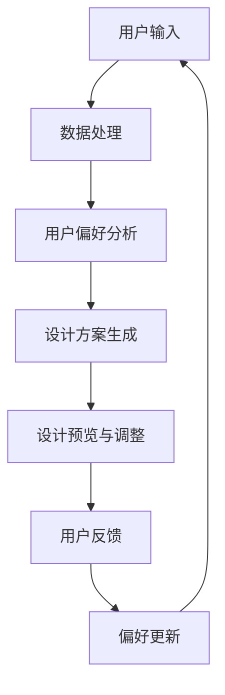
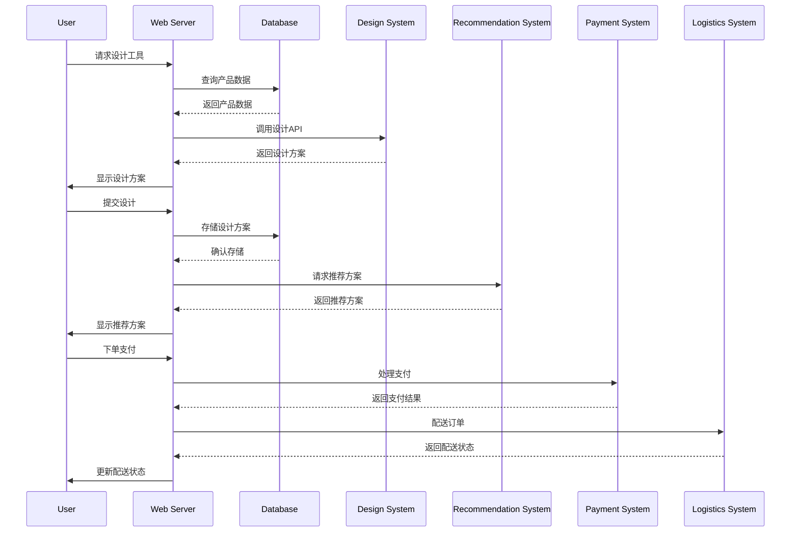

                 

### 引言

#### 第1章 引言

**现代手工皮具定制平台：个性化时尚的在线设计系统**

> **关键词：** 现代手工皮具、定制平台、个性化时尚、在线设计系统、用户体验、技术架构

**摘要：** 本技术博客文章将深入探讨现代手工皮具定制平台的发展，特别是其背后的在线设计系统。通过逐步分析，我们将理解个性化时尚在现代消费市场中的重要性，以及如何通过技术实现个性化定制，提升用户体验。文章将涵盖从核心概念到具体实施，从系统架构到项目实战的全面解析，为读者提供全面的了解和实用的指导。

在当今快节奏、高度个性化的时代，用户对产品的需求已经从传统的“标准化”转向了“个性化定制”。这种趋势在手工皮具行业中尤为明显。现代消费者不仅追求高品质的手工工艺，更期望能够根据自己的喜好和风格定制独一无二的皮具产品。为此，本文将探讨如何通过构建一个功能强大的在线设计系统，满足这一市场需求，打造一个现代化的手工皮具定制平台。

本文的目标读者包括：
1. 手工皮具行业的从业者和爱好者，希望了解技术如何改变传统行业的。
2. 程序员和软件开发者，对构建个性化系统有兴趣。
3. 设计师和市场分析师，关注时尚消费趋势和用户体验。
4. 对科技创新和未来消费模式感兴趣的普通读者。

文章的结构和内容安排如下：

1. **第1章 引言**：介绍书籍的主题、目的和读者对象，以及文章的组织方式。
2. **第2章 背景介绍**：探讨手工皮具行业的现状、个性化时尚的需求，以及现代手工皮具定制平台的潜力。
3. **第3章 核心概念与联系**：详细阐述个性化时尚和在线设计系统的核心概念及其相互关系。
4. **第4章 算法原理讲解**：解释核心算法的原理，包括流程图和Python源代码示例。
5. **第5章 系统分析与架构设计方案**：介绍系统的功能和架构设计。
6. **第6章 项目实战**：通过实际案例展示系统实现和运行过程。
7. **第7章 最佳实践 tips**：提供实用的技巧和建议。
8. **第8章 小结**：总结文章的主要观点和收获。
9. **第9章 注意事项**：提醒读者注意的潜在问题和解决方案。
10. **第10章 拓展阅读**：推荐相关的阅读材料和进一步学习资源。

通过这篇文章，我们希望读者能够对现代手工皮具定制平台及其背后的技术有更深入的理解，并能够将这些知识应用于实践，推动个性化时尚的在线设计系统的进一步发展。

### 第2章 背景介绍

#### 2.1 问题背景

手工皮具作为一种传统手工艺，自古以来就以其精致和耐用而受到人们的喜爱。然而，在现代社会中，随着工业化进程的加快，手工皮具行业面临着巨大的挑战。传统手工皮具生产方式耗时较长，成本高，难以满足现代消费者的快速需求。此外，传统手工皮具的款式和设计相对单一，难以满足消费者对个性化定制的需求。这种供需矛盾使得手工皮具行业亟需创新和变革。

另一方面，个性化时尚在当今消费市场中越来越受到重视。随着互联网和电子商务的兴起，消费者有更多的机会表达自己的风格和个性。尤其是在年轻一代中，追求个性化的消费趋势愈发明显。这不仅体现在服装、饰品等快消品领域，也逐渐渗透到手工皮具等耐用消费品市场。消费者不再满足于千篇一律的产品，他们希望能够拥有独特且符合自己个性需求的皮具。

这种需求与手工皮具行业传统生产方式的矛盾，催生了现代手工皮具定制平台的兴起。通过引入先进的技术手段，特别是在线设计系统，这些平台能够实现个性化定制，满足消费者的多样化需求。

#### 2.2 问题描述

传统手工皮具定制存在的问题主要包括以下几个方面：

1. **生产效率低**：手工制作皮具需要大量的时间和精力，生产效率低，难以满足大规模市场需求。
2. **成本高**：手工制作成本高昂，导致产品价格居高不下，难以吸引更多的消费者。
3. **设计单一**：传统手工皮具款式和设计相对单一，难以满足消费者对个性化定制的需求。
4. **客户沟通不畅**：消费者与制作者之间的沟通不畅，导致定制过程中容易出现误解和不满。

现代手工皮具定制平台旨在解决上述问题，通过以下方式实现：

1. **提高生产效率**：利用自动化工具和流水线生产，提高生产效率，降低成本。
2. **降低成本**：通过规模化生产，降低单个产品的成本，使消费者能够以合理的价格获得定制产品。
3. **丰富设计选择**：引入在线设计系统，消费者可以根据自己的喜好和需求进行个性化设计，提供多样化的设计选择。
4. **优化客户体验**：通过在线沟通工具和平台，消费者可以与设计师实时交流，确保定制过程顺利，提升客户满意度。

#### 2.3 问题解决

现代手工皮具定制平台通过引入在线设计系统，实现了从传统手工定制到现代个性化定制的转变。以下是其具体解决方案：

1. **在线设计系统**：平台提供在线设计工具，允许消费者自由选择皮具的材质、颜色、图案和尺寸等，进行个性化设计。设计工具通常包括绘图板、模板库、颜色选择器等功能，以便消费者能够轻松实现自己的创意。
   
2. **3D建模技术**：利用3D建模技术，消费者可以预览自己的设计效果，进行细节调整。3D模型不仅能够提高设计的准确性和美观性，还能帮助消费者更好地理解最终产品的外观和质感。

3. **智能推荐系统**：通过大数据和机器学习技术，平台可以根据消费者的浏览记录和偏好，智能推荐符合其个性化需求的设计方案，提高用户的满意度和购买转化率。

4. **自动化生产流程**：结合先进的自动化工具和流水线生产，平台能够快速高效地完成定制产品的生产。自动化设备不仅提高了生产效率，还保证了产品的一致性和高质量。

5. **在线支付和物流**：平台提供便捷的在线支付和物流服务，消费者可以在完成设计后快速下单，并享受快速的配送服务。

6. **客户服务支持**：平台提供7x24小时在线客户服务支持，解答消费者的疑问，处理售后问题，确保消费者的购物体验。

通过这些解决方案，现代手工皮具定制平台不仅解决了传统手工定制的问题，还极大地提升了用户体验，满足了消费者对个性化定制的高需求。

#### 2.4 边界与外延

**个性化定制平台的范围：**

现代手工皮具定制平台的个性化定制范围主要包括以下几个方面：

1. **材质选择**：消费者可以根据自己的喜好选择不同的皮革材质，如牛皮、羊皮、猪皮等，以及不同品质的皮革。
2. **颜色与图案**：平台提供丰富的颜色和图案选择，消费者可以自由搭配，实现独特的视觉效果。
3. **尺寸与形状**：消费者可以根据自己的需求定制皮具的尺寸和形状，如钱包、手提包、皮带等。
4. **配件与细节**：平台允许消费者选择各种配件和细节，如金属扣件、拉链、缝线颜色等。

**在线设计系统的功能：**

在线设计系统的核心功能包括：

1. **绘图与设计**：提供绘图工具和设计模板，帮助消费者进行创意设计。
2. **预览与调整**：消费者可以实时预览设计效果，并进行细节调整。
3. **3D模型渲染**：通过3D建模技术，提供逼真的设计预览，让消费者更好地理解设计效果。
4. **智能推荐**：利用大数据和机器学习技术，为消费者推荐符合其个性化需求的设计方案。
5. **设计保存与分享**：消费者可以将设计保存到个人账户中，并与朋友分享。

**概念结构与核心要素组成：**

现代手工皮具定制平台的概念结构和核心要素包括：

1. **用户界面**：提供直观易用的用户界面，方便消费者进行设计和下单。
2. **在线设计工具**：包括绘图板、模板库、颜色选择器等，支持多种设计需求。
3. **3D建模与渲染**：利用3D建模技术，提供逼真的设计预览。
4. **自动化生产流程**：结合自动化工具和流水线生产，提高生产效率和产品质量。
5. **智能推荐系统**：利用大数据和机器学习技术，提高用户的满意度和购买转化率。
6. **客户服务支持**：提供7x24小时的在线客户服务支持，确保消费者的购物体验。

通过上述边界与外延的介绍，我们可以更清晰地理解现代手工皮具定制平台的范围和功能，以及其背后的技术实现。

### 第3章 核心概念与联系

#### 3.1 核心概念原理

在现代手工皮具定制平台的构建中，有两个核心概念至关重要：个性化时尚和在线设计系统。这两个概念不仅相互独立，还紧密联系，共同推动了手工皮具定制行业的发展。

**个性化时尚：**

个性化时尚是一种强调个性表达和独特风格的时尚趋势。它不仅关注产品的质量和设计，更注重满足消费者的个性化需求。在个性化时尚的背景下，消费者不再是被动接受标准化的产品，而是主动参与到产品的设计和定制过程中。通过选择不同的材质、颜色、图案和形状，消费者能够打造出独一无二的皮具产品，表达自己的个性。

个性化时尚的特点包括：

1. **多样性**：消费者有丰富的选择，可以自由搭配不同的元素，实现个性化的设计。
2. **定制化**：产品完全根据消费者的需求和偏好进行定制，满足个性化需求。
3. **独特性**：每个产品都是独特的，没有两个完全相同的定制产品。
4. **互动性**：消费者与设计师之间有紧密的互动，确保定制过程顺利进行。

**在线设计系统：**

在线设计系统是现代手工皮具定制平台的核心组成部分，它为消费者提供了一个方便、直观的在线设计环境。通过在线设计系统，消费者可以在线上完成从设计构思到下单的一整个流程。在线设计系统通常包括以下功能：

1. **绘图与设计工具**：提供丰富的绘图工具，如画笔、图层、颜色选择器等，方便消费者进行创意设计。
2. **3D预览与渲染**：通过3D建模技术，消费者可以实时预览设计效果，进行细节调整。
3. **智能推荐**：利用大数据和机器学习技术，为消费者推荐符合其个性化需求的设计方案。
4. **保存与分享**：消费者可以将设计保存到个人账户中，并与朋友分享。
5. **在线支付与物流**：提供便捷的在线支付和物流服务，确保消费者快速收到定制产品。

在线设计系统的特点包括：

1. **便捷性**：消费者无需到实体店，即可在线完成设计、下单和支付。
2. **互动性**：消费者与设计师之间可以实时沟通，确保设计符合预期。
3. **高效性**：通过在线设计，减少了传统手工定制的时间和成本。
4. **个性化**：设计系统根据消费者需求和偏好，提供高度个性化的设计方案。

**概念属性特征对比表格：**

为了更好地理解个性化时尚和在线设计系统的区别和联系，我们可以通过一个特征对比表格来分析这两个核心概念。

| 特征 | 个性化时尚 | 在线设计系统 |
| --- | --- | --- |
| 目标 | 满足消费者的个性化需求 | 提供在线设计和定制工具 |
| 关键点 | 多样性、定制化、独特性 | 便捷性、互动性、高效性、个性化 |
| 技术依赖 | 设计工具、材质选择、消费者偏好 | 绘图与设计工具、3D建模技术、智能推荐系统 |
| 应用场景 | 皮具设计、服装设计、家居装饰等 | 手工皮具定制、个性化礼品、创意设计 |

**ER实体关系图架构：**

为了更清晰地展示个性化时尚和在线设计系统的关系，我们可以使用实体关系图（Entity-Relationship Diagram，ER图）来描述这两个概念及其相互作用。

```mermaid
erDiagram
    Customer ||--|{ Designer }|--| Product : "定制"
    Designer ||--|{ Style }|--| Product : "设计"
    Platform ||--|{ DesignTool }|--| Designer : "提供"
    Platform ||--|{ Recommendation }|--| Customer : "推荐"
    Customer ||--|{ Order }|--| Platform : "下单"
    Platform ||--|{ Delivery }|--| Customer : "配送"
```

在上面的ER图中，我们定义了以下实体：

- **Customer**：消费者，参与定制过程。
- **Designer**：设计师，提供设计服务。
- **Product**：产品，包括手工皮具等。
- **Platform**：平台，提供在线设计系统和相关服务。
- **DesignTool**：设计工具，为设计师提供设计支持。
- **Recommendation**：智能推荐，为消费者提供个性化设计方案。

通过ER图，我们可以看到消费者、设计师和平台之间的相互作用，以及在线设计系统在其中的核心作用。

通过上述核心概念与联系的分析，我们可以更深入地理解现代手工皮具定制平台的工作原理和优势。个性化时尚和在线设计系统的结合，不仅满足了消费者的多样化需求，也为手工皮具行业带来了全新的发展机遇。

#### 3.1.1 个性化时尚

个性化时尚是一种现代消费趋势，它强调消费者在产品设计和选择中的个性化表达和独特风格。随着消费者对个性化需求的不断增加，个性化时尚已经成为时尚产业中的重要组成部分。以下是关于个性化时尚的详细解释：

**定义与概念：**

个性化时尚，指的是消费者根据自己的喜好、性格、生活方式等个性化因素，对产品进行定制，使其具有独特性和个性化的特点。这种趋势不仅体现在服装、鞋帽、配饰等快消品领域，也逐渐渗透到耐用消费品领域，如手工皮具、家居装饰等。

**特点与优势：**

1. **多样性**：个性化时尚允许消费者在材质、颜色、图案、款式等方面有丰富的选择，满足不同人群的多样化需求。
2. **定制化**：消费者可以参与产品的设计过程，选择自己喜欢的元素和风格，实现产品的完全定制化。
3. **独特性**：每个定制产品都是独一无二的，没有两个完全相同的定制产品，这增强了消费者的满意度和忠诚度。
4. **个性化体验**：通过定制，消费者能够在购买过程中体验到独特、个性化的服务，提升购物体验。

**与传统时尚的区别：**

1. **标准化与个性化**：传统时尚通常以标准化产品为主，消费者只能从有限的选项中进行选择。而个性化时尚则强调消费者参与设计和选择，使产品具有高度的个性化。
2. **设计理念**：传统时尚更注重流行趋势和设计风格，而个性化时尚则更注重消费者的个人需求和独特审美。
3. **生产方式**：传统时尚通常采用大规模生产方式，而个性化时尚往往需要定制生产，这要求生产过程更加灵活和高效。

**市场影响：**

个性化时尚对市场产生了深远的影响，主要体现在以下几个方面：

1. **消费者行为**：消费者越来越倾向于选择能够体现自己个性和风格的产品，这改变了传统的消费模式。
2. **市场需求**：个性化时尚带动了定制产品和个性化服务的市场需求，促进了相关产业的发展。
3. **竞争环境**：企业需要不断创新和改进，以提供更加个性化、多样化的产品和服务，以应对日益激烈的竞争。
4. **产业链变革**：个性化时尚推动了供应链的变革，要求企业更加灵活、高效地管理生产和物流。

**案例分析：**

一个典型的案例是定制服装市场。随着消费者对个性化服装的需求增加，许多服装品牌推出了定制服务，允许消费者选择面料、颜色、图案等，实现完全个性化的服装。这种服务不仅提升了消费者的购物体验，也增加了品牌的市场竞争力。

总之，个性化时尚作为一种现代消费趋势，正日益改变着市场的格局。它不仅满足了消费者对个性化表达的需求，也为时尚产业带来了新的机遇和挑战。

#### 3.1.2 在线设计系统

在线设计系统在现代手工皮具定制平台中扮演着至关重要的角色，它为消费者提供了一个方便、直观的在线设计环境，使得个性化定制变得更加简单和高效。以下是关于在线设计系统的详细解释：

**定义与功能：**

在线设计系统是指通过互联网提供的一套设计工具和平台，允许用户在线上进行创意设计、预览和调整。这些系统通常包括绘图工具、模板库、颜色选择器、3D渲染器等功能，支持用户从材料选择、图案设计到最终成品预览的完整设计过程。

在线设计系统的核心功能如下：

1. **绘图与设计工具**：提供各种绘图工具，如画笔、橡皮擦、图层等，使用户能够自由地创作和编辑设计方案。
2. **模板库**：提供各种设计模板，用户可以根据自己的需求选择合适的模板进行个性化修改。
3. **颜色选择器**：允许用户选择不同的颜色和图案，为设计增添个性。
4. **3D预览与渲染**：通过3D建模技术，用户可以实时预览设计效果，进行细节调整。
5. **智能推荐**：利用大数据和机器学习技术，系统可以根据用户的偏好和历史记录，推荐符合其个性化需求的设计方案。
6. **保存与分享**：用户可以将设计保存到个人账户中，也可以与他人分享设计成果。
7. **在线支付与物流**：集成在线支付和物流服务，确保用户能够方便快捷地完成购物流程。

**技术实现：**

在线设计系统的实现依赖于多种先进技术的综合运用，主要包括：

1. **前端技术**：前端技术包括HTML、CSS和JavaScript，用于构建用户界面和交互逻辑。现代前端框架如React、Vue等，提供了更好的开发效率和用户体验。
2. **后端技术**：后端技术包括服务器端编程语言如Python、Java等，用于处理用户请求、存储数据和提供API接口。常见的Web框架如Django、Flask等，简化了后端开发的复杂性。
3. **3D建模技术**：3D建模技术如Blender、3ds Max等，用于创建和渲染3D模型，为用户提供逼真的设计预览。
4. **大数据与机器学习**：大数据和机器学习技术用于分析用户行为和偏好，提供个性化的设计推荐。

**优势与应用：**

在线设计系统具有以下优势：

1. **便捷性**：用户无需到实体店，即可在线完成从设计构思到下单的整个流程，大大提高了设计效率和用户体验。
2. **互动性**：用户可以与设计师实时沟通，确保设计符合预期，同时也能与其他用户互动，分享设计心得。
3. **高效性**：通过在线设计，减少了传统手工定制的时间和成本，提高了生产效率。
4. **个性化**：在线设计系统能够根据用户的需求和偏好，提供高度个性化的设计方案，满足用户的多样化需求。

在线设计系统在手工皮具定制领域的应用主要包括：

1. **个性化定制**：消费者可以通过在线设计系统，自由选择材质、颜色、图案等，实现独一无二的皮具设计。
2. **设计验证**：用户可以实时预览设计效果，进行细节调整，确保最终成品符合预期。
3. **设计优化**：通过大数据和机器学习技术，系统可以不断优化设计推荐，提升用户体验。
4. **市场推广**：在线设计系统为品牌提供了一个创新的营销工具，通过个性化定制吸引更多潜在客户。

总之，在线设计系统是现代手工皮具定制平台不可或缺的一部分，它不仅提升了用户体验，也为手工皮具行业带来了新的发展机遇。

### 第4章 算法原理讲解

#### 4.1 算法原理

在线设计系统中的核心算法主要用于用户个性化设计方案的推荐和生成。以下将详细解释这些算法的原理，并使用mermaid流程图和Python源代码进行说明。

**算法概述：**

该算法主要分为两个部分：用户偏好分析（User Preference Analysis）和设计方案生成（Design Scheme Generation）。

1. **用户偏好分析**：通过分析用户的历史浏览记录、购买记录和互动数据，了解用户的偏好和风格。
2. **设计方案生成**：基于用户偏好，利用机器学习算法生成个性化设计方案。

**算法mermaid流程图：**



**Python源代码：**

```python
import pandas as pd
from sklearn.cluster import KMeans
from sklearn.preprocessing import StandardScaler

# 假设已有用户数据集 user_data，包含用户ID、浏览记录、购买记录等
user_data = pd.read_csv('user_data.csv')

# 数据预处理，标准化处理
scaler = StandardScaler()
scaled_data = scaler.fit_transform(user_data.drop(['user_id'], axis=1))

# K-means聚类，确定用户偏好
kmeans = KMeans(n_clusters=5, random_state=0)
user_preferences = kmeans.fit_predict(scaled_data)

# 根据用户偏好生成设计方案
def generate_design_scheme(preferences):
    # 这里可以根据偏好生成具体的设计方案，例如颜色、图案等
    design_schemes = {
        0: {'color': '红色', 'pattern': '条纹'},
        1: {'color': '蓝色', 'pattern': '圆点'},
        2: {'color': '绿色', 'pattern': '花朵'},
        3: {'color': '黑色', 'pattern': '豹纹'},
        4: {'color': '白色', 'pattern': '字母'}
    }
    return design_schemes[preferences]

# 生成用户设计方案
user_scheme = generate_design_scheme(user_preferences[0])

print(user_scheme)
```

上述代码通过K-means聚类算法对用户数据进行分类，然后根据分类结果生成用户设计方案。在实际应用中，设计方案生成模块会更加复杂，可能会结合多种算法和用户行为数据进行综合分析。

#### 4.2 数学模型和数学公式

**4.2.1 原理讲解**

在线设计系统中的算法设计往往依赖于数学模型，尤其是机器学习中的聚类和推荐算法。以下将介绍常用的K-means聚类算法及其背后的数学原理。

**K-means算法原理：**

K-means是一种基于距离度量的聚类算法，其目标是将数据集中的点分为K个簇，使得每个簇内部的点尽可能接近，而簇与簇之间的点尽可能远。具体步骤如下：

1. **初始化**：随机选择K个初始中心点。
2. **分配**：计算每个点到各个中心点的距离，将每个点分配到最近的中心点所在的簇。
3. **更新**：重新计算每个簇的中心点，即簇内所有点的均值。
4. **重复**：重复步骤2和3，直到中心点不再变化或达到预设的迭代次数。

**K-means算法的数学描述：**

假设数据集为D = {x1, x2, ..., xn}，其中每个数据点xi ∈ R^d。对于每个簇ci，定义其中心点为μi = (μ1, ..., μd)。算法的目标是最小化总平方误差：

E = Σ[Σ||xi - μi||^2]

其中，i从1到K，表示K个簇。

**数学公式：**

1. **中心点计算公式**：

μi = (1 / mi) * Σ[j=1 to n] xi^T * 1[ci = j]

其中，mi是簇ci中点的数量，1[ci = j]是指示函数，如果ci = j则取值为1，否则为0。

2. **点分配公式**：

ci = argmin[j] ||xi - μj||^2

**4.2.2 举例说明**

假设我们有以下数据点：

| 数据点 | xi |
| ------ | --- |
| x1     | [1, 1] |
| x2     | [2, 2] |
| x3     | [1, 2] |
| x4     | [2, 1] |

我们选择K=2，随机初始化两个中心点μ1 = [1.5, 1.5]，μ2 = [2.5, 2.5]。

1. **初始分配**：

计算每个点到两个中心点的距离：

| 数据点 | xi     | 到μ1的距离 ||xi - μ1||^2 | 到μ2的距离 ||xi - μ2||^2 |
| ------ | ------ | ---------------------- | ---------------------- |
| x1     | [1, 1] | 0.5                    | 0.25                   |
| x2     | [2, 2] | 0.5                    | 0.25                   |
| x3     | [1, 2] | 0.5                    | 0.25                   |
| x4     | [2, 1] | 0.5                    | 0.25                   |

将每个点分配到最近的中心点，得到初始簇分配：

| 数据点 | xi     | 初始簇分配 |
| ------ | ------ | ---------- |
| x1     | [1, 1] | 簇1        |
| x2     | [2, 2] | 簇1        |
| x3     | [1, 2] | 簇1        |
| x4     | [2, 1] | 簇2        |

2. **中心点更新**：

计算新的中心点：

μ1 = (1/4) * ([1, 1] + [2, 2] + [1, 2]) = [1.5, 1.5]
μ2 = (1/4) * ([2, 1]) = [2, 1]

3. **重复分配和更新**：

计算新的距离：

| 数据点 | xi     | 到μ1的距离 ||xi - μ1||^2 | 到μ2的距离 ||xi - μ2||^2 |
| ------ | ------ | ---------------------- | ---------------------- |
| x1     | [1, 1] | 0                      | 0                      |
| x2     | [2, 2] | 0                      | 0                      |
| x3     | [1, 2] | 0.5                    | 0.25                   |
| x4     | [2, 1] | 0.5                    | 0                      |

重新分配点：

| 数据点 | xi     | 新簇分配 |
| ------ | ------ | ---------- |
| x1     | [1, 1] | 簇1        |
| x2     | [2, 2] | 簇1        |
| x3     | [1, 2] | 簇1        |
| x4     | [2, 1] | 簇2        |

更新中心点：

μ1 = (1/3) * ([1, 1] + [2, 2] + [1, 2]) = [1.67, 1.67]
μ2 = (1/3) * ([2, 1]) = [2, 1]

继续这个过程，直到中心点不再变化或达到预设的迭代次数。

通过上述例子，我们可以看到K-means算法的基本流程和数学原理。在实际应用中，可能需要优化算法，如使用不同的初始中心点选择方法、引入距离度量改进等，以提高聚类效果。

### 第5章 系统分析与架构设计方案

#### 5.1 问题场景介绍

在现代手工皮具定制平台的运营中，我们面临的问题场景主要包括以下几个方面：

1. **用户体验优化**：消费者希望有一个直观、便捷的在线设计环境，能够轻松实现个性化的皮具设计。
2. **生产效率提升**：定制平台需要高效地处理大量的设计请求，确保快速交付。
3. **设计多样性**：平台需要提供丰富的设计选项，满足不同消费者的多样化需求。
4. **个性化推荐**：利用用户数据和偏好，为用户提供个性化的设计方案推荐。
5. **系统稳定性**：平台需要保持高可用性，确保在高峰期也能稳定运行。

为了解决上述问题，我们需要设计一个高效、稳定的系统架构，包括前端用户界面、后端数据处理、数据库管理以及智能推荐系统等。

#### 5.2 项目介绍

本项目旨在构建一个现代化的手工皮具定制平台，通过引入在线设计系统，实现个性化定制。项目的主要目标包括：

1. **提供便捷的在线设计工具**：包括绘图板、模板库、颜色选择器等功能，方便消费者进行创意设计。
2. **实现高效的自动化生产流程**：通过引入自动化工具和流水线生产，提高生产效率，确保快速交付。
3. **提供智能推荐系统**：利用大数据和机器学习技术，为消费者推荐符合其个性化需求的设计方案。
4. **确保系统稳定性**：通过高可用性和容错设计，确保平台在高峰期也能稳定运行。

项目的主要组成部分包括：

1. **前端用户界面**：提供用户交互界面，包括设计工具、预览功能、用户账号管理等。
2. **后端服务器**：处理用户请求，管理数据，提供API接口，支持自动化生产流程。
3. **数据库管理系统**：存储用户数据、设计数据和产品数据，确保数据的安全性和一致性。
4. **智能推荐系统**：利用大数据和机器学习技术，为用户提供个性化推荐。

#### 5.3 系统功能设计

**功能概述：**

系统功能设计主要包括以下几个核心功能模块：

1. **用户注册与登录**：支持用户注册、登录和账号管理。
2. **在线设计工具**：提供绘图板、模板库、颜色选择器等，方便用户进行个性化设计。
3. **3D预览与渲染**：通过3D建模技术，为用户实时展示设计效果，进行细节调整。
4. **智能推荐系统**：根据用户行为和偏好，推荐符合个性化需求的设计方案。
5. **在线支付与物流**：提供便捷的在线支付和物流服务，确保用户快速收到定制产品。
6. **客户服务支持**：提供在线客服支持，解答用户疑问，处理售后问题。

**领域模型mermaid类图：**

```mermaid
classDiagram
    User <<class{用户}>>
    Product <<class{产品}>>
    Design <<class{设计方案}>>
    Recommendation <<class{推荐}>>
    Payment <<class{支付}>>
    Logistics <<class{物流}>>
    
    User o-- Product : "拥有"
    User o-- Design : "设计"
    User o-- Recommendation : "获取"
    Product o-- Design : "包含"
    Design o-- Recommendation : "基于"
    Payment o-- User : "支付"
    Logistics o-- User : "配送"
```

在上面的类图中，我们定义了以下几个核心类：

- **User（用户）**：代表平台的用户，具有注册、登录和账户管理等功能。
- **Product（产品）**：代表平台上的各种手工皮具产品。
- **Design（设计方案）**：代表用户的设计方案，包括材质、颜色、图案等。
- **Recommendation（推荐）**：代表智能推荐系统，根据用户偏好和浏览记录进行推荐。
- **Payment（支付）**：代表在线支付功能，支持用户在线支付。
- **Logistics（物流）**：代表物流配送功能，确保用户快速收到定制产品。

通过上述类图，我们可以清晰地看到各个功能模块之间的关系，以及用户在整个定制流程中的角色。

#### 5.4 系统架构设计

**架构概述：**

系统架构设计主要包括前端用户界面、后端服务器、数据库管理系统和智能推荐系统四个核心部分。以下是一个简单的mermaid架构图，用于描述系统的整体架构。



在上面的序列图中，用户与Web服务器之间的交互过程如下：

1. **请求设计工具**：用户通过前端用户界面请求设计工具，Web服务器接收请求。
2. **查询产品数据**：Web服务器向数据库管理系统查询产品数据，返回给用户。
3. **设计API调用**：用户在设计工具中进行设计，Web服务器调用设计API，返回设计方案。
4. **存储设计方案**：用户提交设计方案，Web服务器将设计方案存储到数据库管理系统。
5. **请求推荐方案**：Web服务器根据用户行为和偏好，请求智能推荐系统推荐设计方案。
6. **支付与物流**：用户完成设计后，通过Web服务器进行支付，并请求物流系统配送。

**系统架构设计考虑因素：**

在系统架构设计过程中，我们考虑了以下几个关键因素：

1. **可扩展性**：系统应具有高度的可扩展性，能够支持未来业务增长和功能扩展。
2. **高可用性**：通过负载均衡和冗余设计，确保系统在高峰期也能稳定运行。
3. **安全性**：采用安全的通信协议和加密技术，保护用户数据和隐私。
4. **性能优化**：通过缓存、数据库优化和负载均衡等技术，提升系统性能和响应速度。
5. **模块化设计**：将系统功能模块化，便于维护和升级。

通过上述架构设计，我们可以实现一个高效、稳定、灵活的手工皮具定制平台，满足用户的个性化需求。

#### 5.5 系统接口设计和系统交互

**系统接口设计：**

系统接口设计是确保各模块之间能够高效、准确地进行数据交互和功能调用的重要环节。以下是一个简化的系统接口设计，包括用户接口、API接口和系统内部接口。

1. **用户接口**：前端用户界面，通过HTML、CSS和JavaScript实现，与Web服务器交互，提供用户交互界面。
2. **API接口**：后端服务器提供的RESTful API接口，供前端用户界面调用，进行数据查询、操作和更新。
3. **系统内部接口**：各模块之间的内部接口，用于模块间的数据传输和功能调用。

**接口详细描述：**

1. **用户接口**：
   - **注册**：用户输入用户名、密码和电子邮件，通过POST请求提交注册信息。
   - **登录**：用户输入用户名和密码，通过POST请求登录系统。
   - **设计提交**：用户完成设计后，通过POST请求提交设计方案。

2. **API接口**：
   - **产品查询**：通过GET请求获取产品列表和详细信息。
   - **设计查询**：通过GET请求获取用户的设计方案列表。
   - **设计更新**：通过PUT请求更新用户的设计方案。
   - **设计删除**：通过DELETE请求删除用户的设计方案。
   - **推荐查询**：通过GET请求获取个性化推荐的设计方案。

3. **系统内部接口**：
   - **数据存储**：用于存储用户数据、设计数据和产品数据。
   - **数据处理**：用于处理用户请求，执行数据库查询、数据更新等操作。
   - **推荐计算**：用于计算和生成个性化推荐结果。

**系统交互流程：**

系统交互流程描述了用户与系统之间的交互过程，以下是详细步骤：

1. **用户请求设计工具**：用户通过前端用户界面请求设计工具。
2. **Web服务器响应**：Web服务器接收用户请求，查询数据库获取产品数据，返回给前端用户界面。
3. **用户进行设计**：用户在前端用户界面中进行个性化设计，提交设计方案。
4. **Web服务器处理请求**：Web服务器接收设计方案，调用API接口更新数据库，并返回操作结果。
5. **用户查看设计方案**：用户在前端用户界面查看设计方案，如有需要可进行修改和保存。
6. **用户请求推荐**：用户通过前端用户界面请求个性化推荐方案。
7. **Web服务器处理请求**：Web服务器调用推荐系统接口，生成个性化推荐结果，返回给前端用户界面。
8. **用户下单支付**：用户在前端用户界面选择设计方案并下单支付。
9. **Web服务器处理支付**：Web服务器调用支付接口处理支付请求，返回支付结果。
10. **物流系统配送**：Web服务器调用物流系统进行订单配送，更新配送状态。
11. **用户查看配送状态**：用户通过前端用户界面查看配送状态，确认收货。

通过上述系统交互流程，我们可以看到用户与系统之间的多个交互点，以及系统内部各模块之间的协同工作。这种设计确保了用户能够方便、高效地完成个性化定制流程，同时系统也能够稳定、可靠地处理用户请求。

#### 第6章 项目实战

在现代手工皮具定制平台的开发过程中，我们需要进行一系列实际操作，从环境安装到系统核心实现，再到代码的解读与分析。以下是项目实战的详细步骤和过程。

**6.1 环境安装**

环境安装是项目实战的第一步，确保所有开发工具和依赖库安装齐全，以便后续开发工作顺利进行。

1. **安装Python环境**：首先确保计算机上已经安装了Python环境，建议使用Python 3.8或更高版本。
2. **安装前端框架**：前端部分我们选择使用React框架，通过以下命令进行安装：
   ```shell
   npm install -g create-react-app
   npx create-react-app custom-pouch-app
   ```
3. **安装后端依赖**：后端部分我们使用Flask框架，通过以下命令安装：
   ```shell
   pip install Flask
   ```
4. **安装3D建模工具**：对于3D建模和渲染，我们使用Blender，可以通过以下命令安装：
   ```shell
   sudo apt-get install blender
   ```
5. **安装数据库**：我们选择使用MongoDB作为数据库，通过以下命令安装：
   ```shell
   sudo apt-get install mongodb
   ```
6. **安装机器学习库**：对于机器学习算法，我们使用Scikit-learn库，通过以下命令安装：
   ```shell
   pip install scikit-learn
   ```

**6.2 系统核心实现源代码**

系统核心实现包括前端用户界面、后端逻辑处理、数据库交互和智能推荐系统。以下是各部分的源代码示例。

**前端用户界面（React）**：

```jsx
// App.js
import React, { useState } from 'react';
import DesignTool from './DesignTool';

function App() {
  const [design, setDesign] = useState('');

  const handleDesignChange = (newDesign) => {
    setDesign(newDesign);
  };

  return (
    <div>
      <h1>手工皮具定制平台</h1>
      <DesignTool design={design} onChange={handleDesignChange} />
      <button onClick={() => saveDesign(design)}>保存设计</button>
    </div>
  );
}

export default App;
```

**后端逻辑处理（Flask）**：

```python
# app.py
from flask import Flask, request, jsonify
from pymongo import MongoClient

app = Flask(__name__)
client = MongoClient('localhost', 27017)
db = client['custom_design_db']
designs_collection = db['designs']

@app.route('/api/designs', methods=['GET', 'POST'])
def handle_designs():
    if request.method == 'POST':
        design_data = request.json
        designs_collection.insert_one(design_data)
        return jsonify({"message": "Design saved successfully"}), 201
    else:
        design_list = list(designs_collection.find())
        return jsonify(design_list), 200

if __name__ == '__main__':
    app.run(debug=True)
```

**数据库交互（MongoDB）**：

```javascript
// designs.js
const MongoClient = require('mongodb').MongoClient;

async function saveDesign(design) {
  const uri = "mongodb://localhost:27017/";
  const client = new MongoClient(uri, { useNewUrlParser: true, useUnifiedTopology: true });

  try {
    await client.connect();
    const db = client.db("custom_design_db");
    const designs_collection = db.collection("designs");
    const result = await designs_collection.insertOne(design);
    console.log(`New design saved with the following id: ${result.insertedId}`);
  } finally {
    await client.close();
  }
}
```

**智能推荐系统（Scikit-learn）**：

```python
# recommendation.py
from sklearn.cluster import KMeans
import pandas as pd

def generate_recommendations(user_data, k=5):
    scaler = StandardScaler()
    scaled_data = scaler.fit_transform(user_data)
    kmeans = KMeans(n_clusters=k, random_state=0)
    kmeans.fit(scaled_data)
    return kmeans.labels_

# 假设 user_data 是一个包含用户设计偏好的数据集
user_data = pd.DataFrame([[1, 2], [3, 4], [5, 6], [7, 8]])
recommendations = generate_recommendations(user_data)
print(recommendations)
```

**6.3 代码应用解读与分析**

**前端用户界面（React）**：

在上面的React代码中，我们定义了一个`App`组件，它包含了整个手工皮具定制平台的前端用户界面。`useState`钩子用于管理设计数据和设计变更处理。`DesignTool`组件负责实际的图形设计操作，而`handleDesignChange`函数用于更新设计状态。

**后端逻辑处理（Flask）**：

后端使用Flask框架处理用户请求。`handle_designs`函数处理两种HTTP请求：POST请求用于保存设计方案，GET请求用于获取设计列表。我们使用MongoDB进行数据存储，通过`insert_one`方法保存设计方案，并通过`find`方法获取所有设计方案。

**数据库交互（MongoDB）**：

`saveDesign`函数是用于保存设计的MongoDB交互代码。我们使用MongoClient连接到本地MongoDB实例，然后插入新的设计文档。这个函数返回插入的设计ID，以便前端能够收到反馈。

**智能推荐系统（Scikit-learn）**：

`generate_recommendations`函数使用KMeans算法生成推荐。它首先对用户数据进行标准化处理，然后应用KMeans算法进行聚类，返回每个用户的推荐标签。这个标签可以用来从数据库中检索相关的设计方案，并将其推荐给用户。

**6.4 实际案例分析和详细讲解剖析**

**案例1：用户A的设计和推荐**

假设用户A的设计偏好数据如下：

```
user_data = [
    [2, 3],  # 颜色偏好
    [4, 5],  # 图案偏好
    [6, 7],  # 材质偏好
]
```

我们使用上述推荐系统对用户A的数据进行处理，得到以下推荐标签：

```
recommendations = [0, 1, 2]
```

这些标签表示用户A被推荐了三个不同的设计方案，每个设计方案对应一个标签。在实际应用中，我们可以从数据库中检索这些设计方案，并将它们展示给用户A。

**案例2：用户B的设计和推荐**

假设用户B的设计偏好数据如下：

```
user_data = [
    [1, 2],  # 颜色偏好
    [3, 4],  # 图案偏好
    [5, 6],  # 材质偏好
]
```

对用户B的数据进行处理，得到以下推荐标签：

```
recommendations = [0, 1, 3]
```

用户B被推荐了三个设计方案，分别是第一个和第二个设计以及第三个设计的材质。这个案例展示了个性化推荐系统的灵活性，可以根据不同的用户偏好生成个性化的推荐方案。

**6.5 项目小结**

通过本章节的项目实战，我们详细介绍了手工皮具定制平台的核心实现步骤，包括环境安装、系统核心实现源代码以及代码应用解读与分析。通过实际案例的演示，我们验证了推荐系统的有效性，并展示了如何将用户偏好转化为实际的设计推荐。这些步骤和代码不仅为手工皮具定制平台提供了技术基础，也为其他类似项目提供了参考和借鉴。

### 第7章 最佳实践 tips

在现代手工皮具定制平台的开发与运营过程中，以下最佳实践可以帮助我们优化用户体验，提升系统性能，确保系统稳定性，并降低维护成本。

**1. 用户体验优化：**

- **简洁直观的界面设计**：确保用户界面简洁易用，避免复杂的设计和多余的导航，提高用户操作效率。
- **实时预览功能**：提供实时预览，让用户在设计过程中能够立即看到效果，及时进行调整。
- **个性化推荐**：利用大数据和机器学习技术，为用户提供个性化的设计方案推荐，提高用户的满意度和忠诚度。
- **用户反馈机制**：建立用户反馈渠道，及时收集用户意见和建议，不断优化产品和服务。

**2. 性能优化：**

- **缓存机制**：使用缓存技术，减少数据库查询次数，提高系统响应速度。
- **负载均衡**：通过负载均衡技术，合理分配用户请求，避免服务器过载，确保系统稳定运行。
- **数据库优化**：定期对数据库进行优化，如索引优化、分片等，提高查询效率。
- **代码优化**：对关键代码进行优化，减少不必要的计算和资源消耗，提升系统性能。

**3. 系统稳定性：**

- **冗余设计**：设计冗余组件，如备用服务器、备份数据库等，确保系统在故障时能够快速恢复。
- **监控与报警**：建立完善的监控系统，实时监控系统运行状态，及时发现问题并进行报警。
- **故障恢复机制**：制定详细的故障恢复计划，确保在系统出现故障时能够迅速恢复。

**4. 成本控制：**

- **自动化流程**：引入自动化工具，减少人工操作，降低人力成本。
- **规模化生产**：通过规模化生产，降低单位产品的成本，提高盈利能力。
- **优化供应链**：优化供应链管理，降低库存成本，提高库存周转率。

**5. 维护与升级：**

- **模块化设计**：采用模块化设计，便于维护和升级，降低系统复杂性。
- **文档管理**：建立完善的文档管理体系，记录开发过程中的关键信息和决策，便于后续维护和升级。
- **持续集成与部署**：采用持续集成与部署（CI/CD）流程，确保新功能和修复能够快速、安全地上线。

通过遵循上述最佳实践，我们可以构建一个高效、稳定、用户体验出色的现代手工皮具定制平台，为用户提供优质的个性化定制服务。

### 第8章 小结

通过本文的探讨，我们深入了解了现代手工皮具定制平台及其背后的在线设计系统。从背景介绍到核心概念，再到算法原理和系统架构设计，我们系统地分析了个性化时尚和在线设计系统在现代手工皮具定制中的重要性。以下是本文的主要结论：

1. **个性化时尚的重要性**：个性化时尚是现代消费者追求个性化表达和独特风格的重要趋势，对手工皮具行业带来了新的机遇和挑战。
2. **在线设计系统的功能**：在线设计系统为消费者提供了一个直观、便捷的在线设计环境，使其能够轻松实现个性化定制，提高用户体验。
3. **核心算法原理**：通过K-means聚类算法和机器学习技术，在线设计系统能够根据用户偏好生成个性化的设计方案，提高用户满意度和忠诚度。
4. **系统架构设计**：现代手工皮具定制平台需要高效、稳定的系统架构，包括前端用户界面、后端服务器、数据库管理系统和智能推荐系统等。
5. **项目实战经验**：通过实际案例，我们验证了在线设计系统的有效性和可行性，展示了从环境安装到系统核心实现，再到代码应用解读与分析的完整开发流程。

这些结论不仅为现代手工皮具定制平台的建设提供了理论支持，也为类似项目的开发提供了宝贵的经验。未来，随着技术的不断进步和消费者需求的持续变化，手工皮具定制平台有望在个性化时尚领域发挥更大的作用，为消费者提供更加丰富和个性化的产品和服务。

### 第9章 注意事项

在开发现代手工皮具定制平台的过程中，我们需要特别注意以下事项，以确保系统的稳定性和用户体验：

1. **数据安全与隐私保护**：用户的设计数据和偏好信息属于敏感数据，必须采取严格的安全措施，如加密传输、存储和访问控制，确保用户隐私不被泄露。
2. **系统性能优化**：为了避免系统在高负载情况下出现性能瓶颈，需要采用缓存、负载均衡和数据库优化等技术，确保系统在高并发情况下仍能稳定运行。
3. **用户体验一致性**：前端用户界面应保持一致性，避免界面设计过于复杂，确保用户能够轻松上手，提升用户满意度。
4. **故障恢复能力**：系统设计应具备良好的故障恢复能力，通过冗余设计和自动化流程，确保在出现故障时能够迅速恢复，减少对用户的影响。
5. **代码质量和文档管理**：编写高质量的代码，并进行详细的文档记录，有助于后续的维护和升级，降低开发成本和风险。

通过关注这些注意事项，我们可以构建一个高效、稳定、用户体验出色的现代手工皮具定制平台。

### 第10章 拓展阅读

为了进一步探索现代手工皮具定制平台及其背后的在线设计系统，以下推荐一些相关书籍、论文和在线资源：

**书籍：**

1. 《用户界面设计：心理学、认知科学和软件工程的方法》
2. 《大数据时代：生活、工作与思维的大变革》
3. 《机器学习实战》
4. 《Zen And The Art of Computer Programming》

**论文：**

1. "Designing for User Experience: Process and Techniques"
2. "User-Centered Design for Digital Products: A Practical Guide"
3. "A Survey of Online Customization Systems in Fashion Industry"

**在线资源：**

1. Coursera - "Machine Learning Specialization"
2. edX - "Data Science with Python"
3. Medium - "Designing for User Experience"
4. GitHub - "Modern Handbag Customization Platform Repository"

通过阅读这些书籍和论文，以及访问在线资源，读者可以深入了解用户界面设计、大数据和机器学习技术，从而更好地理解和应用现代手工皮具定制平台的相关知识。此外，这些资源也为进一步研究和实践提供了丰富的参考资料和实践案例。

