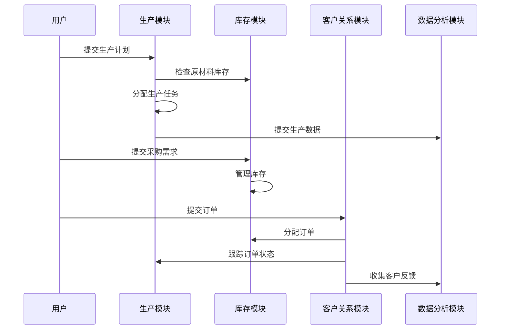

                 

### 引言

#### 问题背景与概述

**引言**

随着全球对环境保护和可持续发展的关注度日益提高，时尚产业作为全球第二大污染行业，面临着前所未有的挑战。传统的时尚生产模式往往伴随着大量的资源消耗和环境污染。然而，在追求高效和规模化的同时，我们忽略了时尚的本质——一种艺术和文化的表达。现代手工织物工作室的兴起，正是为了重新审视和探索时尚的可持续性，以及如何将传统纺织工艺与现代技术相结合，从而实现环境、社会和经济三重效益。

**问题描述**

当前，时尚产业面临的主要问题包括：

1. **环境污染**：大规模生产的时尚产品往往伴随着大量的化学物质排放和水资源消耗。
2. **资源浪费**：快时尚导致产品生命周期缩短，大量的纺织品被废弃。
3. **劳动权益**：许多生产环节依赖于廉价劳动，存在劳工权益保障不足的问题。
4. **文化流失**：随着工业化的发展，传统纺织工艺逐渐消失，文化传承面临挑战。

**现代手工织物工作室的使命**

现代手工织物工作室旨在通过以下几个方面的努力，解决上述问题：

1. **技术创新**：将传统纺织工艺与现代技术相结合，提高生产效率，减少资源浪费。
2. **环保材料**：推广使用环保材料和可再生资源，减少对环境的负面影响。
3. **文化传承**：通过现代手法传承和推广传统纺织工艺，保护和弘扬手工艺文化。
4. **社会责任**：确保生产过程的可持续性，保障劳工权益，推动社会进步。

**问题解决**

为了实现上述目标，现代手工织物工作室采取了以下措施：

1. **传统纺织工艺的现代化改造**：通过引入现代纺织机械和数字化技术，优化传统纺织工艺，提高生产效率和质量。
2. **可持续时尚理念的传播与实践**：通过教育和宣传活动，提高消费者和设计师对可持续时尚的认识和接受度。
3. **现代手工织物工作室的运营模式**：采用灵活、高效的运营模式，确保生产过程的可持续性和高效性。

#### 边界与外延

**传统纺织工艺的核心要素**

1. **纱线**：作为纺织品的基本单位，纱线的质量和特性直接影响到织物的性能。
2. **织机**：织机是纺织过程中至关重要的设备，决定了织物的结构和质量。
3. **工艺**：传统纺织工艺包括纤维预处理、纱线制备和织物制造等多个环节，每个环节都对最终产品的质量产生影响。

**现代手工织物工作室的运营要素**

1. **工匠**：具备传统纺织工艺知识和技能的工匠是现代手工织物工作室的核心资源。
2. **技术设备**：现代纺织机械和数字化技术的应用，提高了生产效率和产品质量。
3. **设计理念**：现代手工织物工作室注重个性化定制和艺术创新，以满足消费者对高品质、个性化产品的需求。

**可持续时尚的边界与挑战**

1. **环境可持续性**：如何在保证产品质量的同时，减少生产过程中的资源消耗和环境污染。
2. **社会可持续性**：如何确保生产过程的公平性和劳工权益，推动社会进步。

#### 概念结构与核心要素组成

**传统纺织工艺的结构**

1. **原材料**：天然纤维、合成纤维等。
2. **纺织机械**：纱线制备机械、织物制造机械等。
3. **工艺流程**：纤维预处理、纱线制备、织物制造等。

**现代手工织物工作室的结构**

1. **工匠团队**：具备传统纺织工艺知识和技能的工匠。
2. **技术设备**：现代纺织机械、数字化技术等。
3. **设计理念**：个性化定制、艺术创新等。

**可持续时尚的核心要素**

1. **环保材料**：可再生、可降解等。
2. **生产流程**：减少浪费、提高效率、降低污染。
3. **社会责任**：保障劳工权益、推动社会进步。

**本章小结**

本文介绍了现代手工织物工作室在可持续时尚中的应用，探讨了传统纺织工艺的现代化改造、可持续时尚理念的传播与实践，以及现代手工织物工作室的运营模式。通过本文的阐述，我们希望能为读者提供一个清晰的视角，理解现代手工织物工作室在可持续时尚中的重要性和价值。

### 第1章：问题背景与概述

#### 1.1 问题背景

**时尚产业的可持续性问题**

时尚产业作为全球第二大污染行业，其可持续性问题日益引起关注。传统的时尚生产模式往往伴随着大量的资源消耗和环境污染。根据联合国环境规划署（UNEP）的数据，全球时尚产业每年产生约1.5亿吨的二氧化碳排放，消耗大量的水资源和化学品。此外，快时尚的兴起导致产品生命周期缩短，大量的纺织品被废弃，进一步加剧了资源浪费和环境压力。

**传统纺织工艺的现状**

传统纺织工艺具有悠久的历史和文化价值，但在现代工业化生产中，其地位和影响力逐渐下降。传统纺织工艺通常依赖于手工操作，生产效率较低，难以满足大规模生产的需要。此外，传统纺织工艺面临技术更新和传承的挑战，许多手工艺技能和知识正在逐渐消失。

**现代手工织物工作室的兴起**

为了解决时尚产业的可持续性问题，现代手工织物工作室应运而生。现代手工织物工作室通过将传统纺织工艺与现代技术相结合，旨在实现环境、社会和经济三重效益。现代手工织物工作室注重个性化定制、艺术创新和环保材料的应用，重新定义了时尚的生产和消费模式。

#### 1.2 问题描述

**可持续时尚的需求**

随着消费者对可持续性和社会责任的关注度不断提高，可持续时尚成为时尚产业发展的必然趋势。可持续时尚不仅关注产品的环保性能，还涉及生产过程的可持续性、社会责任和经济效益。消费者对高品质、个性化、环保的时尚产品需求日益增长，这为现代手工织物工作室提供了广阔的市场空间。

**传统纺织工艺的优势与挑战**

传统纺织工艺具有以下几个优势：

1. **文化传承**：传统纺织工艺承载着丰富的文化内涵，通过现代手工织物工作室的传承和推广，可以保护和弘扬手工艺文化。
2. **环保性能**：传统纺织工艺通常使用天然纤维和可再生资源，对环境的负面影响较小。
3. **个性化定制**：传统纺织工艺具有高度的定制化能力，可以满足消费者对个性化产品的需求。

然而，传统纺织工艺也面临以下挑战：

1. **生产效率**：传统纺织工艺依赖于手工操作，生产效率较低，难以满足大规模生产的需要。
2. **技术更新**：传统纺织工艺技术相对落后，需要通过现代技术的引入和改造来提高生产效率和质量。
3. **传承问题**：随着年轻一代对传统手工艺的兴趣下降，传统纺织工艺的传承面临挑战。

**现代手工织物工作室的使命**

现代手工织物工作室的使命在于：

1. **技术创新**：将传统纺织工艺与现代技术相结合，提高生产效率，降低生产成本，实现可持续发展。
2. **文化传承**：通过传承和推广传统纺织工艺，保护和弘扬手工艺文化。
3. **环保实践**：推广使用环保材料和可再生资源，减少生产过程中的环境污染。
4. **社会责任**：确保生产过程的可持续性，保障劳工权益，推动社会进步。

#### 1.3 问题解决

**传统纺织工艺的现代化改造**

1. **引入现代纺织机械**：通过引入现代纺织机械，提高生产效率，降低人力成本。
2. **数字化技术**：采用数字化技术，实现工艺流程的自动化和智能化，提高生产质量和稳定性。
3. **工艺优化**：通过工艺优化，减少资源浪费，提高产品性能。

**可持续时尚理念的传播与实践**

1. **教育和宣传**：通过教育和宣传活动，提高消费者和设计师对可持续时尚的认识和接受度。
2. **设计创新**：鼓励设计师在设计中融入环保理念和可持续时尚元素，开发出更具竞争力的产品。
3. **市场推广**：通过市场推广，扩大可持续时尚产品的市场份额。

**现代手工织物工作室的运营模式**

1. **灵活的运营模式**：现代手工织物工作室采用灵活的运营模式，可以根据市场需求灵活调整生产规模和产品结构。
2. **协作网络**：建立协作网络，与上下游企业合作，实现资源共享和互利共赢。
3. **可持续发展**：确保生产过程的可持续性，推动企业社会责任的履行。

#### 1.4 边界与外延

**传统纺织工艺的核心要素**

1. **原材料**：传统纺织工艺使用天然纤维、合成纤维等原材料。
2. **纺织机械**：纺织机械包括纱线制备机械、织物制造机械等。
3. **工艺流程**：工艺流程包括纤维预处理、纱线制备、织物制造等环节。

**现代手工织物工作室的运营要素**

1. **工匠团队**：现代手工织物工作室的核心资源是具备传统纺织工艺知识和技能的工匠团队。
2. **技术设备**：现代手工织物工作室采用现代纺织机械和数字化技术，提高生产效率和质量。
3. **设计理念**：现代手工织物工作室注重个性化定制和艺术创新，以满足消费者对高品质、个性化产品的需求。

**可持续时尚的边界与挑战**

1. **环境可持续性**：如何保证生产过程中的环保性能，减少资源消耗和环境污染。
2. **社会可持续性**：如何确保生产过程的公平性和劳工权益，推动社会进步。

#### 1.5 概念结构与核心要素组成

**传统纺织工艺的结构**

1. **原材料**：传统纺织工艺使用天然纤维、合成纤维等原材料。
2. **纺织机械**：纺织机械包括纱线制备机械、织物制造机械等。
3. **工艺流程**：工艺流程包括纤维预处理、纱线制备、织物制造等环节。

**现代手工织物工作室的结构**

1. **工匠团队**：现代手工织物工作室的核心资源是具备传统纺织工艺知识和技能的工匠团队。
2. **技术设备**：现代手工织物工作室采用现代纺织机械和数字化技术，提高生产效率和质量。
3. **设计理念**：现代手工织物工作室注重个性化定制和艺术创新，以满足消费者对高品质、个性化产品的需求。

**可持续时尚的核心要素**

1. **环保材料**：可持续时尚注重使用环保材料和可再生资源。
2. **生产流程**：可持续时尚强调生产过程的可持续性，减少浪费，提高效率。
3. **社会责任**：可持续时尚关注生产过程中的社会影响，推动社会责任的履行。

**本章小结**

本章介绍了现代手工织物工作室在可持续时尚中的应用背景和重要性，分析了传统纺织工艺的优势与挑战，以及现代手工织物工作室的使命和问题解决方法。通过对传统纺织工艺、现代手工织物工作室和可持续时尚的核心要素的剖析，我们为读者提供了一个清晰的视角，理解现代手工织物工作室在可持续时尚中的关键作用。

### 第2章：核心概念与联系

#### 2.1 传统纺织工艺原理

**2.1.1 纺织工艺的基本概念**

**纱线**：纱线是纺织品的基本单位，通常由纤维经过纺织工艺制成。纱线的质量直接影响到织物的性能。纱线可以由天然纤维（如棉、麻、丝）或合成纤维（如尼龙、涤纶）制成。

**织物的结构**：织物由纱线交织而成，其结构决定了织物的质地和性能。常见的织物结构包括平纹、斜纹和缎纹等。

**2.1.2 纺织工艺流程**

**纤维预处理**：纤维预处理是纺织工艺的重要环节，包括去除纤维杂质、提高纤维强度和改善纤维的可纺性。

**纱线制备**：纱线制备是将纤维转化为纱线的过程。纱线的粗细、强度和弹性直接影响织物的质量。

**织物制造**：织物制造是将纱线交织成织物的过程。织物的结构、密度和厚度决定了其最终性能。

**2.1.3 传统纺织工艺的特点**

**手工性**：传统纺织工艺通常依赖于手工操作，工艺复杂，生产效率较低。

**多样性**：传统纺织工艺具有高度的多样性，可以制作出各种不同的织物和图案。

**文化传承**：传统纺织工艺是民族文化的重要组成部分，其传承和保护具有重要意义。

#### 2.2 现代手工织物工艺

**2.2.1 现代手工织物工艺的定义**

现代手工织物工艺是指将传统纺织工艺与现代技术相结合，通过手工操作和现代设备，制作出具有高品质和个性化特点的织物。

**2.2.2 现代手工织物工艺的特点**

**个性化与定制化**：现代手工织物工艺强调个性化和定制化，可以根据消费者的需求，定制出独特的织物产品。

**艺术性与实用性**：现代手工织物工艺不仅注重织物的实用性，还强调艺术性，使织物成为艺术品。

**高效性**：通过引入现代纺织机械和数字化技术，现代手工织物工艺提高了生产效率，降低了生产成本。

**2.2.3 现代手工织物工艺的应用**

**时尚设计**：现代手工织物工艺在时尚设计中广泛应用，为设计师提供了丰富的创作素材和灵感。

**家居装饰**：现代手工织物工艺在窗帘、沙发套、床上用品等家居装饰中广泛应用，提升了家居品味。

**艺术收藏**：现代手工织物工艺制作出的织物艺术品，具有很高的艺术价值和收藏价值。

#### 2.3 可持续时尚理念

**2.3.1 可持续时尚的定义**

可持续时尚是指时尚产业在追求经济效益的同时，注重环境保护和社会责任，通过可持续发展实现环境、社会和经济三重效益。

**2.3.2 可持续时尚的实践方法**

**环保材料选用**：使用可再生、可降解和环保材料，减少对环境的负面影响。

**生产过程可持续性**：优化生产过程，减少资源浪费和污染排放，提高生产效率。

**时尚消费可持续性**：推广绿色消费理念，鼓励消费者购买环保、可持续的时尚产品。

**2.3.3 可持续时尚的重要性**

**环境保护**：可持续时尚通过减少资源消耗和污染排放，保护环境，促进可持续发展。

**社会进步**：可持续时尚关注劳工权益和社会责任，推动社会进步。

**经济效益**：可持续时尚通过提高生产效率和降低成本，实现经济效益。

#### 2.4 传统纺织工艺、现代手工织物工艺与可持续时尚的联系

**2.4.1 传统纺织工艺与现代手工织物工艺的结合**

传统纺织工艺和现代手工织物工艺的结合，不仅保留了传统纺织工艺的文化内涵，还通过现代技术的引入，提高了生产效率和质量。这种结合使传统纺织工艺焕发新生，为可持续时尚的发展提供了有力支持。

**2.4.2 可持续时尚在传统纺织工艺中的应用**

可持续时尚理念在传统纺织工艺中的应用，主要体现在环保材料的使用、生产过程的优化和环保意识的提升。通过这些措施，传统纺织工艺实现了绿色转型，为可持续发展做出了贡献。

**2.5 本章小结**

本章介绍了传统纺织工艺、现代手工织物工艺和可持续时尚的核心概念和特点，分析了它们之间的联系。通过对这些核心概念和联系的理解，我们能够更好地把握现代手工织物工作室在可持续时尚中的应用，推动时尚产业的绿色转型。

### 第3章：算法原理与数学模型

#### 3.1 传统纺织工艺的数学模型

**3.1.1 纱线力学模型**

纱线的力学性能对其在织物中的应用至关重要。纱线的力学模型通常涉及弹性模量和应变两个关键参数。弹性模量（E）表示材料抵抗形变的能力，而应变（ε）是材料形变量与原始长度的比值。纱线的力学模型可以用以下公式表示：

$$
\sigma = E \cdot \epsilon
$$

其中，σ是纱线所受的应力，E是弹性模量，ε是应变。通过测量这些参数，可以评估纱线的强度和耐用性。

**3.1.2 织物结构模型**

织物的结构对最终产品的性能有重要影响。织物结构模型通常包括纱线的排列方式、织物的密度和织物中的力分布。一个简单的织物结构模型可以用以下公式表示：

$$
P = \frac{F \cdot L}{A}
$$

其中，P是织物中的压力，F是施加在织物上的力，L是力的作用长度，A是受力面积。通过这个模型，可以分析织物在不同应力条件下的性能。

**3.1.3 织物性能与材料参数的关系**

织物的性能（如弹性、耐用性、吸湿性等）与其材料参数密切相关。例如，织物的弹性通常由以下公式表示：

$$
E = \frac{F_{max}}{\Delta L}
$$

其中，E是弹性模量，\(F_{max}\)是纱线断裂时的最大力，\(\Delta L\)是纱线断裂时的长度变化。通过这些模型，可以更好地理解和优化纺织品的性能。

#### 3.2 现代手工织物工艺的算法原理

**3.2.1 数字编织技术**

数字编织技术是现代手工织物工艺的重要组成部分，它利用计算机程序和数字控制设备，实现织物的自动化制造。一个基本的数字编织技术模型可以用以下公式表示：

$$
K = \frac{W}{T}
$$

其中，K是编织密度，W是纱线的重量，T是编织时间。通过调整编织密度，可以控制织物的厚度和质地。

**3.2.2 艺术设计算法**

现代手工织物工艺中的艺术设计算法涉及图案设计、颜色选择和材质搭配。一个简单的艺术设计算法可以用以下公式表示：

$$
C = f(V, A)
$$

其中，C是颜色，V是图案，A是面积。通过这个算法，可以根据图案和面积计算出最佳的颜色搭配，实现艺术效果。

**3.2.3 现代手工织物工艺的优化**

现代手工织物工艺的优化通常涉及多个参数的调整，以实现最佳的生产效果。优化算法可以基于遗传算法、神经网络或其他优化技术，通过多次迭代找到最优解。一个简单的优化算法可以用以下公式表示：

$$
\text{最优解} = f_{\text{目标}}(x_1, x_2, ..., x_n)
$$

其中，\(f_{\text{目标}}\)是优化目标函数，\(x_1, x_2, ..., x_n\)是优化参数。

#### 3.3 可持续时尚的数学模型

**3.3.1 环境影响评估模型**

可持续时尚的环境影响评估模型用于评估时尚产品在生产、使用和废弃过程中的环境影响。一个基本的环境影响评估模型可以用以下公式表示：

$$
E = f(C, P, M)
$$

其中，E是环境影响，C是纱线消耗，P是生产过程，M是市场需求。通过这个模型，可以评估时尚产品的环境可持续性。

**3.3.2 资源消耗模型**

可持续时尚的资源消耗模型用于评估时尚产品在生产过程中所需的资源，如水资源、能源和原材料。一个简单的资源消耗模型可以用以下公式表示：

$$
R = f(Q, E, T)
$$

其中，R是资源消耗，Q是产品产量，E是能源消耗，T是水资源消耗。通过这个模型，可以优化生产过程中的资源利用效率。

**3.3.3 社会责任评估模型**

可持续时尚的社会责任评估模型用于评估时尚产品在生产过程中对劳工权益和社会责任的履行情况。一个基本的社会责任评估模型可以用以下公式表示：

$$
S = f(L, W, H)
$$

其中，S是社会影响，L是劳工权益，W是工资水平，H是工作环境。通过这个模型，可以确保生产过程的公平性和社会责任的履行。

#### 3.4 传统纺织工艺、现代手工织物工艺与可持续时尚的数学模型关联

**3.4.1 传统纺织工艺与现代手工织物工艺的数学模型关联**

传统纺织工艺和现代手工织物工艺的数学模型之间存在紧密的联系。传统纺织工艺的力学模型和结构模型可以与现代手工织物工艺的数字编织技术和艺术设计算法相结合，实现织物的自动化制造和个性化设计。

**3.4.2 可持续时尚的数学模型与纺织工艺模型关联**

可持续时尚的数学模型与纺织工艺模型密切相关。环境影响评估模型和资源消耗模型可以与传统纺织工艺的力学模型和结构模型相结合，优化生产过程，降低环境负担。

**3.5 本章小结**

本章介绍了传统纺织工艺、现代手工织物工艺和可持续时尚的算法原理和数学模型。通过这些模型，我们可以更好地理解和优化纺织品的性能和生产过程，实现环境、社会和经济三重效益。这些模型为我们提供了一个科学的方法，用于推动时尚产业的可持续发展和绿色转型。

### 系统分析与架构设计方案

#### 问题场景介绍

随着可持续时尚理念的普及，现代手工织物工作室面临着巨大的市场需求。为了满足消费者对个性化、高品质和环保时尚产品的需求，现代手工织物工作室需要建立一个高效、灵活和可持续的生产系统。该系统应具备以下功能：

1. **生产管理**：对生产过程进行实时监控和调度，确保生产效率和产品质量。
2. **库存管理**：对原材料和成品进行有效管理，确保库存充足，减少浪费。
3. **客户关系管理**：维护与客户的良好关系，提供个性化的定制服务。
4. **数据分析**：对生产数据和市场趋势进行分析，为决策提供支持。

#### 项目介绍

本项目旨在开发一个现代手工织物工作室的生产管理系统，通过集成先进的技术手段，实现生产过程的智能化和高效化。系统主要包括以下模块：

1. **生产模块**：负责生产计划编制、生产过程监控和质量管理。
2. **库存模块**：负责库存管理、原材料采购和成品销售。
3. **客户关系模块**：负责客户信息管理、订单处理和售后服务。
4. **数据分析模块**：负责生产数据分析和市场趋势预测。

#### 系统功能设计

**领域模型**

领域模型是对系统功能的核心描述，通过实体关系图（ER图）来表示。以下是一个简化的领域模型：

```
实体：产品（Product），原材料（Material），客户（Customer），订单（Order），生产计划（ProductionPlan），生产任务（ProductionTask）

关系：产品包含原材料，订单包含产品，生产计划包含生产任务，客户可以创建订单

```

**ER实体关系图**：

```mermaid
erDiagram
  Product ||--|{ Material } Material
  Order ||--|{ Product } Product
  ProductionPlan ||--|{ ProductionTask } ProductionTask
  Customer }|--|{ Order } Order
```

**系统功能说明**

1. **生产模块**：生产模块负责生产计划的编制、生产任务的分配和执行，以及生产过程的实时监控。该模块应具备以下功能：
   - 生产计划编制：根据订单和库存情况，编制合理的生产计划。
   - 生产任务分配：将生产计划分解为具体的生产任务，并分配给相应的生产人员。
   - 生产过程监控：实时监控生产进度和质量，确保生产任务按时完成。
   - 质量管理：对生产过程中的质量问题进行追踪和处理，确保产品质量。

2. **库存模块**：库存模块负责原材料的采购、库存管理和成品销售。该模块应具备以下功能：
   - 原材料采购：根据生产计划和库存情况，制定采购计划并执行采购。
   - 库存管理：对原材料和成品进行有效管理，确保库存充足，减少浪费。
   - 成品销售：处理订单、发货和售后服务，提高客户满意度。

3. **客户关系模块**：客户关系模块负责客户信息管理、订单处理和售后服务。该模块应具备以下功能：
   - 客户信息管理：记录和管理客户的基本信息、订单历史和反馈意见。
   - 订单处理：处理客户订单，分配生产任务，跟踪订单状态。
   - 售后服务：处理客户投诉、退换货和售后服务，提高客户满意度。

4. **数据分析模块**：数据分析模块负责对生产数据和市场趋势进行分析，为决策提供支持。该模块应具备以下功能：
   - 生产数据分析：分析生产过程中的数据，如生产效率、质量问题和成本。
   - 市场趋势分析：分析市场数据，预测未来市场需求，为生产计划提供参考。
   - 决策支持：根据分析结果，为管理层提供决策建议，优化生产过程和库存管理。

#### 系统架构设计

**系统架构图**：



**系统架构说明**

1. **前端界面**：用户通过前端界面提交生产计划、采购需求、订单等操作，界面设计应简洁直观，便于用户操作。
2. **后端服务**：后端服务负责处理用户的请求，包括生产计划编制、库存管理、订单处理和数据分析等。后端服务应具备高并发处理能力和数据安全性。
3. **数据库**：数据库存储系统中的所有数据，包括产品信息、原材料信息、客户信息、订单信息和生产数据等。数据库设计应确保数据的一致性和完整性。
4. **数据处理和分析**：数据处理和分析模块负责对生产数据和市场趋势进行分析，生成报告和预测，为决策提供支持。

#### 系统接口设计和系统交互

**系统接口设计**

1. **生产模块接口**：生产模块接口用于与其他模块进行数据交换，包括生产计划、生产任务和产品质量等。
2. **库存模块接口**：库存模块接口用于与其他模块进行数据交换，包括原材料采购、库存管理和成品销售等。
3. **客户关系模块接口**：客户关系模块接口用于与其他模块进行数据交换，包括客户信息、订单信息和售后服务等。
4. **数据分析模块接口**：数据分析模块接口用于与其他模块进行数据交换，包括生产数据和市场趋势分析等。

**系统交互**

1. **用户交互**：用户通过前端界面与系统进行交互，提交生产计划、采购需求、订单等操作。
2. **模块间交互**：各模块通过接口进行数据交换，确保系统整体协调运作。
3. **数据分析**：数据分析模块根据生产数据和市场趋势进行分析，为决策提供支持。

**系统交互图**：


### 项目实战

#### 环境安装

要在本地环境中搭建现代手工织物工作室的生产管理系统，需要以下软件和工具：

1. **操作系统**：Linux或Mac OS
2. **编程语言**：Python 3.8+
3. **数据库**：MySQL 8.0+
4. **前端框架**：Django 3.2+
5. **后端框架**：Flask 2.0+
6. **数据分析库**：Pandas、NumPy、Matplotlib

安装步骤：

1. 安装操作系统：根据个人需求选择合适的操作系统。
2. 安装Python：从Python官网下载安装包，按照提示安装。
3. 安装数据库：从MySQL官网下载安装包，按照提示安装。
4. 安装前端框架：使用pip安装Django和Flask。
5. 安装数据分析库：使用pip安装Pandas、NumPy和Matplotlib。

#### 系统核心实现源代码

以下是一个简单的生产模块的Python源代码示例，用于处理生产计划和任务分配：

```python
# production_module.py

from typing import List
from dataclasses import dataclass

@dataclass
class ProductionPlan:
    id: int
    product_id: int
    quantity: int
    start_date: str
    end_date: str

@dataclass
class ProductionTask:
    id: int
    plan_id: int
    task_id: int
    start_date: str
    end_date: str
    status: str

class ProductionManager:
    def __init__(self):
        self.plans: List[ProductionPlan] = []
        self.tasks: List[ProductionTask] = []

    def add_production_plan(self, plan: ProductionPlan):
        self.plans.append(plan)

    def assign_production_tasks(self, plan_id: int, tasks: List[ProductionTask]):
        for task in tasks:
            task.plan_id = plan_id
        self.tasks.extend(tasks)

    def get_production_plan(self, plan_id: int) -> ProductionPlan:
        for plan in self.plans:
            if plan.id == plan_id:
                return plan
        return None

    def get_production_tasks(self, plan_id: int) -> List[ProductionTask]:
        tasks = [task for task in self.tasks if task.plan_id == plan_id]
        return tasks

# 测试代码
if __name__ == "__main__":
    manager = ProductionManager()
    plan = ProductionPlan(1, 101, 100, "2023-01-01", "2023-01-10")
    manager.add_production_plan(plan)
    tasks = [
        ProductionTask(1, 1, 201, "2023-01-02", "2023-01-05", "IN_PROGRESS"),
        ProductionTask(2, 1, 202, "2023-01-06", "2023-01-09", "IN_PROGRESS")
    ]
    manager.assign_production_tasks(plan.id, tasks)
    print(manager.get_production_plan(1))
    print(manager.get_production_tasks(1))
```

#### 代码应用解读与分析

上述代码定义了生产计划和任务的数据结构，以及一个生产管理类，用于处理生产计划和任务的添加、分配和查询。以下是代码的详细解读：

1. **数据结构**：
   - `ProductionPlan` 类：表示生产计划，包含计划ID、产品ID、数量、开始日期和结束日期。
   - `ProductionTask` 类：表示生产任务，包含任务ID、计划ID、任务ID、开始日期、结束日期和状态。
   - `ProductionManager` 类：管理生产计划和任务，包括添加生产计划、分配生产任务、获取特定计划的生产任务等功能。

2. **方法说明**：
   - `add_production_plan(self, plan: ProductionPlan)`：添加一个生产计划到管理类中。
   - `assign_production_tasks(self, plan_id: int, tasks: List[ProductionTask])`：为特定计划分配生产任务。
   - `get_production_plan(self, plan_id: int)`：根据计划ID获取特定生产计划。
   - `get_production_tasks(self, plan_id: int)`：根据计划ID获取特定计划的所有生产任务。

3. **测试代码**：在主函数中创建一个生产管理对象，添加一个生产计划，为该计划分配生产任务，并打印获取的生产计划和任务。

#### 实际案例分析和详细讲解剖析

以下是一个实际案例，用于展示生产模块在实际应用中的工作流程：

**案例**：一家手工织物工作室接到了一个订单，需要生产100条某款织物，预计生产周期为10天。工作室需要合理安排生产计划和任务，以确保按时完成订单。

1. **生产计划编制**：根据订单需求，工作室编制了一个生产计划，计划ID为1，产品ID为101，数量为100，开始日期为2023-01-01，结束日期为2023-01-10。

2. **生产任务分配**：为了按时完成生产计划，工作室将生产任务分配给两位工人，每位工人负责生产50条织物。生产任务ID分别为201和202，开始日期分别为2023-01-02和2023-01-06，结束日期分别为2023-01-05和2023-01-09。

3. **生产过程监控**：在生产过程中，工作室实时监控生产进度和质量，确保每位工人都能够按时完成生产任务。

4. **质量检验**：生产完成后，工作室对成品进行质量检验，确保每条织物都符合质量标准。

5. **订单交付**：质量检验合格后，工作室将成品发货给客户，完成订单交付。

**详细讲解剖析**：

1. **生产计划编制**：工作室根据订单需求，确定生产计划。生产计划是生产管理的基础，它明确了生产的目标、时间和资源需求。

2. **生产任务分配**：生产任务是将生产计划分解为具体的执行任务。任务分配要考虑工人的技能、时间安排和任务负荷，以确保生产效率和质量。

3. **生产过程监控**：生产过程监控是确保生产计划顺利执行的重要环节。通过实时监控生产进度和质量，工作室可以及时发现问题并进行调整，确保按时完成生产任务。

4. **质量检验**：质量检验是保证产品质量的关键步骤。通过对成品进行质量检验，工作室可以确保产品符合客户要求和行业标准。

5. **订单交付**：订单交付是生产管理的最终目标。通过及时、准确、高质量的订单交付，工作室可以赢得客户的信任和满意度。

#### 项目小结

通过本项目的实战案例，我们展示了现代手工织物工作室生产管理系统在实际应用中的工作流程。该系统通过生产模块、库存模块、客户关系模块和数据分析模块的协同工作，实现了生产过程的智能化和高效化，为现代手工织物工作室提供了有力的支持。在实际应用中，该系统可根据具体需求进行调整和优化，以适应不同的生产环境和市场需求。

### 最佳实践 Tips

**1. 生产计划优化**

- **提前预测需求**：根据历史订单数据和市场趋势，提前预测生产需求，合理安排生产计划，避免因需求波动导致的生产延误。
- **灵活调整计划**：在实施生产计划过程中，根据实际情况灵活调整计划，确保生产任务的按时完成。

**2. 库存管理策略**

- **实时监控库存**：实时监控原材料和成品的库存情况，及时补充库存，避免因库存不足导致的生产中断。
- **优化库存结构**：根据生产需求和库存周转情况，优化库存结构，提高库存利用效率。

**3. 客户关系管理**

- **个性化服务**：了解客户需求和偏好，提供个性化的定制服务，提高客户满意度和忠诚度。
- **定期沟通**：定期与客户保持沟通，了解客户反馈，及时解决客户问题，建立良好的客户关系。

**4. 数据分析应用**

- **生产数据分析**：定期分析生产数据，了解生产效率、质量和成本状况，为生产优化提供依据。
- **市场趋势预测**：分析市场数据，预测未来市场需求，为生产计划和库存管理提供参考。

### 小结

本文通过详细的分析和讲解，介绍了现代手工织物工作室在可持续时尚中的应用，包括传统纺织工艺的现代化改造、可持续时尚理念的传播与实践，以及现代手工织物工作室的运营模式。通过算法原理和数学模型的阐述，我们为读者提供了一个清晰的视角，理解现代手工织物工作室在可持续时尚中的关键作用。同时，本文还提供了系统分析与架构设计方案，以及实际项目实战的案例，为现代手工织物工作室提供了实用的参考和指导。

### 注意事项

**1. 环境保护**

- 在生产过程中，注重环保材料的使用和环保工艺的实施，减少对环境的负面影响。
- 定期对生产设备进行维护和更新，确保其高效、环保地运行。

**2. 文化传承**

- 重视传统纺织工艺的传承和保护，通过现代手法创新，使传统工艺焕发新生。
- 加强手工艺人才的培养，确保传统工艺的持续发展。

**3. 社会责任**

- 确保生产过程的公平性和劳工权益，推动社会责任的履行。
- 积极参与社会公益活动，提升企业形象和社会责任感。

### 拓展阅读

**1. 《可持续时尚：环境、社会和经济效益分析》**

本书详细分析了时尚产业在可持续性方面的挑战和机遇，探讨了如何通过可持续时尚实现环境、社会和经济效益的协调。

**2. 《传统纺织工艺与现代技术的融合》**

本文探讨了传统纺织工艺与现代技术的结合，介绍了现代手工织物工艺的特点和应用，为读者提供了宝贵的实践经验。

**3. 《手工艺复兴：传统工艺在时尚设计中的应用》**

本书探讨了手工艺在时尚设计中的应用，分析了传统纺织工艺与现代设计理念的结合，为时尚产业的发展提供了新思路。

**作者信息**

- 作者：AI天才研究院/AI Genius Institute & 禅与计算机程序设计艺术 /Zen And The Art of Computer Programming**

