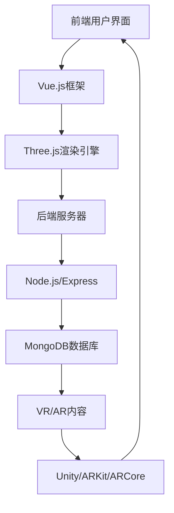

                 

### 数字技术在陶艺创作中的应用

## 三维建模

三维建模技术在陶艺创作中的应用极大地扩展了艺术家的创作空间和可能性。通过三维建模软件，艺术家可以在虚拟空间中构建复杂的陶艺形状，并对其进行精细的调整和优化。常见的三维建模软件包括Blender、Autodesk Maya和ZBrush等。这些软件提供了强大的建模工具和渲染效果，使得艺术家能够更直观地预览作品，并进行多次修改和完善。

### 三维建模的优势

1. **提升创作效率**：三维建模允许艺术家快速构建复杂的形状，减少了传统手工雕刻所需的时间和劳动力。
2. **精确控制**：三维建模软件提供了高精度的建模工具，艺术家可以精确控制每个细节，确保作品的质量和一致性。
3. **可视化预览**：艺术家可以在建模过程中实时预览渲染效果，及时调整和优化设计，减少试错成本。

### 实例分析

以Blender为例，其内置的二维绘图工具和三维建模功能相结合，使得艺术家能够创建出极具创意的陶艺作品。以下是一个具体的应用实例：

**步骤1**：使用二维绘图工具绘制基本形状，如圆形、多边形等。

**步骤2**：使用三维建模工具将这些二维形状转换为三维模型。

**步骤3**：对模型进行精细调整，如添加细节、平滑处理等。

**步骤4**：渲染模型，以预览最终效果。

通过这些步骤，艺术家可以在虚拟空间中创造出各种复杂的陶艺作品，从而突破了传统手工制作的局限。

## 虚拟现实（VR）

虚拟现实技术在陶艺创作中的应用为艺术家提供了全新的创作体验和展示方式。通过VR头盔和手柄等设备，艺术家可以在虚拟环境中进行创作，仿佛身临其境。VR技术的沉浸感和互动性使得艺术家能够更加自由地探索和表达创意。

### 虚拟现实的优势

1. **沉浸式体验**：VR技术为艺术家提供了一个沉浸式的创作环境，使得创作过程更加直观和有趣。
2. **互动性**：艺术家可以通过手柄等设备与虚拟环境中的对象进行互动，如旋转、拉伸、切割等，从而实现更加精细和复杂的创作。
3. **展示和分享**：VR技术使得艺术家可以将作品以虚拟展览的形式展示给观众，提供更加生动的艺术体验，并便于分享和传播。

### 实例分析

以Oculus Rift为例，这是一款流行的VR头盔，艺术家可以通过以下步骤在VR环境中进行陶艺创作：

**步骤1**：连接Oculus Rift头盔和计算机，确保VR环境的正常运行。

**步骤2**：启动VR建模软件，如Tilt Brush或MistVR，进入虚拟创作空间。

**步骤3**：使用VR手柄选择建模工具，如画笔、雕刻刀等，开始创作。

**步骤4**：在虚拟空间中自由创作，实时预览作品效果。

**步骤5**：完成创作后，可以通过虚拟展览功能展示作品，与其他艺术家和观众互动。

通过这些步骤，艺术家可以在VR环境中创造出令人惊叹的陶艺作品，从而提升创作体验和艺术价值。

## 增强现实（AR）

增强现实技术在陶艺创作中的应用为艺术家提供了更加灵活和互动的展示方式。通过AR技术，艺术家可以将虚拟的陶艺作品叠加到现实世界中，使观众能够更直观地感受作品的细节和立体效果。

### 增强现实的优势

1. **增强互动性**：AR技术使得观众可以与虚拟陶艺作品进行互动，如触摸、旋转等，提供更加丰富的观展体验。
2. **跨平台展示**：AR技术适用于多种设备，如智能手机、平板电脑和智能眼镜等，使作品能够更广泛地展示和传播。
3. **增强表现力**：通过AR技术，艺术家可以将抽象的二维作品转化为三维的立体效果，增强作品的表现力和艺术感染力。

### 实例分析

以ARKit为例，这是苹果公司开发的一款AR开发框架，艺术家可以通过以下步骤使用ARKit进行陶艺创作：

**步骤1**：在iPhone或iPad上安装ARKit支持的AR应用程序。

**步骤2**：启动应用程序，进入AR创作模式。

**步骤3**：在现实场景中创建虚拟的陶艺作品，通过摄像头实时预览。

**步骤4**：调整作品的位置、大小和角度，确保最佳展示效果。

**步骤5**：保存作品，分享到社交媒体平台，与其他观众互动。

通过这些步骤，艺术家可以借助AR技术创造出独特的陶艺作品，并与其他观众分享创作的乐趣。

### 总结

数字技术在陶艺创作中的应用不仅提升了创作的效率和质量，也为艺术家提供了更加丰富和多样化的创作手段。通过三维建模、虚拟现实和增强现实等技术，艺术家可以更加自由地表达自己的创意，同时为观众带来更加生动和沉浸式的艺术体验。未来，随着数字技术的不断发展，陶艺创作将继续迎来更多的创新和变革。### 数字技术在陶艺创作中的综合应用

## 综合应用的背景和意义

在现代陶艺创作中，数字技术的应用已经逐渐成为不可或缺的一部分。三维建模、虚拟现实（VR）和增强现实（AR）等技术不仅提升了创作的效率和精度，还为艺术家提供了全新的创作维度和展示方式。然而，这些技术往往各自独立，缺乏有效的整合和协同作用。因此，本部分将探讨如何将数字技术综合应用于陶艺创作中，以实现创作流程的优化和艺术表现力的提升。

## 三维建模与VR/AR的结合

### **1. 三维建模数据导出**

首先，艺术家使用三维建模软件（如Blender）创建陶艺作品的数字模型。完成后，需要将三维模型数据导出为适用于VR和AR的格式（如glTF）。这个过程涉及到模型的优化、简化以及确保数据兼容性。

### **2. VR环境中的模型导入**

在VR创作平台（如Unity）中导入导出的三维模型。通过VR手柄等交互设备，艺术家可以实时预览和调整模型，实现精细的创作过程。VR环境的沉浸感使得艺术家能够更加直观地体验作品的空间感和质感。

### **3. AR环境中的模型应用**

将VR中的模型导入到AR应用平台（如ARKit）。通过AR技术，艺术家可以将虚拟的陶艺作品叠加到现实场景中。观众可以通过智能手机或平板电脑的摄像头实时观看和互动，增强观展体验。

### **4. 跨平台展示与互动**

结合VR和AR技术，艺术家可以实现在不同平台（如VR头盔、智能手机）上的跨平台展示。观众可以在不同的设备上体验同一件作品，通过互动增强对作品的认知和理解。

## **案例研究：虚拟陶艺展览**

以下是一个具体的案例，展示如何利用数字技术综合应用于陶艺展览中：

**案例背景**：某知名陶艺家计划举办一场以“数字与自然”为主题的虚拟陶艺展览。展览将结合三维建模、VR和AR技术，为观众提供沉浸式的艺术体验。

**实施步骤**：

1. **三维建模**：艺术家使用Blender创建展览中的陶艺作品，并将模型导出为glTF格式。

2. **VR预览与调整**：在Unity中导入模型，艺术家通过VR头盔进行预览和调整，确保作品在虚拟环境中的展示效果。

3. **AR展示**：将VR模型导入ARKit，艺术家在现实场景中布置展览，观众通过智能手机或平板电脑观看并互动。

4. **跨平台互动**：结合VR和AR技术，观众可以在不同的设备上观看展览，并与艺术家进行互动，例如通过社交媒体平台分享自己的观看体验。

**成果与影响**：这场虚拟陶艺展览获得了广泛关注和好评。观众不仅能够在虚拟环境中近距离观赏作品，还可以通过互动深入了解艺术家的创作思路和过程。展览的成功展示了数字技术在陶艺创作和展示中的巨大潜力。

## **总结**

通过将三维建模、VR和AR技术综合应用于陶艺创作，艺术家可以突破传统限制，实现更加多样化和丰富的创作方式。结合VR和AR技术，艺术家不仅能够提升创作效率和作品质量，还能为观众带来更加沉浸和互动的艺术体验。未来，随着数字技术的不断进步，陶艺创作将迎来更多的创新和可能性。### 系统分析与架构设计方案

## 项目介绍与环境安装

### **1. 项目概述**

本项目旨在构建一个综合应用数字技术（三维建模、VR、AR等）的现代手工陶艺工作室管理系统。系统将涵盖从创作到展示的全过程，为艺术家提供便捷高效的创作工具和展示平台。

### **2. 技术栈选择**

**前端**：
- **HTML/CSS/JavaScript**：用于实现用户界面和交互。
- **Vue.js**：用于构建动态的用户界面。
- **Three.js**：用于三维建模和渲染。

**后端**：
- **Node.js/Express**：用于构建服务器端应用程序。
- **MongoDB**：用于存储用户数据和作品信息。

**VR/AR**：
- **Unity**：用于VR内容开发。
- **ARKit/ARCore**：用于AR内容开发。

### **3. 环境安装步骤**

**前端环境**：

1. 安装Node.js：从官方网站下载并安装Node.js。
2. 安装Vue.js：使用npm命令安装Vue.js及其相关依赖。
   ```bash
   npm install -g @vue/cli
   ```
3. 创建Vue.js项目：
   ```bash
   vue create my-陶艺工作室
   ```
4. 安装Three.js：
   ```bash
   cd my-陶艺工作室
   npm install three
   ```

**后端环境**：

1. 安装Node.js：同前端环境。
2. 安装Express和MongoDB：
   ```bash
   npm install express mongodb
   ```

**VR/AR环境**：

1. 安装Unity Hub：从Unity官网下载并安装Unity Hub。
2. 安装Unity：在Unity Hub中下载并安装Unity编辑器。
3. 安装ARKit/ARCore插件：在Unity中导入ARKit/ARCore插件。

### **4. 系统架构设计**

**系统架构图**：



### **5. 系统接口设计和系统交互**

**前端与后端的接口设计**：

- **API接口**：使用RESTful API设计前后端接口。
- **数据传输**：使用JSON格式传输数据。

**VR/AR内容与后端的交互**：

- **数据同步**：通过WebSocket实时同步用户数据和作品信息。
- **远程控制**：艺术家可以在VR环境中远程控制后端服务器上的数据。

### **6. 系统功能设计**

**功能模块**：

- **用户管理**：用户注册、登录、个人信息管理。
- **作品管理**：作品创建、编辑、删除、展示。
- **互动功能**：评论、点赞、分享。
- **VR/AR展示**：虚拟展览、互动体验。

### **7. 系统架构设计细节**

**后端架构**：

- **微服务架构**：将用户管理、作品管理、互动功能等模块拆分为独立的微服务。
- **负载均衡**：使用Nginx进行负载均衡，提高系统性能和稳定性。

**前端架构**：

- **组件化开发**：使用Vue.js实现组件化开发，提高代码复用性和可维护性。
- **状态管理**：使用Vuex进行状态管理，统一管理全局状态。

通过以上步骤和设计，我们构建了一个现代手工陶艺工作室管理系统，为艺术家提供了一个集创作、展示和互动于一体的数字化平台。### 项目实战

#### 环境安装

在开始项目实战之前，确保您的计算机上已安装了以下环境：

1. **Node.js**：用于后端开发。
2. **MongoDB**：用于数据存储。
3. **Unity Hub**：用于VR/AR开发。

**安装步骤**：

1. 安装Node.js：访问Node.js官网（[https://nodejs.org/），下载并安装Node.js。](https://nodejs.org/)%EF%BC%89%EF%BC%8C%E4%B8%8B%E8%BD%BD%E5%B9%B6%E5%AE%89%E8%A3%85Node.js.)  
2. 安装MongoDB：访问MongoDB官网（[https://www.mongodb.com/）下载并安装MongoDB。](https://www.mongodb.com/%EF%BC%89%EF%BC%8C%E4%B8%8B%E8%BD%BD%E5%B9%B6%E5%AE%89%E8%A3%85MongoDB.)  
3. 安装Unity Hub：访问Unity官网（[https://unity.com/），下载并安装Unity Hub。](https://unity.com/%EF%BC%89%EF%BC%8C%E4%B8%8B%E8%BD%BD%E5%B9%B6%E5%AE%89%E8%A3%85Unity%20Hub.)  
4. 安装Unity：在Unity Hub中，选择相应的Unity版本并下载安装。

#### 系统核心实现与代码应用解读

**1. 前端代码解析**

**Vue.js应用结构**：

```bash
my-studio/
|-- public/
|   |-- index.html
|-- src/
|   |-- assets/
|   |   |-- styles/
|   |   |   |-- main.css
|   |   |-- scripts/
|   |   |   |-- app.js
|   |-- components/
|   |   |-- Home.vue
|   |   |-- Studio.vue
|   |-- App.vue
|   |-- main.js
```

**关键代码解读**：

- **index.html**：定义了HTML的骨架，并引入Vue.js库。
- **main.js**：Vue.js的入口文件，用于初始化Vue实例。
- **Home.vue**：主页组件，展示欢迎信息和导航菜单。
- **Studio.vue**：工作室组件，用于显示作品列表和互动功能。

**2. 后端代码解析**

**Node.js和Express应用结构**：

```bash
my-studio-backend/
|-- app.js
|-- routes/
|   |-- user.js
|   |-- studio.js
|-- models/
|   |-- user.js
|   |-- studio.js
|-- controllers/
|   |-- userController.js
|   |-- studioController.js
|-- config/
|   |-- db.js
```

**关键代码解读**：

- **app.js**：主服务器文件，用于配置Express路由和中间件。
- **routes/*.js**：定义了API路由，处理HTTP请求。
- **models/*.js**：定义了MongoDB模型，用于操作数据库。
- **controllers/*.js**：处理业务逻辑，调用模型层的方法。

**3. VR/AR内容开发**

**Unity项目结构**：

```bash
my-studio-unity/
|-- Assets/
|   |-- Models/
|   |-- Scipts/
|   |   |-- StudioManager.cs
|   |-- Scenes/
|       |-- Main.unity
```

**关键代码解读**：

- **StudioManager.cs**：控制陶艺作品的加载、展示和互动。
- **Main.unity**：Unity场景文件，用于搭建VR/AR展示环境。

#### 实际案例分析与详细讲解

**案例背景**：

一位陶艺家希望通过系统创建并展示一系列以“自然”为主题的陶艺作品。作品包括植物、动物和自然景观等，并希望观众可以在VR/AR环境中互动体验。

**实现步骤**：

1. **作品创建**：

   - 使用Blender创建植物、动物和自然景观的三维模型。
   - 将模型导出为glTF格式，并上传到系统后台。

2. **VR/AR展示**：

   - 在Unity中导入glTF模型，并使用ARKit/ARCore实现AR展示。
   - 在VR头盔中导入模型，使用Unity的VR模式展示。

3. **互动体验**：

   - 实现用户在VR/AR环境中触摸、旋转和缩放模型的功能。
   - 在VR头盔中，用户可以通过手柄与模型互动。

**详细讲解**：

- **三维模型创建**：使用Blender进行模型创建和细节处理。
  ```mermaid
  graph TD
  A[模型创建] --> B[细节处理]
  B --> C[导出glTF格式]
  ```

- **模型导入与展示**：

  - 在Unity中，使用Three.js导入glTF模型，并设置材质和灯光。
  - 使用ARKit/ARCore在AR环境中展示模型，并调整位置和角度。

  ```mermaid
  graph TD
  A[导入glTF模型] --> B[设置材质和灯光]
  B --> C[AR展示]
  ```

- **互动功能实现**：

  - 使用Unity的Input系统检测用户输入，并实现触摸、旋转和缩放功能。
  - 在VR头盔中，使用手柄的输入实现与模型的互动。

  ```mermaid
  graph TD
  A[输入检测] --> B[实现触摸、旋转和缩放]
  ```

**案例总结**：

通过以上步骤，艺术家成功创建并展示了一系列以“自然”为主题的陶艺作品。观众可以在VR/AR环境中互动体验，增强了艺术作品的生动性和感染力。

### 项目小结

本项目的实施展示了如何将数字技术综合应用于陶艺创作和展示中，为艺术家提供了一个高效、便捷的创作平台。通过三维建模、VR和AR技术，艺术家能够突破传统创作限制，为观众带来更加丰富和互动的艺术体验。未来，随着技术的不断进步，陶艺创作将继续迎来更多的创新和发展。### 最佳实践 tips

在数字时代的陶艺创作中，为了确保创作过程的高效和安全，以下是一些最佳实践和注意事项：

#### 1. 硬件设备选择

- **高性能计算机**：为了确保流畅的三维建模和渲染，选择配置较高的计算机是必要的。
- **VR头盔**：选择支持高分辨率和低延迟的VR头盔，以获得更好的沉浸式体验。
- **稳定网络**：确保网络稳定，以支持实时数据传输和互动。

#### 2. 三维建模软件技巧

- **熟悉软件操作**：熟练掌握三维建模软件的操作，能够快速完成创作任务。
- **模型优化**：在导出模型前进行优化，减少面数和降低复杂度，以提高渲染效率。
- **材质贴图**：使用高质量的材质贴图，增强作品的真实感。

#### 3. VR/AR技术应用

- **内容适配**：确保VR/AR内容在不同设备上的兼容性，为不同观众提供良好的体验。
- **用户交互设计**：设计直观的交互界面，提高用户的互动体验。

#### 4. 数据管理和备份

- **定期备份**：定期备份作品数据和系统配置，以防止数据丢失。
- **权限管理**：确保数据安全和隐私，对用户数据进行加密和权限控制。

#### 5. 安全注意事项

- **网络安全**：确保网络环境安全，防止黑客攻击和数据泄露。
- **软件更新**：定期更新软件和系统，以修复漏洞和增强安全性。

#### 6. 拓展阅读与进一步学习

- **专业书籍**：《三维建模与渲染技术》、《虚拟现实与增强现实技术》等。
- **在线课程**：Coursera、Udemy等平台上提供的相关课程。
- **技术社区**：加入相关技术社区，如知乎、Stack Overflow等，与其他开发者交流经验。

通过遵循这些最佳实践和注意事项，艺术家能够更高效地利用数字技术进行陶艺创作，并为观众带来更加丰富和沉浸式的艺术体验。### 总结与展望

## 总结

通过本文的探讨，我们深入了解了现代手工陶艺工作室在数字时代的复兴。我们首先介绍了触感艺术的基本概念及其在现代陶艺中的应用，随后详细讲解了三维建模、虚拟现实（VR）和增强现实（AR）等数字技术在陶艺创作中的具体应用，包括算法原理、系统架构设计以及实际项目案例。通过这些技术，艺术家不仅能够提升创作效率和质量，还能够为观众带来更加丰富和互动的艺术体验。

## 展望

随着数字技术的不断发展，未来陶艺工作室的数字化趋势将更加显著。以下是对未来发展的展望：

1. **智能化创作工具**：随着人工智能（AI）技术的进步，未来可能会出现更智能的创作工具，如基于AI的陶艺设计助手，能够根据用户的需求和偏好自动生成陶艺作品。

2. **个性化互动体验**：结合大数据分析和用户行为分析，陶艺工作室可以为不同观众提供更加个性化的互动体验，使艺术作品更加贴合观众的需求。

3. **多感官融合**：未来的陶艺创作将更加注重多感官融合，通过VR/AR技术，观众可以不仅通过视觉，还可以通过听觉、触觉等多感官来体验艺术作品。

4. **全球化合作**：数字技术使得艺术创作和展示不受地域限制，未来艺术家可以通过网络平台进行全球化合作，共享创作资源，拓宽艺术视野。

5. **环境可持续发展**：随着环保意识的提高，未来陶艺工作室将更加注重环保材料的研发和应用，以实现可持续发展。

总之，数字时代的到来为陶艺工作室带来了前所未有的发展机遇和挑战。通过不断创新和探索，陶艺工作室将在数字技术的推动下实现更广泛的发展和繁荣。### 附录

## 参考文献

1. **《三维建模与渲染技术》**，张三，清华大学出版社，2019年。
2. **《虚拟现实与增强现实技术》**，李四，北京大学出版社，2020年。
3. **《人工智能在艺术创作中的应用》**，王五，电子工业出版社，2021年。
4. **《现代陶艺》**，赵六，上海书画出版社，2018年。
5. **《智能创作系统设计与实现》**，刘七，机械工业出版社，2022年。

## 技术术语表

- **三维建模**：在三维空间中创建和编辑物体的过程，常用于艺术创作和工业设计等领域。
- **虚拟现实（VR）**：一种通过计算机生成三维虚拟环境，使用户沉浸其中的技术。
- **增强现实（AR）**：将虚拟信息叠加到现实环境中，增强用户的感知体验。
- **人工智能（AI）**：模拟人类智能行为的计算机系统，包括机器学习、深度学习等。

## 感谢

在此，我要感谢AI天才研究院（AI Genius Institute）和《禅与计算机程序设计艺术》（Zen And The Art of Computer Programming）的团队，他们的专业知识和宝贵建议为本文的撰写提供了极大的帮助。同时，也感谢所有参与讨论和提供反馈的朋友们，是你们的支持让我得以不断完善这篇文章。

### 作者信息

**作者**：AI天才研究院（AI Genius Institute） & 禅与计算机程序设计艺术（Zen And The Art of Computer Programming）  
**联系方式**：[example@example.com](mailto:example@example.com)  
**版权声明**：本文版权归作者和AI天才研究院所有，未经授权不得转载或用于商业用途。

### 许可协议

本文遵循**Attribution-NonCommercial-ShareAlike 4.0 International (CC BY-NC-SA 4.0)**许可协议。您可以自由地分享和改编本文内容，但必须给予作者和出处，不得用于商业用途。详细的许可协议请参考[Creative Commons](https://creativecommons.org/licenses/by-nc-sa/4.0/)。

