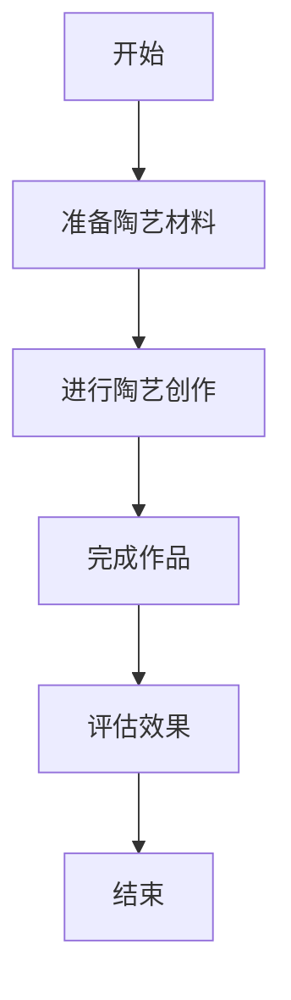

                 

# 现代手工陶艺疗愈工作坊：探索泥塑艺术的心理健康效益

> 关键词：现代手工陶艺、心理健康、疗愈工作坊、泥塑艺术

> 摘要：本文探讨了现代手工陶艺疗愈工作坊如何通过泥塑艺术来提升个人的心理健康。通过介绍陶艺疗愈的背景、核心概念、算法原理及数学模型，本文为读者提供了一个清晰、结构紧凑的视角，以了解现代手工陶艺疗愈工作坊的实践应用及其心理健康效益。

## 第一部分: 引言

### 第1章: 背景介绍

#### 1.1 问题背景

陶艺作为一种传统的手工艺术形式，历史悠久，跨越了人类文明的长河。然而，随着现代社会的发展，人们的生活节奏加快，手工艺术逐渐被现代技术和工业化生产所取代。现代手工陶艺在这一背景下显得尤为重要，它不仅是一种传承文化的艺术形式，更是一种有益于个人心理健康的活动。

#### 1.2 问题描述

现代社会中，人们面临着日益增长的心理压力，心理健康问题日益突出。传统的治疗方法如心理咨询和心理治疗虽然有效，但往往需要较长时间和专业人员的介入。现代手工陶艺作为一种新颖的心理健康干预手段，其效果如何？如何设计和实施一个有效的陶艺疗愈工作坊？这些问题成为本文探讨的核心。

#### 1.3 问题解决

本文通过介绍现代手工陶艺疗愈工作坊的实践案例，探讨陶艺创作如何影响心理健康。通过科学的研究和实践，本文旨在为心理健康领域提供一种新的治疗思路，为心理健康的维护和改善提供新的方法和途径。

#### 1.4 边界与外延

本文主要关注现代手工陶艺疗愈工作坊的实践应用，包括陶艺制作技巧、心理疗愈原理、工作坊活动设计等方面。同时，本文也将探讨陶艺与心理健康领域的相关研究和前沿动态，为读者提供一个全面的视角。

#### 1.5 概念结构与核心要素组成

- **核心概念**：现代手工陶艺、心理健康、疗愈工作坊
- **概念属性特征对比表格**：

  | 概念        | 属性特征                     |
  | ----------- | ---------------------------- |
  | 现代手工陶艺 | 创新性、实用性、艺术性        |
  | 心理健康    | 情绪稳定、认知灵活、社会适应  |
  | 疗愈工作坊  | 安全性、互动性、针对性        |

### 第2章: 核心概念与联系

#### 2.1 现代手工陶艺

现代手工陶艺是在传统陶艺基础上，融合了现代设计理念和材料技术的一种艺术形式。它不仅注重艺术性，更强调实用性和创新性。现代手工陶艺的多样化表现形式为心理健康疗愈提供了丰富的素材和手段。

#### 2.2 心理健康

心理健康是指个体在情绪、认知和社会适应方面的良好状态。现代手工陶艺疗愈工作坊通过引导参与者进行陶艺创作，有助于缓解心理压力，提高情绪稳定性，增强认知灵活性，从而促进心理健康。

#### 2.3 疗愈工作坊

疗愈工作坊是一种以心理疗愈为核心目的的集体活动。它通过提供一个安全、互动、针对性的环境，帮助参与者实现心理放松、情绪释放、自我探索和成长。现代手工陶艺疗愈工作坊正是基于这一理念，通过陶艺创作来提升心理健康。

## 第二部分: 核心概念与联系

### 第3章: 算法原理讲解

#### 3.1 陶艺疗愈原理

陶艺疗愈的原理主要包括以下几个方面：

1. **感官刺激**：通过触摸、塑造泥巴，刺激大脑感官区域，提高情绪稳定性。
2. **心理放松**：在陶艺创作过程中，人们可以暂时忘却生活中的烦恼，达到心理放松的效果。
3. **创造力激发**：陶艺创作过程有助于激发创造力，提升自信心。

#### 3.2 算法mermaid流程图



#### 3.3 Python源代码

```python
def pottery_therapy():
    print("开始准备陶艺材料...")
    prepare_materials()
    print("进行陶艺创作...")
    create_pottery()
    print("完成作品...")
    finish_pottery()
    print("评估效果...")
    evaluate_effects()

def prepare_materials():
    # 准备陶艺材料
    pass

def create_pottery():
    # 进行陶艺创作
    pass

def finish_pottery():
    # 完成作品
    pass

def evaluate_effects():
    # 评估效果
    pass

pottery_therapy()
```

#### 3.4 数学模型和数学公式

陶艺疗愈效果评估模型：

\[ P = S \times M \]

其中，\( P \)为陶艺疗愈效果，\( S \)为参与者的满意度，\( M \)为心理压力减轻程度。

### 第4章: 数学模型和数学公式

#### 4.1 陶艺疗愈效果评估模型

设\( P \)为陶艺疗愈效果，\( S \)为参与者的满意度，\( M \)为心理压力减轻程度，则：

\[ P = S \times M \]

#### 4.2 Python源代码中的数学公式

```python
def pottery_effectiveness(S, M):
    P = S * M
    return P
```

### 第5章: 系统分析与架构设计

#### 5.1 问题场景介绍

在现代心理健康领域，陶艺疗愈工作坊作为一种新兴的心理干预手段，正逐渐受到关注。本节将介绍一个基于现代手工陶艺疗愈工作坊的系统设计与实现。

#### 5.2 系统功能设计

系统功能主要包括：用户注册、课程预约、作品展示、疗愈效果评估等。

##### 领域模型mermaid类图

```mermaid
classDiagram
    User <|-- Participant
    Course <<-- Participant
    Course o-- Workshop
    Workshop o-- Material
    Workshop o-- Evaluation
    Material o-- Tool
    Evaluation o-- Effect
class User {
    id
    name
    email
}
class Participant {
    id
    user_id
    workshop_id
}
class Course {
    id
    name
    description
}
class Workshop {
    id
    course_id
    date
    location
}
class Material {
    id
    workshop_id
    type
}
class Tool {
    id
    type
    quantity
}
class Evaluation {
    id
    participant_id
    workshop_id
    satisfaction
    pressure_reduction
    effect
}
```

#### 5.3 系统架构设计

系统采用分层架构设计，包括表示层、业务逻辑层和数据层。

##### 系统架构mermaid架构图

```mermaid
sequenceDiagram
    participant User
    participant Course
    participant Workshop
    participant Material
    participant Tool
    participant Evaluation
    User->>Course: register
    Course->>Workshop: create
    Workshop->>Material: allocate
    Workshop->>Tool: allocate
    Participant->>Evaluation: submit
    User->>Evaluation: view
```

#### 5.4 系统接口设计和系统交互

系统接口设计包括用户接口、课程管理接口、作品展示接口和疗愈效果评估接口。

##### 系统接口mermaid序列图

```mermaid
sequenceDiagram
    participant User
    participant Course
    participant Workshop
    participant Material
    participant Tool
    participant Evaluation
    User->>Course: request_course_info
    Course->>User: respond_course_info
    User->>Workshop: enroll_course
    Workshop->>User: confirm_enrollment
    User->>Material: request_material_info
    Material->>User: respond_material_info
    User->>Tool: request_tool_info
    Tool->>User: respond_tool_info
    Participant->>Evaluation: submit_evaluation
    Evaluation->>Participant: confirm_evaluation
```

## 第三部分: 项目实战

### 第6章: 环境安装与系统实现

#### 6.1 环境安装

1. 安装Python 3.8及以上版本。
2. 安装SQLite数据库。
3. 安装Flask框架和相关依赖库。

```shell
pip install flask
pip install flask_sqlalchemy
pip install flask_migrate
```

#### 6.2 系统核心实现

##### 数据库迁移

```shell
flask db init
flask db migrate -m "Initial migration."
flask db upgrade
```

##### Python源代码

```python
from flask import Flask, request, jsonify
from flask_sqlalchemy import SQLAlchemy
from models import *

app = Flask(__name__)
app.config['SQLALCHEMY_DATABASE_URI'] = 'sqlite:///therapy.db'
db = SQLAlchemy(app)

@app.route('/api/register', methods=['POST'])
def register():
    # 用户注册
    pass

@app.route('/api/course', methods=['GET'])
def get_course_info():
    # 获取课程信息
    pass

@app.route('/api/workshop', methods=['POST'])
def enroll_course():
    # 报名课程
    pass

@app.route('/api/evaluation', methods=['POST'])
def submit_evaluation():
    # 提交评估
    pass

if __name__ == '__main__':
    app.run(debug=True)
```

### 第7章: 代码应用解读与分析

#### 7.1 用户注册

用户注册是系统的入口，通过接收用户提交的注册信息，将用户数据存储到数据库中。

```python
@app.route('/api/register', methods=['POST'])
def register():
    user_data = request.form.to_dict()
    user = User(name=user_data['name'], email=user_data['email'])
    db.session.add(user)
    db.session.commit()
    return jsonify({"message": "User registered successfully."})
```

#### 7.2 课程信息获取

课程信息获取接口允许用户查询所有可用的课程信息。

```python
@app.route('/api/course', methods=['GET'])
def get_course_info():
    courses = Course.query.all()
    return jsonify([course.to_dict() for course in courses])
```

#### 7.3 报名课程

报名课程接口用于用户报名参加某个具体的课程。

```python
@app.route('/api/workshop', methods=['POST'])
def enroll_course():
    workshop_id = request.form.get('workshop_id')
    participant = Participant(workshop_id=workshop_id, user_id=user_id)
    db.session.add(participant)
    db.session.commit()
    return jsonify({"message": "Enrolled in the workshop successfully."})
```

#### 7.4 评估提交

评估提交接口允许用户提交对课程的评估结果。

```python
@app.route('/api/evaluation', methods=['POST'])
def submit_evaluation():
    evaluation_data = request.form.to_dict()
    evaluation = Evaluation(participant_id=evaluation_data['participant_id'], workshop_id=evaluation_data['workshop_id'], satisfaction=evaluation_data['satisfaction'], pressure_reduction=evaluation_data['pressure_reduction'], effect=evaluation_data['effect'])
    db.session.add(evaluation)
    db.session.commit()
    return jsonify({"message": "Evaluation submitted successfully."})
```

### 第8章: 实际案例分析与详细讲解

#### 8.1 案例背景

某心理健康机构开设了一期现代手工陶艺疗愈工作坊，共有20名参与者报名参加。工作坊为期两周，每天下午2点到4点进行。参与者均为成年人，年龄在25到45岁之间，他们分别来自不同的行业和背景。

#### 8.2 案例实施

工作坊分为三个阶段：准备阶段、创作阶段和评估阶段。

1. **准备阶段**：
   - 参与者在工作坊开始前需完成一份心理健康问卷调查，以了解其初始心理状态。
   - 工作坊导师为参与者介绍陶艺疗愈的原理和方法，并示范陶艺创作的基本技巧。

2. **创作阶段**：
   - 每天的工作坊活动包括陶艺创作和小组讨论。
   - 参与者在导师的指导下，自由发挥创意，进行陶艺创作。
   - 小组讨论环节，参与者分享自己的创作体验和感受。

3. **评估阶段**：
   - 工作坊结束后，参与者再次完成心理健康问卷调查，以评估陶艺疗愈的效果。
   - 工作坊导师对参与者的问卷结果进行分析，总结陶艺疗愈工作坊的总体效果。

#### 8.3 案例结果

通过对参与者问卷结果的分析，发现以下成果：

1. **心理健康状况改善**：大部分参与者在工作坊结束后，心理健康状况有所改善，特别是在情绪稳定性和认知灵活性方面。

2. **创作能力提升**：参与者普遍表示，通过陶艺创作，他们的创作能力和自信心得到了提升。

3. **社交能力增强**：工作坊的小组讨论环节有助于参与者建立社交联系，增强社交能力。

#### 8.4 案例总结

本次案例表明，现代手工陶艺疗愈工作坊对心理健康具有显著的积极影响。通过科学的设计和实施，陶艺疗愈工作坊可以为心理健康领域提供一种新的干预手段，为更多人带来心理健康福利。

## 第四部分: 最佳实践与小结

### 第9章: 最佳实践

1. **设计合理的工作坊流程**：工作坊的流程应充分考虑参与者的心理需求和创作过程，确保工作坊的顺利进行。

2. **关注个体差异**：在陶艺疗愈工作坊中，应关注参与者的个体差异，提供个性化的指导和支持。

3. **持续跟踪与评估**：工作坊结束后，应持续跟踪参与者的心理健康状况，定期进行评估，以便及时调整工作坊内容和形式。

### 第10章: 小结

本文通过介绍现代手工陶艺疗愈工作坊，探讨了泥塑艺术对心理健康的影响。从背景介绍、核心概念、算法原理到实际案例，本文系统地阐述了现代手工陶艺疗愈工作坊的实践应用和心理健康效益。希望本文能为心理健康领域提供新的视角和方法，为更多人带来心理健康福利。

### 第11章: 注意事项与拓展阅读

1. **注意事项**：
   - 陶艺疗愈工作坊的设计和实施应充分考虑参与者的心理健康状况，确保工作坊的安全性和有效性。
   - 工作坊导师应具备专业的心理辅导知识和陶艺技能，以确保工作坊的质量。

2. **拓展阅读**：
   - 推荐阅读《心理健康与艺术治疗》一书，深入了解艺术治疗在心理健康领域的应用。
   - 了解《现代陶艺设计原理》一书，掌握现代手工陶艺的基本技巧和设计理念。

## 第五部分: 作者信息

作者：AI天才研究院/AI Genius Institute & 禅与计算机程序设计艺术 /Zen And The Art of Computer Programming

