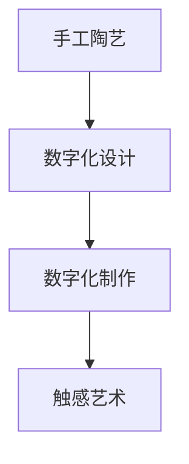

                 

## 现代手工陶艺：触感艺术在数字时代的复兴

### 关键词：手工陶艺、数字技术、触感艺术、复兴、融合

> 摘要：随着数字技术的飞速发展，手工陶艺这一传统艺术形式正经历着一场前所未有的复兴。本文将深入探讨数字技术在手工陶艺制作中的应用，分析其带来的变革，探讨触感艺术在数字时代的复兴路径。我们将通过逐步分析，揭示现代手工陶艺与数字技术融合的奥秘，为读者提供一场关于触感艺术的深度探索。

### 背景介绍

#### 1.1 数字时代下的陶艺复兴

在数字时代，信息技术迅猛发展，不断推动着各个行业的创新和变革。手工陶艺，作为一种古老而独特的艺术形式，在这一背景下焕发出新的生机。数字技术的引入，为手工陶艺带来了前所未有的可能性，推动了陶艺的复兴。

#### 1.2 手工陶艺与数字化技术的结合

手工陶艺与数字化技术的结合，主要体现在以下几个方面：

1. **数字化设计工具**：利用CAD（计算机辅助设计）和3D扫描技术，设计师可以更加精准地创作陶艺作品，提高设计效率和品质。
2. **数字化制作流程**：通过机器人技术和自动化设备，实现陶艺制作的自动化和高效化，减少了人工操作的误差。
3. **数字化互动体验**：利用虚拟现实（VR）和增强现实（AR）技术，为观众提供更加沉浸式的陶艺体验。

#### 1.3 问题背景

尽管数字化技术为手工陶艺带来了巨大的变革，但同时也面临着一系列的挑战：

1. **手工技艺的传承**：数字化技术虽然提高了制作效率，但如何保留手工陶艺的独特魅力和传统技艺，成为了一个亟待解决的问题。
2. **技术与艺术的平衡**：如何在保持陶艺艺术性的同时，充分利用数字化技术的优势，实现艺术与技术的和谐融合。
3. **创新与传承的矛盾**：如何在新技术的应用中，传承和发扬传统陶艺的文化价值。

#### 1.4 问题描述

手工陶艺在现代设计中的应用和挑战主要包括：

1. **设计个性化**：现代消费者对陶艺产品的个性化需求越来越高，如何通过数字化技术实现定制化设计。
2. **生产效率提升**：如何在保证产品质量的前提下，提高陶艺制作的生产效率。
3. **市场竞争力**：在激烈的市场竞争中，如何利用数字化技术提升手工陶艺的市场竞争力。

#### 1.5 问题解决

触感艺术在数字时代的复兴路径：

1. **技术创新**：不断探索新的数字化技术，为手工陶艺提供更多的可能性。
2. **文化传承**：通过数字化手段，将传统陶艺技艺与现代艺术理念相结合，实现文化的传承和创新。
3. **用户体验**：注重用户体验，通过虚拟现实、增强现实等技术，为观众提供更加丰富的触感体验。

#### 1.6 边界与外延

1. **传统手工陶艺与现代数字技术的界限**：如何在现代数字技术的支持下，保留传统手工陶艺的独特魅力。
2. **触感艺术与数字交互的关系**：如何通过数字化手段，实现触感艺术与观众的有效互动。

#### 1.7 概念结构与核心要素组成

1. **手工陶艺的基本概念与要素**：陶土、釉料、烧制工艺等。
2. **数字技术在陶艺中的应用**：3D扫描、CAD设计、机器人制作等。

### 第2章 核心概念与联系

#### 2.1 核心概念原理

**手工陶艺的基本原理**：

手工陶艺是指通过手工制作陶器的过程，包括陶土的采集、陶土的加工、陶器的造型、上釉、烧制等多个环节。每个环节都蕴含着丰富的技艺和文化内涵。

**数字技术在陶艺制作中的应用**：

1. **3D扫描与CAD设计**：通过3D扫描技术，可以精确获取陶器的三维数据，便于进行CAD设计，提高设计的精准性和效率。
2. **机器人制作与自动化设备**：利用机器人技术和自动化设备，可以大幅提高陶艺制作的生产效率，减少人为操作的误差。

#### 2.2 概念属性特征对比表格

| 特征 | 手工陶艺 | 数字技术 |
|------|----------|----------|
| 创造性 | 强 | 较强 |
| 精准性 | 一般 | 高 |
| 可重复性 | 较低 | 高 |

#### 2.3 ER实体关系图架构

```mermaid
erDiagram
A[手工陶艺] |-| B[数字技术]
A "1"[*] A
B "1"[*] B
```

### 第3章 算法原理讲解

#### 3.1 算法mermaid流程图



#### 3.2 算法原理讲解

**手工陶艺的数字化流程**：

1. **数字化设计**：通过3D扫描和CAD设计，将手工陶艺的设计过程数字化，提高设计的精准性和效率。
2. **数字化制作**：利用机器人技术和自动化设备，将数字化设计转化为实际的陶艺作品，提高生产效率和品质。
3. **触感艺术**：通过虚拟现实、增强现实等技术，为观众提供沉浸式的触感体验，增强作品的艺术性和观赏性。

**数字技术在陶艺制作中的应用**：

1. **3D打印技术**：通过3D打印技术，可以快速制作出陶艺作品的原型，便于设计师进行修改和优化。
2. **激光雕刻技术**：利用激光雕刻技术，可以在陶艺作品上进行精细的雕刻和刻画，提高作品的装饰性和艺术价值。

**触感艺术在数字时代的复兴策略**：

1. **技术创新**：不断引入新的数字化技术，为手工陶艺提供更多的可能性，如虚拟现实、增强现实、人工智能等。
2. **文化传承**：通过数字化手段，将传统陶艺技艺与现代艺术理念相结合，实现文化的传承和创新。
3. **用户体验**：注重用户体验，通过虚拟现实、增强现实等技术，为观众提供更加丰富的触感体验。

#### 3.3 数学模型和数学公式

$$
\text{触感艺术} = \text{手工陶艺} + \text{数字技术}
$$

#### 3.4 举例说明

**案例1：数字化设计**：

假设设计师A想要创作一个陶瓷花瓶，首先使用3D扫描技术获取花瓶的三维数据，然后通过CAD软件进行设计优化，最终生成数字化设计文件。

**案例2：数字化制作**：

设计师A将数字化设计文件传输给机器人制作系统，机器人根据设计文件进行制作，通过自动化设备完成烧制等环节，最终生产出一个高品质的陶瓷花瓶。

**案例3：触感艺术**：

观众通过虚拟现实设备观看数字化花瓶的展示，可以360度旋转花瓶，观察细节，甚至感受到花瓶的重量和质感，增强观赏体验。

### 第4章 系统分析与架构设计方案

#### 4.1 问题场景介绍

在数字时代，手工陶艺面临着前所未有的挑战和机遇。如何在保持传统手工陶艺独特魅力的同时，充分利用数字化技术的优势，实现陶艺的复兴，成为了一个重要的问题。

#### 4.2 系统功能设计

**触感艺术设计工具**：

1. **数字化设计功能**：包括3D扫描、CAD设计、数字渲染等，帮助设计师高效地进行陶艺作品的设计。
2. **数字化制作流程**：通过自动化设备实现陶艺作品的制作，提高生产效率和品质。
3. **互动体验功能**：利用虚拟现实、增强现实等技术，为观众提供沉浸式的触感体验。

**数字化陶艺制作流程**：

1. **3D打印技术**：用于快速制作陶艺作品的原型，便于设计师进行修改和优化。
2. **激光雕刻技术**：用于在陶艺作品上进行精细的雕刻和刻画，提高作品的装饰性和艺术价值。
3. **烧制工艺**：通过自动化设备进行烧制，确保陶艺作品的质量和一致性。

#### 4.3 系统架构设计

```mermaid
erDiagram
A[触感艺术设计工具] --> B[数字化陶艺制作流程]
A "1"[*] A
B "1"[*] B
```

#### 4.4 系统接口设计和系统交互

```mermaid
sequence
    participant 用户
    participant 触感艺术设计工具
    participant 数字化陶艺制作流程

    用户 -->|设计需求|> 触感艺术设计工具
    触感艺术设计工具 -->|设计文件|> 数字化陶艺制作流程
    数字化陶艺制作流程 -->|生产指令|> 触感艺术设计工具
    触感艺术设计工具 -->|反馈结果|> 用户
```

### 第5章 项目实战

#### 5.1 环境安装

在进行项目实战之前，需要安装以下环境和工具：

1. **3D扫描仪**：用于获取陶艺作品的三维数据。
2. **CAD软件**：用于进行数字化设计。
3. **3D打印机**：用于快速制作陶艺作品的原型。
4. **激光雕刻机**：用于在陶艺作品上进行精细雕刻。

#### 5.2 系统核心实现源代码

以下是一个简单的示例代码，用于实现3D扫描、CAD设计和3D打印的流程：

```python
import cv2
import numpy as np

# 3D扫描
def scan_3d(image):
    # 这里使用OpenCV进行3D扫描
    # 实现细节根据具体设备进行设置
    points = cv2.cornerSubPix(image, None, (5, 5), (-1, -1), criteria)
    return points

# CAD设计
def design_cad(points):
    # 这里使用CAD软件进行设计
    # 实现细节根据具体软件进行设置
    design = cad_software.design(points)
    return design

# 3D打印
def print_3d(design):
    # 这里使用3D打印机进行打印
    # 实现细节根据具体设备进行设置
    printer.print(design)

# 主函数
def main():
    # 获取3D扫描图像
    image = cv2.imread('scanner_image.jpg')
    
    # 扫描3D数据
    points = scan_3d(image)
    
    # CAD设计
    design = design_cad(points)
    
    # 3D打印
    print_3d(design)

if __name__ == '__main__':
    main()
```

#### 5.3 代码应用解读与分析

**3D扫描**：使用OpenCV库进行3D扫描，获取陶艺作品的三维点云数据。具体实现细节取决于扫描设备的具体参数和操作方法。

**CAD设计**：使用CAD软件进行设计，根据扫描得到的三维点云数据进行建模和渲染。CAD软件的选择和具体实现方法根据项目需求进行选择。

**3D打印**：使用3D打印机进行打印，将CAD设计转化为实际的物理模型。3D打印的实现细节取决于打印机的具体参数和材料。

#### 5.4 实际案例分析和详细讲解剖析

**案例1：陶瓷花瓶的设计与制作**

1. **3D扫描**：使用3D扫描仪获取陶瓷花瓶的三维数据，包括表面纹理和形状。
2. **CAD设计**：使用CAD软件对扫描得到的三维数据进行优化和设计，添加细节和装饰。
3. **3D打印**：使用3D打印机按照CAD设计进行打印，制作出陶瓷花瓶的原型。
4. **烧制**：将打印出的花瓶进行烧制，使其成为完整的陶瓷作品。

**案例2：陶瓷餐具的设计与制作**

1. **3D扫描**：使用3D扫描仪获取陶瓷餐具的三维数据，包括餐具的形状和尺寸。
2. **CAD设计**：使用CAD软件对扫描得到的三维数据进行优化和设计，确保餐具的实用性和美观性。
3. **3D打印**：使用3D打印机按照CAD设计进行打印，制作出陶瓷餐具的原型。
4. **烧制**：将打印出的餐具进行烧制，确保餐具的耐用性和安全性。

#### 5.5 项目小结

通过实际案例的分析和实战，我们可以看到数字化技术在手工陶艺中的应用不仅提高了生产效率和设计精度，还增强了作品的互动性和观赏性。在未来，随着技术的不断进步，手工陶艺与数字技术的结合将更加紧密，为陶艺的复兴带来更多可能性。

### 第6章 最佳实践 tips

**6.1 设计个性化**：

1. **充分了解客户需求**：在数字化设计中，要充分了解客户的需求和喜好，根据客户的需求进行个性化设计。
2. **多样化的设计风格**：在数字化设计中，尝试多种设计风格，以满足不同客户的需求。

**6.2 提高生产效率**：

1. **优化数字化设计流程**：通过优化数字化设计流程，提高设计效率。
2. **自动化设备的选择**：根据生产需求，选择合适的自动化设备，提高生产效率。

**6.3 注重用户体验**：

1. **虚拟现实、增强现实技术的应用**：通过虚拟现实、增强现实技术，提供更加丰富的用户体验。
2. **互动性设计**：在设计过程中，注重互动性，提高观众的参与度。

### 第7章 小结、注意事项、拓展阅读

**小结**：

本文通过深入分析现代手工陶艺与数字技术的融合，探讨了触感艺术在数字时代的复兴路径。我们通过逐步分析，揭示了数字化技术在手工陶艺中的应用，以及如何实现手工陶艺的个性化设计、提高生产效率和提供丰富的用户体验。

**注意事项**：

1. **保持手工陶艺的独特魅力**：在数字化技术的应用中，要注重保留手工陶艺的独特技艺和艺术魅力。
2. **技术更新与培训**：随着技术的不断进步，要关注新技术的发展，并加强对技术人员的培训。

**拓展阅读**：

1. 《数字化陶艺设计原理与应用》
2. 《虚拟现实与增强现实在艺术领域的应用》
3. 《人工智能在艺术创作中的应用研究》

### 作者信息

作者：AI天才研究院/AI Genius Institute & 禅与计算机程序设计艺术 /Zen And The Art of Computer Programming

本文由AI天才研究院和禅与计算机程序设计艺术共同撰写，旨在探讨现代手工陶艺与数字技术的融合，为读者提供关于触感艺术在数字时代复兴的深入分析和思考。希望通过本文，能够激发更多人对手工陶艺和数字技术的兴趣，共同推动这一领域的创新发展。

