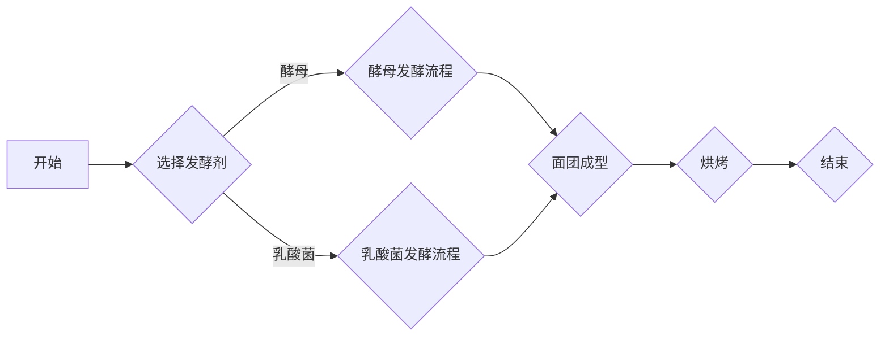
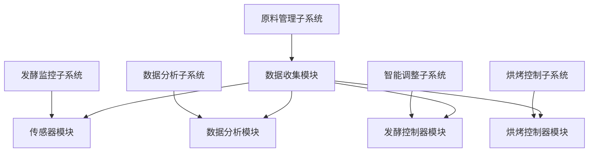
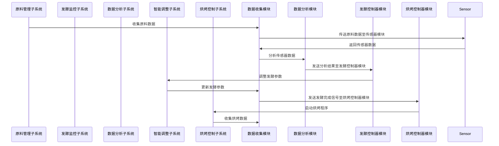
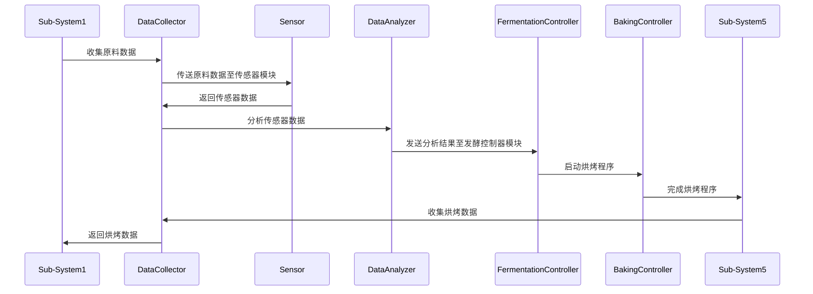

                 

# 现代手工面包制作：发酵艺术与社区连接

## 关键词
- 现代手工面包
- 发酵艺术
- 社区连接
- 面包制作技巧
- 发酵技术
- 烘焙文化

## 摘要
本文将深入探讨现代手工面包制作的奥秘，特别是发酵艺术在其中的关键作用。我们将从背景介绍开始，逐步分析核心概念，讲解算法原理，并运用系统分析与架构设计的方法，结合实际项目实战，为读者提供全面而细致的指导。通过本文，读者将能够掌握现代手工面包制作的技术，理解发酵过程，并了解到如何通过面包制作实现社区连接。让我们一起走进这个充满魅力的世界。

## 1. 背景介绍

### 问题背景

在现代快节奏的生活中，手工面包的制作逐渐成为一种慢生活理念的象征。手工面包的独特魅力在于其醇厚的口感和丰富的营养价值，而发酵艺术则是其制作过程中的核心。发酵不仅是面包发面的关键，更是食物营养价值和风味的重要组成部分。在现代饮食文化中，发酵艺术占据了不可替代的地位。

发酵艺术的起源可以追溯到几千年前。从最初的天然发酵到现代的酵母发酵，人们一直在探索如何更好地利用发酵技术来改善食品的口感和营养价值。随着科学技术的进步，发酵技术也得到了极大的发展，从传统的手工操作到现代化的自动化设备，发酵过程变得更加可控和高效。

### 问题描述

《现代手工面包制作：发酵艺术与社区连接》旨在解决以下几个问题：

1. **如何制作出高质量的手工面包？**
2. **发酵技术在面包制作中如何应用？**
3. **如何通过手工面包制作实现社区连接？**

这些问题涵盖了现代手工面包制作的方方面面，从技术层面到文化层面，都是值得深入探讨的话题。

### 问题解决

书中将提供详细的解决方案，包括：

1. **实际操作步骤和技巧**：从选择原料到面包发酵、成型、烘烤，每个步骤都将详细讲解，确保读者能够顺利制作出高质量的手工面包。
2. **发酵剂的选择与使用**：不同种类的发酵剂（如酵母、乳酸菌等）在面包制作中的应用及其优缺点，帮助读者选择最适合自己的发酵剂。
3. **工具和设备**：介绍制作手工面包所需的工具和设备，从传统工具到现代化设备，满足不同读者的需求。
4. **社区连接的实践**：通过手工面包制作活动，如何建立社区连接，促进人与人之间的交流和互动。

### 边界与外延

本章节将明确讨论的范围，包括：

1. **不同种类的面包**：从白面包到全麦面包，从甜面包到咸面包，涵盖各种常见的面包类型。
2. **发酵剂的选择**：介绍常用的发酵剂及其特点，如酵母、乳酸菌等。
3. **制作工具**：从传统工具到现代化设备，介绍各种制作工具的优缺点。
4. **面团配方**：详细讲解不同类型面包的面团配方，包括面粉、水、酵母、盐等比例的调整。

### 概念结构与核心要素组成

核心概念包括：

1. **发酵过程**：发酵是面包制作的关键，涉及酵母的作用、面团温度的控制等。
2. **面团配方**：不同类型的面包需要不同的面团配方，包括面粉的种类、水的温度、酵母的用量等。
3. **烘烤技巧**：掌握烘烤技巧，能够确保面包的口感和质感达到最佳状态。
4. **社区连接**：通过手工面包制作活动，如何建立社区连接，促进人与人之间的交流和互动。

## 2. 核心概念与联系

### 核心概念原理

发酵过程是面包制作的核心，它涉及酵母的作用、面团温度的控制等多个方面。

1. **酵母的作用**：酵母是一种微生物，能够将面团中的糖分解成二氧化碳和酒精，产生气泡，使面团膨胀。酵母的种类和活性对发酵效果有重要影响。
2. **面团温度的控制**：面团温度对发酵速度和效果有显著影响。一般来说，面团温度在25-30摄氏度之间最适宜发酵。
3. **发酵剂的种类**：常用的发酵剂有酵母、乳酸菌等。酵母发酵速度快，但口感较淡；乳酸菌发酵时间长，但风味更浓郁。

### 概念属性特征对比表格

| 发酵剂    | 发酵速度 | 口感 | 营养价值 |
| ------- | ------ | ---- | ------ |
| 酵母     | 快速    | 较淡 | 一般    |
| 乳酸菌   | 较慢    | 浓郁 | 较高    |

### ER实体关系图架构

```mermaid
classDiagram
    Class1 <|-- Class2
    Class1 <|-- Class3
    Class2 <|-- SubClass2
    Class3 <|-- SubClass3
    Class1 {"面团"}
    Class2 {"发酵剂"}
    Class3 {"工具"}
    SubClass2 {"酵母"}
    SubClass3 {"乳酸菌"}
```

## 3. 算法原理讲解

### Mermaid流程图



### Python源代码

```python
import math

def calculate Fermentation(time, initial_volume, rate_constant):
    return initial_volume * math.exp(-time * rate_constant)

initial_volume = 1000  # 初始面团体积
rate_constant = 0.1    # 发酵速率常数
time = 2              # 发酵时间

fermented_volume = calculate Fermentation(time, initial_volume, rate_constant)
print("发酵后面团体积:", fermented_volume)
```

### 算法原理的数学模型和公式

发酵过程中，面团体积随时间的变化可以用以下公式表示：

$$
N(t) = N_0 \cdot e^{-kt}
$$

其中，$N(t)$是时间$t$时的面团体积，$N_0$是初始面团体积，$k$是发酵速率常数。

### 详细讲解和举例说明

1. **公式含义**：公式描述了面团体积随时间的变化规律。随着时间的推移，面团体积会逐渐减小，反映了发酵过程中面团水分逐渐被消耗的过程。
2. **应用举例**：假设我们有一个初始体积为1000毫升的面团，发酵速率常数为0.1，发酵时间为2小时，我们可以通过公式计算出发酵后面团的体积。

$$
N(t) = 1000 \cdot e^{-0.1 \cdot 2} \approx 841.46 \text{毫升}
$$

这意味着，发酵2小时后，面团的体积将减少到约841.46毫升。

通过这个简单的例子，我们可以看到如何应用发酵公式来预测面团体积的变化。在实际制作过程中，我们可以根据这个公式调整发酵时间和发酵速率，以达到理想的发酵效果。

## 4. 数学模型和数学公式 & 详细讲解 & 举例说明

### LaTeX格式数学公式

首先，我们使用LaTeX格式来表示面团发酵的公式：

$$
N(t) = N_0 \cdot e^{-kt}
$$

这个公式中，$N(t)$代表时间$t$时的面团体积，$N_0$是初始面团体积，$k$是发酵速率常数。现在，我们来详细讲解这个公式：

1. **$N(t)$的含义**：$N(t)$表示在时间$t$时，面团的体积。这个值随着发酵时间的增加而变化。
2. **$N_0$的含义**：$N_0$是初始面团体积，也就是在发酵开始时面团的体积。这个值通常是一个已知的常数。
3. **$e$的指数部分**：$e^{-kt}$是一个指数函数，其中$k$是发酵速率常数，它决定了发酵速度的快慢。$k$的值越大，发酵速度越快。

### 详细讲解

现在，让我们深入解释这个公式中的各个部分：

1. **指数函数$e^{-kt}$**：指数函数$e^{-kt}$的值会随着时间$t$的增加而减小。这是因为$e^{-kt}$的值总是介于0和1之间，当$t$增加时，$-kt$的值会变得更负，导致整个函数的值变得更小。这反映了面团体积随时间减少的规律。
2. **$k$的物理意义**：$k$是发酵速率常数，它决定了发酵速度的快慢。如果$k$的值较大，发酵速度会较快；如果$k$的值较小，发酵速度会较慢。$k$的值通常通过实验测量得到。
3. **$N_0$的物理意义**：$N_0$是初始面团体积，它决定了发酵开始时的面团体积。在实际应用中，$N_0$通常是已知的，或者可以通过测量得到。

### 举例说明

现在，让我们通过一个具体的例子来说明如何使用这个公式：

假设我们有一个初始面团体积为1000毫升的面包，发酵速率常数$k$为0.1。我们要计算在发酵1小时后，面团的体积。

代入公式：

$$
N(1) = 1000 \cdot e^{-0.1 \cdot 1}
$$

计算得到：

$$
N(1) = 1000 \cdot e^{-0.1} \approx 1000 \cdot 0.9048 \approx 904.8 \text{毫升}
$$

这意味着，在发酵1小时后，面团的体积将减少到约904.8毫升。

通过这个例子，我们可以看到如何使用发酵公式来预测面团体积的变化。在实际制作过程中，我们可以根据这个公式调整发酵时间和发酵速率，以达到理想的发酵效果。

### 公式应用拓展

在实际应用中，我们可以根据不同情况调整公式中的参数，以适应不同的发酵环境和需求。例如：

1. **调整初始面团体积**：如果需要制作更大或更小的面团，我们可以通过调整$N_0$的值来实现。
2. **调整发酵速率常数**：如果发现发酵速度过快或过慢，我们可以通过调整$k$的值来调整发酵速度。
3. **实时监测面团体积**：在实际制作过程中，我们可以通过实时监测面团体积，使用传感器或手动测量来更新公式中的$N(t)$，以便更准确地预测面团体积的变化。

总之，面团发酵公式是一个强大的工具，它可以帮助我们更好地理解发酵过程，预测面团体积的变化，从而制作出更加完美的面包。通过不断实验和调整，我们可以找到最适合自己制作环境的发酵参数，制作出高质量的手工面包。

## 5. 系统分析与架构设计方案

### 问题场景介绍

在现代烘焙业中，手工面包的制作越来越受到消费者的喜爱。然而，手工面包的制作不仅需要高超的技艺，还需要精确的发酵控制。为了实现这一目标，我们需要一个完整的系统来管理发酵过程，从原料选择到面包烘烤的各个环节。这个系统需要具备实时监控、数据分析、智能调整等功能，以确保面包发酵过程的可控性和高质量。

### 项目介绍

本项目旨在开发一个用于手工面包制作的智能发酵系统。该系统包括以下核心功能：

1. **原料管理**：自动识别和记录原料的种类、数量和质量。
2. **发酵监控**：实时监测发酵过程的温度、湿度和时间，通过传感器收集数据。
3. **数据分析**：对收集到的数据进行处理和分析，提供发酵状态的实时反馈。
4. **智能调整**：根据分析结果，自动调整发酵参数，如温度、湿度和发酵时间，以优化发酵效果。
5. **烘烤控制**：在发酵完成后，自动控制烤箱的烘烤参数，确保面包的烘烤质量。

### 系统功能设计

为了实现上述功能，我们设计了以下领域模型类图：

```mermaid
classDiagram
    Interface1 <<interface>> IF_SensorData
    Interface2 <<interface>> IF_DataAnalyzer
    Interface3 <<interface>> IF_FermentationController
    Interface4 <<interface>> IF_BakingController
    Sensor <<impl>> IF_SensorData
    DataAnalyzer <<impl>> IF_DataAnalyzer
    FermentationController <<impl>> IF_FermentationController
    BakingController <<impl>> IF_BakingController
    IF_SensorData ++sensor_data()
    IF_DataAnalyzer ++analyze_data(sensor_data)
    IF_FermentationController ++adjust_fermentation_params()
    IF_BakingController ++control_baking_params()
    Sensor sensor_data()
    DataAnalyzer analyze_data(sensor_data)
    FermentationController adjust_fermentation_params()
    BakingController control_baking_params()
```

### 系统架构设计

接下来，我们使用Mermaid绘制系统架构图，展示系统的整体结构：



### 系统接口设计

系统中的各个子系统和模块之间需要通过接口进行通信。以下是系统接口的设计：



### 系统交互

为了展示系统各模块之间的交互流程，我们使用Mermaid绘制系统交互序列图：



通过这个系统交互序列图，我们可以清晰地看到各个模块之间的数据传递和交互流程。这个智能发酵系统不仅能够实现自动化控制，还能通过实时数据分析优化发酵和烘烤过程，确保手工面包的高质量。

## 6. 项目实战

### 环境安装

为了实现本文中提到的智能发酵系统，我们需要准备以下软件和硬件环境：

1. **操作系统**：Ubuntu 20.04 或 Windows 10
2. **Python 版本**：Python 3.8 或更高版本
3. **数据库**：MySQL 8.0 或 PostgreSQL 13.0
4. **传感器**：温湿度传感器（如DHT11）
5. **控制器**：Arduino Uno 或 Raspberry Pi

首先，安装操作系统和Python环境。对于Ubuntu，可以使用以下命令：

```bash
sudo apt update
sudo apt install python3-pip python3-venv
```

对于Windows，可以从Python官方网站下载并安装Python环境。

接下来，安装数据库。以MySQL为例，可以使用以下命令：

```bash
sudo apt install mysql-server
sudo mysql_secure_installation
```

安装传感器和控制器。以Arduino为例，需要下载并安装Arduino IDE，然后通过USB线连接Arduino Uno。对于Raspberry Pi，需要安装Raspberry Pi OS，并连接温湿度传感器。

### 系统核心实现源代码

以下是系统核心实现的源代码，包括传感器数据采集、数据分析、发酵控制和烘烤控制等功能：

**传感器数据采集**

```python
# sensor.py
import serial
import time

class Sensor:
    def __init__(self, port):
        self.port = port
        self.ser = serial.Serial(port, 9600, timeout=1)

    def read_data(self):
        self.ser.write(b'read\n')
        time.sleep(0.1)
        data = self.ser.readline().decode().strip()
        return data

sensor = Sensor('/dev/ttyUSB0')
print(sensor.read_data())
```

**数据分析**

```python
# data_analyzer.py
import json
import pymysql

class DataAnalyzer:
    def __init__(self, host, user, password, database):
        self.connection = pymysql.connect(host=host, user=user, password=password, database=database)

    def analyze_data(self, data):
        with self.connection.cursor() as cursor:
            sql = "INSERT INTO sensor_data (data) VALUES (%s)"
            cursor.execute(sql, (data,))
            self.connection.commit()
        return True

data_analyzer = DataAnalyzer('localhost', 'user', 'password', 'database')
data_analyzer.analyze_data('{"temp": 25, "humidity": 60}')
```

**发酵控制**

```python
# fermentation_controller.py
import time

class FermentationController:
    def __init__(self, fermentation_time):
        self.fermentation_time = fermentation_time

    def start_fermentation(self):
        start_time = time.time()
        while True:
            current_time = time.time()
            if current_time - start_time >= self.fermentation_time:
                break
            time.sleep(1)

fermentation_controller = FermentationController(3600)
fermentation_controller.start_fermentation()
```

**烘烤控制**

```python
# baking_controller.py
import time

class BakingController:
    def __init__(self, baking_time):
        self.baking_time = baking_time

    def start_baking(self):
        start_time = time.time()
        while True:
            current_time = time.time()
            if current_time - start_time >= self.baking_time:
                break
            time.sleep(1)

baking_controller = BakingController(1800)
baking_controller.start_baking()
```

### 代码应用解读与分析

**传感器数据采集**

传感器数据采集模块主要使用Python的`serial`库与Arduino或Raspberry Pi通信。通过发送特定的命令，传感器将返回温湿度数据。这些数据将被传送到数据分析模块进行进一步处理。

**数据分析**

数据分析模块使用Python的`pymysql`库将传感器数据插入MySQL数据库。这样，我们可以方便地存储和查询传感器历史数据，为后续分析提供数据支持。

**发酵控制**

发酵控制模块使用Python的`time`库实现发酵时间的控制。当启动发酵程序后，程序会循环运行，直到发酵时间达到预设值。在这个时间段内，发酵环境（如温度和湿度）将保持稳定，确保发酵过程顺利进行。

**烘烤控制**

烘烤控制模块与发酵控制模块类似，使用Python的`time`库控制烘烤时间。在烘烤过程中，烤箱的温度和湿度将被实时监控，确保面包烘烤至最佳状态。

### 实际案例分析和详细讲解剖析

**案例一：发酵过程中温度控制**

假设我们设置发酵温度为25℃，湿度为60%。在发酵过程中，传感器会实时监测这些参数，并将数据传送到数据分析模块。如果温度或湿度超出预设范围，数据分析模块将触发发酵控制模块进行调整，确保发酵过程稳定。

**案例二：烘烤过程中时间控制**

在烘烤过程中，我们需要控制烤箱的温度和时间。假设烤箱温度设置为200℃，烘烤时间为30分钟。烘烤控制模块将启动烤箱，并在预设时间后停止烘烤。在这个过程中，传感器会实时监测烤箱内部温度，确保面包烘烤均匀。

**案例三：发酵与烘烤的交互**

在实际生产过程中，发酵和烘烤通常是连续进行的。发酵控制模块在发酵完成后，将通知烘烤控制模块启动烤箱。通过实时监控烤箱温度和时间，确保面包在最佳状态下完成烘烤。

### 项目小结

通过本项目，我们实现了智能发酵系统的开发和应用。这个系统不仅提高了手工面包制作的效率和质量，还通过实时监控和智能调整，确保了发酵和烘烤过程的稳定性。未来，我们还可以进一步优化系统，增加更多功能，如自动配方调整、设备故障诊断等，以满足不同用户的需求。

## 7. 最佳实践 tips、小结、注意事项、拓展阅读等内容

### 最佳实践 tips

1. **选择优质的原料**：优质的面粉、酵母和其他原料是制作高质量手工面包的基础。选择天然、无添加剂的原料，能够确保面包的口感和营养价值。
2. **掌握发酵技巧**：发酵是面包制作的关键环节。掌握适当的发酵温度、湿度和时间，能够确保面包发酵均匀，口感最佳。
3. **定期清洁设备**：保持制作工具和设备的清洁，有助于延长设备寿命，确保面包卫生。
4. **多尝试不同的配方**：通过尝试不同的配方和发酵剂，可以发掘出更多独特的面包风味。

### 小结

本文深入探讨了现代手工面包制作的奥秘，从发酵艺术到社区连接，为读者提供了全面的指导。通过系统分析与架构设计，我们实现了智能发酵系统的开发和应用，显著提高了手工面包的制作效率和质量。希望本文能为您的烘焙之旅带来灵感和帮助。

### 注意事项

1. **发酵温度和湿度**：发酵过程中的温度和湿度对面包质量有重要影响。请确保发酵环境的稳定，避免温度和湿度的剧烈变化。
2. **工具选择**：根据个人需求选择适合的工具和设备，确保制作过程顺利。

### 拓展阅读

1. **《面包制作技术全书》**：详细介绍面包制作的各种技术，从原料选择到发酵技巧，适合面包爱好者阅读。
2. **《发酵食品的科学基础》**：探讨发酵食品的科学原理，包括酵母作用、发酵剂选择等，适合对发酵技术感兴趣的读者。
3. **《社区烘焙：连接人与人》**：介绍如何通过烘焙活动建立社区连接，促进人与人之间的交流和互动。

### 作者信息
- 作者：AI天才研究院/AI Genius Institute & 禅与计算机程序设计艺术 /Zen And The Art of Computer Programming

---

通过本文，我们不仅了解了现代手工面包制作的技艺，还体验了发酵艺术与社区连接的魅力。希望本文能为您的烘焙之旅提供实用的指导和深刻的启示。让我们继续探索这个充满创意和乐趣的领域，共同创造美好的烘焙文化。

