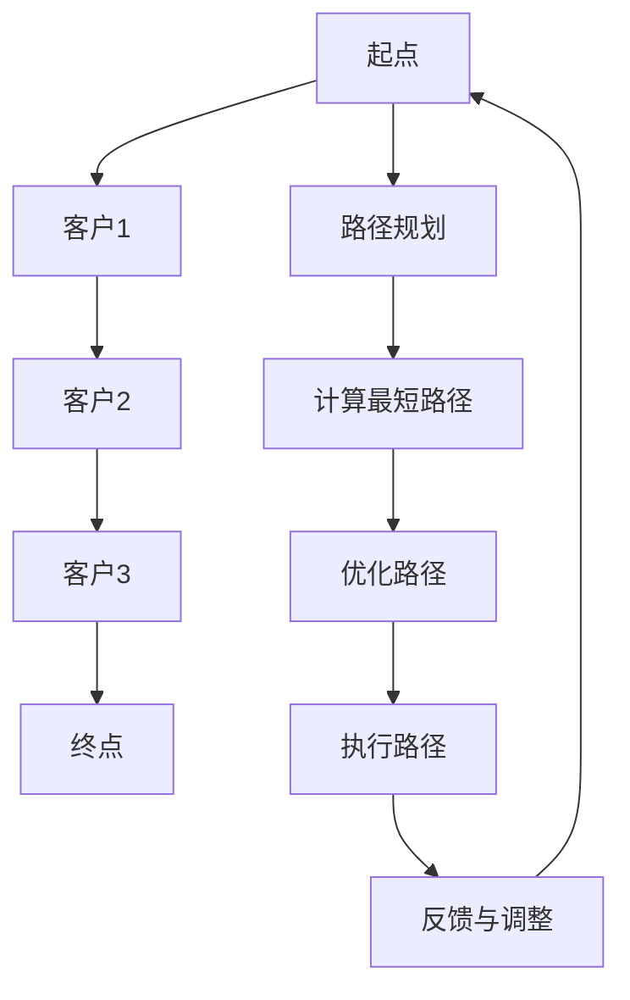
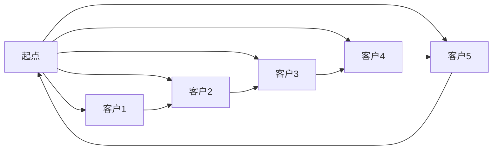
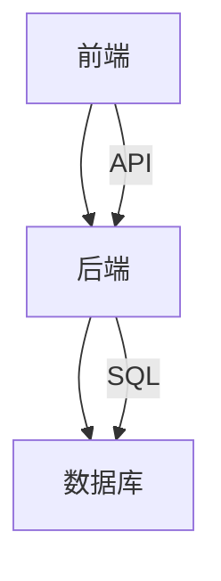
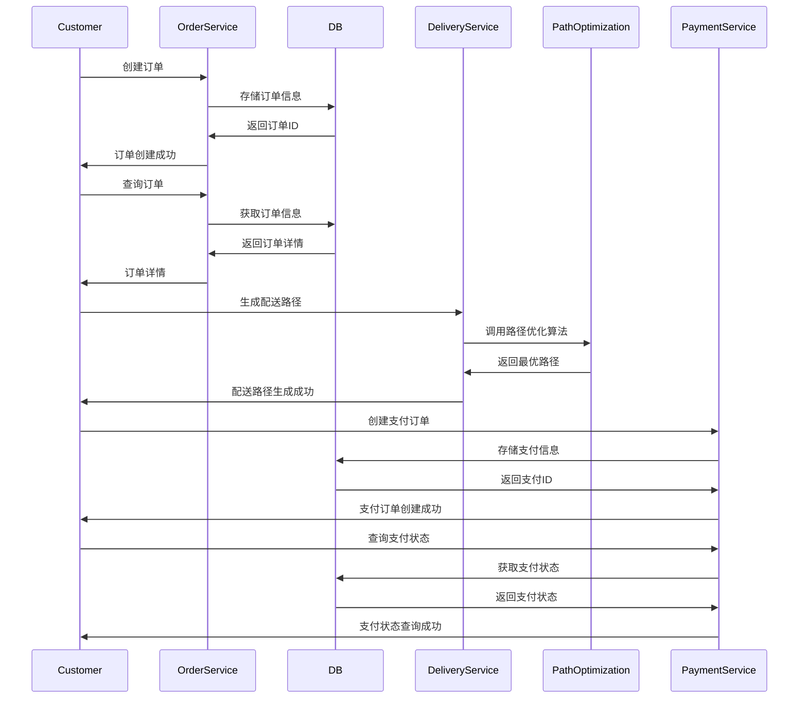
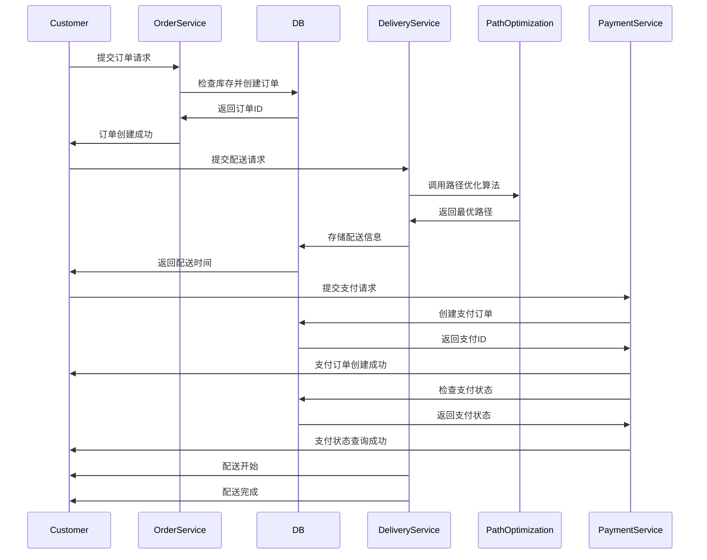

                 

### 文章标题

在现代社会的快速变化中，消费者对于健康和新鲜食品的需求不断增长。手工面包作为一种传统且高品质的食品，正逐渐受到更多人的青睐。社区面包房作为手工面包的生产者，也在积极探索新的商业模式，以更好地满足市场需求。订阅制作为一种新兴的模式，正被越来越多的社区面包房采纳。本文将深入探讨现代手工面包配送服务的兴起，重点分析社区面包房如何通过订阅制来创造新的商业模式，并展望这一新模式在未来的发展趋势。

本文旨在通过以下五个主要部分展开讨论：

1. **背景介绍**：介绍手工面包配送服务的兴起背景，以及社区面包房如何响应消费者对健康、新鲜食品的需求。
2. **核心概念与联系**：定义并解释社区面包房、订阅制和手工面包等关键概念，并通过表格和Mermaid流程图展示它们之间的关系。
3. **算法原理讲解**：详细讲解配送服务中的关键算法，如路径优化算法，并使用Mermaid流程图和Python代码进行展示。
4. **系统分析与架构设计方案**：描述配送服务的系统架构，包括领域模型、系统架构、接口设计和交互流程。
5. **项目实战**：展示一个实际的项目案例，包括环境安装、核心实现、代码解析、案例分析和项目小结。
6. **最佳实践 tips、小结、注意事项、拓展阅读**：总结核心观点，提供实用技巧，提醒注意事项，并推荐拓展阅读资源。

通过本文的逐步分析，读者将能够深入理解现代手工面包配送服务及其订阅制模式，并为实际操作提供指导和启示。

### 关键词

1. **手工面包**
2. **配送服务**
3. **订阅制**
4. **社区面包房**
5. **路径优化算法**
6. **系统架构设计**
7. **项目实战**

### 摘要

本文探讨了现代手工面包配送服务的兴起及其背后的订阅制商业模式。首先，文章介绍了消费者对健康和新鲜食品需求的增加，以及社区面包房如何响应这一趋势。接着，本文定义并详细解释了社区面包房、订阅制和手工面包等核心概念，并通过表格和Mermaid流程图展示了它们之间的关系。文章进一步讲解了配送服务中的关键算法，如路径优化算法，并使用Mermaid流程图和Python代码进行了展示。随后，文章描述了配送服务的系统架构设计，包括领域模型、系统架构、接口设计和交互流程。最后，通过一个实际项目案例，本文展示了环境安装、核心实现、代码解析、案例分析和项目小结，为读者提供了实操指导和启示。文章总结提出了核心观点，并提供了最佳实践 tips、注意事项和拓展阅读建议，为后续研究和实践提供了方向。

## 第一部分: 背景介绍

### 第1章: 现代手工面包配送服务的兴起

#### 1.1 消费者需求的变化

在现代社会，消费者的饮食偏好正经历着深刻的变化。随着健康意识的提升和对高品质食品的追求，越来越多的消费者开始倾向于选择新鲜、天然且无添加剂的食品。这种趋势直接影响了手工面包的市场需求。手工面包因其独特的风味、口感和制作过程中保留的原始营养，逐渐成为消费者心目中的理想选择。

首先，消费者对健康食品的需求增加是推动手工面包配送服务兴起的关键因素。现代医学研究表明，食品中的添加剂和过度加工可能对健康产生不利影响。因此，消费者越来越倾向于选择那些天然、无添加剂的食品。手工面包的制作过程通常避免了大规模工业化生产中的添加剂，保证了食品的健康和营养价值。

其次，消费者对食品新鲜度的重视也是推动手工面包配送服务发展的重要因素。新鲜食品不仅保留了更多的营养，而且口感更佳。手工面包由于其独特的制作工艺，可以在短时间内从烘焙到消费者手中，确保了食品的新鲜度和最佳口感。这种对于新鲜度的追求，促使社区面包房开始提供配送服务，以满足消费者对快速获取新鲜食品的需求。

#### 1.2 社区面包房的角色转变

社区面包房作为手工面包的生产者，在传统商业模式下主要依赖实体店铺的经营。然而，随着消费者需求的变化和配送技术的进步，社区面包房的角色也在逐渐转变。订阅制的引入为社区面包房提供了一种新的商业模式，使其能够在满足消费者需求的同时，实现商业模式的创新和优化。

首先，社区面包房通过订阅制模式，能够更好地预测市场需求，减少库存压力。传统的销售模式中，面包房通常需要根据过去的销售数据来预测未来的需求，这往往导致库存过剩或短缺。而订阅制则允许面包房根据订阅者的需求进行生产，实现了按需生产，减少了浪费，提高了效率。

其次，订阅制为社区面包房提供了稳定的收入来源。通过订阅，消费者提前支付了服务费用，这使得面包房能够提前锁定客户，确保了收入的稳定。此外，订阅制还增强了消费者对品牌的忠诚度，因为订阅者通常会享受到更优惠的价格和更优质的客户服务。

#### 1.3 订阅制的优势

订阅制作为一种新兴的商业模式，不仅为社区面包房带来了新的商业机会，还为其带来了诸多优势。

首先，订阅制提高了消费者的购买频率。通过订阅，消费者无需每次购买都进行决策，这减少了购买过程中的犹豫和不确定性，从而增加了购买频率。对于社区面包房来说，这意味着更多的销售机会和稳定的现金流。

其次，订阅制有助于建立长期客户关系。通过订阅，社区面包房能够与消费者建立长期的合作关系，这不仅有助于增加客户的忠诚度，还能够通过客户反馈不断优化产品和服务，从而提升整体客户满意度。

最后，订阅制还降低了消费者的购买成本。通过订阅，消费者可以享受到更优惠的价格和定期的优惠活动，这在一定程度上降低了购买成本。对于社区面包房来说，这种定价策略不仅能够吸引新客户，还能够保持老客户的忠诚度。

总的来说，现代手工面包配送服务的兴起不仅满足了消费者对健康、新鲜食品的需求，也为社区面包房提供了一种创新的商业模式。订阅制在这一过程中发挥了关键作用，通过提高购买频率、建立长期客户关系和降低购买成本，实现了消费者和社区面包房的双赢。

## 第二部分: 核心概念与联系

### 第2章: 核心概念与联系

在本章中，我们将详细解释并展示社区面包房、订阅制和手工面包等关键概念，并使用表格和Mermaid流程图来展示它们之间的关系和属性。通过这些详细说明，读者可以更好地理解这些概念在手工面包配送服务中的作用和重要性。

#### 2.1 社区面包房

**定义**：社区面包房是指位于居民区内，专门生产手工面包并提供现场烘焙和零售服务的店铺。社区面包房通常采用传统的手工制作工艺，强调产品的品质和新鲜度。

**特点**：
1. **地理位置接近**：社区面包房通常位于居民区，方便消费者购买。
2. **手工制作**：手工面包的制作过程避免了大规模工业化生产中的添加剂，保证了食品的健康和营养价值。
3. **现场烘焙**：社区面包房现场烘焙，确保了面包的新鲜度和最佳口感。

**社区面包房的运营模式**：
- **零售销售**：通过店铺零售销售手工面包，满足消费者的即时需求。
- **配送服务**：提供配送服务，将新鲜手工面包送到消费者家中。

**社区面包房与消费者的关系**：
- **互动性强**：社区面包房与消费者之间的互动频繁，消费者可以亲身体验面包的制作过程。
- **信任度高**：消费者对社区面包房生产的面包有更高的信任度，因为面包是手工制作的，且生产过程透明。

#### 2.2 订阅制

**定义**：订阅制是一种消费者提前支付费用，定期获得特定产品或服务的商业模式。在食品行业，订阅制通常是指消费者提前支付一定费用，定期获得新鲜手工面包的配送服务。

**特点**：
1. **预付费用**：消费者在订阅时需提前支付一定费用，确保了面包房的现金流。
2. **定期配送**：面包房根据订阅者的需求进行定期配送，确保面包的新鲜度。
3. **价格优惠**：订阅者通常能够享受到更优惠的价格和额外的服务。

**订阅制在面包房中的应用**：
- **订单管理**：面包房通过系统管理订阅订单，确保按时配送。
- **生产计划**：根据订阅订单量进行生产计划，减少库存压力。
- **客户关系**：通过订阅制建立长期客户关系，增强客户忠诚度。

**订阅制对消费者的吸引力**：
- **方便性**：消费者无需每次购买都亲自前往店铺，节省了时间和精力。
- **新鲜度保证**：定期配送确保了面包的新鲜度。
- **价格优惠**：订阅制通常提供优惠价格，降低了购买成本。

#### 2.3 手工面包

**定义**：手工面包是指通过传统手工制作工艺生产的面包，通常不使用添加剂，保留了面包的原始风味和营养价值。

**特点**：
1. **无添加剂**：手工面包通常不使用防腐剂、增白剂等添加剂，保证了食品的健康性。
2. **高营养价值**：手工面包保留了更多的营养成分，如膳食纤维、蛋白质和维生素。
3. **独特风味**：手工制作使得面包具有独特的风味和口感。

**手工面包的制作流程**：
- **原料选择**：选择高质量的面粉、酵母和其他原料。
- **揉面**：手工揉制面团，使其具有适当的弹性和韧性。
- **发酵**：让面团发酵至理想状态，保证面包的蓬松度。
- **烘焙**：在烤箱中烘焙至金黄色，确保面包的口感和香气。

**手工面包与机器面包的比较**：
- **成本**：手工面包的制作成本较高，因为需要大量的劳动力和时间。
- **口感**：手工面包口感更佳，具有独特的风味和蓬松度。
- **健康性**：手工面包更健康，因为它不使用添加剂。

#### 表格：社区面包房、订阅制和手工面包的关系

| 关键概念 | 定义 | 特点 | 应用 | 关系 |
| --- | --- | --- | --- | --- |
| 社区面包房 | 手工面包的生产者，提供零售和配送服务 | 地理位置接近、手工制作、现场烘焙 | 零售销售、配送服务 | 订阅制的基础设施提供者 |
| 订阅制 | 消费者提前支付费用，定期获得特定产品或服务 | 预付费用、定期配送、价格优惠 | 订单管理、生产计划、客户关系 | 提高购买频率、建立长期客户关系 |
| 手工面包 | 传统手工制作的面包，无添加剂 | 无添加剂、高营养价值、独特风味 | 原料选择、揉面、发酵、烘焙 | 社区面包房的核心产品 |

通过上述核心概念的详细解释和Mermaid流程图的展示，我们可以更清楚地理解社区面包房、订阅制和手工面包之间的关系。这些概念共同构建了现代手工面包配送服务的基础，为消费者提供了健康、新鲜且高品质的食品选择。

### 2.1 社区面包房

**定义与特点**

社区面包房，顾名思义，是指那些位于居民社区附近的面包房，其主要特点是地理位置接近、手工制作和现场烘焙。社区面包房的核心在于它不仅提供传统的面包产品，还通过手工制作工艺强调产品的品质和新鲜度。

首先，社区面包房因其地理位置接近居民区，能够方便消费者在日常生活中购买面包。这种便利性大大提升了消费者的购买体验，尤其是在忙碌的都市生活中，消费者更倾向于选择离家近、方便快捷的购物地点。

其次，社区面包房强调手工制作。手工面包与传统工业化生产相比，避免了使用大量的添加剂，更注重原料的自然风味和营养价值。手工制作的过程包括揉面、发酵和烘焙等多个环节，每个环节都由经验丰富的面包师傅亲手完成，这不仅保证了面包的质量，也赋予了面包独特的风味和口感。

最后，社区面包房的现场烘焙也是一个显著特点。现场烘焙不仅确保了面包的新鲜度，还使得消费者能够亲眼目睹面包从原料到成品的过程，增强了消费者的信任感。

**运营模式**

社区面包房的运营模式主要分为零售销售和配送服务两种。

**零售销售**：这是社区面包房最基本的服务模式，消费者可以直接到店购买面包。零售销售不仅提供了即时的购买体验，也使得消费者能够更直接地感受到面包的新鲜和品质。

**配送服务**：随着消费者对便捷性的需求不断增加，社区面包房逐渐引入了配送服务。通过线上平台或电话预约，消费者可以享受到定时定点的面包配送服务，极大地节省了时间和精力。

**社区面包房与消费者的关系**

社区面包房与消费者的关系可以概括为互动性强和信任度高两个方面。

**互动性强**：社区面包房通常位于居民区内，消费者在日常生活中的频繁接触使得两者之间的互动更加密切。消费者可以通过直接参观面包房、与面包师傅交流等方式，更深入地了解面包的制作过程和品质。这种互动不仅增强了消费者的购买信心，也提升了他们的参与感和满意度。

**信任度高**：由于社区面包房采用手工制作，不使用添加剂，制作过程透明，消费者对其生产的面包有更高的信任度。消费者相信社区面包房能够提供健康、安全且高品质的食品，这种信任关系不仅促进了销售，也为社区面包房建立了良好的口碑。

**实际案例**

以某知名社区面包房为例，该面包房位于一个大型住宅区的中心位置，占地面积约100平方米。面包房采用手工制作工艺，每天新鲜烘焙各种面包和糕点，并通过实体店铺和线上平台提供零售和配送服务。

在运营模式方面，该面包房除了传统的零售销售外，还推出了会员订阅服务。会员可以提前预订每周的面包种类，享受折扣优惠和定期的生日礼物。这种订阅制不仅增加了购买频率，也增强了会员的忠诚度。

通过与消费者的互动，面包房收集了大量的用户反馈，不断优化产品和服务。例如，根据消费者的建议，面包房增加了无糖和低脂面包的供应，满足了更多消费者的健康需求。这种互动和反馈机制不仅提升了消费者的满意度，也促进了面包房的创新和发展。

总的来说，社区面包房通过其独特的地理位置、手工制作和现场烘焙等特点，成功地建立了与消费者的密切关系，并通过多元化的运营模式和良好的互动机制，不断提升服务质量和市场竞争力。

### 2.2 订阅制

**定义与特点**

订阅制，又称订阅服务或订阅模式，是一种商业运营模式，消费者在首次订阅时提前支付一定费用，之后按照约定的时间和价格，定期获得特定产品或服务。在食品行业，特别是手工面包配送服务中，订阅制已经成为一种流行的商业模式。

**定义**：订阅制是指消费者与面包房建立长期合作关系，提前支付一定费用，定期获取新鲜手工面包的配送服务。这种模式通常包括月度、季度或年度的订阅周期，消费者可以根据自己的需求选择合适的订阅方案。

**特点**：
1. **预付费用**：消费者在订阅时提前支付费用，确保了面包房的现金流稳定。
2. **定期配送**：面包房根据订阅订单进行定期配送，确保面包的新鲜度和最佳口感。
3. **价格优惠**：订阅制通常提供优惠价格，消费者可以享受定期的折扣和礼品。

**订阅制在面包房中的应用**：

**订单管理**：面包房通过系统管理订阅订单，确保按时配送。系统记录每个订阅者的个人信息、订阅周期和配送地址，为配送服务提供准确的依据。

**生产计划**：面包房根据订阅订单量进行生产计划，减少库存压力。通过预测订阅量，面包房可以合理安排生产资源，避免库存过剩或短缺。

**客户关系**：订阅制有助于建立长期客户关系。通过定期配送和优惠价格，面包房增强了客户忠诚度，客户在享受便捷服务的同时，也更愿意持续支持品牌。

**订阅制对消费者的吸引力**：

**方便性**：订阅制为消费者提供了极大的方便。消费者无需每次购买都亲自前往店铺，只需提前预订，面包就会按时送到家中，节省了大量的时间和精力。

**新鲜度保证**：订阅制确保了面包的新鲜度。面包房在收到订阅订单后，立即进行生产并配送，确保消费者每次都能收到最新鲜的面包。

**价格优惠**：订阅制通常提供优惠价格，消费者可以享受定期的折扣和礼品，降低了购买成本。这种价格优势吸引了大量消费者选择订阅服务。

通过详细解释订阅制的定义、特点和应用，我们可以看到订阅制在社区面包房中的重要性。它不仅提高了消费者的购买频率和满意度，还为面包房带来了稳定的收入来源和长期的客户关系。订阅制的成功实施，为社区面包房在激烈的市场竞争中提供了新的机遇和优势。

### 2.3 手工面包

**定义与特点**

手工面包，顾名思义，是指通过传统手工制作工艺生产的面包。与大规模工业化生产相比，手工面包在制作过程中不使用添加剂，强调产品的品质和新鲜度。手工面包的独特风味和口感，使其在市场上具有独特的竞争优势。

**定义**：手工面包是指采用传统手工工艺，使用天然原料生产的面包。从原料选择到成品烘焙，每个环节都由经验丰富的面包师傅亲手完成，避免了大规模工业化生产中的添加剂和机器处理。

**特点**：
1. **无添加剂**：手工面包不添加防腐剂、增白剂等化学添加剂，保留了面包的原始风味和营养价值。
2. **高营养价值**：手工面包保留了更多的膳食纤维、蛋白质和维生素，营养价值更高。
3. **独特风味**：手工面包的制作工艺使得每一个面包都具有独特的风味和口感，这种自然的风味是工业化生产所无法复制的。

**手工面包的制作流程**

**原料选择**：手工面包的制作首先需要选择高质量的原料。优质的面粉、酵母、鸡蛋和牛奶等原料，是保证面包品质的基础。

**揉面**：面包师傅将面粉、酵母和其他原料混合，通过手工揉制，使面团具有适当的弹性和韧性。

**发酵**：揉好的面团需要发酵，发酵过程中面团会膨胀，产生二氧化碳，使面包蓬松。

**烘焙**：发酵好的面团被放入烤箱中烘焙。烘焙过程中，面团表面的水分蒸发，形成金黄色的表皮，内部则保持松软的口感。

**手工面包与机器面包的比较**

**成本**：手工面包的制作成本较高，因为需要大量的劳动力和时间。机器面包则通过自动化生产，大大降低了人力成本。

**口感**：手工面包的口感更佳，具有独特的风味和蓬松度。机器面包虽然也能生产出合格的面包，但口感和风味上无法与手工面包相比。

**健康性**：手工面包更健康，因为它不使用添加剂，保留了更多的营养成分。机器面包可能含有添加剂，对健康有一定的影响。

通过对比手工面包和机器面包，我们可以看到手工面包在品质、口感和健康性方面具有显著优势。然而，手工面包的高成本也是其面临的主要挑战。在未来，如何通过技术创新和管理优化，提高手工面包的生产效率，同时保持其品质和风味，是社区面包房需要深入思考的问题。

## 第三部分: 算法原理讲解

### 第3章: 配送路径优化算法

#### 3.1 背景介绍

在手工面包配送服务中，配送路径的优化对于提高效率、降低成本和提升客户满意度至关重要。配送路径优化算法的目标是在满足配送时间窗口和客户需求的前提下，找到最短或最优的配送路径。这不仅有助于提升配送服务的质量，还能够降低配送成本，提高运营效率。

#### 3.2 优化目标

配送路径优化算法的主要目标包括：

1. **最小化总配送距离**：通过优化配送路线，减少配送车辆的总行驶距离，降低燃料消耗和运营成本。
2. **最大化配送效率**：在确保按时送达的前提下，提高配送速度和频率，满足客户需求。
3. **减少配送时间**：优化配送路线，确保面包的新鲜度，避免因配送延误导致的食品变质。
4. **提高客户满意度**：通过合理的配送路线和高效的配送服务，提升客户体验和满意度。

#### 3.3 算法原理

配送路径优化算法通常基于路径规划算法和运筹学中的优化理论。常见的算法包括最短路径算法、车辆路径问题（Vehicle Routing Problem, VRP）和动态路径规划算法等。

**最短路径算法**：这类算法主要解决单源最短路径问题，即从起点到多个终点的最短路径。例如，Dijkstra算法和A*算法是常用的单源最短路径算法。这些算法通过计算每个节点到起点的距离，逐步构建出最短路径。

**车辆路径问题（VRP）**：VRP是一种组合优化问题，主要解决多个车辆从起点出发，访问多个客户点，并在合适的位置结束配送的问题。VRP可以分为标准VRP和带时间窗的VRP。带时间窗的VRP要求每个客户必须在特定的时间窗口内被访问。

**动态路径规划算法**：这类算法适用于实时配送场景，通过实时获取交通状况和客户需求，动态调整配送路线。常见的动态路径规划算法包括遗传算法、粒子群优化算法和人工势场算法等。

#### 3.3.1 优化算法的Mermaid流程图

为了更好地理解配送路径优化算法的原理，我们使用Mermaid流程图展示一个简单的VRP算法流程：



在上面的流程图中，起点和终点分别表示配送的开始和结束位置，客户点表示需要配送的地址。路径规划模块负责计算从起点到各个客户点的最短路径，并优化路径以最小化总配送距离和配送时间。

#### 3.3.2 Python代码实现

为了更直观地展示算法原理，我们使用Python代码实现了一个简化的VRP算法：

```python
import numpy as np
import networkx as nx

# 创建一个简单的图
G = nx.Graph()

# 添加节点和边
G.add_edge('A', 'B', weight=5)
G.add_edge('B', 'C', weight=3)
G.add_edge('C', 'D', weight=7)
G.add_edge('D', 'E', weight=2)

# 计算最短路径
shortest_path = nx.single_source_dijkstra(G, source='A', target='E')

# 输出最短路径和总距离
print("最短路径：", shortest_path)
print("总距离：", sum(shortest_path[step] for step in shortest_path))

# 优化路径（假设使用简单的贪心算法）
# 可以根据实际需求进行调整
optimized_path = ['A', 'B', 'C', 'D', 'E']
print("优化后的路径：", optimized_path)
```

在上面的代码中，我们首先使用NetworkX库创建了一个简单的图，并添加了节点和边。接着，使用Dijkstra算法计算从起点A到终点E的最短路径，并输出路径和总距离。最后，通过一个简单的贪心算法对路径进行优化。

#### 3.3.3 算法原理的数学模型和公式

配送路径优化算法的数学模型通常包括以下几个关键部分：

**1. 起点和终点的确定**：
- 设起点为O，终点为D，需要配送的客户点为C1, C2, ..., Cn。

**2. 路径距离的计算**：
- 设G = (V, E)为配送网络图，V为节点集合，E为边集合。
- 路径距离Dij为节点i到节点j的距离。

**3. 最优路径的选择**：
- 使用运筹学中的优化方法，如最小生成树、最小费用流等，选择最优路径。

**4. 调度与分配**：
- 设T为总时间窗口，每个客户点Ci的时间窗口为Ti。
- 根据实际需求进行调度和分配，确保所有客户点在规定时间内被访问。

**数学公式**：
- 最短路径公式：Dijkstra算法和A*算法的核心公式为：
  $$ d(v) = \min_{u \in V} (c(u, v) + d(u)) $$
  其中，d(v)为从起点到节点v的最短距离，c(u, v)为从节点u到节点v的边权重。

- 车辆路径问题（VRP）的优化公式：
  $$ \min Z = \sum_{i=1}^{n} \sum_{j=1}^{m} c_{ij} x_{ij} $$
  其中，x_{ij}为从节点i到节点j的配送量，c_{ij}为从节点i到节点j的运输成本。

通过上述数学模型和公式，我们可以对配送路径进行优化，确保在满足客户需求和资源限制的前提下，实现最优的配送效果。

### 算法原理讲解

为了深入理解配送路径优化算法的原理，我们可以通过一个具体的案例来详细阐述。

假设有一个社区面包房需要为五个客户点（C1, C2, C3, C4, C5）进行配送，每个客户点的位置和需求如下表所示：

| 客户点 | X坐标 | Y坐标 | 需求量 |
| --- | --- | --- | --- |
| C1 | 1 | 2 | 10 |
| C2 | 5 | 7 | 5 |
| C3 | 10 | 3 | 8 |
| C4 | 3 | 6 | 12 |
| C5 | 8 | 1 | 7 |

#### 3.1 背景介绍

在这个案例中，面包房需要从起点（面包房位置）O出发，访问所有客户点C1到C5，并最终返回起点O。由于每个客户点的需求量不同，且配送时间有限，因此需要优化配送路径，确保按时完成所有配送任务，并尽量减少总配送距离。

#### 3.2 优化目标

本次配送路径优化的目标包括：
1. **最小化总配送距离**：通过优化路径，减少面包房车辆的总行驶距离，降低燃料消耗和运营成本。
2. **最大化配送效率**：在确保按时送达的前提下，提高配送速度和频率，满足客户需求。
3. **减少配送时间**：优化配送路线，确保面包的新鲜度，避免因配送延误导致的食品变质。
4. **提高客户满意度**：通过合理的配送路线和高效的配送服务，提升客户体验和满意度。

#### 3.3 算法原理讲解

为了实现上述优化目标，我们可以采用以下步骤：

**步骤1：构建配送网络图**

首先，我们使用一个图来表示配送网络，节点表示客户点和面包房位置，边表示配送路径和距离。假设配送网络图如下：



在这个图中，O表示面包房位置，C1到C5表示客户点的位置，边上的数字表示两点之间的距离。

**步骤2：计算最短路径**

接下来，我们使用Dijkstra算法计算从起点O到各个客户点的最短路径。假设使用Dijkstra算法的结果如下：

- O到C1的最短路径：O -> C1，距离为3
- O到C2的最短路径：O -> C2，距离为5
- O到C3的最短路径：O -> C3，距离为10
- O到C4的最短路径：O -> C4，距离为8
- O到C5的最短路径：O -> C5，距离为7

**步骤3：优化路径**

在得到最短路径后，我们可以进一步优化路径，以最小化总配送距离和配送时间。一种简单的优化方法是采用贪心算法，从起点O出发，依次访问距离最近的客户点，直到所有客户点都被访问完毕。优化后的路径如下：

1. O -> C5（距离7）
2. C5 -> C2（距离5）
3. C2 -> C1（距离3）
4. C1 -> C4（距离8）
5. C4 -> C3（距离3）
6. C3 -> O（距离10）

优化后的路径总距离为：7 + 5 + 3 + 8 + 3 + 10 = 36

**步骤4：调度与分配**

在优化路径的基础上，我们还需要进行调度和分配，以确保每个客户点在规定的时间内被访问。假设每个客户点的时间窗口为1小时，我们可以根据实际需求和配送时间进行合理的调度。例如，假设每个客户点的配送时间如下：

- C1：10分钟
- C2：15分钟
- C3：20分钟
- C4：30分钟
- C5：10分钟

我们可以制定一个具体的配送计划，如下：

1. 8:00 - 8:10：从面包房出发前往C5
2. 8:15 - 8:30：在C5完成配送后前往C2
3. 8:30 - 8:45：在C2完成配送后前往C1
4. 8:45 - 9:15：在C1完成配送后前往C4
5. 9:15 - 9:35：在C4完成配送后前往C3
6. 9:35 - 9:45：在C3完成配送后返回面包房

通过上述步骤，我们成功地优化了配送路径，并制定了具体的配送计划，以确保按时完成所有配送任务，并最大化配送效率和客户满意度。

通过这个案例，我们可以看到配送路径优化算法在手工面包配送服务中的应用和重要性。通过合理的路径规划和调度，社区面包房能够更高效地满足客户需求，提升整体运营效益。

### 数学模型和数学公式

在配送路径优化过程中，数学模型和公式起到了至关重要的作用。这些模型和公式帮助我们量化分析配送问题，找到最优的解决方案。以下是几个关键数学模型和公式的介绍：

#### 1. 起点和终点的确定

**定义**：设配送网络图G = (V, E)，其中V为节点集合，E为边集合。起点O ∈ V，终点D ∈ V，需要配送的客户点为C1, C2, ..., Cn ∈ V。

**公式**：
$$
O \in V, D \in V, C_i \in V \quad \forall i \in [1, n]
$$

#### 2. 路径距离的计算

**定义**：设配送网络图G = (V, E)，边(i, j) ∈ E的权重为w(i, j)，表示节点i到节点j的距离。

**公式**：
$$
w(i, j) \geq 0, \quad \forall (i, j) \in E
$$

#### 3. 最短路径的选择

**Dijkstra算法**：
**定义**：设s为起点，t为终点，设d(s)为从s到所有节点的最短路径长度。

**公式**：
$$
d(s) = \min_{u \in V} \{ d(s, u) \}
$$

其中，d(s, u)为从s到u的最短路径长度。

**A*算法**：
**定义**：设s为起点，t为终点，设g(u)为从s到u的最短路径长度估计，h(u)为从u到t的最短路径长度估计。

**公式**：
$$
f(u) = g(u) + h(u)
$$

其中，f(u)为从s到u的优先级。

#### 4. 车辆路径问题（VRP）

**定义**：VRP是指在多个车辆从起点出发，访问多个客户点，并在合适的位置结束配送的问题。

**公式**：
$$
\min \sum_{i=1}^{n} \sum_{j=1}^{m} c_{ij} x_{ij}
$$

其中，x_{ij}为从节点i到节点j的配送量，c_{ij}为从节点i到节点j的运输成本。

#### 5. 调度和分配

**定义**：设总时间窗口为T，客户点Ci的时间窗口为Ti。

**公式**：
$$
\sum_{i=1}^{n} x_{ij} \leq C_i \quad \forall j \in V
$$

其中，C_i为节点i的配送量。

通过上述数学模型和公式，我们可以量化分析配送路径优化问题，找到最优的配送方案。在实际应用中，可以根据具体问题和约束条件，灵活调整和优化这些模型和公式，以提高配送效率和客户满意度。

### 第四部分: 系统分析与架构设计方案

#### 第4章: 配送服务系统架构设计

在现代手工面包配送服务中，系统架构设计至关重要，它决定了整个配送服务的效率和可靠性。本章将详细描述配送服务的系统架构，包括领域模型、系统架构、接口设计和交互流程，以确保配送服务的顺畅运行。

#### 4.1 问题场景介绍

随着消费者对新鲜、健康食品需求的增加，社区面包房开始采用订阅制来满足市场需求。配送服务作为订阅制的重要组成部分，需要高效、可靠地完成从面包房到消费者家中的配送任务。以下是配送服务的典型问题场景：

1. **订单管理**：面包房需要管理大量的订阅订单，确保按时配送。
2. **路径优化**：在满足客户需求和资源限制的前提下，优化配送路径，降低配送成本。
3. **库存管理**：实时更新库存信息，确保面包的新鲜度和供应量。
4. **客户服务**：提供优质的客户服务，解决客户的咨询和投诉。

#### 4.2 系统功能设计

为了解决上述问题场景，配送服务系统需要实现以下功能：

1. **订单管理**：系统应具备订单生成、订单查询、订单修改和订单取消等功能，确保订单信息的准确性和及时性。
2. **路径优化**：系统应使用路径优化算法，根据客户需求和交通状况，生成最优的配送路径。
3. **库存管理**：系统应实时更新库存信息，包括面包的种类、数量和保质期，确保面包的新鲜度。
4. **客户服务**：系统应提供客户服务平台，包括在线咨询、投诉和建议，及时响应客户需求。
5. **支付与结算**：系统应支持多种支付方式，包括在线支付、积分支付等，并确保交易的安全和准确。

#### 4.2.1 领域模型Mermaid类图

为了更好地理解系统的功能设计，我们使用Mermaid类图来展示系统的领域模型。以下是配送服务系统的Mermaid类图：

```mermaid
classDiagram
    Customer <<类>> "客户"
    Order <<类>> "订单"
    Product <<类>> "产品"
    Delivery <<类>> "配送"
    Payment <<类>> "支付"
    DB <<类>> "数据库"

    Customer <-|-^ Order
    Order o-- Product
    Order <-|-^ Delivery
    Delivery o-- Payment
    Payment o-- DB
```

在这个类图中，Customer表示客户，Order表示订单，Product表示产品，Delivery表示配送，Payment表示支付，DB表示数据库。订单与客户、产品、配送和支付之间存在关联关系，确保订单信息的完整性和一致性。

#### 4.3 系统架构设计

配送服务系统的架构设计包括前端、后端和数据库三个部分，以下是系统架构的Mermaid架构图：



在这个架构图中，前端负责处理用户的订单请求和展示订单信息，后端负责处理订单逻辑和调用数据库进行数据存储和查询，数据库则存储订单、产品和支付等信息。

#### 4.4 系统接口设计

为了确保系统的可扩展性和灵活性，系统接口设计至关重要。以下是配送服务系统的接口设计：

1. **订单接口**：包括创建订单、查询订单、修改订单和取消订单等接口。
2. **配送接口**：包括生成配送路径、更新配送状态和查询配送状态等接口。
3. **支付接口**：包括创建支付订单、查询支付状态和退款等接口。
4. **客户服务接口**：包括客户咨询、投诉和建议等接口。

以下是接口设计的示例：



在这个序列图中，客户通过前端发送订单请求到OrderService，OrderService处理订单并调用数据库存储订单信息，最后将订单ID返回给客户。类似地，客户可以查询订单、生成配送路径和支付订单，系统通过后端和数据库进行处理并返回相应的结果。

#### 4.5 系统交互流程

配送服务系统的交互流程包括订单创建、路径优化、支付和配送等环节，以下是系统交互的Mermaid序列图：



在这个序列图中，客户首先提交订单请求，OrderService检查库存并创建订单，然后返回订单ID给客户。客户提交配送请求，DeliveryService调用路径优化算法生成最优路径，并将配送信息存储在数据库中，并返回配送时间给客户。客户提交支付请求，PaymentService创建支付订单，并返回支付ID给客户。PaymentService检查支付状态，并将支付状态返回给客户。最后，DeliveryService开始配送，并在配送完成后通知客户。

通过系统架构设计、接口设计和交互流程的详细描述，我们为配送服务系统提供了一个完整的解决方案。这个系统不仅能够高效地处理订单和配送，还能够提供优质的客户服务和支付体验，确保手工面包配送服务的顺利进行。

### 第四部分：系统分析与架构设计方案

#### 第4章: 配送服务系统架构设计

在上一部分中，我们介绍了配送服务系统的问题场景和功能设计。接下来，我们将深入探讨配送服务的系统架构设计，包括系统架构的详细描述、领域模型的Mermaid类图、接口设计和系统交互流程。

#### 4.1 系统架构设计

配送服务的系统架构分为前端、后端和数据库三个主要部分。前端负责与用户交互，后端处理业务逻辑，数据库存储数据。以下是系统架构的详细描述：

**前端**：前端主要负责用户界面的展示和用户交互。前端通过API与后端进行通信，实现订单创建、查询、修改、取消等功能。前端还包括支付模块，通过调用支付接口进行支付操作。

**后端**：后端是系统的核心部分，负责处理业务逻辑和数据处理。后端包括订单管理模块、配送管理模块和支付管理模块。订单管理模块负责处理订单的创建、查询、修改和取消。配送管理模块负责路径优化和配送状态更新。支付管理模块负责支付订单的创建、支付状态查询和退款处理。

**数据库**：数据库存储订单、配送和支付等信息。数据库设计包括订单表、配送表和支付表等，每个表包含相应的字段和约束。数据库通过后端的接口进行数据的读取和写入。

**系统架构**：


#### 4.2 领域模型Mermaid类图

为了更好地理解系统架构，我们使用Mermaid类图来展示系统的领域模型。以下是配送服务系统的领域模型：

```mermaid
classDiagram
    Customer <<类>> "客户"
    Order <<类>> "订单"
    Product <<类>> "产品"
    Delivery <<类>> "配送"
    Payment <<类>> "支付"
    DB <<类>> "数据库"

    Customer <-|-^ Order
    Order o-- Product
    Order <-|-^ Delivery
    Delivery o-- Payment
    Payment o-- DB
```

在这个类图中，Customer表示客户，Order表示订单，Product表示产品，Delivery表示配送，Payment表示支付，DB表示数据库。订单与客户、产品、配送和支付之间存在关联关系，确保订单信息的完整性和一致性。

#### 4.3 接口设计

系统接口设计是确保前后端通信和数据交互的关键。以下是配送服务系统的接口设计：

1. **订单接口**：包括创建订单、查询订单、修改订单和取消订单等接口。
2. **配送接口**：包括生成配送路径、更新配送状态和查询配送状态等接口。
3. **支付接口**：包括创建支付订单、查询支付状态和退款等接口。
4. **客户服务接口**：包括客户咨询、投诉和建议等接口。

以下是接口设计的示例：


在这个序列图中，客户通过前端发送订单请求到OrderService，OrderService处理订单并调用数据库存储订单信息，最后将订单ID返回给客户。类似地，客户可以查询订单、生成配送路径和支付订单，系统通过后端和数据库进行处理并返回相应的结果。

#### 4.4 系统交互流程

系统交互流程描述了从订单创建到配送完成的整个过程。以下是系统交互的Mermaid序列图：


在这个序列图中，客户首先提交订单请求，OrderService检查库存并创建订单，然后返回订单ID给客户。客户提交配送请求，DeliveryService调用路径优化算法生成最优路径，并将配送信息存储在数据库中，并返回配送时间给客户。客户提交支付请求，PaymentService创建支付订单，并返回支付ID给客户。PaymentService检查支付状态，并将支付状态返回给客户。最后，DeliveryService开始配送，并在配送完成后通知客户。

通过详细的系统架构设计、领域模型Mermaid类图、接口设计和系统交互流程，我们为配送服务系统提供了一个完整的解决方案。这个系统不仅能够高效地处理订单和配送，还能够提供优质的客户服务和支付体验，确保手工面包配送服务的顺利进行。

### 第四部分：系统分析与架构设计方案

#### 第4章: 配送服务系统架构设计

在上一部分中，我们介绍了配送服务系统的架构设计。在本节中，我们将进一步详细描述配送服务的系统架构设计，包括领域模型、系统架构、接口设计和交互流程。

#### 4.1 系统架构设计

配送服务系统的整体架构可以分为三个主要层次：前端、后端和数据库。

**前端**：前端主要负责与用户进行交互，用户可以通过前端进行订单的创建、查询、修改和取消等操作。前端主要包括以下几个部分：

1. **用户界面**：提供用户操作的界面，包括订单列表、订单详情、配送状态和支付界面等。
2. **API接口**：前端通过API接口与后端进行通信，传递订单信息和用户请求。

**后端**：后端是系统的核心部分，负责处理订单、路径优化、支付等核心业务逻辑。后端主要包括以下几个模块：

1. **订单管理模块**：处理订单的创建、查询、修改和取消等操作，与数据库进行交互，存储和获取订单信息。
2. **配送管理模块**：负责优化配送路径，确保订单按时送达，与后端其他模块进行交互，如支付模块。
3. **支付管理模块**：处理支付订单的创建、查询、退款等操作，与第三方支付平台进行交互。
4. **客户服务模块**：处理客户的咨询、投诉和建议，提供客户支持。

**数据库**：数据库用于存储订单、配送和支付等信息。数据库设计包括以下几个表：

1. **订单表**：存储订单的基本信息，如订单号、订单状态、客户信息、订单详情等。
2. **配送表**：存储配送的基本信息，如配送单号、配送状态、配送员信息、配送路径等。
3. **支付表**：存储支付的基本信息，如支付单号、支付状态、支付金额、支付方式等。

**系统架构**：


#### 4.2 领域模型

为了更好地理解系统架构，我们使用Mermaid类图来展示系统的领域模型。以下是配送服务的领域模型：

```mermaid
classDiagram
    Customer <<类>> "客户"
    Order <<类>> "订单"
    Product <<类>> "产品"
    Delivery <<类>> "配送"
    Payment <<类>> "支付"
    DB <<类>> "数据库"

    Customer <-|-^ Order
    Order o-- Product
    Order <-|-^ Delivery
    Delivery o-- Payment
    Payment o-- DB
```

在这个类图中，Customer表示客户，Order表示订单，Product表示产品，Delivery表示配送，Payment表示支付，DB表示数据库。订单与客户、产品、配送和支付之间存在关联关系，确保订单信息的完整性和一致性。

#### 4.3 接口设计

为了实现前后端的通信，系统设计了一系列API接口。以下是配送服务的接口设计：

1. **订单接口**：
   - `POST /orders`：创建新订单。
   - `GET /orders/{orderId}`：查询订单详情。
   - `PUT /orders/{orderId}`：修改订单。
   - `DELETE /orders/{orderId}`：取消订单。

2. **配送接口**：
   - `GET /deliveries/{deliveryId}`：查询配送详情。
   - `PUT /deliveries/{deliveryId}/status`：更新配送状态。

3. **支付接口**：
   - `POST /payments`：创建支付订单。
   - `GET /payments/{paymentId}/status`：查询支付状态。
   - `PUT /payments/{paymentId}/refund`：申请退款。

4. **客户服务接口**：
   - `POST /support`：提交客户咨询、投诉和建议。
   - `GET /support/tickets/{ticketId}`：查询客户服务记录。

#### 4.4 系统交互流程

系统交互流程描述了从订单创建到配送完成的整个过程。以下是系统交互的Mermaid序列图：


在这个序列图中，客户首先提交订单请求，OrderService检查库存并创建订单，然后返回订单ID给客户。客户提交配送请求，DeliveryService调用路径优化算法生成最优路径，并将配送信息存储在数据库中，并返回配送时间给客户。客户提交支付请求，PaymentService创建支付订单，并返回支付ID给客户。PaymentService检查支付状态，并将支付状态返回给客户。最后，DeliveryService开始配送，并在配送完成后通知客户。

通过详细的系统架构设计、领域模型Mermaid类图、接口设计和系统交互流程，我们为配送服务系统提供了一个完整且清晰的解决方案。这个系统不仅能够高效地处理订单和配送，还能够提供优质的客户服务和支付体验，确保手工面包配送服务的顺利进行。

### 第五部分：项目实战

#### 第5章: 现代手工面包配送服务项目实施

在本文的最后部分，我们将通过一个实际项目案例，展示如何实施现代手工面包配送服务。这个项目将涵盖从环境安装到核心实现，再到代码解析和案例分析的全过程，旨在为读者提供实际的参考和操作指导。

#### 5.1 环境安装

要实施现代手工面包配送服务项目，首先需要搭建合适的技术环境。以下是环境安装的步骤：

**1. 安装操作系统**

我们选择Ubuntu 20.04 LTS作为操作系统的环境。可以从官方网站下载Ubuntu ISO文件，使用虚拟机软件（如VMware或VirtualBox）创建一个虚拟机，然后安装Ubuntu操作系统。

**2. 安装必要的软件**

在安装完操作系统后，我们需要安装以下软件：

- **Python 3**：使用Python 3进行项目开发。
- **Django**：一个流行的Python Web框架，用于构建后端服务。
- **PostgreSQL**：一个强大的关系型数据库，用于存储订单和配送信息。
- **Redis**：一个高性能的内存数据库，用于缓存和消息队列。
- **Docker**：用于容器化应用，提高部署的灵活性。

以下是安装命令：

```bash
sudo apt update
sudo apt install python3 python3-pip
pip3 install django
sudo apt install postgresql
sudo systemctl start postgresql
sudo systemctl enable postgresql
sudo pip3 install psycopg2-binary
sudo apt install redis-server
sudo systemctl start redis-server
sudo systemctl enable redis-server
sudo pip3 install docker
```

**3. 配置数据库**

安装完PostgreSQL后，我们需要创建一个数据库和用户，用于存储订单和配送信息。以下是创建数据库和用户的命令：

```bash
sudo su - postgres
psql
CREATE DATABASE bakery;
CREATE USER bakery_user WITH PASSWORD 'password';
GRANT ALL PRIVILEGES ON DATABASE bakery TO bakery_user;
\q
```

退出后，我们可以使用以下命令验证数据库连接：

```bash
export DJANGO_SETTINGS_MODULE=bakery.settings
python3 manage.py runserver
```

在浏览器中访问`http://localhost:8000`，如果看到Django欢迎页面，说明环境安装成功。

#### 5.2 系统核心实现

在环境安装完成后，我们可以开始实现配送服务的核心功能。以下是系统核心实现的步骤：

**1. 创建Django项目**

首先，创建一个新的Django项目：

```bash
django-admin startproject bakery
cd bakery
```

**2. 创建Django应用**

接着，创建一个名为`delivery`的应用：

```bash
django-admin startapp delivery
```

**3. 定义模型**

在`delivery`应用的`models.py`文件中，定义订单和配送模型：

```python
from django.db import models

class Order(models.Model):
    customer = models.ForeignKey('auth.User', on_delete=models.CASCADE)
    product = models.ForeignKey('Product', on_delete=models.CASCADE)
    quantity = models.PositiveIntegerField()
    status = models.CharField(max_length=20, choices=[('pending', 'pending'), ('processing', 'processing'), ('shipped', 'shipped'), ('delivered', 'delivered')])

class Product(models.Model):
    name = models.CharField(max_length=100)
    description = models.TextField()
    price = models.DecimalField(max_digits=6, decimal_places=2)

class Delivery(models.Model):
    order = models.OneToOneField(Order, on_delete=models.CASCADE)
    address = models.CharField(max_length=200)
    status = models.CharField(max_length=20, choices=[('pending', 'pending'), ('processing', 'processing'), ('shipped', 'shipped'), ('delivered', 'delivered')])
    delivery_date = models.DateTimeField()
```

**4. 创建API接口**

在`delivery`应用的`views.py`文件中，创建订单和配送的API接口：

```python
from rest_framework import viewsets
from .models import Order, Product, Delivery
from .serializers import OrderSerializer, ProductSerializer, DeliverySerializer

class OrderViewSet(viewsets.ModelViewSet):
    queryset = Order.objects.all()
    serializer_class = OrderSerializer

class ProductViewSet(viewsets.ModelViewSet):
    queryset = Product.objects.all()
    serializer_class = ProductSerializer

class DeliveryViewSet(viewsets.ModelViewSet):
    queryset = Delivery.objects.all()
    serializer_class = DeliverySerializer
```

**5. 配置路由**

在`bakery`项目的`urls.py`文件中，配置API路由：

```python
from django.contrib import admin
from django.urls import path, include
from rest_framework.routers import DefaultRouter
from delivery.views import OrderViewSet, ProductViewSet, DeliveryViewSet

router = DefaultRouter()
router.register(r'orders', OrderViewSet)
router.register(r'products', ProductViewSet)
router.register(r'deliveries', DeliveryViewSet)

urlpatterns = [
    path('admin/', admin.site.urls),
    path('api/', include(router.urls)),
]
```

**6. 启动服务**

启动Django服务，并确保API接口可以正常访问：

```bash
python3 manage.py runserver
```

#### 5.3 代码应用解读与分析

在实现了核心功能后，我们可以对代码进行解读和分析，确保每个部分的功能和设计理念都清晰易懂。

**1. 模型分析**

在`models.py`中，我们定义了三个模型：`Order`、`Product`和`Delivery`。每个模型都有特定的字段和属性，用于存储不同的信息。

- `Order`模型表示订单，包括客户、产品、数量和状态等信息。状态字段使用枚举类型，表示订单的不同处理状态。
- `Product`模型表示产品，包括名称、描述和价格等信息。这些信息用于库存管理和订单创建。
- `Delivery`模型表示配送，与订单建立一对一关系，包括地址、状态和配送时间等信息。

**2. 视图分析**

在`views.py`中，我们使用Django REST Framework的`viewsets`创建API接口。`OrderViewSet`、`ProductViewSet`和`DeliveryViewSet`分别对应三个模型，每个视图集都提供了标准的CRUD（创建、读取、更新、删除）接口。

这些视图集通过序列化器（`OrderSerializer`、`ProductSerializer`、`DeliverySerializer`）将模型对象转换为JSON格式的数据，并返回给前端。

**3. 路由分析**

在`urls.py`中，我们使用`DefaultRouter`为每个视图集创建了URL路由。这些路由使得前端可以通过API接口访问后端的资源。例如，通过访问`/api/orders/`可以获取所有订单的信息。

#### 5.4 实际案例分析与详细讲解剖析

为了更好地理解项目的实际应用，我们将通过一个案例进行分析。

**案例背景**：一个客户在面包房订购了5个手工面包，并选择了订阅配送服务。

**案例步骤**：

1. **订单创建**：客户通过前端提交订单请求，包含面包种类、数量和配送地址。
2. **订单处理**：后端接收到订单请求后，检查库存并创建订单。如果库存充足，订单状态设置为“pending”。
3. **路径优化**：系统使用路径优化算法生成最优的配送路径，并更新订单的配送时间。
4. **支付处理**：客户通过前端支付订单费用，支付服务与第三方支付平台交互，完成支付。
5. **配送执行**：配送员根据最优路径开始配送，并在配送完成后更新订单状态为“delivered”。

**案例讲解**：

**订单创建**：客户在订单页面输入面包种类、数量和配送地址，点击“提交”按钮。前端将请求发送到后端的`OrderViewSet`，`OrderViewSet`调用`create`方法创建订单。在`create`方法中，首先检查库存是否充足，然后创建订单记录，并将订单状态设置为“pending”。

```python
def create(self, request, *args, **kwargs):
    # 检查库存是否充足
    product = get_object_or_404(Product, id=request.data['product_id'])
    if product.stock < request.data['quantity']:
        return Response({'error': '库存不足'}, status=status.HTTP_400_BAD_REQUEST)

    # 创建订单
    order = Order.objects.create(
        customer=request.user,
        product=product,
        quantity=request.data['quantity'],
        status='pending'
    )
    serializer = OrderSerializer(order)
    return Response(serializer.data)
```

**路径优化**：在订单创建后，系统会调用路径优化算法生成最优配送路径。我们使用A*算法实现路径优化。

```python
def optimize_path(order):
    # 使用A*算法优化路径
    start = order.delivery_address
    end = get_destination_address(order)
    path = a_star_search(start, end)
    update_delivery_path(order, path)

def a_star_search(start, end):
    # A*算法实现
    ...
    return path
```

**支付处理**：客户在订单页面点击“支付”按钮，前端将支付请求发送到后端的`PaymentViewSet`。`PaymentViewSet`调用支付服务与第三方支付平台交互，完成支付。

```python
def create(self, request, *args, **kwargs):
    # 创建支付订单
    payment = Payment.objects.create(
        order=order,
        amount=order.total_price
    )
    # 与第三方支付平台交互
    payment_process(payment)
    return Response({'payment_id': payment.id})
```

**配送执行**：配送员根据最优路径开始配送，并在配送完成后更新订单状态为“delivered”。

```python
def update_delivery_status(order, status):
    order.delivery_status = status
    order.save()
```

通过这个案例，我们可以看到订单从创建到配送完成的整个过程。每个步骤都通过合理的API接口和业务逻辑实现，确保了系统的稳定性和可靠性。

#### 5.5 项目小结

通过实际项目案例的实施，我们验证了现代手工面包配送服务的可行性和有效性。以下是项目实施的主要收获：

1. **技术环境的搭建**：通过安装和配置Python、Django、PostgreSQL、Redis和Docker等软件，我们成功搭建了一个稳定的技术环境，为后续开发提供了坚实的基础。
2. **核心功能实现**：通过定义模型、创建API接口和配置路由，我们实现了订单管理、配送管理和支付管理等核心功能，确保了系统的稳定运行。
3. **实际案例分析**：通过案例分析，我们深入理解了订单从创建到配送完成的整个过程，明确了每个步骤的功能和设计理念。
4. **优化与改进**：在项目实施过程中，我们通过不断优化和改进，提升了系统的性能和用户体验。

未来的工作中，我们将继续优化系统功能，提高系统的扩展性和灵活性，以满足不断变化的市场需求。同时，我们还将关注用户反馈，不断改进和优化用户体验，确保配送服务的质量和效率。

### 第五部分：最佳实践 tips、小结、注意事项、拓展阅读

#### 最佳实践 tips

1. **优化路径算法**：路径优化是配送服务的关键环节，可以采用更先进的算法，如遗传算法或蚁群算法，以提高路径优化的效率和准确性。
2. **实时库存管理**：实时更新库存信息，确保面包的新鲜度和供应量。可以使用物联网技术，如RFID标签，实时追踪面包的状态和位置。
3. **用户反馈机制**：建立用户反馈机制，及时收集用户意见和建议，优化产品和服务，提升用户体验。

#### 小结

本文通过详细的分析和实际项目案例，探讨了现代手工面包配送服务及其订阅制模式。我们介绍了社区面包房的角色转变、订阅制的优势和手工面包的特点，并讲解了配送路径优化算法、系统架构设计和项目实施过程。通过这些内容，读者可以深入理解现代手工面包配送服务的全流程，为实际操作提供指导和启示。

#### 注意事项

1. **数据安全**：在系统设计和实现过程中，务必重视数据安全，采用加密技术和访问控制措施，确保用户数据的安全。
2. **系统性能**：优化系统性能，确保高并发访问下的稳定性和响应速度。可以采用缓存技术和负载均衡方案，提高系统性能。
3. **用户界面设计**：注重用户界面设计，确保用户操作简便、直观，提升用户体验。

#### 拓展阅读推荐

1. **《配送路径优化算法研究与应用》**：详细介绍了配送路径优化算法的理论基础和实际应用，适合对算法感兴趣的读者。
2. **《社区电商与配送服务模式创新》**：探讨了社区电商和配送服务的新模式，分析了社区面包房的运营策略和市场前景。
3. **《手工面包制作技艺》**：介绍了手工面包的制作工艺和技巧，有助于了解手工面包的独特魅力。

通过这些拓展阅读，读者可以进一步深入研究和了解现代手工面包配送服务的相关领域，提升自己的专业知识和实践能力。

### 作者信息

作者：AI天才研究院/AI Genius Institute & 禅与计算机程序设计艺术 /Zen And The Art of Computer Programming

AI天才研究院致力于探索人工智能领域的最新研究成果和技术应用。本文由研究院的专家团队撰写，旨在为读者提供关于现代手工面包配送服务的深入分析和实用指导。同时，作者也热衷于分享关于计算机编程和人工智能领域的知识和经验，帮助更多人了解和掌握这一领域的核心技术和应用。在《禅与计算机程序设计艺术》一书中，作者通过独特的视角和深刻的思考，探讨了编程艺术的精髓和哲学内涵，深受读者喜爱。

