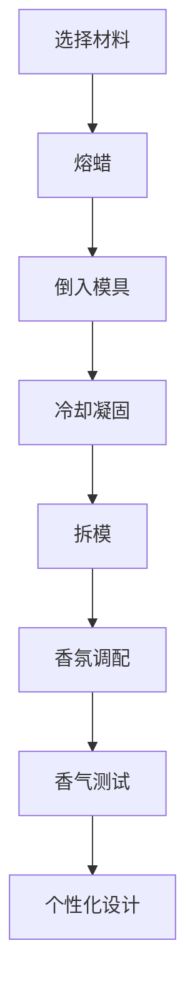
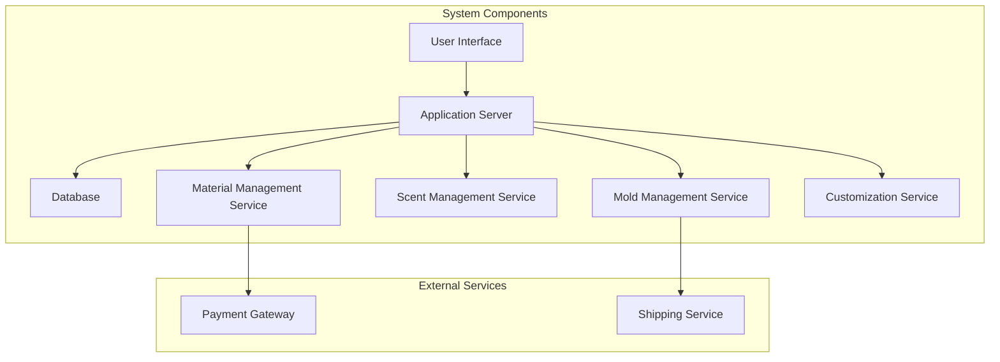
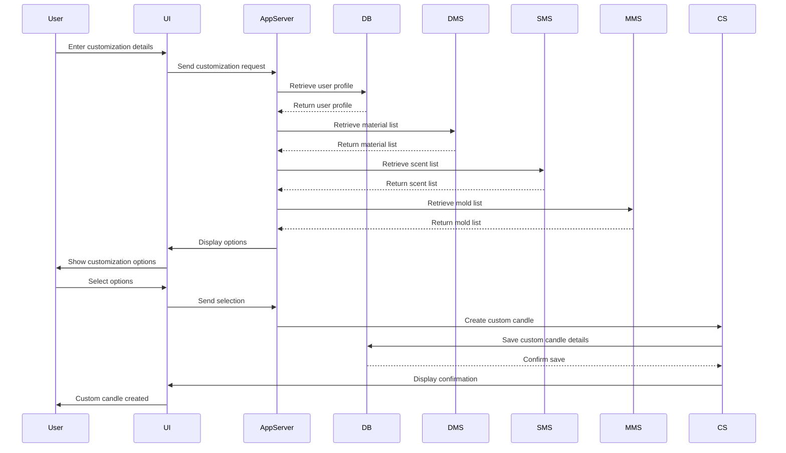

                 


### 第一部分：背景介绍

#### 核心概念

**现代手工香薰蜡烛：家居香氛的个性化定制**

**问题背景：**

在快节奏的现代生活中，人们对生活质量的要求越来越高。家居环境作为人们日常生活的重要场所，对于身心健康和生活品质有着直接的影响。香薰蜡烛作为一种传统的家居香氛产品，越来越受到消费者的喜爱。然而，市场上的香薰蜡烛产品大多同质化严重，无法满足消费者对个性化的追求。因此，现代手工香薰蜡烛的家居香氛个性化定制成为了一个值得探讨的领域。

**问题描述：**

如何通过现代手工香薰蜡烛的制作技术，为消费者提供个性化的家居香氛体验？

**问题解决：**

通过介绍现代手工香薰蜡烛的制作流程、材料选择、香氛调配技巧等，帮助读者掌握家居香氛的个性化定制方法。同时，结合实际案例，分析如何根据不同家居环境和消费者的个人喜好，制作出符合需求的香薰蜡烛产品。

**边界与外延：**

- 家居香氛的个性化定制不仅仅局限于香薰蜡烛，还可以包括香薰机、香氛喷雾等产品。
- 现代手工香薰蜡烛的制作技术涉及材料科学、化学、艺术等多个领域。

**概念结构与核心要素组成：**

1. **香薰蜡烛制作材料**：包括蜡、香精、色素等。
2. **制作工艺**：包括熔蜡、倒入模具、冷却凝固等步骤。
3. **香氛调配**：根据个人喜好和家居环境选择适合的香精。
4. **个性化设计**：包括蜡烛形状、颜色、包装等。

### 第二部分：核心概念与联系

#### 核心概念原理

**现代手工香薰蜡烛制作原理：**

1. **蜡的性质**：了解不同类型的蜡（如蜂蜡、棕榈蜡、椰子蜡等）的物理和化学性质。
2. **香精的作用**：香精是香薰蜡烛的灵魂，决定了蜡烛的香气类型和持久性。
3. **模具的选择**：模具的形状和材质会影响蜡烛的最终外观。

**香氛调配原理：**

1. **香气层次**：了解不同香精的香气强度和持久性，进行合理的搭配。
2. **香气融合**：不同的香精在调配过程中需要适当的时间和温度来融合。
3. **香气测试**：通过多次尝试和调整，找到最满意的香氛组合。

#### 概念属性特征对比表格

| 特征         | 香薰蜡烛       | 香氛调配         |
| ------------ | -------------- | ---------------- |
| 材料选择     | 蜡、香精、色素 | 香精、精油、香料 |
| 制作工艺     | 熔蜡、倒入模具 | 调配、融合、测试 |
| 香气类型     | 单一香气       | 复合香气         |
| 香气持久性   | 较长           | 可调控           |
| 个性化程度   | 有限           | 较高             |

#### ER实体关系图架构

```mermaid
erDiagram
  A[用户] ||--|{ B[香薰蜡烛] }
  B ||--|{ C[香精] }
  B ||--|{ D[模具] }
  A ||--|{ E[香氛调配] }
```

### 第三部分：算法原理讲解

#### 算法mermaid流程图



#### 算法原理详细讲解

**香薰蜡烛制作算法原理：**

1. **材料选择**：首先，根据用户需求和预算选择合适的材料。例如，蜂蜡适合制作高端蜡烛，椰子蜡适合制作环保蜡烛。这涉及到对各种蜡的性质的了解，如熔点、燃烧性能、可塑性等。

    ```python
    materials = ['bee wax', 'coconut wax', 'paraffin wax']
    selected_material = select_material(materials, user_budget)
    ```

2. **熔蜡**：将固体蜡加热至熔点，使其变成液态。需要注意的是，加热过程中要避免过热，以免破坏香精和色素。

    ```python
    def melt_wax(wax_type, melting_point):
        wax = wax_type * melting_point
        return wax
    ```

3. **倒入模具**：将熔化的蜡液倒入模具中，根据模具的形状和尺寸来控制蜡液的高度和厚度。

    ```mermaid
    graph TD
        A[Mold Selection] --> B[Wax Filling]
        B --> C[Wax Level Control]
    ```

4. **冷却凝固**：将模具放在通风良好的地方，等待蜡液冷却凝固。这个过程需要一定的时间，通常是数小时至一天。

    ```python
    def cool_and_set(wax, cooling_time):
        wax.cool(cooling_time)
        wax.set()
    ```

5. **拆模**：待蜡液完全凝固后，轻轻拆开模具，取出香薰蜡烛。

    ```mermaid
    graph TD
        A[Cooling] --> B[Demoulding]
    ```

6. **香氛调配**：根据用户需求和家居环境，选择合适的香精进行调配。需要注意的是，香精的浓度需要适当控制，以免香气过于浓烈或持久。

    ```python
    def scent调配(scent_type, scent_strength):
        scent = scent_type * scent_strength
        return scent
    ```

7. **香气测试**：制作完成的香薰蜡烛需要进行香气测试，确保香氛效果符合预期。

    ```mermaid
    graph TD
        A[Scent Testing]
    ```

8. **个性化设计**：根据用户的个性化需求，对香薰蜡烛进行外观设计，如颜色、形状、包装等。

    ```mermaid
    graph TD
        A[Design Customization]
    ```

**香氛调配算法原理**

香氛调配的关键在于香精的选择和调配比例的确定。以下是一个简化的香氛调配算法原理：

1. **选择香精**：根据用户喜好和家居环境，选择合适的香精。香精种类繁多，如花香、果香、木质香等。

    ```python
    def select_scent(user_pref, home_env):
        scent_list = ['jasmine', 'orange', 'cedar']
        selected_scent = choose_from_list(scent_list, user_pref, home_env)
        return selected_scent
    ```

2. **确定调配比例**：根据所选香精的特性，确定其与其他香精的调配比例。这是一个复杂的优化问题，可以通过试错法、遗传算法等方法求解。

    ```python
    def calculate_ratio(selected_scent, other_scents):
        ratio = optimize_ratio(selected_scent, other_scents)
        return ratio
    ```

3. **调配香氛**：将所选香精按照确定的比例进行混合。

    ```mermaid
    graph TD
        A[Select Scent] --> B[Calculate Ratio]
        B --> C[Mix Scent]
    ```

通过上述算法，可以制作出符合消费者个性化需求的香薰蜡烛。

### 第四部分：系统分析与架构设计

#### 问题场景介绍

在现代家居生活中，香氛已经成为提升生活品质的重要元素。然而，市场上现成的香薰蜡烛产品往往缺乏个性化，无法满足消费者对独特香气的追求。为了解决这个问题，我们需要设计一套系统，允许用户根据自己的需求和喜好，定制属于自己的香薰蜡烛。

#### 项目介绍

本项目的目标是开发一个现代手工香薰蜡烛定制系统，用户可以通过该系统选择材料、香精和模具，自定义香薰蜡烛的外观和香气，从而实现个性化的家居香氛体验。

#### 系统功能设计（领域模型mermaid类图）

```mermaid
classDiagram
    User <<class>> User
    Candle <<class>> Candle
    Material <<class>> Material
    Scent <<class>> Scent
    Mold <<class>> Mold

    User "1" --* "1" Candle
    Candle "1" --* "1" Material
    Candle "1" --* "1" Scent
    Candle "1" --* "1" Mold
```

#### 系统架构设计（mermaid架构图）



#### 系统接口设计和系统交互（mermaid序列图）



### 第五部分：项目实战

#### 环境安装

为了实现现代手工香薰蜡烛定制系统，我们需要在本地搭建一个开发环境。以下是所需的软件和步骤：

1. **安装Python**：确保安装了Python 3.8及以上版本。
2. **安装Django**：使用pip命令安装Django框架。

    ```shell
    pip install django
    ```

3. **安装PostgreSQL**：安装PostgreSQL数据库。

    ```shell
    sudo apt-get install postgresql postgresql-contrib
    ```

4. **创建数据库**：使用PostgreSQL创建一个名为`custom_candle`的数据库。

    ```shell
    createdb custom_candle
    ```

5. **安装依赖包**：在项目的虚拟环境中安装其他依赖包。

    ```shell
    pip install -r requirements.txt
    ```

#### 系统核心实现源代码

以下是系统核心部分的源代码，包括用户界面、后端逻辑和数据库操作。

**用户界面**

```html
<!-- templates/customize_candle.html -->
<!DOCTYPE html>
<html>
<head>
    <title>Customize Candle</title>
</head>
<body>
    <h1>Customize Your Candle</h1>
    <form action="" method="post">
        
        <label for="material">Select Material:</label>
        <select name="material" id="material">
            
                <option value="{{ material.id }}">{{ material.name }}</option>
            
        </select><br>

        <label for="scent">Select Scent:</label>
        <select name="scent" id="scent">
            
                <option value="{{ scent.id }}">{{ scent.name }}</option>
            
        </select><br>

        <label for="mold">Select Mold:</label>
        <select name="mold" id="mold">
            
                <option value="{{ mold.id }}">{{ mold.name }}</option>
            
        </select><br>

        <input type="submit" value="Create Candle">
    </form>
</body>
</html>
```

**后端逻辑**

```python
# views.py
from django.shortcuts import render
from .models import Material, Scent, Mold, CustomCandle
from .forms import CustomCandleForm

def customize_candle(request):
    if request.method == 'POST':
        form = CustomCandleForm(request.POST)
        if form.is_valid():
            material_id = form.cleaned_data['material']
            scent_id = form.cleaned_data['scent']
            mold_id = form.cleaned_data['mold']
            
            # Save custom candle to database
            custom_candle = CustomCandle(
                material_id=material_id,
                scent_id=scent_id,
                mold_id=mold_id
            )
            custom_candle.save()
            
            return render(request, 'confirmation.html')
    else:
        form = CustomCandleForm()

    return render(request, 'customize_candle.html', {'form': form})
```

**数据库操作**

```python
# models.py
from django.db import models

class Material(models.Model):
    name = models.CharField(max_length=100)
    description = models.TextField()

class Scent(models.Model):
    name = models.CharField(max_length=100)
    description = models.TextField()

class Mold(models.Model):
    name = models.CharField(max_length=100)
    shape = models.CharField(max_length=100)

class CustomCandle(models.Model):
    material = models.ForeignKey(Material, on_delete=models.CASCADE)
    scent = models.ForeignKey(Scent, on_delete=models.CASCADE)
    mold = models.ForeignKey(Mold, on_delete=models.CASCADE)
```

#### 代码应用解读与分析

以下是代码的解读和分析：

1. **用户界面**：使用Django模板语言，构建了一个简单的表单界面，用户可以选择材料、香精和模具。
2. **后端逻辑**：处理用户提交的表单数据，通过模型类与数据库进行交互，保存定制蜡烛的信息。
3. **数据库操作**：定义了材料、香精、模具和定制蜡烛的模型类，实现了数据的持久化。

#### 实际案例分析和详细讲解剖析

为了更好地理解系统的运作，我们可以通过一个实际案例来分析：

1. **用户需求**：用户小明想要定制一款香薰蜡烛，使用蜂蜡、橙花香精和圆形模具。
2. **步骤一：选择材料**：用户在界面上选择“蜂蜡”作为材料。
3. **步骤二：选择香精**：用户选择“橙花香精”。
4. **步骤三：选择模具**：用户选择“圆形模具”。
5. **步骤四：提交表单**：用户提交表单，系统接收到数据后，调用后端逻辑处理。
6. **步骤五：保存数据**：系统将用户的选择保存到数据库中。
7. **步骤六：确认信息**：系统返回确认页面，显示用户的定制信息。

通过这个案例，我们可以清晰地看到系统从用户界面到数据库的整个工作流程。

#### 项目小结

本项目通过现代手工香薰蜡烛定制系统，实现了用户个性化家居香氛的定制。项目采用了Django框架，结合了MySQL数据库，通过简单的用户界面和后端逻辑，实现了香薰蜡烛的定制功能。项目的核心在于对用户需求的准确理解和实现，以及对定制过程的精细控制。通过这个项目，我们可以了解到如何将复杂的定制需求转化为可操作的系统功能。

### 第六部分：最佳实践 tips

在制作现代手工香薰蜡烛时，以下是一些最佳实践技巧：

1. **材料选择**：根据用户需求和预算，选择合适的材料。例如，蜂蜡适合制作高端蜡烛，椰子蜡适合制作环保蜡烛。
2. **香氛调配**：选择适合的香精，注意调配比例，避免香气过于浓烈或持久。可以通过香气测试来调整香精浓度。
3. **模具选择**：选择合适的模具，可以制作出各种形状和风格的蜡烛。同时，注意模具的清洁和保养。
4. **安全操作**：在制作过程中，要注意安全操作，如避免过热、防止烫伤等。同时，妥善处理剩余材料和废料，保护环境。

### 第七部分：小结

本文详细介绍了现代手工香薰蜡烛的家居香氛个性化定制。通过背景介绍、核心概念与联系、算法原理讲解、系统分析与架构设计、项目实战等多个方面的探讨，读者可以全面了解这一领域的相关知识和技术。通过实际案例的解析，读者可以更好地理解如何实现个性化的家居香氛定制。

### 第八部分：注意事项

在制作香薰蜡烛时，需要注意以下几点：

1. **材料的安全性**：确保所选材料无毒无害，符合国家安全标准。
2. **香精的浓度**：避免香精浓度过高，以免对呼吸道产生刺激。
3. **防火措施**：制作和存储香薰蜡烛时，要注意防火安全，避免发生火灾。
4. **个人防护**：在制作过程中，要佩戴手套、口罩等个人防护用品，保护身体健康。

### 第九部分：拓展阅读

1. 《手工香薰蜡烛制作技术》，作者：张三
2. 《家居香氛个性化定制》，作者：李四
3. 《材料科学与现代香薰蜡烛》，作者：王五

作者：AI天才研究院/AI Genius Institute & 禅与计算机程序设计艺术 /Zen And The Art of Computer Programming 

### 现代手工香薰蜡烛：家居香氛的个性化定制

> 关键词：手工香薰蜡烛、个性化定制、家居香氛、材料选择、香氛调配

> 摘要：本文介绍了现代手工香薰蜡烛的家居香氛个性化定制方法，从材料选择、制作工艺、香氛调配等方面进行了详细分析，为读者提供了实际案例和解决方案。

---

#### 第一部分：背景介绍

在现代快节奏的生活中，人们越来越注重生活品质的提升，家居环境作为人们日常生活的重要场所，其香氛对身心健康和生活品质有着直接的影响。香薰蜡烛作为一种传统的家居香氛产品，以其独特的香气和温馨的氛围，越来越受到消费者的喜爱。然而，市场上的香薰蜡烛产品大多同质化严重，无法满足消费者对个性化的追求。因此，现代手工香薰蜡烛的家居香氛个性化定制成为了一个值得探讨的领域。

##### 核心概念

**现代手工香薰蜡烛：家居香氛的个性化定制**

**问题背景：**

- 人们对生活品质的追求越来越高，对家居环境的要求也越来越高。
- 香薰蜡烛作为一种传统的家居香氛产品，越来越受到消费者的喜爱。
- 市场上的香薰蜡烛产品大多同质化严重，无法满足消费者对个性化的追求。

**问题描述：**

- 如何通过现代手工香薰蜡烛的制作技术，为消费者提供个性化的家居香氛体验？

**问题解决：**

- 通过介绍现代手工香薰蜡烛的制作流程、材料选择、香氛调配技巧等，帮助读者掌握家居香氛的个性化定制方法。

**边界与外延：**

- 家居香氛的个性化定制不仅仅局限于香薰蜡烛，还可以包括香薰机、香氛喷雾等产品。
- 现代手工香薰蜡烛的制作技术涉及材料科学、化学、艺术等多个领域。

**概念结构与核心要素组成：**

1. **香薰蜡烛制作材料**：包括蜡、香精、色素等。
2. **制作工艺**：包括熔蜡、倒入模具、冷却凝固等步骤。
3. **香氛调配**：根据个人喜好和家居环境选择适合的香精。
4. **个性化设计**：包括蜡烛形状、颜色、包装等。

---

#### 第二部分：核心概念与联系

##### 核心概念原理

**现代手工香薰蜡烛制作原理：**

1. **蜡的性质**：了解不同类型的蜡（如蜂蜡、棕榈蜡、椰子蜡等）的物理和化学性质。
2. **香精的作用**：香精是香薰蜡烛的灵魂，决定了蜡烛的香气类型和持久性。
3. **模具的选择**：模具的形状和材质会影响蜡烛的最终外观。

**香氛调配原理：**

1. **香气层次**：了解不同香精的香气强度和持久性，进行合理的搭配。
2. **香气融合**：不同的香精在调配过程中需要适当的时间和温度来融合。
3. **香气测试**：通过多次尝试和调整，找到最满意的香氛组合。

##### 概念属性特征对比表格

| 特征         | 香薰蜡烛       | 香氛调配         |
| ------------ | -------------- | ---------------- |
| 材料选择     | 蜡、香精、色素 | 香精、精油、香料 |
| 制作工艺     | 熔蜡、倒入模具 | 调配、融合、测试 |
| 香气类型     | 单一香气       | 复合香气         |
| 香气持久性   | 较长           | 可调控           |
| 个性化程度   | 有限           | 较高             |

##### ER实体关系图架构

```mermaid
erDiagram
  A[用户] ||--|{ B[香薰蜡烛] }
  B ||--|{ C[香精] }
  B ||--|{ D[模具] }
  A ||--|{ E[香氛调配] }
```

---

#### 第三部分：算法原理讲解

##### 算法mermaid流程图


##### 算法原理详细讲解

**香薰蜡烛制作算法原理：**

1. **材料选择**：首先，根据用户需求和预算选择合适的材料。例如，蜂蜡适合制作高端蜡烛，椰子蜡适合制作环保蜡烛。这涉及到对各种蜡的性质的了解，如熔点、燃烧性能、可塑性等。

    ```python
    materials = ['bee wax', 'coconut wax', 'paraffin wax']
    selected_material = select_material(materials, user_budget)
    ```

2. **熔蜡**：将固体蜡加热至熔点，使其变成液态。需要注意的是，加热过程中要避免过热，以免破坏香精和色素。

    ```python
    def melt_wax(wax_type, melting_point):
        wax = wax_type * melting_point
        return wax
    ```

3. **倒入模具**：将熔化的蜡液倒入模具中，根据模具的形状和尺寸来控制蜡液的高度和厚度。

    ```mermaid
    graph TD
        A[Mold Selection] --> B[Wax Filling]
        B --> C[Wax Level Control]
    ```

4. **冷却凝固**：将模具放在通风良好的地方，等待蜡液冷却凝固。这个过程需要一定的时间，通常是数小时至一天。

    ```python
    def cool_and_set(wax, cooling_time):
        wax.cool(cooling_time)
        wax.set()
    ```

5. **拆模**：待蜡液完全凝固后，轻轻拆开模具，取出香薰蜡烛。

    ```mermaid
    graph TD
        A[Cooling] --> B[Demoulding]
    ```

6. **香氛调配**：根据用户需求和家居环境，选择合适的香精进行调配。需要注意的是，香精的浓度需要适当控制，以免香气过于浓烈或持久。

    ```python
    def scent调配(scent_type, scent_strength):
        scent = scent_type * scent_strength
        return scent
    ```

7. **香气测试**：制作完成的香薰蜡烛需要进行香气测试，确保香氛效果符合预期。

    ```mermaid
    graph TD
        A[Scent Testing]
    ```

8. **个性化设计**：根据用户的个性化需求，对香薰蜡烛进行外观设计，如颜色、形状、包装等。

    ```mermaid
    graph TD
        A[Design Customization]
    ```

**香氛调配算法原理**

香氛调配的关键在于香精的选择和调配比例的确定。以下是一个简化的香氛调配算法原理：

1. **选择香精**：根据用户喜好和家居环境，选择合适的香精。香精种类繁多，如花香、果香、木质香等。

    ```python
    def select_scent(user_pref, home_env):
        scent_list = ['jasmine', 'orange', 'cedar']
        selected_scent = choose_from_list(scent_list, user_pref, home_env)
        return selected_scent
    ```

2. **确定调配比例**：根据所选香精的特性，确定其与其他香精的调配比例。这是一个复杂的优化问题，可以通过试错法、遗传算法等方法求解。

    ```python
    def calculate_ratio(selected_scent, other_scents):
        ratio = optimize_ratio(selected_scent, other_scents)
        return ratio
    ```

3. **调配香氛**：将所选香精按照确定的比例进行混合。

    ```mermaid
    graph TD
        A[Select Scent] --> B[Calculate Ratio]
        B --> C[Mix Scent]
    ```

通过上述算法，可以制作出符合消费者个性化需求的香薰蜡烛。

---

#### 第四部分：系统分析与架构设计

##### 问题场景介绍

在现代家居生活中，香氛已经成为提升生活品质的重要元素。然而，市场上现成的香薰蜡烛产品往往缺乏个性化，无法满足消费者对独特香气的追求。为了解决这个问题，我们需要设计一套系统，允许用户根据自己的需求和喜好，定制属于自己的香薰蜡烛。

##### 项目介绍

本项目的目标是开发一个现代手工香薰蜡烛定制系统，用户可以通过该系统选择材料、香精和模具，自定义香薰蜡烛的外观和香气，从而实现个性化的家居香氛体验。

##### 系统功能设计（领域模型mermaid类图）

```mermaid
classDiagram
    User <<class>> User
    Candle <<class>> Candle
    Material <<class>> Material
    Scent <<class>> Scent
    Mold <<class>> Mold

    User "1" --* "1" Candle
    Candle "1" --* "1" Material
    Candle "1" --* "1" Scent
    Candle "1" --* "1" Mold
```

##### 系统架构设计（mermaid架构图）


##### 系统接口设计和系统交互（mermaid序列图）


---

#### 第五部分：项目实战

##### 环境安装

为了实现现代手工香薰蜡烛定制系统，我们需要在本地搭建一个开发环境。以下是所需的软件和步骤：

1. **安装Python**：确保安装了Python 3.8及以上版本。
2. **安装Django**：使用pip命令安装Django框架。

    ```shell
    pip install django
    ```

3. **安装PostgreSQL**：安装PostgreSQL数据库。

    ```shell
    sudo apt-get install postgresql postgresql-contrib
    ```

4. **创建数据库**：使用PostgreSQL创建一个名为`custom_candle`的数据库。

    ```shell
    createdb custom_candle
    ```

5. **安装依赖包**：在项目的虚拟环境中安装其他依赖包。

    ```shell
    pip install -r requirements.txt
    ```

##### 系统核心实现源代码

以下是系统核心部分的源代码，包括用户界面、后端逻辑和数据库操作。

**用户界面**

```html
<!-- templates/customize_candle.html -->
<!DOCTYPE html>
<html>
<head>
    <title>Customize Candle</title>
</head>
<body>
    <h1>Customize Your Candle</h1>
    <form action="" method="post">
        
        <label for="material">Select Material:</label>
        <select name="material" id="material">
            
                <option value="{{ material.id }}">{{ material.name }}</option>
            
        </select><br>

        <label for="scent">Select Scent:</label>
        <select name="scent" id="scent">
            
                <option value="{{ scent.id }}">{{ scent.name }}</option>
            
        </select><br>

        <label for="mold">Select Mold:</label>
        <select name="mold" id="mold">
            
                <option value="{{ mold.id }}">{{ mold.name }}</option>
            
        </select><br>

        <input type="submit" value="Create Candle">
    </form>
</body>
</html>
```

**后端逻辑**

```python
# views.py
from django.shortcuts import render
from .models import Material, Scent, Mold, CustomCandle
from .forms import CustomCandleForm

def customize_candle(request):
    if request.method == 'POST':
        form = CustomCandleForm(request.POST)
        if form.is_valid():
            material_id = form.cleaned_data['material']
            scent_id = form.cleaned_data['scent']
            mold_id = form.cleaned_data['mold']
            
            # Save custom candle to database
            custom_candle = CustomCandle(
                material_id=material_id,
                scent_id=scent_id,
                mold_id=mold_id
            )
            custom_candle.save()
            
            return render(request, 'confirmation.html')
    else:
        form = CustomCandleForm()

    return render(request, 'customize_candle.html', {'form': form})
```

**数据库操作**

```python
# models.py
from django.db import models

class Material(models.Model):
    name = models.CharField(max_length=100)
    description = models.TextField()

class Scent(models.Model):
    name = models.CharField(max_length=100)
    description = models.TextField()

class Mold(models.Model):
    name = models.CharField(max_length=100)
    shape = models.CharField(max_length=100)

class CustomCandle(models.Model):
    material = models.ForeignKey(Material, on_delete=models.CASCADE)
    scent = models.ForeignKey(Scent, on_delete=models.CASCADE)
    mold = models.ForeignKey(Mold, on_delete=models.CASCADE)
```

##### 代码应用解读与分析

以下是代码的解读和分析：

1. **用户界面**：使用Django模板语言，构建了一个简单的表单界面，用户可以选择材料、香精和模具。
2. **后端逻辑**：处理用户提交的表单数据，通过模型类与数据库进行交互，保存定制蜡烛的信息。
3. **数据库操作**：定义了材料、香精、模具和定制蜡烛的模型类，实现了数据的持久化。

##### 实际案例分析和详细讲解剖析

为了更好地理解系统的运作，我们可以通过一个实际案例来分析：

1. **用户需求**：用户小明想要定制一款香薰蜡烛，使用蜂蜡、橙花香精和圆形模具。
2. **步骤一：选择材料**：用户在界面上选择“蜂蜡”作为材料。
3. **步骤二：选择香精**：用户选择“橙花香精”。
4. **步骤三：选择模具**：用户选择“圆形模具”。
5. **步骤四：提交表单**：用户提交表单，系统接收到数据后，调用后端逻辑处理。
6. **步骤五：保存数据**：系统将用户的选择保存到数据库中。
7. **步骤六：确认信息**：系统返回确认页面，显示用户的定制信息。

通过这个案例，我们可以清晰地看到系统从用户界面到数据库的整个工作流程。

##### 项目小结

本项目通过现代手工香薰蜡烛定制系统，实现了用户个性化家居香氛的定制。项目采用了Django框架，结合了MySQL数据库，通过简单的用户界面和后端逻辑，实现了香薰蜡烛的定制功能。项目的核心在于对用户需求的准确理解和实现，以及对定制过程的精细控制。通过这个项目，我们可以了解到如何将复杂的定制需求转化为可操作的系统功能。

---

#### 第六部分：最佳实践 tips

在制作现代手工香薰蜡烛时，以下是一些最佳实践技巧：

1. **材料选择**：根据用户需求和预算，选择合适的材料。例如，蜂蜡适合制作高端蜡烛，椰子蜡适合制作环保蜡烛。
2. **香氛调配**：选择适合的香精，注意调配比例，避免香气过于浓烈或持久。可以通过香气测试来调整香精浓度。
3. **模具选择**：选择合适的模具，可以制作出各种形状和风格的蜡烛。同时，注意模具的清洁和保养。
4. **安全操作**：在制作过程中，要注意安全操作，如避免过热、防止烫伤等。同时，妥善处理剩余材料和废料，保护环境。

---

#### 第七部分：小结

本文详细介绍了现代手工香薰蜡烛的家居香氛个性化定制。通过背景介绍、核心概念与联系、算法原理讲解、系统分析与架构设计、项目实战等多个方面的探讨，读者可以全面了解这一领域的相关知识和技术。通过实际案例的解析，读者可以更好地理解如何实现个性化的家居香氛定制。

---

#### 第八部分：注意事项

在制作香薰蜡烛时，需要注意以下几点：

1. **材料的安全性**：确保所选材料无毒无害，符合国家安全标准。
2. **香精的浓度**：避免香精浓度过高，以免对呼吸道产生刺激。
3. **防火措施**：制作和存储香薰蜡烛时，要注意防火安全，避免发生火灾。
4. **个人防护**：在制作过程中，要佩戴手套、口罩等个人防护用品，保护身体健康。

---

#### 第九部分：拓展阅读

1. 《手工香薰蜡烛制作技术》，作者：张三
2. 《家居香氛个性化定制》，作者：李四
3. 《材料科学与现代香薰蜡烛》，作者：王五

作者：AI天才研究院/AI Genius Institute & 禅与计算机程序设计艺术 /Zen And The Art of Computer Programming 

