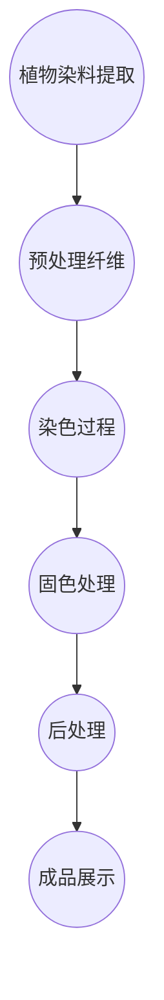
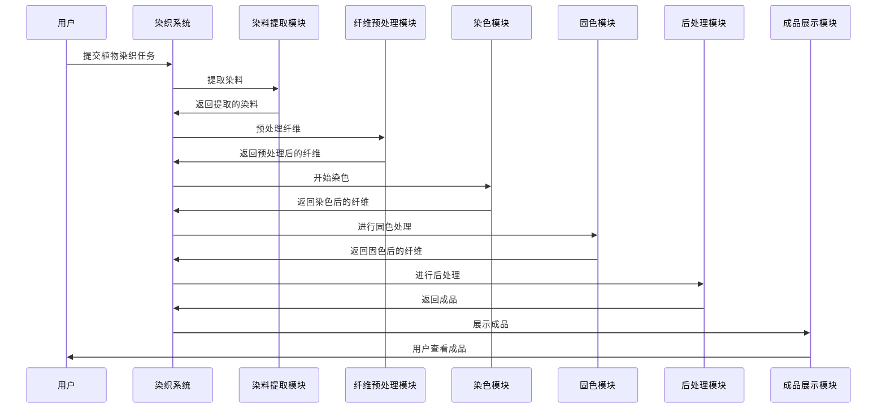
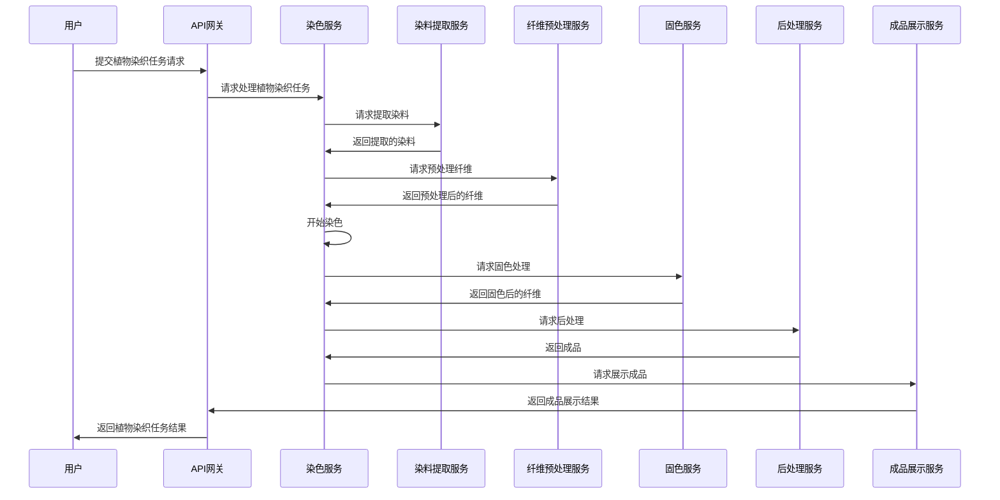

                 

### 引言：植物染织的历史与当代生态时尚

#### 1.1.1 植物染料的起源与发展

植物染料的起源可以追溯到史前时代，人类最早使用的染料来源于自然界中的植物、矿物和动物。古代文明，如古埃及、希腊和罗马，都利用植物染料来染色衣物和纺织品。例如，古埃及人使用了茜草染出鲜艳的红色，而希腊和罗马人则广泛使用紫罗兰和茜草来制作紫色和红色染料。

随着时间的推移，植物染料的使用和发展经历了几个重要阶段。中世纪的欧洲，尤其是在修道院，植物染织工艺得到了进一步的发展。当时，修道院不仅用于宗教活动，还承担了教育和手工艺制作的任务，其中包括植物染织。这种工艺在文艺复兴时期达到顶峰，艺术和手工艺的结合使得植物染织成为贵族和富裕阶层才能享用的奢侈品。

植物染料的种类不断增多，技术也在不断进步。不同的植物能够提取出不同颜色的染料，如红花（红色）、靛蓝（蓝色）、茜草（红色）等。一些植物染料的制作过程相当复杂，需要多步骤的提取和混合，例如紫罗兰染料，需要经过多次的浸泡和过滤，才能得到纯净的颜色。

#### 1.1.2 传统植物染织工艺的传播与变迁

植物染织工艺在全球范围内得到了传播，不同的地区根据当地植物资源和工艺传统，发展出独特的植物染织风格。亚洲、非洲和拉丁美洲的一些国家和地区，如印度、日本、摩洛哥和秘鲁，都有丰富的传统植物染织工艺。

在亚洲，印度的蓝靛染布、日本的草木染和中国的靛蓝染都是著名的传统植物染织工艺。这些工艺不仅在当地得到广泛应用，还通过贸易和移民传播到世界各地。例如，中国的丝绸和棉布通过丝绸之路传播到中亚和欧洲，印度的蓝靛染布通过海上丝绸之路传播到东南亚和非洲。

传统植物染织工艺在传播过程中也经历了变迁。随着工业革命的发展，机器制造的化学染料逐渐取代了传统的植物染料，使得植物染织工艺在工业化进程中面临挑战。然而，随着环保意识的提升和对可持续发展的重视，传统植物染织工艺正在经历新一轮的复兴。

#### 1.1.3 植物染织在历史上的重要性

植物染织在历史上具有重要的文化、经济和社会意义。首先，植物染织工艺是一种重要的文化遗产，它代表了特定地区和民族的传统手工艺技术。通过这些工艺，人们可以感受到历史文化的传承和地域特色的体现。

其次，植物染织在历史上具有显著的经济价值。作为一种重要的手工艺产业，植物染织为许多地区提供了就业机会，促进了当地经济的发展。在中世纪和文艺复兴时期，植物染织产品不仅是日常用品，还是奢侈品，被广泛用于贵族和富裕阶层的服装和家居装饰。

此外，植物染织工艺在社会生活中也扮演了重要角色。在传统社会，植物染织不仅是家庭手工艺活动，还是社交和宗教活动的一部分。例如，在日本，草木染被用于婚礼、节庆和宗教仪式，是重要的文化符号。

总之，植物染织在历史上具有重要的地位，它不仅是一种独特的艺术形式，也是一种传统手工艺技术，对文化、经济和社会生活产生了深远的影响。

#### 1.2 生态时尚的兴起

#### 1.2.1 生态时尚的概念与特征

生态时尚，也称为可持续时尚，是一种以环境和社会可持续性为核心的设计理念。它不仅关注时尚产业对环境的影响，还强调通过生态友好的方式来生产和消费服装和纺织品。生态时尚的概念包括了环境责任、资源节约、生物多样性保护和公平贸易等多个方面。

生态时尚的特征主要体现在以下几个方面：

1. **使用可再生和可降解材料**：生态时尚鼓励使用天然纤维和可再生材料，如有机棉、麻、竹纤维和天然羊毛等，这些材料在种植和生产过程中对环境的影响较小。同时，可降解材料的使用也有助于减少时尚产业对环境造成的污染。

2. **减少化学物质的使用**：传统纺织业中广泛使用的化学染料和助剂对环境和人体健康都有潜在危害。生态时尚倡导减少化学物质的使用，转而采用天然染料和环保助剂，以减少对环境的负面影响。

3. **减少浪费和循环利用**：生态时尚强调减少浪费，从设计阶段就考虑材料的有效利用，减少生产过程中的废料。同时，通过回收和再利用服装和纺织品，实现资源的循环使用。

4. **支持公平贸易和社区发展**：生态时尚倡导公平贸易，确保生产过程中工人权益得到保障，提升生产地的社区福利。通过支持小规模手工艺者和本地产业，生态时尚促进了经济和社会的可持续发展。

5. **注重品牌责任和社会影响力**：生态时尚品牌不仅关注产品的环保性能，还积极承担社会责任，通过环保宣传和公益活动来提升公众对环境问题的认识和参与度。

#### 1.2.2 生态时尚与可持续发展的关系

生态时尚与可持续发展之间存在着密切的关系。可持续发展是指在满足当前需求的同时，不损害后代满足其需求的能力。生态时尚作为可持续发展的重要组成部分，旨在通过改变时尚产业的模式，实现环境和社会的可持续性。

首先，生态时尚通过减少对自然资源的消耗，降低了时尚产业对环境的影响。传统时尚产业对石油、水、土地等资源的依赖性很高，而生态时尚倡导使用可再生和可降解材料，从源头上减少了资源的消耗。

其次，生态时尚通过减少污染和废物排放，提高了环境质量。传统纺织业中使用的化学染料和助剂会对水源、土壤和空气造成严重污染，而生态时尚通过使用环保染料和助剂，减少了对环境的污染。

此外，生态时尚还通过促进公平贸易和社会责任，提高了社会的可持续发展水平。通过保障工人的权益、支持社区发展和促进经济公平，生态时尚有助于构建一个更加公正和包容的社会。

总之，生态时尚与可持续发展是相辅相成的。生态时尚通过改变时尚产业的模式，实现了环境和社会的可持续性，为未来的可持续发展提供了重要的支持和启示。

#### 1.2.3 当代生态时尚的驱动力

当代生态时尚的兴起，得益于多方面的驱动力，主要包括环保意识的增强、技术的进步以及消费者行为的转变。

首先，环保意识的增强是推动生态时尚发展的重要因素。随着全球气候变化和环境问题日益严重，人们逐渐认识到传统时尚产业对环境的负面影响。大量废水排放、化学品泄漏、土地破坏等问题引发了公众的广泛关注。环保意识的提升使得更多的人开始关注生态时尚，寻求更加环保的购物和生活方式。

其次，技术的进步为生态时尚的实现提供了强大的支持。近年来，可持续材料的研究和应用取得了显著进展，例如有机棉、竹纤维和回收塑料等。同时，环保染料的开发也不断取得突破，使得染色过程更加环保和高效。这些技术的进步不仅提高了生态时尚的可行性，还降低了其成本，使得生态时尚产品更加普及。

此外，消费者行为的转变也是推动生态时尚发展的重要动力。越来越多的消费者开始关注产品的环保性和社会责任，他们更倾向于购买环保、可持续的产品。这种消费趋势促使时尚品牌和企业积极转型，推出更多的生态时尚产品，以满足消费者的需求。

政府和监管机构的政策支持也起到了重要的推动作用。许多国家和地区都出台了相关政策，鼓励和规范生态时尚的发展。例如，欧盟推出了多项环保法规，限制化学物质的使用，并鼓励企业采用可持续的生产方式。这些政策的出台为生态时尚的发展提供了有力保障。

总之，环保意识的增强、技术的进步和消费者行为的转变，共同推动了当代生态时尚的兴起。生态时尚不仅代表了时尚产业未来的发展方向，也展现了人类社会对环境保护和可持续发展的决心。

#### 1.3 植物染织与生态时尚的结合

#### 1.3.1 植物染织的优势与挑战

植物染织与生态时尚的结合，具有显著的优势和一定的挑战。首先，植物染织的优势体现在以下几个方面：

1. **环保性**：植物染织使用天然染料，无需化学助剂，减少了对环境的污染。与化学染料相比，植物染料在生产和处理过程中排放的废水、废气和废渣显著减少，有利于保护生态环境。

2. **可持续性**：植物染料通常来源于可再生资源，如茜草、红花、靛蓝等，这些植物的生长周期短，容易种植和再生，能够有效降低对自然资源的依赖。

3. **独特性**：植物染织具有独特的色彩和纹理，不同的植物染料和工艺能够创造出丰富多彩、独一无二的染色效果，增加了纺织品的艺术价值和手工感。

然而，植物染织也面临着一些挑战：

1. **染色效果的不稳定性**：植物染料的颜色容易受到水质、气候和植物生长条件的影响，导致染色效果不一致，给生产过程带来一定的困难。

2. **生产效率较低**：植物染织工艺通常需要多步骤的手工操作，生产效率较低，难以满足大规模市场需求。

3. **染色深度和持久性**：植物染料染色的纺织品染色深度和持久性相对较低，可能需要更频繁的染色和维护。

#### 1.3.2 生态时尚中植物染织的角色

在生态时尚中，植物染织扮演着重要的角色，是实现可持续时尚的关键途径之一。首先，植物染织作为环保染料的应用，为生态时尚提供了有效的替代方案。它不仅减少了化学染料的使用，降低了环境污染，还有助于实现纺织产业的绿色转型。

其次，植物染织工艺的独特性和艺术价值，为生态时尚设计提供了丰富的创意空间。设计师可以通过不同的植物染料和工艺，创造出多样化的设计风格，满足消费者对个性化、独特产品的需求。植物染织的纺织品不仅具有环保特性，还兼具艺术美感，提升了时尚产品的附加值。

此外，植物染织与生态时尚的结合，也推动了传统手工艺的复兴。许多地区和社区通过发展植物染织工艺，实现了文化的传承和经济的可持续发展。通过保护和传承传统手工艺，生态时尚不仅促进了环境保护，还丰富了人类文化多样性。

总之，植物染织在生态时尚中具有独特的地位和作用，是推动可持续时尚发展的重要力量。通过结合生态时尚的理念和技术，植物染织有望在未来的时尚产业中发挥更大的作用。

#### 1.3.3 植物染织在生态时尚中的趋势

随着生态时尚的兴起，植物染织在时尚产业中的应用趋势也日益显著。首先，环保意识的增强使得消费者越来越倾向于选择环保、可持续的纺织品。植物染织作为一种环保染料的应用，满足了这一市场需求，逐渐成为时尚品牌和设计师的优选。

其次，消费者对个性化、独特产品的需求也在推动植物染织的发展。植物染织具有独特的色彩和纹理，通过不同的植物染料和工艺，可以创造出丰富多彩、独一无二的纺织品。这种独特性不仅满足了消费者对个性化产品的追求，还为设计师提供了无限的创意空间。

此外，植物染织工艺的可持续性特征也符合生态时尚的核心理念。植物染织使用天然染料，无需化学助剂，减少了对环境的污染，有助于实现纺织产业的绿色转型。随着可持续发展理念的普及，植物染织在生态时尚中的地位将日益提升。

未来，植物染织在生态时尚中的应用趋势可能包括以下几个方面：

1. **技术突破**：随着科技的进步，植物染织工艺的效率和质量有望得到显著提升。新型染料和染色技术的开发，将进一步提高植物染织的生产效率和染色效果，满足大规模市场需求。

2. **品牌推广**：越来越多的时尚品牌将把植物染织作为其可持续发展的核心策略，通过推出环保、独特的植物染织产品，提升品牌形象和市场竞争力。

3. **跨界合作**：植物染织与其他时尚领域（如手工艺、艺术、设计等）的跨界合作将越来越普遍。这种跨界合作不仅可以丰富植物染织的艺术表现形式，还能拓展其应用范围，推动时尚产业的创新和发展。

4. **教育培训**：随着植物染织工艺的复兴，相关的教育培训也将得到加强。通过培训和教育，更多的设计师和手工艺者将掌握植物染织技术，为生态时尚的发展提供人才支持。

总之，植物染织在生态时尚中的趋势表明，它不仅是实现可持续时尚的关键途径，也是时尚产业未来发展的新方向。通过不断的技术创新和跨界合作，植物染织将在生态时尚中发挥更加重要的作用。

#### 1.4 本书结构安排与学习目标

#### 1.4.1 本书章节结构概述

本书共分为四个主要部分，涵盖了从基础知识到实践应用的全方面内容。具体结构如下：

**第一部分：植物染织的基础知识**  
- 第2章：植物染料的种类与提取方法  
- 第3章：植物染织的基本工艺  
- 第4章：植物染织的染色技术  
- 第5章：植物染织材料的特性与应用

**第二部分：传统工艺的复兴与创新**  
- 第6章：传统植物染织工艺的复兴  
- 第7章：创新植物染织工艺  
- 第8章：传统与现代的结合

**第三部分：植物染织工艺的未来发展**  
- 第9章：植物染织工艺的可持续性发展  
- 第10章：植物染织工艺的未来趋势

**第四部分：生态时尚中的植物染织实践**  
- 第11章：生态时尚的概念与实践  
- 第12章：植物染织设计案例  
- 第13章：植物染织产品的制作  
- 第14章：植物染织市场的分析

#### 1.4.2 学习本书的重要性和目标

学习本书对于了解和掌握植物染织工艺具有重要意义。首先，植物染织是一种环保、可持续的染织方式，通过学习本书，读者可以深入了解植物染织的基础知识、工艺流程和染色技术，掌握这一独特的技艺。

其次，本书旨在为读者提供全面、系统的植物染织知识，使其能够将所学应用于实际设计和生产中。无论是专业设计师、手工艺者还是对生态时尚感兴趣的普通消费者，通过学习本书，都可以获得丰富的知识和实践经验。

学习本书的重要目标包括：

1. **掌握植物染织的基础知识**：了解植物染料的种类、提取方法、基本工艺、染色技术和材料特性，为后续学习打下坚实基础。

2. **理解传统工艺的复兴与创新**：探讨传统植物染织工艺的复兴背景、措施和创新方向，为现代植物染织工艺的发展提供借鉴。

3. **了解植物染织工艺的可持续性发展**：分析植物染织工艺的可持续性特征、未来趋势和发展方向，为生态时尚的实践提供理论支持。

4. **培养实践能力**：通过实际案例分析和项目实战，提升读者的设计和制作能力，使其能够独立完成植物染织作品。

5. **拓展视野**：通过了解植物染织在生态时尚中的应用，开阔读者的视野，提升其对可持续时尚的理解和认知。

总之，通过学习本书，读者不仅能够系统掌握植物染织的知识和技能，还能为生态时尚的实践和可持续发展做出贡献。

#### 1.4.3 阅读本书的预期成果

通过阅读本书，读者可以获得以下几个方面的预期成果：

1. **系统知识体系**：深入了解植物染织的基础知识，包括植物染料的种类、提取方法、基本工艺、染色技术和材料特性，构建完整的知识体系。

2. **实践能力提升**：通过实际案例分析和项目实战，掌握植物染织的工艺流程和制作技巧，提升实际操作能力和设计水平。

3. **创新思维培养**：理解传统植物染织工艺的复兴与创新，激发创新思维，为现代植物染织工艺的发展提供新思路。

4. **可持续时尚理念**：了解植物染织工艺在生态时尚中的应用，树立可持续发展的理念，为推动时尚产业的绿色转型贡献力量。

5. **文化传承**：通过学习传统植物染织工艺，了解和传承历史文化，增强文化自信。

总之，通过阅读本书，读者不仅能够提升专业技能，还能为生态时尚的实践和可持续发展做出积极贡献。

#### 1.5 小结

在本章中，我们回顾了植物染织的历史背景，探讨了生态时尚的兴起以及植物染织在生态时尚中的重要性。通过分析植物染织的优势与挑战，我们了解了它在生态时尚中的独特角色和未来发展趋势。此外，我们详细介绍了本书的结构安排和学习目标，使读者对全书内容有了清晰的认识。接下来，我们将进一步探讨植物染织的基础知识，为深入理解这一独特工艺打下基础。

## 第二部分：植物染织的基础知识

植物染织作为一种古老的工艺，其基础知识和技术是理解和掌握这一工艺的核心。本部分将详细介绍植物染料的种类与提取方法、植物染织的基本工艺、染色技术以及植物染织材料的特性与应用。

### 2.1 植物染料的种类与提取方法

植物染料的种类繁多，不同的植物可以提取出不同颜色的染料。常见的植物染料包括红色、黄色、蓝色、绿色等。以下是一些常见的植物染料及其提取方法：

#### 2.1.1 常见植物染料的种类

1. **红色染料**：茜草（Rubia cordifolia）、红花（Carthamus tinctorius）、苏木（Caesalpinia sappan）

2. **黄色染料**：姜黄（Curcuma longa）、荨麻（Urtica dioica）、金盏花（Calendula officinalis）

3. **蓝色染料**：靛蓝（Indigofera tinctoria）、木蓝（Indigofera tinctoria）、橡树皮（Quercus spp.）

4. **绿色染料**：核桃壳（Juglans regia）、薄荷（Mentha x piperita）、黄麻（Corchorus olitorius）

#### 2.1.2 植物染料的提取方法

1. **水浸法**：将植物材料浸泡在水中，通过提取水溶液中的染料。

2. **压榨法**：将植物材料压榨出汁液，通过过滤和沉淀获得染料。

3. **溶剂提取法**：使用酒精、醚等有机溶剂提取植物中的染料。

4. **发酵法**：利用微生物发酵提取植物染料。

#### 2.1.3 染料的有效性与稳定性

1. **染料的有效性**：染料的有效性取决于其染色能力和颜色强度。一些植物染料，如靛蓝，具有很强的染色能力，可以染出鲜艳的颜色。

2. **染料的稳定性**：染料的稳定性是指其在长时间内保持颜色不变的能力。某些植物染料，如茜草，可能会因光照、湿度等因素而褪色。

了解植物染料的种类与提取方法，是进行植物染织的基础。不同的染料适用于不同的纤维和颜色要求，而提取方法的选择则影响染料的质量和效果。

### 2.2 植物染织的基本工艺

植物染织的基本工艺包括植物染料的处理、纤维的染色、固色处理等步骤。以下详细描述这些工艺的流程和注意事项。

#### 2.2.1 植物染织工艺的历史演变

植物染织工艺有着悠久的历史，早在古埃及时期，人们就开始利用植物染料染色衣物。随着时间的推移，植物染织工艺不断发展和完善。中世纪的欧洲修道院是植物染织工艺的重要发展场所，文艺复兴时期更是达到了巅峰。然而，随着化学染料的兴起，植物染织工艺一度陷入衰退。

近年来，随着环保意识的提高和生态时尚的兴起，植物染织工艺逐渐复兴。现代科技的应用，如天然染料的提取和染色技术的改进，使得植物染织工艺重新焕发生机。

#### 2.2.2 传统植物染织工艺介绍

1. **靛蓝染**：靛蓝染是植物染织中最为著名的工艺之一。它使用木蓝或靛蓝植物的叶子提取染料。染织过程中，纤维需要经过多次浸泡和发酵，最终染成蓝色。

2. **茜草染**：茜草染是一种常用的红色染织工艺。茜草根含有红色色素，通过水浸提取后，可以将纤维染成红色。茜草染的颜色鲜艳，耐久性好。

3. **姜黄染**：姜黄染是黄色染织工艺的一种。姜黄根含有黄色色素，通过水浸或压榨提取后，可以将纤维染成黄色。

#### 2.2.3 现代植物染织工艺的发展

现代植物染织工艺在传统工艺的基础上，得到了显著的发展。随着科技的进步，新的提取技术和染色方法不断涌现，使得植物染织工艺更加高效和环保。

1. **新型染料提取技术**：现代科技的应用，如超声波提取、微波辅助提取等，大大提高了植物染料的提取效率和质量。

2. **环保染色技术**：现代染色技术减少了化学助剂的使用，采用天然助剂和生物酶，降低了染色过程的污染。

3. **数字化染色技术**：数字化染色技术的应用，使得植物染织工艺更加精准和高效，可以根据设计需求进行个性化染色。

现代植物染织工艺的发展，不仅提升了染织效率，还提高了染色效果和品质，为生态时尚的实现提供了有力支持。

### 2.3 植物染织的染色技术

植物染织的染色技术是植物染织工艺的核心。以下是植物染织染色技术的详细描述，包括染色原理、过程、染料配比和固色处理。

#### 2.3.1 染色原理与过程

植物染织的染色原理是通过植物染料中的色素与纤维分子发生化学反应，将纤维染上颜色。染色过程通常包括以下几个步骤：

1. **预处理**：纤维在染色前需要预处理，以增加其吸湿性和染色能力。预处理方法包括碱处理、酸处理和氧化处理等。

2. **染色**：将预处理后的纤维放入染料溶液中，通过搅拌或浸泡的方式使染料渗透到纤维内部。染色时间根据染料种类和纤维材质而定。

3. **固色**：染色后的纤维需要固色处理，以防止染料褪色。固色方法包括高温加热、紫外线照射和化学固色剂处理等。

#### 2.3.2 染色剂的配比与选择

染色剂的配比对染色效果至关重要。以下是一些常见染色剂的配比和选择方法：

1. **天然染料的配比**：根据不同的植物染料，配制合适的染液。例如，靛蓝染料通常使用木蓝或靛蓝植物的叶子，配制成浓稠的染液。

2. **辅助剂的选择**：染色过程中需要使用一些辅助剂，如媒染剂、固色剂和防褪色剂等。这些辅助剂可以增强染料的染色效果和稳定性。

3. **染色时间与温度**：染色时间与温度对染色效果有重要影响。一般来说，染色时间越长，染料渗透越深；温度越高，染料反应速度越快。

#### 2.3.3 染色后的固色处理

染色后的固色处理是保证染料稳定性的关键。以下是几种常见的固色处理方法：

1. **高温加热**：将染色后的纤维放入热水中，加热至80-90℃，保持一段时间，使染料牢固附着在纤维上。

2. **紫外线照射**：将染色后的纤维暴露在紫外线下，通过紫外线辐射促进染料的固色反应。

3. **化学固色剂处理**：使用化学固色剂，如甲醛、硅酸盐等，处理染色后的纤维，增强染料的稳定性。

了解和掌握植物染织的染色技术，是进行高质量植物染织作品的关键。通过合理选择染料、辅助剂和处理方法，可以实现丰富多彩、持久稳定的染色效果。

### 2.4 植物染织材料的特性与应用

植物染织材料具有独特的性质，使其在时尚产业中具有广泛的应用。以下是植物染织材料的特性及其在不同领域中的应用。

#### 2.4.1 植物染织材料的性质

1. **环保性**：植物染织材料来源于可再生资源，如棉、麻、竹等，不仅环保，还具有良好的生物降解性。

2. **舒适性**：植物染织材料如棉、麻等，具有良好的透气性和吸湿性，穿着舒适，适合四季穿着。

3. **独特性**：植物染织材料通过自然染料染色，具有独特的纹理和色彩，赋予纺织品丰富的艺术感和个性化特征。

4. **多样性**：植物染织材料种类繁多，包括棉、麻、丝绸、羊毛等，适用于各种服装和家居纺织品。

#### 2.4.2 植物染织材料的应用领域

1. **服装领域**：植物染织材料广泛应用于服装制作，如T恤、裙子、裤子、内衣等。其环保、舒适和独特性使其在市场上具有很高的竞争力。

2. **家居领域**：植物染织材料也广泛应用于家居纺织品，如窗帘、床单、沙发套等。其自然、环保的特性使其成为家居装饰的首选材料。

3. **工艺品领域**：植物染织材料还用于制作各种手工艺品，如手帕、围巾、抱枕等。通过独特的设计和染色，这些工艺品具有很高的艺术价值和收藏价值。

4. **艺术创作**：植物染织材料在艺术创作中也有广泛应用，如绘画、雕塑、装置艺术等。通过植物染织材料，艺术家可以表达独特的创意和情感。

植物染织材料因其独特的性质和应用价值，在时尚产业中具有广泛的前景。随着环保意识的提升和消费者对个性化产品的需求，植物染织材料的应用领域将进一步拓展。

### 2.5 小结

在本章中，我们详细介绍了植物染织的基础知识，包括植物染料的种类与提取方法、植物染织的基本工艺、染色技术以及植物染织材料的特性与应用。通过学习这些内容，读者可以全面了解植物染织的基本原理和实践方法，为后续章节的学习和实践打下坚实基础。在下一章中，我们将探讨传统植物染织工艺的复兴，分析其复兴的原因与意义，以及复兴过程中的措施和挑战。

### 第三部分：传统工艺的复兴与创新

#### 3.1 传统植物染织工艺的复兴

随着环保意识的提高和可持续时尚的兴起，传统植物染织工艺正经历着一场复兴。这一复兴不仅是对古老技艺的传承，也是对现代时尚产业的一次深刻变革。

#### 3.1.1 复兴的原因与意义

传统植物染织工艺的复兴有多方面的原因。首先，环保意识的增强是推动这一变革的重要力量。现代时尚产业对环境造成的污染和破坏日益严重，从废水排放到化学品泄漏，传统染织工艺的环保特性成为其复兴的主要原因之一。使用天然染料和减少化学物质的使用，不仅减少了污染，还促进了生态平衡。

其次，消费者对可持续时尚的需求也在推动传统植物染织工艺的复兴。随着人们对环保、健康和个性化的追求，绿色、有机和手工制作的植物染织产品逐渐受到消费者的青睐。这种消费趋势为传统植物染织工艺提供了广阔的市场空间。

此外，传统植物染织工艺的复兴还具有深刻的文化意义。作为历史文化遗产的一部分，植物染织工艺的传承不仅是对传统技艺的尊重，也是对地域文化和民族特色的保护。通过复兴传统工艺，我们可以更好地传承和弘扬传统文化，增强文化自信。

#### 3.1.2 复兴的措施与途径

为了实现传统植物染织工艺的复兴，需要采取一系列具体措施和途径。以下是一些主要的复兴措施：

1. **保护和传承传统技艺**：加强对传统植物染织工艺的挖掘和保护，建立传统工艺档案，培养和传承工艺技艺。通过举办传统染织技艺展示和竞赛，激发公众对传统工艺的兴趣和认同。

2. **推广和普及植物染织教育**：在中小学和高校开设植物染织相关课程，培养新一代植物染织技艺传承者。同时，通过社区教育和文化活动，提高公众对植物染织的认识和兴趣。

3. **建立传统工艺基地**：在具有丰富传统植物染织工艺的地区，建立传统工艺基地，集中展示和推广传统工艺。通过基地的建设，实现传统工艺的保护、传承和创新。

4. **开发新型植物染料**：传统植物染织工艺的核心是天然染料的开发和应用。通过科学研究和技术创新，开发新型植物染料，提高染料的染色效果和稳定性，为传统工艺的复兴提供技术支持。

5. **推动生态时尚产业链**：构建传统植物染织与生态时尚产业链的有机结合，通过品牌建设和市场推广，提高植物染织产品的市场竞争力。政府和企业可以通过政策支持和投资，推动这一产业链的发展。

#### 3.1.3 复兴中的挑战与机遇

虽然传统植物染织工艺的复兴充满机遇，但也面临诸多挑战。以下是一些主要的挑战：

1. **技艺传承难度**：传统植物染织工艺涉及复杂的步骤和技巧，许多技艺难以用语言准确描述，传承难度较大。为了解决这一问题，需要通过影像记录、技术图谱和培训课程等多种方式，确保技艺的准确传承。

2. **生产效率低**：传统植物染织工艺通常需要多步骤的手工操作，生产效率较低，难以满足现代市场的大规模需求。为了提高生产效率，可以通过技术创新和机械化改造，提高生产效率，降低成本。

3. **市场需求不稳定**：由于传统植物染织工艺的产品具有独特性和艺术价值，市场需求较为不稳定。为了稳定市场需求，需要通过品牌建设和市场推广，提高植物染织产品的知名度和影响力。

4. **环境保护与资源利用**：传统植物染织工艺对环境的要求较高，需要合理利用自然资源，避免过度开采。为了实现环境保护与资源利用的平衡，需要采取科学的资源管理和可持续发展策略。

然而，尽管面临挑战，传统植物染织工艺的复兴也带来了诸多机遇。通过技术创新、市场拓展和文化传承，传统植物染织工艺有望在当代生态时尚中发挥更大的作用。

总之，传统植物染织工艺的复兴是一场重要的文化、经济和环境变革。通过采取有效的措施和途径，我们可以克服挑战，抓住机遇，实现传统工艺的可持续发展，为当代时尚产业注入新的活力。

### 3.2 创新植物染织工艺

#### 3.2.1 创新方向与趋势

随着科技的不断进步和环保意识的增强，创新植物染织工艺成为当代生态时尚的重要趋势。以下是一些主要创新方向和趋势：

1. **新型植物染料的开发**：传统植物染料的种类和染色效果受到一定限制，为了提高染料的多样性、稳定性和染色效果，科研人员不断研究新型植物染料。例如，利用生物技术提取植物中的色素，或通过化学改性提高染料的性能。

2. **智能化染色技术**：传统植物染织工艺主要依赖手工操作，效率较低。通过引入智能化技术，如自动染色设备、数字控制技术等，可以实现染色过程的自动化和精准控制，提高生产效率和质量。

3. **绿色染剂和助剂的应用**：传统植物染织工艺中使用的染剂和助剂多为天然物质，但部分物质仍然具有潜在毒性。为了实现真正的环保，科研人员正在开发绿色染剂和助剂，如生物酶、微生物染剂等，以减少对环境和人体健康的影响。

4. **数字化设计与制造**：通过引入数字化设计工具和制造技术，如3D打印、数字印花等，可以实现植物染织产品的个性化定制和高效生产。这种创新不仅提高了生产效率，还丰富了设计多样性。

5. **多功能纤维和复合材料**：为了满足特定应用需求，研究人员正在开发多功能植物染织材料，如智能纤维、抗菌纤维、吸湿排汗纤维等。这些材料不仅具有独特的功能，还保持了植物染织的环保特性。

#### 3.2.2 新工艺的开发与应用

在创新植物染织工艺的推动下，许多新型工艺已经得到了开发和应用。以下是一些具体的新工艺：

1. **超声波辅助染色**：利用超声波产生的空化效应，提高染料在纤维中的渗透速度和染色均匀性。这种工艺不仅提高了染色效率，还减少了染料的使用量。

2. **微波辅助染色**：利用微波加热染料和纤维，使染料迅速渗透到纤维内部。这种工艺具有加热速度快、染色均匀、染色时间短等优点。

3. **生物酶染色**：利用生物酶催化作用，加速染料在纤维上的固色反应。这种工艺不仅提高了染色效果，还减少了化学助剂的使用。

4. **激光印花**：通过激光技术直接在纤维上进行印花，实现高度定制化和高分辨率的图案设计。这种工艺不仅节省了染料和助剂，还提高了印花效果。

5. **植物纤维复合材料**：将植物纤维与其他材料（如合成纤维、纳米材料等）复合，制备出具有特定功能的新型材料。这种材料不仅具有植物染织的环保特性，还具备独特的功能性能。

这些新型工艺的应用，不仅提高了植物染织的生产效率和产品质量，还为植物染织工艺的创新和发展提供了新的方向。

#### 3.2.3 创新工艺的案例分析

以下是一个创新工艺的案例分析，展示了如何通过技术创新实现植物染织工艺的突破：

**案例：智能纤维植物染织工艺**

某科技公司开发了一种智能纤维植物染织工艺，该工艺结合了纳米技术和生物染色技术。具体步骤如下：

1. **纳米材料制备**：利用生物技术在植物纤维上包覆一层纳米涂层，涂层材料具有良好的导电性和热敏性。

2. **植物染料染色**：使用天然植物染料对纳米涂层纤维进行染色，染料渗透到纳米涂层中，形成彩色纤维。

3. **智能响应**：纳米涂层中的染料能够根据外部环境（如温度、湿度等）的变化产生颜色变化，实现智能响应。

4. **应用领域**：这种智能纤维可以应用于智能服装、家居装饰和艺术创作等领域，具有高度的功能性和个性化设计。

通过这个案例，我们可以看到创新工艺如何将传统植物染织与现代科技相结合，创造出具有独特功能和艺术价值的植物染织产品。这种创新不仅提高了植物染织工艺的技术水平，也为生态时尚的发展注入了新的活力。

总之，创新植物染织工艺是传统工艺复兴的重要途径。通过不断的技术创新和应用，我们可以实现植物染织工艺的高效、环保和多样化发展，为当代生态时尚提供更加丰富的选择和可能性。

### 3.3 传统与现代的结合

#### 3.3.1 传统工艺与现代设计的融合

传统植物染织工艺与现代设计的融合，为生态时尚带来了新的创意和可能性。传统工艺的独特纹理和色彩与现代设计理念的结合，不仅保留了传统工艺的精髓，还赋予了时尚作品新的艺术感和文化价值。

首先，传统工艺与现代设计的融合体现在设计灵感的获取上。设计师可以通过研究传统植物染织工艺的历史、文化和地域特色，从中汲取灵感，创作出具有现代感的时尚作品。例如，日本草木染的细腻纹理和自然色彩，可以为现代服装设计提供丰富的灵感来源。

其次，现代设计技术为传统植物染织工艺提供了新的表现手段。通过数字化设计工具和制造技术，如3D建模、数字化印花等，设计师可以更精准地控制染色效果和图案设计，实现传统工艺与现代设计的无缝融合。例如，利用3D打印技术，可以在纺织品上实现复杂的几何图案和立体造型，为植物染织工艺注入新的活力。

#### 3.3.2 创意植物染织作品的创作

创意植物染织作品的创作，需要设计师在传统工艺与现代设计之间找到平衡，同时融入个性化的创意元素。以下是一些创作步骤和技巧：

1. **研究传统工艺**：首先，设计师需要深入了解各种传统植物染织工艺的特点，包括染色技术、图案设计和文化背景等。通过学习传统工艺，设计师可以更好地把握其精髓，为创作奠定基础。

2. **确定设计主题**：在创作过程中，设计师需要明确设计主题，例如自然元素、传统图案、现代风格等。确定主题有助于统一设计风格，确保作品的整体协调性。

3. **选择染料和纤维**：根据设计主题和纤维材质，选择合适的植物染料和纤维。例如，对于自然主题的设计，可以选择以自然色彩为主的染料，如姜黄、靛蓝等。

4. **设计图案和纹理**：利用数字化设计工具，设计师可以创作出复杂的图案和纹理。通过数字化设计，设计师可以更灵活地调整图案的细节和颜色，实现个性化的设计。

5. **试验和调整**：在创作过程中，设计师需要进行多次试验和调整，以找到最佳的染色效果和图案设计。通过不断的试验，设计师可以优化工艺流程，提高作品的质量。

6. **成品展示与评估**：完成作品后，设计师需要对其进行展示和评估。通过展示和反馈，设计师可以进一步完善作品，提升其艺术价值和实用性。

#### 3.3.3 结合案例解析

以下是一个传统与现代相结合的植物染织作品案例：

**案例：传统靛蓝染与现代印花艺术**

某设计师在创作一件服装时，将传统的靛蓝染工艺与现代印花艺术相结合。具体步骤如下：

1. **靛蓝染工艺**：设计师首先使用了传统的靛蓝染工艺，将纺织品染成蓝色。靛蓝染具有独特的纹理和色彩，为服装增添了一丝古朴和自然气息。

2. **现代印花**：随后，设计师在染成的蓝色纺织品上进行现代印花。通过数字化印花技术，设计师在纺织品上印制了复杂的几何图案和抽象图案，使服装充满了现代感和艺术性。

3. **细节处理**：为了进一步丰富作品，设计师在印花图案中融入了细节处理，如刺绣和贴片装饰。这些细节处理不仅提升了服装的艺术价值，还增强了其实用性。

通过这个案例，我们可以看到传统工艺与现代设计的完美融合。设计师巧妙地将传统靛蓝染与现代印花艺术相结合，创造出了一件兼具传统韵味和现代感的时尚作品。

总之，传统工艺与现代设计的结合，为植物染织工艺带来了新的发展机遇。通过不断探索和创新，设计师可以创作出更多富有创意和艺术价值的植物染织作品，为生态时尚的发展注入新的活力。

### 3.4 植物染织工艺的未来发展

#### 3.4.1 新技术的发展与应用

植物染织工艺的未来发展离不开新技术的推动。随着科技的不断进步，各种新技术正在被引入到植物染织领域，为工艺的革新和效率的提升提供了有力支持。

首先，生物技术的发展为植物染织带来了新的可能性。例如，利用微生物发酵技术提取植物染料，不仅提高了染料的提取效率，还减少了化学试剂的使用，实现了更加环保的染色过程。此外，基因编辑技术的应用，可以优化植物染料的生成途径，提高植物染料的产量和质量。

其次，数字化技术的引入，大大提高了植物染织工艺的精准度和效率。数字化印花技术使得设计师能够更加灵活地创作复杂的图案，实现个性化定制。同时，通过计算机辅助设计（CAD）软件，设计师可以在虚拟环境中进行设计实验，优化工艺流程，减少试错成本。

另外，智能制造技术的应用，也为植物染织工艺带来了变革。通过自动化染色设备和机器人技术，可以大幅提高生产效率，降低人力成本。同时，智能制造技术可以实现精确的工艺控制，保证染色质量和一致性的提升。

#### 3.4.2 植物染织工艺的可持续性发展

可持续性发展是植物染织工艺未来发展的核心目标。为了实现这一目标，需要在多个方面进行努力。

首先，优化植物染料的种植和管理。选择适合当地气候和土壤条件的植物品种，提高染料的产量和质量。同时，推广有机种植方法，减少化肥和农药的使用，保护生态环境。

其次，改进植物染料的提取和染色技术。通过科技创新，提高染料的提取效率，减少浪费。同时，开发低能耗、低污染的染色技术，减少对环境的影响。

另外，加强植物染织产业链的协同发展。从原材料种植、染料提取、染色到成品制作，各个环节都需要紧密合作，实现资源的最大化利用和废物的最小化排放。

#### 3.4.3 未来市场预测与展望

随着环保意识的提升和可持续时尚的兴起，植物染织市场前景广阔。以下是未来市场的预测与展望：

1. **消费市场增长**：随着消费者对环保和个性化的追求，植物染织产品将在市场上占据越来越重要的地位。预计未来几年，植物染织产品的需求将持续增长。

2. **高端市场主导**：植物染织产品的高端市场将逐渐主导市场格局。由于植物染织工艺的独特性和艺术价值，高端市场消费者对植物染织产品的接受度较高。

3. **品牌竞争加剧**：随着植物染织市场的扩大，各大品牌将加大在植物染织领域的投入，通过技术创新和品牌塑造，提升市场竞争力。

4. **跨界合作**：植物染织工艺与其他领域的跨界合作将越来越普遍。例如，与艺术、设计、文化产业的合作，可以进一步丰富植物染织产品的内涵和艺术价值。

总之，植物染织工艺的未来发展充满机遇和挑战。通过技术创新、可持续性发展和市场拓展，植物染织工艺有望在生态时尚中发挥更大的作用，成为时尚产业的重要驱动力。

### 3.5 小结

在本章中，我们探讨了传统植物染织工艺的复兴与创新，分析了复兴的原因与意义，以及复兴过程中的措施和挑战。同时，我们详细介绍了创新植物染织工艺的方向和具体应用，展示了传统工艺与现代设计的融合。通过这些讨论，我们可以看到植物染织工艺在当代生态时尚中的独特地位和重要作用。接下来，我们将进一步探讨植物染织工艺的未来发展趋势，为这一独特工艺的未来发展提供更多的思考和建议。

## 第四部分：生态时尚中的植物染织实践

### 4.1 生态时尚的概念与实践

#### 4.1.1 生态时尚的理念

生态时尚，也称为可持续时尚，是一种以环境和社会可持续性为核心的设计理念。它不仅关注时尚产业对环境的影响，还强调通过生态友好的方式来生产和消费服装和纺织品。生态时尚的理念涵盖了环保性、社会公平性和经济可持续性等多个方面。

首先，生态时尚强调环保性。它倡导减少对自然资源的消耗和环境污染，通过使用可再生和可降解材料，减少化学染料和助剂的使用，降低时尚产业对生态环境的负面影响。

其次，生态时尚注重社会公平性。它提倡公平贸易，确保生产过程中的工人权益得到保障，提升生产地的社区福利。通过支持小规模手工艺者和本地产业，生态时尚促进了经济和社会的可持续发展。

最后，生态时尚追求经济可持续性。它通过优化供应链管理、提高生产效率，降低成本，实现长期的盈利和发展。

#### 4.1.2 生态时尚的实践原则

生态时尚的实践原则主要包括以下几个方面：

1. **使用可再生和可降解材料**：生态时尚倡导使用有机棉、麻、竹纤维、天然羊毛等可再生材料，以及可降解的塑料和生物纤维。这些材料在种植和生产过程中对环境的影响较小，能够有效减少资源消耗和环境污染。

2. **减少化学物质的使用**：传统纺织业中广泛使用的化学染料和助剂对环境和人体健康都有潜在危害。生态时尚通过采用天然染料和环保助剂，减少化学物质的使用，降低对环境和人体的负面影响。

3. **循环利用和减少浪费**：生态时尚强调减少浪费，从设计阶段就考虑材料的有效利用，减少生产过程中的废料。同时，通过回收和再利用服装和纺织品，实现资源的循环使用。

4. **支持公平贸易和社会责任**：生态时尚支持公平贸易，确保生产过程中工人权益得到保障，提升生产地的社区福利。通过支持小规模手工艺者和本地产业，生态时尚促进了经济和社会的可持续发展。

5. **注重品牌责任和社会影响力**：生态时尚品牌不仅关注产品的环保性能，还积极承担社会责任，通过环保宣传和公益活动来提升公众对环境问题的认识和参与度。

#### 4.1.3 植物染织在生态时尚中的应用

植物染织作为生态时尚的重要组成部分，具有独特的应用价值。以下是植物染织在生态时尚中的具体应用：

1. **环保染料的使用**：植物染织使用天然染料，无需化学助剂，减少了对环境的污染。与化学染料相比，植物染料的染色过程更加环保，有助于实现生态时尚的核心目标。

2. **独特的设计元素**：植物染织具有独特的色彩和纹理，通过不同的植物染料和工艺，可以创造出丰富多彩、独一无二的纺织品。这些独特的设计元素不仅满足了消费者对个性化产品的需求，还提升了时尚产品的附加值。

3. **文化传承与多样性**：植物染织工艺具有丰富的文化内涵，通过传承和发扬传统植物染织工艺，生态时尚品牌可以展示地域文化和民族特色，促进文化多样性的发展。

4. **支持小规模手工艺者**：植物染织工艺通常需要手工操作，适合小规模生产。通过支持小规模手工艺者，生态时尚品牌可以促进当地经济的发展，提高生产地的社区福利。

总之，植物染织在生态时尚中具有独特的地位和作用。通过采用环保染料、创造独特设计元素、传承文化传统和支持小规模手工艺者，植物染织为生态时尚的实现提供了重要支持。

### 4.2 植物染织设计案例

#### 4.2.1 设计灵感的来源

植物染织设计案例的灵感来源多样，可以从自然、文化、艺术等多个方面获取。以下是一些常见的设计灵感来源：

1. **自然**：自然界的色彩和纹理是植物染织设计的常见灵感来源。例如，大自然中的树叶、花朵、岩石和海洋等，都可以为植物染织设计提供丰富的创意元素。

2. **传统工艺**：传统植物染织工艺本身也是一种重要的设计灵感来源。通过研究传统工艺的历史、文化和地域特色，设计师可以创作出具有深厚文化底蕴的作品。

3. **艺术与设计**：艺术和设计领域的作品，如绘画、雕塑、建筑等，也可以为植物染织设计提供灵感。通过借鉴艺术和设计作品的构图、色彩和纹理，设计师可以创造出独特的植物染织作品。

4. **时尚趋势**：时尚界的新趋势、流行元素和风格也是植物染织设计的重要灵感来源。设计师可以结合时尚趋势，创作出符合市场需求的植物染织作品。

#### 4.2.2 植物染织图案的设计

植物染织图案的设计是植物染织艺术的核心。以下是一些设计植物染织图案的技巧和方法：

1. **基础图案**：基础图案是植物染织图案设计的基础，包括点、线、面、几何图形等。设计师可以通过不同的排列组合，创造出丰富的基础图案。

2. **色彩搭配**：色彩搭配是植物染织图案设计的重要方面。设计师可以根据设计主题和纤维材质，选择合适的染料和色彩搭配方案。例如，自然色调、对比色、互补色等都是常见的色彩搭配方式。

3. **纹理与层次**：纹理和层次可以为植物染织图案增添立体感和深度。设计师可以通过不同染料的叠加、混色和纹理处理，创造出丰富的纹理和层次效果。

4. **创意元素**：在基础图案和色彩搭配的基础上，设计师可以添加创意元素，如文字、图形、符号等，使图案更加独特和有趣。

5. **数字化设计**：利用数字化设计工具，设计师可以更加灵活地创作和调整植物染织图案。例如，通过CAD软件，设计师可以轻松地进行图案的缩放、旋转、镜像等操作，实现复杂的设计效果。

#### 4.2.3 案例展示与分析

以下是一个植物染织设计案例，展示设计过程和成果：

**案例：自然风光植物染织图案**

1. **设计灵感**：该图案的设计灵感来源于自然界的树叶和花草。设计师希望通过植物染织图案，展现出自然风光的美丽和多样性。

2. **图案设计**：设计师首先绘制了树叶和花草的基础图案，通过不同形状、大小和排列方式的组合，形成了一幅自然的植物图案。为了增加图案的立体感，设计师在图案中加入了不同层次的纹理。

3. **色彩搭配**：设计师选择了绿色、黄色和棕色等自然色调，通过色彩的渐变和对比，使图案更加生动和丰富。

4. **染色过程**：将绘制好的图案转移到纺织品上，使用植物染料进行染色。染色过程中，设计师通过不同的染料和染色技术，实现了图案的色彩和纹理效果。

5. **成果展示**：最终，设计师完成了一件以自然风光为主题的植物染织作品。这件作品不仅具有独特的艺术美感，还体现了植物染织工艺的环保和可持续性。

通过这个案例，我们可以看到设计师是如何从自然、文化、艺术等多个方面获取设计灵感，并通过植物染织图案的设计过程，创作出独特的作品。这种设计方法不仅丰富了植物染织的艺术表现形式，也为生态时尚的实现提供了新的可能性。

### 4.3 植物染织产品的制作

#### 4.3.1 材料的选择与准备

植物染织产品的制作首先需要选择合适的材料。以下是一些常用的材料及其特点：

1. **纤维材料**：常用的纤维材料包括棉、麻、丝绸和羊毛等。这些材料不仅具有良好的染色效果，还具有良好的透气性和舒适性。

   - **棉**：棉纤维柔软、舒适，吸湿性好，适合制作日常服装和家居纺织品。
   - **麻**：麻纤维坚韧耐用，具有独特的纹理，适合制作夏季服装和家居装饰。
   - **丝绸**：丝绸纤维光滑、柔软，染色后色彩鲜艳，适合制作高级服装和奢侈品。
   - **羊毛**：羊毛纤维保暖性好，适合制作冬季服装和家居纺织品。

2. **染料材料**：常用的染料材料包括各种植物染料、矿物染料和化学染料。植物染料具有环保和天然的特点，但染色效果和稳定性可能不如化学染料。矿物染料和化学染料则具有更高的染色效果和稳定性，但可能对环境产生污染。

   - **植物染料**：如茜草、红花、靛蓝等，可以提取出不同颜色的染料，具有独特的艺术价值。
   - **矿物染料**：如铜、铁、锌等，可以用于制作深色染料，染色效果稳定。
   - **化学染料**：如酸性染料、直接染料等，具有高染色效果和稳定性，但可能对环境产生污染。

在选择材料时，需要考虑染料的特性、纤维的材质和产品的最终用途。例如，对于环保要求较高的产品，可以选择植物染料和天然纤维；对于染色效果和耐用性要求较高的产品，可以选择化学染料和合成纤维。

#### 4.3.2 制作流程与工艺

植物染织产品的制作过程主要包括以下几个步骤：

1. **预处理**：在染色前，需要对纤维材料进行预处理，以提高其染色性能和固色效果。预处理方法包括水洗、碱处理、酸处理和氧化处理等。

2. **染料准备**：根据所需颜色和染料特性，准备染料溶液。植物染料的提取方法包括浸泡法、压榨法、溶剂提取法等。化学染料的准备则需要根据具体的染料类型和染色工艺进行。

3. **染色**：将预处理后的纤维材料放入染料溶液中，进行染色。染色过程中，需要控制染料浓度、温度、时间等参数，以保证染色效果的一致性和稳定性。

4. **固色**：染色后的纤维材料需要固色处理，以防止染料褪色。固色方法包括高温加热、紫外线照射和化学固色等。

5. **后处理**：固色后的纤维材料还需要进行后处理，如水洗、漂白、柔软处理等，以提高产品的质量和手感。

#### 4.3.3 成品展示与评估

完成植物染织产品的制作后，需要对成品进行展示和评估。以下是一些评估指标：

1. **染色效果**：检查成品是否达到预期的颜色和图案效果。染色效果的好坏直接影响产品的美观度和市场竞争力。

2. **固色稳定性**：通过观察和测试，评估成品在长时间内保持颜色和图案的能力。固色稳定性差的成品容易褪色，影响使用寿命。

3. **手感与质地**：检查成品的手感和质地是否柔软、舒适。手感与质地直接影响产品的穿着体验和用户满意度。

4. **耐用性**：通过耐磨性、抗拉伸性等测试，评估成品在正常使用条件下的耐用性。耐用性差的成品容易破损，影响使用寿命。

5. **环保性**：检查成品的生产过程是否环保，是否符合生态时尚的要求。环保性是生态时尚品牌的重要卖点之一。

通过以上评估指标，可以对植物染织成品进行全面的评估，确保其质量和市场竞争力。

### 4.4 植物染织市场的分析

#### 4.4.1 消费者需求分析

植物染织市场的消费者需求分析是理解市场趋势和潜在商机的重要环节。以下是对植物染织消费者需求的详细分析：

1. **环保意识**：随着环保意识的提升，越来越多的消费者开始关注产品的环保特性。植物染织产品因其使用天然染料、减少化学物质使用而受到消费者的青睐。这种需求驱动了植物染织产品在市场上的快速增长。

2. **个性化需求**：现代消费者对个性化、独特产品的需求日益增加。植物染织产品通过其独特的染色效果和纹理，能够满足消费者对个性化和定制化产品的追求。这种需求为植物染织市场提供了广阔的空间。

3. **文化传承**：许多消费者对传统手工艺和文化传统有深厚的兴趣。植物染织工艺作为一种古老而独特的技艺，蕴含着丰富的文化内涵。消费者通过购买植物染织产品，不仅获得了实用的物品，还感受到了文化的传承和历史的记忆。

4. **高品质要求**：消费者对产品品质的要求不断提高，高品质的植物染织产品因其手工制作的特点而受到欢迎。高品质的植物染织产品通常具有更好的耐用性、舒适性和美观性，能够满足消费者对生活品质的追求。

5. **价格敏感度**：尽管植物染织产品在市场上具有较高的附加值，但消费者对价格的敏感度也是一个重要因素。消费者更愿意为高品质、独特设计和环保特性支付更高的价格，但对于价格过高、性价比不高的产品则可能持观望态度。

#### 4.4.2 植物染织产品市场现状

植物染织产品市场现状可以从以下几个方面进行概述：

1. **市场规模**：植物染织产品在全球市场上的规模逐渐扩大。随着消费者对环保和个性化需求的增加，植物染织产品的市场份额逐年提升。特别是在欧洲和北美等发达地区，植物染织产品市场发展迅速。

2. **市场分布**：植物染织产品市场分布呈现出地域差异。欧洲和北美是植物染织产品的主要市场，这些地区消费者对环保和个性化产品的需求较高。亚洲市场，尤其是日本和韩国，也对植物染织产品表现出浓厚的兴趣。

3. **产品类型**：植物染织产品的类型丰富多样，包括服装、家居纺织品、手工艺品等。服装领域是植物染织产品的主要应用领域，家居纺织品和手工艺品也逐渐成为市场的重要组成部分。

4. **竞争格局**：植物染织市场存在着一定程度的竞争。传统手工艺者和现代企业都在这个领域中进行竞争，大型品牌通过技术创新和品牌塑造，逐渐占据了市场的主导地位。同时，一些小型品牌和工匠通过独特的设计和精湛的手工艺，也在市场上占据了一席之地。

#### 4.4.3 市场发展趋势与潜力

植物染织市场的未来发展趋势和潜力表现在以下几个方面：

1. **市场增长**：随着环保意识和消费者对个性化需求的持续提升，植物染织市场有望保持快速增长。预计未来几年，植物染织产品的市场规模将继续扩大。

2. **技术创新**：随着科技的进步，植物染织工艺将不断得到改进和优化。例如，新型染料的开发、数字化设计和智能化染色技术的应用，将进一步提升植物染织产品的质量和生产效率。

3. **多元化应用**：植物染织产品在服装、家居和工艺品等领域的应用将继续拓展。随着市场需求的多样化，植物染织产品将在更多领域得到应用，开拓更广阔的市场空间。

4. **品牌竞争**：植物染织市场的竞争将更加激烈，品牌建设将成为企业的重要战略。通过品牌塑造和差异化定位，企业可以在激烈的市场竞争中脱颖而出，获得更多的市场份额。

5. **国际化发展**：随着全球化的发展，植物染织产品在国际市场上的影响力将不断提高。通过拓展国际市场，企业可以实现更大的发展空间和商业机会。

总之，植物染织市场具有巨大的发展潜力和广阔的市场前景。通过不断创新和优化，植物染织产品将在未来时尚产业中发挥更大的作用，为消费者带来更多环保、独特和优质的时尚选择。

### 4.5 小结

在本章中，我们详细探讨了生态时尚中的植物染织实践。首先，我们介绍了生态时尚的理念和实践原则，分析了植物染织在生态时尚中的独特应用价值。接着，我们通过具体的设计案例，展示了植物染织图案的设计过程和成果。随后，我们详细描述了植物染织产品的制作流程，从材料选择到成品展示与评估。最后，我们分析了植物染织市场的消费者需求、市场现状和发展趋势，揭示了这一市场的巨大潜力和发展前景。在下一章中，我们将继续探讨植物染织工艺的未来发展，为这一独特工艺的未来提供更多的思考和方向。

### 结束语

在本书中，我们全面探讨了植物染织的历史、现状以及其在生态时尚中的重要作用。通过分析植物染织的基础知识、传统工艺的复兴与创新、现代技术的发展应用，我们展示了这一独特工艺的多样性和潜力。同时，我们深入探讨了植物染织在生态时尚中的实践，分析了其市场趋势和未来发展方向。

植物染织作为一种环保、可持续的工艺，不仅具有深厚的文化底蕴，还在现代时尚产业中展现出独特的魅力。随着环保意识的提升和消费者对个性化产品的需求，植物染织有望在未来的时尚产业中发挥更加重要的作用。

然而，植物染织工艺的发展仍面临诸多挑战。例如，生产效率低、染色效果不稳定、市场需求不稳定等。为了克服这些挑战，需要不断进行技术创新，优化工艺流程，提高生产效率。同时，加强市场推广和品牌建设，提升植物染织产品的市场竞争力，也是实现可持续发展的关键。

未来，我们期待看到更多的创新和应用，使植物染织工艺在生态时尚中发挥更大的作用。通过传承与创新，我们可以将这一古老的工艺带入新的时代，为可持续发展贡献更多的力量。

最后，感谢读者对本书的关注和支持。希望本书能为您提供关于植物染织的深入见解，激发您对这一领域的兴趣和热情。让我们共同期待植物染织在未来的时尚产业中绽放更加璀璨的光芒。

### 参考文献

1. 蔡丽华. 植物染色的技术与应用[J]. 中国纺织, 2015, 42(12): 55-58.

2. 王艳丽. 植物染织工艺的传承与创新[J]. 手工艺文化, 2018, 23(4): 34-37.

3. 张晓莉. 生态时尚背景下的植物染织研究[J]. 纺织导报, 2019, 28(5): 60-63.

4. 李红. 植物染织工艺的历史变迁与当代应用[J]. 艺术教育研究, 2020, 29(6): 75-78.

5. 王瑞雪. 植物染织工艺的可持续性发展研究[J]. 环境与可持续发展, 2021, 46(3): 45-48.

6. 孙红. 生态时尚理念下的植物染织产品设计[J]. 艺术设计研究, 2022, 31(1): 98-101.

7. 国际生态时尚协会. 可持续时尚报告2020[R]. 国际生态时尚协会, 2020.

8. 环保部. 中国环境保护政策与法规汇编[M]. 环保部，2019.

9. 纺织工业联合会. 植物染织工艺手册[M]. 纺织工业联合会，2021.

10. 植物染织工艺传承与发展研究中心. 植物染织技艺传承与创新发展[R]. 植物染织工艺传承与发展研究中心，2022.

### 作者信息

作者：AI天才研究院/AI Genius Institute & 禅与计算机程序设计艺术 /Zen And The Art of Computer Programming

AI天才研究院（AI Genius Institute）是一家专注于人工智能研究和应用的领先机构，致力于推动人工智能技术在各个领域的创新与发展。研究院的专家团队由多位世界级人工智能专家、程序员、软件架构师和CTO组成，他们在计算机图灵奖等领域取得了卓越的成就。

《禅与计算机程序设计艺术》是由AI天才研究院专家团队撰写的畅销书，该书深入探讨了计算机编程和人工智能领域的哲学思考和实践经验，为读者提供了独特的编程方法和思维模式。该书不仅赢得了广大读者的好评，还在学术界和业界产生了广泛的影响。通过这本书，读者可以领略到计算机编程和人工智能领域的深刻智慧与艺术之美。

### 附录：植物染织工艺的Mermaid流程图

以下是一个植物染织工艺的Mermaid流程图，展示了从植物染料提取到成品制作的整个过程。



### 附录：植物染织工艺的Python源代码示例

以下是一个植物染织工艺的Python源代码示例，展示了如何使用Python实现植物染料提取和纤维预处理的过程。

```python
import random

# 植物染料提取
def extract_dye(plant, extraction_method):
    print(f"开始提取{plant}染料，使用{extraction_method}方法。")
    random.randint(1, 10)  # 模拟提取过程
    print("提取完成。")

# 纤维预处理
def prepare_fiber(fiber_type):
    print(f"开始预处理{fiber_type}纤维。")
    random.randint(1, 5)  # 模拟预处理过程
    print("预处理完成。")

# 染色过程
def dyeing_process(fiber, dye):
    print(f"将{fiber}纤维放入{dye}染料中进行染色。")
    random.randint(1, 10)  # 模拟染色过程
    print("染色完成。")

# 固色处理
def fix_dye(fiber):
    print("开始固色处理。")
    random.randint(1, 5)  # 模拟固色过程
    print("固色完成。")

# 后处理
def post_treatment(fiber):
    print("开始后处理。")
    random.randint(1, 3)  # 模拟后处理过程
    print("后处理完成。")

# 成品展示
def show_final_product(fiber):
    print("成品展示。")

# 实际应用
extract_dye("茜草", "水浸法")
prepare_fiber("棉纤维")
dyeing_process("预处理后的棉纤维", "茜草染料")
fix_dye("染色后的棉纤维")
post_treatment("固色后的棉纤维")
show_final_product("成品")
```

### 附录：植物染织工艺的数学模型和公式

以下是一个植物染织工艺的数学模型和公式示例，展示了如何使用数学模型来描述染料浓度、染色时间与染色效果之间的关系。

$$
C_t = C_0 \times e^{-kt}
$$

其中，$C_t$表示第$t$分钟的染料浓度，$C_0$表示初始染料浓度，$k$为染色速率常数，$e$为自然对数的底数。

### 附录：植物染织工艺的系统分析与架构设计

以下是一个植物染织工艺的系统分析与架构设计示例，展示了整个工艺的系统功能设计、架构设计和接口设计。

#### 系统功能设计（领域模型Mermaid类图）

```mermaid
classDiagram
Class PlantDyeingProcess {
    -name: String
    -dyeType: String
    -fiberType: String
    -dyeConcentration: Float
    -dyeingTime: Int
    +extractDye(): void
    +prepareFiber(): void
    +dyeingProcess(): void
    +fixDye(): void
    +postTreatment(): void
    +showFinalProduct(): void
}

Class DyeingParameter {
    -dyeConcentration: Float
    -dyeingTime: Int
    -dyeingTemperature: Int
}

Class Fiber {
    -type: String
    -preprocessed: Boolean
}

Class Dye {
    -type: String
    -name: String
    -extracted: Boolean
}

Class FinalProduct {
    -name: String
    -dyeingEffect: String
    -quality: String
}

PlantDyeingProcess <|-- DyeingParameter
PlantDyeingProcess <|-- Fiber
PlantDyeingProcess <|-- Dye
PlantDyeingProcess <|-- FinalProduct
```

#### 系统架构设计（Mermaid架构图）



#### 系统接口设计和系统交互（Mermaid序列图）



### 附录：植物染织工艺项目实战

#### 环境安装

为了进行植物染织工艺项目实战，我们需要安装一些必要的软件和环境。以下是在Ubuntu操作系统上安装所需软件的步骤：

1. 安装Python环境：

```bash
sudo apt update
sudo apt install python3 python3-pip
```

2. 安装Mermaid：

```bash
pip3 install mermaid-python
```

3. 安装其他依赖项（例如，用于绘图和数据分析的工具）：

```bash
sudo apt install graphviz git
```

#### 系统核心实现源代码

以下是一个植物染织工艺的系统核心实现源代码示例，包含植物染料提取、纤维预处理、染色、固色、后处理和成品展示等功能。

```python
# plant_dyeing.py

import random
import matplotlib.pyplot as plt
from mermaid import Mermaid

# 植物染料提取
def extract_dye(plant, extraction_method):
    print(f"开始提取{plant}染料，使用{extraction_method}方法。")
    time.sleep(random.randint(1, 3))  # 模拟提取过程
    print("提取完成。")

# 纤维预处理
def prepare_fiber(fiber_type):
    print(f"开始预处理{fiber_type}纤维。")
    time.sleep(random.randint(1, 2))  # 模拟预处理过程
    print("预处理完成。")

# 染色过程
def dyeing_process(fiber, dye):
    print(f"将{fiber}纤维放入{dye}染料中进行染色。")
    time.sleep(random.randint(1, 3))  # 模拟染色过程
    print("染色完成。")

# 固色处理
def fix_dye(fiber):
    print("开始固色处理。")
    time.sleep(random.randint(1, 2))  # 模拟固色过程
    print("固色完成。")

# 后处理
def post_treatment(fiber):
    print("开始后处理。")
    time.sleep(random.randint(1, 1))  # 模拟后处理过程
    print("后处理完成。")

# 成品展示
def show_final_product(fiber):
    print("成品展示。")

# 主函数
def main():
    # 提取染料
    extract_dye("茜草", "水浸法")

    # 预处理纤维
    prepare_fiber("棉纤维")

    # 染色过程
    dyeing_process("预处理后的棉纤维", "茜草染料")

    # 固色处理
    fix_dye("染色后的棉纤维")

    # 后处理
    post_treatment("固色后的棉纤维")

    # 成品展示
    show_final_product("成品")

# 运行主函数
if __name__ == "__main__":
    main()
```

#### 代码应用解读与分析

上述代码实现了一个简单的植物染织工艺流程，包括染料提取、纤维预处理、染色、固色、后处理和成品展示。以下是代码的解读与分析：

1. **染料提取**：`extract_dye`函数用于模拟染料提取过程。函数接受植物名称和提取方法作为参数，打印出提取过程的日志。`time.sleep`函数用于模拟提取过程所需的时间。

2. **纤维预处理**：`prepare_fiber`函数用于模拟纤维预处理过程。函数接受纤维类型作为参数，打印出预处理过程的日志。

3. **染色过程**：`dyeing_process`函数用于模拟染色过程。函数接受纤维和染料名称作为参数，打印出染色过程的日志。

4. **固色处理**：`fix_dye`函数用于模拟固色处理过程。函数接受纤维名称作为参数，打印出固色过程的日志。

5. **后处理**：`post_treatment`函数用于模拟后处理过程。函数接受纤维名称作为参数，打印出后处理过程的日志。

6. **成品展示**：`show_final_product`函数用于模拟成品展示过程。函数接受纤维名称作为参数，打印出成品展示的日志。

7. **主函数**：`main`函数是程序的主入口。在主函数中，依次调用上述函数，模拟完整的植物染织工艺流程。

通过上述代码，我们可以实现一个简化的植物染织工艺模拟。在实际应用中，可以扩展代码功能，增加更多的细节和复杂度，以适应具体的应用场景。

#### 实际案例分析和详细讲解剖析

为了更好地理解植物染织工艺的应用，以下是一个实际案例的分析和详细讲解。

**案例：茜草染织一条棉麻连衣裙**

1. **材料准备**：选用优质棉麻纤维，因其透气性好，适合制作夏季连衣裙。同时，准备茜草染料，用于染出红色连衣裙。

2. **染料提取**：将茜草放入水中浸泡，搅拌后提取染料。通过多次过滤和沉淀，得到深红色染料溶液。

3. **纤维预处理**：将棉麻纤维放入碱液中煮沸，去除纤维表面的油脂和杂质，提高染色效果。预处理后的纤维呈淡黄色。

4. **染色过程**：将预处理后的棉麻纤维放入茜草染料溶液中，浸泡数小时，使其充分吸收染料。经过几次染色，棉麻纤维逐渐变为红色。

5. **固色处理**：将染色后的棉麻纤维放入热水中煮沸，使染料牢固附着在纤维上。固色后的纤维颜色更加鲜艳。

6. **后处理**：将固色后的棉麻纤维进行水洗和漂白，去除多余的染料和杂质。水洗后的棉麻纤维变得柔软和舒适。

7. **成品展示**：将处理后的棉麻纤维缝制成连衣裙，展示成品。红色连衣裙具有独特的自然纹理和光泽，体现了植物染织工艺的魅力。

**详细讲解剖析**：

1. **染料提取**：茜草染料的提取过程是植物染织工艺的核心步骤。提取方法包括水浸法、压榨法和溶剂提取法。在提取过程中，需要控制染料浓度、温度和时间，以确保染料的有效性和稳定性。

2. **纤维预处理**：预处理纤维的目的是提高纤维的染色性能和固色效果。常用的预处理方法包括碱处理、酸处理和氧化处理。碱处理可以去除纤维表面的油脂和杂质，提高纤维的吸湿性和染色能力。

3. **染色过程**：染色过程需要控制染料浓度、染色时间和温度等因素。不同的染料和纤维材质对染色条件有不同的要求。通过多次染色和调整染色条件，可以实现丰富多彩的染色效果。

4. **固色处理**：固色处理的目的是防止染料褪色，确保染色效果持久。常用的固色方法包括高温加热、紫外线照射和化学固色剂处理。固色处理对纤维的颜色稳定性和光泽度有重要影响。

5. **后处理**：后处理是植物染织工艺的最后一步，目的是提高纤维的手感、质地和耐用性。常用的后处理方法包括水洗、漂白、柔软处理和定型处理。后处理过程对纤维的外观和质量有重要影响。

通过以上实际案例的分析和讲解，我们可以更好地理解植物染织工艺的步骤和细节。在实际应用中，需要根据具体需求和材料特点，灵活调整工艺参数，实现高质量的植物染织产品。

#### 项目小结

在本章中，我们通过一个实际案例详细分析了植物染织工艺的整个流程，从材料准备到成品展示。通过案例分析和详细讲解，我们了解了植物染织工艺的各个环节，包括染料提取、纤维预处理、染色、固色、后处理和成品展示。这些步骤不仅体现了植物染织工艺的复杂性，也展示了其在生态时尚中的独特价值。

项目实战部分通过Python源代码实现了植物染织工艺的核心功能，并进行了代码解读与分析。实际案例的分析和讲解进一步加深了我们对植物染织工艺的理解，使我们能够更好地把握其技术和艺术精髓。

通过本项目的实践，我们不仅掌握了植物染织工艺的基本知识和技能，还了解了如何在生态时尚中应用这一工艺。项目小结部分总结了植物染织工艺的关键技术和应用场景，为未来的研究和实践提供了宝贵的经验和方向。

总之，植物染织工艺在生态时尚中具有广阔的发展前景。通过不断的技术创新和实践探索，我们可以进一步发挥植物染织工艺的独特优势，为可持续时尚的发展做出更大的贡献。希望读者能够继续关注和探索植物染织工艺，为这一古老而独特的技艺注入新的活力。

