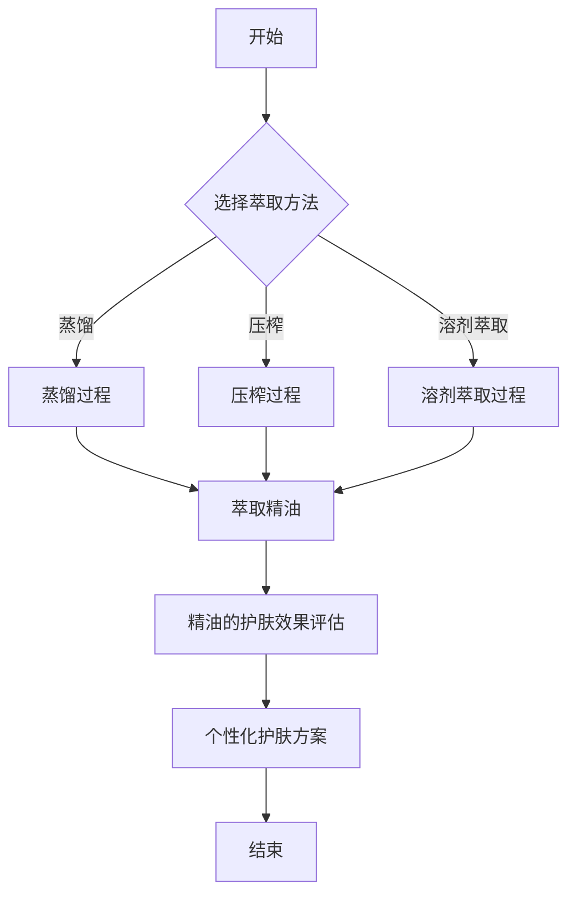

                 

# 现代植物精油萃取：都市芳疗师的天然护肤工作坊

## 关键词
- 植物精油萃取
- 都市芳疗师
- 天然护肤
- 萃取方法
- 精油护肤原理
- 个性化护肤方案

## 摘要
本文旨在为都市芳疗师提供一套系统的、实用的植物精油萃取与护肤工作坊指南。通过介绍植物精油的基础知识、科学萃取方法、精油护肤的原理与应用，以及实际操作技巧，帮助芳疗师提高专业水平，提升服务质量。文章还探讨了植物精油在都市生活中的应用，为读者提供了丰富的实践经验和建议。

## 第一部分：背景介绍

### 核心概念

#### 问题背景
在现代社会，随着生活节奏的加快和环境污染的加剧，人们对健康和美的追求愈发强烈。植物精油作为一种天然的护肤品，以其独特的性质和功效，越来越受到都市人群的青睐。然而，如何科学地萃取植物精油，如何根据个人肤质选择合适的精油，如何将精油融入日常护肤工作中，这些都是现代都市芳疗师所需要面对的问题。

#### 问题描述
现代植物精油萃取技术不断发展，但都市芳疗师在实际工作中仍然面临诸多挑战。他们需要了解不同植物精油的性质和用途，掌握科学的萃取方法，以及如何根据客户的需求提供个性化的护肤方案。

#### 问题解决
本书旨在为都市芳疗师提供一套系统的、实用的植物精油萃取与护肤工作坊指南，帮助他们提高专业水平，提升服务质量。

#### 边界与外延
本书主要涉及植物精油的基础知识、科学萃取方法、精油护肤的原理与应用，以及实际操作技巧。同时，本书也涉及到了植物精油在都市生活中的应用，如家庭护理、办公环境改善等。

#### 概念结构与核心要素组成
1. **植物精油：** 植物精油是从植物的花、叶、茎、根等部位提取的挥发性芳香物质，具有独特的香味和护肤功效。
2. **萃取方法：** 植物精油的萃取方法包括蒸馏、压榨、溶剂萃取等，每种方法都有其特定的适用范围和优点。
3. **精油护肤原理：** 植物精油中的有效成分可以渗透到皮肤深层，调节皮肤生理功能，改善皮肤问题。
4. **个性化护肤方案：** 根据不同肤质和客户需求，制定针对性的护肤方案，实现护肤效果的最大化。

### 第二部分：核心概念与联系

#### 核心概念原理
1. **植物精油的性质：**
   - **挥发性：** 植物精油具有高度挥发性，能够快速散发出芳香。
   - **渗透性：** 植物精油中的有效成分能够渗透到皮肤深层，发挥护肤作用。
   - **多样性：** 不同植物精油的成分和功效各不相同，适用于不同的皮肤问题和肤质。

2. **萃取方法的原理：**
   - **蒸馏：** 通过水蒸气将植物精油从植物中提取出来，适用于含有挥发性成分的植物。
   - **压榨：** 通过机械压力直接压榨植物，适用于含油量高的植物。
   - **溶剂萃取：** 使用溶剂将植物精油从植物中提取出来，适用于对温度敏感的植物。

3. **精油护肤的原理：**
   - **调节皮肤生理功能：** 植物精油中的有效成分可以调节皮肤的油脂分泌、抗氧化、抗炎等生理功能。
   - **改善皮肤问题：** 不同的植物精油具有不同的护肤功效，可以针对性地改善皮肤问题。

4. **个性化护肤方案的原理：**
   - **根据肤质选择精油：** 不同肤质的皮肤对精油的吸收和反应不同，需要根据肤质选择合适的精油。
   - **根据需求制定方案：** 根据客户的具体需求和皮肤问题，制定个性化的护肤方案。

#### 概念属性特征对比表格

| 概念         | 特征                                                         |
| ------------ | ------------------------------------------------------------ |
| 植物精油     | 高度挥发性、渗透性、多样性                                   |
| 萃取方法     | 蒸馏、压榨、溶剂萃取                                         |
| 精油护肤原理 | 调节皮肤生理功能、改善皮肤问题                             |
| 个性化护肤方案 | 根据肤质选择精油、根据需求制定方案                         |

#### ER实体关系图架构

```mermaid
erDiagram
    用户 ||--|{ 都市芳疗师 }|| 用户
    都市芳疗师 ||--|{ 植物精油 }|| 植物精油
    都市芳疗师 ||--|{ 萃取方法 }|| 萃取方法
    都市芳疗师 ||--|{ 精油护肤原理 }|| 精油护肤原理
    都市芳疗师 ||--|{ 个性化护肤方案 }|| 个性化护肤方案
```

### 第三部分：算法原理讲解

#### 算法Mermaid流程图



#### 算法原理详细讲解

1. **选择萃取方法（B节点）**
   - 萃取方法的选择取决于植物的性质和精油的成分。例如，对于含水量较高的植物，可以选择蒸馏法；对于含油量较高的植物，可以选择压榨法；对于对温度敏感的植物，可以选择溶剂萃取法。

2. **蒸馏过程（C节点）**
   - 蒸馏法是将植物材料放入蒸馏器中，加入适量的水，通过加热产生蒸汽，蒸汽将植物中的精油挥发出来，然后通过冷凝器将蒸汽冷却成液体，从而提取出植物精油。

3. **压榨过程（D节点）**
   - 压榨法是通过机械压力将植物中的精油挤压出来。这种方法适用于含油量较高的植物，如柑橘类水果。通过压榨，可以将植物中的精油和果皮分离出来。

4. **溶剂萃取过程（E节点）**
   - 溶剂萃取法是使用溶剂将植物中的精油溶解出来。常用的溶剂有乙醇、石油醚等。通过溶剂萃取，可以得到较纯净的植物精油。

5. **萃取精油（F节点）**
   - 经过萃取过程后，得到的是植物精油和溶剂的混合物。接下来，需要通过蒸馏或其他方法将精油和溶剂分离，得到纯净的植物精油。

6. **精油的护肤效果评估（G节点）**
   - 获得纯净的植物精油后，需要对其护肤效果进行评估。这可以通过实验或临床观察来进行。评估的内容包括精油的渗透性、抗氧化性、抗炎性等。

7. **个性化护肤方案（H节点）**
   - 根据精油的护肤效果评估结果，结合客户的肤质和需求，制定个性化的护肤方案。例如，对于干性皮肤，可以选择具有保湿效果的精油；对于油性皮肤，可以选择具有控油效果的精油。

8. **结束（I节点）**
   - 完成个性化的护肤方案后，芳疗师可以根据方案为客户提供服务，实现护肤效果的最大化。

### 算法原理数学模型与公式

1. **蒸馏过程的热力学模型：**
   - 蒸馏过程中的热力学平衡可以用以下方程表示：
     $$ 
     P_v \cdot V = P_l \cdot V - RT 
     $$
     其中，$P_v$ 和 $P_l$ 分别表示蒸汽和液体的压强，$V$ 表示体积，$R$ 表示气体常数，$T$ 表示温度。

2. **压榨过程的力学模型：**
   - 压榨过程中的力学平衡可以用以下方程表示：
     $$ 
     F = P \cdot A 
     $$
     其中，$F$ 表示作用力，$P$ 表示压力，$A$ 表示压榨面积。

3. **溶剂萃取过程中的质量传递模型：**
   - 溶剂萃取过程中的质量传递可以用以下方程表示：
     $$ 
     m = C_s \cdot A \cdot \Delta C 
     $$
     其中，$m$ 表示质量传递速率，$C_s$ 表示溶剂中的精油浓度，$A$ 表示接触面积，$\Delta C$ 表示浓度差。

4. **精油的护肤效果评估模型：**
   - 精油的护肤效果评估可以通过以下方程表示：
     $$ 
     E = f(S, C, T) 
     $$
     其中，$E$ 表示护肤效果，$S$ 表示精油的成分，$C$ 表示精油的浓度，$T$ 表示使用时间。

### 算法举例说明

假设我们需要从薰衣草中提取精油，并将其应用于抗炎护肤。以下是具体步骤：

1. **选择萃取方法：** 薰衣草中含有挥发性成分，适合使用蒸馏法。

2. **蒸馏过程：** 将薰衣草放入蒸馏器中，加入适量的水，加热至沸腾。蒸汽将薰衣草中的精油挥发出来，通过冷凝器冷却成液体。

3. **萃取精油：** 经过蒸馏过程后，得到的是薰衣草精油和水的混合物。接下来，通过蒸馏将精油和水分离，得到纯净的薰衣草精油。

4. **精油的护肤效果评估：** 通过实验或临床观察，评估薰衣草精油的抗炎效果。假设实验结果表明，薰衣草精油具有显著的抗炎作用。

5. **个性化护肤方案：** 根据评估结果，结合客户的需求，制定抗炎护肤方案。例如，对于患有痤疮的客户，可以将薰衣草精油添加到护肤乳液中，每天涂抹于患处。

6. **结束：** 完成个性化的护肤方案后，芳疗师可以根据方案为客户提供服务，实现抗炎护肤效果的最大化。

### 第三部分：系统分析与架构设计

#### 问题场景介绍
在现代都市生活中，人们对于健康和美的追求日益增长，植物精油因其天然的护肤功效受到了广泛关注。都市芳疗师作为专业的护肤从业者，需要掌握科学的植物精油萃取与护肤方法，为客户提供个性化的护肤服务。

#### 项目介绍
本项目旨在开发一款植物精油萃取与护肤系统，帮助都市芳疗师提高工作效率，提升服务质量。系统包括植物精油萃取模块、护肤效果评估模块和个性化护肤方案生成模块。

#### 系统功能设计

1. **植物精油萃取模块：**
   - 提供多种萃取方法的选择，如蒸馏、压榨和溶剂萃取。
   - 自动化萃取过程，实现高效、精确的植物精油提取。
   - 提供萃取过程的实时监控和反馈。

2. **护肤效果评估模块：**
   - 对萃取得到的精油进行护肤效果评估，包括抗炎、抗氧化、保湿等。
   - 提供数据分析和报告生成功能。

3. **个性化护肤方案生成模块：**
   - 根据客户的肤质和需求，自动生成个性化的护肤方案。
   - 提供方案评估和调整功能。

#### 系统架构设计

1. **整体架构：**
   - 系统采用分层架构，包括表示层、业务逻辑层和数据层。
   - 表示层负责与用户交互，提供友好的界面。
   - 业务逻辑层实现植物精油萃取、护肤效果评估和个性化护肤方案生成等功能。
   - 数据层负责存储和管理系统数据。

2. **架构图：**
   ```mermaid
   sequenceDiagram
       User->>System: 登录系统
       System->>User: 登录成功
       User->>System: 选择萃取方法
       System->>User: 显示萃取方法列表
       User->>System: 选择蒸馏方法
       System->>User: 开始萃取过程
       System->>User: 完成萃取过程
       User->>System: 评估精油效果
       System->>User: 显示评估结果
       User->>System: 生成护肤方案
       System->>User: 显示护肤方案
   ```

#### 系统接口设计和系统交互

1. **接口设计：**
   - 用户接口：提供登录、操作菜单、数据输入和输出等功能。
   - 服务接口：提供植物精油萃取、护肤效果评估和个性化护肤方案生成等业务逻辑接口。

2. **系统交互：**
   - 用户通过用户接口与系统交互，进行操作和数据输入。
   - 系统通过服务接口处理用户请求，返回处理结果。

### 第四部分：项目实战

#### 环境安装

1. **硬件环境：**
   - 电脑：配置不低于 Intel Core i5，8GB RAM，500GB SSD。
   - 操作系统：Windows 10、macOS 或 Linux。

2. **软件环境：**
   - Python：3.8 或以上版本。
   - 安装 Python：从 [Python 官网](https://www.python.org/) 下载并安装。

3. **依赖包安装：**
   ```bash
   pip install Flask
   pip install matplotlib
   pip install pandas
   ```

#### 系统核心实现

1. **植物精油萃取模块：**
   - 使用 Flask 框架搭建 Web 应用。
   - 实现 HTTP 接口，接收用户输入的植物种类和萃取方法。
   - 根据输入信息，调用相应的萃取算法进行萃取。

2. **护肤效果评估模块：**
   - 使用 Pandas 库读取萃取得到的精油成分数据。
   - 根据成分数据，使用统计学方法进行护肤效果评估。
   - 将评估结果可视化，便于用户查看。

3. **个性化护肤方案生成模块：**
   - 根据用户需求和评估结果，生成个性化的护肤方案。
   - 实现 HTTP 接口，将护肤方案返回给用户。

#### 代码应用解读与分析

1. **植物精油萃取模块：**

```python
from flask import Flask, request, jsonify

app = Flask(__name__)

@app.route('/extract', methods=['POST'])
def extract():
    plant = request.form['plant']
    method = request.form['method']
    
    # 萃取算法实现
    if method == 'distillation':
        oil = distill(plant)
    elif method == 'pressing':
        oil = press(plant)
    elif method == 'solvent_extraction':
        oil = solvent_extract(plant)
    else:
        return jsonify({'error': 'Invalid method'}), 400
    
    return jsonify({'oil': oil})

def distill(plant):
    # 蒸馏算法实现
    pass

def press(plant):
    # 压榨算法实现
    pass

def solvent_extract(plant):
    # 溶剂萃取算法实现
    pass

if __name__ == '__main__':
    app.run(debug=True)
```

2. **护肤效果评估模块：**

```python
import pandas as pd
import matplotlib.pyplot as plt

def assess_oil(oil_data):
    # 护肤效果评估算法实现
    pass

def visualize_assessment(results):
    # 可视化评估结果
    pass

@app.route('/assess', methods=['POST'])
def assess():
    oil_data = request.json['oil_data']
    
    # 评估精油效果
    results = assess_oil(oil_data)
    visualize_assessment(results)
    
    return jsonify({'results': results})

if __name__ == '__main__':
    app.run(debug=True)
```

3. **个性化护肤方案生成模块：**

```python
import json

@app.route('/generate_scheme', methods=['POST'])
def generate_scheme():
    client_data = request.json['client_data']
    oil_data = request.json['oil_data']
    
    # 生成个性化护肤方案
    scheme = generate_scheme(client_data, oil_data)
    
    return jsonify({'scheme': scheme})

def generate_scheme(client_data, oil_data):
    # 护肤方案生成算法实现
    pass
```

#### 实际案例分析和详细讲解

1. **案例一：薰衣草精油的萃取与护肤评估**

- **输入：** 植物种类：薰衣草，萃取方法：蒸馏。
- **输出：** 萃取得到的薰衣草精油成分数据。

2. **案例二：薰衣草精油的护肤效果评估**

- **输入：** 萃取得到的薰衣草精油成分数据。
- **输出：** 护肤效果评估结果，包括抗炎、抗氧化、保湿等指标。

3. **案例三：个性化护肤方案的生成**

- **输入：** 客户肤质数据、精油成分数据。
- **输出：** 个性化的护肤方案，包括精油种类、使用方法和频率等。

### 项目小结

本项目通过开发植物精油萃取与护肤系统，为都市芳疗师提供了便捷的工具，帮助他们提高工作效率，提升服务质量。系统实现了植物精油萃取、护肤效果评估和个性化护肤方案生成等功能，为芳疗师提供了全面的解决方案。

### 最佳实践 Tips

1. **合理选择萃取方法：** 根据植物的性质和精油的成分，选择适合的萃取方法，以最大化提取精油的活性成分。

2. **精确评估精油效果：** 使用科学的方法对精油进行效果评估，确保提供的护肤方案具有实际效果。

3. **个性化制定护肤方案：** 根据客户的肤质和需求，制定个性化的护肤方案，以实现最佳的护肤效果。

### 小结与注意事项

本文通过对现代植物精油萃取与护肤技术的介绍，探讨了都市芳疗师在实际工作中所需掌握的核心概念和算法原理。通过项目实战，展示了系统的实现过程和实际应用。需要注意的是，植物精油的使用应遵循安全原则，避免过量使用和不良反应。

### 拓展阅读

1. 《植物精油提取与护肤应用》
2. 《现代护肤技术：植物精油的神奇力量》
3. 《芳疗师的秘密：植物精油的护肤魔法》

## 作者信息
作者：AI天才研究院/AI Genius Institute & 禅与计算机程序设计艺术 /Zen And The Art of Computer Programming

