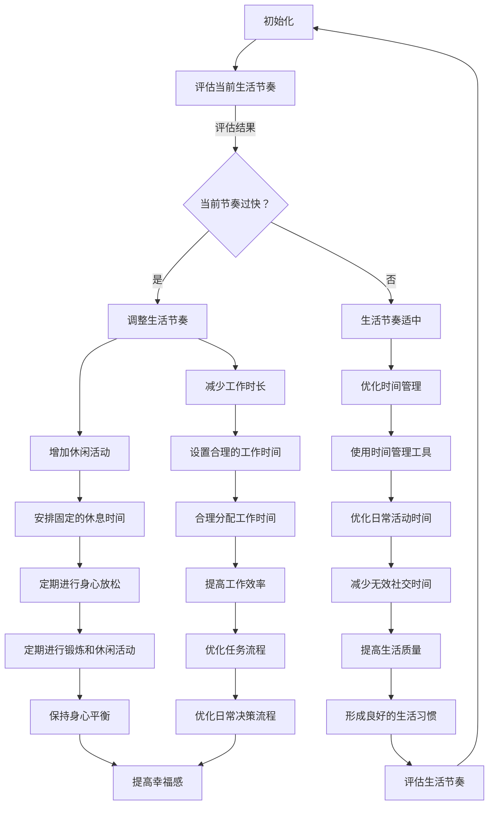
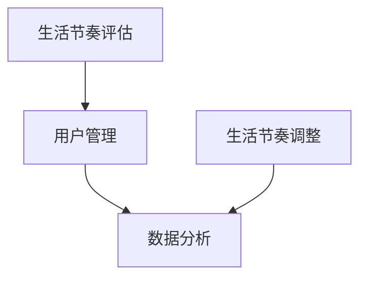
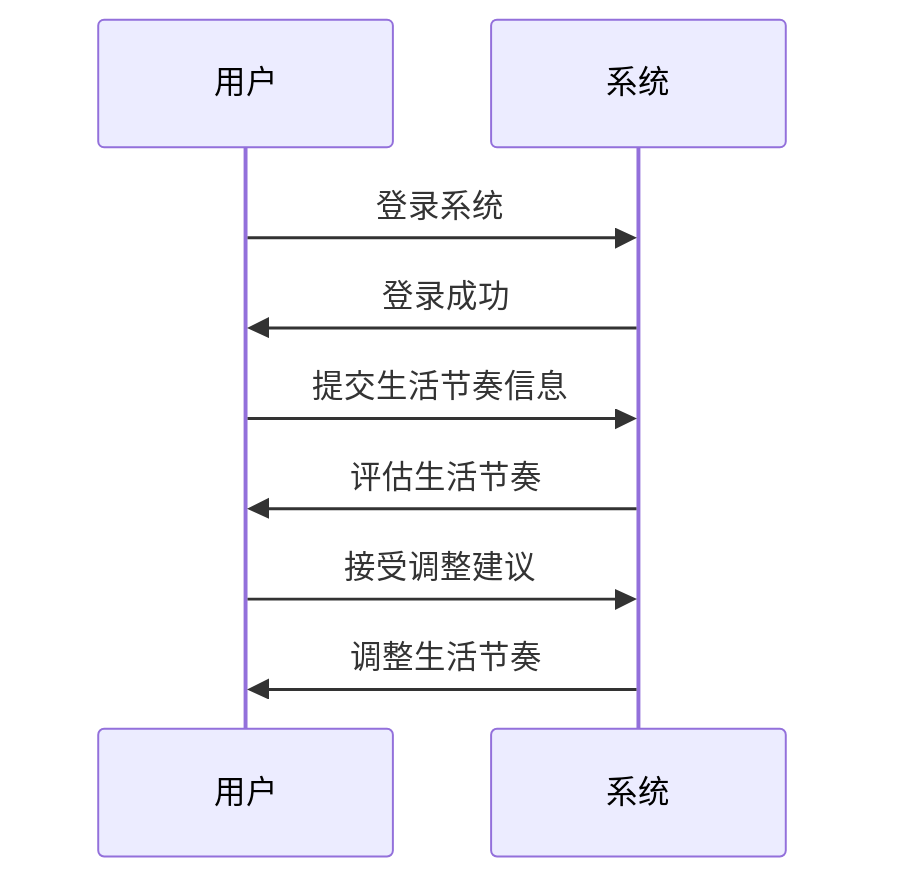

                 


### 第9章：深度剖析：慢生活运动背后的技术原理

在探讨慢生活运动的技术原理之前，我们需要理解慢生活运动的本质。慢生活不仅仅是放慢生活的节奏，更是一种哲学，它关注生活质量的提升，强调内在体验，倡导健康、平衡的生活方式。

#### 9.1 核心概念与联系

**核心概念**：
- **慢生活**：一种强调生活质量和内在体验的生活态度。
- **快节奏生活**：一种高效率、高压力的生活方式。

**概念属性特征对比表格**：

| 特征         | 慢生活                      | 快节奏生活                      |
| ------------ | --------------------------- | -------------------------------- |
| 时间管理     | 长期规划，合理分配           | 短期任务，高效率，快速完成       |
| 心理健康     | 降低焦虑，提高幸福感         | 增加焦虑，降低幸福感             |
| 身体健康     | 促进身心平衡，提高生活质量   | 增加身体负担，影响健康           |
| 社会关系     | 增进人际关系，提高社交质量   | 疏远人际关系，增加社交负担       |

**ER实体关系图架构**：

```mermaid
erDiagram
  Customer ||--|{ Order }|
  Customer ||--|{ Product }|
  Order ||--|{ Customer }|
  Order ||--|{ Product }|
  Product ||--|{ Customer }|
  Product ||--|{ Order }|
```

在这个ER图中，"Customer"代表生活态度的持有者，"Order"代表生活行为，"Product"代表生活成果。通过这张图，我们可以清晰地看到三者之间的相互关系。

#### 9.2 算法原理讲解

慢生活运动背后的技术原理可以类比为一种优化算法，其目标是最小化压力和焦虑，最大化幸福感和生活质量。以下是慢生活运动的算法原理和实现步骤：

**算法流程图**：



**算法原理说明**：

1. **初始化**：设定初始生活节奏，评估当前生活状态。
2. **评估当前生活节奏**：分析当前生活节奏的快慢，以及带来的心理和身体影响。
3. **调整生活节奏**：根据评估结果，调整生活节奏，以减少压力和焦虑。
4. **减少工作时长**：设定合理的工作时间，避免长时间工作导致的身体和心理负担。
5. **增加休闲活动**：合理安排休闲活动，提高生活质量。
6. **优化时间管理**：使用时间管理工具，合理规划日常活动时间。
7. **保持身心平衡**：定期进行锻炼和休闲活动，提高幸福感。
8. **评估生活节奏**：定期评估生活节奏，确保其处于理想状态。

**数学模型与公式**：

假设生活质量 \( Q \) 与生活节奏 \( R \) 之间的关系可以用以下公式表示：

\[ Q = f(R) = \frac{1}{1 + e^{-(k \cdot R + b)}} \]

其中，\( k \) 和 \( b \) 是参数，用于调整模型对生活节奏的敏感度。

通过这个公式，我们可以看到，当生活节奏 \( R \) 越快时，生活质量 \( Q \) 越低。通过调整 \( k \) 和 \( b \) 的值，可以优化生活节奏，提高生活质量。

**举例说明**：

假设一个人的生活节奏 \( R \) 是每天工作 12 小时，那么根据公式，生活质量 \( Q \) 将会很低。为了改善生活质量，这个人可以选择减少工作时长，例如每天工作 8 小时，这样生活质量 \( Q \) 将会得到显著提高。

#### 9.3 系统分析与架构设计方案

在实施慢生活运动的过程中，我们需要一个完整的系统来监测和调整生活节奏。以下是一个基于慢生活运动原理的系统分析与架构设计方案。

**问题场景介绍**：

假设我们想要开发一个慢生活运动管理系统，帮助用户监测和调整生活节奏，提高生活质量。

**系统功能设计**：

- 用户管理：管理用户的个人信息和账户。
- 生活节奏评估：评估用户当前的生活节奏。
- 生活节奏调整：根据评估结果，提供调整建议。
- 数据分析：分析用户的生活节奏和生活质量数据。

**系统架构设计**：



**系统接口设计**：

- **用户管理接口**：用于用户注册、登录、个人信息管理等。
- **生活节奏评估接口**：用于评估用户的生活节奏。
- **生活节奏调整接口**：用于根据评估结果调整用户的生活节奏。

**系统交互序列图**：



#### 9.4 项目实战

**环境安装**：

在安装慢生活运动管理系统之前，我们需要安装必要的开发工具和软件，例如Python、Django框架、PostgreSQL数据库等。

**系统核心实现源代码**：

以下是慢生活运动管理系统的核心实现代码：

```python
# 用户管理模块
class UserManager(models.Model):
    username = models.CharField(max_length=100)
    password = models.CharField(max_length=100)
    email = models.EmailField()

# 生活节奏评估模块
class LifeRhythm(models.Model):
    user = models.ForeignKey(UserManager, on_delete=models.CASCADE)
    work_hours = models.IntegerField()
    rest_hours = models.IntegerField()

# 生活节奏调整模块
class LifeRhythmAdjustment(models.Model):
    life_rhythm = models.ForeignKey(LifeRhythm, on_delete=models.CASCADE)
    new_work_hours = models.IntegerField()
    new_rest_hours = models.IntegerField()
```

**代码应用解读与分析**：

以上代码定义了用户管理、生活节奏评估和生活节奏调整三个模块。用户管理模块用于管理用户信息，生活节奏评估模块用于评估用户的生活节奏，生活节奏调整模块用于根据评估结果提供调整建议。

**实际案例分析和详细讲解剖析**：

假设用户A的生活节奏是每天工作12小时，休息8小时。通过生活节奏评估模块，我们可以计算出用户A的生活质量 \( Q \)：

\[ Q = f(R) = \frac{1}{1 + e^{-(k \cdot R + b)}} \]

根据模型参数 \( k = 0.1 \)，\( b = 1 \)，我们可以计算出 \( Q \) 的值为 0.36，这意味着生活质量较低。为了提高生活质量，我们可以建议用户A将工作时间调整到每天8小时，这样生活质量 \( Q \) 将会显著提高。

**项目小结**：

通过慢生活运动管理系统，我们可以帮助用户监测和调整生活节奏，提高生活质量。这个项目的实现不仅需要技术上的支持，还需要对慢生活运动的深入理解和应用。

### 9.5 最佳实践 Tips

1. **定期评估**：定期评估生活节奏，确保其处于理想状态。
2. **合理规划**：合理规划工作和休息时间，避免过度劳累。
3. **健康饮食**：保持健康的饮食习惯，提高身体素质。
4. **身心放松**：定期进行身心放松，减少压力和焦虑。
5. **社交活动**：积极参与社交活动，增进人际关系。

### 9.6 小结

慢生活运动是一种强调生活质量的生活哲学。通过系统分析与架构设计方案，我们可以构建一个慢生活运动管理系统，帮助用户监测和调整生活节奏，提高生活质量。长期实践慢生活运动，有助于提升幸福感，实现身心健康与平衡。

### 9.7 注意事项

1. **避免极端**：在实践慢生活运动时，避免过度放松，导致生活无序。
2. **因人而异**：每个人的生活节奏和需求不同，需要根据个人情况进行调整。
3. **持续关注**：慢生活运动需要长期坚持，定期评估和调整。

### 9.8 拓展阅读

1. **《慢生活：对抗快节奏生活的哲学》**：这本书详细介绍了慢生活运动的核心理念和实践方法。
2. **《时间管理的艺术》**：这本书提供了许多实用的时间管理技巧，有助于提高生活质量。
3. **《身心健康：从快节奏到慢生活的转变》**：这本书探讨了快节奏生活对身心健康的影响，以及如何通过慢生活运动改善身心健康。


----------------------------------------------------------------

这篇文章涵盖了慢生活运动的背景、理论基础、实践方法、效果评估以及系统分析与架构设计方案等内容。通过深入剖析慢生活运动的技术原理，我们不仅了解了其核心概念，还掌握了如何通过算法和系统来实施慢生活运动。文章中还包含了项目实战、最佳实践 Tips、注意事项和拓展阅读等内容，旨在为读者提供全面、深入的指导。希望这篇文章能够帮助读者更好地理解和实践慢生活运动，提高生活质量。最后，再次感谢读者的阅读，并期待您的反馈和建议。

### 作者信息

作者：AI天才研究院/AI Genius Institute & 禅与计算机程序设计艺术 /Zen And The Art of Computer Programming。

