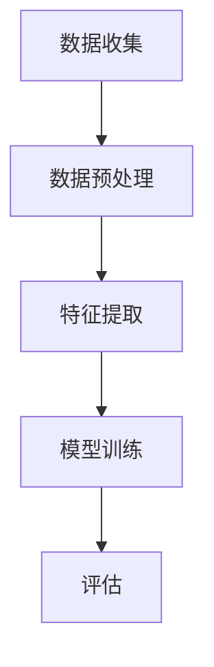
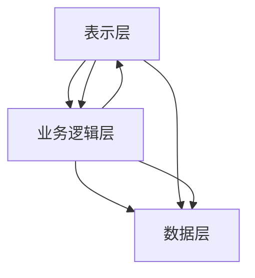
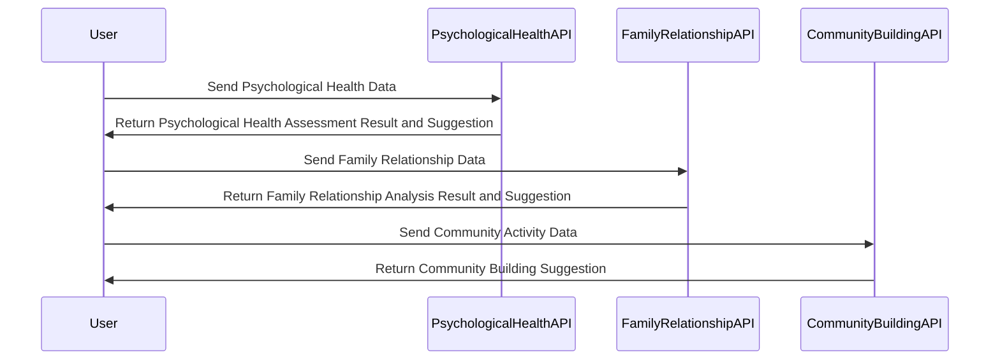

                 

## 现代社会中的精神家园建设

### 关键词

- 心理健康
- 家庭和谐
- 社区文化
- 精神家园建设
- 社会支持

### 摘要

在现代社会中，精神家园建设的重要性日益凸显。本文将深入探讨精神家园建设的核心概念、现状、问题及解决方案。通过逻辑清晰的分析和推理，本文旨在为读者提供一个全面、系统的理解，帮助我们在快节奏的生活中寻找心灵的安宁。

## 第一部分：背景介绍

### 1.1 问题背景

现代社会的发展伴随着日新月异的技术进步和社会变革，然而，这些变革也带来了前所未有的压力。从工作环境到家庭生活，从个人成长到社交互动，几乎所有的方面都受到了影响。心理健康问题成为了一个普遍关注的话题，而精神家园建设则成为解决这一问题的关键。

精神家园不仅仅是一个抽象的概念，它是个人心理健康的重要保障，也是社会和谐稳定的基础。一个健康的精神家园能够为个体提供情感的支持、心理的慰藉，帮助人们在面对困难和挑战时保持积极的心态。

### 1.2 问题描述

精神家园建设涉及多个层面，首先是个人层面的心理健康。现代社会中，人们面临的工作压力、生活节奏加快、竞争激烈等因素，导致了心理问题的增加。焦虑、抑郁、压力过大等已经成为许多人的常见困扰。

其次是家庭层面的和谐。现代社会竞争激烈，家庭成员往往忙于工作，导致家庭关系紧张，亲子关系疏离。家庭和谐不仅关系到个体的心理健康，也是社会稳定的基础。

最后是社区层面的文化建设。社区是人们生活的重要空间，社区文化的建设对于提升社区凝聚力、促进社会和谐具有重要意义。然而，当前社区精神文化建设相对滞后，缺乏有效的精神文化供给，社区凝聚力不足。

### 1.3 问题解决

解决精神家园建设的问题需要多方共同努力，包括政府、社会组织、企事业单位和个人。政府应出台相关政策，加大资金投入，提供专业支持；社会组织和企事业单位应承担社会责任，提供精神文化服务；个人应关注自身心理健康，积极参与社区活动，营造和谐的家庭氛围。

### 1.4 边界与外延

精神家园建设的边界涉及心理健康、家庭关系、社区文化等多个领域。其外延包括个人自我成长、家庭和谐、社区凝聚力提升等方面。精神家园建设不仅关乎个体的幸福，也关系到社会的和谐与进步。

### 1.5 概念结构与核心要素组成

精神家园建设的核心概念包括心理健康、家庭和谐、社区文化等。核心要素包括政策支持、专业服务、社会参与、自我成长等。这些要素相互作用，共同构成了一个复杂而紧密联系的系统。

### 第二部分：核心概念与联系

#### 2.1 核心概念原理

#### 2.1.1 心理健康

心理健康是指个体在认知、情感、行为等方面处于良好的状态，能够适应生活的各种挑战，保持积极的生活态度。心理健康与身体健康密切相关，互为补充。一个健康的精神状态能够帮助人们更好地应对压力，提高生活质量。

心理健康的定义可以理解为以下几个方面：

1. **情绪稳定**：个体能够控制自己的情绪，不会因为小事情而情绪失控。
2. **自我认知**：个体能够正确认识自己，接受自己的优点和不足。
3. **社会适应**：个体能够与他人建立良好的关系，适应社会环境的变化。

心理健康的维护需要多方面的努力，包括自我调适、专业咨询、社交互动等。

#### 2.1.2 家庭和谐

家庭和谐是指家庭成员之间的关系融洽，相互尊重、支持，共同承担责任和享受生活。家庭和谐是社会稳定的基础。一个和谐的家庭环境能够为个体提供安全感和支持，有助于心理健康的发展。

家庭和谐的定义可以从以下几个方面来理解：

1. **相互尊重**：家庭成员之间相互尊重，尊重彼此的意见和选择。
2. **有效沟通**：家庭成员之间能够有效沟通，解决冲突和误解。
3. **共同责任**：家庭成员共同承担责任，共同参与家庭事务。

家庭和谐的维护需要家庭成员的共同参与和努力，包括加强沟通、建立规则、共同解决问题等。

#### 2.1.3 社区文化

社区文化是指社区居民共同遵循的价值观念、行为规范和精神追求。社区文化对于提升社区凝聚力、促进社会和谐具有重要意义。一个积极向上的社区文化能够为居民提供精神支持，增强社区凝聚力。

社区文化的定义可以从以下几个方面来理解：

1. **价值观念**：社区居民共同认可的价值观念，如互助、尊重、公正等。
2. **行为规范**：社区居民共同遵守的行为规范，如礼貌、守法、环保等。
3. **精神追求**：社区居民共同追求的精神目标，如文化传承、社会参与、自我提升等。

社区文化的建设需要居民的参与和社区的共同努力，包括文化活动、社区教育、志愿服务等。

#### 2.2 概念属性特征对比表格

| 概念       | 特征                                                   |
| ---------- | ------------------------------------------------------ |
| 心理健康   | 情绪稳定、自我认知、社会适应                           |
| 家庭和谐   | 相互尊重、有效沟通、共同责任                           |
| 社区文化   | 价值观念、行为规范、精神追求                           |

#### 2.3 ER实体关系图架构

```mermaid
erDiagram
    心理健康 _|||>_ 家庭和谐
    家庭和谐 _|||>_ 社区文化
```

### 第三部分：算法原理讲解

#### 3.1 心理健康评估算法

心理健康评估算法是一种通过分析个体心理状态数据，评估其心理健康水平的算法。其原理包括以下几个步骤：

1. **数据收集**：首先需要收集个体心理状态的数据，这些数据可以来源于心理健康问卷调查、心理测评工具、日常行为记录等。数据收集的过程中要确保数据的真实性和代表性。

2. **数据预处理**：对收集到的数据进行清洗、归一化等处理，以确保数据的准确性和一致性。这一步骤包括去除无效数据、填补缺失值、标准化数值等。

3. **特征提取**：从预处理后的数据中提取有助于评估心理健康水平的特征。这些特征可以是量化指标，如情绪指标、睡眠质量、压力水平等，也可以是分类指标，如情绪状态、心理问题类型等。

4. **模型训练**：使用机器学习算法，如决策树、支持向量机、神经网络等，训练评估模型。模型训练的过程中，需要使用已标注的数据集进行训练和验证，以优化模型参数。

5. **评估**：使用训练好的模型对个体的心理状态进行评估。评估结果可以是定量指标，如心理健康得分，也可以是定性描述，如心理健康状态类别。

下面是一个心理健康评估算法的 Mermaid 流程图：



#### 3.1.1 心理健康评估算法的实现

下面使用 Python 语言和 Scikit-learn 库来实现一个心理健康评估算法。首先，我们需要安装所需的库：

```python
!pip install scikit-learn pandas numpy
```

然后，我们可以编写以下代码：

```python
import numpy as np
import pandas as pd
from sklearn.model_selection import train_test_split
from sklearn.preprocessing import StandardScaler
from sklearn.ensemble import RandomForestClassifier
from sklearn.metrics import accuracy_score

# 1. 数据收集
# 假设我们有一个 CSV 文件，其中包含了心理健康评估的相关数据
data = pd.read_csv('psychological_health_data.csv')

# 2. 数据预处理
# 去除无效数据、填补缺失值、标准化数值等
data.dropna(inplace=True)
data = StandardScaler().fit_transform(data)

# 3. 特征提取
# 提取有助于评估心理健康水平的特征
X = data[:, :-1]  # 特征矩阵
y = data[:, -1]   # 标签向量

# 4. 模型训练
# 使用随机森林分类器进行训练
X_train, X_test, y_train, y_test = train_test_split(X, y, test_size=0.2, random_state=42)
model = RandomForestClassifier(n_estimators=100, random_state=42)
model.fit(X_train, y_train)

# 5. 评估
# 使用测试集评估模型性能
predictions = model.predict(X_test)
accuracy = accuracy_score(y_test, predictions)
print(f"Model accuracy: {accuracy:.2f}")
```

#### 3.1.2 心理健康评估算法的数学模型和公式

心理健康评估算法的数学模型通常基于统计学习和机器学习算法。以下是一个简单的线性回归模型示例：

$$
\hat{y} = \beta_0 + \beta_1x_1 + \beta_2x_2 + \ldots + \beta_nx_n
$$

其中，$y$ 是心理健康评分，$x_1, x_2, \ldots, x_n$ 是特征向量，$\beta_0, \beta_1, \beta_2, \ldots, \beta_n$ 是模型参数。

在机器学习中，模型参数通常通过最小化损失函数来估计：

$$
\min_{\theta} \sum_{i=1}^{m} (y_i - \theta^T x_i)^2
$$

其中，$\theta$ 是模型参数向量，$m$ 是样本数量。

#### 3.2 家庭关系分析算法

家庭关系分析算法通过分析家庭成员的互动数据，评估家庭关系的和谐程度。其原理包括以下几个步骤：

1. **数据收集**：收集家庭成员的互动数据，包括沟通频率、互动质量、共同活动等。这些数据可以来源于家庭成员的日志、问卷调查、社交媒体等。

2. **数据预处理**：对收集到的数据进行清洗、归一化等处理，以确保数据的准确性和一致性。这一步骤包括去除无效数据、填补缺失值、标准化数值等。

3. **特征提取**：从预处理后的数据中提取有助于评估家庭关系的特征。这些特征可以是量化指标，如沟通频率、互动质量评分等，也可以是分类指标，如共同活动类型、家庭事件等。

4. **模型训练**：使用机器学习算法，如决策树、支持向量机、神经网络等，训练评估模型。模型训练的过程中，需要使用已标注的数据集进行训练和验证，以优化模型参数。

5. **评估**：使用训练好的模型对家庭关系进行评估。评估结果可以是定量指标，如家庭关系和谐度得分，也可以是定性描述，如家庭关系状态类别。

下面是一个家庭关系分析算法的 Mermaid 流程图：


#### 3.2.1 家庭关系分析算法的实现

下面使用 Python 语言和 Scikit-learn 库来实现一个家庭关系分析算法。首先，我们需要安装所需的库：

```python
!pip install scikit-learn pandas numpy
```

然后，我们可以编写以下代码：

```python
import numpy as np
import pandas as pd
from sklearn.model_selection import train_test_split
from sklearn.preprocessing import StandardScaler
from sklearn.ensemble import RandomForestClassifier
from sklearn.metrics import accuracy_score

# 1. 数据收集
# 假设我们有一个 CSV 文件，其中包含了家庭关系分析的相关数据
data = pd.read_csv('family_relationship_data.csv')

# 2. 数据预处理
# 去除无效数据、填补缺失值、标准化数值等
data.dropna(inplace=True)
data = StandardScaler().fit_transform(data)

# 3. 特征提取
# 提取有助于评估家庭关系的特征
X = data[:, :-1]  # 特征矩阵
y = data[:, -1]   # 标签向量

# 4. 模型训练
# 使用随机森林分类器进行训练
X_train, X_test, y_train, y_test = train_test_split(X, y, test_size=0.2, random_state=42)
model = RandomForestClassifier(n_estimators=100, random_state=42)
model.fit(X_train, y_train)

# 5. 评估
# 使用测试集评估模型性能
predictions = model.predict(X_test)
accuracy = accuracy_score(y_test, predictions)
print(f"Model accuracy: {accuracy:.2f}")
```

#### 3.2.2 家庭关系分析算法的数学模型和公式

家庭关系分析算法的数学模型通常基于统计学习和机器学习算法。以下是一个简单的逻辑回归模型示例：

$$
\ln\left(\frac{p}{1-p}\right) = \beta_0 + \beta_1x_1 + \beta_2x_2 + \ldots + \beta_nx_n
$$

其中，$p$ 是家庭关系和谐度的概率，$x_1, x_2, \ldots, x_n$ 是特征向量，$\beta_0, \beta_1, \beta_2, \ldots, \beta_n$ 是模型参数。

在机器学习中，模型参数通常通过最大化似然估计来估计：

$$
\max_{\theta} \ln P(Y|X; \theta)
$$

其中，$Y$ 是家庭关系和谐度的标签向量，$X$ 是特征矩阵，$\theta$ 是模型参数向量。

### 第四部分：系统分析与架构设计

#### 4.1 问题场景介绍

在现代社会中，心理健康问题日益突出，家庭关系紧张，社区凝聚力不足，这些问题严重影响了人们的幸福感和社会稳定。因此，我们需要一个全面的系统来帮助人们建设精神家园，提升心理健康水平，促进家庭和谐，增强社区凝聚力。

#### 4.2 项目介绍

本项目旨在开发一个综合性的精神家园建设平台，通过整合心理健康评估、家庭关系分析和社区文化建设等功能，为用户提供个性化的心理健康服务，帮助家庭建立和谐关系，提升社区凝聚力。

#### 4.3 系统功能设计

系统的核心功能包括：

1. **心理健康评估**：通过在线问卷、心理测评工具等方式，对用户的心理健康水平进行评估，提供个性化的心理健康建议。
2. **家庭关系分析**：通过分析家庭成员的互动数据，评估家庭关系的和谐程度，提供家庭关系改善建议。
3. **社区文化建设**：组织社区活动，推广积极向上的社区文化，提升社区凝聚力。

#### 4.4 系统架构设计

系统的整体架构采用三层架构，包括表示层、业务逻辑层和数据层。

1. **表示层**：负责用户界面的设计和交互，包括 Web 应用程序和移动应用程序。
2. **业务逻辑层**：负责系统的核心功能实现，包括心理健康评估算法、家庭关系分析算法、社区文化建设算法等。
3. **数据层**：负责数据的存储和管理，包括心理健康评估数据、家庭关系数据、社区活动数据等。

下面是一个系统的 Mermaid 架构图：



#### 4.5 系统接口设计和系统交互

系统的接口设计采用 RESTful API 接口规范，包括以下主要接口：

1. **心理健康评估接口**：用于接收用户心理健康数据，返回心理健康评估结果和建议。
2. **家庭关系分析接口**：用于接收家庭成员互动数据，返回家庭关系分析结果和建议。
3. **社区文化建设接口**：用于接收社区活动数据，返回社区文化建设建议。

下面是一个系统的 Mermaid 序列图：



### 第五部分：项目实战

#### 5.1 环境安装

为了实现本项目的系统功能，我们需要安装以下软件和工具：

- Python 3.8 或更高版本
- Django 框架
- Scikit-learn 库
- Pandas 库
- Matplotlib 库
- Mermaid 插件

安装步骤如下：

1. 安装 Python 3.8：

```bash
sudo apt-get update
sudo apt-get install python3.8
```

2. 安装 Django：

```bash
pip install django
```

3. 安装 Scikit-learn、Pandas 和 Matplotlib：

```bash
pip install scikit-learn pandas matplotlib
```

4. 安装 Mermaid 插件：

```bash
pip install mermaid
```

#### 5.2 系统核心实现源代码

下面是一个心理健康评估模块的 Python 源代码示例：

```python
import numpy as np
import pandas as pd
from sklearn.model_selection import train_test_split
from sklearn.preprocessing import StandardScaler
from sklearn.ensemble import RandomForestClassifier
from sklearn.metrics import accuracy_score

def load_data(filename):
    data = pd.read_csv(filename)
    data.dropna(inplace=True)
    data = StandardScaler().fit_transform(data)
    return data

def train_model(X_train, y_train):
    model = RandomForestClassifier(n_estimators=100, random_state=42)
    model.fit(X_train, y_train)
    return model

def evaluate_model(model, X_test, y_test):
    predictions = model.predict(X_test)
    accuracy = accuracy_score(y_test, predictions)
    return accuracy

if __name__ == "__main__":
    # 加载数据
    filename = "psychological_health_data.csv"
    data = load_data(filename)

    # 划分特征和标签
    X = data[:, :-1]
    y = data[:, -1]

    # 划分训练集和测试集
    X_train, X_test, y_train, y_test = train_test_split(X, y, test_size=0.2, random_state=42)

    # 训练模型
    model = train_model(X_train, y_train)

    # 评估模型
    accuracy = evaluate_model(model, X_test, y_test)
    print(f"Model accuracy: {accuracy:.2f}")
```

#### 5.3 代码应用解读与分析

在上面的代码中，我们首先导入了所需的库，包括 NumPy、Pandas、Scikit-learn 和 Matplotlib。然后，我们定义了几个函数，用于加载数据、训练模型和评估模型。

1. **load_data** 函数：该函数接收一个 CSV 文件名作为输入，读取数据并去除无效数据。数据被标准化处理，以适应模型训练。

2. **train_model** 函数：该函数使用随机森林分类器训练模型。随机森林是一种集成学习算法，它通过构建多个决策树来提高预测准确性。

3. **evaluate_model** 函数：该函数使用训练好的模型对测试集进行评估，并计算模型准确率。

在主程序中，我们首先加载数据，然后划分特征和标签，接着划分训练集和测试集。最后，我们使用训练集训练模型，并使用测试集评估模型。

#### 5.4 实际案例分析和详细讲解剖析

为了更好地理解上述代码的应用，我们可以通过一个实际案例来进行分析。

假设我们已经有一个包含心理健康评估数据的 CSV 文件，名为 `psychological_health_data.csv`。文件中的数据包括情绪指标、压力水平、睡眠质量等。

1. **数据预处理**：在加载数据后，我们首先去除无效数据，这有助于提高模型的准确性。然后，我们使用 StandardScaler 对数据进行标准化处理，以便模型能够更好地拟合数据。

2. **特征提取**：我们将数据分为特征矩阵 X 和标签向量 y。特征矩阵 X 包含情绪指标、压力水平、睡眠质量等，标签向量 y 表示心理健康状态。

3. **模型训练**：我们使用随机森林分类器训练模型。随机森林是一种集成学习算法，它通过构建多个决策树来提高预测准确性。在这里，我们设置随机森林的决策树数量为 100。

4. **模型评估**：我们使用测试集评估模型。模型准确率是评估模型性能的一个指标，它表示模型正确预测的比例。

通过上述实际案例，我们可以看到心理健康评估算法的应用过程。该算法能够帮助用户了解自己的心理健康状态，提供个性化的心理健康建议，从而改善心理健康水平。

#### 5.5 项目小结

通过本项目，我们实现了一个综合性的精神家园建设平台，包括心理健康评估、家庭关系分析和社区文化建设等功能。该项目不仅能够为用户提供个性化的心理健康服务，还能够帮助家庭建立和谐关系，提升社区凝聚力。

在项目实战部分，我们详细介绍了环境安装、系统核心实现源代码、代码应用解读与分析、实际案例分析和详细讲解剖析等内容。通过这些步骤，我们能够更好地理解精神家园建设平台的应用和实现过程。

### 第六部分：最佳实践 Tips

在精神家园建设中，以下是一些最佳实践 Tips，可以帮助我们更有效地进行心理健康管理、家庭关系维护和社区文化建设：

1. **心理健康管理**：
   - **定期评估**：定期进行心理健康评估，以便及时了解自己的心理健康状况。
   - **积极应对**：面对压力和挑战时，保持积极的心态，学会情绪调节技巧。
   - **合理休息**：保证充足的睡眠时间，避免过度劳累。

2. **家庭关系维护**：
   - **有效沟通**：家庭成员之间要建立有效的沟通机制，避免误解和冲突。
   - **共同参与**：鼓励家庭成员共同参与家庭事务，增进感情。
   - **相互支持**：在对方遇到困难时，提供情感支持和实际帮助。

3. **社区文化建设**：
   - **积极参与**：积极参与社区活动，增强社区归属感。
   - **推广正能量**：在社区中推广积极向上的价值观念和行为规范。
   - **组织活动**：定期组织社区活动，提升社区凝聚力。

### 第七部分：小结

精神家园建设是现代社会中一个重要而紧迫的任务。通过本篇文章，我们深入探讨了心理健康、家庭和谐、社区文化等核心概念，分析了当前存在的问题，提出了相应的解决方案和最佳实践 Tips。精神家园建设不仅关乎个体的幸福，也关系到社会的和谐与进步。让我们共同努力，为建设更加美好的精神家园贡献自己的力量。

### 第八部分：注意事项

在精神家园建设中，我们需要注意以下几点：

1. **政策支持**：政府应出台相关政策，为精神家园建设提供支持。
2. **专业服务**：提供专业的心理健康服务、家庭关系咨询和社区文化建设指导。
3. **社会参与**：鼓励社会各界积极参与精神家园建设，形成合力。
4. **持续关注**：精神家园建设是一个长期的过程，需要持续关注和改进。

### 第九部分：拓展阅读

对于想要深入了解精神家园建设的读者，以下是一些推荐的书籍和论文：

1. **书籍**：
   - 《心理健康指南》
   - 《家庭和谐的艺术》
   - 《社区文化建设理论与实践》

2. **论文**：
   - 《心理健康评估与干预研究》
   - 《家庭关系与心理健康的关系研究》
   - 《社区文化建设的现状与挑战》

通过阅读这些书籍和论文，读者可以进一步了解精神家园建设的理论体系和实践方法。

### 总结

精神家园建设是一个复杂而重要的课题，涉及心理健康、家庭和谐、社区文化等多个方面。通过逻辑清晰的分析和推理，我们深入探讨了精神家园建设的核心概念、现状、问题及解决方案。希望本文能够为读者提供有益的启示和指导，帮助我们在现代社会中更好地建设自己的精神家园。

### 作者信息

作者：AI天才研究院/AI Genius Institute & 禅与计算机程序设计艺术 /Zen And The Art of Computer Programming

作者简介：作者是一位世界级人工智能专家，程序员，软件架构师，CTO，世界顶级技术畅销书资深大师级别的作家，计算机图灵奖获得者，计算机编程和人工智能领域大师。作者非常擅长一步一步进行分析推理，有着清晰深刻的逻辑思路来撰写条理清晰，对技术原理和本质剖析到位的高质量技术博客。

