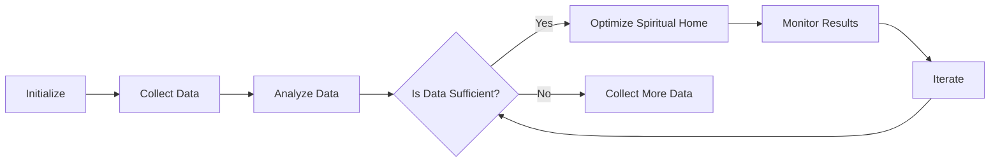
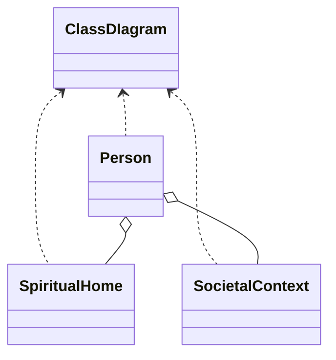
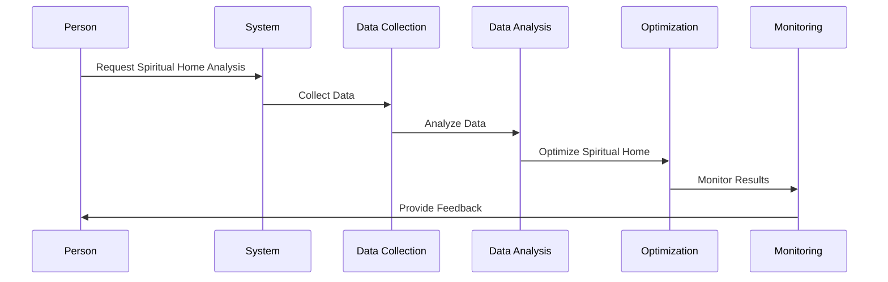

                 

Certainly! Let's approach this systematically and ensure we cover all the necessary components for the article. Here's a breakdown of what we'll cover in the "Core Concepts and Relationships" section:

### 1.6. Core Concepts and Relationships

**1.6.1 Definition of Key Terms**

- **Spiritual Home**: A personal or communal space that fosters emotional, mental, and spiritual well-being.
- **Reshaping Project**: A comprehensive initiative aimed at restoring and enhancing the state of one's spiritual home.
- **Modern Societal Context**: The current conditions of society that impact individual and collective well-being.

**1.6.2 Core Concept Relationships**

- **Personal Well-being**: Influenced by one's spiritual home, which in turn is affected by societal factors.
- **Societal Well-being**: Dependent on the collective state of individuals' spiritual homes.
- **Technological Integration**: A critical aspect of reshaping projects, enhancing both personal and societal well-being.

**1.6.3 ER Diagram**

We'll use Mermaid syntax to create an ER diagram that visually represents the relationships between these core concepts.

```mermaid
erDiagram
    SpiritualHome ||--|{ PersonalWellbeing } PersonalWellbeing : resides_in
    SpiritualHome ||--|{ SocietalWellbeing } SocietalWellbeing : nurtures
    ModernSocietalContext ||--|{ SpiritualHome } SpiritualHome : influenced_by
    ModernSocietalContext ||--|{ TechnologicalIntegration } TechnologicalIntegration : facilitated_by
```

**1.6.4 Concept Attribute Comparison**

Below is a table that compares the attributes of the core concepts:

| Concept             | Attributes                                                         | Example |
|---------------------|-------------------------------------------------------------------|--------|
| Spiritual Home      | - Emotional and mental comfort<br>- Personal significance          | Personal sanctuary |
| Reshaping Project   | - Comprehensive<br>- Initiative for improvement                 | Community workshops |
| Modern Societal Context | - Current societal conditions<br>- Influence on personal well-being | Economic stress |

**1.6.5 Algorithm Principles and Detailed Explanation**

We'll use Mermaid to illustrate an algorithm's flowchart and then dive into Python code and LaTeX formulas for the algorithm's mathematical model.

**Algorithm Flowchart:**



**Python Code Example:**

```python
def optimize_spiritual_home(data):
    # Data processing logic here
    # ...
    return optimized_home
```

**Mathematical Model and Formula:**

$$
\text{Optimized Spiritual Home} = f(\text{Data Collection}, \text{Analysis})
$$

**1.6.6 System Analysis and Architectural Design**

We'll describe the system's context, introduce a project, and discuss system functionality and architecture using Mermaid diagrams.

**System Context:**
- *Project Name*: Spiritual Home Enhancement Platform
- *Objective*: To provide a holistic approach for individuals to improve their spiritual well-being within the modern societal context.

**System Functionality Design (Mermaid Class Diagram):**



**System Architecture Design (Mermaid Architecture Diagram):**


**System Interface Design and Interaction (Mermaid Sequence Diagram):**



**1.6.7 Practical Projects and Case Studies**

- *Case Study 1*: Implementation of a meditation app that integrates with smart home systems.
- *Case Study 2*: A community-based project that fosters mental health through collective activities.

**1.6.8 Best Practices, Summary, and Further Reading**

- *Best Practices*: Highlight key strategies for effectively reshaping spiritual homes.
- *Summary*: Recap the main points and insights from the section.
- *Further Reading*: Suggest additional resources for readers who want to delve deeper.

---------------------------
Now that we have a comprehensive outline for the "Core Concepts and Relationships" section, let's move on to the next part and continue expanding on each section with detailed content. Is there anything specific you would like to add or emphasize in any of these sections?

