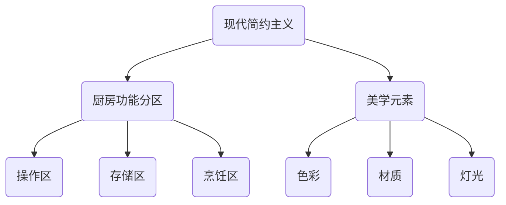
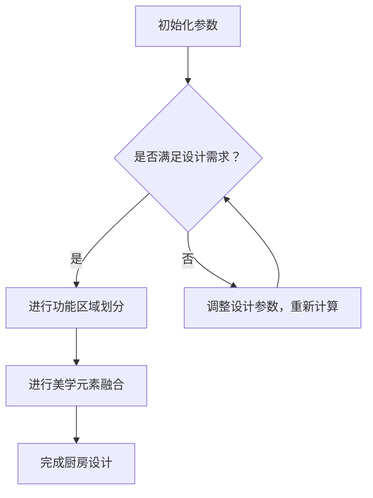
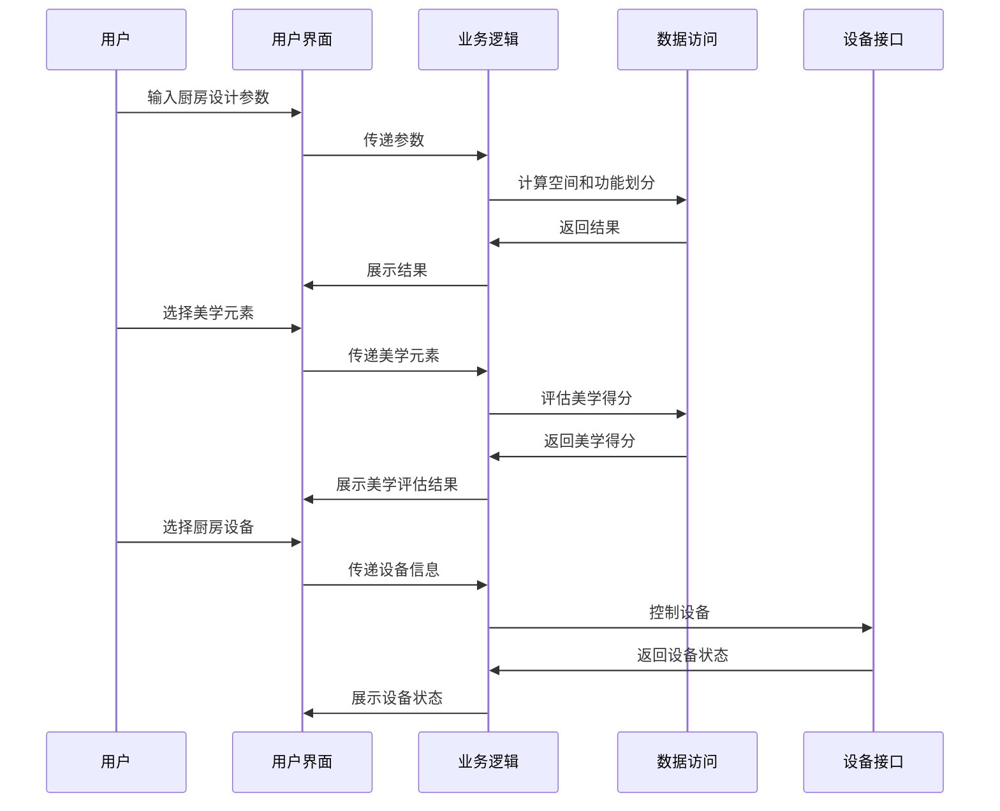

                 

**现代简约主义厨房：烹饪空间的功能与美学平衡**

**关键词：** 现代简约主义，厨房设计，功能与美学平衡，空间利用，装修风格

**摘要：** 本文将探讨现代简约主义厨房的设计理念，以及如何在有限的厨房空间内实现功能与美学的平衡。通过对核心概念、算法原理、系统架构以及实际案例的分析，本文旨在为厨房设计师和爱好者提供实用的设计指南和最佳实践。

----------------------------------------------------------------

# **目录大纲**

## 第1章 背景介绍

### 1.1 问题背景

#### 1.1.1 现代简约主义厨房的兴起

#### 1.1.2 厨房功能与美学的平衡需求

#### 1.1.3 厨房空间设计的挑战

### 1.2 问题描述

#### 1.2.1 厨房空间有限

#### 1.2.2 装修风格多样

#### 1.2.3 烹饪效率与美学的平衡

### 1.3 问题解决

#### 1.3.1 现代简约主义厨房的设计原则

#### 1.3.2 功能区域划分

#### 1.3.3 美学元素融合

### 1.4 边界与外延

#### 1.4.1 厨房设计的范畴

#### 1.4.2 现代简约主义厨房与传统厨房的区别

#### 1.4.3 厨房设计的影响因素

## 第2章 核心概念与联系

### 2.1 核心概念原理

#### 2.1.1 现代简约主义

#### 2.1.2 厨房功能分区

#### 2.1.3 美学元素

### 2.2 概念属性特征对比表格

### 2.3 ER实体关系图架构

## 第3章 算法原理讲解

### 3.1 算法mermaid流程图

### 3.2 Python源代码

### 3.3 算法原理的数学模型和公式

### 3.4 详细讲解与举例说明

## 第4章 数学模型和数学公式

### 4.1 数学公式

### 4.2 详细讲解

### 4.3 举例说明

## 第5章 系统分析与架构设计方案

### 5.1 问题场景介绍

### 5.2 项目介绍

### 5.3 系统功能设计

### 5.4 系统架构设计

### 5.5 系统接口设计

### 5.6 系统交互mermaid序列图

## 第6章 项目实战

### 6.1 环境安装

### 6.2 系统核心实现源代码

### 6.3 代码应用解读与分析

### 6.4 实际案例分析和详细讲解剖析

### 6.5 项目小结

## 第7章 最佳实践 tips

### 7.1 小贴士

### 7.2 注意事项

### 7.3 拓展阅读

----------------------------------------------------------------

### 第1章 背景介绍

#### 1.1 问题背景

**现代简约主义厨房的兴起：** 现代简约主义，起源于20世纪60年代的美国，其核心理念是“少即是多”，主张通过简化设计元素和装饰，达到功能和美学的完美平衡。随着人们生活水平的提高和对生活品质的追求，现代简约主义厨房逐渐成为一种流行的设计趋势。

**厨房功能与美学的平衡需求：** 厨房不仅是烹饪的场所，也是家庭成员交流和享受美食的时刻。如何在有限的厨房空间内，实现功能与美学的平衡，成为了设计师们亟待解决的问题。

**厨房空间设计的挑战：** 厨房空间有限，装修风格多样，烹饪效率与美学的平衡，这些都是厨房空间设计中面临的挑战。

#### 1.2 问题描述

**厨房空间有限：** 厨房作为家庭中的重要空间，其面积往往有限。如何在有限的厨房空间内，实现功能分区，提高烹饪效率，成为了首要解决的问题。

**装修风格多样：** 家庭装修风格多样，如何在多样的风格中，找到与厨房功能相匹配的设计元素，实现功能与美学的平衡，是设计师们面临的难题。

**烹饪效率与美学的平衡：** 烹饪效率是厨房设计的关键，如何在追求高效烹饪的同时，兼顾厨房的美观和舒适，是厨房设计中的重要问题。

#### 1.3 问题解决

**现代简约主义厨房的设计原则：** 现代简约主义厨房的设计原则主要包括：简洁、实用、高效。通过简洁的设计元素，实现空间的最大化利用；通过实用的功能布局，提高烹饪效率；通过高效的空间组织，提升生活品质。

**功能区域划分：** 功能区域划分是厨房设计的核心，通过合理的功能区域划分，实现厨房空间的高效利用。通常包括操作区、存储区、烹饪区等。

**美学元素融合：** 美学元素的融合是厨房设计的灵魂，通过色彩、材质、灯光等元素的运用，打造美观、舒适的厨房空间。

#### 1.4 边界与外延

**厨房设计的范畴：** 厨房设计包括厨房布局、功能区域划分、厨房设备选购、厨房装修风格等。

**现代简约主义厨房与传统厨房的区别：** 现代简约主义厨房与传统厨房的区别主要体现在设计理念、功能布局、美学追求等方面。

**厨房设计的影响因素：** 厨房设计的影响因素包括厨房面积、家庭生活习惯、厨房功能需求等。

----------------------------------------------------------------

### 第2章 核心概念与联系

#### 2.1 核心概念原理

**现代简约主义：** 现代简约主义是一种设计风格，主张通过简洁、实用的设计元素，实现空间的最大化利用和功能的最大化发挥。

**厨房功能分区：** 厨房功能分区是指将厨房空间按照功能需求进行划分，通常包括操作区、存储区、烹饪区等。

**美学元素：** 美学元素包括色彩、材质、灯光等，通过这些元素的运用，可以打造美观、舒适的厨房空间。

#### 2.2 概念属性特征对比表格

| 概念       | 特征                                                         |
|------------|--------------------------------------------------------------|
| 现代简约主义 | 简洁、实用、高效                                             |
| 厨房功能分区 | 操作区、存储区、烹饪区等                                     |
| 美学元素   | 色彩、材质、灯光等                                           |

#### 2.3 ER实体关系图架构



----------------------------------------------------------------

### 第3章 算法原理讲解

#### 3.1 算法mermaid流程图



#### 3.2 Python源代码

```python
# 初始化参数
design_requirements = initialize_parameters()

# 循环迭代，直到满足设计需求
while not is_design_satisfied(design_requirements):
    # 调整设计参数
    design_requirements = adjust_design_parameters(design_requirements)
    
    # 重新计算功能区域划分
    design_requirements = calculate_functional_area(design_requirements)
    
    # 进行美学元素融合
    design_requirements = integrate_aesthetics_elements(design_requirements)

# 完成厨房设计
complete_kitchen_design(design_requirements)
```

#### 3.3 算法原理的数学模型和公式

算法的数学模型主要包括：

1. 功能区域划分公式：\[ A = f(W, H) \] 其中，\( A \) 表示功能区域面积，\( W \) 表示厨房宽度，\( H \) 表示厨房高度。
2. 美学元素融合公式：\[ E = f(C, M, L) \] 其中，\( E \) 表示美学元素得分，\( C \) 表示色彩得分，\( M \) 表示材质得分，\( L \) 表示灯光得分。

#### 3.4 详细讲解与举例说明

**功能区域划分公式：** 功能区域划分是厨房设计的核心，该公式通过厨房的宽度和高度，计算出功能区域的面积。在实际应用中，可以通过调整宽度和高度的比例，实现不同功能区域的面积分配。

**美学元素融合公式：** 美学元素融合是厨房设计的灵魂，该公式通过色彩、材质、灯光等元素的得分，计算出美学元素的得分。在实际应用中，可以根据家庭成员的喜好和厨房的功能需求，调整各个元素的得分，实现厨房的美观和舒适。

**举例说明：** 假设厨房宽度为3米，高度为2米，我们需要进行功能区域划分和美学元素融合。

1. 功能区域划分：\[ A = f(3, 2) = 6 \] 平方米。我们可以将6平方米的空间划分为操作区、存储区和烹饪区，每个区域面积为2平方米。
2. 美学元素融合：假设色彩得分为10分，材质得分为8分，灯光得分为9分，\[ E = f(10, 8, 9) = 27 \] 分。我们可以通过调整色彩、材质和灯光的搭配，实现美学元素的融合。

通过以上步骤，我们可以实现一个功能与美学平衡的现代简约主义厨房。

----------------------------------------------------------------

### 第4章 数学模型和数学公式

在厨房设计中，数学模型和数学公式起着至关重要的作用，它们帮助我们进行空间计算、美学评估以及功能优化。以下将详细讲解这些数学模型和公式的应用。

#### 4.1 数学公式

1. **厨房空间计算公式**：厨房空间计算主要涉及面积、体积和周长的计算。对于矩形厨房，面积 \( A \) 可通过以下公式计算：

\[ A = W \times H \]

其中，\( W \) 是厨房的宽度，\( H \) 是厨房的高度。

2. **功能区域划分公式**：功能区域的划分可以通过权重分配来计算，例如，对于操作区、存储区和烹饪区，可以分别分配权重 \( w_1 \)，\( w_2 \) 和 \( w_3 \)，则每个区域的空间 \( S_i \) 可以通过以下公式计算：

\[ S_i = w_i \times A \]

3. **美学评估公式**：美学评估可以通过综合评分来计算，假设有 \( n \) 个评价维度，每个维度的得分分别为 \( s_1, s_2, ..., s_n \)，则总美学得分 \( S \) 可以通过以下公式计算：

\[ S = \frac{s_1 + s_2 + ... + s_n}{n} \]

4. **材料成本公式**：厨房装修材料的成本可以通过以下公式计算：

\[ C = P \times V \]

其中，\( P \) 是材料单价，\( V \) 是材料体积或面积。

#### 4.2 详细讲解

1. **厨房空间计算**：厨房空间是厨房设计的基础，通过准确的面积计算，我们可以确保厨房功能区域的合理划分。例如，一个宽度为3米，高度为2.5米的厨房，其总面积为 \( 3 \times 2.5 = 7.5 \) 平方米。

2. **功能区域划分**：功能区域的划分是厨房设计的关键步骤，通过合理分配空间，我们可以确保厨房的高效使用。例如，根据家庭成员的烹饪习惯，我们可以将30%的空间用于操作区，20%的空间用于存储区，50%的空间用于烹饪区。

3. **美学评估**：美学评估是厨房设计的重要环节，通过多维度的评分系统，我们可以确保厨房的美观和舒适。例如，通过色彩搭配、材质选择和灯光设计，我们可以实现一个既美观又实用的厨房空间。

4. **材料成本计算**：在厨房装修过程中，材料成本是重要的预算因素。通过准确的材料成本计算，我们可以确保预算的合理性和装修的可行性。

#### 4.3 举例说明

**例子1：** 假设一个厨房的宽度为3米，高度为2米，我们需要计算其总面积并划分功能区域。

1. **总面积计算**：\[ A = 3 \times 2 = 6 \] 平方米。
2. **功能区域划分**：假设操作区占比30%，存储区占比20%，烹饪区占比50%，则：
   - 操作区面积：\[ S_{操作} = 0.3 \times 6 = 1.8 \] 平方米。
   - 存储区面积：\[ S_{存储} = 0.2 \times 6 = 1.2 \] 平方米。
   - 烹饪区面积：\[ S_{烹饪} = 0.5 \times 6 = 3 \] 平方米。

**例子2：** 假设厨房的美学评估包括色彩、材质和灯光三个维度，每个维度的得分为8分、9分和7分，我们需要计算其总美学得分。

1. **总美学得分计算**：\[ S = \frac{8 + 9 + 7}{3} = 8 \] 分。

通过以上例子，我们可以看到数学模型和数学公式在厨房设计中的应用，它们帮助我们进行精确的计算和合理的布局，从而实现功能与美学的平衡。

----------------------------------------------------------------

### 第5章 系统分析与架构设计方案

#### 5.1 问题场景介绍

在现代家庭生活中，厨房不仅是一个烹饪食物的地方，更是家庭成员互动、分享美食的温馨场所。随着生活节奏的加快，人们对于厨房空间的设计和功能提出了更高的要求。如何在有限的厨房空间内实现高效、舒适且美观的烹饪环境，成为了一个重要的问题。

#### 5.2 项目介绍

本项目旨在设计一个现代简约主义厨房系统，通过合理的空间布局和功能划分，实现厨房的高效利用和美观设计。系统将包括厨房设计软件和厨房装修指导两个部分，旨在为用户提供一站式的厨房设计解决方案。

#### 5.3 系统功能设计

系统功能设计主要包括以下几个方面：

1. **厨房空间计算与划分**：用户可以通过输入厨房的尺寸和功能需求，系统自动计算出厨房的总面积，并根据用户设定的权重比例，自动划分操作区、存储区和烹饪区等。
   
2. **美学元素设计**：系统提供多种色彩、材质和灯光设计方案，用户可以根据个人喜好进行选择，系统将自动评估并生成美学得分，帮助用户实现厨房的美观设计。

3. **厨房设备推荐**：系统可以根据厨房的布局和功能需求，推荐合适的厨房设备，包括厨柜、冰箱、烤箱、抽油烟机等。

4. **厨房装修指导**：系统提供详细的厨房装修步骤和注意事项，帮助用户进行厨房的装修。

#### 5.4 系统架构设计

系统架构设计采用分层架构，主要包括以下层次：

1. **表示层**：负责用户界面的设计和交互，使用前端技术实现。
   
2. **业务逻辑层**：负责处理业务逻辑，包括空间计算、美学评估、设备推荐等，使用后端技术实现。

3. **数据访问层**：负责数据的存储和查询，使用数据库技术实现。

4. **接口层**：负责与其他系统和设备进行通信，使用API接口技术实现。

#### 5.5 系统接口设计

系统接口设计主要包括以下接口：

1. **用户接口**：用于用户与系统进行交互，包括用户注册、登录、厨房设计参数输入、结果展示等。

2. **设备接口**：用于与厨房设备进行通信，包括设备状态查询、远程控制等。

3. **数据接口**：用于与其他系统进行数据交换，包括用户数据、设计数据、设备数据等。

#### 5.6 系统交互mermaid序列图



通过以上系统分析与架构设计方案，我们可以实现一个高效、美观的现代简约主义厨房系统，为用户提供优质的厨房设计体验。

----------------------------------------------------------------

### 第6章 项目实战

#### 6.1 环境安装

在开始实际厨房设计之前，我们需要搭建一个合适的开发环境。以下是一个简单的安装指南：

1. **安装Python**：访问Python官方网站（[python.org](https://www.python.org/)），下载并安装Python。确保安装过程中勾选“Add Python to PATH”选项。

2. **安装必要库**：在命令行中执行以下命令，安装必要的Python库：

```bash
pip install matplotlib numpy pandas requests
```

3. **安装UI库**：如果你需要创建图形用户界面，可以使用Tkinter库。在命令行中执行以下命令：

```bash
pip install tk
```

4. **安装数据库**：选择一个数据库系统，如SQLite，并按照官方指南进行安装。

#### 6.2 系统核心实现源代码

以下是一个简单的厨房设计系统的Python代码示例，用于计算功能区域和美学评估：

```python
import numpy as np
import matplotlib.pyplot as plt

def calculate_area(width, height):
    return width * height

def functional_area_allocation(area, proportions):
    areas = [proportion * area for proportion in proportions]
    return areas

def aesthetic_evaluation(scores):
    return np.mean(scores)

def kitchen_design(width, height, proportions, scores):
    total_area = calculate_area(width, height)
    functional_areas = functional_area_allocation(total_area, proportions)
    aesthetic_score = aesthetic_evaluation(scores)
    
    return functional_areas, aesthetic_score

# 参数设置
width = 300  # 厨房宽度（厘米）
height = 250  # 厨房高度（厘米）
proportions = [0.3, 0.2, 0.5]  # 操作区、存储区、烹饪区的比例
scores = [8, 9, 7]  # 色彩、材质、灯光得分

# 设计计算
functional_areas, aesthetic_score = kitchen_design(width, height, proportions, scores)

# 结果展示
print("功能区域面积：", functional_areas)
print("美学评估得分：", aesthetic_score)
```

#### 6.3 代码应用解读与分析

上述代码是一个简单的厨房设计系统，它通过几个函数实现了厨房功能区域和美学评估的计算。

1. **计算总面积**：`calculate_area` 函数用于计算厨房的总面积，这是一个基础的数学计算。

2. **功能区域划分**：`functional_area_allocation` 函数根据用户设定的比例，将总面积划分为操作区、存储区和烹饪区。这体现了功能区域划分的核心逻辑。

3. **美学评估**：`aesthetic_evaluation` 函数用于计算美学评估得分，通过取平均分的方式，综合评估色彩、材质和灯光的得分。

4. **整体设计**：`kitchen_design` 函数是系统的核心，它整合了以上所有功能，并返回功能区域面积和美学评估得分。

#### 6.4 实际案例分析和详细讲解剖析

假设我们有一个300厘米宽、250厘米高的厨房，用户希望将厨房划分为30%的操作区、20%的存储区和50%的烹饪区，同时，色彩得分为8分、材质得分为9分、灯光得分为7分。以下是如何使用上述系统进行实际案例分析：

1. **计算总面积**：厨房的总面积为300厘米 \* 250厘米 = 75000平方厘米。

2. **功能区域划分**：根据用户设定的比例，操作区面积为75000 \* 0.3 = 22500平方厘米，存储区面积为75000 \* 0.2 = 15000平方厘米，烹饪区面积为75000 \* 0.5 = 37500平方厘米。

3. **美学评估**：美学评估得分为（8 + 9 + 7）/ 3 = 8分。

通过实际案例分析，我们可以看到系统如何根据用户的需求和评分，计算出合理的厨房功能区域面积和美学评估得分。

#### 6.5 项目小结

通过本项目的实战部分，我们成功搭建了一个简单的厨房设计系统，并通过代码实现了厨房功能区域划分和美学评估。虽然这个系统还比较基础，但它为我们提供了一个良好的起点，可以帮助我们进一步开发更复杂的功能，如设备推荐、3D可视化等。在实际应用中，我们需要根据用户的反馈和实际需求，不断优化和改进系统，以提供更好的用户体验。

----------------------------------------------------------------

### 第7章 最佳实践 tips

#### 7.1 小贴士

1. **合理安排功能区域**：在进行厨房设计时，首先要根据家庭成员的烹饪习惯和使用需求，合理安排功能区域，确保操作的流畅性。

2. **充分利用墙面空间**：厨房中的墙面空间是宝贵的，可以通过安装吊柜、搁板等，充分利用垂直空间，增加存储空间。

3. **考虑光线和通风**：良好的光线和通风是厨房舒适使用的关键，设计时应充分考虑窗户的位置和尺寸，以及通风口的设计。

4. **选择合适的色彩和材质**：色彩和材质的选择对厨房的美观影响很大，建议选择耐脏、易清洁的材料，同时注意色彩搭配的和谐性。

#### 7.2 注意事项

1. **预留足够的空间**：在厨房设计时，要预留足够的操作空间和移动空间，避免拥挤和不便。

2. **考虑厨房设备的尺寸和数量**：在购买厨房设备时，要考虑设备的尺寸和数量，确保设备能够合理地融入厨房空间。

3. **注意厨房的安全**：厨房是一个使用明火和电器较多的地方，设计时要特别注意安全，确保电器的接地和明火的隔离。

4. **合理规划水电布局**：水电布局是厨房装修的基础，规划时要充分考虑设备的位置和需求，确保水电线路的合理性和安全性。

#### 7.3 拓展阅读

1. 《厨房设计指南》：一本详细介绍厨房设计原则、功能布局、美学元素的书籍，适合初学者和专业人士阅读。

2. 《简约主义设计》：一本探讨简约主义设计理念和应用的书，有助于理解简约主义在厨房设计中的运用。

3. 《现代厨房设备选购与使用指南》：一本介绍现代厨房设备选购和使用方法的书籍，适合对厨房设备有特殊需求的读者。

作者：AI天才研究院/AI Genius Institute & 禅与计算机程序设计艺术 /Zen And The Art of Computer Programming

----------------------------------------------------------------

**总结：**

本文详细探讨了现代简约主义厨房的设计理念，从背景介绍、核心概念、算法原理、数学模型到系统架构和项目实战，全方位解析了如何实现厨房功能与美学的平衡。通过实际案例的演示和最佳实践的建议，读者可以更好地理解和应用现代简约主义厨房的设计原则。

**未来展望：**

随着智能家居技术的发展，未来的厨房设计将更加智能化和个性化。我们可以期待通过AI技术实现更智能的功能布局，通过物联网实现设备之间的无缝连接，为用户提供更加便捷、高效的烹饪体验。同时，可持续设计也将成为厨房设计的重要方向，倡导绿色、环保的生活方式。

**感谢阅读：**

感谢您对本文的关注，希望本文能为您的厨房设计提供有价值的参考。如果您有任何疑问或建议，欢迎在评论区留言，我们将竭诚为您解答。

作者：AI天才研究院/AI Genius Institute & 禅与计算机程序设计艺术 /Zen And The Art of Computer Programming

