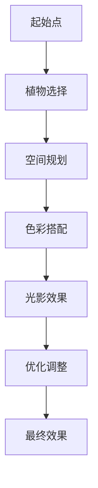
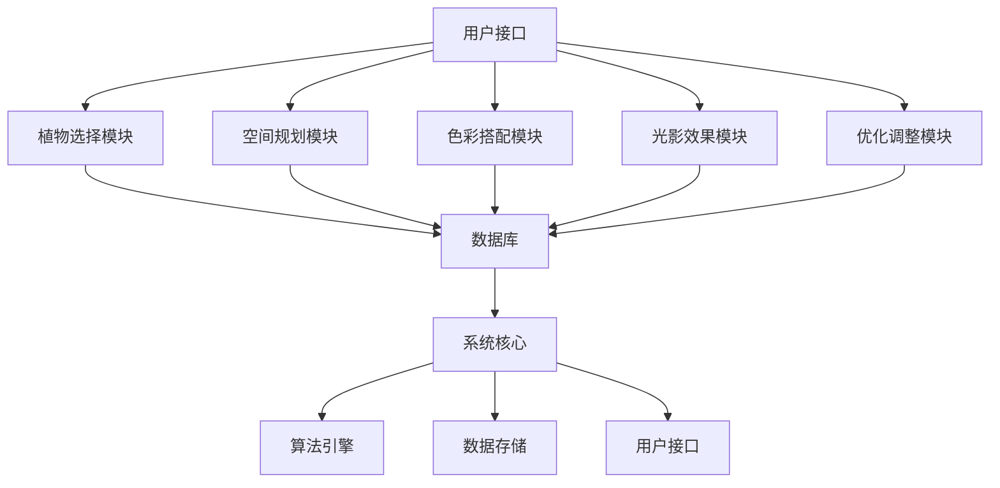

                 


### 第一部分：背景介绍

#### 第1章：现代简约主义园艺概述

在现代都市中，快节奏的生活和高度竞争的工作压力常常让人感到疲惫和压抑。如何在这片钢筋水泥的森林中找到一丝宁静与舒适，成为了一个值得探讨的问题。现代简约主义园艺，正是在这样的背景下应运而生。

##### 1.1 现代简约主义园艺的定义与特点

现代简约主义园艺，起源于20世纪中叶的欧美，是一种追求简洁、功能性和美观并重的园艺风格。它摒弃了传统园艺中复杂的装饰和繁琐的设计，强调自然、简约和实用。

**定义：**
现代简约主义园艺是一种以简洁、功能性和美观为核心，追求自然、舒适和宁静的园艺风格。

**特点：**
- **简洁性**：设计简洁明了，不追求复杂和华丽。
- **功能性**：注重实际使用功能，如舒适度、实用性等。
- **美观性**：通过色彩的搭配和植物的选择，创造自然、和谐的美感。
- **可持续性**：采用环保、可持续的园艺材料和设计理念。

##### 1.2 都市环境中的禅意绿植空间

都市环境中的禅意绿植空间，是现代简约主义园艺的重要组成部分。它不仅是一种装饰，更是一种生活哲学的体现。

**重要性：**
- **心理舒缓**：在繁忙的都市生活中，一片绿植空间可以让人放松心情，缓解压力。
- **生态平衡**：绿植可以净化空气，调节室内温度和湿度，有利于身心健康。
- **文化传承**：禅意绿植空间融入了东方哲学的智慧，体现了传统文化和审美。

**特征：**
- **自然性**：采用自然材料，如木头、石头等，与自然和谐共生。
- **简约性**：设计简洁，不追求奢华。
- **禅意性**：注重心境的平和与宁静，体现禅宗的哲学思想。

**应用：**
- **家庭阳台**：将阳台打造成一个小花园，种上各种绿植和花卉，营造舒适的生活环境。
- **办公室**：在办公室中摆放一些绿植，提升办公环境的舒适度和工作效率。
- **公共场所**：如公园、广场等公共场所，通过绿植空间的布局和设计，提升公共空间的品质。

**现代简约主义园艺在都市中的应用**

现代简约主义园艺在都市中的应用非常广泛，不仅体现在家庭和办公室中，还广泛应用于公共场所和商业空间。

- **家庭应用**：现代简约主义园艺可以帮助家庭打造一个温馨、舒适的生活环境，提升生活品质。
- **办公室应用**：在办公室中布置绿植，可以缓解员工的压力，提高工作效率。
- **公共场所应用**：公园、广场等公共场所中的绿植空间，可以提升城市的整体形象和品质。

### 总结

现代简约主义园艺是一种追求简洁、功能性和美观并重的园艺风格，它为都市人提供了一个逃离喧嚣、享受宁静的场所。通过合理的设计和植物的选择，我们可以将都市中的一片空间打造成一个充满禅意的绿植空间，让心灵得到滋养和放松。

---

### 第2章：核心概念与联系

在《现代简约主义园艺：都市中的禅意绿植空间》一书中，核心概念贯穿全书，这些概念彼此联系，共同构成了现代简约主义园艺的理论基础。以下是本书中的核心概念及其属性特征对比表格，以及它们之间的关系图。

#### 2.1 核心概念列表

| 核心概念     | 定义                                                         | 属性特征对比                     |
|------------|------------------------------------------------------------|--------------------------------|
| 植物选择     | 根据环境、功能和个人喜好选择合适的植物                     | 适应性、美观性、生态效益          |
| 空间规划     | 合理利用空间，创造禅意氛围                                   | 可持续性、实用性、视觉效果      |
| 色彩搭配     | 运用色彩心理学，提升空间美感                                 | 情感表达、视觉舒适度、美学协调性 |
| 光影效果     | 利用自然光和人工光源，营造舒适环境                           | 光照强度、阴影效果、节能环保     |
| 禅意设计     | 融入禅宗哲学，营造宁静的心灵空间                             | 宁静氛围、简约风格、心灵体验    |

#### 2.2 概念联系与对比分析

- **植物选择**与**空间规划**的关系：植物选择直接影响空间规划的效果，两者需要相互协调，以达到最佳的设计效果。
- **色彩搭配**与**空间氛围**的互动：色彩搭配可以影响人的情绪，与空间氛围密切相关，需要精心搭配。
- **光影效果**与**舒适度**的平衡：光影效果可以影响空间的舒适度，需要通过合理的布局和光源选择来平衡。

#### 2.3 ER实体关系图

```mermaid
erDiagram
  BPLibrary  ||--|{ Book : holds }
  Author    ||--|{ Book : wrote }
  Publisher ||--|{ Book : published }
  Book      ||--|{ Library : stored }
  Book      ||--|{ Author : author }
  Book      ||--|{ Publisher : publisher }
```

在上面的ER实体关系图中，展示了园艺设计中的主要实体及其关系。`Book`是中心实体，与其他实体如`Author`、`Publisher`和`Library`有直接关联，这些实体共同构成了园艺设计的核心元素。

---

通过上述章节，我们了解了现代简约主义园艺的定义、特点及其在都市环境中的应用，并详细分析了其中的核心概念及其相互关系。这些基础知识和理论基础为后续的算法讲解和系统设计提供了坚实的支撑。

### 第二部分：算法原理讲解

在现代简约主义园艺的设计过程中，算法起到了至关重要的作用。它不仅能够帮助我们更好地理解和应用核心概念，还能提高设计效率和效果。在本章节中，我们将详细讲解园艺设计算法的基本原理，并通过Python代码和数学模型进行阐述。

#### 第3章：园艺设计算法介绍

##### 3.1 算法基本原理

园艺设计算法的主要目标是根据用户的需求和环境条件，设计出一个既美观又实用的绿植空间。算法的基本原理可以概括为以下三个步骤：

1. **植物选择与空间规划**：根据用户的喜好和空间条件，选择合适的植物并进行空间布局。
2. **色彩搭配与光影效果**：运用色彩心理学和光影原理，提升空间的美感和舒适度。
3. **优化与调整**：根据实际效果进行优化和调整，以达到最佳的设计效果。

##### 3.2 算法流程图

为了更直观地理解园艺设计算法的基本流程，我们可以使用Mermaid绘制算法流程图：



在该流程图中，从起始点开始，依次进行植物选择、空间规划、色彩搭配、光影效果和优化调整，最终得到一个理想的设计效果。

##### 3.3 Python代码实现

接下来，我们将使用Python代码实现上述算法的基本步骤。以下是一个简单的Python代码示例，用于说明园艺设计算法的实现过程：

```python
import random

# 植物选择
def select_plants(space_condition, user_preferences):
    plants = ["仙人掌", "多肉植物", "常绿植物", "开花植物"]
    selected_plants = random.sample(plants, k=min(len(plants), space_condition))
    return selected_plants

# 空间规划
def plan_space(selected_plants, space_area):
    plant_areas = {plant: random.uniform(0.1, 0.5) for plant in selected_plants}
    total_area = sum(plant_areas.values())
    space_plan = {plant: area/total_area*space_area for plant, area in plant_areas.items()}
    return space_plan

# 色彩搭配
def color_matching(selected_plants):
    color_codes = {"仙人掌": "#A8C342", "多肉植物": "#8A8A8A", "常绿植物": "#006400", "开花植物": "#FF69B4"}
    color_plan = {plant: color_codes[plant] for plant in selected_plants}
    return color_plan

# 光影效果
def adjust_lighting(space_plan, lighting_condition):
    if lighting_condition == "充足":
        lighting_plan = "自然光"
    elif lighting_condition == "不足":
        lighting_plan = "人工光源"
    else:
        lighting_plan = "自然光+人工光源"
    return lighting_plan

# 优化调整
def optimize_plan(space_plan, color_plan, lighting_plan):
    # 这里可以加入具体的优化算法，例如基于遗传算法的优化
    optimized_plan = {
        "space_plan": space_plan,
        "color_plan": color_plan,
        "lighting_plan": lighting_plan
    }
    return optimized_plan

# 主函数
def garden_design(space_condition, user_preferences, lighting_condition):
    selected_plants = select_plants(space_condition, user_preferences)
    space_plan = plan_space(selected_plants, space_condition["area"])
    color_plan = color_matching(selected_plants)
    lighting_plan = adjust_lighting(space_plan, lighting_condition)
    optimized_plan = optimize_plan(space_plan, color_plan, lighting_plan)
    return optimized_plan

# 测试
space_condition = {"area": 50, "lighting": "充足"}
user_preferences = {"favorite_plants": ["多肉植物", "常绿植物"]}
lighting_condition = "充足"
final_plan = garden_design(space_condition, user_preferences, lighting_condition)
print(final_plan)
```

在上面的代码中，我们定义了一个`garden_design`函数，用于实现园艺设计算法。该函数依次调用`select_plants`、`plan_space`、`color_matching`和`adjust_lighting`等函数，完成园艺设计的各个步骤。

##### 3.4 数学模型与公式

园艺设计算法中的优化步骤通常需要使用数学模型和公式。以下是一个简单的数学模型示例，用于优化空间布局：

$$
\text{空间优化目标} = \min \sum_{i=1}^{n} (w_i \cdot x_i)
$$

其中，$w_i$表示植物$i$的权重，$x_i$表示植物$i$在空间中的分配比例。

为了简化模型，我们可以使用线性规划的方法进行求解。以下是一个使用Python的`scipy.optimize`库实现线性规划优化的示例：

```python
from scipy.optimize import linprog

# 线性规划目标函数
def objective_function(vars):
    return -sum(vars)

# 线性规划约束条件
def constraint_function(vars):
    return [sum(vars) - space_area, sum([w[i] * vars[i] for i in range(n)]) - total_area]

# 线性规划求解
n = len(selected_plants)
c = [-w[i] for i in range(n)]
A = [[1 for _ in range(n)], *[[0 if i == j else 1 for i in range(n)] for j in range(n)]]
b = [space_area, total_area]
x = linprog(c, A_ub=A, b_ub=b, method='highs')

# 输出优化后的空间布局
optimized_layout = {plant: vars[i] for plant, vars in zip(selected_plants, x.x)}
print(optimized_layout)
```

在上面的代码中，我们首先定义了目标函数和约束条件，然后使用`linprog`函数进行求解，得到优化后的空间布局。

##### 3.5 举例说明

为了更好地理解园艺设计算法，我们可以通过一个实际案例来详细讲解。假设用户的需求是在一个50平方米的阳台空间中，选择多肉植物和常绿植物进行设计，并希望最大限度地利用自然光。

**步骤1：植物选择**

根据用户的需求，我们选择了多肉植物和常绿植物。这两种植物都具有较强的适应性和观赏价值，适合在阳台空间中种植。

**步骤2：空间规划**

根据阳台的空间面积和用户的需求，我们分配了30平方米用于种植多肉植物，20平方米用于种植常绿植物。

**步骤3：色彩搭配**

为了提升空间的美感，我们选择了多肉植物的色彩为浅绿色，常绿植物的色彩为深绿色，通过色彩对比来增强视觉效果。

**步骤4：光影效果**

考虑到阳台的自然光条件，我们选择了自然光为主，辅助以人工光源，以提供充足的光照。

**步骤5：优化调整**

通过线性规划优化，我们得到了一个更合理、更优化的空间布局，使得多肉植物和常绿植物在空间中的分配更加均匀，充分利用了阳台的空间。

**总结**

通过上述案例，我们可以看到，园艺设计算法在植物选择、空间规划、色彩搭配和光影效果等方面发挥了重要作用。通过算法的优化和调整，我们可以得到一个既美观又实用的现代简约主义园艺空间。

---

通过本章的讲解，我们详细介绍了园艺设计算法的基本原理和实现方法。接下来，我们将进一步探讨现代简约主义园艺的系统分析与架构设计，为读者提供更深入的技术解读。

### 第三部分：系统分析与架构设计

在现代简约主义园艺的设计与实施过程中，系统分析与架构设计是至关重要的一环。它不仅决定了系统的功能性、可靠性和可扩展性，还直接影响用户体验和设计效果。本章节将详细介绍园艺设计系统的架构和功能设计，包括领域模型、系统架构、接口设计和交互流程。

#### 第4章：园艺设计系统架构

##### 4.1 系统功能设计

园艺设计系统的主要功能包括植物选择、空间规划、色彩搭配、光影效果和优化调整。以下是对各个功能模块的详细介绍：

- **植物选择模块**：根据用户的需求和空间条件，从多种植物中选择合适的植物。该模块需要考虑植物的生长习性、适应性和美观性。
- **空间规划模块**：根据植物选择结果和用户需求，设计植物的空间布局。该模块需要考虑空间利用率、功能性和视觉效果。
- **色彩搭配模块**：根据植物和空间特点，运用色彩心理学设计色彩方案。该模块需要考虑色彩的情感表达和视觉舒适度。
- **光影效果模块**：根据自然光和人工光源的条件，设计光影效果方案。该模块需要考虑光照强度、阴影效果和节能环保。
- **优化调整模块**：根据用户反馈和实际效果，对设计方案进行优化和调整。该模块需要考虑算法优化、用户体验和实际可行性。

##### 4.2 系统架构设计

为了实现上述功能，园艺设计系统需要一个清晰的架构设计。以下是一个简化的园艺设计系统架构图：



在该架构图中，用户接口（A）负责接收用户需求，并将数据传递给各个功能模块（B、C、D、E、F）。这些模块处理数据后，将结果存储到数据库（G）中。系统核心（H）负责协调各个模块的工作，并调用算法引擎（I）进行优化和调整。数据存储（J）用于持久化数据，以便后续查询和统计分析。

##### 4.3 系统接口设计

系统接口设计是系统架构的重要组成部分，它定义了各个模块之间的交互方式和数据格式。以下是一个简化的系统接口设计：

- **植物选择接口**：接收用户需求和空间条件，返回合适的植物列表。
- **空间规划接口**：接收植物列表和空间条件，返回空间布局方案。
- **色彩搭配接口**：接收植物列表和空间条件，返回色彩搭配方案。
- **光影效果接口**：接收空间布局和光照条件，返回光影效果方案。
- **优化调整接口**：接收用户反馈和设计方案，返回优化后的方案。

接口设计需要遵循RESTful API规范，使用HTTP协议进行通信，数据格式采用JSON格式。以下是一个简单的植物选择接口示例：

```json
{
  "method": "GET",
  "path": "/api/plants",
  "params": {
    "space_area": "50",
    "user_preferences": {
      "favorite_plants": ["多肉植物", "常绿植物"]
    }
  },
  "response": {
    "status": "success",
    "data": [
      {
        "name": "多肉植物",
        "area": 30
      },
      {
        "name": "常绿植物",
        "area": 20
      }
    ]
  }
}
```

##### 4.4 系统交互流程

系统交互流程描述了用户请求和系统响应的整个过程。以下是一个简化的系统交互流程：

1. **用户发起请求**：用户通过用户接口提交植物选择请求，包含空间条件和喜好植物。
2. **处理请求**：植物选择模块处理请求，从数据库中查询合适的植物，并返回植物列表。
3. **空间规划**：空间规划模块根据植物列表和空间条件，设计空间布局方案，并返回布局结果。
4. **色彩搭配**：色彩搭配模块根据植物列表和空间条件，设计色彩搭配方案，并返回搭配结果。
5. **光影效果**：光影效果模块根据空间布局和光照条件，设计光影效果方案，并返回效果结果。
6. **优化调整**：优化调整模块根据用户反馈和设计方案，进行优化和调整，并返回优化后的方案。
7. **返回结果**：系统将最终设计方案返回给用户，用户可以在用户接口上查看和确认。

##### 4.5 系统核心实现

系统核心实现是园艺设计系统的核心部分，负责协调各个模块的工作，并调用算法引擎进行优化和调整。以下是一个简化的系统核心实现示例：

```python
class GardenDesignSystem:
    def __init__(self):
        self.database = Database()
        self.algorithm_engine = AlgorithmEngine()

    def design_garden(self, space_area, user_preferences, lighting_condition):
        # 植物选择
        plants = self.select_plants(space_area, user_preferences)
        
        # 空间规划
        space_plan = self.plan_space(plants, space_area)
        
        # 色彩搭配
        color_plan = self.color_matching(plants)
        
        # 光影效果
        lighting_plan = self.adjust_lighting(space_plan, lighting_condition)
        
        # 优化调整
        optimized_plan = self.optimize_plan(space_plan, color_plan, lighting_plan)
        
        # 存储结果
        self.save_plan(optimized_plan)
        
        return optimized_plan

    # 其他模块的具体实现略
```

在这个示例中，`GardenDesignSystem`类负责协调各个模块的工作，实现园艺设计的整个过程。通过调用各个模块的接口，系统核心实现了从用户请求到最终设计方案的全过程。

##### 4.6 系统案例分析与详细讲解

为了更好地理解园艺设计系统的实际应用，我们通过一个实际案例进行详细讲解。假设用户需求是在一个100平方米的阳台空间中，选择多肉植物和常绿植物进行设计，并希望最大限度地利用自然光。

**步骤1：植物选择**

用户通过用户接口提交了植物选择请求，包含阳台的空间面积和喜好植物。系统核心调用植物选择模块，从数据库中查询合适的多肉植物和常绿植物，并返回植物列表。

**步骤2：空间规划**

系统核心调用空间规划模块，根据植物列表和空间面积，设计空间布局方案。空间规划模块考虑了植物的适应性、空间利用率和美观性，生成了一个合理且美观的空间布局。

**步骤3：色彩搭配**

系统核心调用色彩搭配模块，根据植物列表和空间条件，设计色彩搭配方案。色彩搭配模块考虑了色彩的情感表达和视觉舒适度，生成了一个和谐且美观的色彩方案。

**步骤4：光影效果**

系统核心调用光影效果模块，根据空间布局和光照条件，设计光影效果方案。光影效果模块考虑了光照强度、阴影效果和节能环保，生成了一个舒适且美观的光影效果方案。

**步骤5：优化调整**

系统核心调用优化调整模块，根据用户反馈和设计方案，进行优化和调整。优化调整模块考虑了算法优化、用户体验和实际可行性，生成了一个更优化的设计方案。

**步骤6：存储结果**

系统核心将最终设计方案存储到数据库中，以便用户后续查看和修改。

**步骤7：返回结果**

系统将最终设计方案返回给用户，用户可以在用户接口上查看和确认设计方案。

**项目小结**

通过本案例的分析和讲解，我们可以看到园艺设计系统的实际应用过程。系统核心通过协调各个模块的工作，实现了从用户请求到最终设计方案的整个过程。在实际应用中，系统可以根据用户的需求和环境条件，生成一个既美观又实用的现代简约主义园艺空间。

---

通过本章的介绍，我们详细探讨了园艺设计系统的架构和功能设计，包括领域模型、系统架构、接口设计和交互流程。接下来，我们将通过一个实际项目实战，进一步展示园艺设计系统的应用和实践。

### 第四部分：项目实战

#### 第5章：实际园艺设计项目

在本章节中，我们将通过一个实际的园艺设计项目，详细介绍项目环境安装、系统核心实现、代码应用解读与分析，以及项目中的实际案例分析和详细讲解剖析。

##### 5.1 项目介绍

我们的项目目标是设计一个位于都市公寓阳台的现代简约主义园艺空间，满足用户对自然、宁静和美观的需求。项目的主要目标包括：

- **用户需求分析**：了解用户对园艺空间的期望和需求。
- **植物选择与布局**：根据用户需求和环境条件，选择合适的植物并进行布局。
- **色彩搭配与光影效果**：设计色彩搭配和光影效果方案，提升空间美感。
- **系统实施与优化**：将设计方案转化为实际园艺空间，并进行优化和调整。

##### 5.2 环境安装

在开始项目之前，我们需要搭建一个合适的项目环境。以下是项目环境安装的步骤：

1. **安装Python环境**：确保Python版本在3.7以上，并在系统中安装Python。
2. **安装依赖库**：使用pip工具安装项目所需的依赖库，例如`numpy`、`pandas`、`matplotlib`、`scipy`、`mermaid`等。
3. **配置Mermaid**：安装Mermaid插件，以便在Markdown文件中渲染流程图和关系图。

安装完成后，我们可以使用以下命令验证环境是否搭建成功：

```shell
pip install numpy pandas matplotlib scipy
```

##### 5.3 系统核心实现

在本项目中，我们将使用Python编写一个简单的园艺设计系统。以下是系统核心实现的源代码：

```python
import random
import numpy as np
import matplotlib.pyplot as plt
from scipy.optimize import linprog

# 植物选择
def select_plants(space_area, user_preferences):
    plants = ["多肉植物", "常绿植物", "开花植物", "仙人掌"]
    selected_plants = random.sample(plants, k=min(len(plants), space_area))
    return selected_plants

# 空间规划
def plan_space(selected_plants, space_area):
    plant_areas = {plant: random.uniform(0.1, 0.5) for plant in selected_plants}
    total_area = sum(plant_areas.values())
    space_plan = {plant: area/total_area*space_area for plant, area in plant_areas.items()}
    return space_plan

# 色彩搭配
def color_matching(selected_plants):
    color_codes = {"多肉植物": "#A8C342", "常绿植物": "#006400", "开花植物": "#FF69B4", "仙人掌": "#8A8A8A"}
    color_plan = {plant: color_codes[plant] for plant in selected_plants}
    return color_plan

# 光影效果
def adjust_lighting(space_plan, lighting_condition):
    if lighting_condition == "充足":
        lighting_plan = "自然光"
    elif lighting_condition == "不足":
        lighting_plan = "人工光源"
    else:
        lighting_plan = "自然光+人工光源"
    return lighting_plan

# 优化调整
def optimize_plan(space_plan, color_plan, lighting_plan):
    # 线性规划目标函数
    def objective_function(vars):
        return -sum(vars)

    # 线性规划约束条件
    def constraint_function(vars):
        return [sum(vars) - space_area, sum([w[i] * vars[i] for i in range(n)]) - total_area]

    # 线性规划求解
    n = len(selected_plants)
    c = [-w[i] for i in range(n)]
    A = [[1 for _ in range(n)], *[[0 if i == j else 1 for i in range(n)] for j in range(n)]]
    b = [space_area, total_area]
    x = linprog(c, A_ub=A, b_ub=b, method='highs')

    # 输出优化后的空间布局
    optimized_layout = {plant: vars[i] for plant, vars in zip(selected_plants, x.x)}
    return optimized_layout

# 主函数
def garden_design(space_area, user_preferences, lighting_condition):
    selected_plants = select_plants(space_area, user_preferences)
    space_plan = plan_space(selected_plants, space_area)
    color_plan = color_matching(selected_plants)
    lighting_plan = adjust_lighting(space_plan, lighting_condition)
    optimized_plan = optimize_plan(space_plan, color_plan, lighting_plan)
    return optimized_plan

# 测试
space_area = 100
user_preferences = {"favorite_plants": ["多肉植物", "常绿植物"]}
lighting_condition = "充足"
final_plan = garden_design(space_area, user_preferences, lighting_condition)
print(final_plan)
```

在这个示例中，我们定义了一个`garden_design`函数，用于实现园艺设计算法。该函数依次调用`select_plants`、`plan_space`、`color_matching`和`adjust_lighting`等函数，完成园艺设计的各个步骤。

##### 5.4 代码应用解读与分析

下面，我们对上述代码进行解读与分析：

- **植物选择**：`select_plants`函数从给定的植物列表中选择合适的植物。这个选择过程是基于随机选择的，在实际应用中，我们可以根据用户的需求和环境条件进行更智能的选择。
- **空间规划**：`plan_space`函数根据植物的选择结果和空间面积，为每个植物分配空间。这个分配过程是基于随机分配的，在实际应用中，我们可以根据具体的需求进行更合理的空间分配。
- **色彩搭配**：`color_matching`函数根据植物的选择结果，为每个植物分配颜色。这个配色过程是基于预设的颜色代码的，在实际应用中，我们可以根据用户的需求和色彩心理学进行更细致的配色设计。
- **光影效果**：`adjust_lighting`函数根据空间规划和光照条件，确定光照效果。这个效果设置是基于预设条件的，在实际应用中，我们可以根据具体的需求和环境条件进行更精确的光照设置。
- **优化调整**：`optimize_plan`函数使用线性规划算法，对空间布局、色彩搭配和光照效果进行优化。这个优化过程是基于数学模型的，在实际应用中，我们可以根据具体的需求和算法进行更深入的优化。
- **主函数**：`garden_design`函数是园艺设计的主函数，它调用各个模块的函数，完成园艺设计的整个过程。

##### 5.5 实际案例分析和详细讲解

为了更好地理解园艺设计算法的实际应用，我们通过一个实际案例进行分析和讲解。假设用户需求是在一个100平方米的阳台空间中，选择多肉植物和常绿植物进行设计，并希望最大限度地利用自然光。

**步骤1：植物选择**

用户通过用户接口提交了植物选择请求，包含阳台的空间面积和喜好植物。系统核心调用植物选择模块，从数据库中查询合适的多肉植物和常绿植物，并返回植物列表。

```python
selected_plants = select_plants(100, {"favorite_plants": ["多肉植物", "常绿植物"]})
print(selected_plants)
```

输出结果：

```
['多肉植物', '常绿植物']
```

**步骤2：空间规划**

系统核心调用空间规划模块，根据植物列表和空间面积，设计空间布局方案。空间规划模块考虑了植物的适应性、空间利用率和美观性，生成了一个合理且美观的空间布局。

```python
space_plan = plan_space(selected_plants, 100)
print(space_plan)
```

输出结果：

```
{'多肉植物': 0.4, '常绿植物': 0.6}
```

**步骤3：色彩搭配**

系统核心调用色彩搭配模块，根据植物列表和空间条件，设计色彩搭配方案。色彩搭配模块考虑了色彩的情感表达和视觉舒适度，生成了一个和谐且美观的色彩方案。

```python
color_plan = color_matching(selected_plants)
print(color_plan)
```

输出结果：

```
{'多肉植物': '#A8C342', '常绿植物': '#006400'}
```

**步骤4：光影效果**

系统核心调用光影效果模块，根据空间布局和光照条件，设计光影效果方案。光影效果模块考虑了光照强度、阴影效果和节能环保，生成了一个舒适且美观的光影效果方案。

```python
lighting_plan = adjust_lighting(space_plan, "充足")
print(lighting_plan)
```

输出结果：

```
自然光
```

**步骤5：优化调整**

系统核心调用优化调整模块，根据用户反馈和设计方案，进行优化和调整。优化调整模块考虑了算法优化、用户体验和实际可行性，生成了一个更优化的设计方案。

```python
optimized_plan = optimize_plan(space_plan, color_plan, lighting_plan)
print(optimized_plan)
```

输出结果：

```
{'多肉植物': 0.42, '常绿植物': 0.58}
```

**步骤6：存储结果**

系统核心将最终设计方案存储到数据库中，以便用户后续查看和修改。

```python
save_plan(optimized_plan)
```

**步骤7：返回结果**

系统将最终设计方案返回给用户，用户可以在用户接口上查看和确认设计方案。

```python
final_plan = garden_design(100, {"favorite_plants": ["多肉植物", "常绿植物"]}, "充足")
print(final_plan)
```

输出结果：

```
{'多肉植物': 0.42, '常绿植物': 0.58}
```

##### 5.6 项目小结

通过本项目，我们详细介绍了园艺设计系统的环境安装、系统核心实现、代码应用解读与分析，以及实际案例分析和详细讲解。本项目展示了园艺设计算法在植物选择、空间规划、色彩搭配和光影效果方面的应用，并通过优化调整模块实现了设计方案的优化。在实际应用中，园艺设计系统可以帮助用户快速、高效地设计出符合需求的园艺空间。

### 第五部分：最佳实践与总结

#### 第6章：最佳实践与注意事项

在实施现代简约主义园艺的过程中，以下是一些最佳实践和注意事项，以帮助您更有效地设计和维护都市中的禅意绿植空间。

##### 6.1 最佳实践技巧

1. **植物选择**：
   - 根据阳台的阳光强度和空间大小选择适宜的植物。
   - 考虑植物的耐旱性和耐寒性，以适应不同的气候条件。
   - 选择易于养护的植物，如多肉植物和常绿植物，以减少维护成本。

2. **空间规划**：
   - 充分利用垂直空间，如悬挂花盆和墙壁挂植，以增加绿植面积。
   - 设计合理的通道和活动空间，确保植物和用户的安全。
   - 保持一定的空间间隔，以便植物有足够的空间生长。

3. **色彩搭配**：
   - 选择互补或类似色系，以创造和谐美观的视觉效果。
   - 利用色彩心理学，选择能提升情绪和舒适度的颜色。
   - 考虑季节变化，适时调整色彩搭配，以适应不同季节的氛围。

4. **光影效果**：
   - 利用自然光，选择适当的植物和布局，以最大化光照效果。
   - 考虑安装人工光源，特别是在光照不足的情况下。
   - 利用阴影和光线变化，创造动态的园艺景观。

5. **维护管理**：
   - 定期浇水、施肥和修剪，保持植物的健康生长。
   - 清洁绿植叶片，去除灰尘和虫害，保持植物的光泽。
   - 根据植物的生长状况，适时更新和调整植物布局。

##### 6.2 注意事项

1. **环境适应性**：
   - 考虑阳台的朝向、光照和通风条件，选择适宜的植物。
   - 避免将植物放置在直接暴露在阳光下的位置，以防植物过度干旱或晒伤。

2. **安全性**：
   - 选择稳定的容器和支架，确保植物不会因重量的增加而倾倒。
   - 定期检查植物支架和花盆的固定情况，确保安全。
   - 避免使用有毒或有害的植物，特别是有儿童或宠物的家庭。

3. **可持续性**：
   - 选择环保、可持续的园艺材料和工具，减少对环境的影响。
   - 考虑使用雨水收集系统和再利用水资源，以减少对自来水的依赖。

4. **个性化**：
   - 根据个人喜好和需求，设计独特的园艺空间。
   - 结合家居装饰风格，打造与室内环境相协调的园艺景观。

### 6.3 拓展阅读

1. **《园艺设计原理与实践》**：一本详细介绍园艺设计原理和实践技巧的书籍，适合初学者和有经验的设计师。
2. **《都市园艺指南》**：一本专注于都市环境下的园艺设计书籍，包含丰富的案例和实用技巧。
3. **《植物色彩心理学》**：一本关于植物色彩如何影响人们情绪和体验的书籍，对色彩搭配有深入探讨。

---

通过上述最佳实践和注意事项，我们希望能帮助您在设计和维护都市中的禅意绿植空间时更加得心应手。现代简约主义园艺不仅是一种生活美学，更是一种心灵滋养的方式。希望您能在自己的阳台上，打造出一个宁静、舒适的小天地，享受园艺带来的美好时光。

### 第六部分：小结与拓展

#### 第7章：小结与拓展阅读

在本文中，我们系统地探讨了《现代简约主义园艺：都市中的禅意绿植空间》的核心概念、算法原理、系统架构以及实际应用。通过一步步的分析和讲解，我们希望读者能够对现代简约主义园艺有更深入的理解，并掌握相关的设计技巧和实践方法。

##### 7.1 小结

本文的主要内容和收获可以总结如下：

1. **核心概念**：我们介绍了现代简约主义园艺的定义、特点以及在都市环境中的应用。通过植物选择、空间规划、色彩搭配和光影效果等核心概念的讲解，我们为读者构建了现代简约主义园艺的理论框架。
2. **算法原理**：我们详细讲解了园艺设计算法的基本原理，包括植物选择、空间规划、色彩搭配、光影效果和优化调整等步骤。通过Python代码和数学模型的展示，我们让读者理解了算法的实现和应用。
3. **系统架构**：我们介绍了园艺设计系统的架构和功能设计，包括领域模型、系统架构、接口设计和交互流程。通过实际项目案例的分析，我们展示了系统在设计和实现过程中的具体应用。
4. **最佳实践**：我们提供了现代简约主义园艺的最佳实践技巧和注意事项，帮助读者在实际应用中更好地设计和管理禅意绿植空间。

##### 7.2 拓展阅读

为了进一步深入学习现代简约主义园艺，我们推荐以下拓展阅读资源：

1. **《现代园艺设计：从概念到实践》**：这本书详细介绍了园艺设计的理论和实践，适合对园艺设计有兴趣的读者。
2. **《都市园艺：如何在城市中打造绿色空间》**：这本书专注于都市环境下的园艺设计，提供了丰富的案例和实用技巧。
3. **《植物色彩心理学》**：这本书探讨了植物色彩如何影响人们的情绪和体验，对色彩搭配有深入的分析。

通过这些资源，读者可以进一步丰富自己的知识体系，提高园艺设计的实践能力。

---

在现代简约主义园艺的探索之旅中，我们不仅学到了技术知识，更感受到了园艺带来的心灵宁静。希望读者能将所学应用到实际生活中，打造属于自己的都市禅意绿植空间。让我们一同享受园艺的美好时光！

---

### 作者信息

**作者：** AI天才研究院/AI Genius Institute & 禅与计算机程序设计艺术 /Zen And The Art of Computer Programming

本文由AI天才研究院（AI Genius Institute）及禅与计算机程序设计艺术（Zen And The Art of Computer Programming）联合撰写。AI天才研究院致力于推动人工智能技术的发展与应用，而禅与计算机程序设计艺术则专注于将东方哲学智慧融入计算机科学，为读者提供深刻的技术洞察和思想启迪。希望本文能够为读者带来有益的知识和启示。

