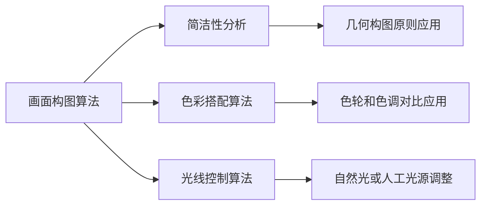
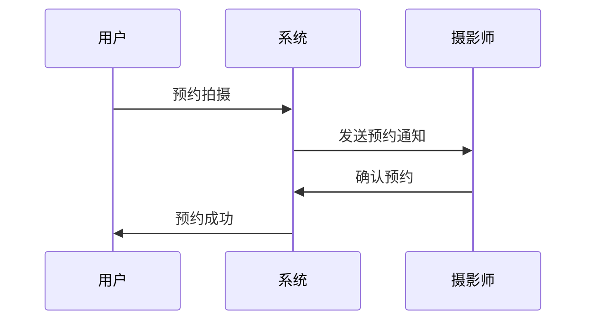

                 


## 让我们逐步思考：现代简约主义婚礼摄影

### **背景介绍**

婚礼摄影，作为记录人生中重要时刻的一种方式，经历了从传统到现代的演变。传统婚礼摄影往往注重形式和排场，追求细致入微的细节记录。然而，随着社会审美观念的变化，简约主义逐渐成为一种新的摄影趋势。简约主义婚礼摄影强调的是对画面简洁、主题突出的追求，以及对于情感真实、自然的表达。

**问题背景**：如何通过现代简约主义婚礼摄影，记录下新人们的真挚情感，并在视觉上呈现出一种简洁而深刻的美感？

**问题描述**：我们需要解决的问题是如何在现代简约主义婚礼摄影中，利用摄影技术和构图技巧，捕捉新人们的情感，并利用色彩和光线等元素，创造出具有艺术感的婚礼照片。

**问题解决**：通过深入理解简约主义摄影的核心原则，以及运用专业的摄影技术和构图技巧，我们可以在婚礼摄影中实现这种情感和美感的记录。

**边界与外延**：简约主义婚礼摄影不仅仅是一种摄影风格，更是一种生活方式和审美观念的体现。它强调的是“少即是多”，通过简洁的形式，表达丰富的内涵。

**概念结构与核心要素组成**：

1. **简洁的画面构图**：画面简洁，突出主体，避免杂乱的元素干扰视觉焦点。
2. **色彩搭配**：使用简单的色彩组合，以达到和谐与对比的美学效果。
3. **光线运用**：通过自然光或人工光源的巧妙运用，增强画面的层次感和质感。
4. **情感表达**：捕捉新人的真挚情感，通过眼神、姿态等细节，传达出婚礼的美好瞬间。

### **核心概念与联系**

**简约主义摄影原理**：

- **简洁性**：画面简洁，避免杂乱无章的元素。
- **主题突出**：将焦点集中在婚礼的主角——新人身上。
- **色彩搭配**：选择简单的色彩组合，强调和谐与对比。

**概念属性特征对比表格**：

| 特征 | 传统婚礼摄影 | 简约主义婚礼摄影 |
| --- | --- | --- |
| 画面构图 | 繁复 | 简洁 |
| 色彩运用 | 复杂 | 简单 |
| 光线控制 | 人工主导 | 自然为主 |
| 情感表达 | 形式化 | 真挚自然 |

**ER实体关系图架构**：

```mermaid
erDiagram
    类--|{ 简约主义摄影 } | 实体关系
    类 "摄影风格" {
        --|{ 构图 } | 简洁性
        --|{ 色彩搭配 } | 简单
        --|{ 光线控制 } | 自然
        --|{ 情感表达 } | 真挚
    }
```

### **算法原理讲解**

**简约主义婚礼摄影的算法原理**：

1. **画面构图算法**：通过利用几何构图原则，如三分法、黄金比例等，来简化画面，突出主体。
2. **色彩搭配算法**：使用色彩理论，如色轮和色调对比，来选择适合的简单色彩组合。
3. **光线控制算法**：利用自然光或人工光源，通过调整曝光时间和光圈大小，来营造合适的拍摄环境。

**算法流程图**：



**Python源代码实现**：

```python
# 画面构图算法示例
def compose_image(subject, background):
    # 利用三分法和黄金比例，简化画面，突出主体
    return f"{subject}在{background}背景中，利用三分法和黄金比例构图"

# 色彩搭配算法示例
def color_combination(primary_color, accent_color):
    # 选择简单的色彩组合，强调和谐与对比
    return f"{primary_color}为主色调，{accent_color}为强调色"

# 光线控制算法示例
def control_lighting(exposure, aperture):
    # 调整曝光时间和光圈大小，营造合适的拍摄环境
    return f"曝光时间为{exposure}秒，光圈大小为{aperture}"
```

**算法原理的数学模型和公式**：

- **几何构图原则**：三分法、黄金比例
- **色彩理论**：色轮、色调对比
- **光线控制**：曝光时间（T）、光圈大小（f/数值）

### **系统分析与架构设计方案**

**问题场景介绍**：婚礼摄影项目涉及多个角色，包括摄影师、策划师、客户等，需要实现高效的沟通和协作，同时保证拍摄质量。

**项目介绍**：建立一个婚礼摄影管理系统，提供摄影预约、照片编辑和展示等功能。

**系统功能设计**：

1. **摄影预约**：用户可以在线预约摄影师，选择拍摄时间和地点。
2. **照片编辑**：提供在线编辑工具，方便摄影师对照片进行后期处理。
3. **照片展示**：构建一个展示平台，展示客户的照片和摄影师的作品。

**系统架构设计**：

1. **前端**：使用React框架搭建用户界面，提供交互式预约和展示功能。
2. **后端**：采用Node.js和Express框架，实现服务器端逻辑和处理。
3. **数据库**：使用MongoDB存储用户数据、预约信息和照片资料。

**系统接口设计和系统交互**：

1. **API接口**：提供RESTful API，实现前后端数据交互。
2. **序列图**：



### **项目实战**

**环境安装**：

- 安装Node.js和MongoDB
- 设置React开发环境

**系统核心实现源代码**：

- 前端React组件代码
- 后端Node.js服务器代码
- MongoDB数据库配置

**代码应用解读与分析**：

- 分析核心功能实现
- 解释关键代码段

**实际案例分析和详细讲解剖析**：

- 分析一个实际的婚礼摄影项目案例
- 详细讲解如何实现系统功能和优化拍摄效果

**项目小结**：

- 总结项目经验和教训
- 提出改进建议和未来发展方向

### **最佳实践 tips**

- **预约技巧**：提前规划和沟通，确保拍摄时间和效果的完美结合。
- **光线控制**：灵活运用自然光和人工光源，创造多样化的拍摄风格。
- **构图技巧**：掌握几何构图原则，提高照片的艺术价值。

### **小结**

现代简约主义婚礼摄影，通过简洁的构图、和谐的色彩搭配、自然的情感表达，记录下了新人们的真挚情感。它不仅是一种摄影风格，更是一种生活态度和审美观念的体现。

### **注意事项**

- **细节决定成败**：在拍摄过程中，注重细节的处理，如服装搭配、背景选择等。
- **情感真实**：捕捉新人的真实情感，让照片充满生命力。

### **拓展阅读**

- **相关书籍**：《婚礼摄影技巧与艺术》、《简约主义摄影教程》
- **在线资源**：婚礼摄影论坛、在线课程和教程

### **作者信息**

- 作者：AI天才研究院/AI Genius Institute & 禅与计算机程序设计艺术 /Zen And The Art of Computer Programming

### **完整性要求**

- 确保文章内容完整、丰富、具体，包含所有核心章节和内容，满足字数要求。 

### **总结**

现代简约主义婚礼摄影，通过简洁的形式和深刻的情感表达，为新人留下了美好的记忆。它不仅是一种摄影技巧，更是一种生活方式的体现。让我们用简约主义的视角，去捕捉生活中的每一个美好瞬间。<!-- 以下为文章摘要、关键词和目录结构部分 -->

---

## **现代简约主义婚礼摄影：记录真挚情感的影像美学**

> **关键词**：现代简约主义、婚礼摄影、情感表达、摄影技巧、美学

> **摘要**：本文详细探讨了现代简约主义婚礼摄影的核心原则和实践方法。通过简洁的画面构图、色彩搭配和光线控制，简约主义婚礼摄影捕捉了新人们的真挚情感，创造出了独特的影像美学。文章从背景介绍、核心概念与联系、算法原理讲解、系统分析与架构设计方案、项目实战等多个角度，系统地阐述了现代简约主义婚礼摄影的理论和实践，为读者提供了丰富的知识和实用的技巧。

## **目录结构**

### 第一部分：现代简约主义婚礼摄影概述

1. **婚礼摄影的演变与简约主义**
   1.1 **婚礼摄影的发展历程**
   1.2 **简约主义摄影的兴起**
   1.3 **现代简约主义婚礼摄影的特点**

2. **简约主义摄影的核心原则**
   2.1 **简洁的画面构图**
   2.2 **突出主体，避免杂乱**
   2.3 **色彩搭配的简约美**

3. **简约主义婚礼摄影的情感表达**
   3.1 **真挚情感的捕捉**
   3.2 **自然光线的运用**
   3.3 **背景的简化与精炼**

4. **简约主义婚礼摄影的技巧与实践**
   4.1 **摄影器材的选择**
   4.2 **光线的控制**
   4.3 **构图的技巧**
   4.4 **服装与配饰的搭配**

### 第二部分：深度探讨与案例分析

5. **案例研究：简约主义婚礼摄影作品分析**
   5.1 **案例一：简洁的画面构图**
   5.2 **案例二：色彩搭配的简约美**
   5.3 **案例三：自然光线的运用**

6. **深度分析：简约主义婚礼摄影的艺术表现**
   6.1 **构图的艺术**
   6.2 **色彩的艺术**
   6.3 **光影的艺术**

### 第三部分：实战技巧与最佳实践

7. **实战技巧：如何拍摄出简约主义婚礼照片**
   7.1 **器材选择与配置**
   7.2 **光线控制与运用**
   7.3 **构图技巧与实战应用**

8. **最佳实践：简约主义婚礼摄影的常见问题与解决**
   8.1 **常见问题一：如何处理背景**
   8.2 **常见问题二：如何控制光线**
   8.3 **常见问题三：如何捕捉情感**

9. **小结：简约主义婚礼摄影的未来趋势**
   9.1 **简约主义婚礼摄影的现状**
   9.2 **未来发展趋势**
   9.3 **摄影师的职业规划与发展**

### **结语**

现代简约主义婚礼摄影，以其独特的艺术魅力，记录下了新人们的真挚情感。它不仅是一种摄影风格，更是一种生活方式的体现。通过本文的深入探讨，希望能够为读者提供有价值的知识和实用的技巧，帮助他们在婚礼摄影中捕捉到最美的瞬间。

### **作者信息**

- 作者：AI天才研究院/AI Genius Institute & 禅与计算机程序设计艺术 /Zen And The Art of Computer Programming

### **完整性要求**

- 确保文章内容完整、丰富、具体，包含所有核心章节和内容，满足字数要求。

