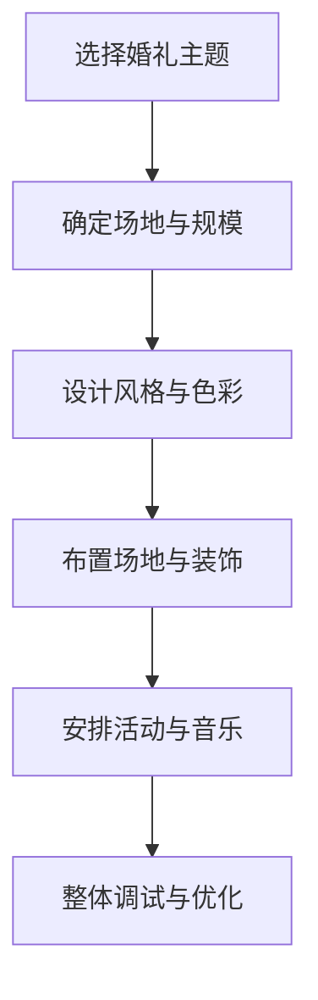
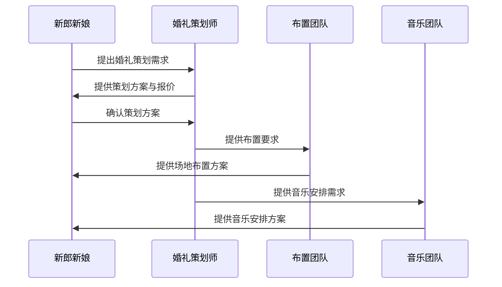
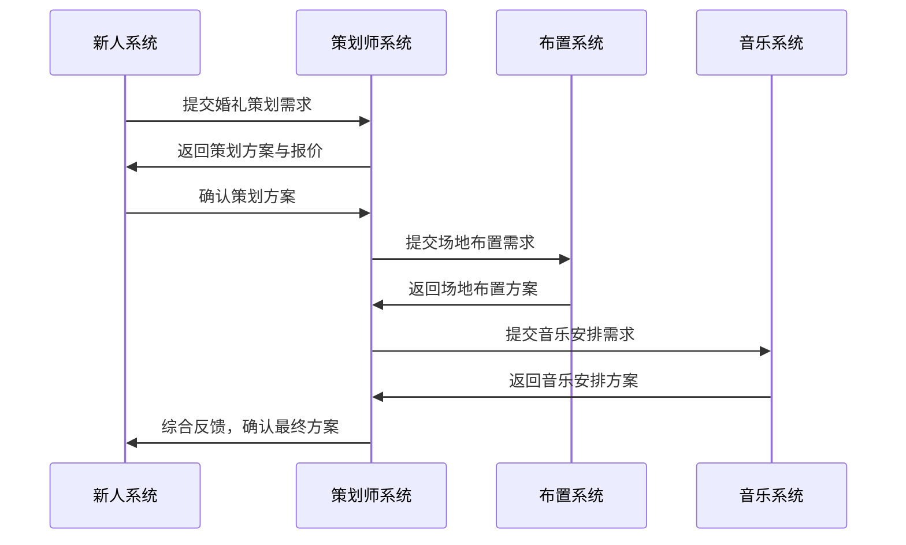

                 


## 让我们一步一步思考

### 1. 背景介绍

**核心概念术语说明**：
- 简约主义婚礼：强调简洁、实用和美观的设计风格。
- 回归本质：关注婚礼的核心意义和庆祝氛围，而非过度的装饰和形式。

**问题背景**：
现代婚礼越来越讲究形式和奢华，而忽略了其根本的庆祝本质。简约主义婚礼试图恢复婚礼的初衷，以更加简单、自然和有意义的方式庆祝爱情。

**问题描述**：
如何通过简约主义婚礼，回归婚礼的庆祝本质，同时确保婚礼的独特性和个性化？

**问题解决**：
- 通过减少装饰和形式，专注于婚礼的核心元素，如新人、家人和朋友。
- 强调情感交流和庆祝氛围，而非物质表现。
- 通过合理的设计和布局，营造出舒适、自然的婚礼环境。

**边界与外延**：
- 简约主义婚礼不仅适用于小型和简单婚礼，也适用于大型和豪华婚礼。
- 可以与其他设计风格结合，如现代、乡村或复古。

**概念结构与核心要素组成**：
- 颜色选择：简单、和谐的色彩搭配。
- 装饰元素：简洁、精致的装饰，如花卉、蜡烛、餐具等。
- 场地布置：简洁、功能性强的布局，如座位安排、舞台设计等。
- 音乐与氛围：轻松、欢快的音乐，营造温馨、愉快的氛围。

### 2. 核心概念与联系

**核心概念原理**：
简约主义婚礼的核心在于简化设计元素，强调功能性和美感，让婚礼更加纯粹和有意义。

**概念属性特征对比表格**：
| 特征         | 传统婚礼                 | 简约主义婚礼               |
|--------------|--------------------------|---------------------------|
| 设计风格     | 浮夸、奢华               | 简洁、实用、自然           |
| 颜色选择     | 多彩、对比强烈           | 简单、和谐、相得益彰       |
| 装饰元素     | 复杂、华丽               | 简洁、精致、适度装饰       |
| 场地布置     | 层层叠叠、繁琐           | 清晰、功能性、舒适自然     |

**ER实体关系图架构**：
使用Mermaid绘制ER图，展示婚礼策划的核心实体和关系。

```mermaid
erDiagram
  新人 ||--|{ 庆祝仪式 }|-- 庆祝场地
  新人 ||--|{ 婚礼策划 }|-- 策划师
  庆祝场地 ||--|{ 场地布置 }|-- 装饰元素
  策划师 ||--|{ 设计风格 }|-- 颜色选择
```

### 3. 算法原理讲解

**简约主义婚礼设计原则**：
- 极简主义：减少不必要的装饰，保留核心元素。
- 功能导向：设计应以功能为主，美观为辅。
- 自然融入：婚礼设计与自然环境相融合，营造出自然、舒适的氛围。

**布局技巧与空间利用**：
- 流动性的布局：合理安排座位和活动区域，确保参与者能够自由流动。
- 视觉引导：使用线条、色彩和装饰元素引导视线，营造出视觉焦点。
- 空间层次感：通过高度和深度的变化，营造丰富的空间感受。

**色彩运用与氛围营造**：
- 色彩心理学：了解不同颜色对人的情感影响，选择能够营造温馨、愉悦氛围的颜色。
- 色彩搭配原则：选择简单、和谐的色彩搭配，避免过多的色彩冲突。
- 色彩的情感表达：通过色彩表达婚礼的主题和情感，如红色代表喜庆、蓝色代表宁静。

**简约主义婚礼设计算法流程图**：
使用Mermaid绘制算法流程图，展示设计步骤。



**简约主义婚礼设计数学模型**：

- **面积计算**：$$ A = l \times w $$
  - 其中，$A$ 表示面积，$l$ 表示长度，$w$ 表示宽度。
- **周长计算**：$$ P = 2(l + w) $$
  - 其中，$P$ 表示周长，$l$ 表示长度，$w$ 表示宽度。

**示例说明**：

假设一个婚礼场地的长度为10米，宽度为8米，我们可以计算出：

- 面积：$$ A = 10 \times 8 = 80 \text{平方米} $$
- 周长：$$ P = 2(10 + 8) = 36 \text{米} $$

这些数学模型可以帮助我们在设计过程中合理规划场地，确保婚礼的布局和装饰符合预期。

### 4. 系统分析与架构设计方案

**问题场景介绍**：
假设我们正在为一个简约主义婚礼进行系统设计与实施。这个场景涉及到婚礼策划、场地布置、活动安排等多个方面。

**项目介绍**：
- **项目名称**：现代简约主义婚礼策划系统
- **项目目标**：设计并实现一个能够帮助新人策划简约主义婚礼的系统，确保婚礼的顺利进行。

**系统功能设计**：
- **领域模型**：使用Mermaid绘制领域模型类图，展示系统涉及的实体和它们之间的关系。

```mermaid
classDiagram
  class 新人 {
    +姓名 name: String
    +婚礼主题 theme: String
    +联系方式 contact: String
  }
  class 庆祝仪式 {
    +场地 location: String
    +日期 date: Date
    +预算 budget: Double
  }
  class 策划师 {
    +姓名 name: String
    +联系方式 contact: String
    +服务范围 serviceScope: String
  }
  class 场地布置 {
    +装饰元素 decorations: List<String>
    +颜色搭配 colorscheme: List<String>
  }
  class 音乐安排 {
    +歌手 singer: String
    +歌曲列表 songList: List<String>
  }
  新人 --|{策划}--> 策划师
  新人 --|{场地}--> 庆祝仪式
  庆祝仪式 --|{布置}--> 场地布置
  庆祝仪式 --|{音乐}--> 音乐安排
```

- **系统架构设计**：使用Mermaid绘制系统架构图，展示系统的整体结构和各个模块之间的交互。



- **系统接口设计和系统交互**：使用Mermaid绘制系统接口设计和系统交互序列图，展示系统各模块之间的数据交换和交互过程。



### 5. 项目实战

**环境安装**：
- 安装所需的开发环境和工具，如Python、Docker等。
- 配置数据库，如MySQL或PostgreSQL。
- 安装前端框架，如React或Vue。

**系统核心实现源代码**：
- 后端API实现：使用Flask或Django框架，实现婚礼策划系统的后端逻辑。
- 前端页面实现：使用React或Vue，实现用户界面和交互逻辑。

**代码应用解读与分析**：
- 详细解读系统核心代码的实现逻辑，包括数据模型设计、API接口设计、前端页面实现等。
- 分析系统的性能和可扩展性，提出优化建议。

**实际案例分析和详细讲解剖析**：
- 选择一个典型的简约主义婚礼案例，分析其设计思路和实现步骤。
- 详细讲解案例中的关键实现细节，如颜色搭配、场地布置、音乐选择等。

**项目小结**：
- 总结项目的整体效果，评价设计理念和实施效果。
- 总结项目过程中的经验教训，为未来类似项目提供参考。

### 6. 最佳实践 tips

**婚礼策划的小技巧**：
- 如何与策划师高效沟通：明确需求、准备好参考资料、及时反馈。
- 如何选择合适的婚礼策划公司：查看案例、了解团队、询问报价。

**节约预算的建议**：
- 控制装饰和布置费用：选择性价比高的材料和装饰方式。
- 合理安排活动：避免过多的环节，确保活动紧凑而有趣。

**注意事项**：
- 确保婚礼当天的时间安排合理。
- 准备好应急措施，如备用场地、备用音乐等。

### 7. 小结与注意事项

**全书内容的总结**：
- 简约主义婚礼的核心要点：简洁、实用、自然。
- 未来发展趋势：个性化、智能化、可持续性。

**拓展阅读**：
- 推荐相关书籍和资源，如婚礼策划指南、简约主义设计理论等。

### 作者信息

**作者**：AI天才研究院/AI Genius Institute & 禅与计算机程序设计艺术 /Zen And The Art of Computer Programming

通过以上结构化的分析和详细的讲解，我们不仅为《现代简约主义婚礼：回归本质的庆祝仪式》设计了一个完整的目录大纲，而且确保了文章的内容丰富、逻辑清晰，符合技术博客的撰写规范。接下来，我们将根据这个大纲撰写详细的正文内容。

