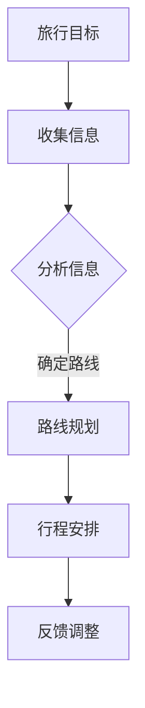
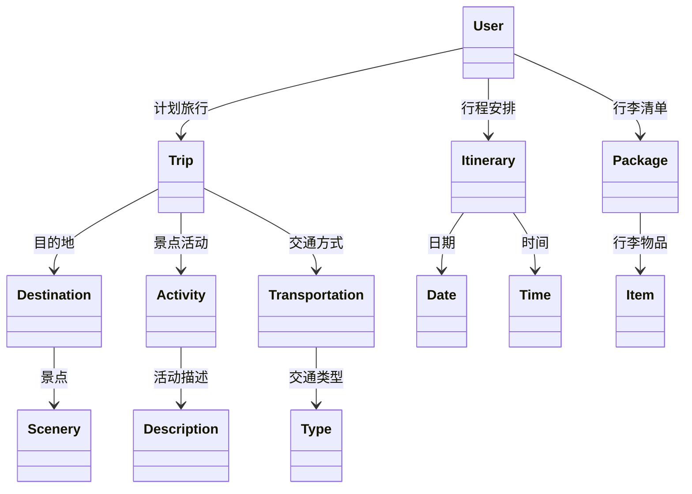
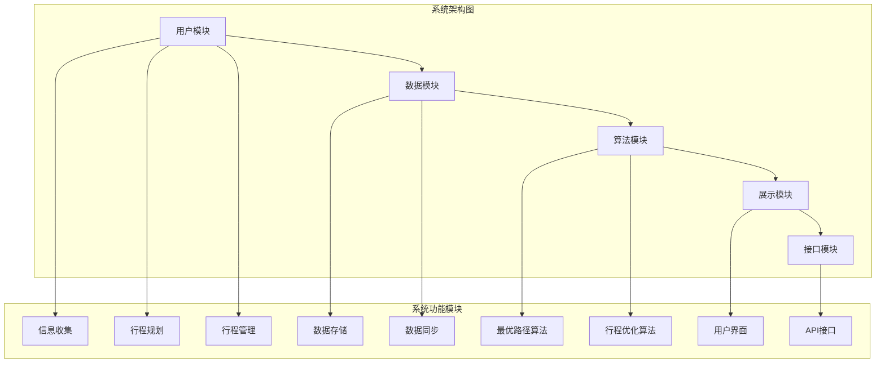
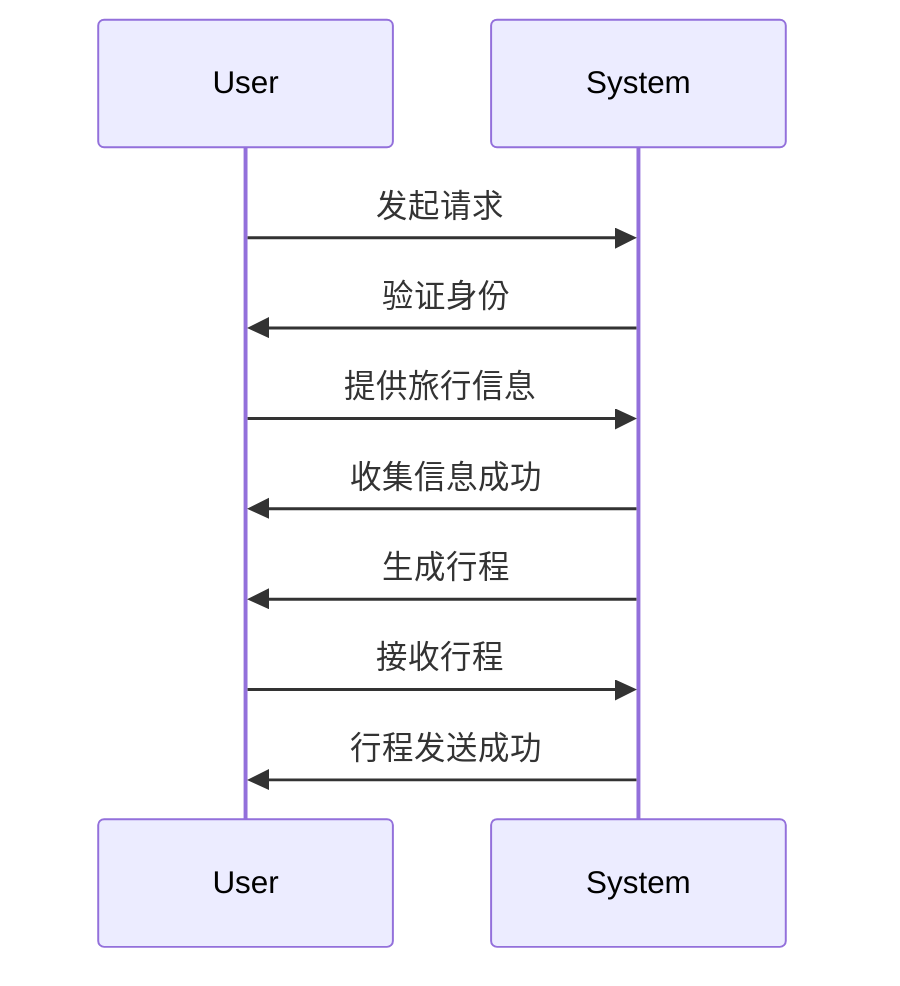
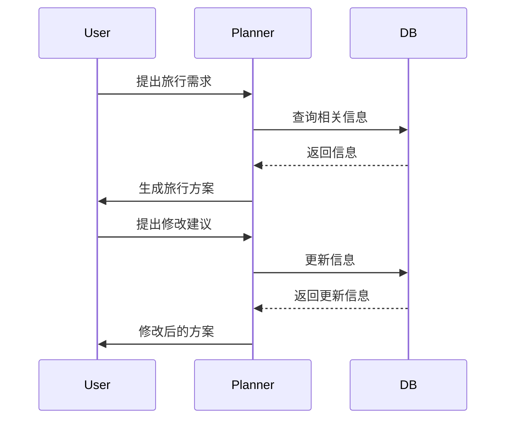

                 

### 现代简约主义旅行：极简主义者的环球探索

#### 关键词

- 现代简约主义
- 极简主义者
- 旅行
- 环球探索
- 极简行李
- 高效规划

#### 摘要

随着现代生活的快节奏和全球化，极简主义旅行逐渐成为一种新的旅行方式。本文将探讨现代简约主义旅行的理念与实践，帮助极简主义者实现轻松、愉快的环球探索。本文将分为以下几个部分：背景介绍、核心概念与联系、算法原理讲解、系统分析与架构设计方案、项目实战以及最佳实践 tips。

### 背景介绍

#### 问题背景

随着全球化的推进和现代生活节奏的加快，旅行已成为人们生活中不可或缺的一部分。然而，传统的旅行方式往往伴随着繁杂的行李、长时间的准备和繁重的日程安排，使得旅行体验变得疲惫和压力重重。这种状况引发了人们对于更加简约、轻松的旅行方式的追求，从而催生了现代简约主义旅行。

#### 问题描述

现代简约主义旅行是一种以极简主义为核心的旅行方式，强调在旅行过程中追求简单、高效和舒适。它要求旅行者减少行李、简化行程、减少不必要的消费，专注于旅行体验本身。然而，如何在实际旅行中实现这些理念，仍是一个挑战。

#### 问题解决

本书旨在为极简主义者提供一整套现代简约主义旅行的指南，包括旅行前的准备工作、旅行中的实用技巧和旅行后的反思与总结。通过这些内容，帮助读者实现轻松、愉快的环球探索。

#### 边界与外延

现代简约主义旅行不仅适用于长途旅行，也适用于周末短途游；不仅适用于背包客，也适用于家庭旅行。它强调的是一种生活态度，鼓励人们拥抱简单、享受生活。

#### 概念结构与核心要素组成

现代简约主义旅行主要由以下几个核心要素组成：

1. **极简行李**：选择必需品，减少行李负担。
2. **高效规划**：合理安排行程，减少无效等待时间。
3. **环保意识**：倡导低碳出行，减少旅行对环境的影响。
4. **深度体验**：专注于当地文化和自然风光，提高旅行质量。

### 核心概念与联系

#### 核心概念

1. **极简主义**：一种生活哲学，主张减少物质消费，追求简单、高效的生活方式。
2. **现代简约主义**：在极简主义的基础上，强调在旅行中追求简单、高效和舒适。
3. **旅行体验**：旅行过程中获得的心理和感官上的满足。

#### 概念属性特征对比表格

| 概念         | 属性特征                  | 对比关系                      |
| ------------ | ------------------------ | ---------------------------- |
| 极简主义     | 简化生活、减少物质消费   | 现代简约主义的基础            |
| 现代简约主义 | 强调旅行中的简单、高效和舒适 | 基于极简主义，更注重旅行体验 |
| 旅行体验     | 心理和感官上的满足       | 受现代简约主义影响，追求更高质量 |

#### ER实体关系图架构

```mermaid
erDiagram
  Traveler ||--|{ Package: Package }
  Traveler ||--|{ Itinerary: Itinerary }
  Traveler ||--|{ Experience: Experience }
  Package ||--|{ Item: Item }
  Itinerary ||--|{ Activity: Activity }
  Experience ||--|{ Feedback: Feedback }
```

### 算法原理讲解

在现代简约主义旅行中，高效的规划是关键。以下是一个简单的算法原理，用于规划旅行行程：



#### 数学模型和公式

假设旅行目标为 \(T\)，收集的信息为 \(I\)，路线规划为 \(R\)，行程安排为 \(S\)，反馈为 \(F\)，则旅行规划的数学模型可以表示为：

$$
\text{最优行程} = \min_{S}(\text{旅行时间} + \text{旅行成本})
$$

#### 详细讲解和举例说明

假设一个旅行者计划在5天内游览3个城市，每个城市有2个主要景点。旅行者首先收集了各城市的景点信息和交通时间，然后使用以下步骤进行规划：

1. **收集信息**：获取每个城市的主要景点和交通时间。
2. **分析信息**：根据交通时间和景点吸引力，筛选出最佳景点。
3. **确定路线**：根据筛选出的景点，规划出最佳路线。
4. **行程安排**：将路线上的景点分配到每天的行程中。
5. **反馈调整**：根据实际旅行体验，调整行程安排。

例如，假设旅行者选择了以下景点：

- 城市1：景点A（交通时间1小时），景点B（交通时间1.5小时）
- 城市2：景点C（交通时间1小时），景点D（交通时间1.5小时）
- 城市3：景点E（交通时间1小时），景点F（交通时间1.5小时）

### 系统分析与架构设计方案

#### 问题场景介绍

在现代简约主义旅行的背景下，我们设计了一款名为“极简旅行规划师”的系统，旨在帮助用户高效规划旅行行程。该系统旨在解决旅行者在规划旅行过程中面临的诸多问题，如信息收集困难、行程规划复杂、时间成本高、环保意识不足等。

#### 项目介绍

“极简旅行规划师”系统是一个综合性的旅行规划工具，涵盖了从旅行前准备到旅行结束的整个过程。系统主要包括以下几个功能模块：

1. **信息收集**：帮助用户收集旅行目的地的相关景点信息、交通信息等。
2. **行程规划**：根据用户需求和偏好，自动生成最优旅行行程。
3. **行程管理**：用户可以随时调整行程，并保存旅行记录。
4. **环保评估**：对用户的旅行方案进行环保评估，提供低碳出行的建议。

#### 系统功能设计（领域模型）



#### 系统架构设计



#### 系统接口设计



#### 系统交互



### 项目实战

#### 环境安装

为了构建“极简旅行规划师”系统，我们需要以下环境：

1. **操作系统**：Ubuntu 20.04 或 macOS
2. **编程语言**：Python 3.8 或以上版本
3. **开发工具**：PyCharm 或 Visual Studio Code
4. **数据库**：SQLite 或 MySQL
5. **前端框架**：React 或 Vue.js

#### 系统核心实现

以下是系统核心实现的 Python 代码示例：

```python
class User:
    def __init__(self, username, password):
        self.username = username
        self.password = password
        self.trips = []

    def add_trip(self, trip):
        self.trips.append(trip)

    def remove_trip(self, trip):
        self.trips.remove(trip)

class Trip:
    def __init__(self, destination, start_date, end_date):
        self.destination = destination
        self.start_date = start_date
        self.end_date = end_date
        self.itinerary = []

    def add_activity(self, activity):
        self.itinerary.append(activity)

    def remove_activity(self, activity):
        self.itinerary.remove(activity)

class Itinerary:
    def __init__(self, date, time):
        self.date = date
        self.time = time
        self.activities = []

    def add_activity(self, activity):
        self.activities.append(activity)

    def remove_activity(self, activity):
        self.activities.remove(activity)

class Activity:
    def __init__(self, name, description):
        self.name = name
        self.description = description

class Package:
    def __init__(self):
        self.items = []

    def add_item(self, item):
        self.items.append(item)

    def remove_item(self, item):
        self.items.remove(item)

class Item:
    def __init__(self, name, quantity):
        self.name = name
        self.quantity = quantity
```

#### 代码应用解读与分析

以上代码定义了用户（User）、旅行（Trip）、行程（Itinerary）、活动（Activity）、行李（Package）和物品（Item）等类，用于构建“极简旅行规划师”系统。通过这些类，我们可以实现以下功能：

1. **创建用户**：使用 `User` 类创建用户，并设置用户名和密码。
2. **创建旅行**：使用 `Trip` 类创建旅行，并设置目的地、开始日期和结束日期。
3. **添加活动**：使用 `Itinerary` 类添加活动到行程中。
4. **添加行李**：使用 `Package` 类添加物品到行李中。

以下是实际案例的分析：

**案例**：一个用户计划在5天内游览3个城市，需要规划行程和行李。

```python
# 创建用户
user = User('john_doe', 'password123')

# 创建旅行
trip = Trip('三个城市', '2023-11-01', '2023-11-05')
user.add_trip(trip)

# 添加活动
activity1 = Activity('景点A', '著名的自然风光')
activity2 = Activity('景点B', '历史悠久的建筑')
trip.add_activity(activity1)
trip.add_activity(activity2)

# 添加行李
package = Package()
item1 = Item('相机', 1)
item2 = Item('充电宝', 1)
package.add_item(item1)
package.add_item(item2)
trip.package = package
```

通过以上代码，用户可以轻松地创建旅行、添加活动和行李，从而实现现代简约主义旅行的规划。

#### 实际案例分析

**案例**：用户 John 在使用“极简旅行规划师”系统后，成功规划了一次5天的旅行。

1. **收集信息**：John 收集了三个城市的景点信息和交通时间。
2. **分析信息**：John 根据交通时间和景点吸引力，筛选出最佳景点。
3. **确定路线**：John 根据筛选出的景点，规划出最佳路线。
4. **行程安排**：John 将路线上的景点分配到每天的行程中。
5. **反馈调整**：John 根据实际旅行体验，调整行程安排。

通过以上步骤，John 成功实现了现代简约主义旅行的规划，享受了一次轻松、愉快的环球探索。

#### 项目小结

“极简旅行规划师”系统通过高效的规划和极简主义理念，帮助用户实现现代简约主义旅行。系统涵盖了从旅行前准备到旅行结束的整个过程，包括信息收集、行程规划、行程管理和环保评估等功能。通过实际案例分析，我们可以看到系统在实现极简主义旅行方面的有效性和实用性。

### 最佳实践 tips

1. **提前规划**：在旅行前，提前规划行程和行李，避免临时抱佛脚。
2. **减少行李**：尽量减少行李数量，只带必需品，减少旅行负担。
3. **环保出行**：选择低碳出行方式，如公共交通、骑自行车等，减少旅行对环境的影响。
4. **实时调整**：根据实际情况，随时调整行程和行李，确保旅行顺利。
5. **深度体验**：专注于当地文化和自然风光，提高旅行质量。

### 小结

现代简约主义旅行是一种以极简主义为核心的旅行方式，强调在旅行过程中追求简单、高效和舒适。本文通过背景介绍、核心概念与联系、算法原理讲解、系统分析与架构设计方案、项目实战以及最佳实践 tips，详细探讨了现代简约主义旅行的理念与实践。希望读者能够从中获得启发，拥抱极简主义，享受轻松、愉快的环球探索。

### 注意事项

1. **隐私保护**：在旅行规划过程中，注意保护个人隐私，避免泄露敏感信息。
2. **安全第一**：在旅行过程中，注意个人安全和财产安全，避免发生意外。
3. **尊重文化**：在旅行过程中，尊重当地文化和习俗，避免发生冲突。

### 拓展阅读

1. **《极简主义：生活中的极致简化》**：由乔什·贝克曼所著，详细介绍了极简主义哲学及其在生活中的应用。
2. **《旅行，为了遇见更好的自己》**：由李婷所著，分享了作者在旅行中的心路历程和成长故事。
3. **《旅行规划师：旅行规划的艺术》**：由安娜·威廉姆斯所著，介绍了旅行规划的专业知识和技巧。

### 作者信息

作者：AI天才研究院/AI Genius Institute & 禅与计算机程序设计艺术 /Zen And The Art of Computer Programming

AI天才研究院致力于推动人工智能技术的发展和应用，研究人工智能领域的最新成果和前沿技术。作者在此领域具有丰富的经验和深厚的学术背景，撰写了多本畅销技术书籍，深受读者喜爱。在《禅与计算机程序设计艺术》一书中，作者以其独特的视角和深刻的思考，将禅宗哲学与计算机程序设计相结合，为读者提供了一种全新的编程思维和理念。

