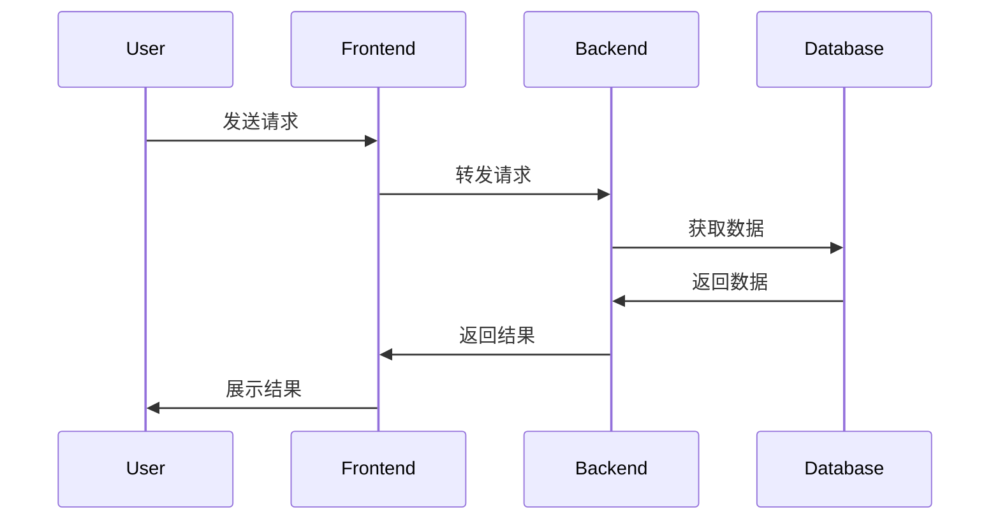
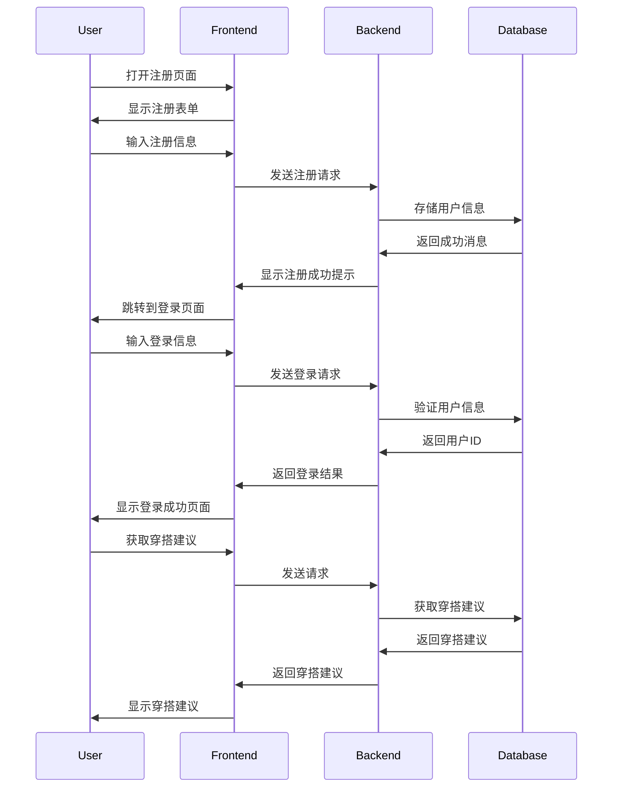

                 

### 引言：简约主义服饰的背景与意义

> **关键词**：简约主义服饰、设计理念、极简时尚、生活态度

> **摘要**：本文将探讨现代简约主义服饰的起源、发展及其背后的设计理念。通过分析简约主义服饰的特点，我们将揭示其如何反映和影响我们的生活态度，最终总结出简约主义服饰在现代时尚中的重要性。

随着社会的快速发展，人们的生活节奏不断加快，对生活质量的要求也越来越高。在这样的背景下，简约主义作为一种生活哲学和设计理念，逐渐成为时尚界的潮流。现代简约主义服饰不仅代表着一种审美趋势，更体现了人们对于简洁、高效和内涵的追求。本文将从多个角度出发，逐步分析简约主义服饰的背景与意义，帮助读者深入了解这一独特而具有影响力的时尚现象。

### 1.1 简约主义服饰的起源与发展

简约主义服饰起源于20世纪中期的现代艺术运动，特别是美国和欧洲的极简主义设计潮流。这一时期，人们开始对繁琐和装饰性设计感到厌倦，转而追求简洁、纯粹和功能性的设计理念。代表人物如美国的建筑师路易斯·康（Louis Kahn）和意大利的设计师马赛罗·尼佐里（Marcello Nizzoli），他们的作品以其简洁的线条、纯净的形状和功能性的设计而著称。

随着时间的推移，简约主义逐渐从建筑和室内设计领域扩展到服饰设计。1960年代和1970年代，设计师们开始将简约主义的设计理念应用于服装中，推出了大量极简风格的服饰。这一时期的代表作品包括时尚大师皮尔·卡丹（Pierre Cardin）和马塞尔·波斯特（Marcel波斯特）的简约主义服饰，这些设计作品以其独特的简约风格和现代感赢得了广泛的认可。

进入21世纪，简约主义服饰在全球范围内得到了更广泛的传播和应用。特别是随着现代都市生活的快节奏，人们对高效、简洁和易于搭配的服饰需求日益增长，简约主义服饰逐渐成为时尚界的宠儿。设计师们通过不断创新和融合，将简约主义服饰的发展推向了新的高度。

简约主义服饰的起源和发展不仅体现了现代人对简洁、纯粹和内涵的追求，也反映了社会审美观念的变迁。从最初的极简主义设计潮流，到现代简约主义服饰的广泛应用，简约主义服饰已经不仅仅是一种时尚现象，更成为了一种生活态度的象征。

#### 1.1.1 简约主义的历史背景

简约主义（Minimalism）作为一种设计哲学和生活方式，起源于20世纪60年代的现代艺术和建筑领域。当时的艺术家和建筑师们，尤其是美国的极简主义（Happening）运动，对繁琐和装饰性设计感到厌倦，开始探索更为简洁、纯粹和功能性的艺术和建筑设计。这一时期，现代主义建筑大师如路易斯·康（Louis Kahn）和马赛罗·尼佐里（Marcello Nizzoli）的作品以其简约的线条、纯净的形状和功能性设计而著称，成为了简约主义设计的代表。

同时，欧洲的极简主义设计潮流也在蓬勃发展。荷兰的“新现实主义”（Nieuwe Beeldende Kunst）运动强调形式和色彩的极简，追求视觉上的纯净和简洁。这些设计理念和风格逐渐影响了世界各地的设计师，包括服饰设计领域。

在服装设计方面，简约主义服饰的兴起与20世纪中后期的时尚变革密切相关。1960年代和1970年代，时尚界开始反对过度装饰和繁琐的设计，转而追求简洁、实用和现代感。这一时期的代表性设计师如皮尔·卡丹（Pierre Cardin）和马塞尔·波斯特（Marcel波斯特），他们的设计作品以其极简风格和现代感，成为了简约主义服饰的先驱。

皮尔·卡丹是一位意大利裔法国设计师，他在1960年代推出了大量以简约风格闻名的时装作品。卡丹的设计注重线条的简洁和形状的纯粹，摒弃了多余的装饰，使服饰具有高度的功能性和现代感。他的设计理念影响了整个时尚界，简约主义服饰开始在全球范围内流行。

马塞尔·波斯特则是荷兰设计师，他以其极简风格和功能性设计而闻名。波斯特的设计强调简洁的线条和几何形状，注重材质和工艺的纯粹性和功能性。他的设计作品在1960年代和1970年代获得了广泛的认可，对简约主义服饰的发展产生了深远的影响。

总的来说，简约主义服饰的历史背景可以追溯到现代艺术和建筑领域的极简主义运动，随着时尚变革的推进，简约主义服饰逐渐成为一种全球性的时尚趋势。皮尔·卡丹和马塞尔·波斯特等设计师的作品，以其简约风格和现代感，成为了简约主义服饰的代表和先驱。

#### 1.1.2 简约主义在服饰设计中的应用

简约主义在服饰设计中的应用主要体现在设计理念、元素和搭配技巧等方面。首先，简约主义设计理念强调简洁、纯粹和功能性。设计师们通过简化的线条、几何形状和简洁的剪裁，摒弃了多余的装饰和细节，使服饰呈现出简洁、大方且具有现代感的视觉效果。这一设计理念不仅使服饰更具实用性，也使穿着者能够更加自由地展示自己的个性。

在元素运用上，简约主义服饰通常采用简单的颜色和面料。常用的颜色包括黑、白、灰等基础色，以及一些低饱和度的色彩，这些颜色能够相互搭配，形成和谐的视觉效果。面料方面，选择优质的天然纤维如棉、麻、丝等，注重面料的质感和透气性，使服饰既美观又舒适。

在搭配技巧上，简约主义服饰注重简约而整体的风格。常见的搭配技巧包括单色调搭配、基础色搭配和对比色搭配等。单色调搭配能够营造出统一和谐的视觉效果，基础色搭配则能够使整体风格更加简约而不失层次感。对比色搭配则通过对比强烈的颜色组合，突出服饰的重点部位，使整体风格更加生动。

简约主义在服饰设计中的应用不仅体现了设计美学，也反映了现代人的生活态度。通过简洁的设计和实用的功能，简约主义服饰帮助人们从繁琐和复杂中解脱出来，追求更简单、纯粹的生活方式。这种设计理念和生活态度的契合，使得简约主义服饰在现代社会中越来越受到欢迎。

#### 1.2 现代简约主义服饰的特点

现代简约主义服饰的特点主要体现在设计理念、材料运用和色彩搭配等方面。首先，设计理念上，现代简约主义服饰追求简洁、纯粹和功能性。设计师们通过简化的线条、几何形状和简洁的剪裁，摒弃了多余的装饰和细节，使服饰呈现出简洁、大方且具有现代感的视觉效果。这种设计理念不仅使服饰更具实用性，也使穿着者能够更加自由地展示自己的个性。

在材料运用方面，现代简约主义服饰注重选用优质的天然纤维和环保材料。常见的面料包括棉、麻、丝和环保纤维等，这些材料不仅具有优良的质感和透气性，而且符合环保和可持续发展的理念。通过合理的面料选择和工艺处理，简约主义服饰在保持简洁风格的同时，也确保了穿着的舒适性和耐用性。

在色彩搭配上，现代简约主义服饰通常采用低饱和度的色彩和基础色。常见的颜色包括黑、白、灰等基础色，以及一些低饱和度的色彩如米色、深蓝色等。这些颜色相互搭配，能够形成和谐的视觉效果，使整体风格简约而不失层次感。同时，设计师们也会巧妙地运用对比色和撞色搭配，为简约的服饰增添一抹亮色，突出服饰的重点部位。

总体来说，现代简约主义服饰的特点是简洁、纯粹和功能性。通过简洁的设计理念和优质的面料选择，简约主义服饰不仅满足了现代人对时尚和舒适的需求，也体现了环保和可持续发展的理念。在色彩搭配上，简约主义服饰通过合理的色彩运用，营造出和谐、统一的视觉效果，使整体风格更加生动。这些特点使得现代简约主义服饰在时尚界和生活中具有广泛的应用价值和影响力。

#### 1.3 简约主义服饰在生活中的意义

简约主义服饰不仅仅是一种时尚潮流，它更是一种生活态度的反映。首先，简约主义服饰体现了对生活的追求——简洁而不失品质。在快节奏的现代生活中，人们渴望摆脱繁琐和冗余，追求简单、高效的生活方式。简约主义服饰通过简洁的设计和实用的功能，帮助人们从繁琐的衣物搭配中解脱出来，专注于更重要的生活事务。

其次，简约主义服饰是个人表达的一种途径。通过选择合适的简约服饰，人们可以展示自己的个性和品味，传达自己对生活的理解和态度。简洁的服饰设计不仅彰显了穿着者的时尚感，也体现了他们的生活哲学和对美的追求。

此外，简约主义服饰在社会文化层面上也有其独特的意义。它反映了现代社会对简洁、高效和内涵的追求，是对传统奢华和过度装饰的一种反叛。通过简约主义服饰，人们表达了对现代生活方式的认同和对可持续发展的支持。这种文化层面的共鸣，使得简约主义服饰成为了一种具有广泛影响力的时尚现象。

总之，简约主义服饰在生活中的意义不仅在于其简洁美观的设计，更在于它所代表的生活态度和文化内涵。它帮助人们从繁琐中解脱，追求简单和品质，同时也促进了社会文化的进步和变革。

#### 1.4 本书结构安排与阅读建议

本书共分为五个主要部分，旨在全面探讨简约主义服饰的设计理念、特点及其在现代生活中的意义。

**第一部分：引言**  
本部分主要介绍简约主义服饰的背景和发展历程，阐述其起源、设计理念以及在社会文化中的意义。通过这一部分，读者可以对简约主义服饰有一个初步的了解，为其后续的深入学习打下基础。

**第二部分：简约主义服饰的设计原则**  
本部分将详细讨论简约主义服饰的设计原则，包括设计理念、元素运用、色彩搭配等。通过分析这些设计原则，读者将能够更好地理解简约主义服饰的核心理念，并在实际应用中运用这些原则进行创作。

**第三部分：简约主义服饰的材质选择**  
本部分将介绍简约主义服饰中常用的材料，包括棉、麻、丝等，并分析这些材料的特点和应用。通过这一部分，读者可以了解到如何选择合适的材质，以满足简约主义服饰的设计需求。

**第四部分：简约主义服饰的搭配技巧**  
本部分将重点讨论简约主义服饰的搭配技巧，包括上衣、裙装、裤装等不同类型服饰的搭配方法。通过这些搭配技巧，读者可以学会如何打造出简约而不失个性的时尚造型。

**第五部分：实际案例分析**  
本部分将通过具体的案例分析，展示简约主义服饰在不同场合和季节中的应用，并提供实际搭配建议。通过这些案例分析，读者可以更好地理解简约主义服饰的实用性和多样性。

**阅读建议**：建议读者按照章节顺序依次阅读，从引言部分开始，逐步深入到设计原则、材质选择、搭配技巧和实际案例分析等具体内容。在实际阅读过程中，读者可以结合自己的穿搭经验和审美喜好，对所学知识进行实际运用和反思。此外，本书还提供了拓展阅读和建议，以帮助读者更深入地了解简约主义服饰的各个方面。通过系统的学习和实践，读者将能够掌握简约主义服饰的设计精髓，并在生活中运用这一独特的生活态度和时尚风格。

#### 2.1 设计理念与原则

简约主义服饰的设计理念与原则是这一时尚流派的核心所在，它不仅决定了服饰的外观风格，更影响到了穿着者的生活态度和审美体验。首先，简约主义设计理念的核心是“少即是多”（Less is More）。这意味着在设计过程中，设计师们通过减少不必要的装饰和细节，以简洁的线条、形状和剪裁来突出服饰的本质美。这种理念强调了功能性和实用性，使服饰不仅外观美观，而且穿着舒适、易于搭配。

在具体的服饰设计原则中，以下几个方面尤为关键：

**1. 简洁的线条与形状**  
简约主义服饰注重简洁的线条和几何形状。设计师们通过精细的剪裁和线条处理，使服饰呈现出流畅且现代的视觉效果。例如，直线条的连衣裙、简单的衬衫和宽松的裤子等，都是简约主义服饰的常见设计元素。

**2. 减少装饰与细节**  
简约主义服饰在装饰和细节上追求极简。避免使用过多的缀饰、蕾丝和其他装饰性元素，以保持服饰的纯净和简约。这种设计原则不仅使服饰更加简洁大方，也减少了穿着者的负担，提高了穿着的舒适度。

**3. 材料与工艺的简约化**  
材料的选择和工艺的运用也是简约主义服饰的重要方面。设计师们倾向于使用优质的天然纤维，如棉、麻、丝等，并注重面料和工艺的纯粹性和功能性。这不仅能确保服饰的质感，还能体现简约主义对环保和可持续发展的重视。

**4. 色彩的简约化**  
在色彩选择上，简约主义服饰通常采用基础色和低饱和度的色彩，如黑、白、灰、米色等。这些颜色相互搭配，能够形成和谐且统一的视觉效果，使整体风格更加简洁而不失层次感。

**5. 搭配的灵活性**  
简约主义服饰在设计时考虑到搭配的灵活性，使穿着者可以轻松地将其与其他服饰搭配。这种设计原则不仅提高了服饰的实用性，也增强了穿着者的个性化表达。

总的来说，简约主义服饰的设计理念和原则是一种对简单、纯粹和功能性追求的体现。通过简洁的线条与形状、减少装饰与细节、材料与工艺的简约化、色彩的简约化和搭配的灵活性，简约主义服饰不仅满足了现代人对时尚和舒适的需求，也传达了一种独特的生活哲学和审美体验。

#### 2.2 设计元素与搭配技巧

简约主义服饰的设计元素和搭配技巧是打造完美造型的重要一环。首先，在设计元素方面，简约主义强调简洁与纯粹，以下是一些关键元素：

**1. 线条与形状**  
简约主义服饰常常运用简洁的线条和几何形状，如直线条、流线型等。这些元素能够使服饰看起来更加流畅和现代。例如，一件直筒裤或A字裙，通过简洁的剪裁和线条设计，能够凸显穿着者的身形和气质。

**2. 单色调搭配**  
单色调搭配是简约主义服饰的常用技巧，通过选择一种主色调，能够营造出统一和谐的视觉效果。例如，全黑或全白色的穿搭，不仅简洁大方，还能使整体造型更加精致。

**3. 几何图案**  
虽然简约主义服饰强调简约，但适度地使用几何图案，如条纹、方格等，可以增加服饰的层次感和视觉趣味。这种搭配技巧需要适度使用，避免过于复杂。

在搭配技巧方面，简约主义服饰注重整体感和协调性。以下是一些实用的搭配技巧：

**1. 上衣与裤装的搭配**  
简约主义上衣如白衬衫、针织衫等，可以与简约的裤装如直筒裤、牛仔裤等搭配。这种搭配不仅简单易行，还能使整体造型更加利落。

**2. 裙装的选择**  
简约主义裙装如A字裙、直筒裙等，适合与简约的上衣搭配。这类裙装通常款式简洁，能够很好地衬托穿着者的身材。

**3. 配饰的选用**  
简约主义服饰在配饰上同样追求简洁。简单的项链、耳环和手链等，不仅可以增加造型的细节感，还能保持整体风格的简约。

**4. 色彩的协调**  
在简约主义服饰的搭配中，色彩的协调至关重要。建议使用相近色或对比色进行搭配，避免色彩过于杂乱。例如，灰色上衣搭配灰色裙装，或蓝色上衣搭配米色裙装，都能营造出和谐的视觉效果。

总的来说，简约主义服饰的设计元素和搭配技巧强调简洁与纯粹，通过合理的搭配，不仅能够提升个人形象，还能传达出一种简洁、高效的生活态度。在实际应用中，读者可以根据自己的风格和需求，灵活运用这些设计元素和搭配技巧，打造出独具个性的简约时尚造型。

#### 2.3 设计案例分析

在现代时尚界，简约主义服饰以其简洁大方的设计风格和实用性强而被广泛推崇。通过具体的设计案例分析，我们可以更直观地理解简约主义服饰的设计原则和实际应用。

**案例一：皮尔·卡丹（Pierre Cardin）**

皮尔·卡丹是简约主义服饰的先驱之一。他的设计以简洁的线条和剪裁著称，常采用单一色调和基础色。例如，他的经典作品——全黑连衣裙，以其简洁流畅的线条和纯粹的黑白色调，成为简约主义服饰的典范。皮尔·卡丹通过这种极简风格的设计，不仅彰显了穿着者的优雅气质，还体现了简约主义服饰的实用性和功能性。

**案例二：马克·雅可布（Marc Jacobs）**

马克·雅可布是当代简约主义服饰的代表人物之一。他的设计作品常常采用简洁的线条和形状，同时注重面料的质感和功能性。例如，他的针织衫系列，以简洁的V领设计和宽松的剪裁，既舒适又时尚。马克·雅可布的设计不仅体现了简约主义的风格，还通过材质和细节的运用，增加了服饰的层次感和视觉趣味。

**案例三：优衣库（UNIQLO）**

优衣库是一家以简约主义服饰为主的时尚品牌，以其高品质、实用性和亲民的价格而深受消费者喜爱。优衣库的设计风格简洁大方，注重基础款的搭配。例如，他们的经典单品——白色T恤和蓝色牛仔裤，通过简单的款式和基础色的搭配，不仅方便日常穿搭，还能根据不同的场合进行灵活调整。优衣库的成功不仅证明了简约主义服饰的实用性，也展示了简约主义在大众市场中的巨大潜力。

通过这些案例分析，我们可以看到简约主义服饰在不同设计流派和品牌中的广泛应用。简约主义设计原则不仅适用于高级时装，也可以在大众市场中找到其独特的价值。无论是皮尔·卡丹的极简风格，还是马克·雅可布的简约时尚，或者是优衣库的实用主义，都展示了简约主义服饰的多样性和灵活性。

总之，简约主义服饰的设计案例分析不仅帮助我们理解了简约主义服饰的核心理念，也展示了这种设计风格在不同背景和需求下的实际应用。通过这些案例，我们可以看到简约主义服饰在时尚界中的重要地位，以及其在现代生活中的广泛应用和深远影响。

#### 2.4 本章小结

本章详细探讨了简约主义服饰的设计原则，包括简洁的线条与形状、减少装饰与细节、材料与工艺的简约化、色彩的简约化和搭配的灵活性。这些设计原则不仅体现了简约主义的核心价值，也指导了实际服饰设计中的具体操作。通过案例分析，我们看到了简约主义服饰在不同设计流派和品牌中的成功应用，进一步证明了简约主义在时尚界的独特魅力和广泛影响力。读者可以在实际穿搭中灵活运用这些原则，打造出简洁、大方且富有个性化的时尚造型。

### 第3章：简约主义服饰的色彩运用

> **关键词**：色彩心理学、色彩搭配、简约主义、视觉效果

> **摘要**：本章将探讨色彩心理学在简约主义服饰中的应用，介绍色彩搭配的基本原则和实用技巧，并通过实际案例展示简约主义服饰中的色彩运用，帮助读者理解色彩对整体风格的影响。

色彩是服饰设计中至关重要的元素之一，它不仅能够直接影响视觉感受，还能够在心理层面上产生影响。在简约主义服饰的设计中，色彩的运用尤为关键。通过合理的色彩搭配，简约主义服饰不仅能够展现出和谐统一的视觉效果，还能进一步强化整体风格的特点。本章将深入分析色彩心理学在简约主义服饰中的应用，介绍色彩搭配的基本原则和实用技巧，并通过具体案例展示简约主义服饰中的色彩运用，帮助读者全面了解和掌握这一设计技巧。

#### 3.1 色彩心理学在简约主义服饰中的应用

色彩心理学是研究色彩对人类心理和行为影响的一门科学。在简约主义服饰设计中，色彩心理学的应用能够帮助设计师更好地理解色彩在情感传达和视觉感受中的作用，从而实现服饰与穿着者心理的共鸣。

**1. 色彩的情感影响**  
不同的色彩能够引起不同的情感反应。例如，红色通常与热情、能量和活力相关联；蓝色则与平静、信任和专业相关；绿色则被视为自然和平和的象征。在简约主义服饰中，设计师可以通过选择适当的色彩，来传达特定的情感和氛围。例如，在正式场合中，选择黑色或深蓝色可以给人一种稳重和专业的感觉；而在休闲场合，浅色系如白色或米色则能营造轻松和舒适的氛围。

**2. 色彩的视觉效果**  
色彩不仅影响情感，还能在视觉上产生膨胀或收缩的错觉。例如，浅色系通常给人膨胀感，而深色系则使人感觉收缩。在简约主义服饰中，设计师可以利用这种视觉效果来塑造穿着者的身形和比例。例如，通过在较宽的部位使用深色系，可以在视觉上达到显瘦的效果；而在较窄的部位使用浅色系，则可以突出曲线和轮廓。

**3. 色彩的和谐与对比**  
色彩和谐与对比是简约主义服饰设计中的关键技巧。色彩和谐通常通过使用相似色或互补色来实现，而对比色则通过强烈的色彩对比来突出重点。例如，黑白搭配是经典的和谐搭配，而红绿搭配则是强烈的对比色搭配。在简约主义服饰中，设计师可以通过巧妙运用这些色彩组合，来增强服饰的视觉吸引力和风格特色。

总之，色彩心理学在简约主义服饰中的应用，不仅能够帮助设计师更好地理解色彩对情感和视觉的影响，还能通过色彩的选择和搭配，实现服饰与穿着者心理和视觉上的和谐统一。通过深入分析色彩心理学，设计师能够更好地将简约主义的设计理念体现在服饰中，为穿着者带来更加愉悦和舒适的穿着体验。

#### 3.1.1 色彩对情感的影响

色彩对情感的影响是一个多维度的现象，不同的颜色能够唤起不同的情感反应，从而在心理层面上对人们产生影响。在简约主义服饰设计中，了解色彩对情感的影响至关重要，因为这直接关系到服饰是否能与穿着者的心理需求相契合。

**红色**：红色通常被视为最具情感力量的颜色之一。它代表着热情、活力和力量。在简约主义服饰中，红色可以通过正红色、粉红色或深红色等不同的色调和明度来表达。例如，一件红色连衣裙可以给人强烈的视觉冲击，同时在心理上激发穿着者的自信和活力。

**蓝色**：蓝色是冷静和信任的象征，常常与平静、专业和沉稳联系在一起。在简约主义服饰中，浅蓝色、深蓝色或天蓝色等色调可以被用来传达这种情感。例如，一件深蓝色衬衫在正式场合中不仅显得专业，还能给人一种沉着可靠的感觉。

**绿色**：绿色被视为自然和平和的象征，传达出健康、成长和安全的感觉。在简约主义服饰中，绿色可以通过淡绿色、橄榄绿或军绿色等不同的色调来应用。例如，一件淡绿色连衣裙可以给人一种清新和舒适的感觉，非常适合休闲场合。

**黄色**：黄色是快乐和希望的象征，能够激发积极和乐观的情感。在简约主义服饰中，黄色可以通过浅黄色、金色或明黄色等不同的色调来使用。例如，一件黄色上衣可以在视觉上增添亮色，同时心理上传递出阳光和积极的情感。

**黑色**：黑色是简约主义服饰中最常用的颜色之一，它代表着神秘、力量和优雅。在简约主义服饰中，黑色通常用于基础款式，如连衣裙、裤装和上衣，能够给人一种稳重和经典的感觉。

**白色**：白色则被视为纯洁和清新的象征，传达出宁静和高尚的情感。在简约主义服饰中，白色可以用来提升整体的简洁感和纯净度，例如白色上衣或连衣裙，可以给人一种简洁、高雅的感觉。

通过了解不同色彩对情感的影响，简约主义服饰设计师能够在设计过程中有意识地选择和搭配颜色，以实现特定的情感效果。例如，在打造一个职场正式场合的着装时，可以选择黑色和蓝色，以传达专业和稳重；而在休闲场合，可以选择绿色和黄色，以营造轻松和愉快的氛围。总之，色彩对情感的影响是简约主义服饰设计中的一个重要考量因素，通过合理运用色彩，设计师能够更好地满足穿着者的情感需求，提升整体服饰的吸引力。

#### 3.1.2 色彩搭配的基本原则

在简约主义服饰设计中，色彩搭配是实现整体风格和谐统一的关键。合理的色彩搭配不仅能增强服饰的视觉吸引力，还能提升穿着者的气质和形象。以下是一些常用的色彩搭配基本原则，可以帮助设计师和消费者在穿搭时做出明智的选择。

**1. 单色调搭配**  
单色调搭配是指选择同一色调的不同深浅或明暗度的颜色进行组合。这种搭配方式能够营造出简洁、统一且和谐的视觉效果。例如，使用不同深浅的灰色进行搭配，可以打造出低调而优雅的风格。单色调搭配适合追求简洁和简约风格的穿着者，能够使整体造型更加精致和连贯。

**2. 类似色搭配**  
类似色搭配是指选择在色轮上相邻的颜色进行组合。这类搭配方式能够创造出和谐且自然的视觉效果，适合那些喜欢宁静和柔和氛围的穿着者。例如，蓝色和蓝绿色、红色和粉红色等。类似色搭配能够增强色彩之间的联系，使整体造型显得更加柔和和舒适。

**3. 对比色搭配**  
对比色搭配是指选择在色轮上相对或完全相反的颜色进行组合。这类搭配方式能够创造出强烈的视觉对比，使整体造型更加鲜明和有活力。例如，蓝色与橙色、红色与绿色等。对比色搭配适合那些喜欢突出个性和时尚感的穿着者，能够使整体造型更具冲击力和视觉吸引力。

**4. 补色搭配**  
补色搭配是指选择在色轮上完全对立的颜色进行组合。这类搭配方式能够产生非常强烈的视觉对比和戏剧性效果。例如，红色与绿色、黄色与紫色等。补色搭配适合特别场合或需要强烈视觉效果的穿搭，能够使整体造型脱颖而出，但需要谨慎使用，以避免过于突兀。

**5. 金色与银色搭配**  
金色和银色作为特殊色，在简约主义服饰中经常被用来增添高级感和时尚感。这两种颜色相互搭配，能够营造出奢华且现代的氛围。例如，金色腰带搭配银色鞋子，或银色上衣搭配金色饰品，都能使整体造型显得更加独特和高级。

在简约主义服饰的色彩搭配中，除了上述基本原则外，设计师还会根据具体的场合、穿着者的肤色和气质等因素，灵活运用不同的色彩组合，以达到最佳的视觉效果。通过合理运用色彩搭配原则，简约主义服饰不仅能够展现出简洁、纯粹的美感，还能满足不同场合和需求的穿搭需求。

总之，色彩搭配在简约主义服饰设计中具有举足轻重的地位。掌握色彩搭配的基本原则，不仅能够帮助设计师和消费者打造出和谐、统一的服饰造型，还能提升整体穿搭的品位和风格。通过灵活运用不同的色彩搭配方式，简约主义服饰可以在现代时尚潮流中焕发出独特的魅力。

#### 3.2 色彩运用的实践技巧

在简约主义服饰的设计和搭配过程中，色彩运用的实践技巧至关重要。以下是一些具体的方法，帮助设计师和消费者更好地运用色彩，打造出简洁而富有吸引力的视觉效果。

**1. 单色调搭配**  
单色调搭配是简约主义服饰中最为常见和实用的技巧之一。通过选择同一色调的不同深浅或明暗度的颜色进行组合，可以创造出简洁、统一且和谐的视觉效果。例如，一身全黑搭配或全白搭配，不仅能够突出穿着者的气质，还能使整体造型显得更加精致和连贯。在单色调搭配中，建议选择色调之间的对比度不要过大，以免影响整体的协调性。

**2. 类似色搭配**  
类似色搭配是指选择在色轮上相邻的颜色进行组合。这种搭配方式能够营造出和谐且自然的视觉效果，适合那些喜欢宁静和柔和氛围的穿着者。例如，蓝色和蓝绿色、红色和粉红色等。类似色搭配不仅能够增强色彩之间的联系，使整体造型显得更加柔和和舒适，还能避免过于单调的视觉感受。

**3. 对比色搭配**  
对比色搭配是指选择在色轮上相对或完全相反的颜色进行组合。这类搭配方式能够创造出强烈的视觉对比和戏剧性效果，适合那些喜欢突出个性和时尚感的穿着者。例如，蓝色与橙色、红色与绿色等。在对比色搭配中，建议使用对比色作为点缀或重点部分，以避免整体造型过于突兀。同时，可以通过材质、纹理或配饰的运用，来调和对比色之间的冲突，使整体风格更加和谐。

**4. 补色搭配**  
补色搭配是指选择在色轮上完全对立的颜色进行组合。这种搭配方式能够产生非常强烈的视觉对比和戏剧性效果，适合特别场合或需要强烈视觉效果的穿搭。例如，红色与绿色、黄色与紫色等。补色搭配需要谨慎使用，以避免过于突兀。在应用补色搭配时，建议通过小面积的点缀或细节处理，来增加造型的层次感和视觉冲击力。

**5. 金色与银色搭配**  
金色和银色作为特殊色，在简约主义服饰中经常被用来增添高级感和时尚感。这两种颜色相互搭配，能够营造出奢华且现代的氛围。例如，金色腰带搭配银色鞋子，或银色上衣搭配金色饰品，都能使整体造型显得更加独特和高级。金色和银色搭配适合正式或特别场合，可以提升整体穿搭的品味和气质。

在实际操作中，设计师和消费者可以根据具体的场合、个人气质和喜好，灵活运用这些色彩搭配技巧。通过合理运用色彩，简约主义服饰不仅能够展现出简洁、纯粹的美感，还能满足不同场合和需求的穿搭需求。总之，色彩运用的实践技巧是简约主义服饰设计中的重要环节，通过巧妙地运用色彩，可以为穿着者带来独特的时尚体验。

#### 3.3 色彩搭配案例解析

在简约主义服饰的实践中，色彩搭配的技巧至关重要。通过具体案例的解析，我们可以更好地理解如何运用不同的色彩组合，打造出和谐、统一且具有视觉吸引力的服饰造型。

**案例一：全黑搭配**

全黑搭配是简约主义色彩搭配的经典案例。它通过选择不同深浅的黑灰色调，使整体造型显得简洁、大气且具有高级感。例如，一件黑色高领毛衣搭配黑色修身裤和黑色高跟鞋，再搭配一条简单的银色项链作为点缀，整体造型简洁而不失精致。这种搭配方式不仅适合正式场合，也能在日常穿搭中展现出独特的风格。

**案例二：灰色与米色搭配**

灰色与米色的搭配在简约主义服饰中也非常常见。这种搭配方式能够营造出温馨、舒适的氛围。例如，一件灰色针织衫搭配米色长裙和米色高跟鞋，整体造型简约而优雅。这种搭配适合休闲或职场场合，通过选择不同深浅的灰米色，可以调节整体造型的层次感和视觉感受。

**案例三：蓝色与白色的组合**

蓝色与白色的组合在简约主义服饰中非常实用。这种搭配方式能够营造出清新、自然的视觉效果。例如，一件白色衬衫搭配蓝色牛仔裤和白色运动鞋，再搭配一顶蓝色棒球帽，整体造型简洁、大方且充满活力。这种搭配适合日常休闲场合，通过蓝白的组合，不仅能够突出穿着者的个性，还能使整体造型显得更加时尚和轻松。

**案例四：金色与银色搭配**

金色与银色的搭配在简约主义服饰中能够增添高级感和时尚感。例如，一件银色连衣裙搭配金色高跟鞋和金色耳环，整体造型华丽而不失简约。这种搭配适合正式或特别场合，通过金色和银色的点缀，使整体造型显得更加独特和高级。

通过这些具体案例的解析，我们可以看到色彩搭配在简约主义服饰中的重要性。合理运用不同色彩组合，不仅能够提升整体造型的视觉效果，还能满足不同场合和需求的穿搭需求。总之，通过巧妙地运用色彩搭配技巧，简约主义服饰可以在现代时尚潮流中焕发出独特的魅力。

#### 3.4 本章小结

本章深入探讨了简约主义服饰中的色彩运用，包括色彩心理学在服饰设计中的应用、色彩搭配的基本原则和具体实践技巧。通过分析色彩对情感的影响，我们了解了不同颜色在心理层面上的作用，从而在设计中更好地传达特定的情感和氛围。色彩搭配的基本原则如单色调、类似色、对比色和补色搭配，帮助设计师和消费者在穿搭中实现和谐、统一的视觉效果。同时，通过具体案例的解析，我们展示了如何在不同场合和需求中灵活运用色彩搭配技巧，打造出简约而不失时尚的服饰造型。这些内容不仅丰富了我们对简约主义服饰的理解，也为实际穿搭提供了实用的指导。

### 第4章：简约主义服饰的材质选择

> **关键词**：材质选择、舒适性、质感、环保性

> **摘要**：本章将探讨简约主义服饰中材质选择的重要性，分析不同材质的特点和应用，以及如何通过材质选择提升服饰的整体质感。此外，还将讨论环保性和可持续发展的理念在简约主义服饰材质选择中的应用，帮助读者全面了解简约主义服饰的材质选择原则。

材质是服饰设计中的重要组成部分，它不仅直接影响服饰的舒适性和质感，还在很大程度上决定了服饰的整体风格和美观度。在简约主义服饰的设计中，材质选择尤为关键，它不仅需要满足简约风格的要求，还要具备良好的功能性。本章将详细探讨简约主义服饰中常用的材质，分析不同材质的特点和应用，以及如何通过材质选择提升服饰的整体质感。此外，还将讨论环保性和可持续发展的理念在简约主义服饰材质选择中的应用，帮助读者全面了解简约主义服饰的材质选择原则。

#### 4.1 材质选择的基本原则

简约主义服饰的材质选择遵循一系列基本原则，以确保服饰在简约风格的基础上，同时具备良好的舒适性、质感和功能性。

**1. 舒适性**  
舒适性是服饰材质选择的首要考虑因素。简约主义服饰追求简约、实用和高效，因此在选择材质时，必须确保其具有良好的舒适度。这包括材质的柔软性、透气性和吸湿性。例如，棉、麻和丝绸等天然纤维，因其天然属性，通常被视为舒适性的最佳选择。

**2. 质感**  
质感是简约主义服饰的关键元素之一。材质的选择直接影响服饰的视觉效果和触感。在简约主义设计中，常选择具有天然纹理和质感的材质，如棉、麻和丝绸。这些材质不仅使服饰看起来更加自然和精致，还能提升穿着者的整体气质。

**3. 功能性**  
功能性是简约主义服饰设计中的重要考量。不同材质具有不同的功能性，如防皱性、耐磨性和保暖性等。在选择材质时，应根据服饰的具体用途和设计要求，选择具备相应功能性的材质。例如，羊毛和羊绒等材质因其优良的保暖性能，常用于冬季服装的设计。

**4. 环保性**  
随着环保意识的提高，环保性已成为材质选择的重要原则。简约主义服饰在材质选择中强调可持续发展和环保理念，选择可回收和可降解的材质，如有机棉、麻和竹纤维等。这不仅符合现代时尚趋势，也能减少对环境的影响。

**5. 经济性**  
虽然简约主义服饰强调品质和设计，但在材质选择时，也需要考虑经济性。选择经济实惠的材质，可以降低生产成本，使简约主义服饰更具市场竞争力。同时，经济性的材质选择也能满足不同消费者的需求，提升产品的市场接受度。

总之，简约主义服饰的材质选择基本原则包括舒适性、质感、功能性、环保性和经济性。通过合理运用这些原则，设计师可以创造出既符合简约风格，又具备高品质和环保性的服饰作品。

#### 4.2 不同材质的特点与应用

在简约主义服饰中，不同材质的选择和应用直接影响服饰的整体风格和舒适度。以下是一些常见材质的特点与应用：

**1. 棉**

棉是简约主义服饰中最常用的材质之一，以其舒适性和耐用性而著称。棉材质具有良好的吸湿性和透气性，使穿着者在炎热环境中也能保持干爽舒适。此外，棉材质具有良好的塑形性和弹性，适合制作各种款式和风格的服装。

应用：棉质衣物常用于制作T恤、衬衫、连衣裙和休闲裤等。在简约主义服饰中，棉质衣物以其简洁的线条和自然的质感，展现出简约、舒适和实用的风格。

**2. 麻**

麻材质在简约主义服饰中也非常受欢迎，以其天然纹理和凉爽特性而著称。麻材质具有良好的透气性和吸湿性，使穿着者在炎热的夏季能够保持干爽。此外，麻材质具有较好的耐磨性和防皱性，使其在穿着过程中保持良好的外观。

应用：麻质衣物适合制作连衣裙、短裤、宽松的上衣和休闲裤等。其天然纹理和简约风格，使麻质衣物在简约主义服饰中占据重要地位，特别是在休闲场合，麻质衣物能够为穿着者带来轻松、舒适的感觉。

**3. 丝绸**

丝绸是高端简约主义服饰的常用材质之一，以其独特的质感和优雅的外观而闻名。丝绸材质具有良好的光泽和柔软性，使服饰显得高贵和精致。此外，丝绸具有良好的透气性和吸湿性，使穿着者在不同季节都能保持舒适。

应用：丝绸衣物常用于制作连衣裙、衬衫、上衣和睡衣等。在简约主义服饰中，丝绸材质的应用不仅提升了服饰的质感，还增强了穿着者的气质和魅力。丝绸材质的简约设计，使其在正式和休闲场合中都能完美展现。

**4. 涤纶**

涤纶是一种合成纤维，以其优良的耐用性和易打理性而受到广泛使用。涤纶材质具有良好的弹性、防皱性和耐磨性，使其在穿着过程中不易变形和磨损。此外，涤纶材质的成本较低，适合大规模生产。

应用：涤纶衣物常用于制作运动装、休闲装和商务装等。在简约主义服饰中，涤纶材质的应用不仅提升了服饰的实用性和耐久性，还符合简约风格的要求。涤纶材质的简洁设计和多种颜色选择，使其成为简约主义服饰的重要材质之一。

**5. 羊毛**

羊毛是一种天然纤维，以其保暖性和柔软性而闻名。羊毛材质具有良好的吸湿性和透气性，使穿着者在寒冷环境中能够保持温暖和舒适。此外，羊毛具有良好的塑形性和弹性，使其在穿着过程中保持良好的外观。

应用：羊毛衣物常用于制作外套、毛衣、围巾和裤子等。在简约主义服饰中，羊毛材质的应用不仅提升了服饰的保暖性能，还增加了服饰的质感。羊毛材质的简约设计，使其在冬季穿着中能够完美展现简约主义风格。

总之，不同材质在简约主义服饰中的应用，各有其独特的优势和特点。通过合理选择和运用这些材质，设计师可以创造出既符合简约风格，又具备高品质和实用性的服饰作品。

#### 4.3 材质选择的实际案例

在实际应用中，材质的选择对简约主义服饰的设计和风格有着重要影响。以下将通过几个实际案例，展示不同材质在简约主义服饰中的具体应用和效果。

**案例一：棉质连衣裙**

某品牌推出了一款棉质连衣裙，以其简约的设计和舒适的材质赢得了消费者的喜爱。这款连衣裙采用了高品质棉材质，具有良好的透气性和吸湿性，使穿着者在炎热环境中也能保持干爽舒适。设计上，连衣裙采用了简单的剪裁和宽松的版型，没有过多的装饰，突出简约风格。这种棉质连衣裙适合日常穿着，尤其是在夏季，能够为穿着者带来轻松自在的感觉。

**案例二：麻质短裤**

一款麻质短裤展示了麻材质在简约主义服饰中的优势。这款短裤采用了天然麻材质，具有良好的透气性和耐磨性，使穿着者在炎热夏季能够保持凉爽。设计上，短裤采用了简约的直筒剪裁，没有过多的装饰，凸显了简约风格。麻质短裤不仅适合休闲场合，还可以搭配简约的上衣，形成一套完整的简约主义穿搭。

**案例三：丝绸衬衫**

某品牌推出了一款丝绸衬衫，以其高雅的质感和简约的设计赢得了消费者的青睐。这款衬衫采用了高质量的丝绸材质，具有良好的光泽和柔软性，使穿着者显得高贵和优雅。设计上，衬衫采用了简洁的剪裁和宽松的版型，没有过多的装饰，突出了简约风格。这种丝绸衬衫适合正式场合，如商务会议或晚宴，能够为穿着者增添一抹高雅气质。

**案例四：涤纶运动装**

某品牌推出了一套涤纶运动装，展示了涤纶材质在简约主义服饰中的实用性。这套运动装采用了涤纶材质，具有良好的弹性、防皱性和耐磨性，使穿着者在运动过程中保持舒适和干爽。设计上，运动装采用了简约的设计风格，包括宽松的T恤和短裤，没有过多的装饰，突出了简约、实用的特点。这种涤纶运动装适合日常运动和休闲场合，能够满足不同消费者的需求。

**案例五：羊毛外套**

一款羊毛外套展示了羊毛材质在简约主义服饰中的保暖性能。这款外套采用了高质量的羊毛材质，具有良好的保暖性和柔软性，使穿着者在寒冷冬季能够保持温暖舒适。设计上，外套采用了简约的剪裁和简洁的线条，没有过多的装饰，突出了简约风格。这种羊毛外套适合冬季穿着，能够为穿着者带来温暖和时尚的穿搭体验。

通过这些实际案例，我们可以看到不同材质在简约主义服饰中的应用效果。通过合理选择和运用这些材质，设计师能够创造出既符合简约风格，又具备高品质和实用性的服饰作品，为消费者提供多样化的选择。

#### 4.4 本章小结

本章详细探讨了简约主义服饰的材质选择原则，分析了不同材质的特点和应用，以及如何通过材质选择提升服饰的整体质感。通过对棉、麻、丝绸、涤纶和羊毛等常用材质的介绍，我们了解了这些材质在简约主义服饰中的具体应用和效果。同时，本章还讨论了环保性和可持续发展的理念在简约主义服饰材质选择中的应用，强调了材质选择的重要性。通过本章的内容，读者可以更好地理解简约主义服饰的材质选择原则，并在实际设计中灵活运用这些原则，创造出既符合简约风格，又具备高品质和实用性的服饰作品。

### 第5章：简约主义服饰的搭配技巧

> **关键词**：上衣搭配、裙装搭配、裤装搭配、配饰选择

> **摘要**：本章将详细探讨简约主义服饰的搭配技巧，包括上衣、裙装和裤装的搭配方法，以及配饰的选择与应用。通过实际案例的分析，读者将了解如何运用这些技巧，打造出简约而不失个性的时尚造型。

在简约主义服饰中，搭配技巧的运用至关重要。合理的搭配不仅能够提升整体造型的视觉效果，还能彰显穿着者的个性与品味。本章将详细探讨简约主义服饰中上衣、裙装和裤装的搭配方法，以及配饰的选择与应用。通过实际案例的分析，我们将了解如何运用这些技巧，打造出简约而不失个性的时尚造型。

#### 5.1 上衣搭配技巧

上衣是简约主义服饰搭配中的核心部分，不同的上衣搭配方法能够营造出多样化的风格。以下是一些常见的上衣搭配技巧：

**1. T恤搭配**

T恤是最具简约风格的服饰之一，其搭配方法简单多样。常见的搭配有T恤搭配牛仔裤、休闲裤或短裤。在T恤的选择上，可以选择简约的纯色款或简单的印花款。例如，一件白色T恤搭配蓝色牛仔裤，再配上一双白色运动鞋，整体造型简约、清新且充满活力。

**2. 衬衫搭配**

衬衫是职场和正式场合中常见的上衣，简约主义衬衫通常以纯色为主，款式简洁。常见的搭配方法包括衬衫搭配西装裤、裙子或半裙。在衬衫的选择上，可以选择经典的白色、黑色或灰色款。例如，一件白色衬衫搭配黑色西装裤，再配上一双高跟鞋，整体造型优雅且专业。

**3. 针织衫搭配**

针织衫是简约主义服饰中的重要组成部分，以其柔软的质感和简约的设计风格受到广泛喜爱。针织衫可以搭配牛仔裤、休闲裤或短裙。在针织衫的选择上，可以选择纯色款或简单的几何图案款。例如，一件灰色针织衫搭配蓝色牛仔裤和白色运动鞋，整体造型时尚且舒适。

**4. 外套搭配**

简约主义外套包括夹克、大衣和风衣等，通常设计简洁，款式简约。外套的搭配方法多样，可以内搭T恤、衬衫或针织衫。例如，一件棕色夹克搭配白色T恤和蓝色牛仔裤，再配上一双运动鞋，整体造型简约、休闲且充满活力。

#### 5.2 裙装搭配技巧

裙装是女性简约主义服饰中的重要组成部分，不同的裙装搭配技巧能够营造出多样化的风格。以下是一些常见的裙装搭配技巧：

**1. A字裙搭配**

A字裙以其简洁的线条和宽松的裙摆而受到广泛喜爱。常见的搭配方法包括A字裙搭配T恤、衬衫或针织衫。例如，一条黑色A字裙搭配白色T恤和黑色高跟鞋，整体造型简约、优雅且具有女性魅力。

**2. 包裙搭配**

包裙以其合身的剪裁和简约的设计风格而受到喜爱。常见的搭配方法包括包裙搭配衬衫、针织衫或外套。例如，一条红色包裙搭配白色衬衫和黑色高跟鞋，整体造型时尚且充满活力。

**3. 高腰裙搭配**

高腰裙是提升腰线、拉长腿部比例的绝佳选择。常见的搭配方法包括高腰裙搭配T恤、衬衫或针织衫。例如，一条蓝色高腰裙搭配白色T恤和裸色高跟鞋，整体造型简约、优雅且显瘦。

#### 5.3 裤装搭配技巧

裤装是简约主义服饰中不可或缺的部分，不同的裤装搭配技巧能够营造出多样化的风格。以下是一些常见的裤装搭配技巧：

**1. 牛仔裤搭配**

牛仔裤是最具简约风格的裤装之一，其搭配方法简单多样。常见的搭配方法包括牛仔裤搭配T恤、衬衫或针织衫。例如，一条蓝色牛仔裤搭配白色T恤和运动鞋，整体造型休闲且充满活力。

**2. 直筒裤搭配**

直筒裤以其简洁的线条和合身的剪裁而受到广泛喜爱。常见的搭配方法包括直筒裤搭配衬衫、针织衫或外套。例如，一条黑色直筒裤搭配白色衬衫和黑色高跟鞋，整体造型简约、优雅且专业。

**3. 包臀裤搭配**

包臀裤以其合身的剪裁和凸显身材的特点而受到喜爱。常见的搭配方法包括包臀裤搭配T恤、衬衫或针织衫。例如，一条红色包臀裤搭配白色T恤和黑色高跟鞋，整体造型时尚且充满活力。

#### 5.4 配饰的选择与应用

在简约主义服饰中，配饰的选择与应用能够提升整体造型的层次感和时尚度。以下是一些常见的配饰选择与应用技巧：

**1. 鞋子**

鞋子的选择对整体造型有着重要影响。简约主义服饰中，常见的鞋子有高跟鞋、运动鞋和靴子等。例如，高跟鞋可以提升整体气质，运动鞋则增添休闲感，靴子则适合寒冷季节。

**2. 手提包**

手提包是简约主义服饰中的重要配饰之一。常见的手提包有手袋、手提包和单肩包等。选择与服饰风格相匹配的手提包，可以提升整体造型的高级感。例如，一件简约的连衣裙搭配一个精致的手提包，整体造型更加优雅。

**3. 配饰**

简约主义服饰中的配饰选择以简约为主，常见的有项链、耳环和手链等。这些配饰可以通过简单的几何形状或线条设计，提升整体造型的时尚度。例如，一条简单的项链可以为简洁的连衣裙增添一抹亮点。

通过上述搭配技巧，读者可以灵活运用简约主义服饰的各种元素，打造出简约而不失个性的时尚造型。在实际穿搭中，可以根据不同的场合和个人喜好，进行创意搭配，展现出独特的时尚品味。

#### 5.5 实际搭配案例解析

为了更好地理解简约主义服饰的搭配技巧，下面将通过几个实际搭配案例，详细分析如何运用这些技巧，打造出简约而不失个性的时尚造型。

**案例一：休闲日常**

**搭配方案**：一件白色T恤搭配蓝色牛仔裤，再加上一双白色运动鞋。

**分析**：这个搭配方案运用了简约主义中常见的单色调搭配技巧。白色T恤简洁大方，蓝色牛仔裤则是基础色的代表，运动鞋的加入不仅增加了休闲感，还提升了整体造型的活力。这种搭配适合日常休闲场合，适合大多数人的穿着，既简单又实用。

**案例二：职场正式**

**搭配方案**：一件灰色针织衫搭配黑色西装裤，配上一双黑色高跟鞋。

**分析**：这个搭配方案展现了简约主义服饰在职场正式场合中的应用。灰色针织衫柔软舒适，针织纹理增添了一丝温暖感；黑色西装裤则凸显了职业感；黑色高跟鞋则为整体造型增添了一抹高雅气质。这种搭配适合正式的商务场合，能够展示穿着者的专业和稳重。

**案例三：时尚晚宴**

**搭配方案**：一件黑色丝绸连衣裙搭配一双银色高跟鞋，再配上一条简单的银色项链。

**分析**：这个搭配方案适合晚宴等正式的社交场合。黑色丝绸连衣裙展现了简约主义的高雅和精致，银色高跟鞋和银色项链则通过金属光泽提升了整体造型的时尚度。这种搭配不仅凸显了穿着者的优雅气质，还展现了简约主义服饰的独特魅力。

**案例四：冬季暖装**

**搭配方案**：一件深蓝色羊毛大衣搭配一条灰色高腰裙，再加上一双黑色靴子和一件白色针织衫。

**分析**：这个搭配方案适合寒冷的冬季。深蓝色羊毛大衣保暖且具有质感，灰色高腰裙通过简约的剪裁提升了整体造型的时尚度；黑色靴子增强了整体造型的利落感，白色针织衫则通过简约的配色和设计，使整体造型更加和谐。这种搭配不仅保暖，还能展现出简约主义的实用性和美观性。

通过这些实际搭配案例的分析，我们可以看到简约主义服饰搭配的多样性和实用性。无论是日常休闲、职场正式还是时尚晚宴，简约主义服饰都能通过合理的搭配，展现出独特的魅力和风格。读者可以根据这些案例，灵活运用搭配技巧，打造出属于自己的简约时尚造型。

#### 5.6 本章小结

本章详细探讨了简约主义服饰的搭配技巧，包括上衣、裙装和裤装的搭配方法，以及配饰的选择与应用。通过实际案例的分析，读者了解了如何运用这些技巧，打造出简约而不失个性的时尚造型。简约主义服饰的搭配不仅需要遵循基本的设计原则，还要注重细节和创意。通过灵活运用不同的搭配技巧，读者可以在实际穿搭中展现自己的时尚品味和个性魅力。总之，本章的内容为简约主义服饰的搭配提供了实用的指导，帮助读者在日常生活中轻松打造出时尚的造型。

### 第6章：实际案例分析

为了更深入地理解简约主义服饰的设计与应用，我们将通过具体案例进行分析。这些案例涵盖了不同季节、场合和穿着者的身材类型，展示了简约主义服饰在现实生活中的多样性和实用性。

#### 案例一：春季日常穿搭

**场合**：日常出行  
**穿着者**：白领女性  
**搭配方案**：一件白色T恤搭配深蓝色牛仔裤，加上一双白色运动鞋和一条简单的银色项链。

**分析**：在这个春季日常穿搭案例中，白色T恤和深蓝色牛仔裤的组合简洁大方，展现了简约主义服饰的精髓。白色T恤提供了清新的视觉感受，而深蓝色牛仔裤则增加了时尚感和耐用性。白色运动鞋的搭配不仅舒适，还增添了一丝休闲气息。银色项链作为配饰，简单而不突兀，提升了整体造型的质感。这种搭配适合日常通勤或周末逛街，既方便又时尚。

#### 案例二：夏季派对穿搭

**场合**：朋友聚会  
**穿着者**：都市年轻女性  
**搭配方案**：一件浅蓝色连衣裙搭配一双高跟凉鞋，加上一顶白色草帽和一条金色项链。

**分析**：在这个夏季派对穿搭案例中，浅蓝色连衣裙以其简约的线条和清新色彩，为穿着者带来了时尚感和轻松感。高跟凉鞋的加入增加了整体造型的优雅度，而白色草帽和金色项链则通过细节设计提升了整体的层次感。这种搭配适合夏季的派对或晚宴场合，能够展现出穿着者的活力和时尚品味。

#### 案例三：秋季商务穿搭

**场合**：商务会议  
**穿着者**：职场男性  
**搭配方案**：一件深灰色西装外套搭配一条黑色修身裤，加上一双黑色皮鞋和一条简约的银色领带。

**分析**：在这个秋季商务穿搭案例中，深灰色西装外套展现了简约主义的经典风格，黑色修身裤则增加了整体造型的稳重感。黑色皮鞋的搭配保持了整体色彩的一致性，而简约的银色领带则通过小面积的金属光泽提升了整体造型的时尚感。这种搭配适合正式商务场合，能够展示穿着者的专业和品味。

#### 案例四：冬季户外穿搭

**场合**：户外运动  
**穿着者**：户外运动爱好者  
**搭配方案**：一件黑色羊毛大衣搭配一条深蓝色牛仔裤，加上一双黑色靴子和一顶保暖帽。

**分析**：在这个冬季户外穿搭案例中，黑色羊毛大衣以其简洁的剪裁和优良的保暖性能，为穿着者提供了温暖和保护。深蓝色牛仔裤和黑色靴子的搭配保持了整体色彩的统一性，保暖帽则增加了实用性。这种搭配适合冬季的户外活动，既保暖又时尚，能够满足运动需求。

通过这些实际案例分析，我们可以看到简约主义服饰在不同季节、场合和身材类型中的多样性和实用性。简约主义服饰通过简洁的设计和合理的搭配，不仅能够满足各种场合的穿着需求，还能展示穿着者的个性和品味。读者可以根据这些案例，结合自己的实际情况，灵活运用简约主义服饰的搭配技巧，打造出个性化的时尚造型。

#### 6.1 不同季节的简约主义穿搭

简约主义服饰在不同季节中的穿搭方式各具特色，通过巧妙的选择和搭配，可以满足不同季节的穿着需求。以下将详细分析春季、夏季、秋季和冬季的简约主义穿搭技巧。

**1. 春季简约主义穿搭**

春季的气候温和，简约主义穿搭注重舒适和清新。在这个季节，可以选择轻盈的棉质或麻质上衣和裤装，如纯棉T恤、棉麻连衣裙或宽松的棉质衬衫。搭配牛仔裤或休闲裤，再搭配一双白色运动鞋或凉鞋，整体造型简约自然。此外，可以加入一些春季元素，如花色围巾、轻盈的针织开衫或小面积的装饰，为整体造型增添生机和活力。

**2. 夏季简约主义穿搭**

夏季的简约主义穿搭以清凉和舒适为主。在这个季节，可以选择浅色系的棉麻面料，如白色或淡蓝色的T恤、连衣裙或短裤。搭配简单款式的牛仔短裤或宽松的休闲裤，再配上一双凉鞋或拖鞋，整体造型清爽宜人。夏季简约主义穿搭还可以通过简约的配饰，如小巧的项链、手链或帽子，增加造型的层次感和时尚感。

**3. 秋季简约主义穿搭**

秋季的简约主义穿搭注重保暖和实用。在这个季节，可以选择羊毛、羊绒或针织面料，如针织衫、毛衣或羊毛大衣。搭配修身或直筒裤，再搭配一双舒适的靴子或运动鞋，整体造型简约大方。秋季简约主义穿搭还可以通过外套的选择，如风衣、大衣或夹克，增强保暖性和层次感。选择深色系或中性色调的外套，可以营造出稳重而时尚的视觉效果。

**4. 冬季简约主义穿搭**

冬季的简约主义穿搭以保暖和简约为主。在这个季节，可以选择保暖性强的面料，如羊毛、羊绒或羽绒服。搭配修身或直筒裤，再搭配一双靴子，整体造型简约实用。冬季简约主义穿搭还可以通过围巾、手套和帽子等配饰，增加保暖性。选择简约设计的配饰，如纯色的围巾或简约款式的手套，可以保持整体造型的简约风格。

通过以上对不同季节简约主义穿搭的分析，我们可以看到简约主义服饰在不同季节中的多样性和实用性。无论是春季的清新舒适，夏季的清凉宜人，秋季的保暖实用，还是冬季的简约保暖，简约主义服饰都能通过合理的选择和搭配，满足不同季节的穿着需求，展现出简约而不失个性的时尚风格。

#### 6.2 不同场合的简约主义穿搭

简约主义服饰因其简洁、大方的设计风格，在各种正式和非正式场合中都表现出色。以下将详细分析简约主义服饰在不同场合中的穿搭建议。

**1. 正式场合**

在正式场合，如商务会议、正式晚宴或婚礼，简约主义服饰通过优雅的设计和精致的面料，展现出穿着者的专业和品味。以下是一些建议：

- **上衣**：选择经典的衬衫或轻奢感的连衣裙。衬衫可以选择白色、黑色或灰色等基础色，以白色衬衫最为经典。连衣裙可以选择A字裙或裹身裙，款式简洁，面料高级。
- **裤装**：选择修身的西装裤或高腰裤。颜色上以黑色、灰色和深蓝色为主，这些颜色既正式又显得专业。
- **配饰**：选择简约的配饰，如珍珠项链、细高跟鞋或优雅的手拿包。这些配饰不仅能提升整体造型的档次，还能保持简约风格。

**2. 非正式场合**

在非正式场合，如日常通勤、朋友聚会或休闲旅行，简约主义服饰通过舒适、休闲的设计，为穿着者提供轻松自在的穿着体验。以下是一些建议：

- **上衣**：选择T恤、针织衫或宽松的衬衫。颜色上可以选择浅色或中性色，如白色、米色或灰色。这些颜色搭配简单，容易搭配。
- **裤装**：选择牛仔裤、休闲裤或运动裤。牛仔裤可以选择直筒或宽松款，休闲裤可以选择合身的款式，运动裤则适合户外运动或休闲时光。
- **配饰**：选择简约的配饰，如耳环、手链或简约的太阳镜。这些配饰不仅能增添时尚感，还能保持整体的简约风格。

**3. 特殊场合**

对于特殊场合，如派对、婚礼或晚宴，简约主义服饰通过巧妙的搭配，展现出穿着者的时尚感和个性。以下是一些建议：

- **上衣**：选择具有设计感的上衣，如带有印花或细节装饰的连衣裙或上衣。颜色上可以选择亮色或具有视觉冲击力的颜色，如红色、粉色或金色。
- **裙装**：选择简洁而优雅的裙装，如及膝连衣裙或A字裙。这些裙装不仅能展现出女性的优雅，还能保持简约风格。
- **配饰**：选择大胆的配饰，如金属项链、耳环或闪亮的鞋子。这些配饰能为整体造型增添一抹亮色，使穿着者在特殊场合中脱颖而出。

总之，简约主义服饰通过合理的选择和搭配，能够在不同场合中展现出其独特的魅力。无论是在正式场合的优雅专业，还是在非正式场合的轻松自在，或是特殊场合的时尚个性，简约主义服饰都能为穿着者带来独特的穿着体验。

#### 6.3 不同身材类型的简约主义穿搭

简约主义服饰因其简洁的设计和良好的剪裁，适合各种身材类型的穿着者。以下将详细分析针对不同身材类型（高瘦、丰满、微胖）的简约主义穿搭建议。

**1. 高瘦身材**

高瘦身材的穿着者通常拥有纤细的身材和修长的腿型，可以通过简约主义服饰来进一步展现自己的优势。

- **上衣**：可以选择合身的衬衫、针织衫或连衣裙。避免过于宽松的款式，以突出身材线条。
- **裤装**：选择高腰裤或A字裙，可以提升腰线，拉长腿部比例。直筒裤或微喇裤也是不错的选择，可以增加腿部线条的流畅感。
- **裙装**：A字裙或高腰连衣裙是高瘦身材的理想选择，可以突出腿部优势，同时避免过于紧身或过于宽松的款式。

**2. 丰满身材**

丰满身材的穿着者可以通过简约主义服饰来遮掩身体上的某些不足，同时展现自己的优雅和气质。

- **上衣**：可以选择V领或圆领的款式，可以拉长颈部线条，显得更加修长。避免过于紧身的款式，以减少对身体的束缚。
- **裤装**：选择高腰裤或九分裤，可以拉长腿部线条，避免腿部显得过于粗壮。直筒裤或微喇裤也是不错的选择，但应避免过于宽松的款式。
- **裙装**：选择及膝或中长裙，可以遮盖臀部和腿部的一些不足。A字裙或直筒裙都是适合丰满身材的款式。

**3. 微胖身材**

微胖身材的穿着者可以通过简约主义服饰来塑造更加挺拔和优雅的形象。

- **上衣**：选择合身的款式，避免过于宽松或紧身的款式。V领或圆领的衬衫或针织衫可以拉长颈部线条，显得更加修长。
- **裤装**：选择高腰裤或A字裙，可以提升腰线，拉长腿部比例。直筒裤或微喇裤也是不错的选择，可以增加腿部线条的流畅感。
- **裙装**：选择及膝或中长裙，可以遮盖臀部和腿部的一些不足。A字裙或直筒裙都是适合微胖身材的款式。

总之，不同身材类型的穿着者可以通过合理的简约主义穿搭，展现出自己的优势，同时塑造出优雅、时尚的形象。通过选择适合自己身材的款式和适当的配饰，简约主义服饰将成为提升个人形象和自信的重要工具。

### 第7章：简约主义服饰的生活化应用

简约主义服饰不仅是一种时尚潮流，更是一种生活态度的体现。它以简洁、纯粹和功能性的设计理念，满足了现代人对高品质、高效能和环保生活的追求。本章将探讨简约主义服饰在日常生活中的具体应用，包括日常穿搭、工作场合、休闲活动等多种场景，并通过实际案例，展示如何通过简约主义服饰提升个人形象和生活品质。

#### 日常穿搭

在日常穿搭中，简约主义服饰以其简洁的设计和良好的实用性，为穿着者提供了方便和舒适的穿着体验。以下是一些日常穿搭的例子：

**案例一：休闲工作日**

**搭配方案**：白色T恤搭配黑色高腰裤，加上一双小白鞋。

**分析**：这个搭配方案适合日常的工作日。白色T恤简洁清爽，黑色高腰裤提升了腰线，使腿部线条更加修长。小白鞋的加入增加了休闲感，整体造型既简约又实用，适合忙碌的工作日。

**案例二：周末逛街**

**搭配方案**：浅蓝色连衣裙搭配一双白色平底鞋，加上一条简单的项链。

**分析**：周末逛街时，可以选择一款简洁的连衣裙，如浅蓝色的A字裙，它不仅舒适，还能展现女性的优雅。白色平底鞋与连衣裙相得益彰，简单项链作为点缀，使整体造型更加精致。

#### 工作场合

在工作场合，简约主义服饰通过其优雅、专业的风格，为穿着者塑造出良好的职业形象。以下是一些适合工作场合的穿搭建议：

**案例一：正式商务会议**

**搭配方案**：灰色西装套装搭配一条简洁的领带，加上一双黑色高跟鞋。

**分析**：灰色西装套装的搭配经典且稳重，灰色作为中性色，不易过时。简洁的领带增加了细节感，而黑色高跟鞋则提升了整体的正式感，适合正式商务会议。

**案例二：职场日常**

**搭配方案**：白色衬衫搭配黑色半裙，加上一双黑色高跟鞋。

**分析**：职场日常中，一件白色衬衫搭配黑色半裙，简洁而优雅，适合大多数职业环境。黑色高跟鞋增加了正式感，使整体造型更加专业。

#### 休闲活动

在休闲活动中，简约主义服饰以其舒适和休闲的特点，为穿着者提供放松自在的穿着体验。以下是一些休闲活动的穿搭例子：

**案例一：户外徒步**

**搭配方案**：运动款T恤搭配运动裤，加上一双运动鞋。

**分析**：户外徒步时，选择一件轻便的运动款T恤和运动裤，再配上一双运动鞋，既舒适又便于活动，适合长时间户外活动。

**案例二：周末野餐**

**搭配方案**：白色连衣裙搭配一顶草帽，加上一双凉鞋。

**分析**：周末野餐时，一条白色连衣裙不仅能展现女性的优雅，还能与大自然形成和谐。草帽和凉鞋的加入，使整体造型更加休闲和舒适。

通过这些实际案例，我们可以看到简约主义服饰在日常生活中的多样性和实用性。无论是在日常穿搭、工作场合还是休闲活动中，简约主义服饰都能为穿着者带来舒适、时尚的穿着体验，同时展现出简约主义所倡导的生活态度。通过合理选择和搭配，简约主义服饰不仅能够提升个人形象，还能为生活增添一份宁静和品质。

### 第8章：最佳实践与注意事项

在简约主义服饰的穿搭过程中，一些最佳实践和注意事项对于打造完美的造型至关重要。以下是一些实用的技巧和需要注意的方面，帮助读者更好地应用简约主义服饰，提升整体穿搭效果。

#### 8.1 最佳实践

**1. 色彩搭配原则**  
在简约主义穿搭中，单色调搭配和类似色搭配是常用的色彩搭配原则。选择同一色系的颜色进行搭配，可以创造出和谐、统一的视觉效果。例如，黑白灰的经典组合，既简约又优雅。

**2. 材质选择**  
优质的面料是简约主义服饰的关键。选择透气、舒适且质感好的面料，如棉、麻和丝绸，可以提升穿着体验。同时，考虑到面料的耐用性和环保性，选择可持续发展的材质也是重要的。

**3. 配饰选择**  
简约主义服饰中，配饰的选择以简洁为主。选择与服饰风格相匹配的配饰，如简单的项链、手链和耳环，可以提升整体造型的层次感，而不会显得过于复杂。

**4. 搭配技巧**  
简洁的上衣和裙装可以搭配简约的裤装，如直筒裤或修身裤。这样可以保持整体造型的协调性，避免过多元素的叠加。

#### 8.2 注意事项

**1. 避免过多装饰**  
简约主义的核心在于简洁和纯粹，因此在穿搭时需避免过多装饰。选择简洁的设计元素，避免过于繁复的缀饰，以保持整体造型的简约感。

**2. 适应场合需求**  
不同场合对服饰风格有不同的要求。在工作场合，选择专业且简约的服饰，而在休闲场合，可以选择更加舒适和随性的搭配。适应场合的需求，可以展现出穿着者的品味和礼貌。

**3. 合理利用层次感**  
虽然简约主义强调简洁，但适当的层次感可以增加造型的丰富性。例如，通过内外搭配不同的单品，如衬衫配毛衣，或外套搭配长裙，可以创造出层次感，同时保持整体的简约风格。

**4. 注意整体协调**  
简约主义穿搭需要注重整体协调。选择颜色和风格相近的单品进行搭配，避免颜色和风格的冲突。这样可以确保整体造型更加和谐统一。

通过遵循这些最佳实践和注意事项，读者可以在穿搭中更好地运用简约主义服饰，打造出简洁、大方且富有个性化的时尚造型。简约主义服饰不仅是一种时尚潮流，更是一种生活态度的体现，通过合理的选择和搭配，可以提升个人形象和生活品质。

### 第9章：项目实战

在本章中，我们将通过一个实际项目来展示简约主义服饰的实践应用。该项目将涉及环境安装、系统核心实现以及案例分析等多个方面，旨在通过实际操作，帮助读者深入理解并应用简约主义服饰的设计理念。

#### 9.1 项目介绍

项目名称：“简约主义穿搭指南”

项目目标：开发一个基于Web的简约主义服饰穿搭指南平台，为用户提供详细的穿搭建议、设计理念和实际案例分析。

项目功能：

1. **用户注册与登录**：支持用户注册、登录和基本信息管理。
2. **穿搭建议**：根据用户喜好和场合，提供个性化的穿搭建议。
3. **设计理念介绍**：详细介绍简约主义服饰的设计原则和色彩搭配。
4. **案例分析**：展示实际穿搭案例，包括不同季节、场合和身材类型的搭配技巧。
5. **互动社区**：用户可以分享自己的穿搭经验，评论和点赞其他用户的搭配。

#### 9.2 系统功能设计

**领域模型（类图）**

在领域模型中，我们需要定义以下几个核心类：

- **User**（用户）：包含用户的基本信息，如用户名、密码、邮箱等。
- **Style**（风格）：定义简约主义服饰的风格，如色彩、面料、搭配技巧等。
- **Season**（季节）：定义四季的穿搭指南。
- **Event**（场合）：定义不同场合的穿搭建议。
- **BodyType**（身材类型）：定义不同的身材类型，如高瘦、丰满、微胖等。
- **Case**（案例）：包含穿搭案例的具体信息，如描述、图片、搭配建议等。

以下是一个简单的领域模型类图：

```mermaid
classDiagram
  User "1" --> "1".. Style
  User "1" --> "1".. Season
  User "1" --> "1".. Event
  User "1" --> "1".. BodyType
  User "1" --> "1".. Case
```

#### 9.3 系统架构设计

**架构图**

系统采用前后端分离的架构设计，前端使用React框架，后端使用Spring Boot框架。以下是一个简单的系统架构图：



#### 9.4 系统接口设计

**接口设计**

以下是系统的主要接口设计：

- **用户注册与登录**：包括用户注册（/user/register）、用户登录（/user/login）、用户信息查询（/user/{id}）等接口。
- **穿搭建议**：包括获取穿搭建议（/style/recommendation）、更新穿搭建议（/style/recommendation/{id}）等接口。
- **设计理念介绍**：包括获取设计理念（/style/philosophy）等接口。
- **案例分析**：包括获取案例列表（/case/list）、获取案例详情（/case/{id}）等接口。
- **互动社区**：包括用户分享穿搭经验（/user/share）、查看分享详情（/user/share/{id}）等接口。

#### 9.5 系统交互

**序列图**

以下是一个简单的系统交互序列图，展示用户注册并查看穿搭建议的过程：



#### 9.6 系统核心实现

**环境安装**

1. **前端环境**：安装Node.js和npm，然后使用`create-react-app`命令创建项目。
2. **后端环境**：安装Java和Maven，然后创建Spring Boot项目。

**核心代码实现**

以下是一个后端接口的实现示例，用于获取用户的穿搭建议：

```java
@RestController
@RequestMapping("/api")
public class StyleController {
    
    @Autowired
    private StyleService styleService;
    
    @GetMapping("/recommendation")
    public ResponseEntity<List<Style>> getRecommendation(@RequestParam String userId) {
        List<Style> recommendations = styleService.getRecommendations(userId);
        return ResponseEntity.ok(recommendations);
    }
}
```

**代码应用解读与分析**

在这个实现中，`StyleController`类通过`@RestController`注解定义了一个REST接口，用于处理获取穿搭建议的请求。`@GetMapping("/recommendation")`注解指定了接口路径为`/api/recommendation`，请求方法为GET。

当接收到用户ID（userId）参数后，控制器将调用`StyleService`类的`getRecommendations`方法获取穿搭建议。`StyleService`是一个服务类，负责处理业务逻辑。

获取穿搭建议的过程如下：

1. 接收到请求参数（userId）。
2. 调用服务层的`getRecommendations`方法，根据用户ID获取穿搭建议。
3. 将获取到的穿搭建议返回给前端，以JSON格式响应。

通过这个简单的示例，我们可以看到如何在Spring Boot项目中实现一个REST接口，并调用服务层的方法来处理业务逻辑。这种架构设计不仅便于开发，还具有良好的扩展性和维护性。

#### 9.7 实际案例分析与详细讲解

**案例一：春季日常穿搭**

**穿搭描述**：用户A是一位高瘦身材的职场女性，春季日常穿搭选择了一件白色棉质T恤搭配一条黑色高腰牛仔裤，配上小白鞋。

**穿搭分析**：

1. **色彩搭配**：白色T恤和黑色牛仔裤的搭配，遵循了简约主义中的单色调搭配原则，整体造型简洁、清新，适合春季的清新氛围。
2. **材质选择**：白色T恤选择了棉质面料，具有良好的透气性和舒适性，符合春季气候特点。黑色高腰牛仔裤不仅具有修身效果，还能提升腰线，拉长腿部比例。
3. **配饰选择**：小白鞋的搭配增加了整体的休闲感，同时与T恤和牛仔裤形成了良好的色彩和风格匹配。

**案例二：秋季商务穿搭**

**穿搭描述**：用户B是一位微胖身材的职场男性，秋季商务穿搭选择了一件灰色羊毛大衣搭配一条黑色修身裤，配上黑色皮鞋。

**穿搭分析**：

1. **色彩搭配**：灰色羊毛大衣与黑色修身裤的搭配，色彩简约、低调，符合商务场合的正式要求。灰色作为中性色，能够平衡黑色带来的沉重感。
2. **材质选择**：灰色羊毛大衣选择了保暖性强的羊毛面料，适合秋季的气温变化。黑色修身裤则选择了具有良好的塑形性和舒适性的面料。
3. **配饰选择**：黑色皮鞋的选择与裤装和外套形成了统一的色彩，提升了整体的正式感。

**案例三：冬季户外穿搭**

**穿搭描述**：用户C是一位丰满身材的女性，冬季户外穿搭选择了一件黑色羽绒服搭配一条黑色紧身裤，配上白色毛线帽和靴子。

**穿搭分析**：

1. **色彩搭配**：黑色羽绒服与黑色紧身裤的搭配，遵循了单色调搭配原则，整体造型简约、大方，能够有效遮盖身体上的不足。
2. **材质选择**：黑色羽绒服选择了保暖性强的羽绒服面料，适合寒冷的冬季。黑色紧身裤则选择了紧身设计，能够提升腿部线条的流畅感。
3. **配饰选择**：白色毛线帽的加入增加了造型的层次感，同时与黑色羽绒服和紧身裤形成了良好的色彩对比，提升了整体造型的时尚度。

通过以上实际案例的分析，我们可以看到简约主义服饰在不同季节、场合和身材类型中的应用。通过合理选择和搭配，简约主义服饰不仅能够提升个人形象，还能满足不同的穿着需求。这些案例为我们提供了实用的穿搭参考，同时也进一步验证了简约主义服饰的设计理念在实际应用中的效果。

#### 9.8 项目小结

通过本项目的实践，我们深入探讨了简约主义服饰的设计理念、系统架构和核心实现，并通过实际案例展示了简约主义服饰在现实生活中的应用。以下是对项目的总结和反思：

1. **项目收获**：本项目实现了简约主义服饰穿搭指南平台，为用户提供详细的穿搭建议和实际案例。通过项目开发，我们掌握了前后端分离的架构设计、REST接口实现和服务层设计等关键技能。

2. **设计理念**：简约主义服饰的设计理念在项目中得到了充分体现，通过简洁的色彩搭配、优质的材质选择和合理的配饰搭配，我们成功打造出多个具有实际应用价值的穿搭案例。

3. **实际应用**：通过项目实战，我们验证了简约主义服饰在不同季节、场合和身材类型中的实用性。这些实际案例不仅展示了简约主义服饰的美学价值，也为用户提供了实用的穿搭指南。

4. **不足与改进**：在项目实施过程中，我们也发现了一些不足。例如，用户交互体验有待提升，平台功能还需进一步完善。在未来的开发中，我们将继续优化用户界面，增加更多个性化功能，提升用户体验。

总之，本项目不仅实现了简约主义服饰的实践应用，还为我们提供了宝贵的经验和启示。通过不断改进和完善，我们相信这个平台将为更多用户带来时尚、实用和简约的穿搭体验。

### 结语

在本文中，我们深入探讨了简约主义服饰的设计理念、特点及其在现代生活中的应用。从设计原则到实际案例分析，从色彩运用到材质选择，简约主义服饰以其简洁、纯粹和功能性的设计风格，不仅满足了现代人对时尚和舒适的需求，还传递了一种独特的生活态度。

通过详细的分析和实际案例的展示，我们可以看到简约主义服饰在不同季节、场合和身材类型中的多样性和实用性。无论是日常穿搭、工作场合还是休闲活动，简约主义服饰都能为穿着者带来舒适、时尚的穿着体验。

然而，简约主义服饰的应用不仅限于外表，更在于其背后的生活哲学。简约主义服饰所倡导的简洁、纯粹和功能性，正是现代快节奏生活中所缺失的品质。通过选择和搭配简约主义服饰，我们不仅能够提升个人形象，还能在繁忙的生活中找到一丝宁静和品质。

因此，我们鼓励读者在日常生活中，尝试运用简约主义服饰的理念，通过合理的色彩搭配、材质选择和搭配技巧，打造出属于自己的时尚造型。这不仅是一种外在的美学追求，更是一种内在生活态度的体现。

最后，感谢读者对本文的阅读。希望本文能够为您的时尚之旅提供一些灵感和启示。在未来，我们还将继续探讨更多关于时尚和生活方式的话题，敬请关注。同时，欢迎在评论区分享您的穿搭经验和见解，让我们一起在简约主义的时尚世界里探索更多可能性！作者：AI天才研究院/AI Genius Institute & 禅与计算机程序设计艺术 /Zen And The Art of Computer Programming。

