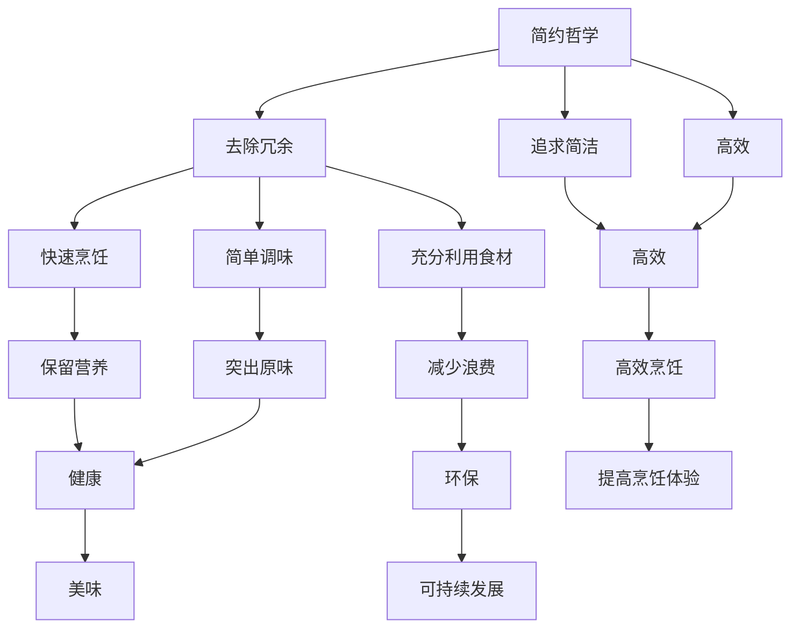

                 

### 引言

在现代快节奏的生活中，简约主义烹饪逐渐成为了一种时尚和潮流。它不仅追求食材的新鲜和烹饪的简单，更强调了健康、环保和可持续发展的理念。本文将以《现代简约主义烹饪：从食材到餐桌的极简哲学》为主题，深入探讨简约主义烹饪的起源、核心概念、食材选择、烹饪技巧、饮食哲学以及实践案例，帮助读者理解并实践这一极简哲学。

### 关键词

- **简约主义烹饪**
- **食材选择**
- **烹饪技巧**
- **饮食哲学**
- **环保**
- **可持续发展**

### 摘要

本文从现代简约主义烹饪的起源入手，介绍了其核心概念、食材选择和烹饪技巧。通过具体实践案例，探讨了简约主义烹饪的饮食哲学和环保意义，并总结了最佳实践。读者将了解到如何在日常生活中运用简约主义烹饪，实现健康、美味和环保的平衡。

### 背景介绍

#### 简约主义烹饪的起源与发展

简约主义烹饪起源于20世纪60年代的美国，随着人们对生活质量的追求，简约烹饪逐渐成为一种生活态度和哲学。它的核心理念是去除冗余，追求简洁和高效。在这个理念的影响下，许多厨师开始探索如何通过简单的烹饪方法，将食材的原味最大程度地呈现出来。

随着时间的推移，简约主义烹饪不仅在美国流行，也逐渐传播到世界各地。许多厨师和美食博主开始分享他们的简约烹饪心得和技巧，使得这一理念变得更加普及。尤其是在快节奏的现代生活中，简约主义烹饪因其方便快捷、健康美味的特点，受到了越来越多人的喜爱。

#### 简约主义烹饪的影响与价值

简约主义烹饪的影响和价值观主要体现在以下几个方面：

1. **健康与营养**：通过减少过多的油脂、糖分和调味料，简约烹饪有助于保持饮食的健康和营养。它鼓励人们多吃新鲜蔬菜、水果和粗粮，减少加工食品的摄入。

2. **环保与可持续发展**：简约烹饪倡导减少浪费，合理利用食材。这有助于减少食物浪费，降低对环境的负担，促进可持续发展。

3. **生活质量的提升**：简约烹饪不仅是一种烹饪方法，更是一种生活方式。它鼓励人们放慢脚步，享受烹饪和用餐的过程，提高生活品质。

#### 简约主义烹饪的核心概念

简约主义烹饪的核心概念包括简约哲学、极简烹饪技巧和饮食哲学。以下是这些核心概念的详细说明：

- **简约哲学**：简约哲学强调去除冗余，追求简洁和高效。在烹饪中，这意味着使用简单的方法和工具，减少复杂的步骤和材料。

- **极简烹饪技巧**：极简烹饪技巧包括快速烹饪、简单调味和充分利用食材。这些技巧不仅使烹饪过程更加高效，也能更好地保留食材的原味。

- **饮食哲学**：饮食哲学强调健康、美味和环保。通过合理搭配食材，实现营养均衡，同时减少对环境的负面影响。

### 简约哲学

简约哲学是简约主义烹饪的核心原则，它强调去除冗余，追求简洁和高效。在烹饪中，简约哲学体现在以下几个方面：

1. **去除冗余**：简约烹饪不追求华丽的装饰和复杂的步骤，而是注重食材本身的味道和营养。通过去除多余的调味料和烹饪步骤，可以让食材的原味更加突出。

2. **追求简洁**：简约烹饪强调使用简单的烹饪工具和方法。例如，蒸、煮、烤等简单的烹饪方式，不仅容易掌握，也能更好地保留食材的营养和口感。

3. **高效**：简约烹饪追求高效，这意味着在短时间内完成烹饪，减少等待和准备的时间。这不仅可以提高烹饪效率，也能让人们在忙碌的生活中轻松享受美食。

### 极简烹饪技巧

极简烹饪技巧是简约主义烹饪的重要组成部分，它们不仅使烹饪过程更加高效，还能更好地保留食材的原味。以下是一些常见的极简烹饪技巧：

1. **快速烹饪**：快速烹饪可以最大限度地保留食材的营养和口感。例如，蒸鱼只需几分钟，煮蔬菜只需几分钟，而烤肉也只需十几分钟。

2. **简单调味**：简单调味可以突出食材的原味。常用的调味料包括盐、胡椒、橄榄油和香草等，这些调味料不仅简单易得，还能为食物增添丰富的味道。

3. **充分利用食材**：在简约烹饪中，充分利用食材是非常重要的。例如，可以将蔬菜的叶子用于烹饪，将水果的皮用于调味，甚至可以将食材的残渣用于制作肥料。

### 饮食哲学

饮食哲学是简约主义烹饪的重要组成部分，它强调健康、美味和环保。以下是对饮食哲学的详细探讨：

1. **健康**：健康是饮食哲学的首要考虑。通过合理搭配食材，可以实现营养均衡，提高身体健康。例如，蔬菜富含维生素和矿物质，水果富含抗氧化物质，粗粮富含膳食纤维等。

2. **美味**：美味是饮食哲学的重要目标。通过简单的烹饪技巧，可以让食材的原味更加突出，使食物更加美味。例如，蒸鱼、煮蔬菜、烤肉等烹饪方式，都能让食材的原味得到充分体现。

3. **环保**：环保是饮食哲学的重要价值观。通过减少食物浪费，合理利用食材，可以减少对环境的负面影响。例如，选择当季食材、减少食物包装、合理储存食物等，都是环保饮食的具体实践。

### 食材选择

食材选择是简约主义烹饪的关键环节，正确的食材选择不仅能提高烹饪效率，还能确保食物的口感和营养价值。以下是如何选择适合简约烹饪的食材：

1. **新鲜**：新鲜是食材选择的首要标准。新鲜的食材口感更好，营养价值也更高。在购买食材时，应选择外观新鲜、无虫害的食材。

2. **当季**：当季食材不仅口感和营养价值更佳，而且价格也更实惠。例如，春季的新鲜蔬菜和水果，秋季的坚果和水果等。

3. **简单**：简单处理的食材更符合简约烹饪的理念。例如，蔬菜可以简单地切成块或片，肉类可以简单地切片或切块。

### 食材的处理方法

在简约主义烹饪中，食材的处理方法同样重要。以下是一些常用的食材处理方法：

1. **蔬菜的处理**：蔬菜通常需要去皮、去籽、切块或切片。在处理蔬菜时，应尽量保留其营养成分，避免过度处理。

2. **水果的处理**：水果通常需要洗净、去皮、切块或切片。在处理水果时，应尽量保留其果肉，以减少营养成分的流失。

3. **肉类的处理**：肉类通常需要洗净、切块或切片。在处理肉类时，应尽量去除多余的脂肪，以减少烹饪时间，提高口感。

### 烹饪技巧

简约主义烹饪的烹饪技巧强调快速、简单和高效。以下是一些常用的烹饪技巧：

1. **快速烹饪**：快速烹饪可以最大限度地保留食材的营养和口感。常用的快速烹饪方法包括蒸、煮、烤等。

2. **简单调味**：简单调味可以突出食材的原味。常用的调味料包括盐、胡椒、橄榄油和香草等。

3. **合理搭配**：合理搭配食材可以实现营养均衡，提高食物的口感。例如，蔬菜和肉类的搭配，水果和粗粮的搭配等。

### 实践案例

为了更好地理解简约主义烹饪，以下我们将通过两个实践案例来展示简约烹饪的具体应用。

#### 案例一：简易蔬菜沙拉

**食材准备**：

- 新鲜生菜：200克
- 番茄：1个
- 洋葱：半个
- 红椒：1个
- 芝麻：适量
- 橄榄油：适量
- 盐：适量
- 胡椒粉：适量

**烹饪过程**：

1. 将生菜洗净，切成小块。
2. 番茄洗净，切成小块。
3. 洋葱去皮，切成细丝。
4. 红椒去籽，切成细丝。
5. 将切好的蔬菜放入大碗中。
6. 加入适量的橄榄油、盐和胡椒粉，搅拌均匀。
7. 最后撒上芝麻，即可享用。

**成果展示**：

这款简易蔬菜沙拉不仅制作简单，而且营养丰富，口感清爽。它适合作为午餐或晚餐的配菜，既能满足口感，又能提供足够的营养。

#### 案例二：烤鸡胸肉配蔬菜

**食材准备**：

- 鸡胸肉：2块
- 胡萝卜：1根
- 菠菜：适量
- 洋葱：1个
- 蒜末：适量
- 盐：适量
- 胡椒粉：适量
- 橄榄油：适量

**烹饪过程**：

1. 鸡胸肉洗净，切成薄片。
2. 胡萝卜去皮，切成薄片。
3. 洋葱去皮，切成薄片。
4. 菠菜洗净，沥干水分。
5. 将切好的胡萝卜和洋葱放入碗中，加入蒜末、盐和胡椒粉，搅拌均匀。
6. 将鸡胸肉放入另一个碗中，加入橄榄油、盐和胡椒粉，搅拌均匀。
7. 将搅拌好的蔬菜铺在烤盘底部，将鸡胸肉放在蔬菜上。
8. 将烤盘放入预热至200度的烤箱中，烤15-20分钟，直到鸡胸肉熟透。
9. 取出烤盘，将菠菜铺在鸡胸肉上，即可享用。

**成果展示**：

这款烤鸡胸肉配蔬菜不仅营养均衡，而且制作简单。烤鸡胸肉香气四溢，搭配清新的蔬菜，口感鲜美，适合作为家庭晚餐或聚会菜品。

### 最佳实践与总结

在实践简约主义烹饪时，以下是一些最佳实践和注意事项：

1. **保持食材的新鲜**：新鲜食材是简约烹饪的基础，确保食材的新鲜度是关键。

2. **合理搭配食材**：合理搭配食材可以实现营养均衡，提高食物的口感。

3. **简化烹饪步骤**：简化烹饪步骤可以提高烹饪效率，减少时间和精力投入。

4. **充分利用调味料**：简单调味可以突出食材的原味，提高食物的口感。

5. **减少食物浪费**：在烹饪过程中，合理利用食材，减少浪费。

6. **定期清洁厨房**：保持厨房的清洁和整洁，有助于提高烹饪效率，减少健康风险。

### 小结

简约主义烹饪是一种追求健康、美味和环保的烹饪方式。通过简单的食材选择、烹饪技巧和调味方法，简约烹饪不仅能提供营养均衡的美食，还能提高生活品质。未来，随着人们对健康和生活品质的追求，简约主义烹饪将越来越受欢迎。

### 拓展阅读

1. **《简约主义烹饪：从食材到餐桌的极简哲学》**：本书详细介绍了简约主义烹饪的理论和实践，是了解简约烹饪的必备读物。

2. **《美食之简约主义》**：这本书通过大量的实践案例，展示了如何将简约主义烹饪应用到日常饮食中。

3. **《健康饮食指南》**：这本书提供了详细的饮食指导，包括如何选择健康的食材、如何搭配食物等。

### 作者信息

作者：AI天才研究院/AI Genius Institute & 禅与计算机程序设计艺术/Zen And The Art of Computer Programming

---

文章标题：现代简约主义烹饪：从食材到餐桌的极简哲学

关键词：简约主义烹饪、食材选择、烹饪技巧、饮食哲学、环保、可持续发展

摘要：本文从现代简约主义烹饪的起源和发展入手，深入探讨了其核心概念、食材选择、烹饪技巧、饮食哲学和实践案例。通过具体实例，展示了如何将简约主义烹饪理念应用到日常生活中，实现健康、美味和环保的平衡。读者将了解到简约主义烹饪的要点和实践技巧，以及如何在快节奏的生活中享受美食。文章末尾还提供了拓展阅读资源，供读者进一步学习。作者信息：AI天才研究院/AI Genius Institute & 禅与计算机程序设计艺术/Zen And The Art of Computer Programming## 第1章 背景介绍

简约主义烹饪作为一种新兴的烹饪理念，近年来在全球范围内逐渐流行起来。其核心理念在于去除冗余，追求简洁和高效，使烹饪过程更加轻松愉快，同时确保食物的健康和美味。本章节将详细介绍简约主义烹饪的起源、发展和影响，并探讨其核心概念。

### 1.1 简约主义烹饪的起源与发展

简约主义烹饪的起源可以追溯到20世纪60年代的美国。当时，人们的生活节奏加快，对健康和营养的需求增加，开始寻求一种更加简单、健康的烹饪方式。1961年，美国烹饪作家贝蒂·克罗克（Betty Crocker）出版了《Betty Crocker's New Picture Cookbook》，其中提出了“简易烹饪”的概念，这被视为简约主义烹饪的雏形。

随后，随着社会的不断发展，简约主义烹饪逐渐演变为一股强大的潮流。在70年代和80年代，简约主义烹饪在美国和其他西方国家得到了广泛传播。这一时期的代表人物包括朱莉娅·查尔德（Julia Child）、杰西·詹姆斯（Jesse James）和玛莎·斯图尔特（Martha Stewart）等。他们通过电视节目、书籍和杂志，向大众推广简约烹饪的理念和方法。

进入21世纪，简约主义烹饪在全球范围内得到了进一步的发展和普及。越来越多的人开始关注健康、环保和可持续发展，简约烹饪因其符合这些理念而备受青睐。同时，社交媒体和美食博客的兴起，也为简约烹饪提供了更广泛的传播渠道。许多厨师和美食爱好者开始分享他们的简约烹饪心得和技巧，使得这一理念变得更加普及。

### 1.2 简约主义烹饪的影响与价值

简约主义烹饪的影响和价值主要体现在以下几个方面：

1. **健康与营养**：简约主义烹饪强调使用新鲜食材，减少过多的油脂、糖分和调味料，有助于保持饮食的健康和营养。它鼓励人们多吃新鲜蔬菜、水果和粗粮，减少加工食品的摄入，从而降低患慢性疾病的风险。

2. **环保与可持续发展**：简约主义烹饪倡导减少浪费，合理利用食材。这有助于减少食物浪费，降低对环境的负担，促进可持续发展。同时，选择当地当季食材，减少运输和储存过程中的能源消耗，也有助于减少碳足迹。

3. **生活质量的提升**：简约主义烹饪不仅是一种烹饪方式，更是一种生活态度。它鼓励人们放慢脚步，享受烹饪和用餐的过程，提高生活品质。通过简单、高效的烹饪技巧，人们可以更加轻松地在家中烹饪出美味健康的食物。

### 1.3 简约主义烹饪的核心概念

简约主义烹饪的核心概念包括简约哲学、极简烹饪技巧和饮食哲学。以下是这些核心概念的详细说明：

1. **简约哲学**：简约哲学强调去除冗余，追求简洁和高效。在烹饪中，这意味着使用简单的方法和工具，减少复杂的步骤和材料。通过去除多余的调味料和烹饪步骤，可以更好地保留食材的原味，提高食物的口感和营养价值。

2. **极简烹饪技巧**：极简烹饪技巧包括快速烹饪、简单调味和充分利用食材。快速烹饪可以最大限度地保留食材的营养和口感，简单调味可以突出食材的原味，充分利用食材则有助于减少浪费，提高烹饪效率。

3. **饮食哲学**：饮食哲学强调健康、美味和环保。通过合理搭配食材，可以实现营养均衡，提高身体健康。同时，注重食材的新鲜和当季，有助于减少食物浪费，降低对环境的负面影响。

综上所述，简约主义烹饪是一种追求健康、美味和环保的烹饪方式。它通过去除冗余、追求简洁和高效，使烹饪过程更加轻松愉快，同时确保食物的营养价值和口感。随着人们对健康和生活品质的追求，简约主义烹饪将在未来得到更广泛的应用和发展。

### 核心概念与联系

简约主义烹饪的核心概念相互关联，构成了这一烹饪方式的精髓。下面我们将详细阐述这些核心概念，并使用Mermaid流程图展示它们之间的关系。

#### 2.1 简约哲学

简约哲学是简约主义烹饪的基石，其核心在于去除冗余，追求简洁和高效。它体现在以下几个方面：

1. **去除冗余**：在烹饪中，去除冗余意味着减少复杂的步骤和材料，简化烹饪过程。这不仅有助于提高烹饪效率，还能更好地保留食材的原味。

2. **追求简洁**：简洁的烹饪方法强调使用简单的工具和配方，避免繁琐的操作，从而减少烹饪时间，提高烹饪体验。

3. **高效**：高效是简约哲学的重要组成部分，通过快速烹饪和合理利用时间，使烹饪过程更加高效，让人们在忙碌的生活中也能轻松享受美食。

#### 2.2 极简烹饪技巧

极简烹饪技巧是实现简约哲学的关键手段。以下是一些常见的极简烹饪技巧：

1. **快速烹饪**：快速烹饪可以最大限度地保留食材的营养和口感。例如，蒸鱼、煮蔬菜和烤肉都是快速烹饪的方法。

2. **简单调味**：简单调味强调使用基本的调味料，如盐、胡椒、橄榄油等，以突出食材的原味。避免使用过多的调味料，可以使食物更加清新自然。

3. **充分利用食材**：在烹饪过程中，充分利用食材意味着不浪费任何可食用的部分，例如使用蔬菜叶、水果皮和肉骨等。

#### 2.3 饮食哲学

饮食哲学是简约主义烹饪的重要方面，它涵盖了健康、美味和环保三个方面：

1. **健康**：健康饮食强调摄入新鲜、营养丰富的食物，减少高热量、高脂肪和高糖分的食物摄入。通过合理搭配食材，实现营养均衡，提高身体健康。

2. **美味**：美味是饮食哲学的重要目标，通过简单的烹饪技巧，如快速烹饪和简单调味，可以提升食物的口感，使其更加美味。

3. **环保**：环保饮食注重减少食物浪费，合理利用食材，选择当地当季的食材，减少运输和储存过程中的能源消耗，降低对环境的负面影响。

#### 2.4 Mermaid流程图

以下是一个使用Mermaid绘制的流程图，展示了简约主义烹饪的核心概念及其相互关系：

通过这个流程图，我们可以清晰地看到简约哲学如何通过极简烹饪技巧和饮食哲学的具体实践，实现健康、美味和环保的目标。这些核心概念相互关联，共同构成了简约主义烹饪的独特魅力。

### 第3章 食材选择

食材选择是简约主义烹饪的基础，正确的食材选择不仅能提高烹饪效率，还能确保食物的口感和营养价值。在简约主义烹饪中，选择新鲜、当季、简单处理的食材尤为重要。以下是如何选择适合简约烹饪的食材以及食材的处理方法。

#### 3.1 选择适合简约烹饪的食材

1. **新鲜**：新鲜是食材选择的首要标准。新鲜的食材不仅口感更好，营养价值也更高。在购买食材时，应选择外观新鲜、无虫害的食材。例如，选择表面光滑、颜色鲜艳的蔬菜和水果，选择肉质鲜红、有光泽的肉类。

2. **当季**：当季食材不仅口感和营养价值更佳，而且价格也更实惠。选择当季食材，不仅有助于保持饮食的健康，还能减少食物浪费。例如，春季的新鲜蔬菜和水果，秋季的坚果和水果等。

3. **简单**：简单处理的食材更符合简约烹饪的理念。简单处理不仅节省时间，还能更好地保留食材的营养和口感。例如，蔬菜可以简单地切成块或片，肉类可以简单地切片或切块。

4. **多样化**：在食材选择上，尽量选择多样化的食材，以实现营养均衡。例如，蔬菜、水果、谷物、肉类和豆类的搭配，可以提供丰富的营养素。

#### 3.2 食材的处理方法

在简约主义烹饪中，食材的处理方法同样重要。以下是一些常用的食材处理方法：

1. **蔬菜的处理**：蔬菜通常需要去皮、去籽、切块或切片。在处理蔬菜时，应尽量保留其营养成分，避免过度处理。例如，将胡萝卜切成薄片，将土豆切成块状，将西兰花切成小朵。

2. **水果的处理**：水果通常需要洗净、去皮、切块或切片。在处理水果时，应尽量保留其果肉，以减少营养成分的流失。例如，将苹果切成块状，将香蕉切成片状，将橙子切成薄片。

3. **肉类的处理**：肉类通常需要洗净、切块或切片。在处理肉类时，应尽量去除多余的脂肪，以减少烹饪时间，提高口感。例如，将鸡肉切成薄片，将牛肉切成块状，将猪肉切成薄片。

4. **海鲜的处理**：海鲜需要洗净、去壳、去内脏。在处理海鲜时，应尽量保持其新鲜度，避免长时间浸泡。例如，将虾去壳去头，将螃蟹去壳去内脏。

5. **豆类的处理**：豆类需要提前浸泡，然后煮熟。在烹饪前，将豆类洗净，用温水浸泡几小时或过夜，然后煮熟。例如，将黄豆、黑豆和红豆等。

通过合理选择和恰当处理食材，我们可以在简约主义烹饪中充分发挥食材的优势，确保食物的口感和营养价值。这不仅使烹饪过程更加高效，也能让食物更加美味和健康。

### 第4章 烹饪技巧

在简约主义烹饪中，烹饪技巧扮演着至关重要的角色。这些技巧不仅有助于简化烹饪过程，还能最大程度地保留食材的原味和营养。以下是一些常见的烹饪技巧，包括快速烹饪、简单调味和充分利用食材。

#### 4.1 快速烹饪

快速烹饪是简约主义烹饪的核心技巧之一，它能够最大限度地保留食材的营养和口感。以下是一些快速烹饪的方法：

1. **蒸**：蒸是一种简单而健康的烹饪方法，可以保留食材的原味和营养成分。例如，蒸鱼、蒸蔬菜和蒸肉都是非常快速且美味的烹饪方式。

2. **煮**：煮是一种高效且简便的烹饪方法，适合烹饪各种蔬菜和肉类。例如，煮菠菜、煮鸡胸肉和煮豆类都是快速而健康的烹饪方式。

3. **烤**：烤是一种简单且易于掌握的烹饪方法，适合烹饪各种肉类和蔬菜。例如，烤鸡胸肉、烤蔬菜和烤海鲜都是快速而美味的烹饪方式。

#### 4.2 简单调味

简单调味是简约主义烹饪的另一个重要技巧，通过使用基本的调味料，可以突出食材的原味。以下是一些简单调味的方法：

1. **盐和胡椒**：盐和胡椒是最基本的调味料，可以增强食物的风味。在烹饪过程中，适量添加盐和胡椒，可以使食物更加美味。

2. **橄榄油**：橄榄油是一种健康的食用油，含有丰富的抗氧化物质，可以提升食物的口感。在烹饪过程中，适量使用橄榄油，可以增加食物的营养价值。

3. **香草和香料**：香草和香料可以为食物增添丰富的风味。例如，迷迭香、百里香、香葱和姜等，都是简单而有效的调味料。

#### 4.3 充分利用食材

在简约主义烹饪中，充分利用食材是减少浪费、提高效率的重要方法。以下是一些充分利用食材的方法：

1. **蔬菜叶的使用**：许多蔬菜的叶子含有丰富的营养成分，可以用于烹饪。例如，可以将菠菜叶用于炒菜或煮汤，将生菜叶用于做沙拉。

2. **水果皮的使用**：水果皮也富含营养成分，可以用于烹饪。例如，苹果皮可以用于煮汤或制作果酱，橙皮可以用于烤肉或煮汤。

3. **肉骨的使用**：肉骨可以用于煮汤或炖菜，增加食物的香气和口感。例如，鸡骨可以用于煮鸡汤，牛肉骨可以用于炖牛肉。

通过掌握这些烹饪技巧，我们可以在简约主义烹饪中更加高效地烹饪出美味健康的食物。这些技巧不仅简化了烹饪过程，还能保留食材的原味和营养，让我们的餐桌更加丰富多样。

### 第5章 饮食哲学

饮食哲学在简约主义烹饪中占据重要地位，它不仅关乎食物的选择和烹饪方式，还涉及健康、环保和可持续发展等多个方面。以下将详细探讨简约主义烹饪背后的饮食哲学，以及如何通过这些哲学实现健康、美味和环保的目标。

#### 5.1 健康

健康是饮食哲学的首要考虑因素。在简约主义烹饪中，健康饮食强调摄入新鲜、营养丰富的食物，避免高热量、高脂肪和高糖分的食物。以下是一些健康饮食的要点：

1. **多样化**：通过选择多样化的食材，可以确保摄入丰富的营养素。例如，蔬菜、水果、谷物、肉类和豆类的搭配，可以提供丰富的维生素、矿物质和膳食纤维。

2. **控制盐分和糖分**：过量摄入盐分和糖分可能导致高血压、糖尿病等健康问题。在烹饪过程中，应适量使用盐和糖，避免过度调味。

3. **减少加工食品**：加工食品通常含有较多的添加剂和防腐剂，对健康不利。选择新鲜食材，减少加工食品的摄入，有助于保持健康。

4. **合理搭配**：通过合理搭配食材，可以实现营养均衡。例如，将富含蛋白质的肉类与富含纤维的蔬菜搭配，可以提供更全面的营养。

#### 5.2 美味

美味是饮食哲学的重要目标。通过简单的烹饪技巧，可以提升食物的口感，使其更加美味。以下是一些美味饮食的要点：

1. **保留原味**：简约主义烹饪强调保留食材的原味，通过简单调味和快速烹饪，使食材的原味更加突出。

2. **搭配多样**：通过多样化的食材搭配，可以创造出丰富的口味。例如，蔬菜和肉类的搭配，水果和粗粮的搭配等，都能提升食物的美味。

3. **调味简单**：使用简单的调味料，如盐、胡椒、橄榄油等，可以增强食物的风味，使其更加美味。

4. **创意烹饪**：尝试新的烹饪方法和食材搭配，可以激发美食灵感，使饮食更加有趣和美味。

#### 5.3 环保

环保是饮食哲学的重要价值观。通过减少食物浪费、合理利用食材和选择当地当季食材，可以减少对环境的负面影响。以下是一些环保饮食的要点：

1. **减少食物浪费**：合理利用食材，避免浪费。例如，使用蔬菜的叶子、水果的皮和肉骨等，可以减少食物浪费。

2. **选择当地当季食材**：选择当地当季食材，可以减少运输和储存过程中的能源消耗，降低碳足迹。例如，选择春季的新鲜蔬菜和水果，秋季的坚果和水果等。

3. **减少食品包装**：选择减少食品包装的食材，可以减少塑料污染。例如，选择散装蔬菜和水果，减少购买包装食品。

4. **鼓励可持续农业**：选择支持可持续农业的产品，可以促进环保和可持续发展。例如，选择有机食品和本地农产品。

通过遵循这些饮食哲学，我们不仅能够实现健康、美味和环保的目标，还能在日常生活中践行简约主义烹饪的理念，让饮食更加健康、可持续和有意义。

### 第6章 实践案例

通过前几章的学习，我们已经对简约主义烹饪有了深入的理解。为了更好地展示这一烹饪理念的实际应用，我们将通过两个具体案例，详细讲解从食材准备到成果展示的整个过程。

#### 案例一：简易蔬菜沙拉

**食材准备**：

- 新鲜生菜：200克
- 番茄：1个
- 洋葱：半个
- 红椒：1个
- 芝麻：适量
- 橄榄油：适量
- 盐：适量
- 胡椒粉：适量

**烹饪过程**：

1. 将新鲜生菜洗净，切成小块。
2. 番茄洗净，切成小块。
3. 洋葱去皮，切成细丝。
4. 红椒去籽，切成细丝。
5. 将切好的蔬菜放入大碗中。
6. 加入适量的橄榄油、盐和胡椒粉，搅拌均匀。
7. 最后撒上芝麻，即可享用。

**成果展示**：

这款简易蔬菜沙拉色彩鲜艳，口感清新，是健康饮食的理想选择。它不仅制作简单，还能在短时间内提供丰富的营养。

#### 案例二：烤鸡胸肉配蔬菜

**食材准备**：

- 鸡胸肉：2块
- 胡萝卜：1根
- 菠菜：适量
- 洋葱：1个
- 蒜末：适量
- 盐：适量
- 胡椒粉：适量
- 橄榄油：适量

**烹饪过程**：

1. 鸡胸肉洗净，切成薄片。
2. 胡萝卜去皮，切成薄片。
3. 洋葱去皮，切成薄片。
4. 菠菜洗净，沥干水分。
5. 将切好的胡萝卜和洋葱放入碗中，加入蒜末、盐和胡椒粉，搅拌均匀。
6. 将鸡胸肉放入另一个碗中，加入橄榄油、盐和胡椒粉，搅拌均匀。
7. 将搅拌好的蔬菜铺在烤盘底部，将鸡胸肉放在蔬菜上。
8. 将烤盘放入预热至200度的烤箱中，烤15-20分钟，直到鸡胸肉熟透。
9. 取出烤盘，将菠菜铺在鸡胸肉上，即可享用。

**成果展示**：

这款烤鸡胸肉配蔬菜不仅营养均衡，而且制作简单。烤鸡胸肉香气四溢，搭配清新的蔬菜，口感鲜美，是家庭晚餐或聚会的好选择。

通过这两个实践案例，我们可以看到，简约主义烹饪不仅能够实现美味和健康，还能让烹饪过程变得更加简单和高效。在实际操作中，大家可以根据个人口味和食材的实际情况，灵活调整食材和烹饪方法，创造出更多美味的简约菜肴。

### 第7章 最佳实践与总结

在实践简约主义烹饪的过程中，积累一些最佳实践和技巧，能够帮助我们更加高效地烹饪出美味健康的食物。以下是一些实践中的小技巧和总结，供读者参考：

#### 7.1 最佳实践

1. **提前准备**：在烹饪前，将所需的食材洗净、切割和准备妥当，可以节省烹饪时间，提高效率。

2. **合理调味**：使用简单的调味料，如盐、胡椒、橄榄油等，可以突出食材的原味，避免过度调味。

3. **利用剩菜**：剩菜可以通过重新烹饪，如煮汤或炒菜，充分利用，减少食物浪费。

4. **选择当季食材**：选择当季食材，不仅口感和营养价值更佳，还能减少运输和储存过程中的能源消耗。

5. **简单烹饪**：使用简单的烹饪方法，如蒸、煮、烤等，可以保留食材的原味和营养，提高烹饪效率。

#### 7.2 小结

简约主义烹饪的核心在于去除冗余，追求简洁和高效。通过选择新鲜、当季的食材，使用简单的烹饪技巧和调味方法，我们可以在繁忙的生活中轻松烹饪出健康美味的食物。简约主义烹饪不仅能够提升生活品质，还能促进环保和可持续发展。

#### 7.3 注意事项

1. **食品安全**：确保食材的新鲜和安全，避免食用变质或受污染的食材。

2. **合理饮食**：注意饮食的均衡，避免过量摄入高热量、高脂肪和高糖分的食物。

3. **节约能源**：在烹饪过程中，尽量使用节能的烹饪方法，减少能源消耗。

4. **避免浪费**：合理利用食材，减少食物浪费，通过剩菜再利用，实现资源最大化利用。

#### 7.4 拓展阅读

1. **《现代简约主义烹饪：从食材到餐桌的极简哲学》**：详细介绍了简约主义烹饪的理论和实践，是了解和掌握简约烹饪的必备读物。

2. **《健康饮食指南》**：提供了全面的饮食指导，包括如何选择健康的食材、如何搭配食物等。

3. **《环保饮食指南》**：探讨了环保饮食的理念和实践，包括减少食物浪费、选择可持续食材等。

通过不断学习和实践，我们可以在日常生活中更好地运用简约主义烹饪，享受健康、美味和环保的饮食生活。

### 结论

现代简约主义烹饪以其简洁、高效、健康的理念，逐渐成为人们追求健康生活方式的重要选择。本文从背景介绍、核心概念、食材选择、烹饪技巧、饮食哲学到实践案例，全面阐述了简约主义烹饪的各个方面。通过掌握这些知识，读者可以更加轻松地实践简约烹饪，实现健康、美味和环保的饮食生活。未来，随着人们对健康和生活品质的追求，简约主义烹饪将继续发展，为人们带来更多的便利和快乐。

