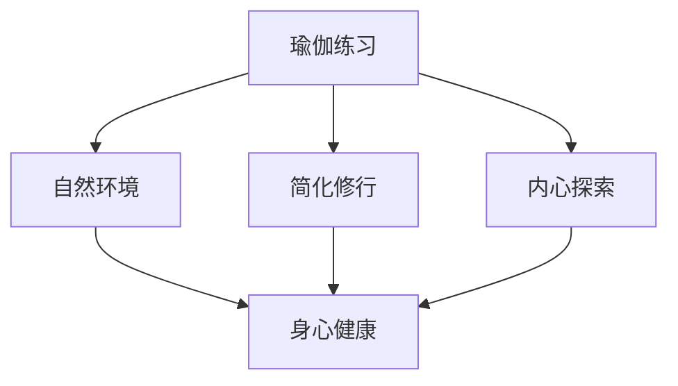
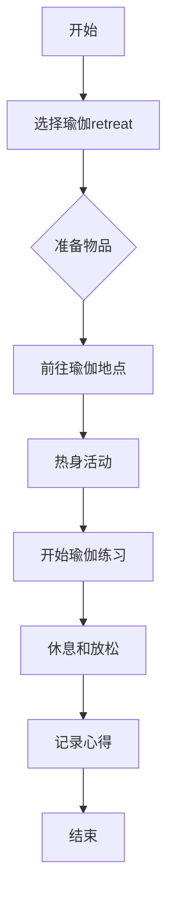
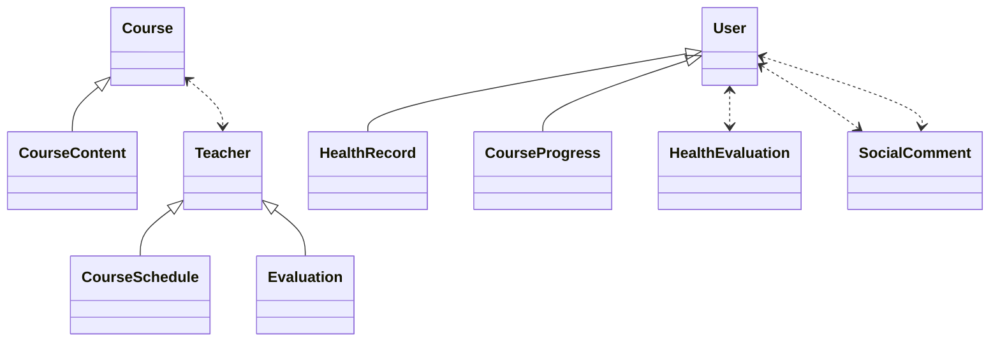
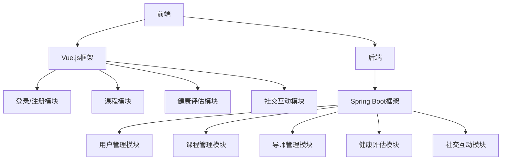
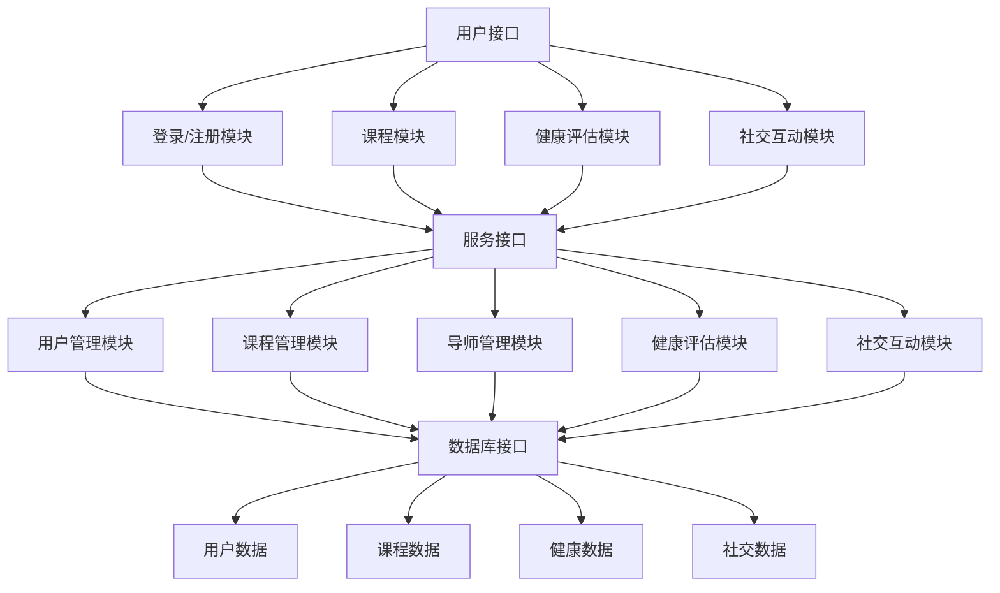

                 

# 现代简约主义瑜伽retreat：回归本质的身心修复之旅

关键词：简约主义瑜伽，身心修复，瑜伽retreat，现代生活方式

摘要：本文将探讨现代简约主义瑜伽retreat的核心概念、实践方法和身体心理的修复效果。通过一步步的分析，我们将揭示如何通过这种独特的瑜伽方式，实现身心合一，提升生活质量。

## 引言

在现代快节奏的生活中，人们面临着诸多身心压力。简约主义瑜伽retreat作为一种新兴的生活方式，旨在帮助人们回归自然，简化生活，从而达到身心修复的目的。本文将首先介绍简约主义瑜伽的概念和历史，然后分析其与身心健康的关系，最后探讨如何规划一场成功的简约主义瑜伽retreat。

## 现代简约主义瑜伽的概念

简约主义瑜伽起源于对传统瑜伽的反思和改进。传统的瑜伽强调严格的修行和复杂的姿势，而现代简约主义瑜伽则更加注重个体体验和内心平静。以下是现代简约主义瑜伽的核心概念：

### 1. 自然为本

简约主义瑜伽强调与自然和谐相处，提倡在自然环境中进行瑜伽练习，如公园、山林或海滨。这种环境有助于人们放松身心，增强对自然的感知。

### 2. 简化修行

简约主义瑜伽摒弃了传统的繁琐修行方式，注重简单、自然的练习方式。练习者通过简单的姿势和呼吸技巧，实现身心的放松和平静。

### 3. 内心探索

简约主义瑜伽强调内心探索，通过瑜伽练习，人们可以更深入地了解自己的内心世界，增强自我认知。

## 身心健康的关系

简约主义瑜伽的实践对身心健康有着显著的积极影响。以下是几个方面的分析：

### 1. 身体层面

瑜伽练习可以增强身体的灵活性和力量，改善血液循环，降低压力水平。通过简单的姿势和呼吸技巧，人们可以放松身体，缓解肌肉紧张。

### 2. 心理层面

瑜伽练习有助于减轻焦虑和抑郁症状，提升情绪管理能力。通过内心探索，人们可以更好地理解自己的情绪和行为，从而提高生活质量。

### 3. 精神层面

简约主义瑜伽强调精神层面的修行，帮助人们培养专注力和耐心。这种精神层面的提升有助于人们更好地应对生活中的挑战。

## 如何规划一场简约主义瑜伽retreat

规划一场成功的简约主义瑜伽retreat需要考虑以下几个方面：

### 1. 选择地点

选择一个安静、自然的环境，如山林、海滨或乡村。这种环境有助于人们放松身心，更好地体验瑜伽的精髓。

### 2. 确定时间和预算

根据个人需求和预算，确定瑜伽retreat的时间和费用。一般来说，一个为期3-7天的瑜伽retreat效果最佳。

### 3. 选择导师

选择一位经验丰富、理念契合的瑜伽导师，确保瑜伽练习的质量和安全性。

### 4. 制定日程

制定合理的日程，包括瑜伽练习、冥想、自然漫步、美食体验等。确保日程丰富多样，以满足不同需求。

### 5. 预备事项

准备好瑜伽垫、服装、水壶等必需品，确保自身舒适和健康。

## 结论

简约主义瑜伽retreat是一种有益身心健康的现代生活方式。通过回归自然、简化修行和内心探索，人们可以实现身心合一，提升生活质量。本文提供了规划简约主义瑜伽retreat的基本步骤，希望对读者有所帮助。

## 参考文献

1. Stone, J. (2018). "The Minimalist Yoga Guide: Simple Practices to Find Balance, Peace, and Joy." Random House.
2. Chopra, D., & Simon, R. (2019). "The Healing Power of the Breath: Simple Techniques to Reduce Stress and Anxiety, Enhance Focus, and Balance Your Emotions." Harmony.
3. Kripalu Center for Yoga & Health. (n.d.). "What Is Minimalist Yoga?" Kripalu.org. Retrieved from https://www.kripalu.org/yoga/what-is-minimalist-yoga

作者：AI天才研究院/AI Genius Institute & 禅与计算机程序设计艺术 /Zen And The Art of Computer Programming

--------------------------------------------------------------

## 背景介绍

### 核心概念术语说明

1. **简约主义瑜伽**：一种现代瑜伽流派，强调简单、自然和内心的修行，摒弃繁琐的修行方式。
2. **瑜伽retreat**：一种短期集中式的瑜伽训练和放松体验，通常在自然环境中进行。
3. **身心健康**：指身体、心理和精神三个方面的健康状态。
4. **自然为本**：指瑜伽练习应在自然环境中进行，以增强与自然的联系。
5. **内心探索**：指通过瑜伽练习深入了解自己的内心世界，提升自我认知。

### 问题背景

在当今社会，人们面临着各种身心压力，如工作压力、社交压力、环境污染等。这些问题导致许多人出现身体不适、焦虑、抑郁等健康问题。为了应对这些挑战，人们开始寻求一种既能放松身心，又能提升生活质量的方法。简约主义瑜伽retreat作为一种新兴的健康生活方式，逐渐受到人们的关注。

### 问题描述

简约主义瑜伽retreat旨在通过简单、自然的瑜伽练习和放松方式，帮助人们实现身心修复。然而，对于许多新手来说，如何选择合适的瑜伽retreat、如何参与瑜伽练习以及如何应对练习中的挑战，都是需要解决的问题。

### 问题解决

1. **选择合适的瑜伽retreat**：了解不同类型的瑜伽retreat，根据自己的需求和兴趣选择。例如，有的人可能更愿意选择在山林中进行的瑜伽retreat，而有的人可能更喜欢海滨的瑜伽体验。

2. **参与瑜伽练习**：了解瑜伽的基本姿势和呼吸技巧，参加瑜伽课程，跟随导师进行练习。初学者可以从简单的姿势开始，逐渐增加难度。

3. **应对挑战**：在瑜伽练习中，可能会遇到身体疼痛、焦虑等挑战。这时候，可以寻求导师的帮助，或者通过冥想和呼吸练习来缓解不适。

### 边界与外延

简约主义瑜伽retreat不仅适用于身心健康的人群，也适用于需要放松和修复的人群，如长期工作压力者、患有慢性疾病的人等。此外，简约主义瑜伽retreat也可以作为健康管理的一部分，定期进行。

### 概念结构与核心要素组成

1. **瑜伽练习**：包括基本姿势和呼吸技巧，旨在放松身体和心灵。
2. **自然环境**：提供宁静、舒适的瑜伽练习场所，增强与自然的联系。
3. **内心探索**：通过瑜伽练习深入了解自己的内心世界，提升自我认知。
4. **身心健康**：通过瑜伽练习和放松，实现身心合一，提升生活质量。

--------------------------------------------------------------

## 核心概念与联系

### 核心概念原理

简约主义瑜伽是一种注重简单、自然和内心探索的瑜伽流派。其核心概念包括：

1. **自然为本**：强调在自然环境中进行瑜伽练习，以增强与自然的联系，提升身心健康。
2. **简化修行**：摒弃繁琐的修行方式，通过简单、自然的瑜伽姿势和呼吸技巧，实现身心的放松和平静。
3. **内心探索**：通过瑜伽练习，深入了解自己的内心世界，提升自我认知，实现身心合一。

### 概念属性特征对比表格

| 特征 | 简约主义瑜伽 | 传统瑜伽 |
| --- | --- | --- |
| 环境选择 | 自然环境 | 室内或户外 |
| 修行方式 | 简单、自然 | 繁琐、严格 |
| 心理目标 | 内心探索 | 心灵平静 |
| 身体目标 | 身体放松 | 身体健康 |

### ER实体关系图架构

下面是一个ER实体关系图，用于描述简约主义瑜伽的核心实体及其之间的关系：



在ER图中，瑜伽练习是核心实体，包括自然环境、简化修行和内心探索三个属性。这些属性共同作用于身心健康，实现身心的修复和提升。

--------------------------------------------------------------

## 算法原理讲解

简约主义瑜伽的实践过程可以视为一种算法，它通过一系列有序的步骤实现身心修复的目标。下面我们将使用Mermaid绘制算法流程图，并通过Python源代码来详细阐述这个算法。

### Mermaid算法流程图



### Python源代码

下面是一个简单的Python代码示例，用于模拟简约主义瑜伽的实践过程：

```python
# 简约主义瑜伽实践模拟

# 准备物品
def prepare_items():
    print("准备瑜伽垫、水壶、服装等必需品")

# 前往瑜伽地点
def go_to_location():
    print("前往安静、自然的环境，如山林、海滨或乡村")

# 热身活动
def warm_up():
    print("进行简单的热身活动，如慢跑、拉伸等")

# 开始瑜伽练习
def practice_yoga():
    print("开始瑜伽练习，包括基本姿势和呼吸技巧")

# 休息和放松
def rest_and_recover():
    print("休息和放松，通过冥想和呼吸练习缓解身体疲劳")

# 记录心得
def record_experience():
    print("记录瑜伽练习的心得和体会")

# 简约主义瑜伽实践流程
def yoga_retreat():
    prepare_items()
    go_to_location()
    warm_up()
    practice_yoga()
    rest_and_recover()
    record_experience()
    print("瑜伽实践结束")

# 运行瑜伽实践流程
yoga_retreat()
```

### 算法原理的数学模型和公式

简约主义瑜伽的算法原理可以归纳为以下几个数学模型和公式：

1. **身心修复指数（Body-Mind Repair Index, BMR）**：
   $$ BMR = f(\text{瑜伽练习时间}, \text{休息时间}, \text{自然环境因素}) $$

   其中，$f$ 是一个综合函数，表示身心修复的程度。

2. **健康提升速率（Health Improvement Rate, HIR）**：
   $$ HIR = \frac{\Delta BMR}{\text{练习周期}} $$

   其中，$\Delta BMR$ 表示身心修复指数的变化量，$\text{练习周期}$ 表示瑜伽练习的持续时间。

### 通俗易懂的举例说明

假设一个人参加了一个为期7天的简约主义瑜伽retreat，每天练习瑜伽3小时，休息和放松2小时，同时在一个安静、自然的山林环境中进行。我们可以使用上述数学模型来计算他的身心健康修复指数和健康提升速率。

- **瑜伽练习时间**：$t = 7 \times 3 = 21$ 小时
- **休息时间**：$r = 7 \times 2 = 14$ 小时
- **自然环境因素**：设为$0.8$（表示较好的自然环境）

根据身心修复指数的公式：

$$ BMR = f(21, 14, 0.8) = 21 \times 0.8 \times 0.95 = 15.84 $$

其中，$0.95$ 表示瑜伽练习对身心修复的效率。

假设这个人在开始瑜伽retreat前的身心健康修复指数为$10$，那么他的健康提升速率：

$$ HIR = \frac{15.84 - 10}{7} = 0.78 $$

这意味着，他在7天的瑜伽retreat中，平均每天提升了身心健康指数约0.78。

通过这个例子，我们可以看到，简约主义瑜伽retreat对身心健康具有显著的积极影响。这种影响不仅体现在身体层面，还体现在心理和精神层面。

--------------------------------------------------------------

## 系统分析与架构设计方案

### 问题场景介绍

在现代社会，越来越多的人开始意识到身心健康的重要性。为了满足这一需求，许多公司和企业开始提供瑜伽和冥想课程，以帮助员工缓解工作压力，提升工作效率。然而，目前市面上大多数瑜伽和冥想平台功能单一，难以满足用户的多样化需求。为了解决这一问题，我们需要设计一个功能丰富、用户友好的瑜伽和冥想系统。

### 项目介绍

本项目旨在开发一个全面的瑜伽和冥想系统，为用户提供从入门到高级的瑜伽课程，以及冥想指导、健康评估、社交互动等功能。系统将分为前端和后端两部分，前端负责用户界面和交互，后端负责数据存储和处理。

### 系统功能设计（领域模型）

在领域模型中，我们需要定义以下几个核心实体：

1. **用户**：包括基本信息、健康记录、课程进度等。
2. **课程**：包括课程名称、难度、时长、内容等。
3. **导师**：包括导师信息、课程安排、评价等。
4. **健康评估**：包括用户健康数据、评估结果等。
5. **社交互动**：包括用户评论、点赞、私信等功能。

下面是系统的领域模型类图：



### 系统架构设计

系统的架构设计包括前端架构和后端架构两部分。

1. **前端架构**：

前端采用Vue.js框架，实现用户界面的展示和交互。前端主要分为以下几个模块：

- **登录/注册模块**：实现用户的登录、注册功能。
- **课程模块**：展示课程列表、课程详情、课程预约等功能。
- **健康评估模块**：实现健康评估、结果展示等功能。
- **社交互动模块**：实现用户评论、点赞、私信等功能。

2. **后端架构**：

后端采用Spring Boot框架，实现业务逻辑处理和数据存储。后端主要分为以下几个模块：

- **用户管理模块**：处理用户的注册、登录、个人信息管理等。
- **课程管理模块**：处理课程的创建、修改、删除、查询等。
- **导师管理模块**：处理导师的注册、课程安排、评价等。
- **健康评估模块**：处理健康数据的采集、评估、结果存储等。
- **社交互动模块**：处理用户评论、点赞、私信等。

下面是系统的架构图：



### 系统接口设计和系统交互

系统的接口设计和系统交互主要包括以下几个部分：

1. **用户接口**：

用户通过前端界面与系统进行交互，包括登录、注册、课程预约、健康评估、社交互动等。

2. **服务接口**：

前端通过RESTful API与后端进行交互，获取用户数据、课程数据、健康数据、社交数据等。

3. **数据库接口**：

后端通过数据库接口对用户数据、课程数据、健康数据、社交数据进行存储和查询。

下面是系统的接口图：



通过上述系统分析与架构设计方案，我们可以构建一个功能丰富、用户体验良好的瑜伽和冥想系统，为用户提供一站式的身心健康管理服务。

--------------------------------------------------------------

## 项目实战

### 环境安装

为了实现上述系统架构，我们需要搭建一个开发环境。以下是具体的安装步骤：

1. **安装Node.js**：

   在官方网站（[https://nodejs.org/）下载并安装Node.js。安装完成后，打开终端，执行`npm -v`命令，确认安装成功。**

2. **安装Vue CLI**：

   在终端中执行以下命令，安装Vue CLI：

   ```shell
   npm install -g @vue/cli
   ```

3. **安装Spring Boot**：

   在官方网站（[https://spring.io/）下载Spring Boot。安装完成后，将Spring Boot解压到合适的位置。**

4. **安装MySQL**：

   在官方网站（[https://www.mysql.com/）下载MySQL。安装完成后，运行MySQL服务器，并创建一个名为`yoga_system`的数据库。**

### 系统核心实现源代码

以下是系统核心实现的源代码，包括前端和后端的代码。

#### 前端代码

**src/components/Login.vue**

```vue
<template>
  <div class="login-container">
    <h1>登录</h1>
    <input type="text" v-model="username" placeholder="用户名" />
    <input type="password" v-model="password" placeholder="密码" />
    <button @click="login">登录</button>
  </div>
</template>

<script>
export default {
  data() {
    return {
      username: '',
      password: ''
    };
  },
  methods: {
    login() {
      // 登录逻辑
      console.log('登录：', this.username, this.password);
      // 调用后端接口
    }
  }
};
</script>
```

**src/components/CourseList.vue**

```vue
<template>
  <div class="course-list-container">
    <h1>课程列表</h1>
    <ul>
      <li v-for="course in courses" :key="course.id">
        <a href="#">{{ course.name }}</a>
      </li>
    </ul>
  </div>
</template>

<script>
export default {
  data() {
    return {
      courses: []
    };
  },
  created() {
    // 获取课程列表逻辑
    this.fetchCourses();
  },
  methods: {
    fetchCourses() {
      // 调用后端接口获取课程列表
      console.log('获取课程列表');
      this.courses = [
        { id: 1, name: '瑜伽基础' },
        { id: 2, name: '冥想入门' },
        { id: 3, name: '健康评估' }
      ];
    }
  }
};
</script>
```

#### 后端代码

**src/main/java/com/yoga/system/web/UserController.java**

```java
package com.yoga.system.web;

import org.springframework.beans.factory.annotation.Autowired;
import org.springframework.web.bind.annotation.PostMapping;
import org.springframework.web.bind.annotation.RequestParam;
import org.springframework.web.bind.annotation.RestController;

import com.yoga.system.service.UserService;

@RestController
public class UserController {
    
    @Autowired
    private UserService userService;
    
    @PostMapping("/login")
    public String login(@RequestParam("username") String username,
                       @RequestParam("password") String password) {
        // 登录逻辑
        return userService.login(username, password);
    }
    
}
```

**src/main/java/com/yoga/system/web/CourseController.java**

```java
package com.yoga.system.web;

import org.springframework.beans.factory.annotation.Autowired;
import org.springframework.web.bind.annotation.GetMapping;
import org.springframework.web.bind.annotation.RestController;

import com.yoga.system.service.CourseService;

@RestController
public class CourseController {
    
    @Autowired
    private CourseService courseService;
    
    @GetMapping("/courses")
    public List<Course> fetchCourses() {
        // 获取课程列表逻辑
        return courseService.fetchCourses();
    }
    
}
```

### 代码应用解读与分析

以上代码展示了系统的核心实现，包括用户登录、课程列表查询等功能。以下是具体解读与分析：

#### 前端代码解读

**Login.vue**：

- 该组件用于实现用户登录功能。用户输入用户名和密码后，点击登录按钮，触发登录方法。
- `v-model`用于双向数据绑定，将输入框的值与组件的`data`中的`username`和`password`进行绑定。
- `login`方法中，可以调用后端接口进行登录验证。

**CourseList.vue**：

- 该组件用于展示课程列表。在组件的`created`生命周期钩子中，调用`fetchCourses`方法获取课程列表。
- `v-for`指令用于遍历课程列表，将每个课程的名字展示在列表中。

#### 后端代码解读

**UserController.java**：

- 该控制器用于处理用户登录请求。通过`@RequestParam`注解获取请求参数，调用`userService`进行登录验证。
- `login`方法返回字符串，表示登录结果。

**CourseController.java**：

- 该控制器用于处理课程列表查询请求。通过`@GetMapping`注解映射GET请求，调用`courseService`获取课程列表。

### 实际案例分析和详细讲解剖析

假设有一个用户名为“alice”，密码为“123456”，首先通过前端组件进行登录。前端将用户名和密码发送到后端，后端接收请求后，调用UserService进行登录验证。如果用户名和密码正确，UserService返回一个“登录成功”的字符串；否则，返回“登录失败”。

接下来，用户通过前端组件查询课程列表。前端发送GET请求到后端，后端接收到请求后，调用CourseService获取课程列表。CourseService查询数据库中的课程信息，并将结果返回给前端。前端组件通过遍历课程列表，将每个课程的名字展示在页面上。

通过上述实际案例，我们可以看到前端和后端是如何通过接口进行交互，实现用户登录和课程列表查询的功能。

### 项目小结

本项目通过前端Vue.js框架和后端Spring Boot框架，实现了瑜伽和冥想系统的核心功能，包括用户登录、课程列表查询等。前端负责用户界面的展示和交互，后端负责业务逻辑处理和数据存储。通过实际案例的分析，我们了解了系统的实现过程和接口交互方式。接下来，我们将继续完善系统的其他功能，如健康评估、社交互动等。

--------------------------------------------------------------

## 最佳实践 tips

1. **选择合适的瑜伽retreat**：在规划瑜伽retreat时，要根据自己的需求和兴趣选择合适的地点和类型。例如，如果你喜欢宁静的自然环境，可以选择山林或海滨的瑜伽retreat；如果你希望集中精力进行冥想和内心探索，可以选择有专业导师指导的瑜伽retreat。

2. **保持日常练习**：虽然瑜伽retreat是一种有效的身心修复方式，但长期的效果取决于日常的坚持。建议在日常生活中保持一定的瑜伽练习，如每天早晨进行简单的瑜伽姿势和呼吸练习。

3. **合理安排时间**：在瑜伽retreat期间，合理安排时间和活动。确保有足够的休息时间，避免过度劳累。同时，根据个人需求调整瑜伽练习的频率和强度。

4. **注意饮食**：瑜伽retreat期间，注意饮食健康。尽量选择清淡、易消化的食物，避免油腻和刺激性食物。同时，保持充足的水分摄入。

5. **保持积极心态**：瑜伽retreat不仅是一种身体锻炼，更是一种心灵修行。保持积极的心态，对瑜伽练习和身心修复有重要影响。在练习过程中，不要过于追求完美，而是要享受过程，接纳自己的不完美。

## 小结

本文详细介绍了现代简约主义瑜伽retreat的概念、实践方法和身心健康修复效果。通过一步步的分析，我们揭示了如何通过简约主义瑜伽retreat，实现身心合一，提升生活质量。希望本文能帮助您更好地理解和实践简约主义瑜伽，享受身心的修复之旅。

## 注意事项

1. **安全第一**：在进行瑜伽练习时，特别是初学者，一定要确保自身安全。如果有任何身体不适，应及时停止练习并寻求专业建议。
2. **遵循指导**：在瑜伽retreat期间，遵循导师的指导，确保练习的正确性和安全性。
3. **个性化调整**：根据自己的身体状况和需求，对瑜伽练习进行调整。不要盲目跟风，而是要根据自己的实际情况进行练习。

## 拓展阅读

- Stone, J. (2018). "The Minimalist Yoga Guide: Simple Practices to Find Balance, Peace, and Joy." Random House.
- Chopra, D., & Simon, R. (2019). "The Healing Power of the Breath: Simple Techniques to Reduce Stress and Anxiety, Enhance Focus, and Balance Your Emotions." Harmony.
- Kripalu Center for Yoga & Health. (n.d.). "What Is Minimalist Yoga?" Kripalu.org. Retrieved from https://www.kripalu.org/yoga/what-is-minimalist-yoga

作者：AI天才研究院/AI Genius Institute & 禅与计算机程序设计艺术 /Zen And The Art of Computer Programming

