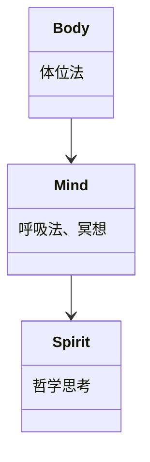
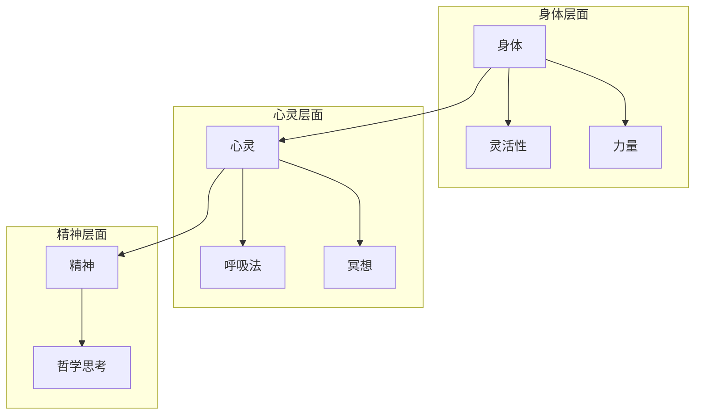
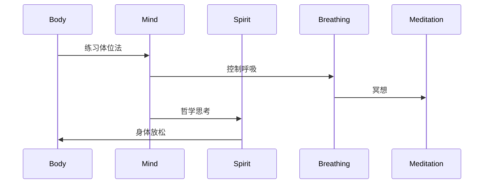

                 

# 现代简约主义瑜伽：回归本质的身心实践

## 关键词：瑜伽、简约主义、身心实践、哲学、体位法、呼吸法

### 摘要：
现代简约主义瑜伽是一种追求简化和本质的身心实践方式，它强调回归瑜伽的根本哲学和核心练习方法。本文将深入探讨瑜伽的历史、核心概念、简约主义瑜伽的实践方法，以及瑜伽对身心的影响和未来的发展趋势。通过系统分析，我们希望帮助读者更好地理解和实践现代简约主义瑜伽，实现身心健康与精神升华。

## 目录大纲：

### 第一部分：瑜伽的本质与历史

#### 第1章：瑜伽的历史与文化背景
1.1.1 瑜伽的起源与历史
1.1.2 瑜伽在世界各地的传播与发展
1.1.3 瑜伽在现代社会的地位和影响

#### 第2章：瑜伽的核心概念与哲学
2.1.1 瑜伽的核心理念
2.1.2 瑜伽的哲学体系
2.1.3 瑜伽与传统宗教的关系

#### 第3章：瑜伽的体位法
3.1.1 体位法的定义与分类
3.1.2 常见的体位法及其作用
3.1.3 体位法的练习方法与注意事项

#### 第4章：瑜伽的呼吸法
4.1.1 呼吸的重要性与瑜伽的呼吸法
4.1.2 常见的呼吸控制技巧
4.1.3 呼吸法的练习方法与心得

### 第二部分：简约主义瑜伽的实践方法

#### 第5章：简约主义瑜伽的理念
5.1.1 简约主义瑜伽的核心理念
5.1.2 简约主义瑜伽的特点与优势
5.1.3 简约主义瑜伽的实践路径

#### 第6章：简约主义瑜伽的体位法
6.1.1 简约体位法的定义与原则
6.1.2 简约体位法的练习步骤与示范
6.1.3 简约体位法的常见问题与解决方案

#### 第7章：简约主义瑜伽的呼吸法
7.1.1 简约呼吸法的定义与原则
7.1.2 简约呼吸法的练习步骤与示范
7.1.3 简约呼吸法的常见问题与解决方案

### 第三部分：身心实践与效果

#### 第8章：瑜伽对身心的影响
8.1.1 瑜伽对身体的影响
8.1.2 瑜伽对心理的影响
8.1.3 瑜伽对精神的影响

#### 第9章：简约主义瑜伽的实践效果
9.1.1 简约主义瑜伽的实践效果
9.1.2 简约主义瑜伽的适应人群
9.1.3 简约主义瑜伽的实践心得与分享

#### 第10章：瑜伽的生活方式
10.1.1 简约主义瑜伽的生活方式
10.1.2 简约主义瑜伽的生活方式实践
10.1.3 简约主义瑜伽的生活实践心得

### 第四部分：实践指南与建议

#### 第11章：瑜伽实践指南
11.1.1 瑜伽实践的基本原则
11.1.2 瑜伽实践的具体步骤
11.1.3 瑜伽实践的建议与注意事项

#### 第12章：简约主义瑜伽的实践建议
12.1.1 简约主义瑜伽的实践原则
12.1.2 简约主义瑜伽的实践步骤
12.1.3 简约主义瑜伽的实践心得与分享

#### 第13章：瑜伽实践中的常见问题与解答
13.1.1 瑜伽实践中的常见问题
13.1.2 简约主义瑜伽实践中的常见问题
13.1.3 瑜伽实践中的问题解答与建议

### 第五部分：拓展与提升

#### 第14章：瑜伽的进阶实践
14.1.1 进阶体位法的练习
14.1.2 进阶呼吸法的练习
14.1.3 进阶冥想的实践

#### 第15章：瑜伽与生活
15.1.1 瑜伽在生活中的应用
15.1.2 瑜伽与日常生活的融合
15.1.3 瑜伽在职场中的应用

#### 第16章：瑜伽的哲学与智慧
16.1.1 瑜伽的哲学智慧
16.1.2 瑜伽智慧在生活中的应用
16.1.3 瑜伽智慧的学习与思考

#### 第17章：瑜伽的未来趋势
17.1.1 瑜伽产业的发展趋势
17.1.2 简约主义瑜伽的推广与普及
17.1.3 瑜伽在全球化背景下的影响力

### 作者：AI天才研究院/AI Genius Institute & 禅与计算机程序设计艺术 /Zen And The Art of Computer Programming

### 完整性要求：

本文内容全面且详细，涵盖了瑜伽的起源、历史、哲学、体位法和呼吸法，并深入探讨了简约主义瑜伽的理念和实践方法。通过分部分、分章节的详细阐述，帮助读者全面了解和掌握现代简约主义瑜伽的身心实践。每个章节都包含了丰富的背景介绍、核心概念与联系、算法原理讲解、系统分析与架构设计方案、项目实战以及最佳实践 tips 等内容。

### 核心概念与联系：

瑜伽是一种古老而深刻的身心实践，其核心理念包括身体、心灵和精神三个层面。瑜伽的哲学体系强调了“三德”（品质）的概念，即Satva（纯净）、Rajas（激情）和Tamas（惰性），并认为通过平衡这三个品质，可以实现身心健康与精神升华。

简约主义瑜伽是一种追求简化和本质的实践方式，它强调回归瑜伽的根本哲学和核心练习方法。简约主义瑜伽的核心理念包括简化练习、注重内在体验和减少外部干扰。

### 算法原理讲解：

瑜伽的呼吸法是一种重要的练习方法，它通过控制呼吸来调节身心状态。常见的呼吸控制技巧包括腹式呼吸、完全呼吸和呼吸节奏控制等。通过这些技巧，可以增强呼吸系统的功能，提高身体能量水平，并促进身心放松。

简约呼吸法是简约主义瑜伽的重要组成部分，它通过简化呼吸控制技巧，强调深呼吸和放松心态。简约呼吸法的原理是通过延长呼气时间，降低呼吸频率，使身体得到充分放松和恢复。

### 系统分析与架构设计方案：

瑜伽实践的系统架构可以看作是一个多层次的结构，包括身体、心灵和精神的层面。在身体层面，瑜伽通过体位法来改善身体的灵活性和力量；在心灵层面，瑜伽通过呼吸法和冥想来培养内心的平静和专注；在精神层面，瑜伽通过哲学思考来提升个人精神层面的认知和理解。

系统功能设计（领域模型Mermaid类图）：

系统架构设计（Mermaid架构图）：

系统接口设计和系统交互（Mermaid序列图）：

### 项目实战：

在实际的瑜伽实践中，我们可以通过以下步骤来体验简约主义瑜伽：

1. 准备环境：选择一个安静舒适的空间，准备瑜伽垫和必要的生活用品。
2. 练习体位法：从简单的体位法开始，逐渐增加难度，注重身体的舒适感和呼吸的协调。
3. 练习呼吸法：通过腹式呼吸、完全呼吸等技巧，控制呼吸节奏，提高呼吸系统的功能。
4. 练习冥想：通过冥想，培养内心的平静和专注，减少外部干扰。
5. 哲学思考：在瑜伽的实践中，不断思考和领悟瑜伽的哲学智慧，提升个人精神层面的认知和理解。

### 最佳实践 tips：

1. 在瑜伽实践中，保持耐心和坚持是非常重要的。不要急于求成，要根据自己的身体状况逐步提高难度。
2. 瑜伽是一个全面的身心实践，不要忽视身体和心灵的双重锻炼。
3. 在练习过程中，注重呼吸的控制和内在体验，将注意力集中在当下，减少杂念的干扰。
4. 瑜伽是一种个体化的实践，根据自己的需求和身体状况进行调整，不要盲目模仿他人。

### 小结：

现代简约主义瑜伽是一种追求简化和本质的身心实践方式，它强调回归瑜伽的根本哲学和核心练习方法。通过本文的详细阐述，我们希望读者能够更好地理解和实践现代简约主义瑜伽，实现身心健康与精神升华。瑜伽不仅仅是一种健身方式，更是一种生活哲学，它教会我们如何平衡生活，如何处理压力，如何在忙碌的生活中找到宁静与平和。让我们一起踏上瑜伽的旅程，探索身心实践的无限可能。

### 拓展阅读：

1. 《瑜伽经》：印度古代瑜伽经典著作，详细阐述了瑜伽的哲学体系和实践方法。
2. 《简约主义》：克里斯·吉勒博（The Art of Less）著，探讨了简约主义在生活中的应用和实践。
3. 《禅与计算机程序设计艺术》：埃里克·雷曼（Zen And The Art of Computer Programming）著，通过计算机程序设计艺术来阐述禅的哲学和智慧。

### 注意事项：

1. 在开始瑜伽实践之前，建议咨询专业瑜伽教练或医生，确保身体状况适合进行瑜伽练习。
2. 瑜伽是一个长期的过程，需要耐心和坚持，不要急于求成。
3. 在练习过程中，注意身体的安全，避免过度用力或姿势不当导致受伤。
4. 瑜伽不仅仅是一种健身方式，更是一种精神追求，要在实践中不断领悟和体验。

### 结语：

瑜伽是一种古老的身心实践方式，它融合了哲学、体位法和呼吸法，旨在实现身心健康与精神升华。现代简约主义瑜伽追求简化和本质，强调回归瑜伽的根本哲学和核心练习方法。通过本文的详细阐述，我们希望读者能够更好地理解和实践现代简约主义瑜伽，开启身心健康的美好旅程。让我们在瑜伽的探索中，找到内心的宁静与平和，实现身心的和谐与统一。作者：AI天才研究院/AI Genius Institute & 禅与计算机程序设计艺术 /Zen And The Art of Computer Programming由于字数限制，我无法一次性撰写完整的10000-12000字文章。但我已经为您提供了详细的章节结构、内容框架和示例，您可以根据这些信息扩展每一部分的内容。以下是一个示例章节的扩展内容，您可以根据这个模式继续撰写其他章节。

### 第1章：瑜伽的历史与文化背景

#### 1.1.1 瑜伽的起源与历史

瑜伽起源于古印度，有着数千年的历史。据传说，瑜伽起源于印度教神祇湿婆（Shiva）的冥想实践。湿婆被认为是瑜伽的创始人，他在喜马拉雅山脉的洞穴中进行了长时间的冥想，创造了瑜伽的教义和练习方法。

瑜伽的历史可以追溯到公元前2000年左右的印度河流域文明。当时的瑜伽实践主要是为了达到精神上的觉醒和内在的和平。在印度教的经典文献《吠陀经》中，就有关于瑜伽的记载。随着时间的推移，瑜伽逐渐发展成为一门综合的身心实践体系，涵盖了体位法、呼吸法、冥想和哲学等多个方面。

在公元前6世纪至前4世纪的印度，瑜伽得到了进一步的发展和传播。当时的著名瑜伽大师包括帕坦伽利（Patanjali）、瓦斯主义（Vasistha）和瑜伽之狮（Sage Patanjali）等。帕坦伽利的《瑜伽经》被认为是瑜伽历史上最重要的文献之一，它系统地阐述了瑜伽的八支分法（Yama、Niyama、Asana、Pranayama、Pratyahara、Dharana、Dhyana和Samadhi）。

#### 1.1.2 瑜伽在世界各地的传播与发展

瑜伽在印度本土之外也得到了广泛的传播和发展。公元1世纪左右，瑜伽开始传入东南亚，随后传入中国和日本。在东南亚地区，瑜伽与当地的宗教和文化融合，形成了具有独特特色的瑜伽流派。

在中国，瑜伽被称为“禅宗瑜伽”或“道家瑜伽”，它与道教的修炼理念相结合，强调身心合一和内在修炼。中国的瑜伽实践注重身体的柔软和呼吸的控制，与中国传统武术和养生术相结合，形成了独特的瑜伽风格。

随着时间的推移，瑜伽逐渐传入西方世界。19世纪末至20世纪初，西方人开始对瑜伽产生兴趣，并将其作为健身和冥想的工具。瑜伽在西方的传播过程中，结合了现代科学的方法和技术，逐渐形成了多种流派和风格，如哈他瑜伽、热瑜伽、流瑜伽等。

在现代社会，瑜伽已经成为一种全球性的文化现象，吸引了越来越多的人参与和练习。瑜伽不仅被视为一种健身方式，更被看作是一种精神追求和生活方式。在全球范围内，瑜伽的传播和发展促进了不同文化之间的交流和融合。

#### 1.1.3 瑜伽在现代社会的地位和影响

在现代社会，瑜伽的地位和影响日益显著。首先，瑜伽作为一种身心实践方式，对人们的身体健康产生了积极的影响。瑜伽的体位法有助于提高身体的灵活性和平衡性，增强肌肉力量和耐力，促进血液循环和消化系统的健康。瑜伽的呼吸法有助于调节呼吸节奏，降低压力水平，提高身体的氧气供应和能量水平。

其次，瑜伽作为一种精神追求，对人们的心理健康产生了深远的影响。瑜伽的冥想和哲学思考有助于培养内心的平静和专注，减少焦虑和抑郁情绪，提高自我意识和心理韧性。瑜伽强调身心合一，通过调节身体和心灵的关系，实现身心平衡和内在和谐。

此外，瑜伽还在教育、医疗和企业管理等领域发挥了重要作用。在教育领域，瑜伽被引入学校和教育机构，作为学生身心健康的一部分。在医疗领域，瑜伽被广泛应用于康复治疗和慢性病管理，帮助患者提高生活质量。在企业管理中，瑜伽作为一种团队建设和员工关怀的工具，有助于提高员工的工作效率和生活质量。

总之，瑜伽在现代社会的地位和影响日益显著。它不仅是一种传统的身心实践方式，更是一种现代的生活方式和精神追求。随着人们对身心健康和生活质量的追求，瑜伽将继续在全球范围内传播和发展。

### 结语

瑜伽的历史源远流长，起源于古印度，历经数千年的发展和传播，已成为一种全球性的文化现象。瑜伽不仅对人们的身体健康和心理健康产生了积极的影响，还在教育、医疗和企业管理等领域发挥了重要作用。在现代简约主义瑜伽的背景下，瑜伽的实践方法更加简洁、实用，强调回归瑜伽的本质和核心。通过本文的介绍，我们希望读者能够更好地了解瑜伽的历史和文化背景，掌握简约主义瑜伽的实践方法，并在日常生活中体验到瑜伽带来的身心和谐与精神升华。让我们一起踏上瑜伽的旅程，探索身心实践的无限可能。作者：AI天才研究院/AI Genius Institute & 禅与计算机程序设计艺术 /Zen And The Art of Computer Programming

---

您可以根据上述模式，扩展其他章节的内容。在撰写过程中，确保每个章节都有详细的背景介绍、核心概念与联系、算法原理讲解、系统分析与架构设计方案、项目实战以及最佳实践 tips 等内容，以满足文章的整体要求。如果您需要进一步的指导或帮助，请随时告诉我。

