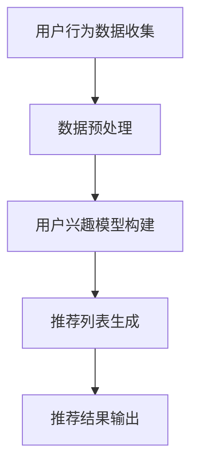
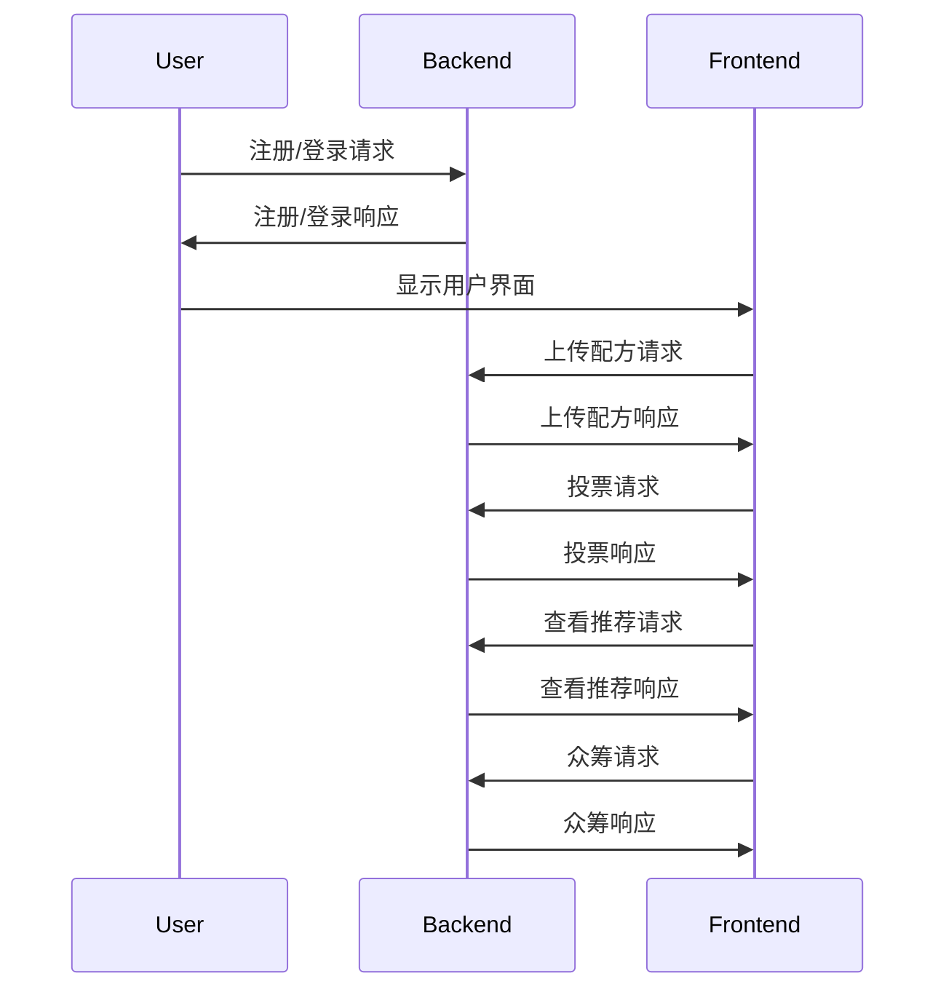

                 

# 现代简约主义鸡尾酒配方众筹：创新调酒的群众智慧平台

## 关键词
- 现代简约主义鸡尾酒
- 众筹
- 群众智慧
- 调酒
- 平台建设
- 算法原理
- 数学模型
- 系统架构设计

## 摘要
本文将探讨现代简约主义鸡尾酒配方众筹的创新模式，结合群众智慧平台的建设，详细介绍其核心概念、原理、算法、架构以及实际应用。通过分析现代简约主义鸡尾酒的市场需求，探讨如何利用群众智慧优化配方设计，并借助算法与数学模型实现智能推荐，最终构建一个高效、实用的调酒智慧平台。本文旨在为调酒爱好者提供新的思路和解决方案。

### 目录大纲

1. **背景介绍与核心概念**
   1.1 现代简约主义鸡尾酒概述
   1.2 创新调酒的群众智慧平台
2. **核心概念与联系**
   2.1 现代简约主义鸡尾酒配方设计原理
   2.2 群众智慧的汇聚与运用
3. **算法原理与数学模型**
   3.1 算法原理讲解
   3.2 数学模型与公式讲解
4. **系统分析与架构设计**
   4.1 系统功能设计
   4.2 系统架构设计
5. **项目实战与案例分析**
   5.1 环境安装与系统实现
   5.2 实际案例分析
6. **最佳实践与拓展**
   6.1 最佳实践
   6.2 小结与展望

### 第一部分：背景介绍与核心概念

#### 第1章：现代简约主义鸡尾酒概述

##### 1.1.1 现代简约主义鸡尾酒的定义与起源

现代简约主义鸡尾酒起源于20世纪初的美国，是对传统鸡尾酒的一种重新诠释。它强调简洁、纯粹和直观的美学理念，通过使用少量的高质量基酒、调味酒和软饮料来达到完美的口感平衡。

##### 1.1.2 现代简约主义鸡尾酒的特点

- **简洁性**：配方简单，易于记忆。
- **高质量**：注重酒体质量，使用高品质的基酒和调味酒。
- **创意性**：鼓励创新，允许调酒师根据个人喜好调整配方。
- **视觉美感**：注重鸡尾酒的呈现效果，强调色彩和形状的搭配。

##### 1.1.3 现代简约主义鸡尾酒的市场需求

随着人们对生活品质的追求，简约主义鸡尾酒逐渐受到市场的青睐。其简洁、高效的配方设计，使得调酒过程更加快捷，同时也降低了学习成本，吸引了越来越多的调酒爱好者和创业者。

#### 第2章：创新调酒的群众智慧平台

##### 2.1.1 平台建设背景

随着互联网技术的发展，众筹平台成为创新项目的重要孵化器。创新调酒众筹平台正是基于这一背景，通过整合群众智慧，为调酒爱好者提供一个展示自己创意、交流和学习的平台。

##### 2.1.2 群众智慧的概念与应用

群众智慧是指通过广泛征集普通人的意见和建议，来优化和改进某个项目或产品的过程。在调酒领域，群众智慧可以应用于配方设计、口味评估和营销策略等方面。

##### 2.1.3 平台的目标与功能

平台的目标是打造一个集配方创作、展示、投票和众筹于一体的多功能调酒社区。主要功能包括：

- **配方创作**：用户可以上传自己的鸡尾酒配方，并附上详细说明。
- **展示与投票**：用户可以对上传的配方进行投票，评选出最受欢迎的配方。
- **众筹**：优秀配方可以通过众筹获得资金支持，实现产品化。
- **交流与学习**：用户可以交流调酒经验，学习新技能。

### 第二部分：核心概念与联系

#### 第3章：现代简约主义鸡尾酒配方设计原理

##### 3.1.1 配方设计的基本原则

- **平衡**：确保酒体的口感平衡，避免任何一种味道过于突出。
- **创新**：鼓励创新思维，打破传统配方，创造独特的口味。
- **简洁**：保持配方简洁，便于记忆和制作。

##### 3.1.2 配方设计的关键要素

- **基酒**：选择高质量的基酒，确保酒体的基础风味。
- **调味酒**：根据配方需求，添加适量的调味酒，丰富口感。
- **软饮料**：选用合适的软饮料，如苏打水、果汁等，以平衡整体口感。
- **装饰**：使用水果、薄荷叶等装饰，提升鸡尾酒的视觉效果。

##### 3.1.3 配方设计的案例分析

以一款名为“简约之选”的鸡尾酒为例，其配方为：50毫升伏特加、20毫升柠檬汁、10毫升糖浆、适量的苏打水和薄荷叶装饰。这款鸡尾酒通过简洁的配方和创新的调味组合，达到了口感与视觉的双重享受。

#### 第4章：群众智慧的汇聚与运用

##### 4.1.1 群众智慧的采集与筛选

平台通过以下方式采集群众智慧：

- **用户投稿**：鼓励用户上传自己的鸡尾酒配方。
- **评论与反馈**：用户可以对上传的配方进行评论和评分。
- **数据分析**：利用大数据技术，对用户反馈进行分析，筛选出受欢迎的配方。

##### 4.1.2 群众智慧的分析与整合

通过对采集到的群众智慧进行分析和整合，平台可以：

- **识别趋势**：了解当前市场上的流行口味和趋势。
- **优化配方**：根据用户反馈，对配方进行优化，提高口感和用户体验。
- **个性化推荐**：根据用户的口味偏好，推荐个性化的鸡尾酒配方。

##### 4.1.3 群众智慧的创新应用

除了配方设计，群众智慧还可以应用于：

- **口味评估**：通过用户投票，评选出最佳口味鸡尾酒。
- **营销策略**：根据用户反馈，调整营销策略，提高平台知名度。
- **社区互动**：举办调酒比赛、品酒会等活动，增强用户参与度。

### 第三部分：算法原理与数学模型

#### 第5章：算法原理讲解

##### 5.1.1 算法概述

平台采用基于用户反馈的智能推荐算法，通过分析用户行为数据，为用户推荐个性化的鸡尾酒配方。

##### 5.1.2 算法流程与mermaid流程图

以下是算法的mermaid流程图：



##### 5.1.3 算法Python源代码与详细讲解

以下为算法的Python源代码：

```python
# 导入所需库
import pandas as pd
from sklearn.model_selection import train_test_split
from sklearn.ensemble import RandomForestClassifier
from sklearn.metrics import accuracy_score

# 读取数据
data = pd.read_csv('user_behavior_data.csv')

# 数据预处理
X = data.drop(['target'], axis=1)
y = data['target']

# 划分训练集和测试集
X_train, X_test, y_train, y_test = train_test_split(X, y, test_size=0.2, random_state=42)

# 构建用户兴趣模型
model = RandomForestClassifier(n_estimators=100, random_state=42)
model.fit(X_train, y_train)

# 生成推荐列表
predictions = model.predict(X_test)

# 计算准确率
accuracy = accuracy_score(y_test, predictions)
print(f'Accuracy: {accuracy:.2f}')
```

详细讲解如下：

1. **数据预处理**：读取用户行为数据，将特征和目标分离。
2. **划分训练集和测试集**：将数据集划分为训练集和测试集，用于模型训练和评估。
3. **构建用户兴趣模型**：使用随机森林算法构建用户兴趣模型。
4. **生成推荐列表**：使用训练好的模型对测试集进行预测，生成推荐列表。
5. **计算准确率**：计算预测准确率，评估模型性能。

#### 第6章：数学模型与公式讲解

##### 6.1.1 数学模型的基本概念

平台采用的数学模型主要包括用户兴趣模型和推荐算法模型。

##### 6.1.2 数学公式与latex表达

用户兴趣模型的公式为：

$$
\text{UserInterest}(i, j) = \sum_{k=1}^{n} w_k \cdot \text{Rating}(i, k) \cdot \text{Rating}(j, k)
$$

其中，$i$ 表示用户，$j$ 表示鸡尾酒，$k$ 表示特征，$w_k$ 表示特征权重，$\text{Rating}(i, k)$ 表示用户对特征 $k$ 的评分。

推荐算法模型的公式为：

$$
\text{RecommendationScore}(i, j) = \text{UserInterest}(i, j) + \text{ItemFeatureScore}(j)
$$

其中，$\text{ItemFeatureScore}(j)$ 表示鸡尾酒 $j$ 的特征评分。

##### 6.1.3 数学模型的应用与案例分析

以一款名为“夏日风情”的鸡尾酒为例，其特征包括基酒、调味酒和软饮料。假设用户对这三个特征的评分分别为 $3$、$4$ 和 $2$，特征权重分别为 $0.3$、$0.4$ 和 $0.3$。

根据用户兴趣模型，计算用户对该鸡尾酒的兴趣分数：

$$
\text{UserInterest}(i, j) = 0.3 \cdot 3 + 0.4 \cdot 4 + 0.3 \cdot 2 = 3.7
$$

根据推荐算法模型，计算用户对该鸡尾酒的推荐分数：

$$
\text{RecommendationScore}(i, j) = 3.7 + \text{ItemFeatureScore}(j)
$$

其中，$\text{ItemFeatureScore}(j)$ 为鸡尾酒 $j$ 的特征评分，需要根据具体情况进行设定。

通过上述计算，可以得出用户对“夏日风情”鸡尾酒的推荐分数，从而为用户提供个性化的推荐。

### 第四部分：系统分析与架构设计

#### 第7章：系统功能设计

##### 7.1.1 问题场景介绍

在当前市场上，调酒配方繁多，消费者难以选择。为了解决这一问题，平台将提供以下功能：

- **配方展示**：展示用户上传的鸡尾酒配方。
- **用户投票**：用户可以对上传的配方进行投票。
- **众筹支持**：优秀配方可以通过众筹获得资金支持。
- **个性化推荐**：根据用户行为和兴趣，推荐个性化的鸡尾酒配方。

##### 7.1.2 系统功能设计

- **用户模块**：用户可以注册、登录、上传配方、投票和查看推荐。
- **配方模块**：配方可以上传、展示、投票和众筹。
- **推荐模块**：根据用户行为和兴趣，生成个性化推荐。
- **众筹模块**：管理众筹项目，处理资金流转。

##### 7.1.3 领域模型类图

以下是系统领域模型类图的mermaid表示：

```mermaid
classDiagram
User <<类>> {
    id: 用户ID
    name: 用户名
    password: 密码
    email: 邮箱
}

Recipe <<类>> {
    id: 配方ID
    name: 配方名
    ingredients: 配方成分
    instructions: 制作步骤
    creator: 配方创建者
    votes: 投票数
}

Vote <<类>> {
    id: 投票ID
    user: 投票用户
    recipe: 投票配方
    score: 投票分数
}

Recommendation <<类>> {
    id: 推荐ID
    user: 推荐用户
    recipe: 推荐配方
    score: 推荐分数
}

Crowdfunding <<类>> {
    id: 众筹ID
    recipe: 众筹配方
    target_amount: 众筹目标金额
    current_amount: 当前筹集金额
    end_date: 众筹结束日期
}

User "1" --|> Recipe
User "1" --|> Vote
User "1" --|> Recommendation
Recipe "1" --|> Crowdfunding
```

#### 第8章：系统架构设计

##### 8.1.1 系统架构设计

平台采用前后端分离的架构设计，前端负责展示和交互，后端负责数据处理和业务逻辑。

- **前端**：使用Vue.js框架，实现用户界面和交互功能。
- **后端**：使用Spring Boot框架，实现业务逻辑和数据存储。

##### 8.1.2 系统接口设计

平台提供以下接口：

- **用户接口**：包括注册、登录、上传配方、投票、查看推荐等功能。
- **配方接口**：包括上传配方、展示配方、投票、众筹等功能。
- **推荐接口**：根据用户行为和兴趣，生成个性化推荐。
- **众筹接口**：管理众筹项目，处理资金流转。

##### 8.1.3 系统交互序列图

以下是系统交互序列图的mermaid表示：



### 第五部分：项目实战与案例分析

#### 第9章：环境安装与系统实现

##### 9.1.1 环境安装指南

- **前端环境**：安装Node.js和Vue CLI。
- **后端环境**：安装Java和Spring Boot。
- **数据库环境**：安装MySQL。

##### 9.1.2 系统核心实现源代码

以下是系统核心实现部分的源代码：

```java
// User模块代码示例
@RestController
@RequestMapping("/users")
public class UserController {
    @Autowired
    private UserService userService;

    @PostMapping("/register")
    public ResponseEntity<?> registerUser(@RequestBody User user) {
        User savedUser = userService.registerUser(user);
        return new ResponseEntity<>(savedUser, HttpStatus.CREATED);
    }

    @PostMapping("/login")
    public ResponseEntity<?> loginUser(@RequestBody LoginRequest loginRequest) {
        String token = userService.loginUser(loginRequest);
        return new ResponseEntity<>(token, HttpStatus.OK);
    }
}

// Recipe模块代码示例
@RestController
@RequestMapping("/recipes")
public class RecipeController {
    @Autowired
    private RecipeService recipeService;

    @PostMapping("/upload")
    public ResponseEntity<?> uploadRecipe(@RequestBody Recipe recipe, @RequestHeader("Authorization") String token) {
        Recipe savedRecipe = recipeService.uploadRecipe(recipe, token);
        return new ResponseEntity<>(savedRecipe, HttpStatus.CREATED);
    }

    @GetMapping("/vote/{recipeId}")
    public ResponseEntity<?> voteRecipe(@PathVariable Long recipeId, @RequestHeader("Authorization") String token) {
        recipeService.voteRecipe(recipeId, token);
        return new ResponseEntity<>(HttpStatus.OK);
    }
}

// Recommendation模块代码示例
@RestController
@RequestMapping("/recommendations")
public class RecommendationController {
    @Autowired
    private RecommendationService recommendationService;

    @GetMapping("/generate")
    public ResponseEntity<?> generateRecommendations(@RequestHeader("Authorization") String token) {
        List<Recipe> recommendations = recommendationService.generateRecommendations(token);
        return new ResponseEntity<>(recommendations, HttpStatus.OK);
    }
}
```

##### 9.1.3 代码应用解读与分析

以上代码示例展示了用户模块、配方模块和推荐模块的核心实现。其中：

- **用户模块**：包括用户注册、登录等功能。
- **配方模块**：包括配方上传、投票等功能。
- **推荐模块**：根据用户行为生成个性化推荐。

通过这些代码，可以实现用户与平台的基本交互功能，为后续的案例分析提供基础。

#### 第10章：实际案例分析

##### 10.1.1 案例背景介绍

假设有一个名为“草莓之恋”的鸡尾酒配方，由用户A上传并获得了较高的投票数。用户B在平台上浏览了该配方，并产生了浓厚的兴趣。平台通过分析用户B的行为数据，为其推荐了“草莓之恋”配方。

##### 10.1.2 案例分析与详细讲解

1. **用户A上传配方**：用户A在平台上上传了“草莓之恋”配方，包含草莓汁、伏特加、糖浆等成分。

2. **用户B浏览配方**：用户B在平台上浏览了“草莓之恋”配方，并对其进行了点赞。

3. **平台分析用户B行为**：平台通过分析用户B的行为数据，发现其对草莓口味的鸡尾酒较为感兴趣。

4. **平台推荐配方**：基于用户B的兴趣，平台为其推荐了“草莓之恋”配方。

5. **用户B尝试配方**：用户B尝试了“草莓之恋”配方，对其口感和视觉效果表示满意。

##### 10.1.3 项目小结

通过实际案例分析，可以看出平台利用群众智慧和算法推荐，成功地帮助用户找到了符合个人口味的鸡尾酒配方。这充分展示了平台在调酒领域的重要作用，也为用户提供了更加便捷和个性化的体验。

### 第六部分：最佳实践与拓展

#### 第11章：最佳实践

##### 11.1.1 调酒技巧与创意分享

- **掌握基本调酒技巧**：学习如何正确地摇酒、过滤和装饰，确保鸡尾酒的品质。
- **创意调味酒使用**：尝试使用不同种类的调味酒，如香草、香料等，为鸡尾酒带来独特风味。
- **色彩搭配**：注重鸡尾酒的色彩搭配，使其更具视觉吸引力。

##### 11.1.2 平台运营策略

- **用户互动**：鼓励用户上传自己的配方，参与投票和评论，提高用户粘性。
- **活动策划**：定期举办调酒比赛、品酒会等活动，增强用户参与度。
- **内容更新**：不断更新平台内容，包括新配方、调酒技巧和行业动态，保持用户兴趣。

##### 11.1.3 用户参与与反馈机制

- **用户反馈**：鼓励用户对配方和平台提出意见和建议，优化用户体验。
- **激励机制**：为积极参与的用户提供奖励，如优惠券、积分等，提高用户积极性。

#### 第12章：小结与展望

##### 12.1.1 本书内容总结

本文从现代简约主义鸡尾酒的定义、创新调酒众筹平台的建设、算法原理、数学模型、系统架构设计以及实际案例分析等方面，详细介绍了现代简约主义鸡尾酒配方众筹的创新模式。通过平台的建设，实现了配方设计、用户参与和智能推荐的功能，为调酒爱好者提供了全新的体验。

##### 12.1.2 未来发展趋势

随着人工智能和大数据技术的发展，调酒众筹平台有望进一步优化和拓展。未来，平台可以：

- **引入更多智能算法**：利用深度学习等技术，提高推荐精度。
- **拓展平台功能**：增加食材供应链、配送服务等，打造一站式调酒体验。
- **国际化发展**：将平台推广至全球，满足不同地区用户的需求。

##### 12.1.3 拓展阅读建议

- **《人工智能：一种现代的方法》**：全面了解人工智能的基础知识。
- **《大数据之路：阿里巴巴大数据实践》**：探讨大数据在商业应用中的价值。
- **《数据挖掘：概念与技术》**：深入学习数据挖掘的方法和技巧。

## 结语

作者：AI天才研究院/AI Genius Institute & 禅与计算机程序设计艺术 /Zen And The Art of Computer Programming

本文旨在为调酒爱好者提供一种创新的思考方式，通过结合现代简约主义鸡尾酒配方众筹和群众智慧平台，打造一个高效、实用的调酒体验。希望读者在阅读过程中，能够深入理解文章的核心内容，并从中获得灵感和启示。在未来，我们期待与更多调酒爱好者共同探索，为调酒行业带来更多创新与进步。

