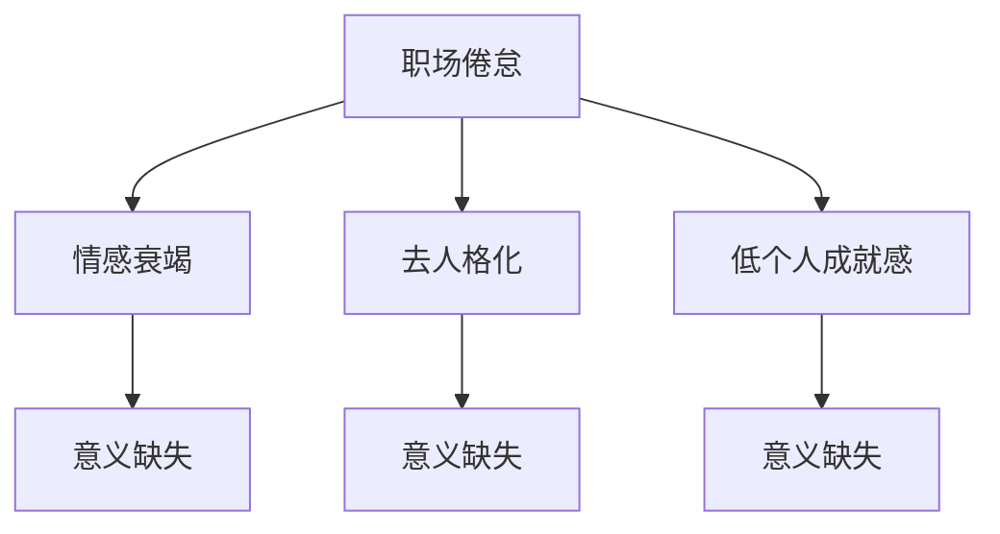

                 

### 第一步：理解文章主题和结构

首先，我们需要明确文章的主题是“现代职场中的意义缺失：从倦怠到使命感的重建”，旨在探讨职场倦怠和意义缺失的问题，并提供解决策略和重建使命感的步骤。

文章结构分为六个部分：

1. **问题背景与核心概念**：介绍职场倦怠和意义缺失的定义、成因及其影响。
2. **核心概念与联系**：分析职场倦怠与意义缺失之间的联系，使用对比表格和ER图进行说明。
3. **从倦怠到使命感的重建**：探讨倦怠管理的理论基础，使命感的定义和特点，以及重建使命感的步骤与方法。
4. **具体案例分析**：通过实际案例展示如何应对职场倦怠和找回使命感。
5. **职场倦怠与意义缺失的管理策略**：从企业和个人层面提供管理策略。
6. **未来展望与建议**：对职场倦怠和意义缺失的未来趋势进行展望，并提供相关建议。

### 第二步：撰写引言部分

引言部分应该简洁明了地介绍文章的主题和目的，吸引读者的注意力。

**引言：**

在快节奏、高压力的现代职场中，越来越多的职场人感受到了倦怠和意义缺失。这不仅影响了个人职业发展，也对企业产生了负面影响。本文将深入探讨职场倦怠和意义缺失的概念，分析其联系，并提供从倦怠到使命感重建的步骤和方法。通过具体案例分析，我们将找到解决这些问题的实际途径，并为未来的职场生活提供有益的建议。

### 第三步：详细阐述问题背景与核心概念

在这一部分，我们需要详细解释职场倦怠和意义缺失的概念，包括它们的定义、成因、影响以及它们之间的联系。

**第1章：问题背景与核心概念**

**第1.1节：职场倦怠与意义缺失**

**1.1.1 职场倦怠**

职场倦怠是指个体在长期的工作压力下，产生的一种情感、行为和认知上的疲惫状态。其表现为情感衰竭、去人格化和低个人成就感。职场倦怠的成因包括工作过度、缺乏支持、角色冲突、缺乏控制感和不确定性等。职场倦怠对职场人的影响包括降低工作效率、增加离职率、影响身心健康等。

**1.1.2 意义缺失**

意义缺失是指个体在工作中感到自己的工作缺乏意义和价值，从而导致心理上的疏离和不满。意义缺失的成因包括工作与个人价值观不符、工作内容单调、缺乏成就感等。意义缺失的影响包括降低工作积极性、增加离职意愿、影响工作质量和职业发展等。

**第1.2节：核心概念与联系**

**1.2.1 职场倦怠与意义缺失的联系**

职场倦怠和意义缺失之间存在密切的联系。一方面，长期的工作压力和过度的职业要求可能导致职场倦怠，进而引发意义缺失。另一方面，意义缺失可能导致职场人感到工作无意义，进一步加剧职场倦怠。两者相互影响，形成恶性循环。

### 第四步：使用Mermaid流程图和表格

在这一部分，我们将使用Mermaid流程图和表格来展示职场倦怠和意义缺失的概念和联系。

**1.2.2 Mermaid流程图与表格**

下面是一个Mermaid流程图，展示了职场倦怠和意义缺失之间的联系：

下面是一个核心概念属性特征对比表格：

| 特征         | 职场倦怠                  | 意义缺失                  |
| ------------ | -------------------------- | -------------------------- |
| 定义         | 持久性的工作压力导致的疲惫 | 工作缺乏意义和价值感       |
| 成因         | 工作过度、缺乏支持等       | 个人价值观与工作不符等     |
| 影响         | 降低工作效率、增加离职率   | 降低工作积极性、增加离职意愿 |
| 表现         | 情感衰竭、去人格化、低成就感 | 心理疏离、不满             |

### 第五步：探讨从倦怠到使命感的重建

在这一部分，我们将探讨倦怠管理的理论基础、使命感的定义和特点，以及重建使命感的步骤和方法。

**第3章：从倦怠到使命感的重建**

**3.1 倦怠管理的理论基础**

倦怠管理需要遵循以下核心原则：

- **平衡工作与生活**：合理安排工作时间，确保工作和生活的平衡。
- **提供心理支持**：建立支持性的人际关系，提供心理辅导和咨询服务。
- **提高工作效率**：通过时间管理和任务分配，提高工作效率和成就感。

**3.2 使命感的定义与特点**

使命感是指个体在工作或生活中感到自己的工作具有深远的意义和价值。其特点包括：

- **明确的目标**：使命感使个体具有明确的目标和方向。
- **内在驱动**：使命感源于个体的内在需求，而非外在奖励。
- **持续的动力**：使命感为个体提供持续的动力，使其在面对困难时保持积极。

**3.3 重建使命感的步骤与方法**

重建使命感的步骤包括：

- **自我认知与反思**：通过反思和自我认知，了解自己的价值观和兴趣。
- **寻找使命的方向**：探索和发现与个人价值观相符的使命。
- **培养使命感**：通过持续的努力和实践，培养和强化使命感。
- **实践与应用**：将使命感应用到实际工作和生活中，实现个人成长和价值。

### 第六步：提供具体案例分析

在这一部分，我们将通过具体案例分析，展示如何应对职场倦怠和找回使命感。

**第4章：具体案例分析**

**4.1 如何应对职场倦怠**

**案例背景**：小明是一名软件工程师，由于长时间的工作压力，他感到非常疲惫和倦怠。

**问题分析**：小明的工作压力主要来自于项目进度紧张、任务繁重和缺乏团队合作。

**解决方案与实施**：小明采取了一系列措施，包括合理分配工作时间、寻求团队支持、进行心理辅导等。

**结果评估与反思**：通过这些措施，小明的工作效率和情绪得到了显著改善，他开始重新找到工作的意义和价值。

**4.2 如何找回使命感**

**案例背景**：小李是一名产品经理，由于工作缺乏成就感，他感到自己失去了使命感。

**问题分析**：小李的工作主要面临竞争压力和目标不明确的问题。

**解决方案与实施**：小李通过反思和自我认知，找到了与个人价值观相符的使命，并制定了明确的目标和计划。

**结果评估与反思**：小李开始重新找到工作的意义和价值，他的工作热情和成就感得到了显著提升。

### 第七步：提供管理策略

在这一部分，我们将从企业和个人层面提供管理策略，以应对职场倦怠和意义缺失。

**第5章：职场倦怠与意义缺失的管理策略**

**5.1 企业层面的管理策略**

企业可以采取以下措施来应对职场倦怠和意义缺失：

- **营造积极的工作环境**：提供良好的工作条件，鼓励员工参与决策。
- **制定合理的激励机制**：通过奖励和晋升制度，激励员工的工作积极性。
- **提供心理支持与辅导**：建立心理支持系统，为员工提供咨询服务。

**5.2 个人层面的管理策略**

个人可以采取以下措施来应对职场倦怠和意义缺失：

- **建立健康的工作与生活平衡**：合理安排时间，确保工作和生活的平衡。
- **提升个人职业素养**：通过学习和培训，提升个人能力和职业素养。
- **持续学习与自我提升**：保持好奇心和学习热情，不断探索新领域。

### 第八步：展望未来

在这一部分，我们将对职场倦怠和意义缺失的未来趋势进行展望，并提供相关建议。

**第6章：未来展望与建议**

**6.1 未来职场的发展趋势**

未来职场将面临以下趋势：

- **数字化与智能化**：随着技术的不断发展，数字化和智能化将成为职场的主要特征。
- **灵活工作制**：灵活的工作制度将更加普及，为员工提供更多选择。
- **跨界融合**：不同领域之间的融合将加速，为员工提供更多机会。

**6.2 对职场倦怠与意义缺失的展望**

面对未来职场的发展，职场倦怠和意义缺失可能会面临以下挑战：

- **工作压力增大**：随着工作节奏的加快，员工可能会面临更大的工作压力。
- **职业发展困境**：跨界融合可能会使员工在职业发展上面临更多困境。

**6.3 总结与建议**

为了应对这些挑战，企业和个人可以采取以下措施：

- **提升管理能力**：企业需要不断提升管理能力，应对员工的需求和期望。
- **注重心理健康**：个人需要关注自己的心理健康，保持积极的心态。

### 第九步：撰写总结和作者信息

在文章的结尾部分，我们需要总结文章的主要内容和观点，并写上作者信息。

**总结：**

本文深入探讨了现代职场中的意义缺失和职场倦怠问题，分析了两者之间的联系，并提供了从倦怠到使命感重建的步骤和方法。通过具体案例分析，我们展示了如何应对职场倦怠和找回使命感。同时，我们提出了企业和个人层面的管理策略，以应对职场倦怠和意义缺失。未来，随着数字化和智能化的趋势，职场将面临新的挑战，我们需要不断提升管理能力和关注心理健康，以应对这些挑战。

**作者信息：**

作者：AI天才研究院/AI Genius Institute & 禅与计算机程序设计艺术 /Zen And The Art of Computer Programming

---

在撰写文章时，我们将严格按照上述步骤进行，确保文章内容丰富、结构清晰，并符合文章目录大纲的要求。同时，我们将使用Markdown格式和Mermaid流程图，以增强文章的可读性和可视化效果。

