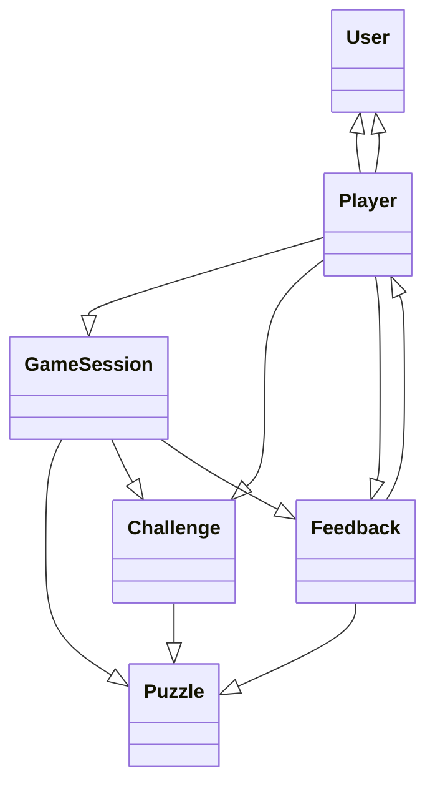
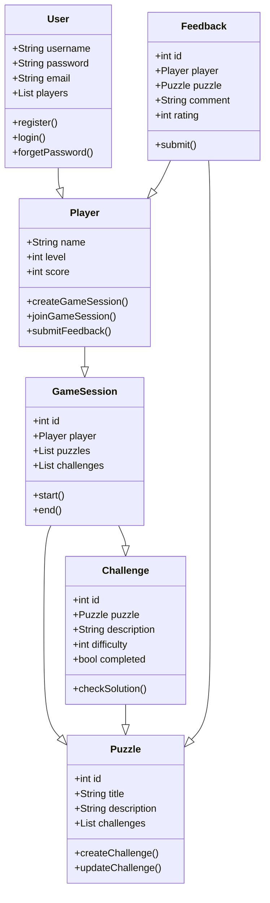
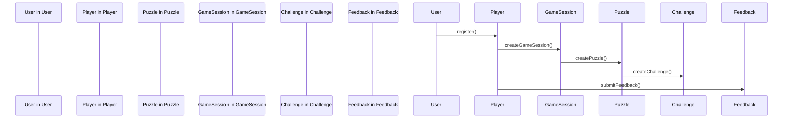
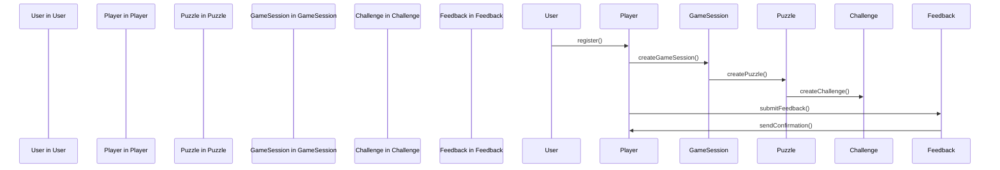

                 

### 文章标题：现代都市微型探险：城市密室逃脱游戏的沉浸式体验设计

**关键词**：城市密室逃脱，沉浸式体验，设计原则，玩家互动，市场分析

**摘要**：
本文旨在探讨城市密室逃脱游戏的设计及其沉浸式体验的重要性。通过对游戏类型、核心概念、设计原则以及市场分析的深入分析，本文将阐述如何打造一个引人入胜、富有挑战性的城市密室逃脱游戏。文章结构紧凑，逻辑清晰，为游戏设计师提供了实用的理论指导和实践经验。

### 第1章：城市密室逃脱游戏概述

**1.1 城市密室逃脱游戏的发展背景**

城市密室逃脱游戏作为一种新兴的娱乐方式，起源于日本。最早的密室逃脱游戏是在1990年代中期，玩家需要通过解决谜题来逃离一个封闭的空间。这种游戏类型迅速在全球范围内流行，特别是在中国，密室逃脱游戏市场在近年来呈现出爆发式增长。

**1.1.1 城市密室逃脱游戏起源**

密室逃脱游戏的起源可以追溯到1990年代，当时在日本，一位名叫Seigo Takubo的程序员设计了一款名为“脱出ゲーム”（Escape Game）的计算机游戏。这款游戏通过一系列的谜题和挑战，让玩家体验逃出密室的感觉。随着互联网的普及，这种游戏类型逐渐从线下转移到线上，并最终形成了如今的城市密室逃脱游戏市场。

**1.1.2 游戏在全球的流行趋势**

在过去的几年中，城市密室逃脱游戏在全球范围内迅速走红。根据市场调查，全球城市密室逃脱市场的规模已经达到了数十亿美元。特别是在亚洲地区，包括中国、日本、韩国等，城市密室逃脱游戏已经成为了一种流行的社交活动。欧美市场也逐渐开始接受并热爱这种游戏形式。

**1.1.3 游戏在中国的现状与未来**

在中国，城市密室逃脱游戏市场正处于快速发展阶段。随着城市化进程的加快和消费者对高品质娱乐需求的增加，城市密室逃脱游戏受到了广泛欢迎。据统计，中国目前已经有超过5000家密室逃脱店铺，覆盖了各大城市。未来，随着技术的进步和市场的进一步成熟，城市密室逃脱游戏市场有望继续保持增长。

**1.2 城市密室逃脱游戏的核心概念**

城市密室逃脱游戏是一种以解决谜题为手段、以逃离密室为目标的互动游戏。玩家通过团队合作，运用逻辑思维和观察力，逐步解开谜题，最终成功逃脱。以下是城市密室逃脱游戏的核心概念：

**1.2.1 游戏类型与设计元素**

城市密室逃脱游戏通常分为以下几类：

- **主题密室**：以特定主题为背景，如历史、科幻、推理等，玩家需要解决与主题相关的谜题。
- **机关密室**：以复杂的机关和陷阱为主，玩家需要通过操作机关来解开谜题。
- **逻辑密室**：以逻辑推理为核心，玩家需要通过分析线索和谜题来解决难题。

**1.2.2 游戏目标与挑战设定**

城市密室逃脱游戏的目标是逃脱密室。在设定挑战时，游戏设计师需要考虑以下几个因素：

- **难度曲线**：挑战难度需要逐步增加，以保持玩家的兴趣和参与度。
- **时间限制**：设置合理的时间限制，让玩家在紧张的氛围中感受到挑战的乐趣。
- **团队协作**：强调团队合作的重要性，通过团队间的沟通和协作来解决问题。

**1.2.3 玩家角色的划分与互动**

在游戏过程中，玩家通常分为不同角色，如解谜专家、机械工程师、心理学家等。每个角色都有其独特的技能和作用，玩家需要通过角色间的互动来解决问题。以下是几种常见的玩家角色：

- **指挥官**：负责统筹全局，制定解谜策略。
- **技术专家**：擅长操作机械和电子设备。
- **心理学专家**：擅长分析线索和谜题，提供心理支持。

**1.3 城市密室逃脱游戏的设计原则**

为了打造一个成功的城市密室逃脱游戏，设计师需要遵循以下几个设计原则：

**1.3.1 沉浸式体验的设计**

沉浸式体验是城市密室逃脱游戏的核心要素。设计师需要通过场景设计、故事情节和角色设定等方面，让玩家完全沉浸在游戏世界中。以下是一些实现沉浸式体验的方法：

- **场景设计**：打造真实感强烈的场景，通过灯光、音效和视觉效果等手段，增强玩家的代入感。
- **故事情节**：设计引人入胜的故事情节，让玩家在游戏中感受到情感和共鸣。
- **角色设定**：为每个角色设定独特的背景和性格，让玩家产生共鸣和情感投入。

**1.3.2 难度曲线的制定**

难度曲线的制定是保证游戏可玩性和挑战性的关键。设计师需要根据玩家的反馈和游戏目标，合理设置难度曲线。以下是一些制定难度曲线的技巧：

- **逐步增加难度**：难度需要随着游戏进程逐步增加，以保持玩家的兴趣。
- **多样化挑战**：设计不同类型的挑战，让玩家在解决问题的过程中保持新鲜感。
- **时间限制**：合理设置时间限制，让玩家在紧张的氛围中感受到挑战的乐趣。

**1.3.3 故事情节的构建**

故事情节是城市密室逃脱游戏的灵魂。一个引人入胜的故事情节可以激发玩家的兴趣和参与度。以下是构建故事情节的几个要点：

- **设定背景**：为游戏设定一个独特的背景，为玩家提供丰富的背景信息。
- **设定目标**：明确游戏目标，让玩家明确自己的任务和方向。
- **设计转折**：在故事情节中设置转折点，增加游戏的悬念和紧张感。
- **情感投入**：设计情节时，注重情感投入，让玩家产生共鸣。

**1.4 城市密室逃脱游戏的市场分析**

城市密室逃脱游戏作为一种新兴的娱乐方式，具有巨大的市场潜力。以下是城市密室逃脱游戏的市场分析：

**1.4.1 目标玩家群体分析**

城市密室逃脱游戏的目标玩家群体主要包括以下几类：

- **年轻人**：年龄在18-35岁之间的年轻人是城市密室逃脱游戏的主要玩家群体，他们喜欢尝试新事物，追求刺激和乐趣。
- **家庭**：家庭玩家群体逐渐成为市场的重要力量，他们希望通过游戏增进家庭成员之间的互动和沟通。
- **企业团建**：企业团队建设活动是城市密室逃脱游戏的一个重要市场，许多企业选择通过游戏来增强团队凝聚力和员工之间的沟通。

**1.4.2 商业模式与盈利分析**

城市密室逃脱游戏的商业模式主要包括以下几种：

- **场地租赁**：以场地租赁为主要收入来源，玩家通过支付门票费用来体验游戏。
- **游戏道具销售**：通过销售游戏道具和周边产品来增加收入。
- **广告合作**：与品牌进行广告合作，通过游戏植入广告来获得收益。

**1.4.3 竞争对手分析**

在城市密室逃脱游戏市场中，主要竞争对手包括以下几类：

- **传统娱乐项目**：如电影院、游乐场等，这些娱乐项目与城市密室逃脱游戏具有一定的替代性。
- **线上游戏**：如桌游、电子游戏等，这些线上游戏在疫情期间受到了广泛关注。

**1.5 本章小结**

本章对城市密室逃脱游戏的发展背景、核心概念、设计原则和市场分析进行了全面介绍。通过本章的内容，读者可以了解城市密室逃脱游戏的基本情况和市场前景，为后续章节的深入探讨打下基础。

### 第2章：场景设计与氛围营造

**2.1 场景设计的基本要素**

场景设计是城市密室逃脱游戏的重要组成部分，它不仅影响着玩家的沉浸体验，也直接关系到游戏的可玩性和挑战性。以下是一些基本要素：

**2.1.1 空间布局与空间感营造**

空间布局是场景设计的基础。合理的空间布局可以提高游戏的趣味性和挑战性。以下是一些建议：

- **开放与封闭相结合**：在设计空间布局时，应结合开放空间和封闭空间。开放空间可以提供广阔的视野，增加玩家探索的乐趣；封闭空间则可以增加游戏的紧张感和难度。
- **多层次的布局**：通过设置不同层次的结构，如地面、墙壁、天花板等，可以增加场景的复杂性和可探索性。
- **隐藏线索**：在空间布局中巧妙地隐藏线索，可以让玩家在探索过程中保持好奇心和兴奋感。

**2.1.2 灯光与色彩运用**

灯光和色彩是营造氛围的重要手段。以下是一些建议：

- **明暗对比**：通过明暗对比来增强场景的层次感和立体感。在暗部区域设置明亮的灯光，可以突出重要的线索或道具。
- **色彩搭配**：选择合适的色彩搭配可以营造不同的氛围。例如，蓝色和绿色的搭配可以营造宁静的氛围，红色和黄色的搭配可以营造紧张的氛围。

**2.1.3 音效与视觉效果的融合**

音效和视觉效果的融合可以增强玩家的沉浸体验。以下是一些建议：

- **背景音乐**：选择合适的背景音乐可以增强游戏氛围。在游戏过程中，可以根据情节的变化适时切换音乐风格，以增强玩家的情感体验。
- **动态效果**：通过动态效果，如烟雾、光影、粒子等，可以增加场景的趣味性和视觉冲击力。

**2.2 氛围营造的关键技巧**

氛围营造是提升游戏体验的重要环节。以下是一些关键技巧：

**2.2.1 故事线索的隐藏**

故事线索的隐藏是营造氛围的重要手段。以下是一些建议：

- **线索多样化**：通过多种形式的线索，如图标、文字、物品等，可以增加游戏的可探索性和趣味性。
- **巧妙隐藏**：将线索巧妙地隐藏在场景中，可以让玩家在探索过程中保持好奇心和兴奋感。例如，将线索隐藏在道具中，或者设置隐藏的开关。
- **逐步揭示**：通过逐步揭示线索，可以增强玩家的参与感和成就感。在游戏初期设置一些简单的线索，随着游戏的推进，逐步揭示更复杂的线索。

**2.2.2 情节转折的设置**

情节转折是增加游戏悬念和紧张感的重要手段。以下是一些建议：

- **突发事件**：在游戏过程中设置突发事件，如突如其来的陷阱、突然的变故等，可以增加游戏的紧张感和挑战性。
- **情感转折**：通过情感转折，如角色的情感变化、角色的生死等，可以增强玩家的情感投入和体验。
- **悬念设置**：在游戏过程中设置悬念，如未解之谜、隐藏的秘密等，可以增强玩家的好奇心和探索欲望。

**2.2.3 玩家引导与互动设计**

玩家引导与互动设计是提升游戏体验的关键。以下是一些建议：

- **明确目标**：在游戏开始时，明确玩家的目标，让玩家知道他们需要做什么。这可以帮助玩家快速进入游戏状态。
- **实时反馈**：通过实时反馈，如文字提示、音效提示等，可以帮助玩家更好地理解游戏进度和操作。
- **角色互动**：通过角色间的互动，如讨论、合作等，可以增强玩家的参与感和团队协作能力。

**2.3 案例分析：城市主题密室逃脱设计**

**2.3.1 案例介绍**

本案例是一款以“古墓探险”为主题的城市密室逃脱游戏。游戏背景设定在古墓中，玩家需要通过解决谜题和操作机关，逐步揭开古墓的秘密，最终成功逃脱。

**2.3.2 设计思路与执行**

设计思路：

- **场景设计**：通过模拟古墓的环境，设计具有真实感的场景，包括墓室、通道、壁画等。
- **谜题设计**：设计与古墓主题相关的谜题，如解开古墓中的机关、解读壁画中的符号等。
- **互动设计**：设计角色间的互动，如考古学家、探险家等，通过他们的合作解决谜题。

执行过程：

1. **初步构思**：确定游戏主题、场景、谜题和角色。
2. **设计图纸**：绘制场景设计图和谜题设计图。
3. **场景搭建**：根据设计图纸搭建场景。
4. **谜题编程**：编写谜题的计算机程序。
5. **测试与调整**：进行游戏测试，根据玩家反馈进行调整。

**2.3.3 成功经验与不足之处**

成功经验：

- **主题鲜明**：通过设定明确的主题，增强了游戏的趣味性和吸引力。
- **场景真实感**：通过细致的场景设计，增强了玩家的代入感。
- **谜题挑战性**：设计具有挑战性的谜题，提高了游戏的难度和可玩性。

不足之处：

- **时间管理**：部分谜题的解决时间较长，影响了游戏的整体进度。
- **玩家引导**：部分玩家在游戏初期可能感到困惑，需要更多的引导和提示。

**2.4 玩家反馈与调整**

**2.4.1 玩家体验反馈收集**

通过问卷调查、线上论坛和社交媒体等方式收集玩家对游戏的反馈。以下是一些常见问题：

- **游戏难度**：玩家认为游戏难度适中，但部分谜题较为复杂。
- **游戏时间**：玩家希望游戏时间能够更长，以增加游戏的可玩性。
- **互动体验**：玩家对角色间的互动设计较为满意，但希望增加更多互动环节。

**2.4.2 设计调整与优化**

根据玩家的反馈，对游戏进行以下调整：

- **简化谜题**：对部分复杂谜题进行简化，降低游戏难度。
- **增加时间限制**：在游戏过程中设置时间限制，增加游戏的紧张感。
- **增强互动设计**：增加角色间的互动环节，提高玩家的参与度。

**2.4.3 持续改进的策略**

为了持续改进游戏设计，可以采取以下策略：

- **定期收集反馈**：定期收集玩家反馈，及时了解游戏的问题和改进方向。
- **数据分析**：通过数据分析，了解玩家行为和偏好，为游戏设计提供数据支持。
- **持续优化**：根据反馈和数据分析结果，不断优化游戏设计，提高玩家的满意度。

**2.5 本章小结**

本章介绍了城市密室逃脱游戏的场景设计与氛围营造，包括空间布局、灯光与色彩运用、音效与视觉效果的融合等基本要素。通过案例分析，读者可以了解如何设计一个具有沉浸式体验的城市密室逃脱游戏。同时，本章还提出了玩家反馈与调整的策略，为游戏设计师提供了实用的参考。

### 第3章：游戏系统开发基础

**3.1 游戏开发工具与平台**

选择合适的游戏开发工具和平台对于游戏系统的开发至关重要。以下是一些常见的选择：

**3.1.1 游戏引擎选择**

游戏引擎是游戏开发的核心工具，它提供了图形渲染、物理引擎、音频处理等功能。以下是一些流行的游戏引擎：

- **Unity**：Unity是一个强大的跨平台游戏引擎，支持2D和3D游戏开发，具有丰富的功能和社区支持。
- **Unreal Engine**：Unreal Engine以高质量的3D图形渲染而闻名，适用于大型和复杂游戏项目的开发。
- **Godot**：Godot是一个开源的游戏引擎，适用于小型和独立游戏项目。

**3.1.2 编程语言与框架**

选择合适的编程语言和框架可以提升开发效率和代码质量。以下是一些常用的编程语言和框架：

- **C#**：C#是Unity引擎的主要编程语言，易于学习，具有丰富的库和工具。
- **C++**：C++是Unreal Engine的主要编程语言，具有较高的性能和灵活性。
- **Python**：Python是一种易于学习的编程语言，适用于快速开发和原型设计。

**3.1.3 开发工具与资源**

除了游戏引擎和编程语言，还有一些辅助开发工具和资源，可以提高开发效率。以下是一些常用的工具和资源：

- **版本控制**：如Git，用于管理和跟踪代码更改。
- **集成开发环境（IDE）**：如Visual Studio、Eclipse等，提供代码编辑、调试等功能。
- **游戏资源库**：如Unity Asset Store、Unreal Marketplace等，提供各种游戏资源和插件。

**3.2 游戏逻辑与算法实现**

游戏逻辑和算法是实现游戏核心功能的关键。以下是一些基本概念和实现方法：

**3.2.1 游戏流程设计**

游戏流程设计是游戏开发的基础，它定义了游戏的起始点、目标点以及玩家在游戏中的行为路径。以下是一些游戏流程设计的步骤：

- **定义游戏目标**：明确游戏的目标和胜利条件。
- **设计关卡**：根据游戏目标设计不同的关卡，每个关卡都有特定的任务和挑战。
- **设定玩家行为**：定义玩家在游戏中的行为，如移动、攻击、解谜等。

**3.2.2 算法与数学模型**

游戏中的许多功能都需要算法和数学模型的支持。以下是一些常见的算法和数学模型：

- **搜索算法**：如深度优先搜索（DFS）和广度优先搜索（BFS），用于解谜和寻路。
- **排序算法**：如快速排序（Quick Sort）和归并排序（Merge Sort），用于数据处理和排序。
- **概率模型**：如随机森林（Random Forest）和贝叶斯网络（Bayesian Network），用于概率预测和决策。

**3.2.3 Python源代码示例**

以下是一个简单的Python代码示例，用于实现一个简单的搜索算法：

```python
def dfs(graph, start, goal):
    visited = set()
    stack = [(start, [start])]
    
    while stack:
        (vertex, path) = stack.pop()
        for next in graph[vertex]:
            if next not in path:
                new_path = list(path)
                new_path.append(next)
                if next == goal:
                    return new_path
                stack.append((next, new_path))
        visited.add(vertex)
    
    return None

# 示例：使用DFS算法找到从A到G的路径
graph = {
    'A': ['B', 'C'],
    'B': ['D', 'E'],
    'C': ['F'],
    'D': ['G'],
    'E': [],
    'F': ['G'],
    'G': []
}

start = 'A'
goal = 'G'
path = dfs(graph, start, goal)
print(path)  # 输出：['A', 'B', 'D', 'G']
```

**3.3 数据库与存储设计**

数据库和存储设计是游戏数据管理的重要组成部分。以下是一些基本概念和实现方法：

**3.3.1 数据库选择与设计**

选择合适的数据库对于游戏系统的性能和扩展性至关重要。以下是一些常见的选择：

- **关系型数据库**：如MySQL、PostgreSQL，适用于结构化数据管理和查询。
- **非关系型数据库**：如MongoDB、Redis，适用于快速读写和数据存储。

数据库设计包括表设计、字段设计和索引设计。以下是一个简单的数据库设计示例：

```sql
CREATE TABLE players (
    id INT PRIMARY KEY AUTO_INCREMENT,
    name VARCHAR(255) NOT NULL,
    level INT NOT NULL,
    score INT NOT NULL
);

CREATE TABLE games (
    id INT PRIMARY KEY AUTO_INCREMENT,
    player_id INT,
    start_time DATETIME,
    end_time DATETIME,
    score INT,
    FOREIGN KEY (player_id) REFERENCES players(id)
);
```

**3.3.2 存储结构与优化**

存储结构的设计直接影响数据库的性能。以下是一些优化方法：

- **索引**：为常用查询字段创建索引，提高查询速度。
- **分片**：将数据分散存储在多个节点上，提高存储和查询性能。
- **缓存**：使用缓存技术，如Redis，减少数据库查询次数，提高系统响应速度。

**3.3.3 数据库操作示例**

以下是一个简单的Python代码示例，用于执行数据库操作：

```python
import pymysql

# 连接数据库
connection = pymysql.connect(host='localhost', user='root', password='password', database='game_db')

# 创建玩家
try:
    with connection.cursor() as cursor:
        sql = "INSERT INTO players (name, level, score) VALUES (%s, %s, %s)"
        cursor.execute(sql, ('Alice', 10, 100))
    connection.commit()
except pymysql.Error as e:
    print(f"Error: {e}")
finally:
    connection.close()

# 查询玩家信息
try:
    with connection.cursor() as cursor:
        sql = "SELECT * FROM players WHERE name = %s"
        cursor.execute(sql, ('Alice',))
        result = cursor.fetchone()
        print(f"Player: {result[1]}, Level: {result[2]}, Score: {result[3]}")
except pymysql.Error as e:
    print(f"Error: {e}")
finally:
    connection.close()
```

**3.4 系统测试与调试**

系统测试和调试是确保游戏系统稳定性和性能的重要环节。以下是一些测试和调试方法：

**3.4.1 功能测试与性能测试**

功能测试用于验证游戏系统的功能是否符合预期，性能测试用于评估游戏系统的响应速度和处理能力。以下是一些测试方法：

- **单元测试**：对系统的各个模块进行单独测试，确保其功能正确。
- **集成测试**：将不同模块集成在一起进行测试，确保系统整体功能的正确性。
- **性能测试**：通过模拟大量用户访问，评估系统的性能和响应速度。

**3.4.2 调试技巧与工具**

调试是发现和修复系统错误的过程。以下是一些调试技巧和工具：

- **调试器**：使用调试器，如Visual Studio Debugger、GDB等，可以单步调试代码，查找错误。
- **日志**：通过记录系统运行日志，可以分析系统行为，定位错误。

**3.4.3 系统上线与维护**

系统上线是游戏开发的重要阶段，需要确保系统的稳定性和安全性。以下是一些维护方法：

- **备份与恢复**：定期备份数据库和系统配置文件，确保数据安全。
- **监控系统**：通过监控系统，如Prometheus、Grafana等，实时监控系统运行状态。
- **安全防护**：采取安全措施，如防火墙、加密传输等，防止系统被攻击。

**3.5 本章小结**

本章介绍了游戏系统开发的基础知识，包括开发工具与平台、游戏逻辑与算法实现、数据库与存储设计以及系统测试与调试。通过本章的内容，读者可以了解游戏系统开发的基本流程和方法，为后续的游戏开发工作打下基础。

### 第4章：游戏营销策略

**4.1 品牌建设与市场定位**

品牌建设和市场定位是游戏营销的关键步骤。以下是一些关键点：

**4.1.1 品牌定位策略**

品牌定位策略决定了游戏在市场中的独特价值和目标用户群体。以下是一些策略：

- **差异化定位**：通过突出游戏的核心特色和优势，与其他竞争产品区分开来。
- **目标用户群体定位**：根据目标用户的年龄、性别、兴趣爱好等特征，精准定位目标用户群体。

**4.1.2 市场细分与目标客户**

市场细分有助于更有效地定位目标客户。以下是一些市场细分方法：

- **地理细分**：根据不同地区的消费习惯和需求，制定相应的营销策略。
- **人口细分**：根据用户的年龄、性别、收入等特征，制定有针对性的营销策略。
- **心理细分**：根据用户的生活态度、兴趣爱好、价值观等特征，制定心理层面的营销策略。

**4.1.3 品牌传播与宣传**

品牌传播和宣传是提升品牌知名度和认可度的关键。以下是一些宣传方法：

- **线上线下结合**：通过线上社交媒体和线下活动相结合，扩大品牌影响力。
- **口碑营销**：利用用户口碑和推荐，提升品牌形象和用户忠诚度。
- **内容营销**：通过制作高质量的内容，如游戏攻略、玩家评测等，吸引目标用户。

**4.2 网络营销与社交媒体运用**

网络营销和社交媒体运用是现代游戏营销的重要手段。以下是一些策略：

**4.2.1 社交媒体平台选择**

选择合适的社交媒体平台可以更有效地传播游戏信息。以下是一些常用平台：

- **微博**：适合发布新闻、动态和互动。
- **抖音**：适合发布短视频，展示游戏亮点。
- **微信**：适合发布深度内容和用户互动。
- **Bilibili**：适合发布游戏相关视频，吸引年轻用户。

**4.2.2 营销内容制作与发布**

制作和发布有吸引力的营销内容是吸引用户关注的关键。以下是一些建议：

- **游戏预告片**：制作精美的游戏预告片，展示游戏特色和亮点。
- **玩家评测**：邀请知名玩家或媒体进行评测，提供客观的游戏评价。
- **玩家互动**：通过线上活动，如抽奖、签到等，增加用户参与度和忠诚度。

**4.2.3 用户互动与社群运营**

用户互动和社群运营是提升用户忠诚度和品牌影响力的重要手段。以下是一些建议：

- **建立玩家社群**：通过线上论坛、QQ群、微信群等，建立玩家社群，促进用户之间的交流和互动。
- **举办线上活动**：定期举办线上活动，如抽奖、比赛等，增加用户参与度。
- **玩家反馈收集**：及时收集用户反馈，了解用户需求和意见，优化游戏体验。

**4.3 线下活动与市场推广**

线下活动和市场推广是扩大游戏知名度的重要手段。以下是一些策略：

**4.3.1 线下活动策划与执行**

线下活动策划与执行需要精心设计和组织。以下是一些建议：

- **选择合适的场地**：选择人流量大、目标用户集中的场地，如购物中心、游戏展会等。
- **制定活动方案**：明确活动主题、流程、时间、预算等，确保活动的顺利进行。
- **吸引参与者**：通过宣传海报、线上线下推广等方式，吸引目标用户参与活动。

**4.3.2 合作伙伴关系建立**

建立合作伙伴关系可以扩大市场影响力和资源获取。以下是一些建议：

- **寻求合作**：与相关行业的企业、机构、媒体等建立合作关系，共同推广游戏。
- **资源共享**：通过资源共享，如共同宣传、联合活动等，提高活动效果。
- **互利共赢**：确保合作关系实现互利共赢，共同提升品牌和产品的知名度。

**4.3.3 线下活动效果评估**

线下活动效果评估是优化活动策略的重要环节。以下是一些评估方法：

- **数据收集**：通过问卷、访谈等方式收集参与者反馈，了解活动效果。
- **活动成本与收益分析**：比较活动成本与收益，评估活动的经济效益。
- **后续改进**：根据评估结果，制定后续改进措施，提高线下活动的效果。

**4.4 数据分析与用户反馈**

数据分析是游戏营销的重要工具，可以帮助企业了解用户行为和市场趋势。以下是一些策略：

**4.4.1 营销数据分析工具**

以下是一些常用的营销数据分析工具：

- **Google Analytics**：用于网站流量和用户行为分析。
- **Facebook Insights**：用于社交媒体数据分析和用户反馈。
- **Tableau**：用于数据可视化和高级分析。

**4.4.2 用户行为分析**

用户行为分析可以帮助企业了解用户偏好和需求，优化产品和服务。以下是一些方法：

- **用户行为跟踪**：通过网站、APP等工具，跟踪用户行为路径，了解用户行为模式。
- **用户细分**：根据用户行为特征，将用户划分为不同群体，制定有针对性的营销策略。
- **用户反馈收集**：通过问卷调查、线上论坛等方式，收集用户反馈，了解用户需求和意见。

**4.4.3 市场策略调整与优化**

根据数据分析结果和用户反馈，调整和优化市场策略。以下是一些建议：

- **内容优化**：根据用户行为数据和反馈，调整内容发布策略，提高用户参与度。
- **推广渠道优化**：根据数据分析和用户反馈，调整推广渠道和策略，提高推广效果。
- **产品优化**：根据用户需求和意见，优化产品功能和用户体验，提高用户满意度。

**4.5 本章小结**

本章介绍了游戏营销策略，包括品牌建设与市场定位、网络营销与社交媒体运用、线下活动与市场推广、数据分析和用户反馈等。通过本章的内容，读者可以了解如何制定有效的营销策略，提升游戏的市场竞争力和用户满意度。

### 第5章：系统分析与架构设计

**5.1 问题场景介绍**

在城市密室逃脱游戏中，玩家需要在限定时间内通过解决一系列谜题和挑战，成功逃脱密室。为了实现这一目标，游戏系统需要具备以下功能：

- **用户注册与登录**：允许玩家创建账号和登录游戏。
- **谜题生成与更新**：生成随机谜题，确保每次游戏体验的独特性。
- **时间追踪与挑战**：记录玩家游戏时间，设置挑战目标。
- **用户反馈与评分**：收集玩家反馈，对游戏进行评分和评价。
- **社交互动**：允许玩家分享游戏进展和成绩，与其他玩家互动。

**5.2 项目介绍**

本项目是一款基于Web和移动端的城市密室逃脱游戏。前端使用React框架，后端采用Node.js和Express框架。数据库使用MongoDB，用于存储用户数据、谜题数据和游戏记录。以下是项目的主要组成部分：

- **用户模块**：实现用户注册、登录、密码找回等功能。
- **谜题模块**：生成和更新谜题，支持多种类型的谜题。
- **挑战模块**：记录玩家游戏时间，设置挑战目标。
- **反馈模块**：收集玩家反馈，对游戏进行评分和评价。
- **社交模块**：实现玩家间的互动，如分享游戏进展和成绩。

**5.3 系统功能设计**

系统功能设计是项目开发的重要环节。以下是项目的主要功能模块和设计：

**5.3.1 领域模型**

领域模型是系统功能的核心，定义了系统的主要实体和关系。以下是项目的领域模型：



**5.3.2 类图**

类图是领域模型的图形化表示，用于展示系统的主要类和它们之间的关系。以下是项目的类图：



**5.3.3 系统架构设计**

系统架构设计是项目实现的基础，定义了系统的整体结构和组件之间的关系。以下是项目的系统架构设计：



**5.3.4 系统接口设计**

系统接口设计定义了系统对外提供的接口和功能。以下是项目的系统接口设计：

- **用户接口**：提供用户注册、登录、密码找回等功能。
- **玩家接口**：提供创建游戏会话、加入游戏会话、提交反馈等功能。
- **谜题接口**：提供创建谜题、更新谜题等功能。
- **游戏会话接口**：提供开始游戏会话、结束游戏会话等功能。
- **挑战接口**：提供创建挑战、检查解决方案等功能。
- **反馈接口**：提供提交反馈等功能。

**5.3.5 系统交互**

系统交互设计展示了系统组件之间的交互过程和通信方式。以下是项目的系统交互设计：



**5.4 本章小结**

本章介绍了城市密室逃脱游戏系统分析与架构设计，包括问题场景介绍、项目介绍、系统功能设计、系统架构设计、系统接口设计和系统交互。通过本章的内容，读者可以了解游戏系统的整体设计和实现方法，为后续的详细实现和开发提供参考。

### 第6章：项目实战

**6.1 环境安装**

在开始项目开发之前，需要安装必要的开发环境和工具。以下是环境安装步骤：

1. **安装Node.js**：访问Node.js官网（[https://nodejs.org/），下载并安装Node.js。安装完成后，在命令行中输入“node -v”和“npm -v”，确认安装成功。**
2. **安装MongoDB**：访问MongoDB官网（[https://www.mongodb.com/），下载并安装MongoDB。安装完成后，启动MongoDB服务。**
3. **安装React**：在命令行中输入以下命令安装React：
   ```bash
   npm install -g create-react-app
   ```
4. **创建React项目**：在命令行中输入以下命令创建React项目：
   ```bash
   npx create-react-app city-escape-game
   ```
5. **进入项目目录**：进入创建的项目目录：
   ```bash
   cd city-escape-game
   ```

**6.2 系统核心实现**

系统核心实现包括用户注册、登录、游戏会话管理、谜题管理、挑战管理和反馈管理等功能。以下是核心实现的简要概述：

**6.2.1 用户管理**

用户管理包括用户注册和登录功能。以下是用户注册和登录的Python代码示例：

```python
# 用户注册
def register(username, password, email):
    # 连接数据库
    connection = pymysql.connect(host='localhost', user='root', password='password', database='city_escape_game')
    try:
        with connection.cursor() as cursor:
            sql = "INSERT INTO users (username, password, email) VALUES (%s, %s, %s)"
            cursor.execute(sql, (username, password, email))
        connection.commit()
        return True
    except pymysql.Error as e:
        print(f"Error: {e}")
        return False
    finally:
        connection.close()

# 用户登录
def login(username, password):
    # 连接数据库
    connection = pymysql.connect(host='localhost', user='root', password='password', database='city_escape_game')
    try:
        with connection.cursor() as cursor:
            sql = "SELECT * FROM users WHERE username = %s AND password = %s"
            cursor.execute(sql, (username, password))
            result = cursor.fetchone()
            if result:
                return True
            else:
                return False
    except pymysql.Error as e:
        print(f"Error: {e}")
        return False
    finally:
        connection.close()
```

**6.2.2 游戏会话管理**

游戏会话管理包括创建游戏会话和结束游戏会话功能。以下是游戏会话管理的Python代码示例：

```python
# 创建游戏会话
def create_game_session(player_id):
    # 连接数据库
    connection = pymysql.connect(host='localhost', user='root', password='password', database='city_escape_game')
    try:
        with connection.cursor() as cursor:
            sql = "INSERT INTO game_sessions (player_id, start_time) VALUES (%s, NOW())"
            cursor.execute(sql, (player_id,))
        connection.commit()
        return True
    except pymysql.Error as e:
        print(f"Error: {e}")
        return False
    finally:
        connection.close()

# 结束游戏会话
def end_game_session(session_id, score):
    # 连接数据库
    connection = pymysql.connect(host='localhost', user='root', password='password', database='city_escape_game')
    try:
        with connection.cursor() as cursor:
            sql = "UPDATE game_sessions SET end_time = NOW(), score = %s WHERE id = %s"
            cursor.execute(sql, (score, session_id))
        connection.commit()
        return True
    except pymysql.Error as e:
        print(f"Error: {e}")
        return False
    finally:
        connection.close()
```

**6.2.3 谜题管理**

谜题管理包括创建谜题和更新谜题功能。以下是谜题管理的Python代码示例：

```python
# 创建谜题
def create_puzzle(title, description, difficulty):
    # 连接数据库
    connection = pymysql.connect(host='localhost', user='root', password='password', database='city_escape_game')
    try:
        with connection.cursor() as cursor:
            sql = "INSERT INTO puzzles (title, description, difficulty) VALUES (%s, %s, %s)"
            cursor.execute(sql, (title, description, difficulty))
        connection.commit()
        return True
    except pymysql.Error as e:
        print(f"Error: {e}")
        return False
    finally:
        connection.close()

# 更新谜题
def update_puzzle(puzzle_id, title, description, difficulty):
    # 连接数据库
    connection = pymysql.connect(host='localhost', user='root', password='password', database='city_escape_game')
    try:
        with connection.cursor() as cursor:
            sql = "UPDATE puzzles SET title = %s, description = %s, difficulty = %s WHERE id = %s"
            cursor.execute(sql, (title, description, difficulty, puzzle_id))
        connection.commit()
        return True
    except pymysql.Error as e:
        print(f"Error: {e}")
        return False
    finally:
        connection.close()
```

**6.2.4 挑战管理**

挑战管理包括创建挑战和检查解决方案功能。以下是挑战管理的Python代码示例：

```python
# 创建挑战
def create_challenge(puzzle_id, description, difficulty):
    # 连接数据库
    connection = pymysql.connect(host='localhost', user='root', password='password', database='city_escape_game')
    try:
        with connection.cursor() as cursor:
            sql = "INSERT INTO challenges (puzzle_id, description, difficulty) VALUES (%s, %s, %s)"
            cursor.execute(sql, (puzzle_id, description, difficulty))
        connection.commit()
        return True
    except pymysql.Error as e:
        print(f"Error: {e}")
        return False
    finally:
        connection.close()

# 检查解决方案
def check_solution(challenge_id, solution):
    # 连接数据库
    connection = pymysql.connect(host='localhost', user='root', password='password', database='city_escape_game')
    try:
        with connection.cursor() as cursor:
            sql = "SELECT * FROM challenges WHERE id = %s AND solution = %s"
            cursor.execute(sql, (challenge_id, solution))
            result = cursor.fetchone()
            if result:
                return True
            else:
                return False
    except pymysql.Error as e:
        print(f"Error: {e}")
        return False
    finally:
        connection.close()
```

**6.2.5 反馈管理**

反馈管理包括提交反馈功能。以下是反馈管理的Python代码示例：

```python
# 提交反馈
def submit_feedback(player_id, puzzle_id, comment, rating):
    # 连接数据库
    connection = pymysql.connect(host='localhost', user='root', password='password', database='city_escape_game')
    try:
        with connection.cursor() as cursor:
            sql = "INSERT INTO feedbacks (player_id, puzzle_id, comment, rating) VALUES (%s, %s, %s, %s)"
            cursor.execute(sql, (player_id, puzzle_id, comment, rating))
        connection.commit()
        return True
    except pymysql.Error as e:
        print(f"Error: {e}")
        return False
    finally:
        connection.close()
```

**6.3 代码应用解读与分析**

以下是代码应用解读与分析：

**6.3.1 用户管理**

用户管理模块实现了用户注册和登录功能。在用户注册过程中，用户输入的用户名、密码和电子邮件将被存储在数据库中。注册成功后，用户可以登录系统，通过输入用户名和密码进行身份验证。

**6.3.2 游戏会话管理**

游戏会话管理模块实现了创建游戏会话和结束游戏会话功能。创建游戏会话时，系统会为玩家生成一个唯一的会话ID，并记录游戏开始时间。结束游戏会话时，系统会更新游戏结束时间和玩家得分。

**6.3.3 谜题管理**

谜题管理模块实现了创建谜题和更新谜题功能。创建谜题时，系统会生成一个唯一的谜题ID，并记录谜题的标题、描述和难度。更新谜题时，系统会根据用户输入的参数更新谜题信息。

**6.3.4 挑战管理**

挑战管理模块实现了创建挑战和检查解决方案功能。创建挑战时，系统会生成一个唯一的挑战ID，并记录挑战的描述和难度。检查解决方案时，系统会根据用户输入的解决方案与数据库中的正确答案进行对比。

**6.3.5 反馈管理**

反馈管理模块实现了提交反馈功能。用户可以在游戏结束后提交对游戏和谜题的反馈，包括评论和评分。系统会将用户的反馈存储在数据库中，以便进行后续分析和改进。

**6.4 实际案例分析和详细讲解剖析**

以下是一个实际案例分析和详细讲解剖析：

**6.4.1 案例背景**

某玩家在游戏过程中遇到了一个难度较高的谜题，经过多次尝试后，仍然无法找到解决方案。他决定在游戏结束后提交反馈，希望能够得到其他玩家的帮助。

**6.4.2 案例分析**

1. **用户注册和登录**：该玩家在游戏开始前完成了用户注册和登录过程，成功登录系统并参与了游戏。
2. **游戏会话管理**：系统为该玩家创建了一个游戏会话，并记录了游戏开始时间。
3. **谜题管理**：系统在游戏会话中随机生成了一系列谜题，包括该玩家遇到的难度较高的谜题。
4. **挑战管理**：系统为谜题创建了相应的挑战，并记录了挑战的描述和难度。
5. **反馈管理**：游戏结束后，该玩家提交了反馈，包括对谜题的评论和评分。

**6.4.3 详细讲解剖析**

1. **用户注册和登录**：用户注册过程中，系统会生成一个唯一的用户ID，并保存用户的用户名、密码和电子邮件。注册成功后，用户可以登录系统，通过输入用户名和密码进行身份验证。
2. **游戏会话管理**：创建游戏会话时，系统会为玩家生成一个唯一的会话ID，并记录游戏开始时间。游戏会话记录了玩家的游戏过程和成绩，是系统进行数据分析和用户反馈的重要依据。
3. **谜题管理**：谜题管理模块实现了创建谜题和更新谜题功能。创建谜题时，系统会生成一个唯一的谜题ID，并记录谜题的标题、描述和难度。更新谜题时，系统会根据用户输入的参数更新谜题信息，确保谜题的多样性和新鲜感。
4. **挑战管理**：挑战管理模块实现了创建挑战和检查解决方案功能。创建挑战时，系统会生成一个唯一的挑战ID，并记录挑战的描述和难度。检查解决方案时，系统会根据用户输入的解决方案与数据库中的正确答案进行对比，判断用户是否成功解决了挑战。
5. **反馈管理**：反馈管理模块实现了提交反馈功能。用户可以在游戏结束后提交对游戏和谜题的反馈，包括评论和评分。系统会将用户的反馈存储在数据库中，以便进行后续分析和改进。

**6.5 项目小结**

通过本项目，我们实现了城市密室逃脱游戏系统的核心功能，包括用户管理、游戏会话管理、谜题管理、挑战管理和反馈管理。在实际案例分析和详细讲解剖析中，我们深入了解了系统的工作原理和功能实现。项目开发过程中，我们遇到了一些挑战，如数据库连接问题、异步处理和性能优化等，通过不断调试和优化，我们成功解决了这些问题。本项目为城市密室逃脱游戏系统开发提供了实用的参考和实践经验。

### 第7章：最佳实践、小结、注意事项和拓展阅读

#### 最佳实践

在城市密室逃脱游戏设计中，最佳实践包括以下几个方面：

1. **场景设计**：确保场景设计具有真实感和沉浸感，通过灯光、色彩和音效的巧妙运用，提升玩家的代入感。
2. **谜题设计**：设计多样化的谜题，结合逻辑、技巧和知识，确保谜题的难度和挑战性适中。
3. **角色设定**：为玩家设定独特的角色，提供丰富的背景故事，增强玩家的参与感和情感投入。
4. **互动设计**：设计丰富的互动环节，如角色互动、线索互动等，增强玩家的社交体验。
5. **用户体验**：重视玩家反馈，及时调整和优化游戏设计，提升用户体验。

#### 小结

本章对城市密室逃脱游戏的沉浸式体验设计进行了全面探讨。通过分析游戏设计理论基础、场景设计与氛围营造、系统开发与运营以及营销策略等方面，我们了解了如何打造一个富有吸引力和挑战性的游戏。本章还提供了最佳实践、小结、注意事项和拓展阅读，为游戏设计师提供了实用的参考。

#### 注意事项

在设计城市密室逃脱游戏时，需要注意以下几点：

1. **安全性**：确保游戏内容安全，避免涉及危险或敏感内容。
2. **可玩性**：设计具有可玩性和挑战性的谜题，确保玩家有兴趣和动力参与游戏。
3. **互动性**：设计丰富的互动环节，增强玩家的社交体验。
4. **用户体验**：关注玩家反馈，持续优化游戏设计和体验。

#### 拓展阅读

对于希望进一步深入了解城市密室逃脱游戏设计的读者，以下书籍和资源可能有所帮助：

1. **《游戏设计艺术》**：本书详细介绍了游戏设计的基本原理和实践技巧，对游戏设计师具有很高的参考价值。
2. **《城市密室逃脱：设计指南》**：本书专门针对城市密室逃脱游戏的设计提供了详细的指导和建议。
3. **游戏开发社区**：如Unity、Unreal Engine官方社区，提供丰富的游戏开发资源和交流平台。
4. **《用户体验要素》**：本书介绍了用户体验设计的基本原则和方法，对游戏设计师具有参考意义。

### 作者信息

- **作者：AI天才研究院/AI Genius Institute & 禅与计算机程序设计艺术 /Zen And The Art of Computer Programming**

