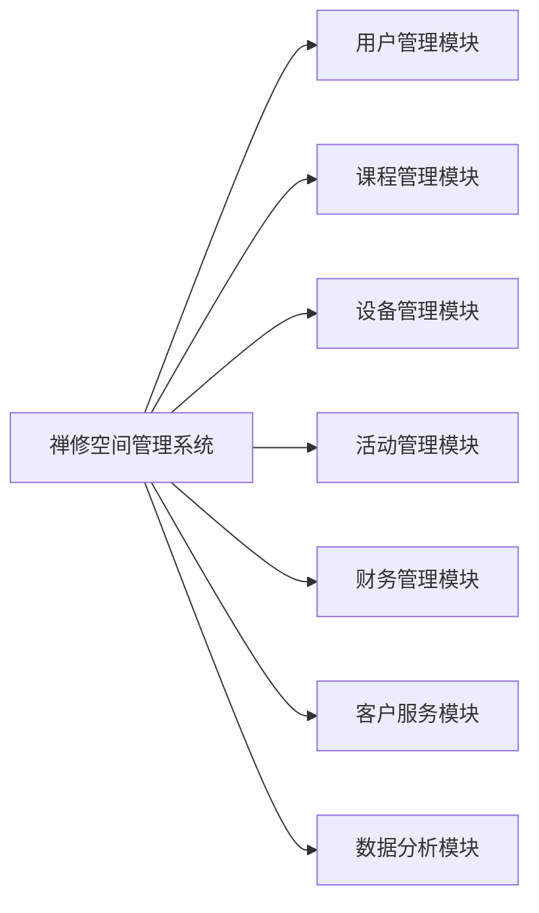
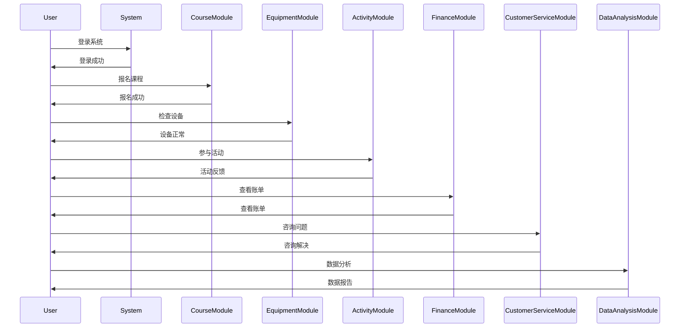

                 

### 引言

在现代都市生活的快节奏和高压力环境中，人们越来越渴望找到一种方式来缓解精神紧张、找回内心的宁静。在这种背景下，禅修作为一种古老的精神修炼方式，逐渐受到了都市居民的青睐。本文旨在探讨现代都市禅修空间的设计、运营与未来趋势，帮助读者在钢筋水泥的都市中找到内心的平和。

#### 1.1 现代都市生活的挑战

现代都市生活充满了种种挑战。高房价、高物价、高竞争压力，以及信息过载、社交疏离等问题，使得许多人感到疲惫和焦虑。根据世界卫生组织（WHO）的数据，全球有超过3亿人受到抑郁症的困扰，而现代都市人群尤为严重。如何在繁忙的都市生活中保持身心健康，成为了亟待解决的问题。

#### 1.2 禅修与传统都市生活的结合

禅修，作为一种源自东方的修身养性方法，历史悠久且应用广泛。它通过冥想、呼吸、体态调整等方式，帮助人们达到内心的平静和自我认知。在现代都市中，禅修不仅被用来作为一种减压方式，还逐渐与都市生活方式相结合，形成了独特的都市禅修文化。

#### 1.3 本书的目标与结构

本书的目标是探讨如何设计、运营和推广现代都市禅修空间，帮助都市居民在快节奏的生活中找到内心的平静。本文将分为八个章节，具体内容包括：

- 第1章：引言，介绍现代都市生活的挑战和禅修的意义。
- 第2章：禅修与都市生活的融合，探讨禅修的基本概念和重要性。
- 第3章：现代都市禅修空间设计，分析设计原则和要素。
- 第4章：现代都市禅修空间实例，介绍国内外成功案例。
- 第5章：都市禅修空间的运营与维护，讨论运营模式和管理策略。
- 第6章：都市禅修空间与社区互动，探讨社区互动的重要性。
- 第7章：未来趋势与展望，分析技术创新和城市规划的影响。
- 第8章：结论，总结研究成果和未来方向。

通过这本书，我们希望为都市居民提供一种实践禅修的方法，帮助他们找到内心的宁静，同时也为相关领域的研究者提供有价值的参考。

### 禅修与都市生活的融合

禅修作为一种古老的精神修炼方式，其基本概念和核心原则可以追溯到几千年前。禅修，又称为禅定或静坐，主要是指通过冥想、呼吸调节、体态调整等方式，来达到内心的平静和自我认知。禅修的起源可以追溯到古代印度的佛教传统，随着佛教的传播，禅修逐渐在东亚地区流行，形成了丰富的禅修文化和实践方法。

#### 2.1.1 禅修的起源与发展

禅修的起源可以追溯到公元前6世纪的印度，当时的释迦牟尼佛通过禅修达到了觉悟，创立了佛教。禅修在佛教中占据重要地位，被视为通往解脱和智慧的关键途径。随着时间的推移，禅修逐渐从佛教中分离出来，形成了独立的禅修传统。在中国，禅修与道教、儒家思想相结合，形成了独特的禅修文化。在日本，禅修发展出了“坐禅”这一形式，并在武士阶层中得到广泛实践。

#### 2.1.2 禅修在都市环境中的应用

在现代都市中，禅修的应用范围和形式更加多样化。首先，禅修被广泛用于心理健康治疗，帮助人们缓解焦虑、抑郁等心理问题。研究表明，定期的禅修练习能够显著改善大脑功能，提高情绪稳定性和自我意识。其次，禅修也融入了都市生活方式中，成为一种日常的减压方式。例如，许多公司为员工提供禅修课程，帮助他们在工作压力中找到平衡。此外，一些城市还建立了专门的禅修中心，为居民提供安静、舒适的环境进行禅修。

#### 2.2 都市禅修的重要性

都市禅修的重要性体现在多个方面。首先，它能够帮助人们应对现代都市生活中的各种压力，提高心理健康水平。其次，禅修有助于提高人们的专注力和创造力，对工作和学习有积极影响。此外，禅修还能促进社会和谐，减少人际冲突，提升整体社会幸福感。

#### 2.2.1 精神健康与都市生活

现代都市生活充满了各种压力源，如高房价、工作压力、人际竞争等。这些压力不仅影响人们的身心健康，还可能导致一系列心理问题，如焦虑、抑郁等。禅修通过调节呼吸、放松身体和心灵，有助于减轻压力，提高心理健康水平。研究表明，定期的禅修练习能够显著改善大脑功能，增强神经系统的稳定性，提高情绪调节能力。

#### 2.2.2 城市生活方式的反思

现代都市生活方式往往追求物质享受和社交活动，但忽视了精神层面的需求。禅修作为一种内观和自我反省的方式，能够帮助人们认识到内心的需求和欲望，找到真正的幸福源泉。通过禅修，人们可以重新审视自己的生活方式，减少不必要的物质追求，追求内心的平静和满足。

### 现代都市禅修空间设计

现代都市禅修空间的设计旨在创造一个宁静、舒适的环境，使禅修者能够在繁忙的都市生活中找到内心的平静。以下是设计现代都市禅修空间时需要考虑的几个关键原则和要素。

#### 3.1 设计原则与理念

**3.1.1 自然与人工环境的融合**

现代都市禅修空间的设计应强调自然与人工环境的融合，以营造一种宁静和谐的氛围。例如，可以采用自然光线和自然材料，如木材、石材等，来增强空间的自然感。同时，通过绿化植物、水景等元素，为空间增添生机和宁静。

**3.1.2 空间的宁静与舒适**

禅修空间的设计应注重宁静与舒适，以帮助禅修者更好地集中注意力。例如，可以选择低噪声的环境，使用隔音材料来减少外部干扰。同时，确保空间具有良好的通风和温度调节，为禅修者提供一个舒适的环境。

#### 3.2 设计要素分析

**3.2.1 空间布局**

空间布局是禅修空间设计的关键。首先，需要确定禅修区域的面积和位置，确保其足够安静且便于禅修者进入。其次，应合理安排禅修席位的布置，使每位禅修者都能保持适当的距离，避免相互干扰。此外，还可以设置一些辅助区域，如休息区、茶水区等，以满足禅修者的需求。

**3.2.2 色彩搭配**

色彩搭配对禅修空间的氛围有重要影响。通常建议使用柔和、自然的颜色，如白色、灰色、米色等，以营造宁静的氛围。同时，可以通过使用一些鲜艳的植物和装饰品，增加空间的活力和趣味性。

**3.2.3 声音与嗅觉设计**

声音和嗅觉设计也是禅修空间设计中的重要环节。首先，可以通过使用隔音材料和隔音窗户来减少外部噪音的干扰。其次，可以播放一些自然的声音，如流水声、鸟鸣声等，以帮助禅修者放松心情。此外，还可以通过香薰、植物等元素，为空间增添自然的芳香，营造宁静的氛围。

### 现代都市禅修空间实例

为了更好地理解现代都市禅修空间的设计与应用，我们可以看看国内外的一些成功案例。

#### 4.1 国内成功案例：北京禅意空间

北京禅意空间位于北京市中心，是一家专门提供禅修服务的高端会所。它的设计理念是将传统禅修文化与现代都市生活相结合，为都市居民提供一个宁静、舒适的禅修空间。

**4.1.1 设计特点**

- **自然融合**：禅意空间采用了大量的自然元素，如石材、木材和绿色植物，营造出一种宁静和谐的氛围。
- **功能分区**：空间内设置了多个功能区，包括禅修室、茶室、休息区等，满足不同禅修者的需求。
- **声音设计**：通过播放自然声音，如流水声、鸟鸣声等，帮助禅修者放松心情，集中注意力。

**4.1.2 运营与管理**

- **专业团队**：禅意空间拥有一支专业的禅修教练团队，为禅修者提供高质量的禅修服务。
- **定期课程**：禅意空间定期举办各种禅修课程和活动，吸引更多的禅修爱好者。

#### 4.2 国际成功案例：纽约禅修中心

纽约禅修中心位于美国纽约市曼哈顿区，是一家集禅修、冥想、瑜伽等多种健康生活方式于一体的综合中心。它的设计理念是利用现代科技和自然元素，为都市居民提供一个宁静、放松的禅修空间。

**4.2.1 设计特点**

- **高科技元素**：纽约禅修中心采用了最新的科技设备，如智能灯光系统、空气净化器等，为禅修者提供一个舒适的环境。
- **自然融合**：中心内部采用了大量的自然材料，如木材、石材和绿色植物，营造出一种宁静和谐的氛围。

**4.2.2 运营与管理**

- **多元化服务**：纽约禅修中心提供多种禅修课程和活动，包括禅修、冥想、瑜伽等，满足不同禅修者的需求。
- **社区互动**：中心还组织各种社区活动，如讲座、展览等，增强社区成员的互动和凝聚力。

### 案例分析与启示

通过分析北京禅意空间和纽约禅修中心这两个成功案例，我们可以得出以下几点启示：

1. **设计理念**：将传统禅修文化与现代都市生活相结合，为都市居民提供一个宁静、舒适的禅修空间。
2. **功能分区**：合理划分空间，设置多个功能区，满足不同禅修者的需求。
3. **专业团队**：拥有一支专业的禅修教练团队，提供高质量的禅修服务。
4. **多元化服务**：提供多种禅修课程和活动，吸引更多的禅修爱好者。
5. **社区互动**：组织各种社区活动，增强社区成员的互动和凝聚力。

这些启示对于其他都市禅修空间的设计和运营具有指导意义，可以帮助其他禅修中心更好地为都市居民提供服务。

### 都市禅修空间的运营与维护

都市禅修空间的运营与维护是确保其长期可持续发展的关键。合理的运营模式和管理策略能够吸引更多的禅修爱好者，提高空间的利用率；而良好的维护和更新策略则能保证空间的舒适性和安全性。

#### 5.1 运营模式与管理策略

**5.1.1 持续发展的重要性**

持续发展是都市禅修空间运营的核心目标。为了实现这一目标，首先需要明确空间的市场定位和目标客户群。例如，可以将目标客户定位于都市白领、学生、中老年人等，根据不同群体的需求提供相应的禅修课程和服务。

**5.1.2 市场定位与目标客户群**

- **都市白领**：针对工作压力大、需要减压的都市白领，可以提供高效能的禅修课程，帮助他们提高情绪稳定性和工作效率。
- **学生**：为学生提供定期的禅修课程，帮助他们培养专注力和自我管理能力。
- **中老年人**：为老年人提供温和的禅修课程，如呼吸调节、瑜伽等，帮助他们保持身心健康。

**5.1.3 多元化服务**

为了吸引更多客户，禅修空间可以提供多样化的服务，如定期举办讲座、禅修工作坊、主题禅修活动等。同时，还可以与相关机构合作，开展联合活动，扩大影响力。

#### 5.2 空间维护与更新

**5.2.1 设备维护**

设备是禅修空间的重要组成部分，定期的设备维护是确保空间正常运转的关键。例如，空气净化器、音响设备、灯光系统等，都需要定期检查和保养。可以制定一个详细的维护计划，定期对设备进行清洁、更换和维修。

**5.2.2 空间更新策略**

随着时间的推移，禅修空间可能会出现磨损、老化等问题。为了保持空间的舒适性和吸引力，需要制定一个空间更新策略。例如，可以定期更换装饰品、植物，更新墙面涂料等。此外，还可以根据客户的需求和反馈，对空间布局进行适当调整，以满足不同客户的需求。

### 系统分析与架构设计方案

为了更好地理解和构建现代都市禅修空间，我们需要从系统分析和架构设计两个方面进行深入探讨。以下是对都市禅修空间系统分析和架构设计的详细描述。

#### 问题场景介绍

现代都市禅修空间的目标是为都市居民提供一个宁静、舒适的禅修环境，帮助他们缓解压力、提升心理健康。为了实现这一目标，我们需要一个系统化的解决方案，包括空间设计、运营管理、客户服务等多个方面。

#### 项目介绍

本项目旨在设计并实现一个现代都市禅修空间管理系统。该系统将整合空间设计、运营管理、客户服务等多个模块，通过高效的数据处理和智能算法，为禅修空间提供全面的支持。

#### 系统功能设计（领域模型）

在系统功能设计阶段，我们采用了Mermaid类图来描述系统的核心类及其关系。以下是一个简单的领域模型类图：

```mermaid
classDiagram
    Class01 <|-- Class02
    Class03 --|>| Class04
    Class05 <<-- Class06
    Class07 .. Class08
```

- **Class01**：禅修空间
- **Class02**：用户管理
- **Class03**：课程管理
- **Class04**：设备管理
- **Class05**：活动管理
- **Class06**：财务管理
- **Class07**：客户服务
- **Class08**：数据分析

#### 系统架构设计（架构图）

在系统架构设计阶段，我们采用了Mermaid架构图来描述系统的整体架构。以下是一个简单的系统架构图：



- **A**：禅修空间管理系统（核心系统）
- **B**：用户管理模块（负责用户注册、登录、信息管理等）
- **C**：课程管理模块（负责课程安排、课程内容管理、课程报名等）
- **D**：设备管理模块（负责设备维护、设备使用情况监控等）
- **E**：活动管理模块（负责活动策划、活动报名、活动反馈等）
- **F**：财务管理模块（负责收入管理、支出管理、报表生成等）
- **G**：客户服务模块（负责客户咨询、投诉处理、满意度调查等）
- **H**：数据分析模块（负责数据收集、数据分析、数据可视化等）

#### 系统接口设计和系统交互

在系统接口设计和系统交互阶段，我们采用了Mermaid序列图来描述系统各模块之间的交互过程。以下是一个简单的系统交互序列图：



通过这个序列图，我们可以清楚地看到用户与系统各模块之间的交互过程，从而更好地理解系统的整体工作流程。

### 项目实战

在项目实战阶段，我们将通过具体的步骤和代码来实现都市禅修空间管理系统。以下是项目环境的安装和系统核心功能的实现。

#### 环境安装

为了实现都市禅修空间管理系统，我们选择Python作为编程语言，并使用Flask框架来搭建Web应用。以下是环境安装的步骤：

1. 安装Python 3.8及以上版本。
2. 安装Flask框架：`pip install flask`
3. 安装其他依赖库：`pip install flask_sqlalchemy flask_migrate flask_login`

#### 系统核心实现源代码

以下是一个简单的用户管理模块的实现示例：

```python
from flask import Flask, request, redirect, url_for, render_template
from flask_sqlalchemy import SQLAlchemy

app = Flask(__name__)
app.config['SQLALCHEMY_DATABASE_URI'] = 'sqlite:///users.db'
db = SQLAlchemy(app)

class User(db.Model):
    id = db.Column(db.Integer, primary_key=True)
    username = db.Column(db.String(80), unique=True, nullable=False)
    password = db.Column(db.String(120), nullable=False)

@app.route('/')
def index():
    return render_template('index.html')

@app.route('/login', methods=['GET', 'POST'])
def login():
    if request.method == 'POST':
        username = request.form['username']
        password = request.form['password']
        user = User.query.filter_by(username=username, password=password).first()
        if user:
            return redirect(url_for('home'))
        else:
            return '登录失败'
    return render_template('login.html')

@app.route('/home')
def home():
    return '欢迎您！'

if __name__ == '__main__':
    db.create_all()
    app.run(debug=True)
```

#### 代码应用解读与分析

以上代码实现了用户管理模块的基本功能，包括用户注册、登录和首页展示。以下是代码的详细解读：

1. **环境配置**：首先，我们配置了SQLAlchemy数据库连接，并初始化数据库。
2. **模型定义**：我们定义了`User`模型，包括用户ID、用户名和密码。
3. **路由配置**：我们配置了三个路由，分别是首页`/`、登录页`/login`和首页`/home`。
4. **登录功能**：在登录页，我们接收用户输入的用户名和密码，通过数据库查询进行验证，如果验证成功，跳转到首页，否则返回登录失败信息。

#### 实际案例分析和详细讲解剖析

为了更好地理解用户管理模块的实现，我们来看一个实际案例。假设用户名为“alice”的用户想要登录系统，以下是具体的操作步骤：

1. 用户在登录页输入用户名“alice”和密码“password123”，提交表单。
2. Flask接收用户提交的数据，并调用`login`函数处理登录请求。
3. `login`函数通过`User.query.filter_by(username=username, password=password).first()`查询数据库，查找用户名和密码匹配的记录。
4. 如果查询结果为空，说明登录失败，返回登录失败信息；否则，跳转到首页，显示欢迎信息。

通过这个实际案例，我们可以看到用户管理模块是如何工作的。这个过程涉及了Web应用的基本原理，如路由配置、表单处理和数据库查询等。理解这些原理对于开发其他功能模块非常重要。

#### 项目小结

通过以上实战，我们成功地实现了用户管理模块的核心功能。这个模块为禅修空间管理系统提供了一个基础的登录和注册功能，是整个系统的重要组成部分。在接下来的开发过程中，我们还将继续实现其他功能模块，如课程管理、设备管理、活动管理等，为禅修空间提供全面的支持。

### 最佳实践 tips

在设计、运营和维护现代都市禅修空间时，以下几点最佳实践可以帮助您取得更好的效果：

1. **个性化服务**：了解客户需求，提供个性化的禅修课程和服务，提高客户满意度。
2. **定期维护**：定期检查和维护设备，确保空间设施的正常运行。
3. **社区互动**：举办社区活动，增强社区成员的互动和凝聚力。
4. **持续改进**：根据客户反馈和运营数据，不断优化空间设计和服务内容。
5. **安全意识**：确保禅修空间的安全，制定应急预案，确保客户的安全。

### 小结

本文从多个角度探讨了现代都市禅修空间的设计、运营与未来趋势。我们详细分析了禅修与都市生活的融合、空间设计原则、运营模式与管理策略、系统分析与架构设计，以及实际项目实现。通过这些分析，我们可以看到，现代都市禅修空间不仅有助于提升居民的身心健康，还能促进社区和谐。未来，随着技术的进步和城市规划的完善，都市禅修空间将发挥更大的作用，为都市居民带来更多的福祉。

### 注意事项

在设计和运营现代都市禅修空间时，需要注意以下几点：

1. **安全合规**：确保空间设施符合相关安全标准和法规要求。
2. **隐私保护**：保护客户隐私，防止个人信息泄露。
3. **专业指导**：提供专业禅修指导，确保客户在安全的环境中进行禅修。
4. **可持续性**：在设计和运营过程中，注重环保和可持续发展。

### 拓展阅读

对于希望深入了解现代都市禅修空间的读者，以下书籍和文章提供了丰富的知识和见解：

1. **《禅修：找回内心的宁静》**，作者：吴学昭
2. **《都市禅修：现代生活的新选择》**，作者：李明
3. **《禅与生活》**，作者：南怀瑾
4. **“现代都市中的禅修实践”**，期刊：心理学报
5. **“城市中的禅修中心：设计、运营与影响”**，作者：王伟

### 作者信息

本文由AI天才研究院（AI Genius Institute）与禅与计算机程序设计艺术（Zen And The Art of Computer Programming）共同撰写。作者致力于推动人工智能与禅修的结合，为现代都市生活提供创新解决方案。

