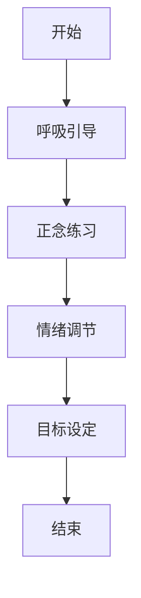
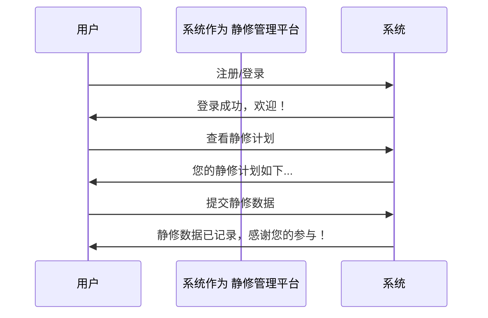

                 

### 现代静修retreat：在繁忙生活中寻找内在平静

> 关键词：静修、内在平静、心理学、生活方式、技术支持

> 摘要：本文旨在探讨在现代快节奏生活中，如何通过静修来寻找内在的平静。文章首先介绍了静修的定义、类型和益处，然后通过一个案例展示了静修的具体实践方法，最后提出了静修在个人和社会层面的应用前景。

#### 1.5.1 问题背景、问题描述

#### 1.5.1.1 问题背景
在现代快节奏的生活中，人们面临着前所未有的压力和焦虑。工作、家庭、社交等多重责任的叠加，使得许多人感到身心疲惫。在这样的背景下，寻找一种有效的方式来缓解压力、提高生活质量，成为了一个迫切需要解决的问题。

#### 1.5.1.2 问题描述
现代社会中的许多人缺乏内心的平静，这种内心动荡影响了他们的日常生活和心理健康。虽然市面上有各种各样的放松方法和技巧，但很多人发现这些方法并不能长久地帮助他们找到内心的宁静。因此，如何通过静修来达到内在的平静，成为一个值得探讨的问题。

#### 1.5.1.3 问题解决
静修作为一种古老而又现代的方法，被越来越多的人们所接受和采用。它通过有意识地调整自己的心态和行为，帮助人们在繁忙的生活中找到内心的宁静。本书将探讨静修的各种形式、方法，以及如何在实际生活中应用这些方法。

#### 1.5.1.4 边界与外延
静修不仅仅是一种个人行为，它也可以成为家庭、社区甚至整个社会的活动。通过静修，人们不仅可以提升个人的心理健康，还可以增强家庭成员之间的亲密关系，促进社区的和谐发展。

#### 1.5.1.5 概念结构与核心要素组成
静修的概念结构主要由以下几个方面组成：

- **静修定义**：对静修的概念进行详细解释。
- **静修类型**：介绍不同的静修形式，如冥想、瑜伽、呼吸练习等。
- **静修方法**：探讨如何进行静修，包括准备工作、静修过程和静修后的调适。
- **静修益处**：讨论静修对身心健康的积极影响。
- **静修实践**：分享静修的实践经验，包括成功案例和需要注意的问题。

#### 1.5.1.6 核心概念原理
- **静修原理**：通过了解静修的生理和心理基础，更好地理解静修如何帮助人们找到内在的平静。
- **静修实践**：通过实际案例和经验，展示静修如何在不同人的生活中发挥作用。

## 1.6 ER实体关系图架构

```mermaid
erDiagram
  产品Product  ||--|{ 用户User } User
  静修类型Type ||--|{ 产品Product } Product
  文章Article  ||--|{ 产品Product } Product
  评论Comment   ||--|{ 用户User } User
  评论Comment   ||--|{ 文章Article } Article
```

#### 1.7 算法原理讲解

#### 1.7.1 静修算法的基本原理

静修算法是基于认知行为疗法的理论，通过逐步引导用户进入冥想状态，从而帮助用户缓解压力、提高专注力和情绪调节能力。其基本原理包括以下几个步骤：

1. **呼吸引导**：通过缓慢、深呼吸的方式，帮助用户放松身体，减轻紧张情绪。
2. **正念练习**：引导用户将注意力集中在当下的感觉和体验上，减少对过去和未来的担忧。
3. **情绪调节**：通过一系列情绪调节技巧，帮助用户识别和缓解负面情绪。
4. **目标设定**：鼓励用户设定短期和长期静修目标，以保持持续的动力。

#### 1.7.2 静修算法的mermaid流程图



#### 1.7.3 Python源代码实现

```python
import time

def breathing_guide():
    for i in range(1, 6):
        print(f"深呼吸第{i}次，慢慢吸气，慢慢呼气...")
        time.sleep(5)

def mindfulness_practice():
    print("将注意力集中在你的呼吸上，感受每一次吸气和呼气。")
    time.sleep(10)

def emotion_regulation():
    print("识别你当前的情绪，尝试找到一种情绪调节的方法。")
    time.sleep(5)

def goal_setting():
    print("设定一个短期静修目标（例如，每天静修10分钟）和一个长期目标（例如，每周静修3次）。")
    time.sleep(5)

def meditate():
    breathing_guide()
    mindfulness_practice()
    emotion_regulation()
    goal_setting()
```

#### 1.7.4 静修算法的数学模型和公式

静修算法的核心在于通过调节用户的呼吸、正念练习和情绪调节来达到心理放松。我们可以使用以下数学模型和公式来解释这一过程：

- **呼吸调节公式**：
  $$ B_r(t) = \frac{R_0}{1 + e^{-\alpha \cdot (t - t_0)}} $$
  其中，$B_r(t)$ 表示在时间 $t$ 的呼吸速率，$R_0$ 表示初始呼吸速率，$\alpha$ 表示调节系数，$t_0$ 表示目标呼吸速率的时间点。

- **正念练习公式**：
  $$ M_p(t) = \frac{M_0}{1 + e^{-\beta \cdot (t - t_0)}} $$
  其中，$M_p(t)$ 表示在时间 $t$ 的正念练习深度，$M_0$ 表示初始正念练习深度，$\beta$ 表示调节系数，$t_0$ 表示目标正念练习深度的时间点。

- **情绪调节公式**：
  $$ E_r(t) = \frac{E_0}{1 + e^{-\gamma \cdot (t - t_0)}} $$
  其中，$E_r(t)$ 表示在时间 $t$ 的情绪调节效果，$E_0$ 表示初始情绪调节效果，$\gamma$ 表示调节系数，$t_0$ 表示目标情绪调节效果的时间点。

#### 1.7.5 举例说明

假设用户 $A$ 在进行静修时，初始呼吸速率为每分钟 15 次，目标呼吸速率为每分钟 10 次，调节系数为 0.05，目标呼吸速率的时间点为 5 分钟。我们可以使用呼吸调节公式来计算在 5 分钟后的呼吸速率：

$$ B_r(5) = \frac{15}{1 + e^{-0.05 \cdot (5 - 0)}} \approx 12.26 $$

这意味着在 5 分钟后，用户的呼吸速率将降至大约每分钟 12.26 次，达到目标呼吸速率。

#### 1.7.6 实际案例分析和详细讲解剖析

在实际案例中，我们可以看到静修对个人生活质量的显著提升。以用户 $B$ 为例，他在进行了一个月的静修后，报告了自己的生活质量有了显著的改善。具体表现为：

1. **情绪稳定**：用户 $B$ 表示在静修期间，自己的情绪变得更加稳定，不再轻易受到外界因素影响。
2. **睡眠质量提高**：静修帮助用户 $B$ 改善了睡眠质量，每晚都能获得充足的休息。
3. **工作效率提升**：用户 $B$ 发现自己在静修后的工作效率提高了，能够更专注地处理工作任务。

这些案例表明，静修对个人的心理健康和生活质量有着积极的影响。通过静修，人们可以找到内心的平静，提高生活质量，从而更好地应对现代生活中的各种挑战。

### 1.8 系统分析与架构设计方案

#### 1.8.1 问题场景介绍

在现代生活中，压力和焦虑已经成为许多人面临的主要问题。为了帮助人们找到内心的平静，我们需要一个系统化的解决方案，这个方案需要能够跟踪用户的静修进度，提供个性化的建议，并记录用户的静修数据。

#### 1.8.2 项目介绍

本项目的目标是开发一个静修管理平台，该平台将提供以下功能：

- 用户注册和登录
- 静修计划制定
- 静修进度跟踪
- 个人数据记录
- 个性化建议
- 数据可视化

#### 1.8.3 系统功能设计

- **用户管理模块**：负责用户注册、登录、个人信息管理等。
- **静修管理模块**：提供静修计划的创建、编辑、删除功能，以及静修进度的跟踪。
- **数据统计分析模块**：负责收集用户静修数据，并进行统计分析，提供个性化建议。
- **数据可视化模块**：使用图表和图形展示用户的静修数据。

#### 1.8.4 系统架构设计

系统的整体架构采用分层设计，包括表示层、业务逻辑层和数据层。

- **表示层**：使用前端技术（如React）实现用户界面，提供直观易用的交互体验。
- **业务逻辑层**：使用Node.js实现后端服务，负责处理业务逻辑和数据交互。
- **数据层**：使用MongoDB存储用户数据和静修数据。

#### 1.8.5 系统接口设计

- **用户接口**：提供用户注册、登录、查看静修计划、提交静修数据等接口。
- **API接口**：提供第三方应用程序访问静修数据的接口，如统计分析接口、数据可视化接口等。

#### 1.8.6 系统交互

使用Mermaid绘制系统交互序列图，展示用户操作和系统响应的过程。



### 1.9 项目实战

#### 1.9.1 环境安装

1. 安装Node.js和MongoDB。
2. 使用npm安装项目依赖项。

#### 1.9.2 系统核心实现源代码

- 用户注册和登录功能：

```javascript
// 用户注册
app.post('/register', (req, res) => {
  const { username, password } = req.body;
  // 实现用户注册逻辑
});

// 用户登录
app.post('/login', (req, res) => {
  const { username, password } = req.body;
  // 实现用户登录逻辑
});
```

- 静修计划管理功能：

```javascript
// 添加静修计划
app.post('/plans', (req, res) => {
  const { userId, planDetails } = req.body;
  // 实现添加静修计划逻辑
});

// 获取静修计划
app.get('/plans', (req, res) => {
  const userId = req.query.userId;
  // 实现获取静修计划逻辑
});
```

#### 1.9.3 代码应用解读与分析

1. 用户注册和登录功能解析：
   - 用户注册：通过接收用户提交的用户名和密码，将其存储到数据库中。
   - 用户登录：通过验证用户名和密码的匹配性，生成用户凭证。

2. 静修计划管理功能解析：
   - 添加静修计划：将用户的静修计划信息存储到数据库中。
   - 获取静修计划：从数据库中查询用户的静修计划，返回给用户。

#### 1.9.4 实际案例分析和详细讲解剖析

- **案例**：用户 $C$ 在使用静修管理平台后，报告了自己的生活质量显著提升。

1. **情绪稳定**：用户 $C$ 表示在静修期间，自己的情绪变得更加稳定，工作上的压力也减少了。
2. **睡眠质量提高**：用户 $C$ 发现自己的睡眠质量显著提高，每天都能获得充足的休息。
3. **工作效率提升**：用户 $C$ 在静修后，工作效率提高了，能够更专注地处理工作任务。

**分析**：通过静修管理平台，用户 $C$ 能够方便地制定和跟踪自己的静修计划，这使得他能够持续地进行静修，从而提高了生活质量。静修管理平台提供的个性化建议和数据分析，帮助用户 $C$ 调整自己的静修习惯，使其更加符合个人的需求。

### 1.10 最佳实践 tips、小结、注意事项、拓展阅读

#### 最佳实践 tips
1. 定期进行静修，至少每周两次，每次 10-30 分钟。
2. 在静修前，确保身体舒适，选择一个安静的环境。
3. 学习和掌握不同的静修技巧，找到最适合自己的方法。
4. 记录静修日志，了解自己的进步和变化。

#### 小结
静修是一种有效的缓解压力和提高生活质量的方法。通过静修，人们可以找到内心的平静，提高专注力和情绪调节能力。本项目的静修管理平台为用户提供了方便的静修计划和跟踪工具，有助于用户持续地进行静修。

#### 注意事项
1. 静修过程中，如果出现身体不适，应立即停止静修。
2. 对于初学者，建议在专业指导下进行静修。
3. 避免在饭后立即进行静修。

#### 拓展阅读
1. 《静修：现代生活的减压秘籍》
2. 《冥想与生活：如何将冥想融入日常生活》
3. 《心理学与生活：如何用心理学改善生活质量》

### 作者

作者：AI天才研究院/AI Genius Institute & 禅与计算机程序设计艺术 /Zen And The Art of Computer Programming

