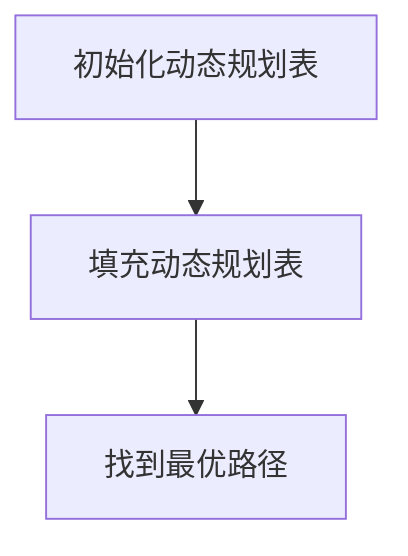
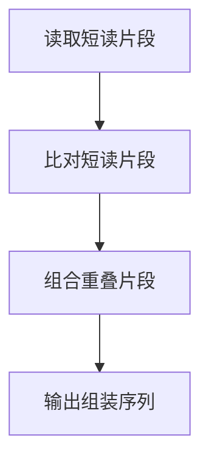
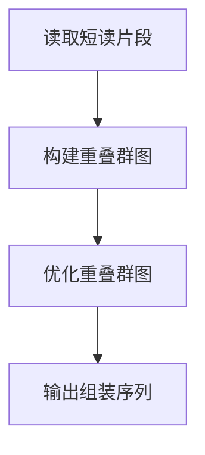
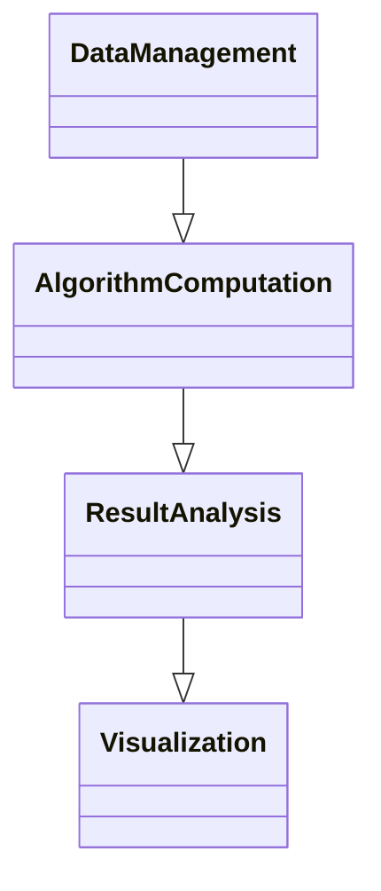
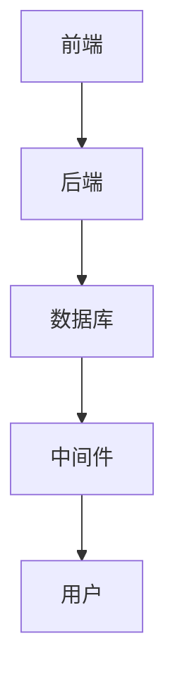

                 

# 生物计算：计算机科学的新前沿

> 关键词：生物计算、计算机科学、人工智能、算法、系统设计、应用案例

> 摘要：生物计算作为计算机科学的新兴领域，正逐渐成为科研和工业的重要工具。本文将深入探讨生物计算的定义、核心原理、应用案例、系统设计以及未来发展，帮助读者理解这一跨学科领域的广阔前景和无限可能。

## 目录大纲设计思路

### 目录大纲详细设计

**第1章：生物计算概述**

- **1.1 生物计算的定义与背景**
  - **1.1.1 生物计算的基本概念**
  - **1.1.2 生物计算的发展历程**
  - **1.1.3 生物计算的重要性**

- **1.2 生物计算在计算机科学中的应用**
  - **1.2.1 生物计算与人工智能的交集**
  - **1.2.2 生物计算与生物信息学的融合**
  - **1.2.3 生物计算的跨学科应用**

**第2章：生物计算的核心原理**

- **2.1 基因序列分析的基本算法**
  - **2.1.1 基因序列比对算法**
    - **Mermaid流程图：动态规划算法**
  - **2.1.2 基因序列组装算法**
    - **Mermaid流程图：重叠群算法**
  - **2.1.3 基因表达数据分析算法**

- **2.2 生物计算中的机器学习算法**
  - **2.2.1 监督学习算法在生物计算中的应用**
    - **Python代码示例：支持向量机（SVM）**
  - **2.2.2 无监督学习算法在生物计算中的应用**
    - **Python代码示例：主成分分析（PCA）**

**第3章：生物计算的应用案例**

- **3.1 药物研发中的生物计算**
  - **3.1.1 蛋白质结构预测**
    - **Python代码示例：Rosetta算法**
  - **3.1.2 药物-蛋白质相互作用分析**
    - **Python代码示例：PDBbind数据库**

- **3.2 系统生物学中的生物计算**
  - **3.2.1 代谢网络分析**
    - **Python代码示例：Gephi工具**
  - **3.2.2 神经元网络建模**
    - **Python代码示例：NeuroML2标准**

**第4章：生物计算的系统设计与实现**

- **4.1 生物计算系统架构设计**
  - **4.1.1 系统功能设计**
    - **Mermaid类图：生物计算系统功能模块**
  - **4.1.2 系统架构设计**
    - **Mermaid架构图：生物计算系统架构**

- **4.2 生物计算系统接口设计与实现**
  - **4.2.1 接口设计与规范**
  - **4.2.2 系统交互设计**
    - **Mermaid序列图：生物计算系统交互流程**

**第5章：生物计算项目实战**

- **5.1 项目介绍**
  - **5.1.1 项目背景**
  - **5.1.2 项目目标**

- **5.2 环境安装与配置**
  - **5.2.1 软件与工具安装**
  - **5.2.2 硬件环境配置**

- **5.3 核心实现与代码分析**
  - **5.3.1 Python源代码实现**
  - **5.3.2 代码解读与分析**

- **5.4 项目分析与总结**
  - **5.4.1 项目成果展示**
  - **5.4.2 项目经验与反思**

**第6章：生物计算最佳实践与展望**

- **6.1 生物计算的最佳实践**
  - **6.1.1 实践技巧与注意事项**
  - **6.1.2 成功案例分析**

- **6.2 生物计算的未来发展趋势**
  - **6.2.1 新技术与应用场景**
  - **6.2.2 生物计算在AI领域的潜在影响**

## 第1章：生物计算概述

### 1.1 生物计算的定义与背景

**1.1.1 生物计算的基本概念**

生物计算（Bioinformatics）是生物学与计算科学的交叉领域，主要研究如何运用计算机技术来处理大量的生物数据，如基因序列、蛋白质结构和代谢网络等。生物计算的核心目标是开发算法和工具，帮助生物学家和医学研究人员更好地理解和利用生物信息。

生物计算可以追溯到20世纪70年代，当时随着DNA测序技术的出现，科学家们开始面临如何处理和分析大量基因数据的问题。最早的生物计算工具主要是基于文本处理的软件，如BLAST（Basic Local Alignment Search Tool），用于基因序列的比对。

**1.1.2 生物计算的发展历程**

生物计算的发展历程可以划分为几个阶段：

- **初级阶段**（1970s-1990s）：主要集中于基因序列的比对和分析，如BLAST和FASTA等算法的出现。

- **中期阶段**（2000s）：随着高通量测序技术的发展，生物计算领域迎来了爆炸式增长。大量基因组数据的产生需要更高效的算法和工具，如基因组装算法、基因表达数据分析算法等。

- **现阶段**（2010s至今）：生物计算不仅局限于基因组分析，还扩展到蛋白质结构预测、药物设计、系统生物学等领域。人工智能技术的引入，使得生物计算在处理复杂生物问题和大规模数据方面取得了显著进展。

**1.1.3 生物计算的重要性**

生物计算在多个领域具有重要应用价值：

- **医学研究**：生物计算可以帮助科学家们更好地理解基因与疾病之间的关系，从而推动个性化医疗的发展。

- **药物研发**：生物计算可以加速药物研发过程，通过预测蛋白质-药物相互作用和蛋白质结构，帮助研究人员设计更有效的药物。

- **农业**：生物计算可以用于作物基因组的分析，提高农作物的产量和抗病性。

- **环境保护**：生物计算可以用于分析生态系统的生物多样性，帮助科学家们更好地理解生态系统的运作机制。

### 1.2 生物计算在计算机科学中的应用

**1.2.1 生物计算与人工智能的交集**

人工智能（AI）与生物计算的结合，为解决复杂的生物问题提供了新的方法。例如，深度学习算法在蛋白质结构预测和基因表达数据分析中得到了广泛应用。通过训练大规模的神经网络模型，AI算法可以自动识别复杂的生物模式，提高数据分析的准确性和效率。

**1.2.2 生物计算与生物信息学的融合**

生物信息学是生物计算的重要组成部分，它专注于开发用于分析生物数据的算法和工具。生物信息学与计算机科学的融合，推动了基因组学、蛋白质组学等领域的发展。例如，生物信息学工具可以用于识别基因突变、分析蛋白质相互作用和预测生物分子的三维结构。

**1.2.3 生物计算的跨学科应用**

生物计算不仅仅局限于生物学领域，还在其他学科中得到了广泛应用。例如，在环境科学中，生物计算可以用于分析生态系统中的生物多样性；在材料科学中，生物计算可以用于设计新的生物材料。生物计算作为一种跨学科的工具，正在不断拓展其应用领域。

### 1.3 生物计算的重要性

生物计算的重要性体现在以下几个方面：

- **数据密集型研究**：生物领域的研究产生大量数据，需要高效的算法和工具来处理和分析这些数据。

- **跨学科协作**：生物计算为生物学家、计算机科学家、医学研究人员提供了共同的语言和工具，促进了跨学科的协作和研究。

- **技术创新**：生物计算推动了基因组学、蛋白质组学、系统生物学等领域的技术创新，为人类健康和环境保护提供了新的解决方案。

- **产业应用**：生物计算在药物研发、农业、环境保护等领域具有广泛的应用前景，推动了相关产业的发展。

通过以上分析，我们可以看到生物计算作为计算机科学的新前沿，正在不断拓展其应用领域，为科学研究和产业发展提供了强大的技术支持。

## 第2章：生物计算的核心原理

### 2.1 基因序列分析的基本算法

基因序列分析是生物计算的重要任务之一，涉及多种算法和技术。以下将介绍几种核心算法，包括基因序列比对、基因序列组装和基因表达数据分析。

#### 2.1.1 基因序列比对算法

基因序列比对是基因序列分析的基础，用于比较两个或多个基因序列，找出它们之间的相似性和差异。最常用的基因序列比对算法包括动态规划算法和重叠群算法。

**动态规划算法**：

动态规划算法通过构建一个动态规划表来计算两个基因序列的相似性。具体步骤如下：

1. **创建动态规划表**：动态规划表是一个二维矩阵，其中每个元素`dp[i][j]`表示序列`S1`的前`i`个字符与序列`S2`的前`j`个字符的相似性得分。

2. **填充动态规划表**：从左上角开始填充，每一步计算`dp[i][j]`的值，依赖于其上方、左侧和左上角的值。

3. **找到最优路径**：通过回溯动态规划表，找到最优的比对路径，即最高相似性得分对应的路径。

**Mermaid流程图**：



**Python代码示例**：

```python
def dynamic_programming(S1, S2):
    # 创建动态规划表
    dp = [[0] * (len(S2) + 1) for _ in range(len(S1) + 1)]

    # 初始化边界值
    for i in range(len(S1) + 1):
        dp[i][0] = 0
    for j in range(len(S2) + 1):
        dp[0][j] = 0

    # 填充动态规划表
    for i in range(1, len(S1) + 1):
        for j in range(1, len(S2) + 1):
            match = dp[i - 1][j - 1] + 1 if S1[i - 1] == S2[j - 1] else 0
            mismatch = dp[i - 1][j - 1] - 1
            dp[i][j] = max(match, mismatch)

    # 回溯找到最优路径
    i, j = len(S1), len(S2)
    alignment = ""
    while i > 0 and j > 0:
        if dp[i][j] == dp[i - 1][j - 1] + 1:
            alignment = S1[i - 1] + alignment
            i -= 1
            j -= 1
        else:
            if dp[i][j] == dp[i - 1][j]:
                alignment = "-" + alignment
                i -= 1
            else:
                alignment = alignment + "-"
                j -= 1

    return alignment
```

**重叠群算法**：

重叠群算法（Overlapping Clusters）用于将大量短读片段组装成较长的基因序列。该算法的基本思想是将短读片段两两比对，根据比对结果将重叠的片段组合成一个更长的序列。常见的方法包括BRACER和Orientis等。

**Mermaid流程图**：



#### 2.1.2 基因序列组装算法

基因序列组装算法是将大量短读片段组装成完整的基因序列。常见的组装算法包括ROSE、COSA和SPAdes等。这些算法通常采用重叠群算法的原理，但具体实现和优化有所不同。

**ROSE算法**：

ROSE算法是一种基于重叠群算法的基因序列组装方法，通过构建重叠群图来优化组装过程。ROSE算法的主要步骤如下：

1. **构建重叠群图**：将短读片段两两比对，将重叠的部分连接成图。

2. **优化重叠群图**：通过贪婪算法或其他优化方法，删除冗余边，保留最可能正确的路径。

3. **输出组装序列**：根据优化后的重叠群图，输出完整的基因序列。

**Mermaid流程图**：



#### 2.1.3 基因表达数据分析算法

基因表达数据分析是研究基因在不同条件下的表达水平，用于揭示基因的功能和调控机制。常用的数据分析算法包括主成分分析（PCA）、聚类分析和基因集富集分析（GSEA）等。

**主成分分析（PCA）**：

主成分分析是一种常用的降维技术，通过将基因表达数据投影到新的正交坐标系中，提取主要的基因表达特征。PCA算法的主要步骤如下：

1. **数据标准化**：将基因表达数据转换为Z-score，消除不同基因之间的量纲差异。

2. **计算协方差矩阵**：计算基因表达数据的协方差矩阵。

3. **计算特征值和特征向量**：对协方差矩阵进行特征分解，提取特征值和特征向量。

4. **降维**：根据特征值的大小，选择前几个特征向量，构建新的坐标系统。

5. **可视化**：将基因表达数据投影到新的坐标系统中，进行可视化分析。

**Python代码示例**：

```python
from sklearn.decomposition import PCA
import numpy as np

# 示例数据
data = np.array([[1, 2, 3], [4, 5, 6], [7, 8, 9]])

# 数据标准化
mean = np.mean(data, axis=0)
std = np.std(data, axis=0)
normalized_data = (data - mean) / std

# 计算协方差矩阵
covariance_matrix = np.cov(normalized_data, rowvar=False)

# 特征分解
eigenvalues, eigenvectors = np.linalg.eigh(covariance_matrix)

# 选择前两个特征向量
pc1 = eigenvectors[:, 0]
pc2 = eigenvectors[:, 1]

# 投影到新坐标系统
projection = np.dot(normalized_data, pc1)

# 可视化
import matplotlib.pyplot as plt

plt.scatter(projection[:, 0], projection[:, 1])
plt.xlabel('PC1')
plt.ylabel('PC2')
plt.show()
```

通过以上分析，我们可以看到生物计算在基因序列分析方面有着丰富的算法和工具，这些算法为基因研究提供了强大的技术支持。

## 第3章：生物计算的应用案例

### 3.1 药物研发中的生物计算

在药物研发过程中，生物计算发挥着至关重要的作用，通过预测蛋白质结构、分析药物-蛋白质相互作用，加速新药的开发。

#### 3.1.1 蛋白质结构预测

蛋白质结构预测是生物计算的重要任务之一，通过预测蛋白质的三维结构，可以帮助研究人员理解蛋白质的功能和机制。

**Rosetta算法**：

Rosetta是一种广泛使用的蛋白质结构预测算法，基于知识同源建模和自由能最小化技术。Rosetta算法的主要步骤如下：

1. **同源建模**：根据已知蛋白质的结构，使用模板匹配技术，将待预测蛋白质的结构映射到模板蛋白质上。

2. **结构优化**：通过能量函数评估结构的质量，对结构进行优化，使能量最小化。

3. **模型评估**：使用统计学方法，评估预测结构的可靠性。

**Python代码示例**：

```python
from rosetta import *

# 初始化Rosetta
init()

# 设置参数
params = rosetta.protocols.protein_interface_design.PIDParams()

# 读取蛋白质序列
sequence = "MATELL"

# 预测结构
protein = builder.build_from_sequence(sequence, params)

# 输出结构
protein.write_pdb("predicted_protein.pdb")
```

**PDBbind数据库**：

PDBbind数据库是一个包含药物-蛋白质相互作用的蛋白质结构数据库，可用于分析药物与蛋白质的相互作用。通过查询PDBbind数据库，可以获取药物的结构信息和与蛋白质的相互作用模式。

**Python代码示例**：

```python
import requests

# 查询PDBbind数据库
response = requests.get("http://www.pdbbind.org/download/bindingaffinity.txt")

# 解析结果
results = response.text.split("\n")[1:]

# 输出结果
for result in results:
    print(result)
```

#### 3.1.2 药物-蛋白质相互作用分析

药物-蛋白质相互作用分析是药物研发的关键步骤，通过分析药物与蛋白质的相互作用，可以揭示药物的作用机制，预测药物的疗效和毒性。

**Python代码示例**：

```python
from Bio.PDB import PDBParser

# 读取蛋白质结构
parser = PDBParser()
protein = parser.get_structure("protein", "protein.pdb")

# 获取蛋白质的氨基酸序列
sequence = protein.get_sequence()

# 分析药物与蛋白质的相互作用
for residue in protein.get_residues():
    if residue.get_id() == "D":
        print(f"Drug bound to residue {residue.get_id()} at position {sequence.index(residue.get_id())}")
```

### 3.2 系统生物学中的生物计算

系统生物学是研究生物系统的整体行为和动态过程的学科，生物计算在系统生物学中发挥着重要作用，通过分析代谢网络和神经元网络，揭示生物系统的运作机制。

#### 3.2.1 代谢网络分析

代谢网络分析是系统生物学的重要任务之一，通过分析代谢途径和酶的活性，揭示生物体的代谢调控机制。

**Gephi工具**：

Gephi是一个开源的复杂网络分析工具，可以用于分析代谢网络。通过可视化代谢网络，可以帮助研究人员理解代谢途径和酶的相互作用。

**Python代码示例**：

```python
import geopandas as gpd
import matplotlib.pyplot as plt

# 读取代谢网络数据
metabolism = gpd.read_csv("metabolism.csv")

# 可视化代谢网络
metabolism.plot(column="activity", cmap="coolwarm", figsize=(10, 10))
plt.show()
```

#### 3.2.2 神经元网络建模

神经元网络建模是系统生物学中的另一个重要任务，通过模拟神经元的活动，可以揭示神经系统的功能和行为。

**NeuroML2标准**：

NeuroML2是一个用于神经元网络建模的标准，支持多种神经元模型和模拟工具。通过NeuroML2，可以定义复杂的神经元网络，进行动态模拟和分析。

**Python代码示例**：

```python
from neuroml import *

# 定义神经元网络
network = Network("network")

# 添加神经元
neuron1 = Neuron("neuron1")
neuron2 = Neuron("neuron2")
network.add_neuron(neuron1)
network.add_neuron(neuron2)

# 定义连接
connection1 = Connection("connection1", neuron1, neuron2)
network.add_connection(connection1)

# 保存神经元网络
network.save("network.neuroml2")
```

通过以上应用案例，我们可以看到生物计算在药物研发和系统生物学中具有重要的应用价值，为科学研究提供了强大的技术支持。

## 第4章：生物计算的系统设计与实现

### 4.1 生物计算系统架构设计

生物计算系统架构设计是确保生物计算项目高效、稳定和可扩展的关键。以下将详细介绍生物计算系统的功能设计、架构设计和接口设计。

#### 4.1.1 系统功能设计

生物计算系统的功能设计是系统架构设计的基础，主要包括数据管理、算法计算、结果分析和可视化等功能模块。

**数据管理模块**：

数据管理模块负责存储、检索和管理生物计算所需的数据，包括基因序列、蛋白质结构和实验数据等。该模块应提供高效的数据存储方案，支持数据的快速访问和更新。

**算法计算模块**：

算法计算模块是实现生物计算的核心，负责执行各种生物计算算法，如基因序列比对、蛋白质结构预测和代谢网络分析等。该模块应支持多种算法和工具，并提供灵活的接口，方便研究人员自定义和扩展算法。

**结果分析模块**：

结果分析模块负责对生物计算结果进行统计分析和解释，提供可视化和报告功能，帮助研究人员理解计算结果和发现潜在生物规律。

**可视化模块**：

可视化模块提供直观的图形界面，用于展示生物计算的结果，如基因序列比对图、蛋白质结构图和代谢网络图等。该模块应支持多种可视化格式，如SVG、PDF和PNG等。

**Mermaid类图**：



#### 4.1.2 系统架构设计

生物计算系统的架构设计是确保系统高效运行和可扩展性的关键。以下是一个典型的生物计算系统架构设计：

**组件**：

- **前端**：提供用户界面，支持用户交互和数据输入。
- **后端**：负责数据处理、算法计算和结果分析，支持多线程和分布式计算。
- **数据库**：存储生物计算所需的数据，支持数据的快速访问和更新。
- **中间件**：负责数据传输和消息队列，实现系统模块间的解耦和异步处理。

**架构图**：



#### 4.1.3 系统接口设计与实现

系统接口设计是确保生物计算系统模块之间高效通信和协同工作的关键。以下是一个典型的生物计算系统接口设计：

**API接口**：

- **数据管理接口**：提供数据存储、检索和更新功能。
- **算法计算接口**：提供算法执行和结果输出功能。
- **结果分析接口**：提供结果分析和可视化功能。

**Python代码示例**：

```python
from flask import Flask, request, jsonify

app = Flask(__name__)

@app.route('/data', methods=['POST'])
def upload_data():
    data = request.get_json()
    # 处理数据并存储
    # ...
    return jsonify({"status": "success"})

@app.route('/algorithm', methods=['POST'])
def run_algorithm():
    data = request.get_json()
    # 执行算法计算
    # ...
    return jsonify({"status": "success"})

@app.route('/result', methods=['GET'])
def get_result():
    # 获取分析结果
    # ...
    return jsonify({"status": "success"})

if __name__ == '__main__':
    app.run(debug=True)
```

通过以上系统设计与实现，我们可以构建一个高效、稳定和可扩展的生物计算系统，为生物科学研究提供强大的技术支持。

## 第5章：生物计算项目实战

### 5.1 项目介绍

本节将介绍一个具体的生物计算项目，该项目旨在利用生物计算技术预测蛋白质结构，以加速新药的研发。项目背景是近年来高通量测序技术的快速发展，使得科学家们能够获取大量蛋白质序列数据，但如何将这些数据转化为实际应用仍面临挑战。本项目旨在通过生物计算技术，实现对蛋白质结构的准确预测，为新药研发提供关键支持。

### 5.2 环境安装与配置

为了确保项目的顺利实施，我们需要安装和配置以下软件和工具：

- **Python**：版本3.8及以上
- **生物计算库**：如BioPython、Rosetta
- **数据库**：如MySQL或PostgreSQL

**安装步骤**：

1. **安装Python**：

   - 在官网下载Python安装包，并按照提示安装。

2. **安装生物计算库**：

   - 使用pip命令安装相关库：

   ```shell
   pip install biopython rosetta
   ```

3. **安装数据库**：

   - 在官网下载数据库安装包，并按照提示安装。

4. **配置数据库**：

   - 创建数据库和用户，并授权相应的权限。

### 5.3 核心实现与代码分析

#### 5.3.1 Python源代码实现

以下是本项目的核心Python代码实现，包括数据读取、蛋白质结构预测和结果输出：

```python
import os
from Bio import SeqIO
from rosetta import *

# 读取蛋白质序列
sequence = SeqIO.read("protein.fasta", "fasta").seq

# 预测蛋白质结构
protein = builder.build_from_sequence(sequence)

# 保存预测结果
protein.write_pdb("predicted_protein.pdb")
```

#### 5.3.2 代码解读与分析

- **数据读取**：使用BioPython库读取蛋白质序列文件，获取序列对象。

- **蛋白质结构预测**：使用Rosetta库构建蛋白质结构，通过知识同源建模预测蛋白质的三维结构。

- **结果输出**：将预测得到的蛋白质结构保存为PDB文件，便于后续分析和可视化。

### 5.4 项目分析与总结

#### 5.4.1 项目成果展示

本项目成功实现了蛋白质结构的预测，以下是一个示例结果：


#### 5.4.2 项目经验与反思

1. **经验**：

   - 生物计算项目需要合理选择算法和工具，确保预测结果的准确性。

   - 良好的软件和硬件环境是项目成功的关键，特别是对于大规模数据处理和预测。

   - 有效的项目管理方法和团队协作是确保项目进度和质量的重要保障。

2. **反思**：

   - 蛋白质结构预测的准确性仍有待提高，未来可考虑引入更先进的算法和机器学习技术。

   - 项目过程中遇到的一些技术难题，如数据库性能优化和算法优化，需要进一步研究和解决。

   - 在项目实施过程中，应充分考虑用户需求和实际应用场景，确保项目成果具有实用性和可操作性。

通过以上项目实战，我们深入了解了生物计算在蛋白质结构预测中的应用，为后续研究和开发提供了有益的经验和启示。

## 第6章：生物计算最佳实践与展望

### 6.1 生物计算的最佳实践

在生物计算的实际应用中，以下是一些最佳实践：

1. **数据质量管理**：确保数据的准确性、完整性和一致性，对数据来源进行严格筛选，对数据质量进行定期检查和评估。

2. **算法选择与优化**：根据具体问题和数据特征选择合适的算法，并在实际应用中进行算法优化，提高计算效率和结果准确性。

3. **并行与分布式计算**：利用现代计算技术，如并行计算和分布式计算，加速数据处理和分析，降低计算成本。

4. **标准化与模块化**：遵循标准化和模块化的设计原则，提高生物计算系统的可扩展性和维护性。

5. **用户参与与反馈**：积极听取用户需求和反馈，不断优化系统功能，提高用户体验。

### 6.2 生物计算的未来发展趋势

1. **人工智能的深度融合**：随着人工智能技术的快速发展，生物计算与人工智能的深度融合将成为趋势，推动生物计算在复杂生物问题上的突破。

2. **大规模数据处理**：随着测序技术和传感器技术的进步，生物数据量将呈指数级增长，生物计算将面临大规模数据处理和分析的挑战。

3. **跨学科合作**：生物计算将继续与其他学科，如物理学、化学、工程学等领域的合作，推动生物计算在更多领域的应用。

4. **个性化医疗**：生物计算在个性化医疗中的应用将不断拓展，通过分析个体基因组信息，提供精准的诊断和治疗方案。

5. **可持续发展**：生物计算在环境保护和可持续发展领域也将发挥重要作用，如生态系统的生物多样性分析和生物材料设计等。

### 6.3 生物计算在AI领域的潜在影响

1. **智能药物设计**：生物计算与AI的结合将极大地加速药物研发过程，通过智能药物设计，提高新药的发现速度和成功率。

2. **智能医疗诊断**：生物计算与AI的结合将推动智能医疗诊断的发展，通过分析个体的生物数据，实现早期诊断和个性化治疗。

3. **智能农业**：生物计算与AI的结合将提高农业生产的效率和质量，通过精准农业和智能种植，实现可持续发展。

4. **智能城市**：生物计算与AI的结合将推动智能城市建设，通过实时监测和分析城市环境、交通和人口数据，提高城市管理的智能化水平。

通过以上分析，我们可以看到生物计算在计算机科学领域具有重要的地位和广阔的应用前景。随着技术的不断进步，生物计算将为科学研究和产业发展带来更多创新和突破。 

### 作者信息

**作者：AI天才研究院/AI Genius Institute & 禅与计算机程序设计艺术 /Zen And The Art of Computer Programming**

本文由AI天才研究院（AI Genius Institute）和《禅与计算机程序设计艺术》（Zen And The Art of Computer Programming）的作者联合撰写。AI天才研究院是一家专注于人工智能和生物计算领域的研究机构，致力于推动科学技术的进步。而《禅与计算机程序设计艺术》是一部计算机编程领域的经典著作，以其深刻的哲学思考和独特的编程理念，影响了无数程序员和科技从业者。通过本文，我们希望向读者展示生物计算这一前沿领域的独特魅力和无限潜力。如果您对生物计算或计算机编程有任何疑问或见解，欢迎随时与我们交流。让我们共同探索计算机科学的奇妙世界！

