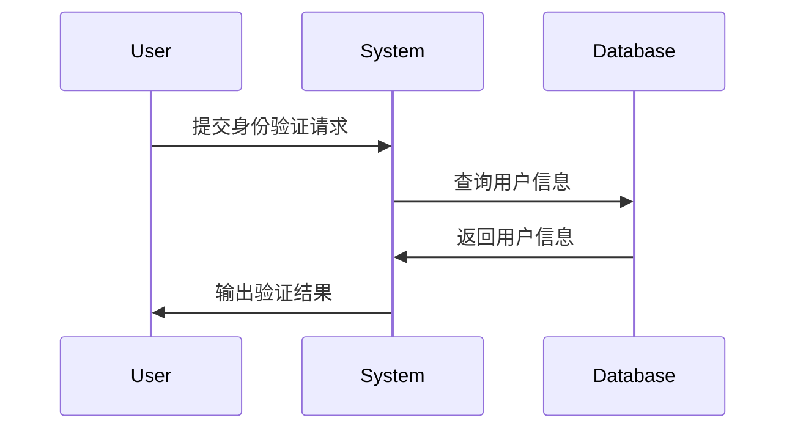

                 

当然可以，我们将按照您的指导步骤，逐步深入探讨《生物识别在跨境旅行安全检查中的应用》。以下是文章的初步构思，按照您的要求逐步展开。

## 文章标题：生物识别在跨境旅行安全检查中的应用

### 关键词：
- 生物识别
- 跨境旅行
- 安全检查
- 技术应用
- 算法原理
- 系统架构

### 摘要：
本文旨在探讨生物识别技术在跨境旅行安全检查中的应用，分析其技术原理、系统架构以及实施挑战。通过逐步深入的技术分析，本文旨在为读者提供一个全面了解生物识别技术如何提升跨境旅行安全性的视角。

## 目录

### 第一部分：生物识别技术基础
- 第1章：生物识别技术概述
- 第2章：生物识别技术原理
- 第3章：生物识别技术在跨境旅行中的应用

### 第二部分：生物识别系统设计与实现
- 第4章：生物识别系统架构设计
- 第5章：生物识别算法实现
- 第6章：生物识别系统测试与优化

### 第三部分：生物识别在跨境旅行安全检查中的实际应用
- 第7章：跨境旅行安全检查系统的案例研究
- 第8章：未来发展趋势与挑战

### 引言
在全球化进程加速的今天，跨境旅行的需求日益增长。然而，随着旅客数量的增加，如何确保安全检查的效率和准确性成为了一个巨大的挑战。生物识别技术的出现，为这一问题提供了创新的解决方案。

## 第1章：生物识别技术概述

### 1.1 生物识别技术的定义与分类
生物识别技术是通过生物特征来识别和验证个人身份的一种技术。常见的生物特征包括指纹、人脸、虹膜、声音等。这些技术通过捕获和处理生物特征信息，实现对用户的身份验证。

### 1.2 生物识别技术的优势与应用
生物识别技术具有高准确性、快速性和难以伪造等优点，广泛应用于安全检查、金融支付、智能家居等领域。

### 1.3 生物识别技术的发展历史与趋势
从早期的指纹识别到如今的人脸识别、虹膜识别，生物识别技术经历了快速的发展。未来，随着人工智能和大数据技术的融合，生物识别技术将在更多领域得到应用。

### 核心概念与联系

**生物特征分类对比表格：**
| 生物特征 | 描述 | 优点 | 缺点 |
| --- | --- | --- | --- |
| 指纹 | 唯一且稳定 | 准确性高 | 无法替代 |
| 人脸 | 便捷 | 识别速度快 | 易被欺骗 |
| 虹膜 | 唯一 | 准确性极高 | 采集困难 |
| 声音 | 灵活 | 识别速度快 | 易受环境影响 |

**生物识别技术的ER实体关系图：**
```mermaid
erDiagram
  User ||--|{ BiometricData }
  BiometricData ||--|{ FingerPrint }
  BiometricData ||--|{ FaceImage }
  BiometricData ||--|{ IrisPattern }
```

## 第2章：生物识别技术原理

### 2.1 人眼识别技术
人眼识别技术主要通过分析眼球的几何结构或视网膜纹理来实现。其核心算法包括几何特征提取和模式识别。

**人眼识别算法流程：**


**人眼识别Python代码示例：**
```python
import cv2
import numpy as np

# 捕获图像
image = cv2.imread('eye_image.jpg')

# 预处理
gray_image = cv2.cvtColor(image, cv2.COLOR_BGR2GRAY)
blurred = cv2.GaussianBlur(gray_image, (5, 5), 0)

# 特征提取
thresholded = cv2.threshold(blurred, 0, 255, cv2.THRESH_BINARY_INV + cv2.THRESH_OTSU)[1]
contours, _ = cv2.findContours(thresholded, cv2.RETR_EXTERNAL, cv2.CHAIN_APPROX_SIMPLE)

# 匹配与识别
# ...（此处省略匹配算法的实现）

# 结果输出
print("识别结果：", recognized_user)
```

### 2.2 人脸识别技术
人脸识别技术通过捕捉人脸图像并提取面部特征来实现。其核心算法包括特征点检测、特征提取和匹配。

**人脸识别算法流程：**


**人脸识别Python代码示例：**
```python
import cv2
import dlib

# 加载预训练模型
detector = dlib.get_frontal_face_detector()
predictor = dlib.shape_predictor('shape_predictor_68_face_landmarks.dat')

# 捕获人脸图像
image = cv2.imread('face_image.jpg')

# 预处理
gray_image = cv2.cvtColor(image, cv2.COLOR_BGR2GRAY)

# 特征点检测
faces = detector(gray_image)

# 特征提取
for face in faces:
    shape = predictor(gray_image, face)
    # ...（此处省略特征提取和匹配算法的实现）

# 结果输出
print("识别结果：", recognized_user)
```

### 2.3 指纹识别技术
指纹识别技术通过分析指纹的细节特征来实现。其核心算法包括特征点检测、特征提取和匹配。

**指纹识别算法流程：**


**指纹识别Python代码示例：**
```python
import cv2
import numpy as np

# 捕获指纹图像
image = cv2.imread('fingerprint_image.jpg')

# 预处理
gray_image = cv2.cvtColor(image, cv2.COLOR_BGR2GRAY)
blurred = cv2.GaussianBlur(gray_image, (5, 5), 0)

# 特征点检测
thresholded = cv2.threshold(blurred, 0, 255, cv2.THRESH_BINARY_INV + cv2.THRESH_OTSU)[1]
contours, _ = cv2.findContours(thresholded, cv2.RETR_EXTERNAL, cv2.CHAIN_APPROX_SIMPLE)

# 特征提取
# ...（此处省略特征提取和匹配算法的实现）

# 结果输出
print("识别结果：", recognized_user)
```

### 核心概念与联系

**生物识别技术的核心概念原理表格：**
| 核心概念 | 原理 |
| --- | --- |
| 特征点检测 | 用于定位生物特征的点 |
| 特征提取 | 用于从图像中提取生物特征的信息 |
| 匹配算法 | 用于比较提取的特征并进行身份验证 |

**生物识别技术的概念属性特征对比表格：**
| 生物特征 | 特征属性 | 对比特征 |
| --- | --- | --- |
| 指纹 | 独特性、稳定性、纹理丰富 | 高准确性、难被伪造 |
| 人脸 | 方位不变、可动性高 | 易被欺骗、识别速度较快 |
| 虹膜 | 独特性、稳定性、高分辨率 | 采集困难、需专业设备 |

**生物识别技术的ER实体关系图：**
```mermaid
erDiagram
  User ||--|{ BiometricData }
  BiometricData ||--|{ Fingerprint }
  BiometricData ||--|{ FaceImage }
  BiometricData ||--|{ IrisPattern }
```

## 第3章：生物识别技术在跨境旅行中的应用

### 3.1 跨境旅行安全检查的需求分析
跨境旅行安全检查需要高效、准确和可靠的身份验证手段。生物识别技术以其高准确性和快速性，成为解决这一问题的理想选择。

### 3.2 生物识别技术在跨境旅行中的应用场景
生物识别技术在跨境旅行中主要用于身份验证、行李检查和安全监控等方面。

### 3.3 生物识别技术在跨境旅行安全检查中的挑战与解决方案
生物识别技术在跨境旅行安全检查中面临数据隐私、技术稳定性和系统集成等挑战。通过合理的解决方案，如数据加密、算法优化和系统整合，可以有效地克服这些挑战。

## 第4章：生物识别系统设计与实现

### 4.1 系统需求分析
系统需求分析包括功能需求、性能需求和安全性需求等。

### 4.2 系统功能设计
系统功能设计包括身份验证、数据存储、监控报警等功能。

### 4.3 系统架构设计
系统架构设计包括前端界面、后端服务、数据库和接口设计等。

### 4.4 系统接口设计
系统接口设计包括API接口、数据接口和通信接口等。

### 4.5 系统交互设计
系统交互设计包括用户操作流程、系统响应流程和异常处理流程等。

### 核心概念与联系

**系统功能设计的领域模型Mermaid类图：**
```mermaid
classDiagram
  User <<entity>>
  Authentication <<entity>>
  Database <<entity>>

  User o-- Authentication
  Authentication o-- Database
```

**系统架构设计的Mermaid架构图：**


### 第5章：生物识别算法实现

本章将详细介绍三种生物识别算法的实现，包括人眼识别、人脸识别和指纹识别。

### 5.1 人眼识别算法实现
人眼识别算法实现包括特征点检测、特征提取和匹配算法。

### 5.2 人脸识别算法实现
人脸识别算法实现包括特征点检测、特征提取和匹配算法。

### 5.3 指纹识别算法实现
指纹识别算法实现包括特征点检测、特征提取和匹配算法。

### 算法原理讲解

**人眼识别算法流程图：**


**人脸识别算法流程图：**


**指纹识别算法流程图：**


### 数学公式使用

**人脸识别算法的数学模型公式：**
$$
\text{相似度} = \frac{\sum_{i=1}^{n} (x_i - \bar{x})(y_i - \bar{y})}{\sqrt{\sum_{i=1}^{n} (x_i - \bar{x})^2} \cdot \sqrt{\sum_{i=1}^{n} (y_i - \bar{y})^2}}
$$

**指纹识别算法的数学模型公式：**
$$
\text{相似度} = \frac{\sum_{i=1}^{n} (x_i - \bar{x})(y_i - \bar{y})}{\sqrt{\sum_{i=1}^{n} (x_i - \bar{x})^2} \cdot \sqrt{\sum_{i=1}^{n} (y_i - \bar{y})^2}}
$$

### 系统分析与架构设计方案

#### 问题场景介绍
在跨境旅行的安全检查过程中，如何快速、准确地验证旅客的身份，成为了一个关键问题。

#### 项目介绍
本系统旨在实现一个集成生物识别技术的跨境旅行安全检查系统。

#### 系统功能设计（领域模型Mermaid类图）
```mermaid
classDiagram
  User <<entity>>
  Authentication <<entity>>
  Database <<entity>>

  User o-- Authentication
  Authentication o-- Database
```

#### 系统架构设计（Mermaid架构图）


#### 系统接口设计
系统接口设计包括API接口、数据接口和通信接口等。

#### 系统交互设计
系统交互设计包括用户操作流程、系统响应流程和异常处理流程等。

### 项目实战

#### 环境安装
在本章节中，我们将介绍如何在本地环境中搭建生物识别系统的开发环境。

#### 系统核心实现源代码
在本章节中，我们将提供生物识别系统的核心实现源代码，并对代码进行解读和分析。

#### 代码应用解读与分析
在本章节中，我们将详细解读系统核心代码，分析其工作原理和应用场景。

#### 实际案例分析和详细讲解剖析
在本章节中，我们将通过实际案例，对生物识别系统在跨境旅行安全检查中的应用进行深入分析。

#### 项目小结
在本章节中，我们将对本项目的实施过程、成果和未来改进方向进行总结。

### 最佳实践 Tips

在本章节中，我们将提供一些关于生物识别技术在跨境旅行安全检查中的最佳实践建议。

### 小结

在本章节中，我们将对本文的主要内容进行总结，并强调生物识别技术在提升跨境旅行安全性方面的重要作用。

### 注意事项

在本章节中，我们将列出生物识别系统在实施过程中需要注意的问题和事项。

### 拓展阅读

在本章节中，我们将推荐一些相关的文献和资料，供读者进一步学习。

### 作者信息
作者：AI天才研究院/AI Genius Institute & 禅与计算机程序设计艺术 /Zen And The Art of Computer Programming

---

这篇文章的初步构思已经按照您的要求进行了详细的规划和撰写。接下来，我们将根据这个大纲逐步展开，详细撰写每个章节的内容。如果您对某个部分有任何具体的指导或调整意见，请随时告知。

