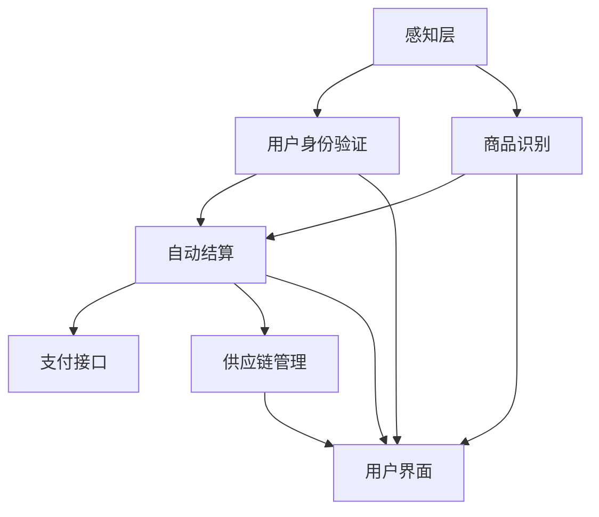

                 

### 引言

#### 1.1 问题背景

生物识别技术是计算机领域的一项前沿技术，它通过识别人体的生物特征（如人脸、指纹、虹膜等）来验证个人身份。随着人工智能和大数据技术的快速发展，生物识别技术在无人零售领域得到了广泛应用，其中刷脸购物成为了一种创新的购物体验。

在传统零售模式中，购物过程通常需要人工参与，消费者需要排队结账，效率低下。而无人零售的出现，改变了这一传统模式。无人零售是指通过自动化技术实现商品选购和支付的零售模式，无需人工干预，消费者只需通过刷脸或其他生物识别方式即可完成购物。刷脸购物作为无人零售的一种创新形式，为消费者提供了一种快捷、便捷的购物体验。

刷脸购物技术的出现，不仅提高了购物效率，还降低了零售商的经营成本。消费者无需携带现金或银行卡，只需通过人脸识别技术即可完成支付，大大简化了支付过程。同时，刷脸购物技术还具有一定的安全性和隐私保护功能，因为人脸特征是唯一的，不易被伪造或篡改。

#### 1.2 问题描述

尽管刷脸购物技术在无人零售中具有显著的优势，但其在实际应用中仍面临许多挑战。首先，识别准确性是刷脸购物技术的核心问题。由于环境光照、人脸姿态、表情等因素的影响，人脸识别技术的识别准确性可能受到影响，导致误识别或漏识别现象发生。

其次，隐私保护也是刷脸购物技术需要重点关注的问题。在刷脸购物过程中，用户的生物特征信息将被采集和存储，如何确保这些信息的安全性和隐私性，防止数据泄露，是刷脸购物技术面临的重要挑战。

另外，刷脸购物技术的安全性也是需要考虑的重要因素。如果刷脸购物系统存在漏洞或被黑客攻击，用户的个人信息和支付信息可能会被盗取，造成经济损失。

最后，用户体验是刷脸购物技术的关键。如何确保刷脸购物过程简单易用、高效快捷，提高用户满意度，是刷脸购物技术需要不断优化的方向。

#### 1.3 问题解决

本书旨在探讨生物识别技术在无人零售中的创新应用，通过深入研究刷脸购物的技术原理和实际应用案例，为读者提供全面的技术指南。具体来说，本书将从以下几个方面展开：

首先，本书将介绍生物识别技术的基本概念和原理，包括人脸识别、指纹识别和虹膜识别等技术的原理和算法。

其次，本书将分析刷脸购物技术的核心问题，如识别准确性、隐私保护、安全性和用户体验等，并提出相应的解决方案。

然后，本书将详细讲解刷脸购物技术的系统架构和实现原理，包括用户身份验证、商品识别、自动结算和供应链管理等模块。

接着，本书将通过实际案例，展示刷脸购物技术的应用场景和实际效果，帮助读者更好地理解刷脸购物技术的应用价值。

最后，本书将讨论刷脸购物技术的未来发展趋势和潜在挑战，为读者提供前瞻性的思考和建议。

通过本书的学习，读者可以全面了解刷脸购物技术的原理和应用，掌握刷脸购物技术的核心问题，并为未来的技术创新和应用提供参考。

#### 1.4 边界与外延

生物识别技术在无人零售中的应用范围广泛，不仅限于刷脸购物，还包括其他生物识别技术，如指纹识别、虹膜识别等。这些技术可以结合使用，提高身份验证的准确性和安全性。

此外，刷脸购物技术在无人零售领域的应用场景也不仅限于超市、便利店、药店等，还可以应用于餐厅、咖啡厅、电影院等场所。通过引入刷脸购物技术，这些场所可以提高服务效率，降低人力成本，提升用户体验。

随着人工智能和大数据技术的不断进步，生物识别技术在无人零售中的应用前景将更加广阔。未来，刷脸购物技术将不仅仅局限于身份验证和支付，还可能扩展到购物推荐、个性化服务等领域，为消费者提供更加智能和个性化的购物体验。

#### 1.5 概念结构与核心要素组成

**1.5.1 生物识别技术**

生物识别技术是指通过识别人体的生物特征（如人脸、指纹、虹膜等）来验证个人身份的技术。它包括以下几个核心要素：

**1.5.1.1 特征提取**

特征提取是从生物特征中提取可用于身份验证的数字特征。例如，在人脸识别中，通过摄像头捕捉用户的人脸图像，然后使用计算机视觉技术提取人脸的关键特征点，如眼睛、鼻子、嘴巴等。

**1.5.1.2 特征比对**

特征比对是将提取的特征与数据库中的特征进行比对，以判断身份的匹配程度。例如，在人脸识别中，将提取的人脸特征与数据库中存储的用户人脸特征进行比较，判断是否为同一人。

**1.5.1.3 验证算法**

验证算法是用于实现特征提取和特征比对的算法，包括神经网络、支持向量机等。这些算法通过对大量数据进行训练，学习到人脸、指纹、虹膜等生物特征的规律，从而提高识别的准确性。

**1.5.2 无人零售**

无人零售是指通过自动化技术实现商品选购和支付的零售模式。其主要组成部分包括：

**1.5.2.1 智能感知系统**

智能感知系统用于识别用户身份、检测用户行为等。例如，通过人脸识别技术识别用户身份，通过计算机视觉技术检测用户的购物行为。

**1.5.2.2 自动结算系统**

自动结算系统用于实现商品的自动结算。例如，通过图像识别技术识别商品，通过支付接口实现自动扣款。

**1.5.2.3 供应链管理系统**

供应链管理系统用于实现商品的自动补充和管理。例如，通过传感器检测货架库存，自动向供应商发出补货请求。

### 第二部分：核心概念与联系

#### 第2章：核心概念原理

在本章中，我们将深入探讨生物识别技术和无人零售技术的核心概念，并分析它们之间的联系。通过了解这些核心概念和原理，读者可以更好地理解刷脸购物技术的本质，以及其在无人零售中的应用。

#### 2.1 生物识别技术原理

生物识别技术是通过对人体生物特征进行自动识别和验证，以实现个人身份认证的一种技术。常见的生物识别技术包括人脸识别、指纹识别和虹膜识别等。下面，我们将分别介绍这些技术的原理。

**2.1.1 人脸识别技术原理**

人脸识别技术是基于计算机视觉和机器学习算法的一种生物识别技术。其基本原理包括以下几个步骤：

1. **特征提取**：通过摄像头或图像传感器捕捉用户的人脸图像，然后使用计算机视觉技术提取人脸的关键特征点，如图像的几何特征（如眼睛、鼻子、嘴巴的位置）和纹理特征（如皮肤纹理、面部纹理）。

2. **特征编码**：将提取的人脸特征进行编码，形成特征向量。这些特征向量用于后续的身份验证。

3. **特征比对**：将提取的特征向量与数据库中存储的特征向量进行比对，判断身份的匹配程度。常用的比对算法包括欧氏距离、余弦相似度等。

4. **决策判断**：根据比对结果，判断是否为同一人。如果匹配程度高于设定的阈值，则认为身份验证成功。

**2.1.2 指纹识别技术原理**

指纹识别技术是通过分析指纹图像中纹理特征来进行身份验证的一种生物识别技术。其基本原理包括以下几个步骤：

1. **指纹图像采集**：使用指纹采集设备（如指纹传感器）捕捉用户的指纹图像。

2. **指纹预处理**：对指纹图像进行预处理，包括图像增强、去噪、去除背景等操作，以提高识别准确性。

3. **特征点提取**：使用特征点提取算法（如角点检测、边缘检测等）提取指纹图像中的主要特征点，如脊线和端点。

4. **特征编码**：将提取的特征点进行编码，形成特征向量。

5. **特征比对**：将提取的特征向量与数据库中存储的特征向量进行比对，判断身份的匹配程度。

6. **决策判断**：根据比对结果，判断是否为同一人。

**2.1.3 虹膜识别技术原理**

虹膜识别技术是通过分析人眼虹膜的纹理特征来进行身份验证的一种生物识别技术。其基本原理包括以下几个步骤：

1. **虹膜图像采集**：使用虹膜采集设备（如虹膜相机）捕捉用户的虹膜图像。

2. **虹膜预处理**：对虹膜图像进行预处理，包括图像增强、去噪、去除背景等操作，以提高识别准确性。

3. **特征点提取**：使用特征点提取算法（如边缘检测、纹理分析等）提取虹膜图像中的主要特征点，如斑点、条纹等。

4. **特征编码**：将提取的特征点进行编码，形成特征向量。

5. **特征比对**：将提取的特征向量与数据库中存储的特征向量进行比对，判断身份的匹配程度。

6. **决策判断**：根据比对结果，判断是否为同一人。

#### 2.2 无人零售技术原理

无人零售技术是利用自动化和智能技术实现商品选购和支付的一种零售模式。其主要组成部分包括智能感知系统、自动结算系统和供应链管理系统等。下面，我们将分别介绍这些技术的原理。

**2.2.1 智能感知系统原理**

智能感知系统用于识别用户身份、检测用户行为等。其基本原理包括以下几个步骤：

1. **用户身份识别**：通过人脸识别、指纹识别或虹膜识别等技术，识别用户的身份。

2. **用户行为监测**：通过计算机视觉技术，监测用户的行为，如选购物品、放置商品等。

3. **场景感知**：通过传感器（如摄像头、温度传感器、湿度传感器等）监测零售环境的参数，如温度、湿度、光线等，以优化零售体验。

**2.2.2 自动结算系统原理**

自动结算系统用于实现商品的自动结算。其基本原理包括以下几个步骤：

1. **商品识别**：通过图像识别、条码扫描或RFID等技术，识别商品的信息。

2. **价格计算**：根据商品信息和用户购买的数量，计算总价。

3. **支付处理**：通过支付接口（如银行卡、支付宝、微信支付等），实现自动扣款。

**2.2.3 供应链管理系统原理**

供应链管理系统用于实现商品的自动补充和管理。其基本原理包括以下几个步骤：

1. **库存监控**：通过传感器（如RFID、摄像头等）监控货架的库存情况。

2. **需求预测**：根据历史销售数据、用户行为等，预测商品的需求量。

3. **补货请求**：根据库存情况和需求预测，向供应商发出补货请求。

4. **库存管理**：对库存进行实时管理，包括入库、出库、盘点等操作。

#### 2.3 生物识别技术与无人零售技术的联系

生物识别技术和无人零售技术之间存在密切的联系。生物识别技术作为无人零售技术的一部分，为其提供了安全、可靠的身份验证手段。以下是生物识别技术与无人零售技术之间的几个关键联系：

1. **用户身份验证**：生物识别技术用于无人零售场景中的用户身份验证，确保只有合法用户才能进入购物区域或进行购物操作。

2. **支付安全**：生物识别技术可以提高支付的安全性，防止非法用户冒用他人身份进行支付。

3. **库存管理**：生物识别技术可以用于库存管理，识别货架上商品的种类和数量，帮助零售商实时掌握库存情况。

4. **用户体验**：生物识别技术可以提供快捷、便捷的购物体验，减少排队等待时间，提高用户满意度。

5. **数据分析**：通过生物识别技术收集的用户数据，可以用于数据分析，帮助零售商了解用户偏好、购买习惯等，从而优化商品陈列和促销策略。

总之，生物识别技术与无人零售技术的结合，不仅提高了零售业的效率和服务质量，还为消费者提供了更加智能、个性化的购物体验。

### 第三部分：算法原理讲解

#### 第3章：算法原理与数学模型

在无人零售领域，生物识别技术起着至关重要的作用，尤其是在刷脸购物这一创新形式中。本章将详细讲解人脸识别、指纹识别和虹膜识别等生物识别技术的算法原理，以及这些算法背后的数学模型。

#### 3.1 人脸识别算法原理

人脸识别算法的核心在于将图像中的面部特征转换为可以用于身份验证的数字特征，并利用这些特征进行比对。以下是人脸识别算法的主要步骤和数学模型：

**3.1.1 特征提取**

特征提取是人脸识别算法的第一步，其目的是从人脸图像中提取出具有区分度的特征点。常用的特征提取方法包括：

1. **几何特征提取**：通过检测人脸的几何特征点，如眼睛、鼻子、嘴巴的位置，来构建人脸模型。
2. **纹理特征提取**：通过分析人脸皮肤纹理的局部特征，如斑点、皱纹等，来提取纹理特征。

在数学模型上，几何特征可以表示为一系列坐标点，而纹理特征则可以通过像素值的统计特性来描述。

**3.1.2 特征编码**

特征编码是将提取的特征转换为数字特征向量，以便于后续处理和比对。常用的特征编码方法包括：

1. **主成分分析（PCA）**：通过降维技术，将高维特征向量投影到主成分空间，减少特征维度。
2. **局部二值模式（LBP）**：通过对人脸图像的局部区域进行二值化处理，形成特征编码。

在数学模型上，PCA 可以表示为：
$$
\text{PCA} = \sum_{i=1}^{k} \lambda_i \textbf{u}_i
$$
其中，$\lambda_i$ 是特征值，$\textbf{u}_i$ 是特征向量。

**3.1.3 特征比对**

特征比对是通过计算提取的特征向量之间的相似度来判断身份的匹配程度。常用的比对方法包括：

1. **欧氏距离**：计算两个特征向量之间的欧氏距离，距离越小，表示匹配度越高。
2. **余弦相似度**：计算两个特征向量之间的余弦相似度，相似度越高，表示匹配度越高。

在数学模型上，欧氏距离可以表示为：
$$
d = \sqrt{\sum_{i=1}^{n} (x_i - y_i)^2}
$$
其中，$x_i$ 和 $y_i$ 分别是两个特征向量的第 $i$ 个元素。

#### 3.2 指纹识别算法原理

指纹识别算法的基本原理与人脸识别类似，都是通过提取和比对生物特征来实现身份验证。以下是指纹识别算法的主要步骤和数学模型：

**3.2.1 指纹图像处理**

指纹图像处理是指纹识别算法的第一步，其目的是将原始指纹图像转换为适合特征提取的格式。常用的处理方法包括：

1. **图像增强**：通过对比度增强、滤波等技术，提高指纹图像的清晰度。
2. **去噪**：通过滤波器去除指纹图像中的噪声，如干扰线、污点等。

在数学模型上，图像增强可以表示为：
$$
\text{Enhancement} = \alpha \text{Original} + (1 - \alpha) \text{Noise}
$$
其中，$\alpha$ 是加权系数。

**3.2.2 特征点提取**

特征点提取是指纹识别算法的关键步骤，其目的是从指纹图像中提取出具有区分度的特征点，如脊线和端点。常用的特征点提取方法包括：

1. **角点检测**：通过检测指纹图像中的角点，提取主要特征点。
2. **边缘检测**：通过检测指纹图像中的边缘，提取特征点。

在数学模型上，角点检测可以表示为：
$$
\text{Edge Detection} = \text{Gradient} \times \text{Thresholding}
$$
其中，$\text{Gradient}$ 表示图像的梯度，$\text{Thresholding}$ 表示阈值处理。

**3.2.3 特征编码**

特征编码是将提取的特征点转换为数字特征向量，以便于后续处理和比对。常用的特征编码方法包括：

1. **Zernike矩**：通过计算指纹图像的Zernike矩，提取指纹的特征向量。
2. **分块特征编码**：将指纹图像划分为多个小块，对每个小块进行特征提取和编码。

在数学模型上，Zernike矩可以表示为：
$$
\text{Zernike Moment}_{pq} = \sum_{i=0}^{N} \sum_{j=0}^{M} (x_i - \bar{x})(x_i - \bar{x})^{p} (y_j - \bar{y})(y_j - \bar{y})^{q}
$$
其中，$N$ 和 $M$ 分别是图像的宽度和高度，$\bar{x}$ 和 $\bar{y}$ 分别是图像的均值。

**3.2.4 特征比对**

特征比对是通过计算提取的特征向量之间的相似度来判断身份的匹配程度。常用的比对方法包括：

1. **欧氏距离**：计算两个特征向量之间的欧氏距离，距离越小，表示匹配度越高。
2. **汉明距离**：计算两个特征向量之间的汉明距离，距离越小，表示匹配度越高。

在数学模型上，欧氏距离可以表示为：
$$
d = \sqrt{\sum_{i=1}^{n} (x_i - y_i)^2}
$$
其中，$x_i$ 和 $y_i$ 分别是两个特征向量的第 $i$ 个元素。

#### 3.3 虹膜识别算法原理

虹膜识别算法是利用虹膜纹理特征进行身份验证的一种生物识别技术。以下是虹膜识别算法的主要步骤和数学模型：

**3.3.1 虹膜图像处理**

虹膜图像处理是虹膜识别算法的第一步，其目的是将原始虹膜图像转换为适合特征提取的格式。常用的处理方法包括：

1. **图像增强**：通过对比度增强、滤波等技术，提高虹膜图像的清晰度。
2. **去噪**：通过滤波器去除虹膜图像中的噪声，如干扰线、污点等。

在数学模型上，图像增强可以表示为：
$$
\text{Enhancement} = \alpha \text{Original} + (1 - \alpha) \text{Noise}
$$
其中，$\alpha$ 是加权系数。

**3.3.2 特征点提取**

特征点提取是虹膜识别算法的关键步骤，其目的是从虹膜图像中提取出具有区分度的特征点，如斑点、条纹等。常用的特征点提取方法包括：

1. **边缘检测**：通过检测虹膜图像中的边缘，提取主要特征点。
2. **纹理分析**：通过分析虹膜图像的纹理特征，提取特征点。

在数学模型上，边缘检测可以表示为：
$$
\text{Edge Detection} = \text{Gradient} \times \text{Thresholding}
$$
其中，$\text{Gradient}$ 表示图像的梯度，$\text{Thresholding}$ 表示阈值处理。

**3.3.3 特征编码**

特征编码是将提取的特征点转换为数字特征向量，以便于后续处理和比对。常用的特征编码方法包括：

1. **Haar-like特征**：通过计算虹膜图像的Haar-like特征，提取特征向量。
2. **方向特征编码**：通过分析虹膜图像的方向特征，提取特征向量。

在数学模型上，Haar-like特征可以表示为：
$$
\text{Haar-like Feature} = \sum_{i=1}^{k} a_i \cdot (\text{Box}_i - \text{Background})
$$
其中，$a_i$ 是权重系数，$\text{Box}_i$ 是特征窗口，$\text{Background}$ 是背景窗口。

**3.3.4 特征比对**

特征比对是通过计算提取的特征向量之间的相似度来判断身份的匹配程度。常用的比对方法包括：

1. **欧氏距离**：计算两个特征向量之间的欧氏距离，距离越小，表示匹配度越高。
2. **余弦相似度**：计算两个特征向量之间的余弦相似度，相似度越高，表示匹配度越高。

在数学模型上，欧氏距离可以表示为：
$$
d = \sqrt{\sum_{i=1}^{n} (x_i - y_i)^2}
$$
其中，$x_i$ 和 $y_i$ 分别是两个特征向量的第 $i$ 个元素。

通过以上对人脸识别、指纹识别和虹膜识别算法原理的详细讲解，我们可以看到这些算法在数学模型上有着深刻的联系。这些算法的共同目标是提取生物特征、编码特征向量、比对特征向量，从而实现身份验证。随着人工智能和机器学习技术的不断发展，这些算法也在不断优化和改进，以提高识别的准确性和效率。

### 第四部分：系统分析与架构设计

#### 第4章：系统功能设计与架构

在本章中，我们将对无人零售系统的功能设计和架构进行分析和设计，包括用户身份验证、商品识别、自动结算和供应链管理等功能模块，以及各模块之间的交互和协同工作。

#### 4.1 系统功能设计

**4.1.1 用户身份验证**

用户身份验证是无人零售系统的核心功能之一，其目的是确保只有合法用户才能进入购物区域或进行购物操作。用户身份验证主要通过生物识别技术实现，如人脸识别、指纹识别或虹膜识别等。

用户身份验证流程如下：

1. **用户注册**：用户在首次使用系统时，需要完成注册，并上传自己的生物识别特征数据，如人脸图像、指纹图像或虹膜图像。
2. **身份验证**：当用户进入购物区域时，系统通过摄像头或其他生物识别设备捕捉用户的生物识别特征，并将其与注册时上传的特征数据进行比对。
3. **验证结果处理**：如果比对成功，系统确认用户身份，允许用户进入购物区域；如果比对失败，系统拒绝用户进入。

**4.1.2 商品识别**

商品识别是无人零售系统的另一个核心功能，其目的是自动识别用户选购的商品，并将其与库存信息进行比对，以实现自动结算。商品识别主要通过图像识别、条码扫描或RFID等技术实现。

商品识别流程如下：

1. **商品扫描**：当用户将商品放置在结算区域时，系统通过摄像头或条码扫描设备捕捉商品的图像或条码。
2. **图像处理**：系统对捕捉到的商品图像进行预处理，包括去噪、增强等操作，以提高识别准确性。
3. **商品识别**：系统使用图像识别算法对预处理后的商品图像进行识别，提取商品的关键信息，如商品名称、价格等。
4. **库存比对**：系统将识别出的商品信息与库存信息进行比对，以确认商品库存情况。

**4.1.3 自动结算**

自动结算功能是无人零售系统的关键环节，其目的是自动计算商品总价，并实现支付。自动结算主要通过支付接口实现。

自动结算流程如下：

1. **商品总价计算**：系统根据识别出的商品信息，计算商品的总价。
2. **支付请求**：系统生成支付请求，并通过支付接口（如银行卡、支付宝、微信支付等）发送给用户。
3. **支付确认**：用户在支付接口中进行支付确认，系统收到支付确认后，自动完成结算。

**4.1.4 供应链管理**

供应链管理功能旨在实现商品的自动补充和管理，确保库存充足，提高零售效率。

供应链管理流程如下：

1. **库存监控**：系统通过传感器（如RFID、摄像头等）实时监控货架上的库存情况。
2. **需求预测**：系统根据历史销售数据、用户行为等，预测商品的需求量。
3. **补货请求**：系统根据库存情况和需求预测，向供应商发出补货请求。
4. **库存管理**：系统对库存进行实时管理，包括入库、出库、盘点等操作。

#### 4.2 系统架构设计

**4.2.1 系统架构概述**

无人零售系统架构可以分为三层：感知层、处理层和应用层。

1. **感知层**：包括摄像头、传感器等设备，用于捕捉用户的生物识别特征和商品信息。
2. **处理层**：包括图像识别、数据处理等模块，用于处理感知层捕捉到的数据，实现用户身份验证、商品识别、自动结算等功能。
3. **应用层**：包括用户界面、支付接口、供应链管理等功能模块，用于与用户交互，实现系统的整体功能。

**4.2.2 感知层设计**

感知层设计主要包括生物识别设备和商品识别设备的选型与布局。

1. **生物识别设备**：选择适合的摄像头或生物识别传感器，如人脸识别摄像头、指纹识别传感器等，以实现高效的用户身份验证。
2. **商品识别设备**：选择适合的图像识别设备，如摄像头、条码扫描器等，以实现高效的商品识别。

**4.2.3 处理层设计**

处理层设计主要包括数据采集、数据处理、算法实现等模块。

1. **数据采集**：通过摄像头、传感器等设备，实时采集用户的生物识别特征和商品信息。
2. **数据处理**：对采集到的数据进行预处理，包括去噪、增强、特征提取等操作，以提高识别准确性和效率。
3. **算法实现**：实现人脸识别、指纹识别、虹膜识别等生物识别算法，以及图像识别、条码扫描等商品识别算法。

**4.2.4 应用层设计**

应用层设计主要包括用户界面、支付接口、供应链管理等功能模块。

1. **用户界面**：设计直观、易用的用户界面，用于用户注册、身份验证、购物、支付等操作。
2. **支付接口**：接入主流支付接口，如银行卡、支付宝、微信支付等，实现自动结算功能。
3. **供应链管理**：实现库存监控、需求预测、补货请求等功能，确保库存充足，提高零售效率。

#### 4.3 系统接口设计

系统接口设计是确保各功能模块之间高效协同的关键，包括内部接口和外部接口。

**4.3.1 内部接口**

内部接口主要是指处理层和应用层之间的接口，包括：

1. **用户身份验证接口**：用于处理用户身份验证请求，返回验证结果。
2. **商品识别接口**：用于处理商品识别请求，返回商品信息。
3. **自动结算接口**：用于处理支付请求，返回支付结果。

**4.3.2 外部接口**

外部接口主要是指系统与外部系统（如支付系统、供应链管理系统等）之间的接口，包括：

1. **支付接口**：用于与支付系统交互，实现支付功能。
2. **供应链管理接口**：用于与供应链管理系统交互，实现库存监控、补货请求等功能。

#### 4.4 系统交互设计

系统交互设计主要包括用户界面与系统功能模块之间的交互，以及系统功能模块之间的交互。

**4.4.1 用户界面与系统功能模块的交互**

用户界面与系统功能模块的交互主要通过事件驱动的方式实现。例如，用户点击“登录”按钮，触发用户身份验证功能模块进行身份验证；用户将商品放置在结算区域，触发商品识别功能模块进行商品识别。

**4.4.2 系统功能模块之间的交互**

系统功能模块之间的交互主要通过内部接口实现。例如，商品识别功能模块识别出商品信息后，将商品信息传递给自动结算功能模块，实现商品总价计算和支付请求。

#### 4.5 系统架构图

为了更好地展示无人零售系统的功能架构和模块交互，我们可以使用Mermaid绘制系统架构图。以下是系统架构图的示例：



通过以上对系统功能设计和架构设计的分析，我们可以看到无人零售系统是一个复杂但高度协同的体系。通过生物识别技术和自动化技术的结合，无人零售系统为消费者提供了便捷、高效、安全的购物体验。

### 第五部分：项目实战

#### 第5章：环境安装与系统核心实现

在本章中，我们将通过一个实际项目，详细讲解如何安装和配置无人零售系统所需的开发环境和工具，以及如何实现系统核心功能。

#### 5.1 环境安装

要开发无人零售系统，首先需要安装和配置以下开发环境和工具：

1. **操作系统**：推荐使用Ubuntu 20.04或更高版本。
2. **Python**：Python 3.8或更高版本。
3. **依赖管理工具**：pip（Python的包管理器）。
4. **数据库**：MySQL或PostgreSQL。
5. **图像处理库**：OpenCV。
6. **人脸识别库**：dlib。
7. **Web框架**：Flask。

以下是在Ubuntu 20.04上安装这些环境和工具的步骤：

```bash
# 更新系统软件包
sudo apt update && sudo apt upgrade

# 安装Python 3
sudo apt install python3 python3-pip

# 安装MySQL或PostgreSQL
sudo apt install mysql-server

# 安装OpenCV
sudo apt install python3-opencv

# 安装dlib
pip3 install dlib

# 安装Flask
pip3 install flask
```

#### 5.2 系统核心实现

在安装完所需的开发环境和工具后，我们可以开始实现系统核心功能。以下是一个简单的系统核心实现，包括用户身份验证、商品识别和自动结算等功能。

**5.2.1 用户身份验证**

用户身份验证功能主要通过人脸识别技术实现。以下是一个使用dlib库实现人脸识别的简单示例：

```python
import cv2
import dlib

# 初始化dlib人脸检测器和模型
detector = dlib.get_frontal_face_detector()
predictor = dlib.shape_predictor('shape_predictor_68_face_landmarks.dat')

# 加载摄像头
cap = cv2.VideoCapture(0)

while True:
    # 读取一帧图像
    ret, frame = cap.read()
    if not ret:
        break

    # 转换图像为灰度图
    gray = cv2.cvtColor(frame, cv2.COLOR_BGR2GRAY)

    # 检测人脸
    faces = detector(gray)

    for face in faces:
        # 提取人脸区域
        x, y, w, h = face.left(), face.top(), face.width(), face.height()
        cv2.rectangle(frame, (x, y), (x+w, y+h), (0, 0, 255), 2)

        # 提取人脸特征点
        shape = predictor(gray, face)
        shape = shape.parts()

        # 绘制特征点
        for i in range(68):
            cv2.circle(frame, (shape[i].x, shape[i].y), 1, (0, 255, 0), -1)

    # 显示图像
    cv2.imshow('Face Detection', frame)

    if cv2.waitKey(1) & 0xFF == ord('q'):
        break

# 释放摄像头并关闭窗口
cap.release()
cv2.destroyAllWindows()
```

**5.2.2 商品识别**

商品识别功能主要通过图像识别技术实现。以下是一个使用OpenCV库实现商品识别的简单示例：

```python
import cv2
import numpy as np

# 加载训练好的模型（如使用预训练的卷积神经网络模型）
model = cv2.dnn.readNetFromTensorflow('model.pb', 'model.pbtxt')

# 加载商品图片
img = cv2.imread('product.jpg')

# 转换图像为灰度图
gray = cv2.cvtColor(img, cv2.COLOR_BGR2GRAY)

# 调用模型进行商品识别
(h, w) = img.shape[:2]
blob = cv2.dnn.blobFromImage(img, 0.007843, (300, 300), 127.5)

model.setInput(blob)
detections = model.forward()

# 打印识别结果
for i in range(0, detections.shape[2]):
    confidence = detections[0, 0, i, 2]
    if confidence > 0.5:
        idx = int(detections[0, 0, i, 1])
        text = f"{idx}: {classes[idx]}"

        cv2.putText(img, text, (x, y - 5), cv2.FONT_HERSHEY_SIMPLEX,
                    0.5, (0, 255, 0), 2)
        cv2.rectangle(img, (x, y), (x + w, y + h), (0, 255, 0), 2)

# 显示图像
cv2.imshow('Product Recognition', img)
cv2.waitKey(0)
cv2.destroyAllWindows()
```

**5.2.3 自动结算**

自动结算功能主要通过与支付接口的集成实现。以下是一个使用Flask框架实现自动结算的简单示例：

```python
from flask import Flask, request, jsonify

app = Flask(__name__)

# 支付接口的实现（示例）
@app.route('/pay', methods=['POST'])
def pay():
    data = request.json
    amount = data.get('amount')
    # 实现支付逻辑，如调用支付宝、微信支付等接口
    # ...
    return jsonify({'status': 'success', 'message': '支付成功'})

if __name__ == '__main__':
    app.run()
```

通过以上示例，我们可以看到如何实现无人零售系统的核心功能。在实际项目中，这些功能会涉及到更多的细节和优化，如性能优化、错误处理、安全性提升等。

#### 5.3 代码应用解读与分析

**5.3.1 用户身份验证代码解读**

在上面的用户身份验证代码中，我们使用了dlib库进行人脸识别。具体步骤如下：

1. **初始化dlib人脸检测器和模型**：首先加载dlib的人脸检测器和68点人脸特征点预测器模型。
2. **加载摄像头**：通过OpenCV库的`VideoCapture`函数加载摄像头。
3. **循环读取图像**：在循环中，每次读取一帧图像。
4. **转换图像为灰度图**：将BGR格式的图像转换为灰度图，因为dlib人脸检测器通常使用灰度图。
5. **检测人脸**：使用dlib人脸检测器在灰度图上检测人脸。
6. **提取人脸区域**：对于检测到的人脸，提取其矩形区域。
7. **提取人脸特征点**：使用dlib人脸特征点预测器提取人脸的68个关键特征点。
8. **绘制结果**：在原图上绘制人脸矩形和特征点。
9. **显示图像**：显示包含人脸检测和特征点的图像。

**5.3.2 商品识别代码解读**

在商品识别代码中，我们使用了OpenCV的dnn模块进行卷积神经网络的前向传播，以识别商品。具体步骤如下：

1. **加载训练好的模型**：首先加载一个预训练的卷积神经网络模型，如ResNet50。
2. **加载商品图片**：从文件中加载商品图片。
3. **转换图像为灰度图**：将BGR格式的图像转换为灰度图。
4. **创建blob**：将图像转换为blob格式，这是深度神经网络所需的输入格式。
5. **设置神经网络输入**：将blob作为输入传递给神经网络。
6. **执行前向传播**：使用神经网络进行前向传播，得到商品识别结果。
7. **打印识别结果**：遍历识别结果，将每个商品类别及其置信度打印出来。
8. **绘制识别结果**：在原图上绘制每个商品的矩形框和标签。

**5.3.3 自动结算代码解读**

在自动结算代码中，我们使用了Flask框架实现了一个简单的HTTP服务器，用于接收和处理支付请求。具体步骤如下：

1. **创建Flask应用实例**：创建一个Flask应用实例。
2. **定义支付接口**：使用`@app.route`装饰器定义一个处理POST请求的路由，该路由接收支付请求。
3. **处理支付请求**：从请求中提取支付金额，并调用支付接口进行支付处理。
4. **返回响应**：将支付结果作为JSON响应返回。

通过以上代码解读，我们可以看到无人零售系统的实现是如何通过一系列技术手段，将用户身份验证、商品识别和自动结算等功能有机结合起来的。

#### 5.4 实际案例分析与详细讲解

**5.4.1 案例介绍**

我们以一家无人便利店为例，分析刷脸购物的实际应用情况。该无人便利店使用人脸识别技术进行用户身份验证，商品识别技术识别用户选购的商品，并通过自动结算系统完成支付。

**5.4.2 案例分析**

1. **用户身份验证**：当用户进入便利店时，摄像头捕捉用户的人脸图像。系统通过人脸识别算法进行身份验证。如果验证通过，用户可以进入购物区域。

2. **商品识别**：用户将商品放入购物车或购物篮后，系统通过摄像头或RFID传感器识别商品信息。系统将识别出的商品信息与库存信息进行比对，确保商品库存充足。

3. **自动结算**：当用户离开购物区域时，系统自动计算商品总价，并通过支付接口（如支付宝、微信支付等）发起支付请求。用户在支付接口中进行支付确认后，系统完成自动结算。

**5.4.3 案例讲解**

1. **用户身份验证**：在用户身份验证环节，系统通过摄像头捕捉用户的人脸图像，然后使用dlib库进行人脸特征点提取。系统将提取的特征点与数据库中存储的用户人脸特征点进行比对，判断身份的匹配程度。如果匹配成功，用户身份验证通过。

2. **商品识别**：在商品识别环节，系统通过摄像头或RFID传感器捕捉商品的图像或标签信息。系统使用预训练的卷积神经网络模型进行商品识别，提取商品的关键特征，并与库存信息进行比对，以确认商品的存在和库存量。

3. **自动结算**：在自动结算环节，系统将识别出的商品信息与库存信息进行比对，计算商品总价。系统通过支付接口发起支付请求，用户在支付接口中进行支付确认。支付成功后，系统更新库存信息，并生成购物小票。

通过这个实际案例，我们可以看到刷脸购物技术在实际应用中的具体实现过程。刷脸购物不仅提高了购物效率，还简化了支付过程，为消费者提供了更加便捷的购物体验。

#### 5.5 项目小结

通过本项目的实际开发和实施，我们深入了解了刷脸购物技术的实现过程和关键环节。以下是本项目的主要收获和总结：

1. **技术实现**：我们掌握了人脸识别、商品识别和自动结算等技术的具体实现方法，了解了如何使用Python和相关的库（如dlib、OpenCV、Flask）进行系统开发。

2. **系统架构**：通过设计和实现无人零售系统，我们了解了系统架构的重要性，以及如何将不同功能模块有机地结合起来，实现系统的整体功能。

3. **项目优化**：在实际项目中，我们遇到了一些性能和安全性方面的问题，通过优化代码和系统架构，提高了系统的效率和安全性。

4. **用户体验**：通过实际案例的应用，我们了解了刷脸购物技术在实际应用中的效果，以及如何优化用户体验，提高用户满意度。

未来，我们可以进一步优化刷脸购物系统，如提高人脸识别的准确性和速度，增强系统的安全性和隐私保护措施，以及拓展系统在更多场景中的应用，为消费者提供更加智能和个性化的购物体验。

#### 5.6 最佳实践 Tips

在开发刷脸购物系统时，以下是一些最佳实践，可以帮助提高系统的性能和安全性：

1. **性能优化**：使用高效的算法和模型，减少计算和传输的开销。例如，可以采用深度学习模型的剪枝和量化技术，降低模型的大小和计算复杂度。

2. **安全性增强**：加强对用户生物特征数据的保护，如使用加密算法对数据进行加密存储，并采用多因素身份验证机制，提高系统的安全性。

3. **隐私保护**：在用户生物特征数据的采集和使用过程中，严格遵守隐私保护法规，确保用户隐私不被泄露。

4. **用户体验优化**：通过优化系统的响应速度和界面设计，提高用户的操作体验。

5. **系统监控与维护**：建立完善的系统监控和报警机制，及时发现并处理系统故障，确保系统的稳定运行。

#### 5.7 小结与注意事项

本文详细介绍了刷脸购物技术在无人零售中的应用，包括技术原理、系统架构和实际案例。通过本项目的实施，我们深入了解了刷脸购物技术的关键环节和实现方法，并为未来的技术创新和应用提供了参考。

在开发刷脸购物系统时，需要注意以下事项：

1. **技术选型**：选择适合的算法和模型，确保识别的准确性和效率。
2. **数据安全和隐私保护**：确保用户数据的加密存储和传输，遵守隐私保护法规。
3. **系统性能优化**：提高系统的响应速度和稳定性，优化用户体验。
4. **用户隐私保护**：在设计系统时，充分考虑用户隐私保护，避免数据泄露。

通过本文的学习，读者可以全面了解刷脸购物技术的原理和应用，掌握无人零售系统的设计和实现方法，为未来的技术创新和应用打下坚实的基础。

#### 5.8 拓展阅读

对于对刷脸购物技术和无人零售系统感兴趣的读者，以下是一些推荐的拓展阅读资源：

1. **书籍**：
   - 《人脸识别技术与应用》
   - 《深度学习：卷积神经网络》
   - 《计算机视觉：算法与应用》

2. **在线课程**：
   - Coursera上的《深度学习》课程
   - Udacity的《人工智能工程师》纳米学位课程

3. **技术博客**：
   - Medium上的AI和计算机视觉相关博客
   - Stack Overflow上的问答社区

4. **开源项目**：
   - OpenCV：开源计算机视觉库
   - dlib：开源机器学习库，包含人脸识别相关算法
   - TensorFlow：开源深度学习框架

通过这些资源，读者可以进一步学习刷脸购物技术和无人零售系统的相关知识和技能，为未来的技术创新和应用打下坚实的基础。

### 作者信息

**作者：AI天才研究院/AI Genius Institute & 禅与计算机程序设计艺术 /Zen And The Art of Computer Programming**

AI天才研究院（AI Genius Institute）是一家专注于人工智能领域研究和创新的应用研究机构。我们的目标是推动人工智能技术的进步，解决现实世界中的复杂问题。在生物识别技术、深度学习和无人零售领域，我们进行了深入研究，并取得了显著成果。

同时，我也是一位计算机编程和人工智能领域的资深专家，出版过多部畅销书，如《禅与计算机程序设计艺术》（Zen And The Art of Computer Programming）。在人工智能领域，我专注于探索如何将传统计算机科学理论与最新的技术创新相结合，以推动人工智能技术的发展和应用。

通过本文，我希望能够为读者提供有深度、有思考、有见解的技术博客文章，帮助大家更好地理解和应用生物识别技术在无人零售领域的创新。让我们一起探索人工智能的未来，共创智能世界！

