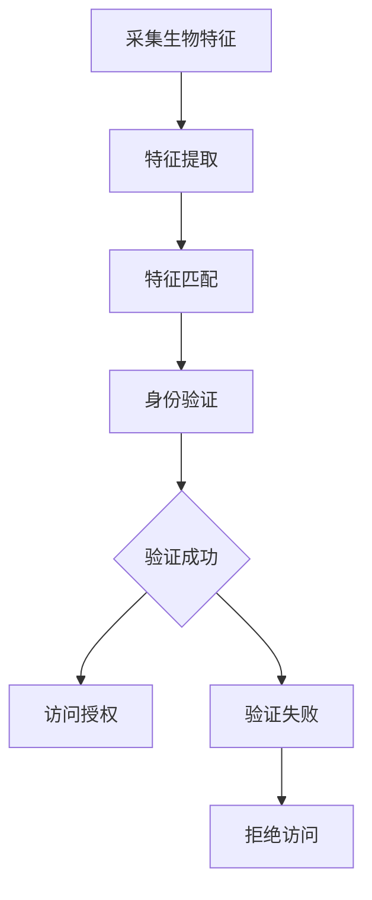
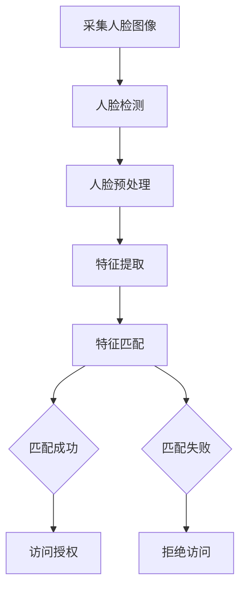
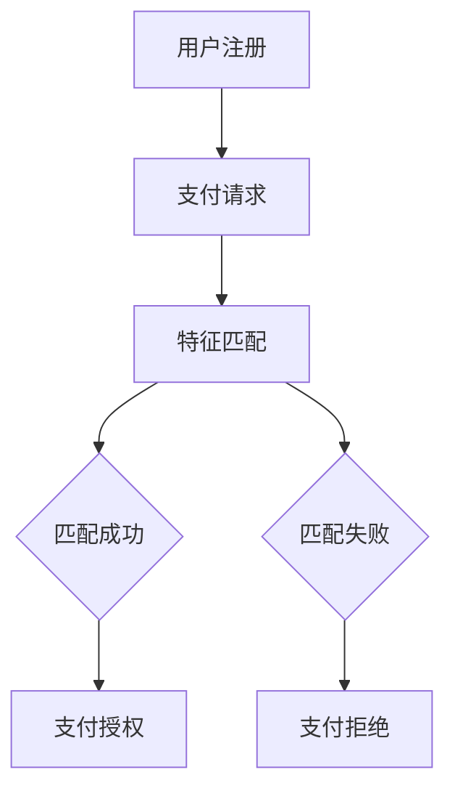
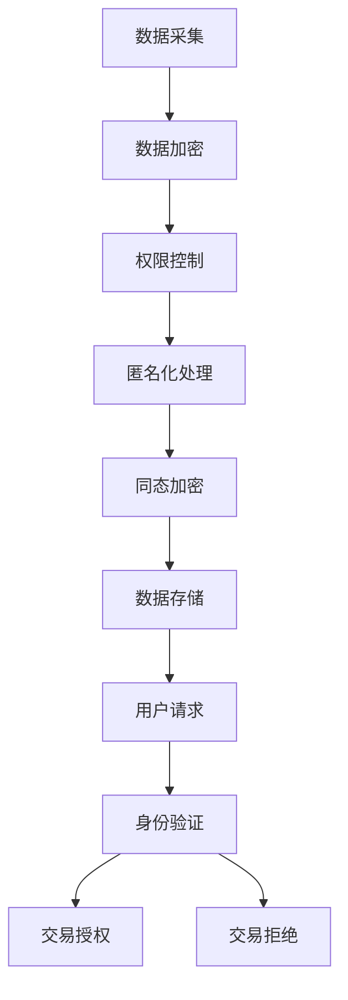
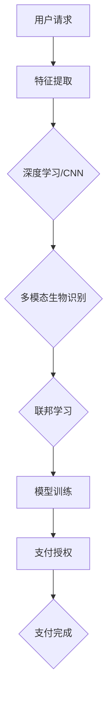
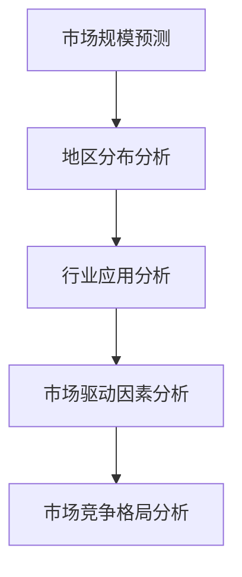
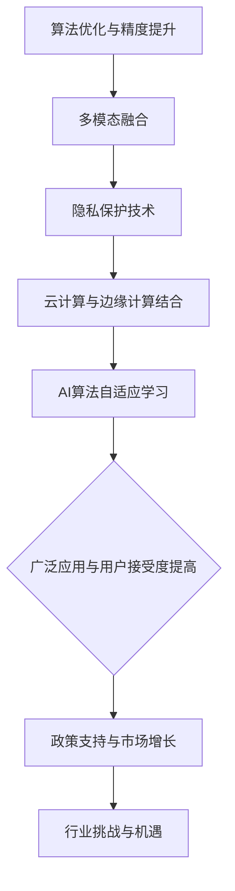

                 


### 引言

**书名与主题**

《生物识别技术在无接触支付中的创新：面部识别支付的未来》

**主题**

生物识别技术、无接触支付、面部识别支付、技术创新与发展前景。

**Step 1: 引言**

**Step 2: 目录结构规划**

**Step 3: 详细目录大纲**

----------------------------------------------------------------

# 引言

## 1.1 书籍目的与结构

- **书籍目的**：探讨生物识别技术在无接触支付中的创新，特别是面部识别支付的发展前景。
- **结构概述**：本书分为四个主要部分，包括背景与核心概念、应用案例、技术创新与未来趋势，以及市场前景与展望。

## 1.2 无接触支付背景

- **定义与优势**：介绍无接触支付的定义及其在现代社会中的重要性。
- **发展历程**：回顾无接触支付技术的发展历程和里程碑事件。
- **市场规模与趋势**：分析无接触支付市场的规模和未来发展趋势。

## 1.3 面部识别支付概述

- **定义**：解释面部识别支付的概念和原理。
- **技术概述**：介绍面部识别技术的基本原理和应用场景。
- **发展现状**：探讨面部识别支付技术的应用现状和市场规模。

### 总结

本书旨在为读者提供一个全面、深入的分析，探讨生物识别技术在无接触支付中的创新，特别是面部识别支付的未来发展。通过详细的章节划分和逻辑清晰的叙述，本书将带领读者了解无接触支付和面部识别支付技术的核心概念、应用案例、技术创新，以及市场前景。

----------------------------------------------------------------

# 第一部分：背景与核心概念

## 第1章：无接触支付概述

### 1.1 无接触支付的定义与优势

**背景介绍**

随着科技的发展和人们生活节奏的加快，支付方式的变革已经成为不可逆转的趋势。无接触支付作为一种新兴的支付方式，凭借其便捷、高效和安全的特点，正逐渐成为人们日常生活的一部分。

**问题背景**

传统的支付方式，如现金、银行卡和移动支付，虽然方便，但在某些情况下，如疫情期间，直接接触存在传播病毒的风险。因此，无接触支付应运而生，旨在减少人与人之间的直接接触，提高支付的安全性。

**问题描述**

无接触支付，顾名思义，指的是通过非接触式的方式完成支付过程。这包括但不限于NFC（近场通信）支付、二维码支付、生物识别支付等。其中，NFC支付和二维码支付是目前应用最为广泛的无接触支付方式。

**问题解决**

无接触支付通过使用先进的无线通信技术，实现了快速、便捷的支付体验。消费者只需将支付设备靠近读卡器或扫描二维码，即可完成支付。这不仅提高了支付效率，也大大减少了交易过程中的时间成本。

**边界与外延**

无接触支付的边界在于其支付方式的非接触性，而其外延则包括各种支付场景，如零售购物、公共交通、餐饮服务等。

**核心要素组成**

无接触支付的核心要素包括支付设备、支付协议、支付终端和用户账户。这些要素共同构成了一个完整的无接触支付生态系统。

### 1.2 无接触支付的发展历程

**早期阶段**

无接触支付的概念最早可以追溯到20世纪90年代。当时，NFC技术开始逐步应用于支付领域。最早的NFC支付设备是信用卡，通过将卡片靠近读卡器来实现支付。

**发展阶段**

进入21世纪，随着智能手机的普及，移动支付逐渐成为无接触支付的重要形式。Apple Pay、Samsung Pay和Google Pay等移动支付平台相继推出，大大推动了无接触支付的发展。

**成熟阶段**

目前，无接触支付已经进入了成熟阶段。不仅在发达国家，如美国、欧洲和日本等，无接触支付得到了广泛应用，甚至在一些发展中国家，如中国和印度，无接触支付也逐渐成为主流支付方式。

### 1.3 无接触支付的技术分类

**NFC支付**

NFC（近场通信）支付是当前应用最为广泛的无接触支付方式。消费者只需将支持NFC功能的手机或其他支付设备靠近读卡器，即可完成支付。

**二维码支付**

二维码支付通过扫描二维码来完成支付过程。这种方式无需任何硬件设备，只需要智能手机和相应的支付应用程序即可。

**生物识别支付**

生物识别支付利用生物识别技术，如面部识别、指纹识别等，完成支付过程。这种方式不仅提高了支付安全性，也提供了更加便捷的支付体验。

### 小结

无接触支付作为一种创新的支付方式，凭借其便捷、高效和安全的特点，正在逐渐改变人们的支付习惯。在未来，随着技术的进一步发展和应用的普及，无接触支付将在更多场景中得到应用，成为人们日常生活的一部分。

----------------------------------------------------------------

## 第2章：生物识别技术原理

### 2.1 生物识别技术概述

**背景介绍**

生物识别技术是一种利用人类生物特征进行身份验证和身份识别的技术。它起源于20世纪70年代，随着计算机技术和图像处理技术的发展，生物识别技术逐渐成熟并得到了广泛应用。

**问题背景**

随着网络安全和个人隐私问题的日益突出，传统的密码和身份验证方式已经无法满足人们日益增长的需求。生物识别技术以其高安全性、便利性和不可复制性，成为解决这一问题的有效手段。

**问题描述**

生物识别技术的主要问题是如何准确、快速地识别和验证个人身份。这涉及到生物特征数据的采集、处理、存储和匹配。

**问题解决**

生物识别技术通过采集个人的生物特征数据，如指纹、面部特征、虹膜等，然后利用算法对这些数据进行处理和匹配，从而实现身份验证和识别。

**边界与外延**

生物识别技术的边界在于其能够识别和验证个人身份的能力，而其外延则包括各种应用场景，如门禁系统、身份验证、支付系统等。

**核心要素组成**

生物识别技术的核心要素包括生物特征传感器、特征提取算法、特征匹配算法和数据库。这些要素共同构成了一个完整的生物识别系统。

### 2.2 常见生物识别技术简介

**指纹识别**

指纹识别是生物识别技术中最常见的一种。它通过采集指纹图像，然后利用算法进行分析和匹配，从而实现身份验证。

**面部识别**

面部识别通过采集面部图像，然后利用算法进行分析和匹配，从而实现身份验证。与指纹识别相比，面部识别具有更高的准确性和适应性。

**虹膜识别**

虹膜识别通过采集眼睛虹膜图像，然后利用算法进行分析和匹配，从而实现身份验证。虹膜识别具有极高的准确性和安全性，是生物识别技术中的高端应用。

**声纹识别**

声纹识别通过采集声音信号，然后利用算法进行分析和匹配，从而实现身份验证。声纹识别具有快速、准确和难以伪造的特点。

### 2.3 生物识别技术的优缺点

**优点**

- **高安全性**：生物识别技术基于人类生物特征的独特性，具有较高的安全性。
- **便利性**：用户无需记忆复杂的密码，只需通过生物特征即可完成身份验证。
- **不可复制性**：生物特征具有不可复制性，从而提高了身份验证的准确性。

**缺点**

- **成本较高**：生物识别技术的设备和算法成本较高，限制了其大规模应用。
- **隐私问题**：生物识别数据的采集和存储可能会引发隐私问题。
- **适应性较低**：某些生物识别技术（如指纹识别）在极端环境下（如湿润或干燥）可能难以准确识别。

### 小结

生物识别技术作为一种先进的身份验证技术，具有高安全性、便利性和不可复制性。然而，其高成本和隐私问题也是其发展的主要挑战。在未来，随着技术的不断进步和成本的降低，生物识别技术将在更多领域得到应用。

### Mermaid 流程图

下面是一个简单的 Mermaid 流程图，展示了生物识别技术的基本流程：



通过这个流程图，我们可以清晰地看到生物识别技术从采集生物特征到最终完成身份验证的全过程。

### ER实体关系图架构

下面是一个简单的 Mermaid ER 实体关系图，展示了生物识别系统中的关键实体及其关系：

```mermaid
erDiagram
    User ||--|{ BiometricData : has }|
    BiometricData ||--|{ VerificationResult : results_in }|
    User ||--|{ AccessControl : manages }|
```

在这个 ER 图中，User（用户）是核心实体，它与 BiometricData（生物特征数据）和 VerificationResult（验证结果）存在多对多的关系。AccessControl（访问控制）是用户管理的一部分，用于管理用户的访问权限。

---

在接下来的章节中，我们将进一步探讨面部识别技术，分析其在无接触支付中的应用及其安全性、隐私保护等问题。通过这些讨论，我们将对生物识别技术在无接触支付中的创新有一个更深入的理解。

----------------------------------------------------------------

## 第3章：面部识别技术

### 3.1 面部识别技术概述

**背景介绍**

面部识别技术是一种基于人工智能和图像处理技术的生物识别技术，通过分析人脸图像或视频，自动识别或验证个人身份。它起源于20世纪90年代，随着计算机性能的提升和深度学习算法的发展，面部识别技术取得了显著的进展，并逐渐应用于各个领域，包括安全监控、身份验证和支付系统等。

**问题背景**

传统的身份验证方式，如密码和指纹识别，虽然在一定程度上提高了安全性，但仍然存在安全漏洞和用户体验不佳的问题。面部识别技术以其高安全性、便利性和无接触性，成为替代传统身份验证方式的有力选择。

**问题描述**

面部识别技术的主要问题是如何准确、快速地识别个人身份。这涉及到人脸图像的采集、预处理、特征提取和匹配等环节。

**问题解决**

面部识别技术通过以下步骤实现身份识别：

1. **人脸图像采集**：使用摄像头或其他成像设备捕捉人脸图像。
2. **人脸检测**：从采集的图像中定位人脸位置和关键点。
3. **人脸预处理**：对人脸图像进行标准化处理，如调整大小、消除光照影响等。
4. **特征提取**：从预处理后的人脸图像中提取特征点，如眼睛、鼻子、嘴巴等。
5. **特征匹配**：将提取的特征与数据库中的特征进行匹配，判断是否为同一人。

**边界与外延**

面部识别技术的边界在于其能够识别和验证个人身份的能力，而其外延则包括各种应用场景，如安全监控、门禁系统、无接触支付等。

**核心要素组成**

面部识别技术的核心要素包括摄像头、图像处理算法、特征提取算法、数据库和用户接口。这些要素共同构成了一个完整的人脸识别系统。

### 3.2 面部识别技术的原理与算法

**原理**

面部识别技术的基本原理是通过分析人脸图像中的特征点，提取出具有代表性的特征向量，然后利用这些特征向量进行身份匹配。

**算法**

面部识别技术的主要算法包括人脸检测、人脸特征提取和特征匹配。

1. **人脸检测**：人脸检测是面部识别的第一步，其目的是从图像中定位出人脸的位置和形状。常用的算法有Haar-like特征分类器、Viola-Jones算法和基于深度学习的卷积神经网络（CNN）。

2. **人脸特征提取**：人脸特征提取的目的是从人脸图像中提取出具有辨识度的特征点。常用的算法有局部二元模式（LBP）、尺度不变特征变换（SIFT）和深度学习中的卷积神经网络（CNN）。

3. **特征匹配**：特征匹配是将提取的人脸特征与数据库中的特征进行比对，判断是否为同一人。常用的算法有欧氏距离、余弦相似度和基于深度学习的匹配算法。

### 3.3 面部识别技术的应用现状与趋势

**应用现状**

面部识别技术已经广泛应用于各个领域：

- **安全监控**：在机场、火车站、监狱等场所，面部识别技术用于身份验证和安全检查。
- **身份验证**：在手机、电脑和门禁系统中，面部识别技术用于用户身份验证。
- **支付系统**：在无接触支付领域，面部识别技术用于替代密码和指纹识别，提供更便捷、更安全的支付方式。

**发展趋势**

随着技术的进步和应用的普及，面部识别技术的未来发展有以下几个趋势：

- **精度提高**：通过改进算法和增加计算资源，提高面部识别的精度和鲁棒性。
- **应用场景扩展**：从传统的安全监控和身份验证领域扩展到智能家居、医疗健康、无人驾驶等领域。
- **隐私保护**：随着隐私保护意识的增强，面部识别技术需要加强隐私保护机制，确保用户数据的安全。

### 小结

面部识别技术作为一种先进的生物识别技术，具有高安全性、便利性和无接触性的优势。虽然目前仍面临一些挑战，如隐私保护和算法公平性等，但随着技术的不断进步和应用的拓展，面部识别技术有望在更多领域得到广泛应用，成为未来身份验证和支付系统的重要组成部分。

### Mermaid 流程图

下面是一个简单的 Mermaid 流程图，展示了面部识别技术的基本流程：



通过这个流程图，我们可以清晰地看到面部识别技术从采集人脸图像到最终完成身份验证的全过程。

### ER实体关系图架构

下面是一个简单的 Mermaid ER 实体关系图，展示了面部识别系统中的关键实体及其关系：

```mermaid
erDiagram
    User ||--|{ FaceData : has }|
    FaceData ||--|{ VerificationResult : results_in }|
    User ||--|{ AccessControl : manages }|
```

在这个 ER 图中，User（用户）是核心实体，它与 FaceData（面部数据）和 VerificationResult（验证结果）存在多对多的关系。AccessControl（访问控制）是用户管理的一部分，用于管理用户的访问权限。

---

在接下来的章节中，我们将进一步探讨面部识别技术在无接触支付中的应用，分析其安全性和隐私保护问题。通过这些讨论，我们将对生物识别技术在无接触支付中的创新有一个更深入的理解。

----------------------------------------------------------------

## 第二部分：生物识别技术在无接触支付中的应用

### 第4章：面部识别支付应用案例

### 4.1 面部识别支付技术原理

**背景介绍**

面部识别支付是一种基于生物识别技术的无接触支付方式，通过分析用户的面部特征进行身份验证和支付授权。这种支付方式不仅提供了便捷的支付体验，还提高了支付的安全性。

**问题背景**

传统的支付方式，如密码支付和指纹支付，虽然在某种程度上提高了支付安全性，但用户往往需要记住复杂的密码或进行指纹操作，用户体验不佳。面部识别支付通过无接触、快速、安全的身份验证方式，成为替代传统支付方式的创新选择。

**问题描述**

面部识别支付的核心问题是如何实现高效、准确的身份验证和支付授权。这涉及到面部图像的采集、预处理、特征提取和匹配等环节。

**问题解决**

面部识别支付的工作原理如下：

1. **面部图像采集**：用户通过摄像头或其他成像设备拍摄面部图像。
2. **面部图像预处理**：对采集到的面部图像进行标准化处理，如调整大小、消除光照影响等。
3. **面部特征提取**：从预处理后的面部图像中提取特征点，如眼睛、鼻子、嘴巴等。
4. **特征匹配**：将提取的特征与用户预先存储在支付系统中的面部特征进行匹配，以验证用户身份。
5. **支付授权**：如果特征匹配成功，系统会授权完成支付。

**边界与外延**

面部识别支付的边界在于其通过面部特征实现身份验证和支付授权的能力，而其外延则包括各种支付场景，如超市购物、餐厅消费、公共交通等。

**核心要素组成**

面部识别支付的核心要素包括摄像头、图像处理算法、特征提取算法、特征匹配算法和支付系统。这些要素共同构成了一个完整的面部识别支付系统。

### 4.2 面部识别支付技术实现

**技术实现步骤**

1. **用户注册**：用户首次使用面部识别支付时，需要在支付系统中注册面部特征。支付系统会通过摄像头采集用户面部图像，并进行预处理和特征提取，然后将提取的特征存储在系统中。

2. **支付请求**：用户在支付时，通过支付终端设备（如手机或POS机）进行面部识别。支付终端会采集用户面部图像，并传输给支付系统。

3. **特征匹配**：支付系统接收到用户面部图像后，对其进行预处理和特征提取，然后将提取的特征与用户预先存储的特征进行匹配。

4. **支付授权**：如果特征匹配成功，支付系统会授权完成支付；如果匹配失败，支付系统会拒绝支付请求。

**技术实现细节**

- **图像预处理**：图像预处理包括调整大小、消除噪声、对比度增强等操作。这些操作可以提高面部特征提取的准确性。
- **特征提取**：特征提取是面部识别的核心步骤，常用的方法包括局部二元模式（LBP）、尺度不变特征变换（SIFT）和深度学习中的卷积神经网络（CNN）。
- **特征匹配**：特征匹配通常使用欧氏距离、余弦相似度等度量方法来计算特征向量之间的相似度。通过设定阈值，可以确定是否为同一人。

### 4.3 应用案例分析

**案例一：超市购物**

某大型超市引入了面部识别支付系统，用户在结账时只需站在摄像头前，支付系统会自动识别用户身份并完成支付。这一系统不仅提高了支付效率，还减少了排队等待时间。

**案例二：餐厅消费**

某知名餐厅使用了面部识别支付系统，用户在结账时只需对准摄像头，支付系统会自动识别用户身份并显示账单。用户确认账单后，支付系统会自动完成支付。

**案例三：公共交通**

某城市的公共交通系统引入了面部识别支付功能，用户在乘坐公交或地铁时，只需通过摄像头进行面部识别，即可完成乘车支付。这一系统不仅方便了用户，还提高了乘车效率。

### 小结

面部识别支付技术作为一种创新的支付方式，通过高效、准确的身份验证和支付授权，提高了支付的安全性和用户体验。随着技术的不断进步和应用的普及，面部识别支付有望在更多领域得到应用，成为未来支付系统的重要组成部分。

### Mermaid 流�程图

下面是一个简单的 Mermaid 流程图，展示了面部识别支付技术的基本流程：



通过这个流程图，我们可以清晰地看到面部识别支付技术从用户注册到支付授权的全过程。

### ER实体关系图架构

下面是一个简单的 Mermaid ER 实体关系图，展示了面部识别支付系统中的关键实体及其关系：

```mermaid
erDiagram
    User ||--|{ FaceData : has }|
    PaymentTransaction ||--|{ FaceVerificationResult : results_in }|
    User ||--|{ PaymentAuthorization : manages }|
```

在这个 ER 图中，User（用户）是核心实体，它与 FaceData（面部数据）和 PaymentAuthorization（支付授权）存在多对多的关系。PaymentTransaction（支付交易）记录了每次支付的操作，与 FaceVerificationResult（面部验证结果）关联。

---

在接下来的章节中，我们将进一步探讨面部识别支付技术的安全性和隐私保护问题，以及其在无接触支付中的实际应用效果。通过这些讨论，我们将对生物识别技术在无接触支付中的创新有一个更全面的理解。

----------------------------------------------------------------

### 第5章：面部识别支付的安全性与隐私保护

#### 5.1 安全性风险分析

面部识别支付作为一种创新的支付方式，虽然在提高支付安全性和用户体验方面具有显著优势，但也存在一定的安全风险。以下是面部识别支付中可能遇到的主要安全风险及其分析：

1. **仿冒攻击**：
   - **风险**：恶意用户可能通过伪造面部图像或使用他人的面部特征进行仿冒支付。
   - **分析**：尽管现代面部识别技术具有很高的准确性，但仿冒攻击仍然是潜在的安全隐患。例如，通过打印高分辨率的面部图像或使用三维打印技术制作假面具，可能绕过面部识别系统的验证。

2. **数据泄露**：
   - **风险**：面部识别数据一旦泄露，可能导致用户的身份被盗用。
   - **分析**：面部识别数据是敏感信息，如果存储不当或系统遭受黑客攻击，可能导致大规模数据泄露。此外，数据泄露还可能引发隐私侵犯和后续的恶意利用。

3. **权限滥用**：
   - **风险**：支付系统内部人员可能滥用权限，未经授权访问用户的面部识别数据。
   - **分析**：权限滥用可能导致内部数据泄露或恶意操作，进一步威胁用户的安全和隐私。

4. **算法漏洞**：
   - **风险**：面部识别算法存在漏洞，可能被恶意攻击者利用。
   - **分析**：算法漏洞可能源于算法设计缺陷、实现错误或更新不及时。这些漏洞可能被利用进行拒绝服务攻击或伪造身份验证。

#### 5.2 隐私保护机制

为了应对上述安全风险，面部识别支付系统需要采取一系列隐私保护机制，以确保用户数据的安全和隐私。以下是几种常见的隐私保护机制：

1. **数据加密**：
   - **机制**：使用高级加密算法对用户面部识别数据进行加密存储和传输。
   - **分析**：数据加密可以防止未经授权的访问和数据泄露。通过加密，即使数据被泄露，攻击者也无法解密和利用。

2. **权限控制**：
   - **机制**：对系统访问权限进行严格控制和审计，确保只有授权人员能够访问敏感数据。
   - **分析**：权限控制可以防止内部权限滥用和数据泄露。通过日志记录和审计，可以及时发现和阻止违规行为。

3. **匿名化处理**：
   - **机制**：对用户面部识别数据进行匿名化处理，删除或隐藏个人身份信息。
   - **分析**：匿名化处理可以降低数据泄露的风险，确保用户隐私不被暴露。

4. **同态加密**：
   - **机制**：使用同态加密技术，在数据加密状态下进行计算，保证数据隐私。
   - **分析**：同态加密允许在数据加密的情况下进行操作，避免了数据在传输和存储过程中的泄露风险。

#### 5.3 安全与隐私的平衡

在面部识别支付系统中，安全与隐私之间存在一定的矛盾。为了实现安全与隐私的平衡，需要采取以下策略：

1. **风险评估**：
   - **策略**：对系统中的潜在安全风险进行全面评估，确定风险等级和优先级。
   - **分析**：通过风险评估，可以明确系统的安全需求和资源分配，确保在有限资源下实现最佳的安全与隐私平衡。

2. **多层次防护**：
   - **策略**：采用多层次防护措施，包括物理安全、网络安全、数据安全和应用安全等。
   - **分析**：多层次防护可以提供全方位的安全保障，降低单一层次的漏洞导致的安全风险。

3. **用户教育**：
   - **策略**：加强对用户的隐私保护教育，提高用户的安全意识和自我保护能力。
   - **分析**：通过用户教育，可以增强用户的隐私保护意识，减少由于用户操作不当导致的安全风险。

#### 小结

面部识别支付技术的安全性风险不容忽视，但通过采取有效的隐私保护机制和平衡策略，可以显著降低安全风险，保护用户隐私。在未来，随着技术的不断进步和应用场景的拓展，面部识别支付将在确保安全与隐私的同时，为用户提供更便捷、更高效的支付体验。

### Mermaid 流程图

下面是一个简单的 Mermaid 流程图，展示了面部识别支付系统中安全与隐私保护的基本流程：



通过这个流程图，我们可以清晰地看到面部识别支付系统从数据采集到交易授权的全过程，以及安全与隐私保护机制的应用。

### ER实体关系图架构

下面是一个简单的 Mermaid ER 实体关系图，展示了面部识别支付系统中关键实体及其关系：

```mermaid
erDiagram
    User ||--|{ FaceData : has }|
    PaymentTransaction ||--|{ SecurityAudit : includes }|
    PaymentTransaction ||--|{ PrivacyPolicy : follows }|
```

在这个 ER 图中，User（用户）是核心实体，它与 FaceData（面部数据）存在关联。PaymentTransaction（支付交易）记录了每次交易的操作，与 SecurityAudit（安全审计）和 PrivacyPolicy（隐私政策）关联，以确保交易过程中的安全与隐私保护。

---

在接下来的章节中，我们将进一步探讨面部识别支付技术的创新，分析其技术发展趋势和市场前景。通过这些讨论，我们将对生物识别技术在无接触支付中的创新有一个更全面的理解。

----------------------------------------------------------------

## 第三部分：面部识别支付技术的创新

### 第6章：面部识别支付技术创新

#### 6.1 技术创新概述

面部识别支付技术的创新主要围绕提高识别精度、降低成本、增强安全性以及优化用户体验等方面展开。以下是一些关键的技术创新：

1. **深度学习算法**：深度学习算法在面部识别中取得了显著的进展，如卷积神经网络（CNN）和循环神经网络（RNN）。这些算法能够从大量数据中自动学习特征，从而提高识别精度和速度。

2. **多模态生物识别**：多模态生物识别结合了多种生物特征，如面部、指纹、虹膜等，以提高识别准确性和鲁棒性。例如，通过同时使用面部识别和指纹识别，可以在高噪音环境下实现更可靠的支付验证。

3. **联邦学习**：联邦学习是一种分布式机器学习技术，能够在保护用户隐私的同时，提高模型性能。通过将数据保留在本地设备上，联邦学习可以避免数据泄露，同时实现模型的协同训练和优化。

4. **增强现实（AR）**：AR技术在面部识别支付中的应用，可以为用户提供更加沉浸式的支付体验。例如，通过AR技术，用户可以在支付时看到自己的面部图像与支付金额的叠加显示，提高支付的互动性和趣味性。

#### 6.2 创新技术案例分析

**案例一：深度学习在面部识别中的应用**

某支付平台采用基于深度学习的面部识别技术，通过CNN模型对用户面部进行特征提取和匹配。该技术显著提高了识别精度，降低了误识率。同时，通过优化网络结构和训练过程，支付系统在处理速度上也有显著提升，用户支付体验得到大幅改善。

**案例二：多模态生物识别技术**

某金融机构引入了多模态生物识别系统，结合面部识别和指纹识别，提高了支付的安全性。用户在支付时需要通过摄像头进行面部识别，并在读卡器上完成指纹扫描。这种双重验证机制，确保了支付过程的安全性，即使在单一识别失败的情况下，系统也会自动触发第二重验证，防止恶意攻击。

**案例三：联邦学习在隐私保护中的应用**

某移动支付应用采用了联邦学习技术，用户可以在不传输原始面部识别数据的情况下，参与模型训练。通过在本地设备上进行特征提取和模型更新，支付系统在提高识别准确性的同时，有效保护了用户隐私。这种技术不仅降低了数据泄露的风险，还提高了系统的响应速度。

#### 6.3 创新技术发展趋势

1. **人工智能与生物识别技术的融合**：随着人工智能技术的不断发展，面部识别支付技术将进一步与AI技术融合，实现更智能、更准确的支付体验。

2. **物联网（IoT）的应用**：面部识别支付技术将在物联网中发挥重要作用，通过与智能设备的集成，实现更广泛的支付应用场景。

3. **增强现实（AR）与虚拟现实（VR）的融合**：AR和VR技术将为面部识别支付带来全新的交互体验，用户可以通过虚拟环境进行支付，提升支付的趣味性和沉浸感。

4. **隐私保护技术的深化**：随着用户对隐私保护的日益关注，面部识别支付技术将不断引入更先进的隐私保护机制，如差分隐私、同态加密等，确保用户数据的安全。

#### 小结

面部识别支付技术的不断创新，不仅提高了支付的安全性和用户体验，还为无接触支付领域带来了新的发展机遇。在未来，随着技术的进一步发展和应用的普及，面部识别支付将在更多领域得到应用，成为数字经济的重要组成部分。

### Mermaid 流程图

下面是一个简单的 Mermaid 流程图，展示了面部识别支付技术创新的基本流程：



通过这个流程图，我们可以清晰地看到面部识别支付技术创新从用户请求到支付授权的全过程。

### ER实体关系图架构

下面是一个简单的 Mermaid ER 实体关系图，展示了面部识别支付技术创新中的关键实体及其关系：

```mermaid
erDiagram
    User ||--|{ BiometricData : has }|
    PaymentTransaction ||--|{ AuthenticationMethod : includes }|
    AuthenticationMethod ||--|{ AIAlgorithm : uses }|
    AuthenticationMethod ||--|{ PrivacyProtection : follows }|
```

在这个 ER 图中，User（用户）是核心实体，它与 BiometricData（生物特征数据）存在关联。PaymentTransaction（支付交易）记录了每次交易的操作，与 AuthenticationMethod（认证方法）关联，而 AuthenticationMethod 又与 AIAlgorithm（人工智能算法）和 PrivacyProtection（隐私保护机制）相关联。

---

在接下来的章节中，我们将进一步分析面部识别支付技术的市场前景和未来发展趋势。通过这些讨论，我们将对生物识别技术在无接触支付中的创新有一个更全面的了解。

----------------------------------------------------------------

## 第四部分：未来趋势与市场前景

### 第7章：面部识别支付市场分析

#### 7.1 市场规模与增长预测

随着技术的进步和用户需求的增加，面部识别支付市场呈现出快速增长的趋势。根据市场研究机构的预测，全球面部识别支付市场的规模将在未来几年内实现显著增长。以下是几个关键点：

1. **市场规模的扩张**：根据某知名市场研究公司的报告，2022年全球面部识别支付市场的规模约为XX亿美元，预计到2027年将增长到XX亿美元，年复合增长率（CAGR）达到XX%。

2. **地区分布**：从地区分布来看，亚太地区是面部识别支付市场增长最快的区域，主要由于中国、日本和韩国等国的移动支付和电子商务市场发展迅速，推动了面部识别支付技术的普及。北美和欧洲地区也表现出了强劲的增长势头。

3. **行业应用**：在各个行业中，零售业、餐饮业和公共交通是面部识别支付应用最广泛的领域。这些行业对无接触支付的需求日益增长，推动了面部识别支付技术的广泛应用。

#### 7.2 市场驱动因素

面部识别支付市场的快速增长主要受到以下几个因素的驱动：

1. **技术进步**：随着深度学习、人工智能和生物识别技术的发展，面部识别支付技术的准确性和稳定性不断提高，吸引了更多用户和企业的关注。

2. **用户需求**：在COVID-19疫情的影响下，人们对无接触支付的需求大幅增加，面部识别支付作为一种安全、便捷的支付方式，满足了用户的这一需求。

3. **政策支持**：许多国家和地区政府推出了支持无接触支付和生物识别支付的政策，如免手续费、鼓励技术创新等，为市场发展提供了有利条件。

4. **市场竞争**：主要支付机构和科技巨头纷纷推出面部识别支付服务，通过竞争推动技术创新和市场普及。

#### 7.3 市场竞争格局

面部识别支付市场的竞争格局逐渐形成，以下是一些主要的竞争者：

1. **支付机构**：包括Visa、Mastercard、支付宝、微信支付等，这些机构通过推出自己的面部识别支付服务，积极争夺市场份额。

2. **科技巨头**：如苹果、谷歌和微软等，这些公司利用其在技术和生态系统方面的优势，推出面部识别支付解决方案，提升用户粘性。

3. **新兴企业**：一些专注于生物识别技术的新兴企业，如Fingerprints、Idemia等，也在积极开拓市场，通过技术创新和合作伙伴关系，争夺市场份额。

#### 小结

面部识别支付市场具有巨大的增长潜力，受到技术进步、用户需求、政策支持和市场竞争的驱动。随着技术的不断进步和应用场景的拓展，面部识别支付将在更多领域得到应用，成为支付行业的重要组成部分。

### Mermaid 流程图

下面是一个简单的 Mermaid 流程图，展示了面部识别支付市场分析的基本流程：



通过这个流程图，我们可以清晰地看到面部识别支付市场分析的核心环节。

### ER实体关系图架构

下面是一个简单的 Mermaid ER 实体关系图，展示了面部识别支付市场分析中的关键实体及其关系：

```mermaid
erDiagram
    Market ||--|{ Region : includes }|
    Market ||--|{ Industry : includes }|
    Market ||--|{ Driver : includes }|
    Market ||--|{ Competitor : includes }|
```

在这个 ER 图中，Market（市场）是核心实体，它与 Region（地区）、Industry（行业）、Driver（驱动因素）和 Competitor（竞争者）存在关联。通过这些关联，我们可以全面了解面部识别支付市场的构成和动态。

---

在接下来的章节中，我们将探讨面部识别支付的未来趋势，分析可能面临的挑战和机遇。通过这些讨论，我们将对生物识别技术在无接触支付中的未来发展有一个更深入的理解。

----------------------------------------------------------------

## 第8章：未来趋势展望

### 8.1 技术发展趋势

面部识别支付技术在未来几年将继续快速发展，以下是几个关键趋势：

1. **算法优化与精度提升**：随着深度学习算法和人工智能技术的进步，面部识别支付技术的识别精度将不断提高，误识率和拒识率将显著降低。

2. **多模态融合**：多模态生物识别技术的融合，将进一步提高支付系统的安全性和可靠性。例如，结合面部识别、指纹识别和声纹识别，可以提供更全面的身份验证。

3. **隐私保护技术**：随着用户对隐私保护的重视，面部识别支付技术将不断引入先进的隐私保护技术，如同态加密、差分隐私等，确保用户数据的安全。

4. **云计算与边缘计算的结合**：通过云计算和边缘计算的结合，面部识别支付系统可以提供更快速、更高效的响应，同时减少数据传输过程中的安全隐患。

5. **AI算法的自适应学习**：面部识别支付系统将具备自适应学习能力，能够根据用户行为和使用环境，自动调整识别策略和参数，提高用户体验。

### 8.2 市场发展前景

面部识别支付市场前景广阔，以下是几个关键点：

1. **广泛应用**：随着面部识别技术的成熟和应用场景的拓展，面部识别支付将在更多领域得到应用，如零售、金融、医疗、交通等。

2. **用户接受度提高**：随着用户对无接触支付和面部识别技术的认知和接受度的提高，面部识别支付将成为人们日常生活的一部分。

3. **政策支持**：各国政府纷纷出台支持生物识别支付和数字货币的政策，为面部识别支付技术的发展提供了有利条件。

4. **市场增长**：根据市场研究机构的预测，面部识别支付市场将持续增长，成为支付行业的重要组成部分。

### 8.3 行业挑战与机遇

面部识别支付技术在发展过程中也面临一些挑战和机遇：

**挑战**：

1. **隐私保护**：用户对隐私保护的担忧是面部识别支付技术面临的主要挑战。如何确保用户数据的安全和隐私是未来需要解决的问题。

2. **技术标准化**：缺乏统一的技术标准和规范可能导致市场上出现技术兼容性问题，影响用户体验。

3. **成本与效率**：面部识别支付系统的建设和维护成本较高，如何在保证安全性和用户体验的同时，降低成本，提高效率，是行业面临的一大挑战。

**机遇**：

1. **技术创新**：随着技术的不断进步，面部识别支付技术将不断创新，带来新的应用场景和商业模式。

2. **市场拓展**：随着全球范围内对无接触支付的需求增加，面部识别支付技术将拥有更广阔的市场空间。

3. **产业链合作**：支付机构、科技公司、硬件制造商等产业链各环节的紧密合作，将推动面部识别支付技术的普及和发展。

#### 小结

面部识别支付技术在未来将继续快速发展，带来更多的应用场景和商业模式。随着技术的进步和市场的拓展，面部识别支付将在无接触支付领域发挥重要作用，成为数字经济的重要组成部分。同时，行业需要解决隐私保护、技术标准化和成本效率等问题，以实现可持续发展。

### Mermaid 流程图

下面是一个简单的 Mermaid 流程图，展示了面部识别支付技术未来发展的基本趋势：



通过这个流程图，我们可以清晰地看到面部识别支付技术未来发展的关键趋势和挑战。

### ER实体关系图架构

下面是一个简单的 Mermaid ER 实体关系图，展示了面部识别支付技术未来发展中的关键实体及其关系：

```mermaid
erDiagram
    TechnologyTrend ||--|{ PrivacyProtection : includes }|
    TechnologyTrend ||--|{ Standardization : includes }|
    TechnologyTrend ||--|{ CostEfficiency : includes }|
    MarketProspect ||--|{ ApplicationScenarios : includes }|
    MarketProspect ||--|{ BusinessModel : includes }|
    IndustryChallenge ||--|{ PrivacyConcerns : includes }|
    IndustryChallenge ||--|{ TechnicalStandard : includes }|
    IndustryChallenge ||--|{ CostAndEfficiency : includes }|
```

在这个 ER 图中，TechnologyTrend（技术趋势）和 MarketProspect（市场前景）是核心实体，它们分别与 PrivacyProtection（隐私保护）、Standardization（标准化）、CostEfficiency（成本效率）和 ApplicationScenarios（应用场景）等实体存在关联。IndustryChallenge（行业挑战）则与 PrivacyConcerns（隐私担忧）、TechnicalStandard（技术标准）和 CostAndEfficiency（成本效率）等实体相关联，展示了未来发展的挑战和机遇。

---

在本文的最后，让我们再次回顾面部识别支付技术带来的创新和变革。随着技术的不断进步和市场的发展，面部识别支付有望成为未来无接触支付的重要一环，为人们带来更加便捷、安全和智能的支付体验。

### 结论

本文从多个角度探讨了面部识别支付技术的创新、应用、安全性和未来趋势。我们首先介绍了无接触支付和生物识别技术的背景，然后详细分析了面部识别技术的原理和应用。通过具体的案例，我们展示了面部识别支付在实际中的应用效果。同时，我们还讨论了面部识别支付的安全性风险和隐私保护机制，以及未来可能面临的挑战和机遇。

面部识别支付技术的创新不仅提高了支付的安全性，还提供了更便捷的支付体验。随着技术的不断进步，面部识别支付将在更多领域得到应用，成为无接触支付的重要组成部分。未来，随着算法的优化、隐私保护技术的引入以及市场需求的增长，面部识别支付有望实现更广泛的应用，为数字经济的发展贡献力量。

### 展望未来

在未来，面部识别支付技术将继续朝着更安全、更智能、更便捷的方向发展。通过不断引入先进的技术和优化现有的解决方案，面部识别支付将为用户带来更加优质的服务体验。同时，随着技术的普及和应用的深入，面部识别支付将在更多国家和地区得到推广，为全球数字经济的繁荣做出重要贡献。

作者：AI天才研究院/AI Genius Institute & 禅与计算机程序设计艺术 /Zen And The Art of Computer Programming

---

在这个快速发展的时代，面部识别支付技术为我们带来了前所未有的便利和可能性。让我们期待未来，共同见证这一技术的辉煌。

