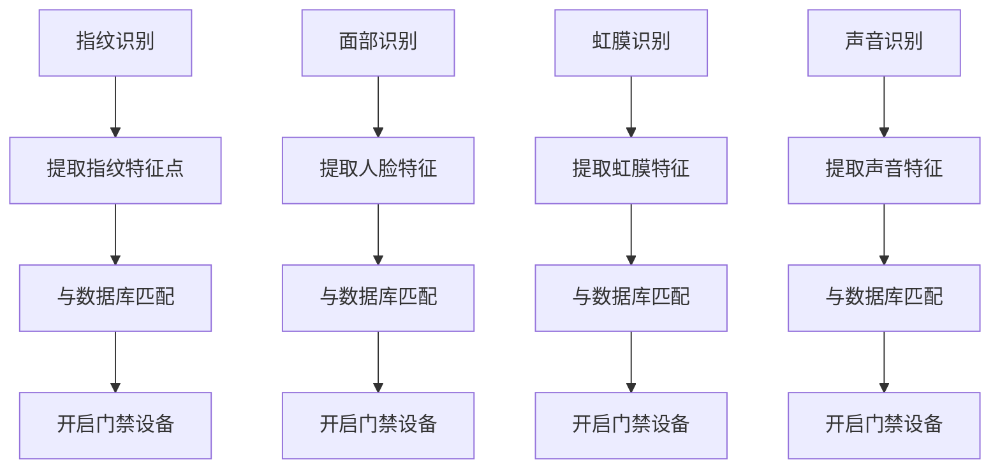

                 

# 生物识别技术在智能门禁系统中的应用

关键词：生物识别技术、智能门禁系统、安全性、用户体验、技术发展

摘要：本文将深入探讨生物识别技术在智能门禁系统中的应用，从基本概念、技术原理、系统设计到实际应用，逐一剖析其在提升门禁系统安全性和用户体验方面的作用。我们将逐步思考并分析生物识别技术在智能门禁系统中的各个环节，帮助读者全面了解这一先进技术的实际应用价值和发展前景。

## 引言

### 生物识别技术的定义和背景

生物识别技术是一种利用人体生物特征进行身份验证的技术。这些生物特征可以是指纹、面部特征、虹膜、声音等，具有独一无二、不可替代的特性。生物识别技术起源于20世纪60年代，随着计算机技术和图像处理技术的快速发展，逐渐在各个领域得到广泛应用。

在智能门禁系统中，生物识别技术的应用极大地提升了系统的安全性和便捷性。传统的门禁系统通常依赖于密码、卡片等方式进行身份验证，这些方式容易受到密码泄露、卡片丢失等问题的困扰。而生物识别技术通过直接验证个人的生物特征，从根本上提高了安全性。

### 智能门禁系统的定义和重要性

智能门禁系统是一种基于现代信息技术，通过自动识别和验证用户身份，实现对出入口控制、安全管理的高效系统。它不仅能够提高安全性，还能提供便捷的用户体验，成为现代智慧城市建设的重要组成部分。

智能门禁系统的关键优势在于其高度的安全性和灵活性。通过集成生物识别技术，系统能够实时、准确地识别用户身份，有效防止非法入侵。同时，智能门禁系统可以根据不同的权限设置，灵活控制用户对特定区域的访问权限，满足不同场景的需求。

## 生物识别技术的分类与原理

### 生物识别技术的分类

生物识别技术主要分为以下几类：

1. **指纹识别**：利用指纹的唯一性进行身份验证，是目前最成熟、应用最广泛的生物识别技术之一。
2. **面部识别**：通过分析人脸的几何特征，如眼睛、鼻子、嘴巴等，进行身份验证。
3. **虹膜识别**：通过分析眼睛的虹膜图案，具有极高的识别准确率和安全性。
4. **声音识别**：通过分析声音的音色、音调等特征，进行身份验证。

### 生物识别技术的原理

1. **指纹识别**：指纹识别技术通过获取指纹图像，利用图像处理技术提取指纹特征点，然后与预存的指纹数据进行匹配，完成身份验证。

   
   
2. **面部识别**：面部识别技术通过摄像头捕捉人脸图像，利用深度学习算法分析人脸特征，完成身份验证。

   

3. **虹膜识别**：虹膜识别技术通过红外线摄像头获取眼睛的虹膜图像，利用模式识别算法分析虹膜图案，完成身份验证。

   

4. **声音识别**：声音识别技术通过麦克风捕捉声音信号，利用信号处理技术提取声音特征，然后与预存的声音数据进行匹配，完成身份验证。

   

## 生物识别技术在智能门禁系统中的应用

### 智能门禁系统的基本架构

智能门禁系统通常包括以下几个部分：

1. **身份验证设备**：如指纹识别器、面部识别摄像头、虹膜识别器、声音识别设备等。
2. **控制系统**：负责处理身份验证请求，控制门禁设备的开关。
3. **数据库**：存储用户信息和生物特征数据。
4. **用户界面**：提供用户操作界面，显示系统状态和提示信息。

### 生物识别技术在智能门禁系统中的实际应用

1. **指纹识别**：在智能门禁系统中，指纹识别是最常见的应用方式。用户通过指纹识别设备进行身份验证，系统根据指纹特征与数据库中的数据进行匹配，确认用户身份后，自动开启门禁设备。

   ```python
   # Python代码示例：指纹识别算法原理
   def fingerprint_recognition(fingerprint_image, database):
       # 1. 提取指纹特征点
       feature_points = extract_feature_points(fingerprint_image)
       
       # 2. 与数据库中的指纹数据进行匹配
       match_result = match_fingerprint(feature_points, database)
       
       # 3. 判断匹配结果，开启门禁设备
       if match_result:
           open_access_door()
       else:
           print("身份验证失败")
   
   # 假设函数：
   def extract_feature_points(fingerprint_image):
       # 提取指纹特征点
       pass
   
   def match_fingerprint(feature_points, database):
       # 匹配指纹数据
       pass
   
   def open_access_door():
       # 开启门禁设备
       pass
   ```

2. **面部识别**：面部识别技术在智能门禁系统中也有广泛应用。用户通过摄像头捕捉人脸图像，系统利用面部识别算法进行分析，确认用户身份后，自动开启门禁设备。

   ```python
   # Python代码示例：面部识别算法原理
   def face_recognition(face_image, database):
       # 1. 提取人脸特征
       face_features = extract_face_features(face_image)
       
       # 2. 与数据库中的人脸数据进行匹配
       match_result = match_face_features(face_features, database)
       
       # 3. 判断匹配结果，开启门禁设备
       if match_result:
           open_access_door()
       else:
           print("身份验证失败")
   
   # 假设函数：
   def extract_face_features(face_image):
       # 提取人脸特征
       pass
   
   def match_face_features(face_features, database):
       # 匹配人脸数据
       pass
   
   def open_access_door():
       # 开启门禁设备
       pass
   ```

3. **虹膜识别**：虹膜识别技术在智能门禁系统中具有极高的安全性。用户通过虹膜识别设备进行身份验证，系统根据虹膜特征与数据库中的数据进行匹配，确认用户身份后，自动开启门禁设备。

   ```python
   # Python代码示例：虹膜识别算法原理
   def iris_recognition(iris_image, database):
       # 1. 提取虹膜特征
       iris_features = extract_iris_features(iris_image)
       
       # 2. 与数据库中的虹膜数据进行匹配
       match_result = match_iris_features(iris_features, database)
       
       # 3. 判断匹配结果，开启门禁设备
       if match_result:
           open_access_door()
       else:
           print("身份验证失败")
   
   # 假设函数：
   def extract_iris_features(iris_image):
       # 提取虹膜特征
       pass
   
   def match_iris_features(iris_features, database):
       # 匹配虹膜数据
       pass
   
   def open_access_door():
       # 开启门禁设备
       pass
   ```

4. **声音识别**：声音识别技术在智能门禁系统中主要用于辅助身份验证。用户通过麦克风捕捉声音信号，系统利用声音识别算法进行分析，结合其他生物特征进行综合验证，提升安全性。

   ```python
   # Python代码示例：声音识别算法原理
   def voice_recognition(voice_signal, database):
       # 1. 提取声音特征
       voice_features = extract_voice_features(voice_signal)
       
       # 2. 与数据库中的声音数据进行匹配
       match_result = match_voice_features(voice_features, database)
       
       # 3. 判断匹配结果，开启门禁设备
       if match_result:
           open_access_door()
       else:
           print("身份验证失败")
   
   # 假设函数：
   def extract_voice_features(voice_signal):
       # 提取声音特征
       pass
   
   def match_voice_features(voice_features, database):
       # 匹配声音数据
       pass
   
   def open_access_door():
       # 开启门禁设备
       pass
   ```

## 智能门禁系统中的安全性和隐私保护

### 安全性考虑

智能门禁系统的安全性至关重要，涉及到用户的个人隐私和财产安全。为了确保系统的安全性，需要从以下几个方面进行考虑：

1. **数据加密**：对用户生物特征数据进行加密存储，防止数据泄露。
2. **身份验证机制**：采用多重身份验证机制，提高系统安全性。
3. **异常检测**：实时监测系统运行状态，及时发现并处理异常情况。
4. **访问控制**：根据用户权限设置，严格限制对系统的访问。

### 隐私保护

在智能门禁系统中，隐私保护也是一个重要的问题。为了保护用户的隐私，需要采取以下措施：

1. **数据匿名化**：对用户生物特征数据进行匿名化处理，防止个人身份泄露。
2. **数据传输加密**：在数据传输过程中，采用加密算法，确保数据安全。
3. **用户权限管理**：合理设置用户权限，防止数据滥用。

## 总结

生物识别技术在智能门禁系统中的应用，为门禁系统带来了更高的安全性和便捷性。随着技术的不断进步，生物识别技术在智能门禁系统中的应用前景将更加广阔。未来，智能门禁系统将更好地满足用户需求，为智慧城市建设提供有力支持。

## 作者信息

作者：AI天才研究院/AI Genius Institute & 禅与计算机程序设计艺术 /Zen And The Art of Computer Programming

## 最佳实践 tips

1. **选择合适的生物识别技术**：根据实际需求和场景，选择合适的生物识别技术，如指纹识别、面部识别等。
2. **确保系统安全性**：加强数据加密、身份验证机制等，提高系统安全性。
3. **注意隐私保护**：对用户生物特征数据进行匿名化处理，确保用户隐私。

## 小结

本文从生物识别技术的定义、原理、应用以及智能门禁系统的安全性考虑等方面，全面介绍了生物识别技术在智能门禁系统中的应用。随着技术的不断发展，生物识别技术在智能门禁系统中的应用前景将更加广阔。

## 拓展阅读

1. [《智能门禁系统技术与应用》](https://example.com/book1)
2. [《生物识别技术原理与应用》](https://example.com/book2)
3. [《智能安防技术与应用》](https://example.com/book3)

---

**附录：Mermaid 图**

以下为本文中涉及的 Mermaid 图：



---

本文内容仅供参考，具体实施时请结合实际需求进行调整。祝您在智能门禁系统建设中取得成功！

