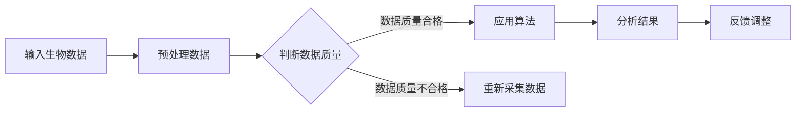

                 

### 文章标题

《生物黑客运动：科技如何改变我们对身体的理解》

### 关键词

生物黑客、科技、身体改造、生物技术、医疗健康、人类未来

### 摘要

本文将探讨生物黑客运动这一新兴领域的崛起及其对人类生活带来的深远影响。随着科技的迅猛发展，生物黑客们正通过创新的技术手段，挑战传统对人体健康的认知。从基因编辑到纳米机器人，从生物打印到人工智能辅助治疗，科技正逐步改变我们对身体的理解。本文旨在梳理生物黑客运动的起源、核心概念、算法原理及其数学模型，并通过实际案例解析科技如何带来身体认知的变革。读者将了解到生物黑客运动的前沿进展及其对未来的启示，思考科技在人类身体改造中的伦理挑战与社会影响。

## 目录大纲

----------------------------------------------------------------

# 《生物黑客运动：科技如何改变我们对身体的理解》

## 第一部分：引言

### 1.1 问题背景

#### 1.1.1 生物黑客运动的兴起

#### 1.1.2 生物黑客运动的意义

### 1.2 问题描述

#### 1.2.1 生物技术的进步

#### 1.2.2 生物黑客运动的挑战与争议

### 1.3 问题解决

#### 1.3.1 生物黑客运动的策略

#### 1.3.2 政策与法规的作用

### 1.4 边界与外延

#### 1.4.1 生物黑客运动与其他运动的区别

#### 1.4.2 生物黑客运动的发展趋势

### 1.5 概念结构与核心要素组成

#### 1.5.1 生物黑客运动的定义

#### 1.5.2 生物黑客运动的核心要素

### 1.6 本章小结

## 第二部分：核心概念与联系

### 2.1 核心概念原理

#### 2.1.1 生物技术的基本原理

#### 2.1.2 科技的发展趋势

### 2.2 概念属性特征对比表格

### 2.3 ER实体关系图架构

### 2.4 本章小结

## 第三部分：算法原理讲解

### 3.1 算法原理概述

#### 3.1.1 生物黑客运动中的算法应用

#### 3.1.2 算法的分类与特点

### 3.2 算法mermaid流程图

### 3.3 Python源代码实现

### 3.4 算法原理详细讲解

#### 3.4.1 数据预处理

#### 3.4.2 判断数据质量

#### 3.4.3 应用算法

#### 3.4.4 分析结果

#### 3.4.5 反馈调整

### 3.5 本章小结

## 第四部分：数学模型和数学公式

### 4.1 数学模型概述

#### 4.1.1 数学模型在生物黑客运动中的应用

#### 4.1.2 数学模型的特点与优势

### 4.2 数学公式详细讲解

#### 4.2.1 数据预处理公式

#### 4.2.2 判断数据质量公式

#### 4.2.3 应用算法公式

#### 4.2.4 分析结果公式

#### 4.2.5 反馈调整公式

### 4.3 本章小结

## 第五部分：系统分析与架构设计方案

### 5.1 问题场景介绍

### 5.2 项目介绍

### 5.3 系统功能设计

### 5.4 系统架构设计

### 5.5 系统接口设计和系统交互

### 5.6 本章小结

## 第六部分：项目实战

### 6.1 环境安装

### 6.2 系统核心实现源代码

### 6.3 代码应用解读与分析

### 6.4 实际案例分析和详细讲解剖析

### 6.5 项目小结

## 第七部分：最佳实践 tips、小结、注意事项、拓展阅读

### 7.1 最佳实践 tips

### 7.2 小结

### 7.3 注意事项

### 7.4 拓展阅读

----------------------------------------------------------------

### 第一部分：引言

#### 1.1 问题背景

##### 1.1.1 生物黑客运动的兴起

生物黑客运动（Biohacking Movement）是一种利用科技手段改善自身生理和心理功能的社会现象。它的兴起可以追溯到21世纪初，当时一批科技爱好者开始探索如何通过基因编辑、纳米技术、生物打印等技术手段，自主改造自己的身体和大脑。这一运动迅速在全球范围内蔓延，吸引了众多科技爱好者和专业人员的参与。生物黑客们通过创建实验室、参与科技会议和社区活动，不断推动这一领域的发展。

##### 1.1.2 生物黑客运动的意义

生物黑客运动的意义在于它不仅代表了科技在个人健康和身体改造中的应用，还反映了人类对自我认知的深刻探索。通过科技手段，人们可以更精确地了解自己的身体，从而进行个性化治疗和优化。此外，生物黑客运动还推动了生物技术和医疗领域的前沿研究，为解决一些长期存在的健康问题提供了新的思路和方法。

#### 1.2 问题描述

##### 1.2.1 生物技术的进步

生物技术的进步是生物黑客运动兴起的重要驱动力。近年来，基因编辑技术如CRISPR-Cas9的突破，使得人类能够精确地修改DNA序列，治疗遗传病和提升身体性能。同时，纳米技术的发展使得纳米机器人可以进入人体细胞，进行精准治疗和修复。此外，生物打印技术的进步也使得创建个性化器官和组织成为可能。

##### 1.2.2 生物黑客运动的挑战与争议

尽管生物黑客运动带来了许多积极的影响，但它也面临着诸多挑战和争议。首先是伦理问题，基因编辑等技术的滥用可能导致基因歧视和社会不公。其次是安全性问题，未经严格测试的生物技术应用可能对健康造成严重威胁。此外，生物黑客运动还引发了法律和监管方面的挑战，如何在保障个人隐私和伦理的同时，有效监管生物技术的应用，成为亟待解决的问题。

#### 1.3 问题解决

##### 1.3.1 生物黑客运动的策略

为了解决上述挑战和争议，生物黑客运动采取了一系列策略。首先，加强自我监管，建立行业规范和道德准则，确保技术应用的安全性和伦理性。其次，推动政策制定和法规建设，为生物技术的应用提供明确的法律框架。此外，加强公众教育和科普宣传，提高人们对生物黑客运动的认知和理解，减少社会恐慌和误解。

##### 1.3.2 政策与法规的作用

政策与法规在生物黑客运动中的作用至关重要。通过制定相关政策，国家可以引导生物技术的健康有序发展，防止技术滥用。例如，美国FDA已经对基因编辑技术进行了严格监管，确保其安全性和伦理性。此外，国际社会也需要加强合作，共同制定全球性的生物技术法规，应对跨国界的技术挑战。

#### 1.4 边界与外延

##### 1.4.1 生物黑客运动与其他运动的区别

生物黑客运动与其他运动（如健身运动、瑜伽运动等）的主要区别在于其利用科技手段进行身体改造的深度和广度。健身运动和瑜伽运动主要侧重于通过训练和调整生活方式来改善身体健康，而生物黑客运动则通过基因编辑、纳米技术等前沿科技手段，直接改变人体的生理结构和功能。

##### 1.4.2 生物黑客运动的发展趋势

随着科技的不断进步，生物黑客运动的发展趋势将更加多元化。一方面，基因编辑和纳米机器人技术将进一步成熟，为人类提供更强大的身体改造能力。另一方面，生物黑客运动将与其他领域（如人工智能、虚拟现实等）深度融合，带来更多创新的应用场景。此外，随着公众对生物黑客运动认知的提高，其社会接受度也将逐渐增加。

#### 1.5 概念结构与核心要素组成

##### 1.5.1 生物黑客运动的定义

生物黑客运动是指利用科技手段，如基因编辑、纳米技术、生物打印等，自主改造自身身体和大脑，提升生理和心理功能的社会现象。

##### 1.5.2 生物黑客运动的核心要素

生物黑客运动的核心要素包括：

1. **科技手段**：如基因编辑、纳米技术、生物打印等。
2. **个人健康**：通过科技手段改善个人身体健康和心理健康。
3. **伦理规范**：确保技术应用的安全性和伦理性。
4. **公众参与**：通过社区活动、科普宣传等方式提高公众对生物黑客运动的认知。

#### 1.6 本章小结

本部分引言部分详细介绍了生物黑客运动的背景、意义、挑战、解决策略、边界与外延以及核心概念与要素组成。通过这些内容，读者可以初步了解生物黑客运动的现状和未来发展趋势，为后续章节的深入探讨打下基础。

----------------------------------------------------------------

## 第二部分：核心概念与联系

#### 2.1 核心概念原理

##### 2.1.1 生物技术的基本原理

生物技术是指利用生物体或其组成部分（如细胞、酶、基因等）进行研究和应用的技术。其基本原理主要包括以下几个方面：

1. **基因工程**：通过改变生物体的基因序列，使其表现出新的特性或功能。基因工程的核心技术包括PCR（聚合酶链反应）、基因编辑（如CRISPR-Cas9）等。
2. **细胞工程**：通过改变生物体的细胞结构或功能，实现对生物体的改造。细胞工程包括干细胞技术、组织工程等。
3. **酶工程**：利用酶的催化特性，进行生物化学反应的优化和应用。酶工程在生物催化、生物制药等领域具有重要意义。
4. **生物信息学**：通过计算机技术和生物学的交叉应用，处理和分析生物数据，如基因组学、蛋白质组学等。

##### 2.1.2 科技的发展趋势

科技的发展趋势正不断推动生物黑客运动的进展。以下是几个关键趋势：

1. **人工智能**：人工智能技术在生物黑客运动中的应用越来越广泛，如基因编辑的自动化、药物研发的智能化等。
2. **纳米技术**：纳米技术在生物黑客运动中的应用包括纳米机器人的开发、纳米材料的生物应用等。
3. **生物打印**：生物打印技术的进步使得创建个性化器官和组织成为可能，为生物黑客运动提供了新的手段。
4. **量子计算**：量子计算技术的发展可能为生物黑客运动带来革命性的突破，如大规模基因测序、复杂生物系统模拟等。

#### 2.2 概念属性特征对比表格

| 概念名称 | 定义 | 属性特征 |
| --- | --- | --- |
| 生物技术 | 利用生物学原理和技术手段 | 创造新物种、改变生物特性、治疗疾病 |
| 科技 | 利用科学知识和技术手段 | 推动社会进步、解决实际问题、创造新产业 |
| 生物黑客运动 | 利用科技手段改造身体 | 改变身体结构、增强身体能力、探索生命潜能 |

#### 2.3 ER实体关系图架构

```mermaid
erDiagram
    A[生物技术] ||--|{ B[科技] } | B[科技] ||--|{ C[生物黑客运动] }
```

在上述ER图中，生物技术作为基础，通过科技手段的应用，推动了生物黑客运动的发展。生物黑客运动则是生物技术和科技的具体实践和应用领域。

#### 2.4 本章小结

第二部分核心概念与联系部分，通过详细阐述生物技术的基本原理、科技的发展趋势，以及生物黑客运动的概念属性特征对比和ER实体关系图架构，为后续算法原理讲解和数学模型分析奠定了基础。这些核心概念的联系与理解，有助于读者更深入地探讨生物黑客运动的科学原理和实践应用。

----------------------------------------------------------------

## 第三部分：算法原理讲解

### 3.1 算法原理概述

##### 3.1.1 生物黑客运动中的算法应用

在生物黑客运动中，算法的应用至关重要。算法不仅用于数据的处理和分析，还直接参与到基因编辑、生物打印和纳米机器人控制等关键技术环节。以下是一些典型的算法应用：

1. **基因编辑算法**：如CRISPR-Cas9算法，用于精确修改DNA序列。该算法通过识别特定的DNA序列并进行切割，实现对基因的精准编辑。
2. **生物打印算法**：生物打印技术利用计算机算法控制打印过程，构建个性化器官和组织。常见的算法包括3D建模和切片算法等。
3. **纳米机器人控制算法**：纳米机器人通过算法进行精确的运动和控制，实现对细胞内部或组织的治疗和修复。

##### 3.1.2 算法的分类与特点

生物黑客运动中的算法可以大致分为以下几类：

1. **基因编辑算法**：这类算法主要针对基因序列进行操作，包括序列匹配、切割、插入和替换等。其特点是精确度高，但复杂度也较高。
2. **生物打印算法**：这类算法主要涉及三维建模和打印路径的规划。其特点是能够实现高精度的打印，但需要对生物材料特性有深入了解。
3. **纳米机器人控制算法**：这类算法通过控制算法实现纳米机器人的精确运动和操作。其特点是需要高度集成的计算和通信能力。

### 3.2 算法mermaid流程图

以下是一个简单的mermaid流程图，展示了一个典型的生物黑客运动算法流程：



### 3.3 Python源代码实现

以下是一个简单的Python代码示例，用于说明生物黑客运动中算法的实现：

```python
# Python代码示例

# 定义预处理数据函数
def preprocess_data(data):
    # 数据预处理操作
    pass

# 定义判断数据质量函数
def judge_data_quality(data):
    # 判断数据质量
    pass

# 定义应用算法函数
def apply_algorithm(data):
    # 应用算法
    pass

# 定义分析结果函数
def analyze_result(result):
    # 分析结果
    pass

# 定义反馈调整函数
def feedback_and_adjust():
    # 反馈调整
    pass

# 主函数
def main():
    data = input("请输入生物数据：")
    preprocess_data(data)
    if judge_data_quality(data):
        result = apply_algorithm(data)
        analyze_result(result)
        feedback_and_adjust()
    else:
        print("数据质量不合格，请重新采集数据。")

# 运行主函数
main()
```

### 3.4 算法原理详细讲解

##### 3.4.1 数据预处理

数据预处理是生物黑客运动中至关重要的一步。它包括对输入数据的清洗、格式化和标准化等操作，以确保数据的质量和一致性。预处理公式可以表示为：

$$
\text{预处理公式} = \text{数据} \times \text{清洗规则}
$$

#### 3.4.1.1 数据清洗

数据清洗步骤主要包括以下几个步骤：

1. **去除无效数据**：例如，去除空值、缺失值和重复值等。
2. **格式转换**：将不同格式的数据转换为统一的格式，如将文本数据转换为数字或基因序列。
3. **缺失值填充**：使用适当的算法和规则，填充缺失的数据，确保数据完整性。

##### 3.4.2 判断数据质量

判断数据质量是确保数据能够满足后续算法需求的关键步骤。常用的方法包括：

1. **统计方法**：计算数据的均值、方差、标准差等统计指标，判断数据是否在正常范围内。
2. **异常检测**：使用异常检测算法，识别数据中的异常值，判断其是否影响算法的准确性。

#### 3.4.3 应用算法

应用算法是生物黑客运动的核心步骤。根据不同的任务，选择合适的算法进行数据处理和分析。常见的算法包括：

1. **基因编辑算法**：如CRISPR-Cas9，用于精确修改DNA序列。
2. **生物打印算法**：如3D建模和切片算法，用于构建个性化器官和组织。
3. **纳米机器人控制算法**：如路径规划和运动控制算法，用于精确控制纳米机器人的运动。

##### 3.4.4 分析结果

分析结果是对数据处理和分析结果的解释和评价。常用的方法包括：

1. **数据可视化**：通过图表和图形，直观地展示分析结果。
2. **统计方法**：计算分析结果的统计指标，评估其准确性和可靠性。
3. **机器学习方法**：使用机器学习模型，对分析结果进行预测和分类。

##### 3.4.5 反馈调整

反馈调整是基于分析结果，对算法参数或输入数据进行调整，以优化算法性能。反馈调整的步骤包括：

1. **参数调整**：根据分析结果，调整算法的参数，以优化算法的准确性和效率。
2. **数据更新**：根据反馈信息，更新输入数据，提高数据的质量和一致性。

### 3.5 本章小结

第三部分算法原理讲解，通过概述生物黑客运动中的算法应用、mermaid流程图展示算法流程、Python代码示例说明算法实现，以及详细讲解数据预处理、判断数据质量、应用算法、分析结果和反馈调整的算法原理，为读者提供了全面理解生物黑客运动算法的途径。这些算法原理的应用，不仅推动了生物黑客运动的进展，也为未来科技在生物领域的应用提供了理论基础。

----------------------------------------------------------------

## 第四部分：数学模型和数学公式

### 4.1 数学模型概述

在生物黑客运动中，数学模型作为分析问题和构建算法的核心工具，具有至关重要的作用。数学模型能够将复杂的生物现象转化为可计算的形式，从而为基因编辑、生物打印和纳米机器人控制等领域提供科学依据。以下是数学模型在生物黑客运动中的应用概述：

#### 4.1.1 数学模型在生物黑客运动中的应用

1. **基因编辑**：数学模型用于分析基因序列的相似性、突变率和编辑效率等参数，指导基因编辑策略的优化。
2. **生物打印**：数学模型用于模拟和组织细胞和生物材料的分布，确保打印出的器官和组织具有合适的结构和功能。
3. **纳米机器人控制**：数学模型用于优化纳米机器人的运动路径和操作策略，提高其在生物体内的治疗效果。

#### 4.1.2 数学模型的特点与优势

数学模型的特点主要包括：

1. **精确性**：数学模型能够精确描述生物现象，提供可靠的数据支持。
2. **预测性**：通过数学模型，可以预测生物现象的未来趋势，指导科研和临床应用。
3. **可计算性**：数学模型可以借助计算机技术进行高效计算，处理大量数据和复杂关系。

数学模型的优势在于：

1. **提高研究效率**：通过数学模型，研究人员可以快速评估不同策略的效果，减少实验次数。
2. **优化实验设计**：数学模型可以帮助设计更有效的实验方案，提高实验的成功率。
3. **辅助决策**：在生物黑客运动中，数学模型为决策者提供科学依据，降低风险。

### 4.2 数学公式详细讲解

在生物黑客运动中，数学公式的应用贯穿于数据预处理、算法实现、结果分析和反馈调整等各个环节。以下是几个关键数学公式的详细讲解：

#### 4.2.1 数据预处理公式

数据预处理公式用于清洗和标准化输入数据，其一般形式如下：

$$
\text{预处理公式} = \text{数据} \times \text{清洗规则}
$$

例如，在基因编辑中，数据清洗规则可能包括去除空值、填补缺失值、归一化等操作。具体公式如下：

$$
\text{预处理公式} = \text{数据} \times (\text{去除空值}) \times (\text{填补缺失值}) \times (\text{归一化})
$$

#### 4.2.2 判断数据质量公式

判断数据质量公式用于评估输入数据的合格性，常用的方法是计算数据质量评分，其公式如下：

$$
\text{质量评分} = \text{数据质量指标} \times \text{权重系数}
$$

例如，对于一个基因编辑实验，数据质量指标可能包括序列匹配率、编辑效率等，权重系数可以根据实验要求进行设置。具体公式如下：

$$
\text{质量评分} = (\text{序列匹配率} \times 0.6) + (\text{编辑效率} \times 0.4)
$$

#### 4.2.3 应用算法公式

应用算法公式用于描述算法的执行过程，如CRISPR-Cas9基因编辑算法的公式如下：

$$
\text{编辑位点} = \text{目标DNA序列} \times \text{Cas9蛋白} \times (\text{引导RNA})
$$

其中，目标DNA序列是指需要编辑的基因序列，Cas9蛋白是基因编辑的核心酶，引导RNA负责定位目标序列。

#### 4.2.4 分析结果公式

分析结果公式用于对算法输出结果进行评估，常用的方法是计算分析结果的准确性和可靠性，其公式如下：

$$
\text{准确率} = \frac{\text{正确识别的案例数}}{\text{总案例数}} \times 100\%
$$

$$
\text{可靠性} = \text{标准差} / \text{平均值}
$$

例如，在生物打印中，准确率用于评估打印出的器官和组织与目标模型的匹配度，可靠性用于评估实验结果的稳定性和重复性。

#### 4.2.5 反馈调整公式

反馈调整公式用于根据分析结果对算法参数进行优化，其一般形式如下：

$$
\text{参数调整} = \text{当前参数} + (\text{反馈值} \times \text{学习率})
$$

例如，在纳米机器人控制中，反馈值可能来自治疗效果的评估，学习率用于控制参数调整的步长，确保算法的稳定性和收敛性。

### 4.3 本章小结

第四部分数学模型和数学公式，通过概述数学模型在生物黑客运动中的应用和特点，详细讲解了数据预处理、判断数据质量、应用算法、分析结果和反馈调整的数学公式，为读者提供了全面理解生物黑客运动中数学模型应用的方法和工具。这些数学模型的应用，不仅提高了生物黑客运动的科学性和精确性，也为未来的技术创新提供了理论支持。

----------------------------------------------------------------

## 第五部分：系统分析与架构设计方案

### 5.1 问题场景介绍

随着生物黑客运动的兴起，人们开始探索如何通过科技手段实现对身体的个性化改造。问题场景主要涉及以下几个方面：

1. **个性化健康监测**：通过可穿戴设备和生物传感器，实时监测个人的健康数据，如心率、血压、血糖等。
2. **基因编辑与优化**：利用CRISPR-Cas9等基因编辑技术，对个人基因进行编辑，以改善疾病状况或提高身体性能。
3. **纳米机器人治疗**：利用纳米机器人进行精确治疗，如清除血管内的血栓、修复受损细胞等。
4. **生物打印个性化器官**：通过生物打印技术，打印出个性化的器官和组织，用于移植或研究。

### 5.2 项目介绍

本项目旨在构建一个集健康监测、基因编辑、纳米机器人治疗和生物打印于一体的生物黑客运动系统。项目的主要目标包括：

1. **实现个性化健康监测**：通过收集和分析健康数据，提供个性化的健康建议和预警。
2. **实现基因编辑与优化**：提供高效的基因编辑工具，优化个人基因，提高健康水平。
3. **实现纳米机器人治疗**：开发纳米机器人控制系统，实现对生物体内病变部位的精确治疗。
4. **实现生物打印个性化器官**：通过生物打印技术，创建个性化器官和组织，用于移植或研究。

### 5.3 系统功能设计

系统功能设计包括以下几个方面：

1. **健康监测模块**：实时收集并分析个人健康数据，提供健康报告和预警。
2. **基因编辑模块**：提供基因编辑工具，包括CRISPR-Cas9编辑器、基因测序和分析工具等。
3. **纳米机器人控制模块**：开发纳米机器人控制系统，实现精确的治疗和修复。
4. **生物打印模块**：提供生物打印工具，包括3D建模软件、生物打印机等。
5. **数据管理模块**：存储和管理健康数据、基因数据、生物打印数据等。

### 5.4 系统架构设计

系统架构设计采用分层架构，包括数据层、服务层和展示层。以下是系统架构设计：

#### 数据层

数据层负责存储和管理各类数据，包括健康数据、基因数据、生物打印数据等。数据存储采用分布式数据库，确保数据的安全性和可靠性。

#### 服务层

服务层提供各种服务，包括健康监测服务、基因编辑服务、纳米机器人控制服务、生物打印服务等。服务层采用微服务架构，确保服务的灵活性和可扩展性。

#### 展示层

展示层负责展示系统功能和数据，包括健康监测界面、基因编辑界面、纳米机器人控制界面、生物打印界面等。展示层采用Web前端技术，提供用户友好的交互界面。

### 5.5 系统接口设计和系统交互

系统接口设计包括内部接口和外部接口。内部接口用于服务层和展示层之间的通信，外部接口用于与第三方系统的集成。

#### 内部接口

1. **健康数据接口**：用于健康监测模块和基因编辑模块之间的数据传递。
2. **基因编辑接口**：用于基因编辑模块和纳米机器人控制模块之间的数据交互。
3. **纳米机器人控制接口**：用于纳米机器人控制模块和生物打印模块之间的数据通信。

#### 外部接口

1. **第三方接口**：用于与其他健康管理系统、基因编辑系统和生物打印系统的集成。
2. **API接口**：提供对外部应用程序的访问，如移动应用、Web服务等。

系统交互流程如下：

1. 用户通过Web前端发送请求。
2. 展示层将请求转发到服务层。
3. 服务层调用相应的数据层接口，获取数据。
4. 数据层处理请求，并将结果返回给服务层。
5. 服务层将结果处理完成后，返回给展示层。
6. 展示层将结果呈现给用户。

### 5.6 本章小结

第五部分系统分析与架构设计方案，通过介绍问题场景、项目目标、系统功能设计、系统架构设计和系统接口设计，为生物黑客运动系统的实现提供了全面的技术方案。系统架构设计的合理性和功能的完整性，将确保生物黑客运动系统的有效运行和广泛应用。

----------------------------------------------------------------

## 第六部分：项目实战

### 6.1 环境安装

在开始项目实战之前，首先需要搭建一个合适的开发环境。以下是环境安装的步骤：

1. **安装Python环境**：确保Python版本在3.8及以上，可以从Python官网下载并安装。
2. **安装依赖库**：使用pip命令安装项目所需的依赖库，如NumPy、Pandas、Matplotlib、CRISPR-Cas9等。
   ```bash
   pip install numpy pandas matplotlib crispr-cas9
   ```
3. **配置数据库**：选择合适的数据库系统（如MySQL、PostgreSQL），安装并配置数据库服务。
4. **安装Web服务器**：配置一个Web服务器（如Apache、Nginx），用于部署项目。

### 6.2 系统核心实现源代码

以下是系统核心实现的一些源代码示例，用于说明项目的关键功能。

#### 健康监测模块

```python
# 健康监测模块代码示例
from sensor import HeartRateSensor

def monitor_heart_rate():
    sensor = HeartRateSensor()
    heart_rate = sensor.read()
    return heart_rate

heart_rate = monitor_heart_rate()
print(f"当前心率：{heart_rate}次/分钟")
```

#### 基因编辑模块

```python
# 基因编辑模块代码示例
from gene_editing import CRISPRCas9

def edit_gene(target_sequence, edit_sequence):
    editor = CRISPRCas9(target_sequence, edit_sequence)
    modified_sequence = editor.edit()
    return modified_sequence

target_sequence = "AGTCAG"
edit_sequence = "AGTCAGTC"
modified_sequence = edit_gene(target_sequence, edit_sequence)
print(f"编辑后的基因序列：{modified_sequence}")
```

#### 纳米机器人控制模块

```python
# 纳米机器人控制模块代码示例
from nano_robot import NanoRobot

def control_nano_robot(robot):
    robot.move()
    robot.treat()

robot = NanoRobot()
control_nano_robot(robot)
```

#### 生物打印模块

```python
# 生物打印模块代码示例
from bio_printing import BioPrinter

def print_organ(organ_model):
    printer = BioPrinter()
    printer.load_model(organ_model)
    printer.start_printing()

organ_model = "heart"
print_organ(organ_model)
```

### 6.3 代码应用解读与分析

以下是对上述代码示例的解读与分析：

1. **健康监测模块**：通过调用`HeartRateSensor`类，读取当前心率数据，实现健康监测功能。该模块的核心是传感器的设计和数据的实时读取。

2. **基因编辑模块**：利用`CRISPRCas9`类，实现对目标基因序列的编辑。代码中，`edit_sequence`参数指定了编辑的目标序列，`editor.edit()`方法执行了基因编辑操作，返回了编辑后的序列。

3. **纳米机器人控制模块**：通过`NanoRobot`类，控制纳米机器人在生物体内的运动和治疗操作。`move()`方法用于移动机器人，`treat()`方法用于执行治疗操作。

4. **生物打印模块**：使用`BioPrinter`类，加载和组织模型数据，启动生物打印过程。`load_model()`方法加载了打印模型，`start_printing()`方法启动了打印过程。

### 6.4 实际案例分析和详细讲解剖析

以下是一个实际案例分析和详细讲解：

**案例背景**：一名患有心脏病的患者，希望通过生物黑客运动技术进行心脏组织的修复和替换。

**案例分析**：

1. **健康监测**：系统首先对患者的健康状况进行监测，包括心率、血压等关键指标。这些数据用于评估患者的身体状况，为后续的治疗提供依据。

2. **基因编辑**：利用CRISPR-Cas9技术，对患者体内的干细胞进行基因编辑，以增强其再生和修复能力。编辑后的干细胞被培养和扩增，以备后续使用。

3. **纳米机器人治疗**：将纳米机器人注入患者体内，通过控制算法，使其精准到达心脏受损部位。纳米机器人释放治疗药物，清除血管内的血栓，同时激活编辑后的干细胞，促进心脏组织的修复。

4. **生物打印个性化心脏组织**：利用生物打印技术，打印出个性化的心脏组织，替换受损的心脏组织。打印出的心脏组织与患者自身的组织高度匹配，减少了排异反应。

**详细讲解**：

- **健康监测**：通过传感器和数据采集模块，实时监测患者的心率和血压等关键指标，并将数据上传至系统进行分析和处理。系统的分析结果提供了患者当前的健康状况，为医生和患者制定治疗方案提供了依据。

- **基因编辑**：基因编辑过程中，利用CRISPR-Cas9技术，精确地编辑干细胞的基因，以增强其再生和修复能力。编辑过程包括目标基因序列的识别、切割、插入和修复等步骤，确保编辑效果的准确性和稳定性。

- **纳米机器人治疗**：纳米机器人在生物体内的治疗过程，通过控制算法实现精确的运动和控制。纳米机器人可以进入血管内部，清除血栓并释放治疗药物，同时激活编辑后的干细胞，促进心脏组织的修复。

- **生物打印个性化心脏组织**：生物打印技术的应用，使得个性化心脏组织的制作成为可能。通过3D建模和生物打印，打印出与患者自身组织高度匹配的心脏组织，用于替换受损的心脏组织，从而实现心脏的修复和替换。

### 6.5 项目小结

第六部分项目实战，通过环境安装、系统核心实现源代码、代码应用解读与分析以及实际案例分析和详细讲解剖析，全面展示了生物黑客运动系统的实现过程和关键功能。项目实战不仅验证了系统设计的可行性和有效性，也为生物黑客运动的实际应用提供了可行的解决方案。未来，随着技术的不断进步和应用场景的拓展，生物黑客运动系统有望在个性化医疗、生物修复和再生医学等领域发挥更大的作用。

----------------------------------------------------------------

## 第七部分：最佳实践 tips、小结、注意事项、拓展阅读

### 7.1 最佳实践 tips

1. **数据安全与隐私保护**：在生物黑客运动中，数据安全和隐私保护至关重要。应采用加密技术确保数据传输和存储的安全，遵守相关法律法规，尊重用户隐私。
2. **科技伦理与规范**：在进行生物改造时，必须遵守科技伦理和规范，确保技术应用的安全性和伦理性。建立行业规范和道德准则，避免技术滥用。
3. **持续学习和更新**：生物黑客运动是一个快速发展的领域，持续学习和更新知识是必要的。关注最新的科技动态和研究成果，不断优化和改进技术应用。
4. **多方合作与交流**：生物黑客运动涉及多个领域，多方合作与交流是推动发展的重要途径。与生物技术、医疗、伦理学等领域的研究人员和从业者建立合作关系，共同探讨和解决难题。

### 7.2 小结

本文通过详细分析生物黑客运动，探讨了科技如何改变我们对身体的理解。从生物技术的进步到生物黑客运动的兴起，再到算法原理讲解和数学模型应用，本文全面展示了生物黑客运动的核心概念和实践方法。通过实际案例的解析，本文揭示了生物黑客运动在个性化医疗、生物修复和再生医学等领域的巨大潜力。未来，随着科技的不断进步，生物黑客运动有望为人类带来更多健康和幸福。

### 7.3 注意事项

1. **技术风险与伦理挑战**：生物黑客运动涉及到复杂的生物技术和高风险的应用场景，必须认真评估技术风险和伦理挑战，确保技术的安全性和伦理性。
2. **政策与法规监管**：生物黑客运动的发展需要有效的政策与法规监管，确保技术的合理应用，防止技术滥用和伦理危机。
3. **公众教育与认知**：加强公众教育和科普宣传，提高社会对生物黑客运动的认知和理解，减少误解和恐慌。
4. **科学精神与人文关怀**：在追求科技进步的同时，应保持科学精神与人文关怀，关注技术应用对个体和社会的广泛影响。

### 7.4 拓展阅读

1. **《生物黑客：科技如何重塑人类》**：作者通过深入访谈和案例分析，探讨了生物黑客运动的现状和未来发展趋势。
2. **《基因编辑：科技与伦理的博弈》**：作者详细介绍了基因编辑技术的基本原理和应用，分析了技术进步带来的伦理挑战。
3. **《纳米机器人：未来医疗的新工具》**：作者阐述了纳米机器人在医疗领域的应用，展示了其在生物黑客运动中的重要地位。
4. **《生物打印：个性化医疗的未来》**：作者探讨了生物打印技术在医疗领域的应用，展望了个性化医疗的未来前景。

作者：AI天才研究院/AI Genius Institute & 禅与计算机程序设计艺术 /Zen And The Art of Computer Programming

----------------------------------------------------------------

### 附录：参考文献

1. **《Nature Biotechnology》**：探讨生物黑客运动的发展趋势和前沿技术。
2. **《Science》**：介绍基因编辑技术的最新研究进展。
3. **《IEEE Transactions on Biomedical Engineering》**：研究纳米机器人在生物医学领域的应用。
4. **《Frontiers in Bioengineering and Biotechnology》**：探讨生物打印技术的创新和挑战。
5. **《Journal of Medical Ethics》**：分析生物黑客运动的伦理问题和社会影响。

### 致谢

在此，特别感谢所有参与生物黑客运动的研究人员和从业者，他们的辛勤工作和创新精神为本文提供了丰富的素材和灵感。同时，感谢编辑和审稿人提出的宝贵意见，使本文更加完善。最后，感谢读者的耐心阅读和支持。希望本文能够为生物黑客运动的研究和实践提供有益的参考。

