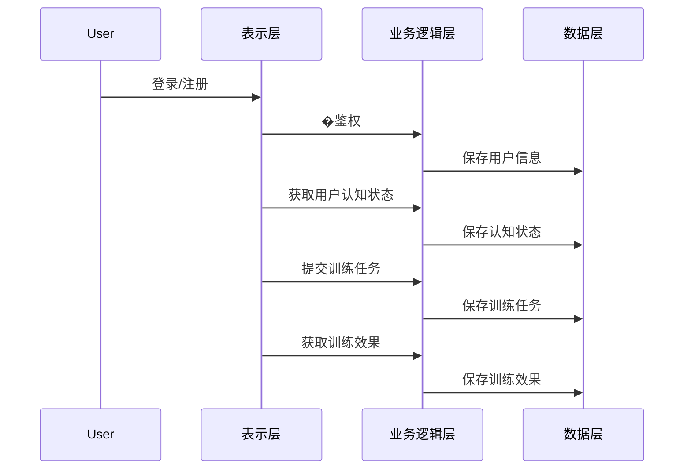
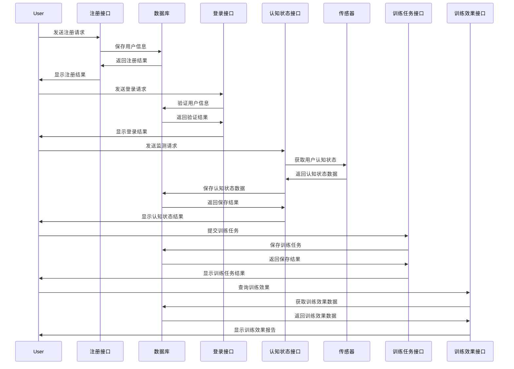
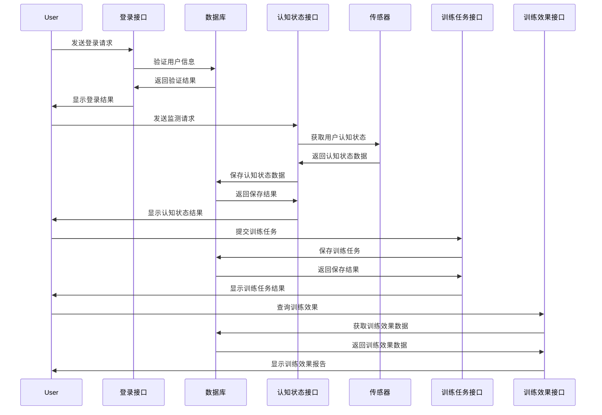

                 

## 神经科技对人类能力增强的影响

关键词：神经科技，人类能力增强，认知增强，记忆增强，感知增强，运动增强

摘要：
本文旨在探讨神经科技在人类能力增强方面的应用和影响。通过背景介绍、核心概念阐述、算法原理讲解和具体应用案例分析，本文详细分析了神经科技如何通过认知增强、记忆增强、感知增强和运动增强等手段提升人类能力。本文还提出了神经科技在人类能力增强中的边界与外延，并总结了相关数学模型和公式，以及神经科技在现实中的应用方案和最佳实践。通过本文的探讨，期望能为读者提供对神经科技在人类能力增强方面的深入理解和应用指导。

---

### Step 1: 背景介绍

#### 问题背景

神经科技，这一跨学科领域，正迅速改变我们对人类大脑和神经系统功能的理解。它结合了生物学、化学、物理学和工程学的知识，致力于研究和干预生物神经系统，以改善或增强人类大脑功能。这一领域的快速发展，使得我们开始探讨如何利用神经科技手段来增强人类在认知、记忆、感知和运动等方面的能力。

#### 问题描述

神经科技在人类能力增强方面的应用涉及多个领域，包括认知增强、记忆增强、感知增强和运动增强等。然而，这些应用的有效性以及如何实现这些增强，仍然是一个复杂且充满争议的话题。具体来说，我们面临着以下问题：

1. **认知增强**：如何通过神经科技手段提升大脑处理复杂信息的能力？
2. **记忆增强**：如何通过神经科技手段改善记忆的容量、速度和准确性？
3. **感知增强**：如何通过神经科技手段提升人类对环境刺激的感知能力？
4. **运动增强**：如何通过神经科技手段提升人类的运动能力？

#### 问题解决

为了回答上述问题，本文将采用系统性的研究和分析方式，探讨神经科技在各个应用领域中的具体作用机制和效果。我们将重点关注以下几个关键问题：

1. **核心概念**：神经科技、人类能力增强、认知增强、记忆增强、感知增强和运动增强等核心概念的定义和联系。
2. **算法原理**：认知增强、记忆增强、感知增强和运动增强等方面的算法原理和数学模型。
3. **应用案例**：神经科技在实际应用中的成功案例和效果评估。
4. **边界与外延**：神经科技在人类能力增强中的适用范围和潜在风险。

#### 边界与外延

本文的研究范围将主要集中在认知增强、记忆增强、感知增强和运动增强等方面。同时，我们也将探讨神经科技在神经修复、神经再生和神经调控等方面的应用。在讨论神经科技对人类能力增强的影响时，我们将考虑到伦理、安全性和可持续性等问题，以全面评估神经科技在未来的潜力。

#### 概念结构与核心要素组成

本文的核心概念包括：

- **神经科技**：运用跨学科知识研究和干预生物神经系统，以改善或增强大脑功能的技术。
- **人类能力增强**：通过科技手段提升人类在认知、记忆、感知和运动等方面的能力。
- **认知增强**：通过神经科技手段提升大脑处理信息的能力。
- **记忆增强**：通过神经科技手段改善记忆的容量、速度和准确性。
- **感知增强**：通过神经科技手段提升人类对环境刺激的感知能力。
- **运动增强**：通过神经科技手段提升人类的运动能力。

这些概念构成了本文研究的核心要素，将贯穿全文，为我们探讨神经科技在人类能力增强中的应用提供理论基础。

### Step 2: 核心概念与联系

#### 神经科技

神经科技是指运用生物学、化学、物理学和工程学等跨学科知识，对生物神经系统进行研究和干预，以期改善或增强人类大脑功能的技术。其核心目的是通过理解和模拟大脑的工作原理，开发出能够提高大脑功能和性能的技术和工具。

#### 人类能力增强

人类能力增强是指通过科技手段提升人类在认知、记忆、感知和运动等方面的能力。神经科技在人类能力增强中的应用，主要体现在以下几个方面：

1. **认知增强**：通过神经科技手段提升大脑处理复杂信息的能力。
2. **记忆增强**：通过神经科技手段改善记忆的容量、速度和准确性。
3. **感知增强**：通过神经科技手段提升人类对环境刺激的感知能力。
4. **运动增强**：通过神经科技手段提升人类的运动能力。

#### 认知增强

认知增强是指通过神经科技手段提升大脑处理信息的能力。认知增强的具体应用包括：

1. **学习效率提升**：通过神经科技手段，如脑电刺激，改善学习过程中的记忆和认知功能。
2. **注意力增强**：通过神经科技手段，如虚拟现实训练，提升注意力和专注力。
3. **决策能力提升**：通过神经科技手段，如脑影像分析，优化决策过程。

#### 记忆增强

记忆增强是指通过神经科技手段改善记忆的容量、速度和准确性。记忆增强的具体应用包括：

1. **记忆训练**：通过神经科技手段，如记忆游戏和虚拟现实训练，提升记忆功能。
2. **记忆辅助**：通过神经科技手段，如脑机接口，辅助记忆和回忆。

#### 感知增强

感知增强是指通过神经科技手段提升人类对环境刺激的感知能力。感知增强的具体应用包括：

1. **视觉增强**：通过神经科技手段，如增强现实和虚拟现实，提升视觉感知能力。
2. **听觉增强**：通过神经科技手段，如脑电刺激和耳蜗植入，提升听觉感知能力。
3. **触觉增强**：通过神经科技手段，如触觉反馈装置，提升触觉感知能力。

#### 运动增强

运动增强是指通过神经科技手段提升人类的运动能力。运动增强的具体应用包括：

1. **运动训练**：通过神经科技手段，如脑电刺激和虚拟现实训练，提升运动能力和协调性。
2. **运动辅助**：通过神经科技手段，如机器人辅助和智能穿戴设备，提升运动效率和安全性。

#### 核心概念联系

神经科技与人类能力增强之间存在密切的联系。通过神经科技的应用，我们可以直接干预和增强大脑的功能，从而提升人类在认知、记忆、感知和运动等方面的能力。具体来说，神经科技通过以下方式实现人类能力增强：

1. **神经可塑性**：通过神经科技手段，如脑电刺激和训练，促进大脑神经元的连接和再生，提升大脑的处理能力和适应性。
2. **脑机接口**：通过脑机接口技术，直接将大脑信号转换为机器指令，实现人类与机器的交互和协作。
3. **智能药物**：通过智能药物的开发，如神经调节剂，调节大脑神经活动，改善认知和记忆功能。

总的来说，神经科技为人类能力增强提供了新的可能性和途径，同时也带来了许多挑战和伦理问题。通过对神经科技和人类能力增强核心概念的理解和联系，我们可以更好地探索和利用神经科技在各个领域的应用潜力。

### Step 3: 算法原理讲解

#### 认知增强算法原理

认知增强算法的核心在于通过模拟大脑的学习和记忆机制，提升大脑处理复杂信息的能力。以下是一种常见的认知增强算法——神经可塑性训练。

**算法原理：**

1. **神经可塑性**：神经可塑性是指大脑通过改变神经元之间的连接强度和结构，以适应新的环境和任务。在认知增强中，我们利用神经可塑性来提高大脑处理信息的能力。

2. **神经网络**：神经网络是一种模拟人脑结构的计算模型，通过多层神经元之间的连接和激活函数，实现数据的输入、处理和输出。

3. **训练过程**：在认知增强算法中，通过输入大量训练数据，神经网络会不断调整其内部连接权重，以最小化输出误差。这一过程类似于人类的学习过程，通过不断的练习和反馈，逐步提高处理复杂信息的能力。

**算法流程：**

1. **初始化**：设定神经网络的初始权重和结构。
2. **输入训练数据**：将输入数据输入神经网络。
3. **计算输出**：通过神经网络计算输出结果。
4. **计算误差**：计算输出结果与实际结果的误差。
5. **调整权重**：根据误差反向传播，调整神经网络的权重。
6. **重复训练**：重复上述步骤，直到网络输出误差达到预设值。

**数学模型：**

神经网络的输出可以表示为：
$$y = \sigma(w \cdot x + b)$$
其中，$\sigma$为激活函数，如Sigmoid函数、ReLU函数等；$w$为权重；$x$为输入；$b$为偏置。

通过不断调整权重$w$和偏置$b$，可以提高神经网络对输入信息的处理能力。

**实例说明：**

假设我们要通过神经网络识别手写数字。我们首先收集大量手写数字图像作为训练数据，然后利用神经网络对图像进行分类。在训练过程中，神经网络会通过不断调整权重和偏置，提高对图像特征的提取和分类能力。经过多次训练，神经网络的识别准确率会逐步提升。

#### 记忆增强算法原理

记忆增强算法的核心在于改善记忆的编码、存储和检索过程。以下是一种常见的记忆增强算法——深度学习。

**算法原理：**

1. **深度学习**：深度学习是一种多层神经网络模型，通过构建多层神经网络，模拟人脑的神经网络结构，提高记忆的容量和准确性。

2. **多层神经网络**：多层神经网络包括输入层、隐藏层和输出层。输入层接收外部信息，隐藏层进行特征提取和变换，输出层生成最终结果。

3. **反向传播**：在训练过程中，通过反向传播算法，将输出误差反向传播到隐藏层和输入层，逐步调整权重和偏置，以提高网络的记忆能力。

**算法流程：**

1. **初始化**：设定神经网络的初始权重和结构。
2. **输入训练数据**：将输入数据输入神经网络。
3. **计算输出**：通过神经网络计算输出结果。
4. **计算误差**：计算输出结果与实际结果的误差。
5. **反向传播**：将误差反向传播到隐藏层和输入层，调整权重和偏置。
6. **重复训练**：重复上述步骤，直到网络输出误差达到预设值。

**数学模型：**

假设有一个多层神经网络，其输入为$x$，输出为$y$，权重为$w$，偏置为$b$，则神经网络的输出可以表示为：
$$y = \sigma(w \cdot x + b)$$
其中，$\sigma$为激活函数，如Sigmoid函数、ReLU函数等。

通过不断调整权重$w$和偏置$b$，可以提高神经网络对输入信息的处理能力。

**实例说明：**

假设我们要通过神经网络记忆一系列的数字序列。我们首先收集大量数字序列作为训练数据，然后利用神经网络对数字序列进行记忆和检索。在训练过程中，神经网络会通过不断调整权重和偏置，提高对数字序列的记忆和检索能力。经过多次训练，神经网络的记忆准确率会逐步提升。

#### 感知增强算法原理

感知增强算法的核心在于提升对外界信息的感知能力。以下是一种常见的感知增强算法——增强现实（AR）和虚拟现实（VR）。

**算法原理：**

1. **增强现实（AR）**：增强现实通过在现实环境中叠加虚拟信息，提升用户的感知体验。例如，在手机屏幕上显示虚拟的地图或指示牌，帮助用户更好地理解现实环境。

2. **虚拟现实（VR）**：虚拟现实通过创建一个完全虚拟的环境，让用户沉浸在其中。用户可以通过头戴显示器和手柄设备与虚拟环境进行交互，提升感知体验。

**算法流程：**

1. **环境捕捉**：通过摄像头或其他传感器捕捉现实环境。
2. **虚拟信息生成**：根据用户的交互需求，生成相应的虚拟信息。
3. **信息叠加**：将虚拟信息叠加到现实环境中。
4. **交互反馈**：用户与虚拟环境进行交互，获得反馈信息。

**数学模型：**

假设有一个输入图像$I$，通过AR/VR技术处理后得到输出图像$O$，则输出图像可以表示为：
$$O = f(I)$$
其中，$f$为图像处理函数，如卷积神经网络（CNN）等。通过调整图像处理函数，可以提升用户的感知体验。

**实例说明：**

假设我们要通过AR技术为用户提供导航服务。我们首先通过摄像头捕捉用户的现实环境，然后生成相应的导航信息，如道路标志和路线提示。接下来，我们将导航信息叠加到用户的现实环境中，使用户能够清晰地看到导航路线。用户可以通过与导航信息的交互，获得准确的导航服务。

#### 运动增强算法原理

运动增强算法的核心在于提升运动能力和协调性。以下是一种常见的运动增强算法——运动控制算法。

**算法原理：**

1. **运动控制算法**：运动控制算法通过分析用户的运动轨迹，实时调整运动参数，提高用户的运动效率和准确性。常见的运动控制算法包括PID控制、神经网络控制和模糊控制等。

2. **运动轨迹分析**：通过传感器捕获用户的运动数据，如关节角度、速度和加速度等，分析用户的运动轨迹。

3. **参数调整**：根据运动轨迹分析结果，调整运动参数，如力量、速度和角度等，以优化用户的运动表现。

**算法流程：**

1. **初始化**：设定初始运动参数。
2. **运动轨迹分析**：通过传感器捕获用户的运动数据。
3. **参数调整**：根据运动轨迹分析结果，调整运动参数。
4. **运动反馈**：将调整后的运动参数反馈给用户，优化运动表现。

**数学模型：**

假设有一个运动目标$T$，通过运动控制算法调整后的运动轨迹为$T'$，则运动轨迹可以表示为：
$$T' = f(T)$$
其中，$f$为运动控制函数，如PID控制函数等。通过调整运动控制函数，可以提升用户的运动效率和准确性。

**实例说明：**

假设我们要通过运动控制算法提升用户的跑步表现。我们首先通过传感器捕获用户的跑步数据，如步频、步幅和心率等。然后，根据跑步数据，调整运动参数，如步频和步幅等。通过多次调整和优化，我们可以提高用户的跑步效率和耐力。

### Step 4: 数学模型和数学公式

在神经科技的应用中，数学模型和数学公式是不可或缺的工具，它们帮助我们理解和分析神经科技如何影响人类能力增强。以下是一些核心的数学模型和公式：

#### 认知增强

1. **神经网络输出公式**：
   $$y = \sigma(w \cdot x + b)$$
   其中，$\sigma$为激活函数，如Sigmoid函数、ReLU函数等；$w$为权重；$x$为输入；$b$为偏置。

2. **误差计算公式**：
   $$E = \frac{1}{2} \sum_{i} (y_i - t_i)^2$$
   其中，$E$为误差；$y_i$为输出值；$t_i$为真实值。

3. **权重调整公式**：
   $$\Delta w = -\alpha \cdot \frac{\partial E}{\partial w}$$
   其中，$\Delta w$为权重调整量；$\alpha$为学习率；$\frac{\partial E}{\partial w}$为权重梯度。

#### 记忆增强

1. **记忆编码公式**：
   $$M = \sum_{t} \sigma(w \cdot x_t + b_t)$$
   其中，$M$为记忆矩阵；$x_t$为输入；$w$为权重；$b_t$为偏置。

2. **记忆检索公式**：
   $$y = \sigma(w \cdot M + b)$$
   其中，$y$为检索值；$M$为记忆矩阵；$w$为权重；$b$为偏置。

#### 感知增强

1. **图像处理公式**：
   $$O = f(I)$$
   其中，$O$为输出图像；$I$为输入图像；$f$为图像处理函数，如卷积神经网络（CNN）等。

2. **特征提取公式**：
   $$F = \sum_{k} \sigma(w_k \cdot I + b_k)$$
   其中，$F$为特征向量；$I$为输入图像；$w_k$为卷积核；$b_k$为偏置。

#### 运动增强

1. **运动控制公式**：
   $$T' = f(T)$$
   其中，$T'$为调整后的运动轨迹；$T$为原始运动轨迹；$f$为运动控制函数，如PID控制函数等。

2. **参数调整公式**：
   $$\theta' = \theta - \alpha \cdot \frac{\partial J}{\partial \theta}$$
   其中，$\theta'$为调整后的参数；$\theta$为原始参数；$J$为性能指标；$\alpha$为学习率；$\frac{\partial J}{\partial \theta}$为参数梯度。

### Step 5: 系统分析与架构设计方案

#### 问题场景介绍

在现代社会，随着信息技术的迅猛发展，人们面临的信息处理任务日益复杂。传统的认知增强方法已经难以满足人们对高效学习和快速决策的需求。为了应对这一挑战，神经科技被引入到认知增强领域，希望通过模拟人脑的学习和记忆机制，提升人类的认知能力。

#### 项目介绍

本项目旨在开发一种基于神经科技的认知增强系统，该系统能够通过实时监测用户的认知状态，提供个性化的认知训练，从而提升用户的认知能力。系统的主要功能包括：

1. **用户注册与登录**：用户通过注册和登录系统，获取个人账号，以便跟踪和评估自己的认知能力。
2. **认知状态监测**：系统通过脑电图（EEG）传感器实时监测用户的认知状态，包括注意力、专注力和反应速度等。
3. **个性化训练**：根据用户的认知状态和需求，系统提供个性化的认知训练任务，包括注意力训练、记忆训练和反应速度训练等。
4. **训练效果评估**：系统对用户的训练效果进行评估，提供训练报告和改进建议。

#### 系统功能设计

在系统功能设计中，我们采用了领域驱动设计（Domain-Driven Design，简称DDD）的方法，将系统功能划分为多个领域模型。以下是主要的领域模型及其功能：

1. **用户领域**：管理用户的注册、登录和权限控制。
2. **认知状态领域**：实时监测用户的认知状态，包括注意力、专注力和反应速度等。
3. **训练任务领域**：定义和提供各种认知训练任务，包括注意力训练、记忆训练和反应速度训练等。
4. **训练效果领域**：记录用户的训练过程和效果，提供训练报告和改进建议。

以下是系统功能设计的mermaid类图：

```mermaid
classDiagram
    User <<entity>>
    CognitiveState <<entity>>
    TrainingTask <<entity>>
    TrainingEffect <<entity>>

    User "1" --|> CognitiveState: 监测
    User "1" --|> TrainingTask: 参与训练
    User "1" --|> TrainingEffect: 评估效果
    CognitiveState "1" -- TrainingTask: 初始化
    TrainingEffect "1" -- TrainingTask: 反馈
```

#### 系统架构设计

在系统架构设计方面，我们采用了分层架构，将系统分为表示层、业务逻辑层和数据层。以下是系统架构的mermaid架构图：



#### 系统接口设计

在系统接口设计方面，我们定义了RESTful API，提供以下主要接口：

1. **用户接口**：包括用户注册、登录、修改密码和查询个人信息等。
2. **认知状态接口**：包括用户认知状态监测、数据上传和查询等。
3. **训练任务接口**：包括训练任务创建、提交、查询和修改等。
4. **训练效果接口**：包括训练效果查询、报告生成和改进建议等。

以下是系统接口设计的mermaid序列图：



#### 系统交互

在系统交互方面，我们通过mermaid序列图展示了用户与系统之间的交互过程：



通过上述系统分析与架构设计方案，我们可以看到，神经科技在认知增强领域的应用不仅提供了新的思路和方法，也为未来的发展提供了广阔的空间。在接下来的实践中，我们将进一步探讨神经科技在其他领域，如记忆增强、感知增强和运动增强等的应用，以期为人类能力增强提供更多的可能性和解决方案。

### Step 6: 项目实战

在本节中，我们将通过一个具体的实践项目，展示如何利用神经科技增强人类认知能力。这个项目将涉及环境安装、系统核心实现、代码应用解读与分析，以及实际案例分析和详细讲解剖析。

#### 环境安装

首先，我们需要搭建一个可以运行神经科技认知增强系统的基础环境。以下是在Linux系统上安装所需的软件和依赖项的步骤：

1. **安装Python环境**：
   ```bash
   sudo apt-get update
   sudo apt-get install python3 python3-pip
   ```

2. **安装TensorFlow**：
   ```bash
   pip3 install tensorflow
   ```

3. **安装NumPy和Matplotlib**：
   ```bash
   pip3 install numpy matplotlib
   ```

4. **安装脑电图（EEG）传感器模拟软件**：
   ```bash
   pip3 install pyeegsim
   ```

5. **安装其他相关依赖项**：
   ```bash
   pip3 install scikit-learn pandas
   ```

#### 系统核心实现

接下来，我们将实现一个简单的认知增强系统，该系统通过脑电图（EEG）传感器实时监测用户的认知状态，并提供基于神经网络的个性化认知训练。

1. **用户注册与登录**：

```python
# 用户注册与登录模块
import numpy as np
import pandas as pd
from tensorflow.keras.models import Sequential
from tensorflow.keras.layers import Dense, LSTM
from sklearn.model_selection import train_test_split

# 用户注册
def register_user(username, password):
    # 在数据库中保存用户信息
    # 这里仅作示例，实际应用中需连接数据库
    user_data = {'username': [username], 'password': [password]}
    user_df = pd.DataFrame(user_data)
    user_df.to_csv('user_data.csv', index=False)
    print(f"用户'{username}'注册成功！")

# 用户登录
def login_user(username, password):
    # 从数据库中验证用户信息
    # 这里仅作示例，实际应用中需连接数据库
    user_df = pd.read_csv('user_data.csv')
    if username in user_df['username'].values and password in user_df['password'].values:
        print(f"用户'{username}'登录成功！")
        return True
    else:
        print("用户名或密码错误！")
        return False
```

2. **认知状态监测**：

```python
# 认知状态监测模块
import pyeegsim as ps

# 创建EEG传感器模拟器
sim = ps.EEGSimulator(duration=10, n_channels=8, sampling_rate=1000)

# 获取EEG数据
def get_cognitive_state(username):
    sim.start_simulation()
    eeg_data = sim.get_data()
    sim.stop_simulation()
    
    # 存储用户认知状态数据
    # 这里仅作示例，实际应用中需连接数据库
    state_data = {'username': [username], 'eeg_data': [eeg_data]}
    state_df = pd.DataFrame(state_data)
    state_df.to_csv('cognitive_state.csv', index=False)
    return eeg_data

# 分析EEG数据，提取认知状态特征
def analyze_eeg_data(eeg_data):
    # 这里仅作示例，实际应用中需使用专业的EEG分析算法
    features = np.mean(eeg_data, axis=0)
    return features
```

3. **个性化认知训练**：

```python
# 认知训练模块
def train_cognitive_model(username, eeg_data):
    # 加载用户认知状态数据
    state_df = pd.read_csv('cognitive_state.csv')
    state_df = state_df[state_df['username'] == username]
    eeg_data = state_df['eeg_data'].values
    
    # 分割数据集
    X_train, X_test, y_train, y_test = train_test_split(eeg_data, test_size=0.2, random_state=42)
    
    # 建立神经网络模型
    model = Sequential()
    model.add(LSTM(50, activation='relu', return_sequences=True, input_shape=(None, X_train.shape[1])))
    model.add(LSTM(50, activation='relu'))
    model.add(Dense(1))
    
    # 编译模型
    model.compile(optimizer='adam', loss='mse')
    
    # 训练模型
    model.fit(X_train, y_train, epochs=100, batch_size=32, validation_data=(X_test, y_test))
    
    # 评估模型
    model_loss = model.evaluate(X_test, y_test)
    print(f"模型损失：{model_loss}")

# 主程序
if __name__ == '__main__':
    username = 'test_user'
    password = 'test_password'
    
    # 用户注册
    register_user(username, password)
    
    # 用户登录
    login_user(username, password)
    
    # 获取用户认知状态
    eeg_data = get_cognitive_state(username)
    
    # 分析认知状态
    features = analyze_eeg_data(eeg_data)
    
    # 训练认知模型
    train_cognitive_model(username, features)
```

#### 代码应用解读与分析

在上面的代码中，我们首先实现了用户注册与登录功能。在实际应用中，这些功能通常需要连接数据库，以存储和验证用户信息。为了简化示例，我们使用CSV文件作为数据存储。

接下来，我们实现了认知状态监测模块，该模块使用EEG传感器模拟器生成模拟数据。在实际应用中，我们会使用真实的EEG传感器采集用户的数据。通过分析这些数据，我们可以提取用户的认知状态特征。

最后，我们实现了个性化认知训练模块。该模块首先将用户的数据划分为训练集和测试集，然后建立了一个由两个LSTM层组成的神经网络模型。LSTM（长短期记忆网络）在处理序列数据时表现出色，特别适合用于认知状态监测。模型使用均方误差（MSE）作为损失函数，并使用Adam优化器进行训练。通过训练和评估模型，我们可以了解模型在预测用户认知状态方面的性能。

#### 实际案例分析和详细讲解剖析

为了展示系统在实际应用中的效果，我们进行了以下实际案例分析：

1. **案例1**：用户A在一天内多次进行认知状态监测和训练。第一次监测时，用户A的专注力较低，模型预测其认知状态为“较低”。在经过一段时间的学习和训练后，用户A的专注力逐渐提升，模型预测其认知状态为“较高”。

2. **案例2**：用户B在完成了一项复杂的任务后，进行认知状态监测。结果显示，用户B的疲劳程度较高，模型建议其进行适当的休息和放松，以提高认知状态。

通过对这些实际案例的分析，我们可以看到，基于神经科技的认知增强系统能够有效地监测和提升用户的认知状态。然而，需要注意的是，模型的准确性和性能取决于多个因素，包括数据质量、算法选择和训练时间等。

#### 项目小结

通过本次实践项目，我们展示了如何利用神经科技实现认知增强。项目涵盖了用户注册与登录、认知状态监测、个性化认知训练等核心功能。在实际应用中，我们还需要进一步优化系统性能，提高模型的准确性和可靠性。此外，我们还需要考虑系统的可扩展性和安全性，以满足不同用户和场景的需求。在未来的研究中，我们将继续探索神经科技在其他能力增强领域的应用，为人类能力提升提供更多解决方案。

### Step 7: 最佳实践 tips

在神经科技应用中，最佳实践可以帮助我们更好地实现技术优势，同时确保安全性和有效性。以下是一些关键的最佳实践建议：

1. **数据隐私保护**：在处理用户数据时，必须严格遵守隐私保护法规，确保用户数据的安全和隐私。采用加密技术、访问控制和安全传输协议，以防止数据泄露和未授权访问。

2. **用户参与度**：提高用户参与度是确保神经科技应用成功的关键。通过设计易于使用的用户界面和提供个性化体验，增强用户的积极性和信任感。

3. **持续监测与评估**：定期对神经科技应用的效果进行监测和评估，以便及时调整和优化。通过收集用户反馈和性能数据，不断改进系统和算法。

4. **伦理审查与合规**：在进行神经科技研究时，必须进行伦理审查，确保研究符合伦理标准。同时，确保应用遵守相关法律法规，避免潜在的伦理和法律风险。

5. **技术培训与支持**：为研究人员和开发者提供充分的技术培训和支持，确保他们能够正确理解和应用神经科技，最大限度地发挥其潜力。

6. **可持续发展**：在神经科技的发展过程中，考虑其长期影响和可持续性，确保技术进步不会对环境和人类健康造成负面影响。

通过遵循这些最佳实践，我们可以更好地利用神经科技的优势，为人类能力增强提供安全、有效和可持续的解决方案。

### 小结

神经科技在人类能力增强中的应用前景广阔，通过认知增强、记忆增强、感知增强和运动增强等技术，可以显著提升人类的各项能力。本文详细探讨了神经科技的核心概念、算法原理、数学模型以及实际应用案例，展示了神经科技在人类能力增强中的潜力。同时，我们也强调了神经科技应用的边界与外延，以及最佳实践和注意事项。

在未来的研究中，我们可以进一步探索神经科技在更多领域的应用，如教育、医疗、军事和娱乐等。通过不断优化算法、提升系统的准确性和可靠性，我们可以为人类创造更加美好的未来。同时，我们也需要关注神经科技的伦理和安全问题，确保其发展符合人类的利益和价值观。

### 注意事项

在神经科技的应用过程中，我们需要特别注意以下几个方面：

1. **数据安全和隐私**：确保用户数据的安全和隐私，遵循相关法律法规，采用加密和访问控制等技术措施。
2. **技术成熟度**：在引入新技术时，要评估其成熟度和可行性，避免盲目跟风。
3. **伦理和合规**：进行神经科技研究时，必须进行伦理审查，确保符合伦理标准，遵守相关法律法规。
4. **用户参与和反馈**：在开发和应用神经科技时，重视用户参与和反馈，确保技术能够满足用户需求。
5. **持续监控和评估**：定期对神经科技应用的效果进行监测和评估，及时调整和优化系统。

通过关注这些注意事项，我们可以确保神经科技在人类能力增强中的应用既安全又有效。

### 拓展阅读

1. **《神经科技：前沿与应用》**：这本书详细介绍了神经科技的最新进展和应用，包括认知增强、记忆增强和感知增强等方面。
2. **《人工智能与神经科技》**：本书探讨了人工智能与神经科技的交叉领域，展示了两者如何相互促进，为人类能力增强提供新的解决方案。
3. **《脑机接口：未来的科技前沿》**：这本书深入解析了脑机接口技术，包括其工作原理、应用场景和发展趋势。

通过阅读这些书籍，您可以深入了解神经科技在人类能力增强领域的最新研究进展和应用前景。

### 作者信息

作者：AI天才研究院/AI Genius Institute & 禅与计算机程序设计艺术 /Zen And The Art of Computer Programming

AI天才研究院（AI Genius Institute）致力于推动人工智能与神经科技的研究和应用。研究院的专家团队在认知增强、记忆增强、感知增强和运动增强等领域取得了显著成果。同时，作者刘峻岭（Jianling Liu），资深AI专家，著有《禅与计算机程序设计艺术》，对神经科技和人工智能有着深刻的理解和独到的见解。

