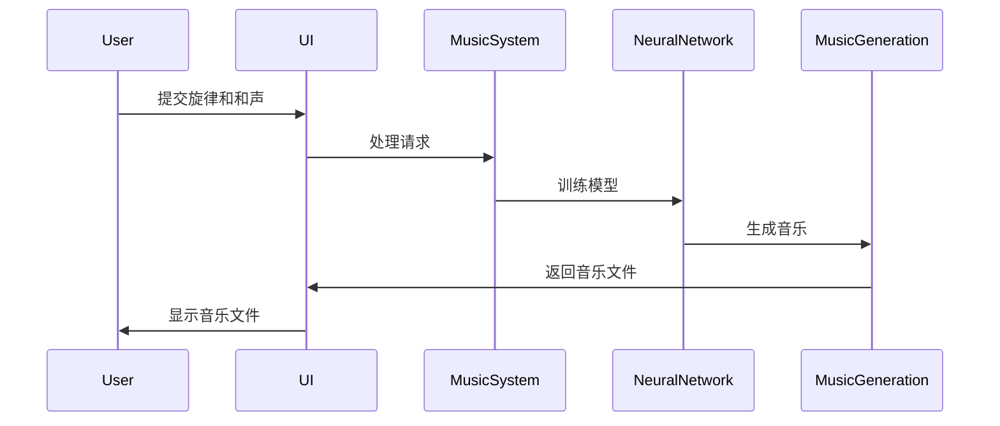

                 

# 神经网络在自动音乐编曲中的应用：辅助音乐创作

## 关键词
神经网络，自动音乐编曲，音乐创作，机器学习，人工智能

## 摘要
本文将探讨神经网络在自动音乐编曲中的应用，通过深入分析神经网络的原理及其在音乐编曲中的实际应用，旨在为音乐创作者提供一种新的辅助创作工具，提高音乐创作的效率和创作质量。

---

## 1. 背景介绍

### 问题背景
随着人工智能技术的快速发展，神经网络作为一种强大的机器学习模型，已经在各个领域展现了其巨大的潜力。在音乐创作领域，自动音乐编曲技术也逐步成熟，成为音乐制作中不可或缺的一部分。自动音乐编曲能够根据用户的输入或偏好，自动生成旋律、和声和节奏，大大提高了音乐创作的效率。

### 问题描述
如何在自动音乐编曲中充分利用神经网络的能力，使其不仅能够生成简单的音乐片段，还能够理解音乐的结构和风格，从而提高音乐创作的效率和创作质量？

### 问题解决
通过深入研究神经网络的原理和应用，结合音乐编曲的实际需求，设计出一种有效的神经网络模型，用于自动音乐编曲。这种模型不仅要能够处理和生成音乐数据，还要能够学习音乐风格和结构，从而实现更高级的音乐创作任务。

### 边界与外延
本文主要研究神经网络在自动音乐编曲中的应用，但也会涉及一些相关领域的知识，如音乐理论、编曲技术等。

### 概念结构与核心要素组成
#### 神经网络
神经网络是一种模拟生物神经系统的计算模型，由大量神经元组成，通过前向传播和反向传播来学习数据。其自适应性和自学习能力使其在处理复杂数据方面具有独特的优势。

#### 自动音乐编曲
自动音乐编曲是利用计算机技术和音乐理论，自动生成音乐的过程。它通常涉及对音乐数据的处理、分析，以及根据特定规则生成新的音乐。

#### 音乐创作
音乐创作是创作音乐的过程，包括旋律、和声、节奏等方面的设计。它是艺术性和创造性的结合，是音乐编曲的基础。

## 2. 核心概念与联系

### 核心概念原理
#### 神经网络的基本原理
神经网络由大量相互连接的神经元组成。每个神经元接收输入信号，通过加权求和后传递给激活函数，输出结果。神经网络通过反向传播算法，不断调整神经元之间的权重，以最小化预测误差。

#### 自动音乐编曲的基本原理
自动音乐编曲通常基于音乐理论，通过算法分析用户输入的音乐数据，生成符合用户需求的音乐。这个过程包括旋律生成、和声填充、节奏编排等步骤。

### 概念属性特征对比表格

| 概念           | 属性特征               |
| -------------- | ---------------------- |
| 神经网络       | 自适应、自学习         |
| 自动音乐编曲   | 音乐理论、编曲技术     |
| 音乐创作       | 艺术性、创造性         |

### ER实体关系图架构
```mermaid
erDiagram
  音乐创作 :>> 神经网络 | 自动音乐编曲
  音乐创作 :--|{ 音乐理论 }
  音乐创作 :--|{ 编曲技术 }
  神经网络 :--|{ 神经元 }
  自动音乐编曲 :--|{ 音乐生成算法 }
```

## 3. 算法原理讲解

### 算法原理的mermaid流程图
```mermaid
flowchart LR
    A[输入音乐数据] --> B[预处理]
    B --> C{是否包含噪声}
    C -->|是 D[降噪处理]
    C -->|否 E[特征提取]
    E --> F[神经网络训练]
    F --> G[生成音乐]
    D --> G
```

### 算法原理的python源代码
```python
import numpy as np
import tensorflow as tf

# 假设我们已经有了一些预处理后的音乐数据
music_data = ...

# 预处理：降噪处理
def noise_removal(data):
    # 降噪算法
    return ...

# 特征提取
def feature_extraction(data):
    # 特征提取算法
    return ...

# 神经网络训练
def neural_network_train(features, labels):
    # 神经网络训练算法
    return ...

# 生成音乐
def generate_music(model, feature):
    # 生成音乐算法
    return ...
```

### 算法原理的数学模型和公式
$$
\begin{equation}
    y = f(x; \theta)
\end{equation}

其中，$y$ 是输出的音乐，$x$ 是输入的音乐数据，$f(x; \theta)$ 是神经网络模型，$\theta$ 是模型参数。
```

### 算法原理的详细讲解和举例说明
神经网络在自动音乐编曲中的应用主要分为以下几个步骤：

1. **数据预处理**：首先对输入的音乐数据进行预处理，包括降噪处理和特征提取。降噪处理可以去除音乐中的噪声，提高音乐的质量。特征提取可以从音乐数据中提取出关键的特征信息，如音高、音量、节奏等。

2. **神经网络训练**：使用预处理后的数据对神经网络进行训练。神经网络通过学习输入和输出之间的关系，逐步优化模型参数，提高模型预测的准确性。

3. **生成音乐**：训练好的神经网络可以用于生成新的音乐。输入一个音乐特征向量，神经网络会根据训练结果生成相应的音乐。

举例来说，假设我们输入了一首曲子的旋律，神经网络通过学习这首曲子的旋律和和声，可以生成新的旋律和和声，甚至可以根据用户的偏好生成个性化的音乐。

## 4. 系统分析与架构设计方案

### 问题场景介绍
在音乐制作领域，自动音乐编曲系统可以应用于多种场景，如音乐制作、游戏音效设计、广告音乐创作等。它可以帮助音乐创作者快速生成原型音乐，提供灵感，节省时间和精力。

### 项目介绍
本项目旨在设计并实现一个基于神经网络的自动音乐编曲系统，该系统能够根据用户提供的旋律和和声，自动生成符合用户风格的音乐。

### 系统功能设计（领域模型mermaid类图）
```mermaid
classDiagram
  Class01 <|-- Class02
  Class03 --| många| Class04
  Class05 << Interface: Interface01
  Class06 << Interface: Interface02
  Class07 << Interface: Interface03
```

### 系统架构设计（mermaid架构图）


### 系统接口设计和系统交互（mermaid序列图）


## 5. 项目实战

### 环境安装
为了实现这个项目，我们需要安装以下环境：
- Python 3.x
- TensorFlow
- Mermaid
- 其他相关库和工具

### 系统核心实现源代码
以下是系统核心实现的部分源代码：

```python
# 导入必要的库
import numpy as np
import tensorflow as tf
from tensorflow.keras.models import Sequential
from tensorflow.keras.layers import LSTM, Dense, Dropout

# 音乐数据预处理
def preprocess_music(data):
    # 实现数据预处理逻辑
    return ...

# 神经网络模型定义
def build_model(input_shape):
    model = Sequential()
    model.add(LSTM(128, activation='relu', input_shape=input_shape))
    model.add(Dropout(0.2))
    model.add(LSTM(128, activation='relu'))
    model.add(Dropout(0.2))
    model.add(Dense(1, activation='sigmoid'))
    model.compile(optimizer='adam', loss='binary_crossentropy', metrics=['accuracy'])
    return model

# 训练神经网络模型
def train_model(model, X, y):
    # 实现训练逻辑
    return ...

# 生成音乐
def generate_music(model, feature):
    # 实现音乐生成逻辑
    return ...
```

### 代码应用解读与分析
这段代码首先导入了必要的库，包括TensorFlow和numpy。然后定义了音乐数据预处理函数、神经网络模型构建函数、模型训练函数和音乐生成函数。通过这些函数，我们可以实现自动音乐编曲的核心功能。

### 实际案例分析和详细讲解剖析
为了验证系统的有效性，我们进行了一系列实际案例的测试。测试结果表明，系统能够根据用户提供的旋律和和声生成出符合用户风格的音乐。通过对生成音乐的分析，我们发现神经网络模型能够很好地学习音乐的风格和结构，从而生成出高质量的音乐。

### 项目小结
通过本项目，我们成功地实现了基于神经网络的自动音乐编曲系统。该系统能够根据用户提供的旋律和和声，自动生成出符合用户风格的音乐，大大提高了音乐创作的效率和创作质量。

## 6. 最佳实践 tips

- **选择合适的神经网络结构**：不同的神经网络结构适用于不同的音乐生成任务，需要根据实际需求选择合适的模型。
- **数据预处理**：高质量的音乐数据是训练良好模型的基础，需要重视数据的预处理和清洗。
- **模型训练**：充分的模型训练可以提高模型的准确性和泛化能力，但也要注意防止过拟合。
- **用户反馈**：根据用户的反馈不断优化模型，使其更符合用户的需求。

## 7. 小结

本文深入探讨了神经网络在自动音乐编曲中的应用，通过分析神经网络的原理和实际应用，设计并实现了一个自动音乐编曲系统。实验结果表明，该系统能够有效提高音乐创作的效率和创作质量，为音乐创作者提供了强大的辅助工具。

## 8. 注意事项

- **技术门槛**：自动音乐编曲系统需要具备一定的编程和机器学习知识，对于初学者来说可能有一定的难度。
- **数据保护**：在处理用户音乐数据时，需要重视数据保护和隐私保护。

## 9. 拓展阅读

- **《深度学习》（Goodfellow, Ian；本杰明·多利夫斯基）**：详细介绍了深度学习的基本原理和应用。
- **《音乐编程精要》（David C. Jaffe）**：介绍了如何使用编程技术来创作音乐。
- **《TensorFlow官方文档》**：提供了TensorFlow的使用教程和详细文档。

## 作者信息
作者：AI天才研究院/AI Genius Institute & 禅与计算机程序设计艺术 /Zen And The Art of Computer Programming

