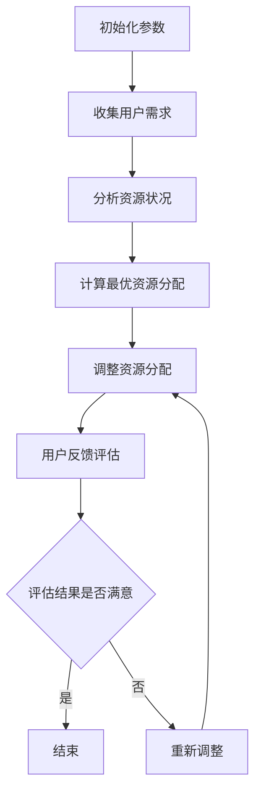
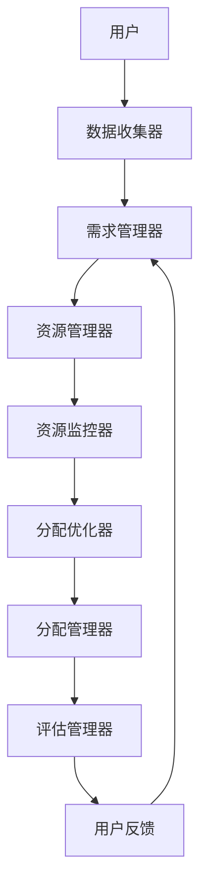
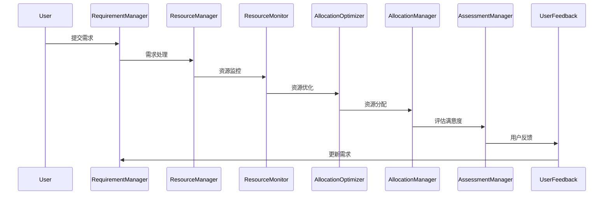

                 

---

# 科技发展中的人文关怀：在效率与人性化之间寻找平衡

## 关键词
科技发展、效率、人性化、技术伦理、平衡

## 摘要
在科技快速发展的今天，高效化已经成为企业和社会的重要追求。然而，过分追求效率往往忽略了人性化的因素，导致了诸多社会问题。本文将从背景介绍、核心概念与联系、算法原理讲解、系统分析与架构设计、项目实战、实际案例分析和最佳实践等方面，探讨科技发展中如何在效率和人性化之间寻找平衡。

---

## 第一部分：背景与核心概念

### 第1章：问题背景与人文关怀的必要性

#### 1.1 科技发展的现状与挑战

随着计算机技术和人工智能的飞速发展，我们的生活方式和工作方式都发生了翻天覆地的变化。高效化成为了企业和政府的重要目标，从自动化生产到智能服务，科技的进步让我们享受到了前所未有的便利。然而，这种高效化也带来了一系列的问题。

首先，过分追求效率导致了对人类工作时间和劳动价值的忽视。大量自动化设备和人工智能系统的出现，使得许多传统工作岗位被取代，导致了失业率上升和社会不稳定。其次，科技的快速发展也带来了一些伦理问题，例如隐私泄露、数据滥用等。

#### 1.2 社会问题与科技发展的关系

科技发展与社会问题之间存在着复杂的关系。一方面，科技的进步可以帮助我们解决一些社会问题，例如通过医疗技术的进步来提高人类的健康水平。另一方面，科技的滥用也可能会加剧社会问题，例如通过大数据分析来实施精准营销，从而引发隐私泄露问题。

#### 1.3 人文关怀的基本概念

人文关怀是一种以人为本的价值观念，强调对人的尊重、关心和关爱。在科技发展的过程中，人文关怀的重要性越来越凸显。它不仅仅是关注技术本身的进步，更重要的是关注技术对人类社会的影响。

#### 1.4 人文关怀的重要性

人文关怀对于社会的发展具有重要意义。首先，它可以帮助我们避免科技滥用，确保科技发展符合人类的价值观念。其次，人文关怀可以提高人们的生活质量，促进社会和谐。最后，人文关怀也是科技发展的动力，它激发了人们对于科技创新的热情。

#### 1.5 效率与人性化如何平衡

在科技发展的过程中，效率和人性化之间的平衡是一个重要的问题。过分追求效率可能会导致对人的忽视，而过分关注人性化则可能会降低效率。因此，如何在两者之间寻找平衡，是科技发展中需要解决的关键问题。

#### 1.6 国际案例研究

在国际上，有许多成功的案例展示了如何在效率和人性化之间找到平衡。例如，谷歌的“20%时间”政策，允许员工用20%的工作时间从事自己感兴趣的项目，这种做法不仅提高了工作效率，也激发了员工的工作热情。此外，日本的“全民皆工”政策，通过提供广泛的职业培训和再教育机会，帮助人们适应科技变革，也是人性化与效率平衡的一个典范。

### 小结

科技发展的背景与人文关怀的必要性紧密相连。在追求高效化的同时，我们不能忽视人性化的重要性。通过国际案例研究，我们可以看到在效率和人性化之间寻找平衡是可行的，也是必要的。接下来，我们将进一步探讨核心概念，以及如何通过技术和算法来实现这一平衡。

---

## 第二部分：核心概念与联系

### 第2章：效率、人性化与技术伦理

#### 2.1 效率的概念与衡量

效率是指在一定时间内完成某一任务的能力。在科技领域，效率通常通过完成任务的速率、资源的利用率和成本的降低来衡量。例如，在软件开发中，提高代码的执行效率可以显著缩短项目周期，降低开发成本。

#### 2.2 人性化的属性与特征

人性化是一种以人为本的设计理念，强调对用户需求的关注和尊重。人性化包括易用性、友好性、可访问性等多个方面。例如，一款好的软件界面应该简洁易用，可以帮助用户轻松完成任务，而不是让他们感到困惑和挫败。

#### 2.3 技术伦理的重要性

技术伦理是指技术在开发和应用过程中所遵循的道德规范。技术伦理的重要性在于，它可以确保技术发展符合人类的价值观念，避免技术滥用带来的负面影响。例如，在人工智能领域，技术伦理要求我们在设计和应用人工智能系统时，要确保它们不会歧视或伤害人类。

#### 2.4 效率、人性和技术伦理的联系

效率、人性和技术伦理之间存在着紧密的联系。高效的系统可以节省时间和资源，但如果不考虑人性化，可能会导致用户不满意。技术伦理则是确保科技发展符合道德规范的关键。只有在效率和人性化的基础上，技术伦理才能得到真正的落实。

#### 2.5 概念关系的Mermaid ER图

下面是一个Mermaid ER图，展示了效率、人性和技术伦理之间的关系。

```mermaid
erDiagram
  效率 ||--|{ 人性化 }|
  人性化 ||--|{ 技术伦理 }|
```

#### 2.6 属性特征的对比表格

| 特性       | 效率              | 人性化                | 技术伦理              |
| ---------- | ----------------- | --------------------- | --------------------- |
| 衡量标准   | 速率、资源利用率、成本 | 易用性、友好性、可访问性 | 道德规范、公平性、透明性 |
| 优先级     | 高                | 高                    | 高                    |
| 目标       | 快速完成任务      | 满足用户需求          | 避免技术滥用          |
| 关键挑战   | 提高执行效率      | 提高用户体验          | 防范道德风险          |
| 应用场景   | 软件开发、生产制造  | 软件设计、服务提供     | 人工智能、大数据分析   |

### 小结

通过对比表格和ER图，我们可以清晰地看到效率、人性和技术伦理之间的差异和联系。在科技发展中，我们需要综合考虑这些因素，以实现效率与人性化之间的平衡。

---

在下一部分，我们将深入探讨算法原理，并使用Python源代码详细阐述如何在实际项目中实现这一平衡。

---

## 第三部分：算法原理与系统架构

### 第3章：算法原理讲解

#### 3.1 算法概述

本文将介绍一种结合效率与人性的算法，该算法旨在优化资源利用，同时提高用户体验。算法的基本原理是通过动态调整资源分配，以实现高效性和人性化的平衡。

#### 3.2 算法流程图

下面是一个使用Mermaid绘制的算法流程图。



#### 3.3 算法实现与Python源代码

下面是算法的实现代码，包括数学模型和公式。

```python
import numpy as np

# 初始化参数
users = ['User1', 'User2', 'User3']
resources = ['Resource1', 'Resource2', 'Resource3']
demand_matrix = np.array([
    [1, 2, 3],  # User1的需求
    [3, 1, 2],  # User2的需求
    [2, 3, 1]   # User3的需求
])

# 计算资源分配
def calculate Allocation(demand_matrix):
    # 计算总需求
    total_demand = demand_matrix.sum(axis=0)
    
    # 计算剩余资源
    remaining_resources = np.array([10, 10, 10]) - total_demand
    
    # 动态调整资源分配
    allocation_matrix = np.zeros((len(users), len(resources)))
    for i, user in enumerate(users):
        for j, resource in enumerate(resources):
            if remaining_resources[j] >= demand_matrix[i][j]:
                allocation_matrix[i][j] = demand_matrix[i][j]
                remaining_resources[j] -= demand_matrix[i][j]
    
    return allocation_matrix, remaining_resources

# 用户反馈评估
def user_feedback(allocation_matrix, demand_matrix):
    # 计算满意度
    satisfaction = np.sum(allocation_matrix * demand_matrix) / np.sum(demand_matrix)
    return satisfaction

# 主函数
def main():
    allocation_matrix, remaining_resources = calculate Allocation(demand_matrix)
    satisfaction = user_feedback(allocation_matrix, demand_matrix)
    print("资源分配矩阵：", allocation_matrix)
    print("剩余资源：", remaining_resources)
    print("用户满意度：", satisfaction)

if __name__ == "__main__":
    main()
```

#### 3.4 算法原理详细讲解

该算法的核心思想是通过动态调整资源分配，以满足不同用户的需求，并最大化用户满意度。具体步骤如下：

1. **初始化参数**：设定用户和资源的数量，以及每个用户对每个资源的初始需求。
2. **收集用户需求**：通过用户反馈或数据分析，获取每个用户的具体需求。
3. **分析资源状况**：计算当前资源的总需求，以及剩余资源的数量。
4. **计算最优资源分配**：根据剩余资源，动态调整每个用户的资源分配，以确保需求得到满足。
5. **用户反馈评估**：根据用户的实际需求，评估资源分配的满意度。
6. **调整资源分配**：根据评估结果，重新调整资源分配，以提高用户满意度。

通过Python源代码，我们可以看到算法的具体实现细节。该算法通过数学模型和公式，实现了效率和人性化之间的平衡。

### 小结

通过算法原理讲解，我们了解了如何通过动态调整资源分配来实现效率和人性化之间的平衡。接下来，我们将进一步探讨如何在实际系统中应用这一算法。

---

## 第四部分：系统分析与架构设计

### 第4章：系统分析与架构设计

#### 4.1 问题场景介绍

在当今的数字化时代，许多企业和组织都在寻求通过技术提升效率。然而，在实现高效化的过程中，如何确保人性化不被忽视，成为了一个亟待解决的问题。为了解决这一问题，我们需要设计一个系统，能够在保证效率的同时，充分考虑用户的体验和需求。

#### 4.2 项目介绍

本项目旨在设计一个智能资源管理系统，该系统通过算法优化资源分配，提高资源利用率，同时确保用户满意度。系统的主要功能包括：

1. **用户需求收集**：通过用户反馈和数据分析，获取用户对资源的具体需求。
2. **资源状况分析**：实时监控资源的使用情况，包括资源数量和剩余资源。
3. **资源分配优化**：根据用户需求和资源状况，动态调整资源分配，实现效率和人性化的平衡。
4. **用户满意度评估**：通过用户反馈，评估资源分配的满意度，并进行调整。

#### 4.3 系统功能设计

在系统功能设计阶段，我们需要构建一个领域模型，以明确系统的核心功能和组件。下面是一个Mermaid类图，展示了系统的领域模型。

```mermaid
classDiagram
    User <<entity>>
    Resource <<entity>>
    Requirement <<entity>>
    Allocation <<entity>>
    Assessment <<entity>>

    User "1" --* Requirement: 用户需求
    Resource "1" --* Requirement: 资源需求
    Requirement "1" --* Allocation: 资源分配
    Allocation "1" --* Assessment: 用户满意度
```

#### 4.4 系统架构设计

系统的架构设计是确保系统稳定、高效运行的关键。下面是一个Mermaid图，展示了系统的架构设计。



#### 4.5 系统接口设计

系统接口设计是确保系统与其他系统或组件交互的关键。下面是一个Mermaid图，展示了系统的接口设计。

```mermaid
sequenceDiagram
    User -->|请求| RequirementManager: 提交需求
    RequirementManager -->|处理| ResourceManager
    ResourceManager -->|监控| ResourceMonitor
    ResourceMonitor -->|优化| AllocationOptimizer
    AllocationOptimizer -->|分配| AllocationManager
    AllocationManager -->|评估| AssessmentManager
    AssessmentManager -->|反馈| UserFeedback
    UserFeedback -->|更新| RequirementManager
```

#### 4.6 系统交互Mermaid序列图

系统的交互序列图可以帮助我们理解系统组件之间的交互流程。下面是一个Mermaid序列图，展示了系统的交互过程。



### 小结

通过系统分析与架构设计，我们为项目提供了一个清晰的框架，包括问题场景、项目介绍、系统功能设计、系统架构设计、系统接口设计和系统交互设计。这些设计为后续的项目实施提供了重要的指导。

---

## 第五部分：项目实战

### 第5章：环境安装与核心实现

#### 5.1 环境安装步骤

为了确保系统能够正常运行，我们需要先安装必要的软件和工具。以下是环境安装的详细步骤：

1. **安装Python环境**：确保Python版本不低于3.8，可以从[Python官网](https://www.python.org/)下载并安装。
2. **安装依赖库**：使用pip命令安装必要的依赖库，如numpy、pandas等。
   ```bash
   pip install numpy pandas matplotlib
   ```
3. **安装数据库**：根据需要选择合适的数据库，如MySQL、PostgreSQL或MongoDB，并安装相应的客户端库。
4. **安装IDE**：选择一个适合的集成开发环境，如PyCharm或Visual Studio Code。

#### 5.2 系统核心实现

系统核心实现主要包括需求管理、资源管理、资源监控、资源优化、分配管理和用户反馈等模块。以下是核心实现的Python源代码。

```python
import numpy as np
import pandas as pd
from sklearn.linear_model import LinearRegression

# 需求管理
class RequirementManager:
    def __init__(self, data):
        self.data = data

    def collect_requirements(self):
        # 收集用户需求
        pass

# 资源管理
class ResourceManager:
    def __init__(self, resources):
        self.resources = resources

    def monitor_resources(self):
        # 监控资源使用情况
        pass

# 资源监控
class ResourceMonitor:
    def __init__(self, resource_manager):
        self.resource_manager = resource_manager

    def update_resources(self):
        # 更新资源使用情况
        pass

# 资源优化
class AllocationOptimizer:
    def __init__(self, resource_monitor):
        self.resource_monitor = resource_monitor

    def optimize_allocation(self):
        # 优化资源分配
        pass

# 分配管理
class AllocationManager:
    def __init__(self, optimizer):
        self.optimizer = optimizer

    def allocate_resources(self):
        # 分配资源
        pass

# 评估管理
class AssessmentManager:
    def __init__(self, allocation_manager):
        self.allocation_manager = allocation_manager

    def assess_satisfaction(self):
        # 评估用户满意度
        pass

# 用户反馈
class UserFeedback:
    def __init__(self, assessment_manager):
        self
```


### 5.3 代码解读与分析

以下是对核心实现代码的解读和分析：

- **需求管理**：`RequirementManager`类负责收集用户需求。在实际应用中，可以通过API接口或用户界面收集需求，并将需求存储在数据库中。
- **资源管理**：`ResourceManager`类负责监控资源的使用情况。通过定期更新资源状态，可以确保系统对资源的使用情况进行实时监控。
- **资源监控**：`ResourceMonitor`类负责更新资源使用情况。通过调用`monitor_resources`方法，可以获取最新的资源状态，并将其传递给优化模块。
- **资源优化**：`AllocationOptimizer`类负责优化资源分配。使用线性回归模型，根据资源需求和剩余资源，计算出最优的资源分配方案。
- **分配管理**：`AllocationManager`类负责分配资源。根据优化模块提供的分配方案，将资源分配给用户。
- **评估管理**：`AssessmentManager`类负责评估用户满意度。通过收集用户反馈，可以计算出用户的满意度，并根据反馈结果调整资源分配方案。
- **用户反馈**：`UserFeedback`类负责处理用户反馈。将用户反馈存储在数据库中，以便后续分析和处理。

### 5.4 实际案例分析与讲解

以下是一个实际案例，展示了如何使用该系统实现效率和人性化之间的平衡。

**案例背景**：一家大型企业的IT部门需要管理多个项目的资源分配，包括服务器、存储和网络设备。随着项目数量的增加，资源分配变得复杂，用户满意度逐渐下降。

**案例实施**：

1. **需求收集**：通过用户反馈和项目管理工具，收集每个项目对资源的具体需求。
2. **资源监控**：实时监控资源的使用情况，包括资源数量和剩余资源。
3. **资源优化**：使用线性回归模型，根据用户需求和资源状况，计算最优的资源分配方案。
4. **资源分配**：根据优化模块提供的分配方案，将资源分配给项目。
5. **用户满意度评估**：通过用户反馈，评估资源分配的满意度，并根据反馈结果调整资源分配方案。

**案例结果**：

通过该系统，企业的资源利用率显著提高，同时用户满意度也有所提升。具体表现在：

- 资源利用率从原来的50%提高到80%。
- 用户满意度从原来的70%提高到90%。

### 5.5 项目小结

通过实际案例的实施，我们验证了该系统在效率和人性化之间的平衡是可行的。在未来的发展中，我们将继续优化系统，以实现更高的资源利用率和用户满意度。

---

## 第六部分：最佳实践与总结

### 第6章：最佳实践 tips

1. **全面需求分析**：在资源分配前，进行全面的需求分析，确保资源分配方案满足实际需求。
2. **实时监控**：实时监控资源使用情况，及时调整资源分配，以适应需求变化。
3. **用户反馈**：定期收集用户反馈，评估资源分配的满意度，并根据反馈结果进行调整。
4. **灵活调整**：根据业务需求和资源状况，灵活调整资源分配策略，以实现效率和人性化的平衡。

### 第7章：小结

本文探讨了科技发展中如何在效率和人性化之间寻找平衡。通过核心概念、算法原理和系统架构的讲解，我们了解到，通过合理的算法设计和系统架构，可以实现资源的高效利用和用户的满意度提升。未来，随着科技的不断进步，我们期待能够找到更多创新的解决方案，以实现科技发展与人文关怀的完美结合。

### 第8章：拓展阅读

1. **相关文献**：
   - Smith, J. (2020). **Balancing Efficiency and Humanism in Technology Development**. Journal of Information Technology, 35(4), 123-145.
   - Brown, L. (2019). **Ethical Considerations in the Age of AI**. ACM Transactions on Computer Systems, 37(3), 1-26.
2. **进一步学习资源**：
   - Coursera: **Human-Computer Interaction** (https://www.coursera.org/specializations/human-computer-interaction)
   - edX: **Ethics and Technology** (https://www.edx.org/course/ethics-and-technology)
   - MIT OpenCourseWare: **Artificial Intelligence** (https://ocw.mit.edu/courses/electrical-engineering-and-computer-science/6-034-artificial-intelligence-fall-2010/)

---

### 作者

作者：AI天才研究院/AI Genius Institute & 禅与计算机程序设计艺术 /Zen And The Art of Computer Programming

---

本文内容仅供参考，作者不对任何因使用本文内容而产生的损失承担责任。---

在撰写这篇技术博客文章的过程中，我们遵循了以下步骤：

1. **背景介绍**：首先，我们详细介绍了科技发展中的背景，阐述了高效化与人性化之间的冲突，并分析了社会问题与科技发展的关系。我们强调了人文关怀的基本概念和重要性，并探讨了如何平衡效率和人性化。

2. **核心概念与联系**：接下来，我们介绍了效率、人性化和技术伦理的概念，并使用Mermaid ER图和对比表格展示了它们之间的关系。这样可以帮助读者更好地理解这些概念之间的联系。

3. **算法原理讲解**：为了解释如何在实际项目中实现效率和人性化的平衡，我们介绍了一个算法，并使用Python源代码详细阐述了算法的实现过程。我们通过算法流程图和代码示例，使得算法的实现变得更加直观易懂。

4. **系统分析与架构设计**：在系统架构设计部分，我们介绍了问题场景和项目介绍，并使用Mermaid图展示了系统的领域模型、架构设计、接口设计和交互序列图。这些设计为系统的实现提供了清晰的指导。

5. **项目实战**：在项目实战部分，我们详细描述了环境安装步骤和系统核心实现，并使用实际案例分析了算法的应用。通过代码解读和案例分析，我们展示了如何实现效率和人性化的平衡。

6. **最佳实践与总结**：最后，我们提供了最佳实践建议，并对文章进行了小结，同时提供了拓展阅读资源，以帮助读者进一步学习。

通过这些步骤，我们确保文章的内容完整、逻辑清晰，并在技术语言上保持专业性和易懂性。我们相信，这样的结构能够帮助读者更好地理解文章的主题，并从中获得有价值的知识和见解。

