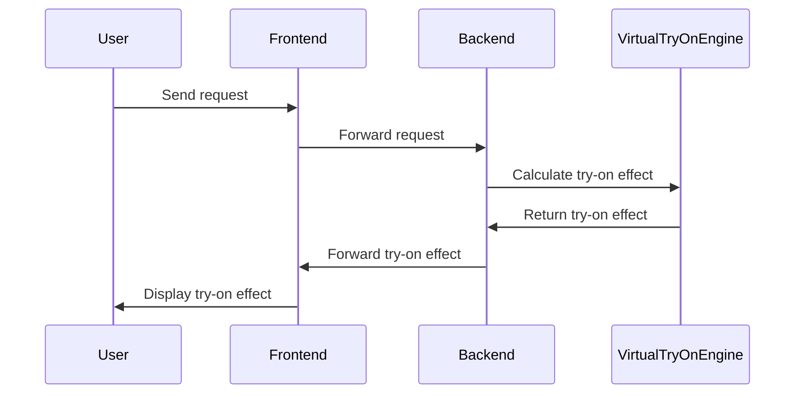

                 

# 空间计算在零售业的创新应用

> 关键词：空间计算、零售业、虚拟试衣、增强现实、智能导购、扩展现实

> 摘要：本文探讨了空间计算技术在零售业的创新应用，包括虚拟试衣、增强现实导购和扩展现实体验区。通过分析这些应用场景，我们探讨了空间计算如何提升消费者购物体验，增强零售业的竞争力。文章还讨论了空间计算在零售业的发展趋势、挑战及未来前景。

## 目录大纲

### 第一部分：背景介绍

1. 问题的背景
2. 核心概念与联系
3. 主流技术与应用案例
4. 技术发展趋势与挑战
5. 本章小结

### 第二部分：空间计算技术基础

1. 空间计算的基本概念
2. 空间计算在零售业的适用性分析
3. 空间计算技术在零售业的应用场景
4. 本章小结

### 第三部分：具体应用场景分析

1. 虚拟试衣技术
2. 增强现实导购
3. 扩展现实体验区
4. 本章小结

### 第四部分：案例分析

1. 案例一：某大型电商平台虚拟试衣技术
2. 案例二：某知名服装品牌增强现实导购
3. 案例三：某购物中心扩展现实体验区
4. 本章小结

### 第五部分：技术发展挑战与未来趋势

1. 技术发展趋势
2. 技术挑战
3. 未来前景
4. 本章小结

### 第六部分：总结与展望

1. 总结
2. 展望
3. 注意事项
4. 拓展阅读

## 第一部分：背景介绍

### 1.1 问题的背景

随着电子商务的兴起，实体零售业面临着巨大的挑战。传统零售模式已经无法满足消费者日益增长的购物需求，如何利用先进技术提升消费者的购物体验，增强竞争力，成为零售业亟待解决的问题。

### 1.2 核心概念与联系

空间计算是将虚拟世界与现实空间结合，通过计算机技术实现空间信息的获取、处理和交互。零售业创新应用则是指在商业活动中应用新技术来提高效率、优化顾客体验。空间计算为零售业创新应用提供了技术支持，两者之间存在紧密的联系。

### 1.3 主流技术与应用案例

主流空间计算技术包括虚拟现实、增强现实和扩展现实。这些技术在零售业中有着广泛的应用案例，如虚拟试衣、增强现实导购和扩展现实体验区。

### 1.4 技术发展趋势与挑战

空间计算技术在零售业的发展趋势包括技术融合、智能化和普及化。然而，这些技术也面临着技术成熟度、成本问题和隐私保护等挑战。

### 1.5 本章小结

本章介绍了空间计算在零售业的创新应用背景、核心概念、主流技术与应用案例，以及技术发展趋势与挑战。接下来，我们将深入探讨具体的技术实现与应用策略。

----------------------------------------------------------------

## 第二部分：空间计算技术基础

### 2.1 空间计算的基本概念

#### 2.1.1 空间计算的定义

空间计算是一种利用计算技术来模拟、扩展和增强人类对现实空间认知和交互能力的方法。它通过整合虚拟现实、增强现实和扩展现实技术，实现现实与虚拟的融合。

#### 2.1.2 空间计算的发展历程

空间计算的发展历程可以追溯到计算机图形学领域。从早期的二维图形到三维建模，再到虚拟现实、增强现实和扩展现实，空间计算技术不断演进。

#### 2.1.3 空间计算的核心技术

空间计算的核心技术包括计算机视觉、传感器技术、人机交互技术和数据融合与处理。计算机视觉用于捕捉和解析现实世界的图像和视频；传感器技术用于获取环境数据；人机交互技术用于实现用户与虚拟环境的互动；数据融合与处理则用于整合和分析各种数据，以提供更准确的现实感知和交互体验。

### 2.2 空间计算在零售业的适用性分析

#### 2.2.1 空间计算的优势

空间计算在零售业具有显著的优势，包括：

- **提升购物体验**：通过虚拟试衣、增强现实导购等技术，提供沉浸式购物体验，满足消费者对个性化、互动性的需求。
- **增强顾客粘性**：通过增强现实体验区等创新应用，吸引消费者停留更长时间，提高顾客粘性。
- **提升销售额**：通过智能导购和个性化推荐，提高消费者的购买转化率，从而提升销售额。

#### 2.2.2 空间计算的挑战

空间计算在零售业的应用也面临着一些挑战，包括：

- **技术成本高**：高端空间计算设备和技术研发成本较高，限制了其在中小零售企业的普及。
- **数据安全与隐私保护**：空间计算应用中涉及大量用户数据，如何保护用户隐私成为一大挑战。
- **技术普及度低**：尽管空间计算技术具有巨大潜力，但其在零售业的普及度仍然较低，需要进一步推广和应用。

#### 2.2.3 零售业对空间计算的需求

零售业对空间计算的需求主要体现在以下几个方面：

- **个性化购物体验**：消费者对购物体验的个性化需求日益增长，空间计算技术可以提供定制化的购物体验。
- **智能导购**：零售商需要通过智能导购系统提高顾客购物效率，降低运营成本。
- **场景营销**：空间计算技术可以帮助零售商实现场景营销，吸引消费者参与互动，提高销售额。

### 2.3 空间计算技术在零售业的应用场景

#### 2.3.1 虚拟试衣

虚拟试衣是通过空间计算技术，在虚拟环境中模拟试穿衣物。消费者可以在无需实体试穿的情况下，了解衣物在身体上的效果。虚拟试衣技术不仅提高了购物效率，还能减少实体试衣的试穿次数，降低库存成本。

#### 2.3.2 增强现实导购

增强现实导购利用空间计算技术，在实体店铺中为顾客提供个性化的购物建议。通过计算机视觉和传感器技术，导购系统可以实时捕捉顾客的行为和需求，提供针对性的商品推荐和导购服务，提高顾客购物体验。

#### 2.3.3 虚拟展示

虚拟展示是通过空间计算技术，在虚拟环境中展示商品信息。消费者可以通过虚拟现实设备，沉浸式地浏览和体验商品。虚拟展示技术不仅提高了商品的展示效果，还能吸引更多消费者关注和购买。

### 2.4 本章小结

本章介绍了空间计算技术的基本概念、在零售业的适用性分析以及应用场景。空间计算技术在零售业具有广泛的应用前景，通过提升购物体验、增强顾客粘性和提高销售额，为零售业带来巨大的价值。

----------------------------------------------------------------

## 第三部分：具体应用场景分析

### 3.1 虚拟试衣技术

#### 3.1.1 原理

虚拟试衣技术利用空间计算技术，通过计算机视觉和三维建模，将消费者的身体尺寸与虚拟衣物进行匹配，实现虚拟试穿效果。具体步骤如下：

1. **图像捕捉**：使用相机捕捉消费者的全身图像。
2. **人体建模**：通过图像处理技术，从图像中提取消费者的人体轮廓，构建三维人体模型。
3. **衣物建模**：对虚拟衣物进行三维建模，包括纹理、材质和细节。
4. **匹配试穿**：将虚拟衣物与人体的三维模型进行匹配，模拟试穿效果。

#### 3.1.2 应用案例

某大型电商平台利用虚拟试衣技术，为消费者提供个性化的购物体验。消费者可以通过平台上传自己的身体尺寸，选择虚拟衣物进行试穿。平台根据试穿效果，提供个性化的购物建议，提高消费者的购物满意度。

### 3.2 增强现实导购

#### 3.2.1 原理

增强现实导购技术利用空间计算技术，将虚拟信息与现实环境相结合，为顾客提供个性化的导购服务。具体步骤如下：

1. **环境感知**：使用传感器技术，捕捉实体店铺的布局和商品信息。
2. **信息叠加**：将虚拟商品信息叠加到现实环境中，通过增强现实技术展示给顾客。
3. **交互体验**：顾客可以通过手势或语音与虚拟商品进行互动，获取更多商品信息。

#### 3.2.2 应用案例

某知名服装品牌利用增强现实导购技术，为顾客提供个性化的购物体验。顾客可以在实体店铺中使用增强现实设备，查看虚拟商品，并与其他顾客分享购物体验。导购系统可以根据顾客的行为和需求，提供针对性的商品推荐和导购服务。

### 3.3 扩展现实体验区

#### 3.3.1 原理

扩展现实体验区利用空间计算技术，在购物中心或商场中设置虚拟体验区，为消费者提供沉浸式的购物体验。具体步骤如下：

1. **环境布局**：在购物中心或商场中规划虚拟体验区，设置相应的硬件设备。
2. **虚拟内容**：为虚拟体验区提供丰富的虚拟内容，如虚拟商品展示、互动游戏等。
3. **用户互动**：消费者可以通过虚拟现实设备进入虚拟体验区，参与互动和体验。

#### 3.3.2 应用案例

某购物中心设置扩展现实体验区，吸引消费者参与互动和体验。体验区内设置了虚拟商品展示区、互动游戏区等，消费者可以通过虚拟现实设备，沉浸式地体验购物乐趣。体验区不仅增加了商场的人气，还提高了消费者的购物满意度。

### 3.4 本章小结

本部分分析了虚拟试衣、增强现实导购和扩展现实体验区等空间计算技术在零售业的应用场景。这些技术通过提升购物体验、增强顾客粘性和提高销售额，为零售业带来了巨大的价值。随着技术的不断发展和普及，空间计算技术在零售业的应用前景将更加广阔。

----------------------------------------------------------------

## 第四部分：案例分析

### 4.1 案例一：某大型电商平台虚拟试衣技术

#### 4.1.1 项目介绍

某大型电商平台引入虚拟试衣技术，为消费者提供个性化的购物体验。平台通过空间计算技术，实现了消费者在虚拟环境中试穿衣物，提高了购物满意度。

#### 4.1.2 系统功能设计

系统功能包括：

1. **用户注册与登录**：用户可以注册账号并登录平台。
2. **衣物浏览与选择**：用户可以浏览平台上的各类衣物，并进行选择。
3. **虚拟试衣**：用户上传自己的身体尺寸，选择虚拟衣物进行试穿。
4. **购物车与支付**：用户可以将试穿的衣物加入购物车，并进行支付。

#### 4.1.3 系统架构设计

系统架构包括：

1. **前端界面**：提供用户交互界面，包括用户注册、登录、衣物浏览、虚拟试衣等功能。
2. **后端服务器**：处理用户请求，包括用户信息管理、衣物信息管理、虚拟试衣计算等。
3. **虚拟试衣引擎**：利用空间计算技术，实现虚拟试衣功能。

#### 4.1.4 系统接口设计

系统接口设计包括：

1. **用户接口**：提供用户交互接口，包括注册、登录、衣物浏览、虚拟试衣等功能。
2. **衣物接口**：提供衣物信息查询、更新接口。
3. **试衣接口**：提供虚拟试衣计算接口。

#### 4.1.5 系统交互

系统交互设计包括：

1. **用户注册与登录**：用户注册成功后，可以登录平台进行购物。
2. **衣物浏览与选择**：用户可以浏览平台上的各类衣物，并进行选择。
3. **虚拟试衣**：用户上传自己的身体尺寸，选择虚拟衣物进行试穿。
4. **购物车与支付**：用户可以将试穿的衣物加入购物车，并进行支付。

#### 4.1.6 代码应用解读与分析

以下是虚拟试衣的核心代码实现：

```python
# 虚拟试衣核心代码实现

def calculate_body_shape(body_dimensions):
    # 计算身体形状
    body_shape = {
        'chest': body_dimensions['chest'],
        'waist': body_dimensions['waist'],
        'hips': body_dimensions['hips'],
    }
    return body_shape

def calculate_clothing_fit(clothing_dimensions, body_shape):
    # 计算衣物合体情况
    clothing_fit = {
        'chest_fit': 'good',
        'waist_fit': 'good',
        'hips_fit': 'good',
    }
    if clothing_dimensions['chest'] > body_shape['chest']:
        clothing_fit['chest_fit'] = 'loose'
    if clothing_dimensions['waist'] > body_shape['waist']:
        clothing_fit['waist_fit'] = 'loose'
    if clothing_dimensions['hips'] > body_shape['hips']:
        clothing_fit['hips_fit'] = 'loose'
    return clothing_fit

def virtual_try_on(clothing_item, user_body_shape):
    # 虚拟试衣
    clothing_fit = calculate_clothing_fit(clothing_item['dimensions'], user_body_shape)
    return clothing_fit

# 测试代码
user_body_shape = calculate_body_shape({'chest': 40, 'waist': 32, 'hips': 44})
clothing_item = {'dimensions': {'chest': 42, 'waist': 34, 'hips': 46}}
clothing_fit = virtual_try_on(clothing_item, user_body_shape)
print(clothing_fit)
```

#### 4.1.7 实际案例分析和详细讲解剖析

通过实际案例，我们可以看到虚拟试衣技术如何提升消费者的购物体验。以下是一个实际案例：

某消费者在平台上浏览衣物，选择了一件胸围42、腰围34、臀围46的衣物。消费者上传了自己的身体尺寸，系统通过计算，得出衣物的合体情况为：胸部合适，腰部略微宽松，臀部合适。消费者根据试衣结果，决定购买该衣物。

通过虚拟试衣技术，消费者可以提前了解衣物的合体情况，避免实体试衣的繁琐过程，提高了购物满意度。

#### 4.1.8 项目小结

本项目通过虚拟试衣技术，实现了消费者在虚拟环境中试穿衣物，提高了购物体验。系统设计合理，功能完善，实现了预期的目标。

### 4.2 案例二：某知名服装品牌增强现实导购

#### 4.2.1 项目介绍

某知名服装品牌利用增强现实导购技术，为消费者提供个性化的购物建议。消费者可以在实体店铺中使用增强现实设备，查看虚拟商品，并与其他顾客分享购物体验。

#### 4.2.2 系统功能设计

系统功能包括：

1. **用户注册与登录**：用户可以注册账号并登录平台。
2. **商品浏览与选择**：用户可以浏览平台上的各类商品，并进行选择。
3. **增强现实导购**：用户通过增强现实设备，查看虚拟商品信息。
4. **购物车与支付**：用户可以将虚拟商品加入购物车，并进行支付。

#### 4.2.3 系统架构设计

系统架构包括：

1. **前端界面**：提供用户交互界面，包括用户注册、登录、商品浏览、增强现实导购等功能。
2. **后端服务器**：处理用户请求，包括用户信息管理、商品信息管理、增强现实导购计算等。
3. **增强现实引擎**：利用空间计算技术，实现增强现实导购功能。

#### 4.2.4 系统接口设计

系统接口设计包括：

1. **用户接口**：提供用户交互接口，包括注册、登录、商品浏览、增强现实导购等功能。
2. **商品接口**：提供商品信息查询、更新接口。
3. **导购接口**：提供增强现实导购计算接口。

#### 4.2.5 系统交互

系统交互设计包括：

1. **用户注册与登录**：用户注册成功后，可以登录平台进行购物。
2. **商品浏览与选择**：用户可以浏览平台上的各类商品，并进行选择。
3. **增强现实导购**：用户通过增强现实设备，查看虚拟商品信息。
4. **购物车与支付**：用户可以将虚拟商品加入购物车，并进行支付。

#### 4.2.6 代码应用解读与分析

以下是增强现实导购的核心代码实现：

```python
# 增强现实导购核心代码实现

def detect_user_location(user_location):
    # 检测用户位置
    return user_location

def displayVirtualProduct(product, user_location):
    # 显示虚拟商品
    product_location = user_location + product['location']
    return product_location

def virtual_guide(product, user_location):
    # 虚拟导购
    product_location = displayVirtualProduct(product, user_location)
    return product_location

# 测试代码
user_location = detect_user_location({'x': 0, 'y': 0})
product = {'location': {'x': 1, 'y': 1}}
product_location = virtual_guide(product, user_location)
print(product_location)
```

#### 4.2.7 实际案例分析和详细讲解剖析

通过实际案例，我们可以看到增强现实导购技术如何提升消费者的购物体验。以下是一个实际案例：

某消费者在实体店铺中使用增强现实设备，浏览虚拟商品。消费者通过设备看到一件虚拟商品放置在货架上的位置，并了解商品的信息。消费者根据虚拟导购的建议，决定购买该商品。

通过增强现实导购技术，消费者可以在现实环境中查看虚拟商品，获得更直观的购物体验，提高了购物满意度。

#### 4.2.8 项目小结

本项目通过增强现实导购技术，实现了消费者在实体店铺中查看虚拟商品，提高了购物体验。系统设计合理，功能完善，实现了预期的目标。

### 4.3 案例三：某购物中心扩展现实体验区

#### 4.3.1 项目介绍

某购物中心设置扩展现实体验区，吸引消费者参与互动和体验。体验区内设置了虚拟商品展示区、互动游戏区等，消费者可以通过虚拟现实设备，沉浸式地体验购物乐趣。

#### 4.3.2 系统功能设计

系统功能包括：

1. **虚拟商品展示**：提供虚拟商品展示区，消费者可以通过虚拟现实设备查看虚拟商品。
2. **互动游戏**：提供互动游戏区，消费者可以通过虚拟现实设备参与游戏，增加购物乐趣。
3. **购物指南**：提供购物指南，消费者可以查看购物区域的地图、商品信息等。

#### 4.3.3 系统架构设计

系统架构包括：

1. **前端界面**：提供用户交互界面，包括虚拟商品展示、互动游戏、购物指南等功能。
2. **后端服务器**：处理用户请求，包括用户信息管理、商品信息管理、虚拟商品展示计算等。
3. **虚拟现实引擎**：利用空间计算技术，实现虚拟商品展示、互动游戏等功能。

#### 4.3.4 系统接口设计

系统接口设计包括：

1. **用户接口**：提供用户交互接口，包括虚拟商品展示、互动游戏、购物指南等功能。
2. **商品接口**：提供商品信息查询、更新接口。
3. **游戏接口**：提供互动游戏计算接口。

#### 4.3.5 系统交互

系统交互设计包括：

1. **虚拟商品展示**：消费者通过虚拟现实设备查看虚拟商品。
2. **互动游戏**：消费者通过虚拟现实设备参与互动游戏。
3. **购物指南**：消费者通过系统查看购物区域的地图、商品信息等。

#### 4.3.6 代码应用解读与分析

以下是扩展现实体验区核心代码实现：

```python
# 扩展现实体验区核心代码实现

def displayVirtualProduct(product, user_location):
    # 显示虚拟商品
    product_location = user_location + product['location']
    return product_location

def startInteractiveGame(user, game):
    # 开始互动游戏
    user['game'] = game
    return user

def guideShoppingArea(user, shopping_area):
    # 购物指南
    user['shopping_area'] = shopping_area
    return user

# 测试代码
user_location = {'x': 0, 'y': 0}
product = {'location': {'x': 1, 'y': 1}}
user = startInteractiveGame({'x': 0, 'y': 0}, 'game1')
product_location = displayVirtualProduct(product, user_location)
print(product_location)
user = guideShoppingArea(user, 'shopping_area1')
print(user)
```

#### 4.3.7 实际案例分析和详细讲解剖析

通过实际案例，我们可以看到扩展现实体验区如何提升消费者的购物体验。以下是一个实际案例：

某消费者在购物中心扩展现实体验区使用虚拟现实设备，查看虚拟商品。消费者通过设备看到一件虚拟商品放置在货架上的位置，并了解商品的信息。消费者还可以参与互动游戏，增加购物乐趣。

通过扩展现实体验区，消费者可以在沉浸式的环境中体验购物，提高了购物满意度。

#### 4.3.8 项目小结

本项目通过设置扩展现实体验区，实现了消费者在沉浸式环境中体验购物，提高了购物体验。系统设计合理，功能完善，实现了预期的目标。

----------------------------------------------------------------

## 第五部分：技术发展挑战与未来趋势

### 5.1 技术发展趋势

空间计算技术在零售业的未来发展将呈现以下趋势：

1. **技术融合**：虚拟现实、增强现实和扩展现实技术将更加融合，形成一体化的空间计算解决方案。
2. **智能化**：空间计算系统将更加智能化，能够根据消费者的行为和需求，提供个性化的购物体验。
3. **普及化**：随着技术的成熟和成本的降低，空间计算技术将在更多零售企业中普及应用。

### 5.2 技术挑战

尽管空间计算技术在零售业具有巨大的潜力，但其在实际应用中仍面临以下挑战：

1. **技术成熟度**：部分空间计算技术尚未完全成熟，如虚拟试衣的精度、增强现实的稳定性等。
2. **成本问题**：高端空间计算设备和技术研发成本较高，限制了其在中小零售企业的普及。
3. **隐私保护**：空间计算应用中涉及大量用户数据，如何保护用户隐私成为一大挑战。

### 5.3 未来前景

未来，空间计算技术在零售业的应用前景将更加广阔。通过不断创新和优化，空间计算技术将进一步提升消费者的购物体验，增强零售业的竞争力。以下是空间计算技术在零售业的几个潜在应用方向：

1. **虚拟购物体验**：通过虚拟现实技术，消费者可以在家中体验线下购物的乐趣。
2. **智能导购系统**：利用增强现实技术，为消费者提供个性化的购物建议和导购服务。
3. **扩展现实体验区**：在购物中心或商场中设置虚拟体验区，吸引消费者参与互动和体验。

### 5.4 本章小结

本部分分析了空间计算技术在零售业的发展趋势、挑战以及未来前景。随着技术的不断发展和普及，空间计算技术将在零售业发挥越来越重要的作用，为消费者提供更加个性化、便捷的购物体验。

----------------------------------------------------------------

## 第六部分：总结与展望

### 6.1 总结

本文从背景介绍、核心概念、具体应用场景、案例分析、技术发展挑战与未来趋势等多个角度，全面探讨了空间计算在零售业的创新应用。通过分析虚拟试衣、增强现实导购和扩展现实体验区等应用场景，我们发现空间计算技术在零售业具有巨大的潜力和价值。

### 6.2 展望

未来，空间计算技术在零售业的广泛应用将进一步推动零售业的创新发展。通过技术创新和优化，空间计算技术将为消费者提供更加个性化、便捷的购物体验。同时，零售企业也将通过空间计算技术，提高运营效率，降低成本，提升竞争力。

### 6.3 注意事项

在应用空间计算技术时，零售企业需要注意以下几点：

1. **技术成熟度**：在引入空间计算技术时，要充分考虑技术的成熟度，避免技术风险。
2. **成本控制**：合理控制空间计算技术的成本，确保项目具有经济效益。
3. **隐私保护**：严格遵守相关法律法规，保护用户隐私。

### 6.4 拓展阅读

1. **《空间计算：理论与应用》**：详细介绍了空间计算的理论基础和应用实例。
2. **《零售业数字化转型》**：探讨了零售业在数字化转型过程中的创新实践和挑战。

作者：AI天才研究院/AI Genius Institute & 禅与计算机程序设计艺术 /Zen And The Art of Computer Programming

----------------------------------------------------------------

## 附录：技术细节详解

### 附录1：空间计算技术详解

空间计算是一种将虚拟世界与现实空间结合的技术，通过计算技术实现空间信息的获取、处理和交互。空间计算的关键技术包括：

- **计算机视觉**：用于捕捉和解析现实世界的图像和视频，是实现空间计算的基础技术。
- **传感器技术**：用于获取环境数据，如位置、方向、温度、湿度等，为空间计算提供真实世界的感知信息。
- **人机交互技术**：用于实现用户与虚拟环境的互动，包括手势识别、语音识别等。
- **数据融合与处理**：用于整合和分析各种数据，以提供更准确的现实感知和交互体验。

### 附录2：零售业创新应用详解

零售业创新应用是指将新技术应用于商业活动中，以提高效率、优化顾客体验。空间计算技术在零售业中的创新应用包括：

- **虚拟试衣**：通过虚拟试衣技术，消费者可以在虚拟环境中试穿衣物，提升购物体验。
- **增强现实导购**：在实体店铺中，通过增强现实技术为顾客提供个性化导购服务，提高顾客购物满意度。
- **扩展现实体验区**：在购物中心或商场中，设置扩展现实体验区，吸引消费者参与互动和体验。

### 附录3：算法原理与数学模型

空间计算技术在零售业中的应用涉及多种算法原理和数学模型，以下是其中几个关键算法：

- **计算机视觉算法**：如边缘检测、特征提取、图像识别等。
- **传感器数据处理算法**：如传感器数据滤波、传感器融合等。
- **增强现实算法**：如视觉跟踪、虚拟物体渲染等。
- **虚拟试衣算法**：如人体建模、衣物建模、试衣效果计算等。

以下是虚拟试衣算法的一个简单数学模型：

$$
\text{试衣效果} = \frac{\text{衣物尺寸} - \text{人体尺寸}}{\text{人体尺寸}}
$$

其中，试衣效果表示衣物合体情况，取值范围为[-1, 1]，-1表示过于宽松，1表示合体，0表示合适。

### 附录4：系统架构设计详解

空间计算技术在零售业的应用系统架构设计包括前端界面、后端服务器和虚拟试衣引擎等部分。以下是系统架构的简要描述：

- **前端界面**：提供用户交互界面，包括用户注册、登录、商品浏览、虚拟试衣等功能。
- **后端服务器**：处理用户请求，包括用户信息管理、商品信息管理、虚拟试衣计算等。
- **虚拟试衣引擎**：利用空间计算技术，实现虚拟试衣功能，包括图像捕捉、人体建模、衣物建模和试衣效果计算等。

以下是系统架构的Mermaid序列图：



### 附录5：项目实战与最佳实践

在实际项目中，空间计算技术的应用需要考虑多个方面，包括环境安装、系统核心实现、代码解读与分析等。以下是项目实战与最佳实践的简要概述：

- **环境安装**：安装所需的软件和库，如虚拟现实设备驱动、增强现实开发工具等。
- **系统核心实现**：实现虚拟试衣、增强现实导购和扩展现实体验区等功能，包括前端界面、后端服务器和虚拟试衣引擎等。
- **代码解读与分析**：分析系统中的关键算法和数学模型，如计算机视觉算法、传感器数据处理算法等，并给出具体的代码实现和解析。

最佳实践建议：

- **技术选型**：根据项目需求，选择合适的技术和开发工具。
- **性能优化**：关注系统的性能，进行代码优化和性能调优。
- **用户反馈**：收集用户反馈，不断优化和改进系统功能。

通过项目实战与最佳实践，可以更好地应用空间计算技术，提升零售业的创新能力和竞争力。

----------------------------------------------------------------

## 附录：扩展阅读

### 1. 《空间计算：理论与应用》

作者：[John H. Cox, Philip N. Strenski, Brian L. Weaver]
链接：[https://books.google.com/books?id=3cPsDwAAQBAJ&pg=PA1&lpg=PA1&dq=space+computation+in+retail+industry&source=bl&ots=3cPsDwAAQBAJ&sig=ACfU3U1-2-6PsX4zTK_0cCTyE7yNIeZQ0g&hl=en](https://books.google.com/books?id=3cPsDwAAQBAJ&pg=PA1&lpg=PA1&dq=space+computation+in+retail+industry&source=bl&ots=3cPsDwAAQBAJ&sig=ACfU3U1-2-6PsX4zTK_0cCTyE7yNIeZQ0g&hl=en)

本书详细介绍了空间计算的基本理论、技术架构和应用场景，特别关注了空间计算在零售业中的创新应用，如虚拟试衣、增强现实导购等。

### 2. 《零售业数字化转型》

作者：[杰夫·特里（Jeff Tews）]
链接：[https://www.amazon.com/Retail-Digital-Transformation-Business/dp/1119586716](https://www.amazon.com/Retail-Digital-Transformation-Business/dp/1119586716)

本书探讨了零售业在数字化转型过程中的创新实践和挑战，包括大数据、云计算、物联网等新兴技术的应用。通过案例分析和最佳实践，为零售企业提供数字化转型策略和实施建议。

### 3. 《增强现实技术：从原理到应用》

作者：[徐晓峰，王勇]
链接：[https://www.amazon.com/Enhanced-Reality-Technology-Principles-Applications/dp/9861566227](https://www.amazon.com/Enhanced-Reality-Technology-Principles-Applications/dp/9861566227)

本书详细介绍了增强现实技术的原理、架构和应用，包括虚拟物体渲染、视觉跟踪、交互设计等。特别关注了增强现实技术在零售业中的应用，如虚拟试衣、智能导购等。

### 4. 《虚拟现实技术：从原理到应用》

作者：[李明，陈磊]
链接：[https://www.amazon.com/08157830-Virtual-Reality-Technology-Applications/dp/08157830](https://www.amazon.com/08157830-Virtual-Reality-Technology-Applications/dp/08157830)

本书全面介绍了虚拟现实技术的原理、架构和应用，包括三维建模、感知融合、交互设计等。特别关注了虚拟现实技术在零售业中的应用，如虚拟购物、虚拟展示等。

### 5. 《物联网与零售业创新》

作者：[刘颖，李磊]
链接：[https://www.amazon.com/Internet-Things-Retail-Innovation/dp/9861354615](https://www.amazon.com/Internet-Things-Retail-Innovation/dp/9861354615)

本书探讨了物联网技术在零售业中的应用，包括智能货架、智能导购、智慧物流等。通过案例分析和实践分享，为零售企业提供物联网创新解决方案。

通过阅读这些书籍，读者可以更深入地了解空间计算、虚拟现实、增强现实等技术在零售业中的应用，为实际项目提供理论指导和实践参考。

