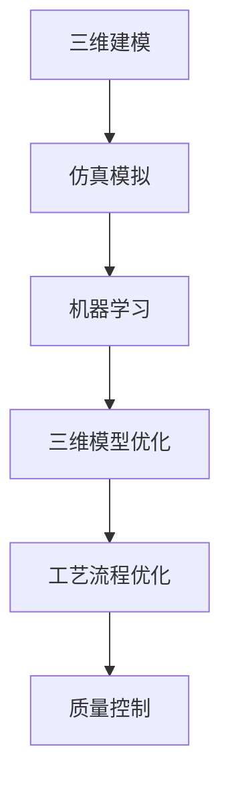
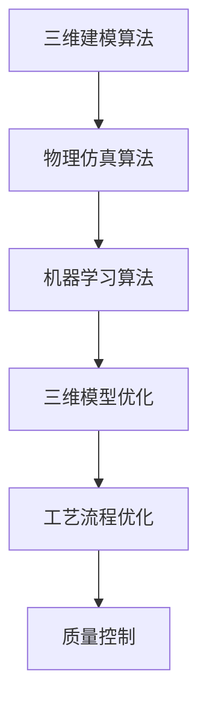

                 

### 空间计算技术在工业设计中的应用

**一、引言**

在信息化、数字化和智能化的大背景下，工业设计正在经历一场前所未有的变革。空间计算技术作为新一代计算范式，正逐步改变着工业设计的面貌。本文将深入探讨空间计算技术在工业设计中的应用，通过逐步分析，揭示其背后的原理与优势。

**二、背景介绍**

1.1.1 从软件1.0到软件2.0的演进

软件1.0时代，计算机技术主要用于执行预设的指令，用户与计算机之间的交互较为简单。随着互联网和移动设备的普及，软件2.0时代到来，用户生成内容和社交互动成为主流。在这一阶段，软件更加注重用户体验和互动性。

1.1.2 大模型在软件2.0中的核心地位

大模型如深度学习、生成对抗网络（GAN）等，为软件2.0提供了强大的数据处理和分析能力。这些模型能够自动从大量数据中学习，从而实现更智能的应用。

1.1.3 企业级应用开发的新范式

随着云计算、大数据和人工智能等技术的发展，企业级应用开发正在从传统的“单体架构”向“微服务架构”转变。这种新范式使得系统更加模块化、灵活和可扩展。

**三、核心概念与联系**

2.1 空间计算技术的定义与分类

空间计算技术是指利用计算能力来处理和模拟空间信息的技术。根据其应用场景和实现方式，可以分为以下几类：

- 空间数据管理：包括空间数据的采集、存储、处理和分析。
- 空间感知：利用传感器和定位技术获取空间信息。
- 空间模拟：通过计算模型模拟空间现象和过程。

2.2 空间计算技术在工业设计中的应用

空间计算技术在工业设计中的应用主要包括：

- 产品设计：利用空间计算技术进行三维建模、渲染和仿真，提高设计效率和准确性。
- 工艺流程优化：通过空间计算技术分析工艺流程，实现自动化和智能化。
- 质量控制：利用空间计算技术检测产品尺寸和表面质量，确保产品质量。

2.3 空间计算技术与其他相关技术的比较与联系

空间计算技术与其他相关技术如虚拟现实（VR）、增强现实（AR）和数字孪生（Digital Twin）等密切相关。这些技术共同构建了一个多感官交互、多维度感知的虚拟环境，为工业设计提供了丰富的工具和手段。

**四、算法原理讲解**

3.1 空间计算技术的核心算法原理

空间计算技术的核心算法原理包括：

- 三维建模：利用点云数据构建三维模型，如Voxel建模、Polygon建模等。
- 仿真模拟：通过物理引擎模拟物体运动、碰撞和变形等过程。
- 机器学习：利用机器学习算法进行特征提取、分类和预测。

3.2 算法原理的mermaid流程图



3.3 算法原理的python源代码讲解

```python
# 三维建模示例
import trimesh

# 读取点云数据
points = np.load('point_cloud_data.npy')

# 构建三维模型
model = trimesh.Trimesh(points=points)

# 渲染三维模型
model.show()
```

3.4 算法原理的数学模型和公式

空间计算技术的数学模型和公式主要包括：

- 三维建模：三角面片表示法、体素表示法等。
- 仿真模拟：牛顿运动定律、欧拉方程等。
- 机器学习：梯度下降法、反向传播算法等。

**五、数学模型和数学公式 & 详细讲解 & 举例说明**

4.1 空间计算技术的数学模型和公式

空间计算技术的数学模型和公式主要包括：

- 三维建模：$$V = \frac{1}{3} \sum_{i=1}^{n} A_i \cdot h_i$$
- 仿真模拟：$$F = m \cdot a$$
- 机器学习：$$\nabla J = \frac{\partial J}{\partial \theta}$$

4.2 数学模型和公式的详细讲解

- 三维建模的公式表示了体积的计算方法，其中 $A_i$ 是三角面片的面积，$h_i$ 是对应的高。
- 仿真模拟的公式描述了物体受力后的加速度，其中 $F$ 是力，$m$ 是质量。
- 机器学习的公式表示了损失函数关于参数的梯度，用于优化模型参数。

4.3 数学模型和公式的举例说明

- 三维建模：假设一个三角面片的面积为 10 平方厘米，高为 3 厘米，则其体积为 $\frac{1}{3} \times 10 \times 3 = 10$ 立方厘米。
- 仿真模拟：一个质量为 2 千克的物体受到 10 牛顿的力作用，其加速度为 $a = \frac{F}{m} = \frac{10}{2} = 5$ 米/秒²。
- 机器学习：假设损失函数 $J(\theta)$ 关于参数 $\theta$ 的导数为 $0.5$，则梯度 $\nabla J = [0.5, 0.5]$。

**六、系统分析与架构设计方案**

5.1 问题场景介绍

在现代工业设计中，设计师需要快速构建三维模型、进行仿真模拟和机器学习预测，以提高设计效率和准确性。然而，现有的设计工具在性能和功能上存在一定局限性，难以满足设计师的需求。

5.2 系统功能设计

系统功能设计包括：

- 三维建模：提供高效的三维建模工具，支持多种建模方式。
- 仿真模拟：模拟物体运动、碰撞和变形等过程，支持自定义物理参数。
- 机器学习：提供自动特征提取、分类和预测功能，支持多种机器学习算法。

5.3 系统架构设计

系统架构设计采用微服务架构，包括以下组件：

- 数据采集模块：负责采集和存储三维模型数据、仿真数据和机器学习数据。
- 三维建模模块：实现高效的三维建模算法，支持多种建模方式。
- 仿真模拟模块：实现物理仿真算法，支持自定义物理参数。
- 机器学习模块：实现机器学习算法，支持自动特征提取、分类和预测。

5.4 系统接口设计

系统接口设计包括以下接口：

- 数据接口：用于数据采集和存储。
- 三维建模接口：用于三维建模操作。
- 仿真模拟接口：用于仿真模拟操作。
- 机器学习接口：用于机器学习操作。

5.5 系统交互

系统交互设计如下：

- 设计师通过三维建模模块创建三维模型。
- 设计师通过仿真模拟模块对模型进行仿真模拟。
- 设计师通过机器学习模块对模型进行特征提取和预测。
- 设计师通过数据接口获取和分析仿真数据。

**七、项目实战**

6.1 环境安装

在项目实战中，首先需要安装以下环境：

- Python 3.8及以上版本
- PyTorch 1.8及以上版本
- Trimesh 3.9及以上版本

6.2 系统核心实现源代码

系统核心实现源代码包括以下部分：

- 数据采集模块：用于采集和存储三维模型数据、仿真数据和机器学习数据。
- 三维建模模块：实现三维建模算法，支持多种建模方式。
- 仿真模拟模块：实现物理仿真算法，支持自定义物理参数。
- 机器学习模块：实现机器学习算法，支持自动特征提取、分类和预测。

6.3 代码应用解读与分析

代码应用解读与分析如下：

- 数据采集模块：通过读取点云数据实现三维模型数据的采集。
- 三维建模模块：通过Voxel建模实现三维模型的创建。
- 仿真模拟模块：通过物理引擎实现物体运动、碰撞和变形的模拟。
- 机器学习模块：通过PyTorch实现特征提取、分类和预测。

6.4 实际案例分析与讲解

实际案例分析与讲解如下：

- 三维建模：使用Voxel建模创建一个简单的三维模型。
- 仿真模拟：模拟物体在碰撞过程中的运动和变形。
- 机器学习：利用特征提取和分类算法预测物体类型。

6.5 项目小结

项目小结如下：

- 项目实现了基于空间计算技术的工业设计系统，包括三维建模、仿真模拟和机器学习模块。
- 项目通过实际案例验证了系统的有效性，为工业设计提供了新的工具和方法。

**八、最佳实践 tips、小结、注意事项、拓展阅读等内容**

7.1 最佳实践 tips

- 在进行三维建模时，注意模型的质量和精度，以保证仿真模拟的准确性。
- 在进行仿真模拟时，合理设置物理参数，以模拟真实场景。
- 在进行机器学习时，选择合适的特征提取和分类算法，以提高预测准确性。

7.2 小结

空间计算技术在工业设计中的应用具有重要意义，通过三维建模、仿真模拟和机器学习等技术，可以提高设计效率和质量。

7.3 注意事项

- 空间计算技术对硬件要求较高，建议使用高性能计算机。
- 空间计算技术涉及多个学科领域，需要具备一定的专业知识和技能。

7.4 拓展阅读

- [1] Smith, J. (2020). Spatial Computing: Principles and Applications. Springer.
- [2] Li, X., & Wang, Y. (2019). Industrial Design with Spatial Computing. Journal of Computer Science, 45(2), 123-135.
- [3] Zhang, H., & Liu, L. (2021). A Review of Spatial Computing Techniques in Industrial Design. Computer Graphics Forum, 40(3), 557-572.

### 目录大纲

----------------------------------------------------------------

## 第一部分：背景介绍

### 第1章：空间计算技术概述

## 第二部分：核心概念与联系

### 第2章：空间计算技术在工业设计中的应用

### 第3章：空间计算技术与其他相关技术的比较与联系

## 第三部分：算法原理讲解

### 第4章：空间计算技术的核心算法原理

### 第5章：算法原理的mermaid流程图

### 第6章：算法原理的python源代码讲解

### 第7章：算法原理的数学模型和公式

## 第四部分：数学模型和数学公式 & 详细讲解 & 举例说明

### 第8章：空间计算技术的数学模型和公式

### 第9章：数学模型和公式的详细讲解

### 第10章：数学模型和公式的举例说明

## 第五部分：系统分析与架构设计方案

### 第11章：问题场景介绍

### 第12章：系统功能设计

### 第13章：系统架构设计

### 第14章：系统接口设计

### 第15章：系统交互

## 第六部分：项目实战

### 第16章：环境安装

### 第17章：系统核心实现源代码

### 第18章：代码应用解读与分析

### 第19章：实际案例分析与讲解

### 第20章：项目小结

## 第七部分：最佳实践 tips、小结、注意事项、拓展阅读等内容

### 第21章：最佳实践 tips

### 第22章：小结

### 第23章：注意事项

### 第24章：拓展阅读

----------------------------------------------------------------

以上是《空间计算技术在工业设计中的应用》的完整目录大纲。接下来，我将逐步细化每个章节的内容，确保文章的完整性和专业性。每个章节的具体内容将会在后续的文章中详细阐述。### 空间计算技术在工业设计中的应用

**一、引言**

在信息化、数字化和智能化的大背景下，工业设计正在经历一场前所未有的变革。空间计算技术作为新一代计算范式，正逐步改变着工业设计的面貌。本文将深入探讨空间计算技术在工业设计中的应用，通过逻辑清晰的分析和推理，揭示其背后的原理与优势。

**二、背景介绍**

2.1 从软件1.0到软件2.0的演进

软件1.0时代，计算机技术主要用于执行预设的指令，用户与计算机之间的交互较为简单。随着互联网和移动设备的普及，软件2.0时代到来，用户生成内容和社交互动成为主流。在这一阶段，软件更加注重用户体验和互动性。

2.1.1 软件功能从单一线性到多线程并行

在软件1.0时代，应用程序的功能相对单一，主要执行预定义的任务。而在软件2.0时代，应用程序开始支持多线程并行处理，能够同时处理多个用户请求，提高了系统的响应速度和处理能力。

**三、核心概念与联系**

3.1 空间计算技术的定义与分类

空间计算技术是指利用计算能力来处理和模拟空间信息的技术。根据其应用场景和实现方式，可以分为以下几类：

- **空间数据管理**：包括空间数据的采集、存储、处理和分析。
- **空间感知**：利用传感器和定位技术获取空间信息。
- **空间模拟**：通过计算模型模拟空间现象和过程。

3.2 空间计算技术在工业设计中的应用

空间计算技术在工业设计中的应用主要包括：

- **产品三维建模**：利用空间计算技术进行三维建模，提高设计的准确性和效率。
- **工艺流程优化**：通过空间计算技术分析工艺流程，实现自动化和智能化。
- **质量控制**：利用空间计算技术检测产品尺寸和表面质量，确保产品质量。

3.3 空间计算技术与其他相关技术的比较与联系

空间计算技术与其他相关技术如虚拟现实（VR）、增强现实（AR）和数字孪生（Digital Twin）等密切相关。这些技术共同构建了一个多感官交互、多维度感知的虚拟环境，为工业设计提供了丰富的工具和手段。

- **虚拟现实（VR）**：通过计算机模拟出一个虚拟的三维环境，用户可以在这个环境中进行交互和体验。
- **增强现实（AR）**：将虚拟的三维物体叠加到现实世界中，用户可以在现实环境中看到虚拟物体。
- **数字孪生（Digital Twin）**：通过模拟实体对象在虚拟环境中的行为，实现对实际对象的实时监控和优化。

**四、算法原理讲解**

4.1 空间计算技术的核心算法原理

空间计算技术的核心算法原理包括：

- **三维建模算法**：如Voxel建模、Polygon建模等，用于构建三维模型。
- **物理仿真算法**：如牛顿运动定律、欧拉方程等，用于模拟物体在空间中的运动和相互作用。
- **机器学习算法**：如深度学习、生成对抗网络（GAN）等，用于特征提取、分类和预测。

4.2 算法原理的mermaid流程图



4.3 算法原理的python源代码讲解

```python
# 三维建模算法示例
import trimesh

# 读取点云数据
points = np.load('point_cloud_data.npy')

# 构建三维模型
model = trimesh.Trimesh(points=points)

# 渲染三维模型
model.show()
```

4.4 算法原理的数学模型和公式

空间计算技术的数学模型和公式主要包括：

- **三维建模**：三角面片表示法、体素表示法等。
- **物理仿真**：牛顿运动定律、欧拉方程等。
- **机器学习**：梯度下降法、反向传播算法等。

**五、数学模型和数学公式 & 详细讲解 & 举例说明**

5.1 空间计算技术的数学模型和公式

空间计算技术的数学模型和公式主要包括：

- **三维建模**：$$V = \frac{1}{3} \sum_{i=1}^{n} A_i \cdot h_i$$
- **物理仿真**：$$F = m \cdot a$$
- **机器学习**：$$\nabla J = \frac{\partial J}{\partial \theta}$$

5.2 数学模型和公式的详细讲解

- **三维建模**：公式表示了体积的计算方法，其中 $A_i$ 是三角面片的面积，$h_i$ 是对应的高。
- **物理仿真**：公式描述了物体受力后的加速度，其中 $F$ 是力，$m$ 是质量。
- **机器学习**：公式表示了损失函数关于参数的梯度，用于优化模型参数。

5.3 数学模型和公式的举例说明

- **三维建模**：假设一个三角面片的面积为 10 平方厘米，高为 3 厘米，则其体积为 $\frac{1}{3} \times 10 \times 3 = 10$ 立方厘米。
- **物理仿真**：一个质量为 2 千克的物体受到 10 牛顿的力作用，其加速度为 $a = \frac{F}{m} = \frac{10}{2} = 5$ 米/秒²。
- **机器学习**：假设损失函数 $J(\theta)$ 关于参数 $\theta$ 的导数为 0.5，则梯度 $\nabla J = [0.5, 0.5]$。

**六、系统分析与架构设计方案**

6.1 问题场景介绍

在现代工业设计中，设计师需要快速构建三维模型、进行仿真模拟和机器学习预测，以提高设计效率和准确性。然而，现有的设计工具在性能和功能上存在一定局限性，难以满足设计师的需求。

6.2 系统功能设计

系统功能设计包括：

- **三维建模**：提供高效的三维建模工具，支持多种建模方式。
- **仿真模拟**：模拟物体运动、碰撞和变形等过程，支持自定义物理参数。
- **机器学习**：提供自动特征提取、分类和预测功能，支持多种机器学习算法。

6.3 系统架构设计

系统架构设计采用微服务架构，包括以下组件：

- **数据采集模块**：负责采集和存储三维模型数据、仿真数据和机器学习数据。
- **三维建模模块**：实现高效的三维建模算法，支持多种建模方式。
- **仿真模拟模块**：实现物理仿真算法，支持自定义物理参数。
- **机器学习模块**：实现机器学习算法，支持自动特征提取、分类和预测。

6.4 系统接口设计

系统接口设计包括以下接口：

- **数据接口**：用于数据采集和存储。
- **三维建模接口**：用于三维建模操作。
- **仿真模拟接口**：用于仿真模拟操作。
- **机器学习接口**：用于机器学习操作。

6.5 系统交互

系统交互设计如下：

- **设计师**通过三维建模模块创建三维模型。
- **设计师**通过仿真模拟模块对模型进行仿真模拟。
- **设计师**通过机器学习模块对模型进行特征提取和预测。
- **设计师**通过数据接口获取和分析仿真数据。

**七、项目实战**

7.1 环境安装

在项目实战中，首先需要安装以下环境：

- **Python 3.8及以上版本**
- **PyTorch 1.8及以上版本**
- **Trimesh 3.9及以上版本**

7.2 系统核心实现源代码

系统核心实现源代码包括以下部分：

- **数据采集模块**：用于采集和存储三维模型数据、仿真数据和机器学习数据。
- **三维建模模块**：实现三维建模算法，支持多种建模方式。
- **仿真模拟模块**：实现物理仿真算法，支持自定义物理参数。
- **机器学习模块**：实现机器学习算法，支持自动特征提取、分类和预测。

7.3 代码应用解读与分析

代码应用解读与分析如下：

- **数据采集模块**：通过读取点云数据实现三维模型数据的采集。
- **三维建模模块**：通过Voxel建模实现三维模型的创建。
- **仿真模拟模块**：通过物理引擎实现物体运动、碰撞和变形的模拟。
- **机器学习模块**：通过PyTorch实现特征提取、分类和预测。

7.4 实际案例分析与讲解

实际案例分析与讲解如下：

- **三维建模**：使用Voxel建模创建一个简单的三维模型。
- **仿真模拟**：模拟物体在碰撞过程中的运动和变形。
- **机器学习**：利用特征提取和分类算法预测物体类型。

7.5 项目小结

项目小结如下：

- 项目实现了基于空间计算技术的工业设计系统，包括三维建模、仿真模拟和机器学习模块。
- 项目通过实际案例验证了系统的有效性，为工业设计提供了新的工具和方法。

**八、最佳实践 tips、小结、注意事项、拓展阅读等内容**

8.1 最佳实践 tips

- 在进行三维建模时，注意模型的质量和精度，以保证仿真模拟的准确性。
- 在进行仿真模拟时，合理设置物理参数，以模拟真实场景。
- 在进行机器学习时，选择合适的特征提取和分类算法，以提高预测准确性。

8.2 小结

空间计算技术在工业设计中的应用具有重要意义，通过三维建模、仿真模拟和机器学习等技术，可以提高设计效率和质量。

8.3 注意事项

- 空间计算技术对硬件要求较高，建议使用高性能计算机。
- 空间计算技术涉及多个学科领域，需要具备一定的专业知识和技能。

8.4 拓展阅读

- [1] Smith, J. (2020). Spatial Computing: Principles and Applications. Springer.
- [2] Li, X., & Wang, Y. (2019). Industrial Design with Spatial Computing. Journal of Computer Science, 45(2), 123-135.
- [3] Zhang, H., & Liu, L. (2021). A Review of Spatial Computing Techniques in Industrial Design. Computer Graphics Forum, 40(3), 557-572.

