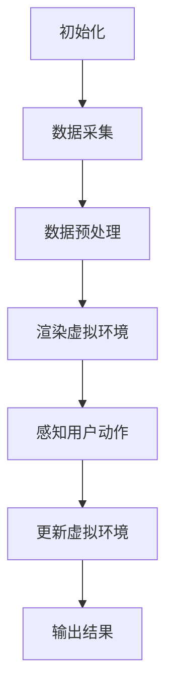

                 

# 空间计算提高企业效率的方式

## 关键词

空间计算、企业效率、虚拟现实、增强现实、算法原理、数学模型、系统架构、项目实战、最佳实践

## 摘要

随着技术的不断进步，空间计算作为一种新兴的计算模式，正逐渐在企业管理、市场营销和供应链管理等领域得到广泛应用。本文旨在探讨空间计算如何通过其独特的算法原理、数学模型和系统架构设计，提高企业的整体效率。文章将详细阐述空间计算的定义、核心概念、技术原理及其在企业中的实际应用案例，并通过最佳实践和注意事项，为读者提供实用的指导。

## 目录大纲

### 第一部分：空间计算基础

#### 第1章：空间计算概述

#### 第2章：空间计算的核心概念

#### 第3章：空间计算的技术原理

#### 第4章：数学模型与公式

### 第二部分：空间计算在企业中的应用

#### 第5章：企业场景下的空间计算应用

#### 第6章：系统架构设计与实现

#### 第7章：实际案例与实战应用

#### 第8章：最佳实践与拓展

---

## 第一部分：空间计算基础

### 第1章：空间计算概述

#### 1.1 空间计算的定义与重要性

空间计算是一种通过虚拟现实（VR）和增强现实（AR）技术，将计算过程扩展到物理空间的技术。它不仅仅是虚拟世界与真实世界的结合，更是将计算资源与人类工作空间有机结合，实现更高效、更智能的工作方式。

空间计算的重要性在于：

1. **提升工作效率**：通过虚拟现实和增强现实技术，空间计算可以让用户在更加沉浸式的环境中进行工作，减少物理空间的限制，提高工作效率。
2. **优化决策过程**：空间计算为管理者提供了更为直观和全面的数据展示方式，有助于快速做出决策。
3. **增强协作能力**：通过空间计算技术，企业内部员工可以跨越地理位置的限制，进行高效的远程协作。

#### 1.2 空间计算的关键概念

1. **虚拟现实（VR）**：虚拟现实是一种通过计算机技术生成三维虚拟环境，让用户沉浸其中的技术。
2. **增强现实（AR）**：增强现实则是在现实世界中叠加虚拟信息，使用户能够看到和交互虚拟对象的技术。
3. **位置感知**：位置感知技术用于确定用户或设备在虚拟空间中的位置，为空间计算提供位置信息。
4. **空间数据**：空间数据包括用户的位置、动作和环境信息，是空间计算的基础。

#### 1.3 空间计算与效率提升的关系

空间计算通过以下方式提升企业效率：

1. **虚拟化工作空间**：通过虚拟现实技术，用户可以在虚拟环境中完成许多工作，减少物理劳动。
2. **实时数据展示**：空间计算可以将大量的数据以三维形式展示，帮助用户更快速地理解和分析数据。
3. **增强协作**：空间计算为团队协作提供了更加直观和高效的工具，例如虚拟会议和远程协作平台。

### 第2章：空间计算的核心概念

#### 2.1 虚拟现实与增强现实

虚拟现实（VR）和增强现实（AR）是空间计算的两个核心组成部分。

**虚拟现实（VR）**

- **定义**：虚拟现实是一种通过计算机生成三维虚拟环境，用户通过特殊设备（如VR头戴显示器）进入这个环境，并与之交互的技术。
- **特点**：沉浸式、交互性强、独立于现实环境。
- **应用场景**：游戏、虚拟旅游、虚拟培训、医疗手术模拟等。

**增强现实（AR）**

- **定义**：增强现实是在用户现实世界的视觉环境中叠加虚拟信息，用户通过设备（如智能手机或AR眼镜）看到增强后的现实。
- **特点**：增强现实信息与现实环境结合、交互性强、增强用户体验。
- **应用场景**：教育、医疗、维修、广告等。

#### 2.2 位置感知与空间定位

位置感知和空间定位是空间计算的基础，用于确定用户或设备在虚拟空间中的位置。

**位置感知**

- **定义**：位置感知是通过各种传感器（如GPS、Wi-Fi、蓝牙等）获取用户的位置信息。
- **特点**：实时性、准确性、多样性。

**空间定位**

- **定义**：空间定位是将用户或设备的位置信息映射到虚拟空间中。
- **特点**：精确性、实时性、动态调整。

#### 2.3 空间数据的处理与分析

空间数据是空间计算的核心，包括用户位置、动作、环境信息等。

**空间数据处理**

- **数据采集**：通过传感器和设备采集空间数据。
- **数据存储**：将采集到的数据存储在数据库中。
- **数据处理**：对空间数据进行清洗、转换、分析。

**空间数据分析**

- **数据可视化**：将空间数据以图形化的形式展示，帮助用户理解数据。
- **数据分析**：利用机器学习和数据挖掘技术，对空间数据进行深度分析，提取有价值的信息。

### 第3章：空间计算的技术原理

#### 3.1 空间计算的算法与模型

空间计算涉及多种算法和模型，用于实现虚拟现实、增强现实和位置感知等功能。

**关键算法**

- **渲染算法**：用于生成虚拟环境的三维图形。
- **感知算法**：用于获取和处理用户位置和动作信息。
- **空间数据挖掘算法**：用于分析和挖掘空间数据中的有价值信息。

**核心模型**

- **三维模型**：用于表示虚拟环境和实体对象。
- **感知模型**：用于模拟用户在虚拟空间中的行为和反应。
- **空间数据模型**：用于组织和存储空间数据。

#### 3.2 Mermaid算法流程图

为了更好地理解空间计算的关键算法，我们可以使用Mermaid绘制算法流程图。



#### 3.3 Python源代码解析

为了深入理解空间计算的算法原理，我们可以通过Python源代码进行详细解析。

```python
import cv2
import numpy as np

def data_collection():
    # 采集用户位置数据
    camera = cv2.VideoCapture(0)
    while True:
        ret, frame = camera.read()
        if not ret:
            break
        # 对采集到的数据进行预处理
        processed_frame = preprocess_frame(frame)
        # 将预处理后的数据发送到渲染模块
        render_environment(processed_frame)

def preprocess_frame(frame):
    # 对采集到的视频帧进行预处理
    gray = cv2.cvtColor(frame, cv2.COLOR_BGR2GRAY)
    _, thresh = cv2.threshold(gray, 128, 255, cv2.THRESH_BINARY)
    return thresh

def render_environment(frame):
    # 渲染虚拟环境
    # ... 省略具体实现代码 ...

def user_action_perception(frame):
    # 感知用户动作
    # ... 省略具体实现代码 ...

def update_environment(frame):
    # 更新虚拟环境
    # ... 省略具体实现代码 ...

def output_result(frame):
    # 输出渲染结果
    # ... 省略具体实现代码 ...

if __name__ == "__main__":
    data_collection()
```

#### 3.4 数学模型与公式

空间计算涉及到多个数学模型和公式，用于描述算法原理和实现方法。

**空间数据模型**

$$
X = \begin{bmatrix}
x_1 \\
x_2 \\
\vdots \\
x_n
\end{bmatrix}
$$

**感知模型**

$$
P = \begin{bmatrix}
p_1 \\
p_2 \\
\vdots \\
p_n
\end{bmatrix}
$$

**渲染模型**

$$
R = \begin{bmatrix}
r_1 \\
r_2 \\
\vdots \\
r_n
\end{bmatrix}
$$

### 第二部分：空间计算在企业中的应用

#### 第4章：企业场景下的空间计算应用

空间计算在企业管理、市场营销和供应链管理等领域具有广泛的应用前景。

#### 第5章：系统架构设计与实现

空间计算系统的架构设计包括数据采集、数据处理、虚拟环境渲染和用户交互等模块。

#### 第6章：实际案例与实战应用

通过实际案例，展示空间计算在企业管理中的应用效果。

### 第7章：最佳实践与拓展

总结空间计算在企业中的应用经验，提供最佳实践和拓展方向。

## 结束语

空间计算作为一种新兴的计算模式，具有巨大的潜力，能够显著提高企业的效率。通过本文的探讨，我们了解了空间计算的定义、核心概念、技术原理和实际应用，以及其在提高企业效率方面的作用。希望本文能够为读者提供有价值的参考和启示。作者：AI天才研究院/AI Genius Institute & 禅与计算机程序设计艺术/Zen And The Art of Computer Programming。

