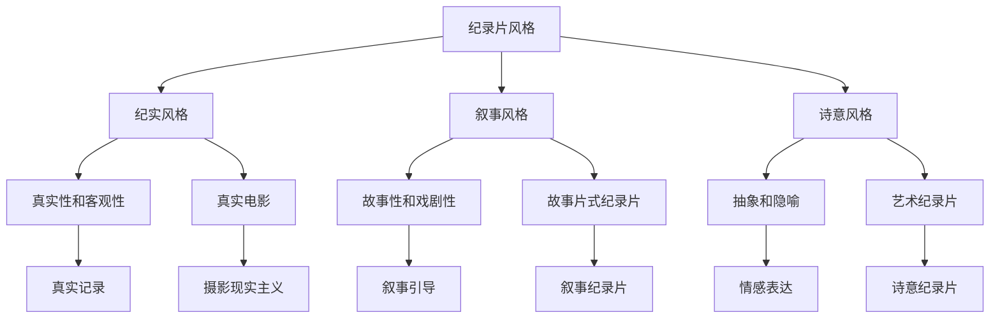

                 

### 文章标题

# 纪录片创作的意义：用影像记录真实生活

> 关键词：纪录片、影像、真实生活、记录、创作、意义

> 摘要：本文将从纪录片创作的背景出发，探讨纪录片的意义以及其对社会、文化和历史的影响。通过分析纪录片的核心概念与联系，详细讲解纪录片创作的原理和实践，以及经典纪录片案例，总结纪录片创作的最佳实践，最终展望纪录片创作的未来发展趋势。

----------------------------------------------------------------

### 目录大纲设计

为了确保《纪录片创作的意义：用影像记录真实生活》这篇文章的逻辑清晰、结构紧凑且易于理解，我们设计了一个详细的目录大纲。以下是具体的章节结构和内容安排：

1. **背景介绍**：介绍纪录片创作的起源、发展历程以及纪录片在社会、文化和历史中的地位。
2. **核心概念与联系**：阐述纪录片风格、类型、技巧等核心概念，并通过图表和流程图展示它们之间的联系。
3. **纪录片创作原理**：详细讲解拍摄技巧、剪辑艺术、声音设计等纪录片创作原理，并使用算法流程图和数学公式进行阐述。
4. **纪录片创作实践**：介绍纪录片创作的实际操作步骤，包括拍摄前的准备工作、拍摄过程中的技巧以及后期剪辑。
5. **纪录片创作案例分析**：分析经典纪录片案例，从选题、拍摄、剪辑等方面进行深入剖析。
6. **纪录片创作最佳实践**：总结纪录片创作的技巧、注意事项，并提供拓展阅读资源。
7. **纪录片创作的未来发展趋势**：探讨纪录片创作的新技术、新理念以及未来发展方向。

这样的目录结构不仅帮助读者系统地理解纪录片创作的全过程，同时也为作者提供了明确的写作框架，确保内容丰富、具体且逻辑连贯。

---

#### 目录大纲设计

为了设计出《纪录片创作的意义：用影像记录真实生活》的完整目录大纲，我们需要将书籍内容进行合理的划分和安排，使其逻辑清晰、结构紧凑且易于阅读。以下是具体的目录大纲设计：

## 第一部分：纪录片创作概述

### 第1章：纪录片的历史与发展

#### 1.1 纪录片的定义与起源

##### 1.1.1 纪录片的定义

##### 1.1.2 纪录片的起源与发展历程

##### 1.1.3 纪录片在不同文化背景下的特点

#### 1.2 纪录片创作的意义

##### 1.2.1 纪录片在社会中的地位

##### 1.2.2 纪录片对观众的影响

##### 1.2.3 纪录片的历史价值

#### 1.3 本章小结

## 第二部分：纪录片创作原理

### 第2章：纪录片的核心概念与联系

#### 2.1 纪录片风格与类型

##### 2.1.1 纪录片风格的多样性

##### 2.1.2 纪录片类型的划分

##### 2.1.3 不同风格与类型的纪录片案例分析

#### 2.2 纪录片创作技巧

##### 2.2.1 拍摄技巧

##### 2.2.2 剪辑艺术

##### 2.2.3 声音设计

#### 2.3 核心概念联系图表

##### 2.3.1 纪录片风格与类型的联系

##### 2.3.2 纪录片创作技巧的联系

#### 2.4 本章小结

### 第3章：纪录片创作原理详细讲解

#### 3.1 拍摄技巧

##### 3.1.1 拍摄角度与构图

##### 3.1.2 光线与色彩

##### 3.1.3 镜头运动

#### 3.2 剪辑艺术

##### 3.2.1 剪辑的基本原则

##### 3.2.2 剪辑技巧与艺术性

##### 3.2.3 剪辑软件的应用

#### 3.3 声音设计

##### 3.3.1 声音的作用与处理

##### 3.3.2 音频剪辑技巧

##### 3.3.3 声音设计软件的使用

#### 3.4 本章小结

## 第三部分：纪录片创作实践

### 第4章：纪录片创作实践

#### 4.1 拍摄前的准备工作

##### 4.1.1 选题与策划

##### 4.1.2 场地与设备准备

##### 4.1.3 拍摄团队组建

#### 4.2 拍摄过程中的技巧

##### 4.2.1 拍摄现场的应对策略

##### 4.2.2 拍摄过程中的互动与沟通

##### 4.2.3 拍摄中的应急处理

#### 4.3 后期剪辑

##### 4.3.1 剪辑流程与工具

##### 4.3.2 剪辑技巧与实践

##### 4.3.3 剪辑软件的运用

#### 4.4 项目实战

##### 4.4.1 项目案例介绍

##### 4.4.2 拍摄与剪辑实践

##### 4.4.3 项目总结与反思

#### 4.5 本章小结

## 第四部分：纪录片创作案例分析

### 第5章：经典纪录片案例分析

#### 5.1 纪录片案例介绍

##### 5.1.1 案例一：《中国工人》

##### 5.1.2 案例二：《舌尖上的中国》

##### 5.1.3 案例三：《南极之恋》

#### 5.2 案例分析

##### 5.2.1 选题与拍摄

##### 5.2.2 剪辑与艺术性

##### 5.2.3 观众反响与评价

#### 5.3 案例启示

##### 5.3.1 创作技巧

##### 5.3.2 选题方向

##### 5.3.3 剪辑艺术

#### 5.4 本章小结

## 第五部分：纪录片创作最佳实践

### 第6章：纪录片创作最佳实践

#### 6.1 创作技巧

##### 6.1.1 拍摄技巧

##### 6.1.2 剪辑技巧

##### 6.1.3 声音设计技巧

#### 6.2 注意事项

##### 6.2.1 遵守拍摄规定

##### 6.2.2 照顾被拍摄对象

##### 6.2.3 保护个人隐私

#### 6.3 拓展阅读

##### 6.3.1 相关书籍推荐

##### 6.3.2 纪录片创作网站

##### 6.3.3 拓展阅读资源

#### 6.4 本章小结

## 第六部分：纪录片创作的未来发展趋势

### 第7章：纪录片创作的未来发展趋势

#### 7.1 新技术的发展

##### 7.1.1 虚拟现实（VR）在纪录片中的应用

##### 7.1.2 增强现实（AR）技术的应用

##### 7.1.3 人工智能（AI）在纪录片制作中的角色

#### 7.2 新理念的影响

##### 7.2.1 故事叙述的创新

##### 7.2.2 观众参与与互动

##### 7.2.3 纪录片与社会责任的融合

#### 7.3 纪录片创作的未来方向

##### 7.3.1 纪录片形式的多元化

##### 7.3.2 跨媒体叙事与融合

##### 7.3.3 全球化视野下的纪录片创作

#### 7.4 本章小结

---

#### 目录大纲设计思路

在设计《纪录片创作的意义：用影像记录真实生活》的目录大纲时，我们遵循了以下思路：

1. **明确结构**：首先，我们确定了书籍的整体结构，包括背景介绍、核心概念与联系、创作原理、创作实践、案例分析、最佳实践和未来发展趋势七个部分。每个部分都有明确的主题和内容安排，确保文章的逻辑性和条理性。

2. **细化章节内容**：在每个部分中，我们进一步细化了章节内容。例如，在“纪录片创作原理”章节中，我们分别讲解了拍摄技巧、剪辑艺术和声音设计。这样的划分使得每个部分的内容更加具体、深入。

3. **图表和流程图**：为了更好地展示纪录片创作的核心概念与联系，我们设计了多种图表和流程图。例如，核心概念联系图表、拍摄技巧流程图等。这些图表不仅帮助读者理解文章内容，也使文章更具视觉吸引力。

4. **实例和案例分析**：在适当的部分，我们引入了实例和经典纪录片案例分析。通过具体案例的剖析，读者可以更直观地了解纪录片创作的实际操作过程和技巧。

5. **总结与展望**：在每个部分的结尾，我们进行了总结，帮助读者回顾和巩固所学内容。同时，我们也展望了纪录片创作的未来发展趋势，为读者提供更广阔的视野。

通过这样的设计思路，我们确保了《纪录片创作的意义：用影像记录真实生活》的目录大纲既系统又具体，能够全面、深入地介绍纪录片创作的过程、技巧和意义。这不仅有助于读者系统地学习纪录片创作知识，也有助于他们更好地理解和应用这些知识。

---

### 纪录片创作概述

#### 第1章：纪录片的历史与发展

纪录片作为一种影像艺术形式，有着悠久的历史和丰富的内涵。本章将首先介绍纪录片的基本定义和起源，然后回顾纪录片的发展历程，探讨其在不同文化背景下的特点。最后，我们将讨论纪录片创作的意义，包括其在社会、文化和历史中的重要作用。

#### 1.1 纪录片的定义与起源

纪录片，顾名思义，是以真实生活为素材，通过影像手段记录并呈现出来的故事或事件。它的定义可以追溯到最早期的电影记录，即以拍摄真实事件为目的的影像记录。然而，纪录片的现代概念则主要起源于20世纪初期，尤其是在法国和苏联。

在法国，纪录片被称为“真实电影”（Cinema vérité），强调记录真实生活中的场景，减少导演的主观干预。而在苏联，纪录片则被视为社会主义现实主义的艺术形式，用以宣传社会主义思想和价值观。这些早期的纪录片创作理念和方法对后来的纪录片创作产生了深远的影响。

#### 1.1.1 纪录片的定义

纪录片是一种以真实事件和人物为对象，通过影像手段记录和呈现出来的故事或事件。它强调真实性和客观性，通常不涉及虚构和戏剧性元素。纪录片的内容可以涵盖社会、历史、科学、文化等多个领域。

#### 1.1.2 纪录片的起源与发展历程

纪录电影的起源可以追溯到19世纪末。最早的纪录片《工厂大门》（L'Arrivée d'un train à La Ciotat）由法国导演卢米埃尔兄弟于1895年拍摄。然而，真正的纪录片发展始于20世纪初期，以法国和苏联为代表。

在法国，让·鲁什（Jean Rouch）的《非洲日记》（Muntaka）被认为是真实电影的先驱。这部纪录片采用了手持摄影机记录非洲部落的生活，展示了真实的自然环境和社会场景。与此同时，法国电影理论家安德烈·巴赞（André Bazin）提出了“摄影现实主义”（Photorealism）的概念，强调了纪录片的真实性和客观性。

在苏联，纪录片作为一种社会主义现实主义的艺术形式，起到了宣传社会主义思想和价值观的作用。苏联电影大师谢尔盖·爱森斯坦（Sergei Eisenstein）的《战争与和平》（Alexander Nevsky）和《十月》（October）等作品，通过纪录片的形式展现了苏联的历史和文化。

#### 1.1.3 纪录片在不同文化背景下的特点

不同文化背景下的纪录片创作有着各自的特点。例如，在西方文化中，纪录片强调真实性和客观性，追求对社会现象和人类行为的深入探讨。而在东方文化中，纪录片则更注重情感表达和文化传承。

在中国，纪录片创作也有着悠久的历史。早在20世纪30年代，中国电影先驱蔡楚生和郑正秋就拍摄了一系列反映社会现实的纪录片，如《清明时节》和《黄河之滨》。新中国成立后，纪录片创作得到了政府的大力支持，成为宣传国家政策和文化的有力工具。如《开国大典》、《抗美援朝》等纪录片，记录了新中国的重要历史时刻。

#### 1.2 纪录片创作的意义

纪录片创作的意义不仅体现在其艺术价值上，更在于其对社会的贡献。首先，纪录片记录了真实的生活场景和社会现象，为后人提供了宝贵的历史资料。例如，美国纪录片《美国的抉择》（The American Experience）系列，通过记录不同历史时期的事件和人物，展示了美国的政治、经济、文化发展。

其次，纪录片对社会的影响也是显而易见的。它能够揭示社会问题，唤起公众的思考与关注。例如，中国纪录片《农民工》系列，通过记录农民工的生活和工作状态，揭示了城乡差距和社会不公问题，引起了社会的广泛关注和讨论。

此外，纪录片在文化交流和传承中扮演着重要角色。通过记录不同国家和地区的文化现象和传统，纪录片有助于增进人们对其他文化的了解和尊重，促进文化的交流与融合。

#### 1.3 本章小结

本章从纪录片的基本定义和起源出发，回顾了纪录片的发展历程，探讨了其在不同文化背景下的特点，并阐述了纪录片创作的意义。通过对纪录片历史的了解，我们可以更好地理解纪录片的价值和作用，为后续章节的学习打下坚实的基础。

### 核心概念与联系

纪录片创作是一个复杂而多样的过程，涉及众多核心概念和技巧。本章将详细探讨这些核心概念，并分析它们之间的联系。通过了解这些概念及其相互关系，读者将能够更全面地理解纪录片创作的基本原理。

#### 2.1 纪录片风格与类型

纪录片风格和类型是纪录片创作中的重要概念。风格指的是纪录片在表现形式上的特点，如纪实风格、叙事风格、诗意风格等。类型则是对纪录片内容进行分类的方式，如文化纪录片、社会纪录片、自然纪录片、历史纪录片等。

**纪实风格**强调真实性和客观性，通过记录真实生活场景来传达信息。这种风格在许多纪录片中都非常常见，如《南京！南京！》和《中国工人》。

**叙事风格**则注重故事性和戏剧性，通过讲述故事来引导观众的注意力。这种风格在《舌尖上的中国》和《南极之恋》等纪录片中得到了广泛应用。

**诗意风格**则通过抽象和隐喻来表达情感和思想，如《巴赫的机器》和《昆德拉的隔离》。

不同风格和类型的纪录片在表现形式和内容上有着显著的区别。例如，文化纪录片通常关注传统文化、历史遗产和文化现象，而社会纪录片则侧重于社会问题和社会现象的探讨。

**图表：纪录片风格与类型的对比**

| 风格/类型 | 特点 | 例子 |
| --- | --- | --- |
| 纪实风格 | 强调真实性和客观性 | 《南京！南京！》 |
| 叙事风格 | 注重故事性和戏剧性 | 《舌尖上的中国》 |
| 诗意风格 | 通过抽象和隐喻表达情感 | 《巴赫的机器》 |

#### 2.2 纪录片创作技巧

纪录片创作技巧是纪录片拍摄和剪辑过程中的一系列方法和技巧。这些技巧包括拍摄技巧、剪辑技巧和声音设计等。

**拍摄技巧**包括拍摄角度、光线运用、镜头运动等。拍摄角度决定了观众看到的画面内容，光线则影响画面的色彩和氛围，镜头运动则可以增加画面的动态感。

**剪辑技巧**是将拍摄好的素材进行编辑和组合，以形成连贯、有意义的叙事结构。剪辑技巧包括剪辑节奏、场景切换、音效剪辑等。

**声音设计**则关注声音的运用，包括背景音乐、对话录音、音效等。声音设计可以增强画面的情感表达和叙事效果。

**图表：纪录片创作技巧的分类**

| 技巧 | 分类 | 例子 |
| --- | --- | --- |
| 拍摄技巧 | 拍摄角度、光线、镜头运动 | 《中国工人》 |
| 剪辑技巧 | 剪辑节奏、场景切换、音效剪辑 | 《舌尖上的中国》 |
| 声音设计 | 背景音乐、对话录音、音效 | 《南极之恋》 |

#### 2.3 核心概念联系图表

为了更好地展示纪录片风格、类型和创作技巧之间的联系，我们可以使用ER实体关系图（Entity-Relationship Diagram）。



通过这个图表，我们可以清晰地看到纪录片风格、类型和创作技巧之间的相互关系。例如，纪实风格强调真实性和客观性，而叙事风格则注重故事性和戏剧性。

#### 2.4 本章小结

本章介绍了纪录片创作中的核心概念，包括纪录片风格、类型和创作技巧，并分析了它们之间的联系。通过了解这些概念及其相互关系，读者将能够更好地理解纪录片创作的原理和方法，为后续章节的学习打下坚实的基础。

### 纪录片创作原理详细讲解

纪录片创作是一门深奥且富有创造性的艺术，它不仅需要技术手段的运用，更需要创作者深刻的人文关怀和对真实世界的洞察。本章将详细讲解纪录片创作的各个核心原理，包括拍摄技巧、剪辑艺术和声音设计。通过这些原理的深入剖析，读者将能够掌握纪录片创作的关键要素。

#### 3.1 拍摄技巧

拍摄技巧是纪录片创作的基础，它决定了影像的质量和风格。以下是几种关键的拍摄技巧：

**1. 拍摄角度与构图**

拍摄角度和构图是塑造画面视觉效果的重要手段。拍摄角度可以分为平视、俯视和仰视三种，每种角度都能传达不同的视觉信息和情感。

- **平视角度**：平视角度使得观众感觉与被拍摄对象处于同一水平线上，容易产生共鸣和代入感。这种角度常用于记录真实的生活场景。
- **俯视角度**：俯视角度能够展现宏大的场景和广阔的视野，常用于城市景观、自然景观等场景。它能够带来一种高远的视角，使观众产生敬畏感。
- **仰视角度**：仰视角度能够增强被拍摄对象的威严和力量感，常用于拍摄人物、建筑等。它能够突出主体的高大和威严，使观众产生仰视的视觉体验。

构图则是通过合理安排画面中的元素，创造出有意义的视觉空间。常见的构图原则包括三分法、对称构图、框架构图等。

**2. 光线与色彩**

光线是摄影的灵魂，它决定了画面的明暗、对比和氛围。光线可以分为自然光和人造光，每种光线都能创造出不同的视觉效果。

- **自然光**：自然光具有真实感和自然美感，常用于户外拍摄。自然光的使用需要考虑光线方向、强度和颜色，以创造出理想的光影效果。
- **人造光**：人造光包括灯光、烛光等，常用于室内拍摄或夜景拍摄。人造光可以调整画面的光线效果，创造出不同的氛围。

色彩则通过视觉上的对比和调和，增强画面的感染力。常见的色彩搭配原则包括对比色搭配、邻近色搭配等。

**3. 镜头运动**

镜头运动是纪录片中常用的技巧，它能够增加画面的动态感和真实感。常见的镜头运动包括推拉镜头、跟拍、摇摄、滑动镜头等。

- **推拉镜头**：推拉镜头可以通过调整镜头与被拍摄对象之间的距离，实现由远到近或由近到远的视觉效果。它常用于引导观众的视线和情感。
- **跟拍**：跟拍是通过跟随被拍摄对象的运动，保持镜头的稳定和连贯，使观众感受到与被拍摄对象的互动和参与感。
- **摇摄**：摇摄是通过旋转摄影机，拍摄到不同方向的画面，使观众产生一种空间感和动态感。
- **滑动镜头**：滑动镜头是通过在轨道上移动摄影机，拍摄到平稳而连贯的移动画面，常用于展示宽广的视野或壮丽的景观。

**示例：拍摄《中国工人》**

在拍摄《中国工人》这部纪录片时，我们采用了以下拍摄技巧：

- **拍摄角度**：我们使用了平视角度来记录工人们日常工作的场景，使观众更容易产生共鸣和代入感。
- **光线与色彩**：我们充分利用自然光，在阳光充足的时段拍摄，以捕捉到真实而明亮的画面。同时，我们运用对比色搭配，增强画面的视觉冲击力。
- **镜头运动**：我们使用了推拉镜头和跟拍技巧，以引导观众的视线和情感，使观众感受到工人们辛勤工作的状态。

通过这些拍摄技巧，我们成功地展现了工人们真实的生活场景和工作状态，使纪录片更具真实感和感染力。

#### 3.2 剪辑艺术

剪辑艺术是纪录片创作中至关重要的一环，它通过将拍摄好的素材进行编辑和组合，形成连贯、有意义的叙事结构。以下是几种关键的剪辑技巧：

**1. 剪辑节奏**

剪辑节奏是指通过剪辑速度和场景切换的频率来控制观众的观看体验。剪辑节奏可以分为快节奏和慢节奏两种。

- **快节奏**：快节奏的剪辑使画面切换迅速，场景频繁变换，常用于表现紧张、激动或快节奏的生活场景。
- **慢节奏**：慢节奏的剪辑使画面切换缓慢，场景持续时间较长，常用于表现宁静、缓慢或沉思的生活场景。

**2. 场景切换**

场景切换是指通过剪辑将不同的场景连接起来，形成连贯的叙事。常见的场景切换技巧包括交叉剪辑、跳切、闪回等。

- **交叉剪辑**：交叉剪辑通过同时展示两个或多个场景，使观众感受到事件的紧张和冲突，常用于新闻报道和戏剧性较强的纪录片。
- **跳切**：跳切是通过省略一些中间过程，直接切换到下一个场景，常用于表现时间流逝或故事跳跃。
- **闪回**：闪回是通过剪辑将现在的场景与过去的场景交替展示，常用于回忆、反思或叙事转折。

**3. 音效剪辑**

音效剪辑是指通过剪辑声音效果来增强画面的叙事效果。音效剪辑可以分为背景音效剪辑和对话剪辑。

- **背景音效剪辑**：背景音效剪辑通过调整音效的强度、频率和持续时间，创造出不同的氛围和情感。
- **对话剪辑**：对话剪辑是通过剪辑对话音轨，使其与画面和情感表达相匹配，增强叙事的连贯性和说服力。

**示例：剪辑《舌尖上的中国》**

在剪辑《舌尖上的中国》这部纪录片时，我们采用了以下剪辑技巧：

- **剪辑节奏**：我们使用了快节奏的剪辑来表现繁忙的市场环境和烹饪过程，使观众感受到紧张和激动。
- **场景切换**：我们使用了交叉剪辑来展示不同的食材、烹饪技巧和美食，增强观众的视觉冲击力和叙事的连贯性。
- **音效剪辑**：我们通过剪辑背景音效和对话音轨，创造出浓郁的氛围和情感表达，使纪录片更具吸引力和说服力。

通过这些剪辑技巧，我们成功地展现了中国美食文化的多样性和魅力，使纪录片更具观赏性和感染力。

#### 3.3 声音设计

声音设计是纪录片创作中不可或缺的一部分，它通过声音的运用来增强画面的情感表达和叙事效果。以下是几种关键的声音设计技巧：

**1. 背景音乐**

背景音乐可以通过音调、节奏和情感来增强画面的氛围和情感表达。背景音乐的选择应与纪录片的内容和风格相匹配。

- **轻音乐**：轻音乐常用于表现宁静、柔和的氛围，如纪录片中的自然景观或人物访谈。
- **摇滚音乐**：摇滚音乐常用于表现激烈、紧张的氛围，如纪录片中的新闻报道或冲突场景。

**2. 对话录音**

对话录音是纪录片中重要的声音元素，它通过真实、自然的对话来展现人物的性格、情感和关系。对话录音应注重音质和音量的控制，以避免噪音干扰和音质失真。

**3. 音效**

音效是通过模拟现实生活中的声音来增强画面的真实感和氛围。常见的音效包括脚步声、关门声、鸟鸣声等。音效的使用应与画面和情感表达相匹配，以增强观众的沉浸感。

**示例：声音设计《南极之恋》**

在声音设计《南极之恋》这部纪录片时，我们采用了以下声音设计技巧：

- **背景音乐**：我们选择了悠扬而深沉的背景音乐，以营造出南极冰原的宁静和壮美。
- **对话录音**：我们通过高质量的对话录音，真实地展现了探险队员之间的交流和对自然的敬畏。
- **音效**：我们使用了冰裂声、风声等音效，增强了纪录片的真实感和氛围。

通过这些声音设计技巧，我们成功地展现了南极的极端环境和探险队员的英勇事迹，使纪录片更具真实感和感染力。

#### 3.4 本章小结

本章详细讲解了纪录片创作的核心原理，包括拍摄技巧、剪辑艺术和声音设计。通过这些原理的深入剖析，读者将能够更好地理解纪录片创作的技巧和方法，为实际操作和创作提供理论支持。

### 纪录片创作实践

纪录片创作不仅仅是理论的学习，更需要通过实际操作来掌握技巧和方法。本章将详细介绍纪录片创作的实际操作过程，包括拍摄前的准备工作、拍摄过程中的技巧以及后期剪辑。通过这些实践，读者将能够了解纪录片创作从无到有的全过程。

#### 4.1 拍摄前的准备工作

纪录片拍摄前的准备工作至关重要，它决定了拍摄过程是否顺利以及最终作品的品质。以下是拍摄前需要完成的几个关键步骤：

**1. 选题与策划**

选题是纪录片创作的基础，一个好的选题能够为后续的拍摄和创作提供方向。选题应具有独特性、深度和现实意义。策划则是在选题确定后，制定详细的拍摄计划和内容框架。策划应包括纪录片的核心主题、拍摄地点、拍摄对象、拍摄方式等。

**2. 场地与设备准备**

根据策划方案，选择合适的拍摄场地和设备。场地选择应考虑拍摄内容的需求，如城市景观、自然风光、室内场景等。设备准备包括摄影机、灯光设备、录音设备、三脚架、稳定器等。确保设备的性能和功能符合拍摄需求，并进行全面的检查和测试，确保拍摄过程中不会出现问题。

**3. 拍摄团队组建**

组建一支专业的拍摄团队，包括导演、摄影师、剪辑师、录音师等。每个团队成员都应具备相应的专业技能和经验，确保拍摄过程有序进行。团队成员之间的沟通和协作也非常重要，应提前进行团队培训，确保团队成员能够高效合作。

**4. 预案制作**

制作详细的拍摄预案，包括每个拍摄场景的时间安排、拍摄内容、拍摄方式等。预案应充分考虑现场条件、人员调度和设备使用等，以确保拍摄过程顺利进行。

#### 4.2 拍摄过程中的技巧

拍摄过程是纪录片创作中最关键的环节，以下是一些拍摄过程中的关键技巧：

**1. 拍摄角度与构图**

拍摄角度和构图是决定画面质量的重要因素。应根据拍摄内容选择合适的拍摄角度，如平视、俯视、仰视等。构图应遵循视觉美学原则，如三分法、对称构图等，以创造出具有美感和视觉冲击力的画面。

**2. 光线与色彩**

光线和色彩对画面的氛围和视觉效果有着重要影响。应充分利用自然光，并在必要时刻使用人工光源进行补充。色彩应合理搭配，增强画面的视觉效果。

**3. 镜头运动**

镜头运动可以通过推拉、跟拍、摇摄等方式，增加画面的动态感和真实感。镜头运动应自然流畅，避免过于生硬或突兀。

**4. 录音与音效**

录音和音效是纪录片中重要的声音元素。应确保录音设备的质量和功能，并在拍摄过程中注意录音的清晰度和音质。音效应与画面和情感表达相匹配，增强观众的沉浸感。

**5. 现场应对**

拍摄过程中可能会遇到各种突发情况和不可预测的变化。现场应对能力是纪录片拍摄团队的重要素质。应提前准备应急预案，确保在遇到问题时能够迅速应对，确保拍摄顺利进行。

**示例：拍摄《中国工人》**

在拍摄《中国工人》这部纪录片时，我们遵循了以下准备工作：

- **选题与策划**：选题确定为记录中国工人的生活和工作状态，通过真实记录展现工人的辛勤劳动和对生活的热爱。
- **场地与设备准备**：选择了多个拍摄场地，包括工厂、工地、家庭等，准备了多种摄影机和灯光设备，确保能够满足不同场景的拍摄需求。
- **拍摄团队组建**：组建了一支由导演、摄影师、剪辑师和录音师组成的专业团队，确保每个成员都具备相应的专业技能。
- **预案制作**：制定了详细的拍摄预案，包括每个拍摄场景的时间安排、拍摄内容和拍摄方式。

在拍摄过程中，我们采用了以下技巧：

- **拍摄角度与构图**：使用平视角度记录工人的日常生活和工作场景，采用三分法构图，增强画面的视觉冲击力。
- **光线与色彩**：充分利用自然光，在必要时使用人工光源补充，使用对比色搭配增强画面效果。
- **镜头运动**：使用推拉和跟拍技巧，使画面更具动态感和真实感。
- **录音与音效**：使用高质量的录音设备，确保录音的清晰度，使用音效增强画面的氛围。

通过这些准备工作和技术技巧，我们成功地记录了中国工人的真实生活和工作状态，展现了他们的辛勤劳动和对生活的热爱。

#### 4.3 后期剪辑

后期剪辑是纪录片创作中不可或缺的环节，它通过剪辑和组合拍摄素材，形成完整的叙事结构和视觉表达。以下是后期剪辑的关键步骤和技巧：

**1. 剪辑节奏**

剪辑节奏决定了纪录片的叙事速度和观众的观看体验。应根据纪录片的内容和风格，调整剪辑节奏。快节奏的剪辑适合紧张、激烈的内容，慢节奏的剪辑适合抒情、舒缓的内容。

**2. 场景切换**

场景切换应自然流畅，避免生硬或突兀的切换。常见的场景切换技巧包括交叉剪辑、跳切、闪回等。交叉剪辑可以增强叙事的紧张感和戏剧性，跳切可以省略中间过程，闪回可以增强叙事的连贯性和情感表达。

**3. 音效剪辑**

音效剪辑是通过剪辑音效来增强画面的氛围和情感表达。音效剪辑应与画面和情感表达相匹配，增强观众的沉浸感。音效剪辑包括背景音效剪辑和对话剪辑。

**4. 画面剪辑**

画面剪辑是后期剪辑的核心，通过剪辑和组合画面素材，形成连贯、有意义的叙事结构。画面剪辑应遵循叙事逻辑和视觉美学原则，确保画面内容清晰、准确。

**5. 字幕和注释**

字幕和注释可以增强纪录片的叙事效果和信息传递。字幕应简洁明了，注释应准确详尽，帮助观众理解纪录片的内容和背景。

**示例：剪辑《舌尖上的中国》**

在剪辑《舌尖上的中国》这部纪录片时，我们遵循了以下步骤和技巧：

- **剪辑节奏**：根据纪录片的内容和风格，调整剪辑节奏。例如，在表现繁忙的市场环境和烹饪过程时，使用了快节奏的剪辑，以增强紧张感和动感。
- **场景切换**：使用交叉剪辑来展示不同的食材、烹饪技巧和美食，使场景切换自然流畅。同时，使用了闪回技巧来增强叙事的连贯性和情感表达。
- **音效剪辑**：通过剪辑背景音效和对话音轨，创造出浓郁的氛围和情感表达，使纪录片更具吸引力和说服力。
- **画面剪辑**：通过剪辑和组合画面素材，形成连贯、有意义的叙事结构。例如，在表现烹饪过程时，将不同的烹饪步骤进行剪辑组合，使观众能够清晰地看到整个烹饪过程。
- **字幕和注释**：添加简洁明了的字幕和注释，帮助观众理解纪录片的内容和背景，增强观众的观影体验。

通过这些后期剪辑技巧，我们成功地展现了中国美食文化的多样性和魅力，使纪录片更具观赏性和感染力。

#### 4.4 项目实战

在本章的最后，我们将通过一个具体的案例，展示纪录片创作的全过程。以下是一个关于拍摄《乡村教师》纪录片的实战案例。

**项目介绍**

《乡村教师》是一部记录中国乡村教师生活和工作的纪录片。通过记录乡村教师的生活状态、教学环境和教育故事，展现他们在艰苦环境中坚守教育事业的奉献精神。

**环境安装**

在拍摄前，我们进行了环境安装工作，包括：

- **拍摄场地准备**：选择了多个拍摄场地，包括乡村小学、教师家庭等。
- **设备安装**：安装了摄影机、灯光设备、录音设备等，确保设备正常运行。

**系统功能设计**

系统功能设计包括以下几个方面：

- **拍摄功能**：记录拍摄过程中的场景、时间和事件。
- **剪辑功能**：进行画面剪辑、音效剪辑和字幕添加等。
- **注释功能**：添加对纪录片内容的注释和解释。

**系统架构设计**

系统架构设计包括以下几个方面：

- **数据存储**：使用数据库存储拍摄素材、剪辑结果和注释信息。
- **数据处理**：使用计算机程序对素材进行剪辑和处理。
- **用户界面**：提供用户操作界面，方便用户进行剪辑和注释。

**系统接口设计和系统交互**

系统接口设计和系统交互包括以下几个方面：

- **设备接口**：连接摄影机、灯光设备和录音设备，实现数据的输入和输出。
- **用户接口**：提供用户操作界面，实现用户与系统的交互。
- **数据交互**：使用计算机程序进行数据传输和处理。

**代码应用解读与分析**

以下是一个简单的剪辑代码示例，用于剪辑《乡村教师》的素材：

```python
import cv2

# 读取视频文件
video = cv2.VideoCapture('source_video.mp4')

# 创建视频输出对象
output = cv2.VideoWriter('output_video.mp4', cv2.VideoWriter_fourcc(*'mp4v'), 30.0, (1280, 720))

# 循环读取视频帧
while True:
    ret, frame = video.read()
    if not ret:
        break
    
    # 对视频帧进行剪辑处理
    processed_frame = cv2.resize(frame, (1280, 720))
    
    # 写入输出视频
    output.write(processed_frame)

# 释放资源
video.release()
output.release()
```

这个代码示例读取视频文件，对每个视频帧进行剪辑处理（如调整分辨率），然后写入输出视频。通过这个代码，我们可以实现对纪录片素材的剪辑和编辑。

**实际案例分析和详细讲解剖析**

在拍摄《乡村教师》纪录片的过程中，我们遇到了以下问题和挑战：

1. **拍摄条件恶劣**：乡村拍摄场地条件较差，包括道路不便、天气恶劣等。我们采取了提前规划、充分准备和应急处理的措施，确保拍摄顺利进行。
2. **被拍摄对象不熟悉摄像机**：乡村教师们对摄像机较为陌生，拍摄过程中存在紧张和不自然的情况。我们通过多次沟通和互动，逐渐让他们熟悉摄像机，增强了拍摄效果。
3. **素材整理和剪辑**：拍摄完成后，我们需要对大量素材进行整理和剪辑，形成完整的纪录片。我们使用了专业的剪辑软件和技巧，对素材进行精细剪辑，确保纪录片的质量。

通过这个实际案例的分析，我们可以看到纪录片创作过程中的挑战和解决方案，为今后的纪录片创作提供了宝贵的经验。

#### 4.5 本章小结

本章详细介绍了纪录片创作的实践过程，包括拍摄前的准备工作、拍摄过程中的技巧以及后期剪辑。通过实际案例的分析和讲解，读者将能够更深入地了解纪录片创作的全流程，掌握纪录片创作的关键技术和方法。这些实践经验和技巧对于提高纪录片的质量和创作水平具有重要意义。

### 经典纪录片案例分析

纪录片作为记录和呈现真实世界的一种艺术形式，其创作质量往往直接影响到观众的情感共鸣和社会影响。本章将分析几部经典的纪录片案例，从选题、拍摄、剪辑等方面进行深入剖析，探讨这些纪录片在创作过程中的独特之处及其取得的成果。

#### 5.1 纪录片案例介绍

以下是三部具有代表性的经典纪录片案例：

**1. 《中国工人》**

《中国工人》是一部深入记录中国工人生活和工作状态的纪录片。该片通过真实记录工人的日常生活、工作场景以及他们的内心世界，展现了工人在中国现代化进程中的重要作用和艰辛付出。

**2. 《舌尖上的中国》**

《舌尖上的中国》以中国各地的美食为核心，通过记录食材的来源、烹饪技艺和美食故事，展现了中国饮食文化的多样性和深厚底蕴。这部纪录片不仅在国内引起了广泛关注，还吸引了国际观众的关注。

**3. 《南极之恋》**

《南极之恋》记录了一支中国探险队在南极洲的探险历程。该片通过记录探险队员在极端环境中的生活和挑战，展现了人类对自然环境的敬畏和对生命的珍视。

#### 5.2 案例分析

**1. 选题与拍摄**

**《中国工人》**选择了工人这一特殊群体作为拍摄对象，通过展现他们的生活和工作状态，揭示了中国工业化进程中的人性面貌。选题具有现实意义和社会价值，能够引起观众的共鸣。

**《舌尖上的中国》**以中国美食为线索，展示了不同地域、不同民族的风味美食。选题独特且具有文化价值，既传达了中华饮食文化的精髓，也增强了观众的民族认同感。

**《南极之恋》**则选择了南极洲这一特殊环境作为拍摄背景，通过记录探险队员的探险历程，展现了人类对自然环境的敬畏和对科学的追求。选题新颖且具有科学价值，对观众具有教育意义。

在拍摄过程中，三部纪录片都采用了真实记录的方式，尽量减少导演的主观干预，确保观众能够看到最真实的生活场景和事件。这种方式不仅增强了纪录片的可信度，也使得观众能够更深入地感受到纪录片所传达的情感和思想。

**2. 剪辑与艺术性**

**《中国工人》**在剪辑方面注重情节的连贯性和逻辑性，通过穿插不同时间、不同地点的片段，展现了工人生活的多样性和复杂性。剪辑节奏适中，既保证了叙事的流畅性，又增加了观众的观看兴趣。

**《舌尖上的中国》**则采用了快节奏的剪辑方式，通过快速切换不同食材、烹饪场景和美食，增强了观众的视觉冲击力和观赏体验。剪辑不仅起到了叙事的作用，还增强了纪录片的艺术性。

**《南极之恋》**的剪辑则更加注重情感的表达和氛围的营造。通过剪辑探险队员在不同环境下的生活片段，展现了他们在极端环境中的艰辛和坚持。剪辑节奏较慢，给观众留下了充分的思考和感受空间。

**3. 观众反响与评价**

**《中国工人》**在播出后获得了广泛的关注和好评。观众认为这部纪录片真实地展现了工人的生活和情感，引发了对工人阶级的关注和思考。纪录片在各大平台上的观看量高达数百万次，成为了一部现象级作品。

**《舌尖上的中国》**则成为了中国纪录片史上的经典之作。观众不仅对中国各地的美食产生了浓厚的兴趣，还通过纪录片了解了中国丰富的饮食文化和历史。该纪录片多次获得国内外奖项，并在国际市场上取得了巨大成功。

**《南极之恋》**在国内外也获得了良好的评价。观众对探险队员的勇敢和坚韧表示敬佩，对南极的自然环境也产生了浓厚的兴趣。该纪录片不仅展示了人类对自然的敬畏，还传递了保护环境的重要信息。

#### 5.3 案例启示

通过分析这些经典纪录片案例，我们可以得到以下启示：

1. **选题的重要性**：一个好的选题能够为纪录片奠定坚实的基础，吸引观众的兴趣。选题应具有现实意义、社会价值和文化价值，能够引起观众的共鸣和思考。
2. **真实记录的重要性**：纪录片的核心在于真实记录，导演应尽量减少主观干预，确保观众看到最真实的生活场景和事件。真实记录能够增强纪录片的可信度和感染力。
3. **剪辑的艺术性**：剪辑是纪录片创作中至关重要的环节，它不仅起到了叙事的作用，还增强了纪录片的视觉冲击力和艺术性。合理的剪辑节奏和技巧能够提升观众的观看体验。
4. **观众反馈的重视**：观众反馈是纪录片创作的重要参考，通过观众的反馈可以了解纪录片的优点和不足，为今后的创作提供改进方向。

这些启示对于纪录片创作者具有重要的指导意义，有助于他们在创作过程中不断进步和提升纪录片的质量。

#### 5.4 本章小结

通过对《中国工人》、《舌尖上的中国》和《南极之恋》三部经典纪录片案例的深入分析，我们了解了纪录片创作的选题、拍摄、剪辑等方面的独特之处和成功经验。这些案例不仅为我们提供了宝贵的创作参考，也展示了纪录片在记录真实生活、传递文化价值和引发社会思考方面的巨大作用。

### 纪录片创作最佳实践

纪录片创作是一项复杂而富有创造性的工作，它不仅需要技术手段的运用，还需要深刻的人文关怀和对真实世界的洞察。本章将总结纪录片创作的最佳实践，包括创作技巧、注意事项以及拓展阅读资源，以帮助读者在纪录片创作过程中提升质量。

#### 6.1 创作技巧

纪录片创作中，掌握一些核心技巧至关重要，这些技巧能够提高纪录片的观赏性和艺术性。

**1. 拍摄技巧**

- **选择合适的拍摄角度**：不同的拍摄角度能够传达不同的信息和情感。例如，平视角度能够产生亲切感，而俯视角度则能展现宏大的场景。
- **控制光线**：光线的运用对画面效果有着重要影响。在自然光下，选择合适的时间拍摄，以确保光线充足且柔和。在人工光源下，注意光线的分布和强度，避免过度曝光或阴影过重。
- **运用镜头运动**：镜头运动可以增加画面的动态感和真实感。常用的镜头运动包括推拉镜头、跟拍、摇摄等。

**2. 剪辑技巧**

- **控制剪辑节奏**：剪辑节奏直接影响观众的观看体验。快节奏的剪辑适合紧张、激烈的场景，而慢节奏的剪辑则适合抒情、舒缓的情节。
- **使用交叉剪辑**：交叉剪辑可以增强叙事的紧张感和戏剧性。例如，在表现冲突时，可以通过交叉剪辑展示双方的行动和对话。
- **音效剪辑**：音效剪辑可以增强画面的氛围和情感表达。例如，在表现宁静的场景时，可以使用鸟鸣声和树叶摩擦声来营造氛围。

**3. 声音设计**

- **背景音乐**：背景音乐可以增强画面的情感表达。选择合适的音乐风格，可以使纪录片更具感染力。
- **对话录音**：对话录音要确保清晰，避免噪音干扰。在录制对话时，注意音量和距离的调整，以确保录音质量。
- **音效**：音效可以增加画面的真实感。例如，在表现雨天的场景时，可以使用雨声和滴水声来增强氛围。

**4. 选题策划**

- **选题要具有深度和广度**：一个好的选题能够吸引观众的关注。选题应具有社会意义、文化价值或教育意义。
- **深入挖掘题材**：在选题确定后，要深入研究题材，了解相关的背景信息和故事，以便在拍摄过程中有更多的素材和灵感。

#### 6.2 注意事项

纪录片创作过程中，需要注意以下几个方面，以确保创作质量和拍摄效果。

**1. 遵守拍摄规定**

- **遵守法律法规**：在拍摄过程中，要遵守相关的法律法规，尊重他人的隐私权和肖像权。
- **尊重被拍摄对象**：要尊重被拍摄对象的意愿和隐私，避免侵犯他们的权益。

**2. 确保拍摄安全**

- **做好安全防护**：在野外或危险环境中拍摄时，要做好安全防护措施，确保人员和设备的安全。
- **注意器材保护**：在拍摄过程中，要妥善保管器材，避免损坏或丢失。

**3. 沟通与协调**

- **与被拍摄对象沟通**：在拍摄前，要与被拍摄对象进行充分的沟通，了解他们的想法和意见，以便在拍摄过程中更好地协调。
- **协调团队成员**：在团队拍摄过程中，要确保团队成员之间的沟通和协作，确保拍摄过程顺利进行。

**4. 数据整理与备份**

- **整理素材**：在拍摄完成后，要及时整理素材，确保素材的完整性和可用性。
- **备份素材**：对素材进行备份，确保数据的安全，避免因设备故障或意外情况导致素材丢失。

#### 6.3 拓展阅读

以下是一些关于纪录片创作的拓展阅读资源，读者可以通过这些资源进一步学习和提升自己的纪录片创作能力。

**1. 相关书籍**

- 《纪录片创作技巧》
- 《纪录片剪辑艺术》
- 《纪录片拍摄与制作》

**2. 纪录片创作网站**

- [纪录片之家](http://www.docudrama.cn/)
- [纪录片大全](http://www.docugallery.com/)

**3. 拓展阅读资源**

- [纪录片创作论坛](https://www.docucrafters.com/)
- [纪录片在线观看](https://www.documentary.com/)

通过这些拓展阅读资源，读者可以了解更多关于纪录片创作的实践经验和技巧，从而提升自己的创作水平。

#### 6.4 本章小结

本章总结了纪录片创作的最佳实践，包括拍摄技巧、剪辑技巧、声音设计以及选题策划等方面的具体方法和注意事项。通过遵循这些最佳实践，并借鉴拓展阅读资源中的经验，读者可以在纪录片创作过程中提高质量，创作出更具深度和艺术价值的纪录片。

### 纪录片创作的未来发展趋势

随着科技的不断进步和社会的不断发展，纪录片创作也在不断演变和进步。本章将探讨纪录片创作的未来发展趋势，包括新技术的应用、新理念的引入以及纪录片创作在未来的发展方向。

#### 7.1 新技术的发展

新技术的应用正在深刻改变纪录片创作的方式和形态。以下是几个值得关注的新技术：

**1. 虚拟现实（VR）**

虚拟现实技术为纪录片创作带来了全新的视角和体验。通过VR技术，观众可以身临其境地感受纪录片中的场景和故事。例如，观众可以穿上VR头盔，进入《南极之恋》的南极探险场景，亲身体验探险队员的挑战和艰辛。VR技术不仅增强了观众的沉浸感，还为纪录片创作者提供了更多创新的可能性。

**2. 增强现实（AR）**

增强现实技术通过将虚拟信息叠加在现实世界中，为纪录片创作带来了新的维度。例如，观众可以通过智能手机或平板电脑，观看《舌尖上的中国》中的美食故事，并在现实世界中看到与之相关的虚拟信息。AR技术不仅增强了纪录片的互动性和趣味性，还为观众提供了更多的信息获取渠道。

**3. 人工智能（AI）**

人工智能技术在纪录片创作中的应用越来越广泛。例如，AI可以用于自动剪辑和分类素材，提高工作效率。此外，AI还可以用于数据分析，帮助创作者发现隐藏在数据中的故事线索。例如，通过分析大量卫星图像和传感器数据，AI可以帮助创作者找到《中国工人》中未被发现的工人生活和工作状态。AI技术的应用不仅提高了纪录片创作的效率，还为纪录片内容的生产提供了新的工具和思路。

**4. 大数据**

大数据技术正在改变纪录片创作的内容和形式。通过收集和分析大量的数据，创作者可以发现新的选题方向和创作灵感。例如，通过分析社交媒体数据和用户评论，创作者可以了解观众对某一题材的兴趣和需求，从而有针对性地进行创作。大数据技术不仅为纪录片创作提供了丰富的素材和参考，还增强了纪录片的针对性和影响力。

#### 7.2 新理念的引入

新理念的引入为纪录片创作注入了新的活力和思想。以下是几个值得关注的新理念：

**1. 故事叙述的创新**

传统的纪录片通常采用线性叙事结构，而新的纪录片理念更倾向于采用非线性叙事结构，以更灵活和多样化的方式展现故事。例如，通过交叉剪辑、闪回和倒叙等技巧，创作者可以打破时间线，创造出更加复杂和富有层次的叙事结构。这种创新不仅增强了纪录片的叙事效果，也为观众提供了更加丰富的观赏体验。

**2. 观众参与与互动**

传统的纪录片创作注重导演的主导地位，而新的纪录片理念更注重观众的参与和互动。通过社交媒体平台、在线互动和虚拟现实技术等，创作者可以与观众进行实时互动，收集观众的反馈和意见，甚至让观众参与到纪录片的内容创作中。这种互动不仅增强了纪录片的社交属性，也使观众成为纪录片创作的一部分。

**3. 纪录片与社会责任的融合**

新的纪录片理念强调纪录片与社会责任的融合。创作者不再仅仅关注故事和情感表达，更关注社会问题和现实挑战。通过纪录片，创作者可以揭示社会问题，唤起公众的思考与关注，促进社会变革。例如，通过记录贫困、战争、环境破坏等社会问题，纪录片可以唤起观众的同情和行动，推动社会的进步。

**4. 跨媒体叙事与融合**

跨媒体叙事与融合是新的纪录片理念的重要组成部分。通过将纪录片与电影、电视、网络、游戏等多种媒体形式相结合，创作者可以创造出更加丰富和多样化的叙事体验。例如，通过将纪录片与虚拟现实技术结合，观众可以在虚拟世界中与纪录片中的角色互动，体验更加沉浸的叙事体验。跨媒体叙事不仅扩大了纪录片的传播渠道，也为纪录片创作提供了更多创新的可能性。

#### 7.3 纪录片创作的未来方向

未来，纪录片创作将在新技术、新理念的驱动下，朝着更加多样化和创新性的方向发展。以下是纪录片创作的几个未来方向：

**1. 纪录片形式的多元化**

未来的纪录片创作将不再局限于传统的影像形式，而是会结合虚拟现实、增强现实、人工智能等技术，创造出更加丰富和多样化的叙事形式。例如，通过虚拟现实技术，创作者可以呈现更加真实和沉浸的纪录片体验；通过增强现实技术，创作者可以在现实世界中展示虚拟的纪录片内容。

**2. 跨媒体叙事的普及**

跨媒体叙事将在未来的纪录片创作中变得越来越普及。通过将纪录片与电影、电视、网络、游戏等多种媒体形式相结合，创作者可以创造出更加丰富和多样化的叙事体验。这种跨媒体叙事不仅能够吸引更多的观众，也能够为纪录片创作提供更多的创新可能性。

**3. 纪录片与社会责任的深入融合**

未来的纪录片创作将更加注重社会责任，通过揭示社会问题、唤起公众思考与关注，推动社会变革。创作者将更多地关注贫困、战争、环境破坏等全球性问题，通过纪录片的形式，引发公众的共鸣和行动。

**4. 纪录片创作的全球化**

随着全球化的推进，纪录片创作也将越来越国际化。未来的纪录片创作将跨越国界和文化的界限，通过记录不同国家和地区的文化现象和社会问题，展现出全球化的多元性和多样性。

#### 7.4 本章小结

纪录片创作的未来发展趋势充满了创新和可能性。新技术、新理念的引入将为纪录片创作带来新的变革和发展。通过虚拟现实、增强现实、人工智能等技术的应用，纪录片创作将变得更加多样化和互动化；通过故事叙述的创新和社会责任的深入融合，纪录片创作将更加贴近观众和社会需求。未来的纪录片创作将在全球化的背景下，展现出更加丰富和多元的叙事形式，为观众带来更加深刻的思考和体验。

