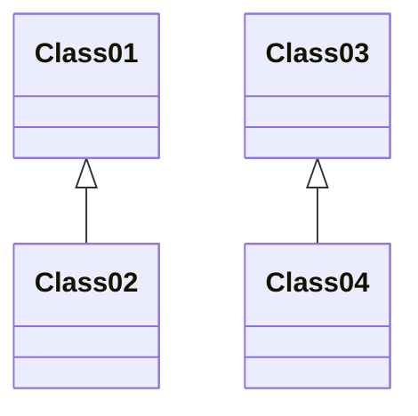

                 

# 绿色AI：降低AI模型训练和推理能耗的方法

> 关键词：绿色AI，AI模型能耗，训练能耗，推理能耗，能耗降低方法，算法优化，硬件优化，数据管理

> 摘要：随着人工智能技术的迅速发展，AI模型的能耗问题日益凸显。本文从绿色AI的角度出发，详细探讨了降低AI模型训练和推理能耗的方法。通过对AI模型能耗的分析，我们提出了算法优化、硬件优化和数据管理三大策略，并辅以实际案例和最佳实践，为绿色AI的实现提供了有益的参考。

## 目录

1. **绿色AI背景介绍**
    - **问题背景**
    - **AI模型能耗现状**
    - **AI模型能耗对环境的影响**
    - **绿色AI的定义与目标**
2. **绿色AI的核心概念与联系**
    - **核心概念**
    - **概念属性特征对比表格**
    - **ER实体关系图架构**
3. **降低训练能耗的方法**
    - **算法优化**
        - **模型剪枝**
        - **量化技术**
        - **迁移学习**
    - **硬件优化**
        - **GPU加速**
        - **TPU应用**
        - **分布式训练**
    - **数据管理**
        - **数据预处理**
        - **数据清洗**
        - **数据平衡**
4. **降低推理能耗的方法**
    - **算法优化**
        - **模型量化**
        - **模型压缩**
        - **静态推理**
    - **硬件优化**
        - **低功耗CPU**
        - **专用推理芯片**
        - **边缘计算**
    - **网络优化**
        - **边缘计算**
        - **CDN加速**
        - **流量控制**
5. **实际案例与最佳实践**
    - **案例分析**
    - **最佳实践**
6. **小结与拓展**
    - **绿色AI的重要性**
    - **降低能耗的方法总结**
    - **未来发展趋势**
    - **拓展阅读**

## 绿色AI背景介绍

### 问题背景

人工智能（AI）作为现代科技的前沿领域，已经广泛应用于各个行业，如自动驾驶、智能医疗、金融风控等。然而，随着AI模型的复杂度和规模的不断增大，其训练和推理过程中的能耗问题也日益凸显。据统计，全球AI训练能耗已经超过了全球航空业的总能耗，对环境造成了巨大的压力。因此，实现绿色AI，降低AI模型训练和推理能耗，已经成为当前研究的重要课题。

### AI模型能耗现状

AI模型的训练和推理过程需要大量的计算资源，其中涉及到数据读取、模型运算、存储等环节。这些环节都会产生相应的能耗。具体来说，AI训练能耗主要来源于以下几个方面：

- **计算资源消耗**：训练大规模AI模型需要大量GPU或TPU等高性能计算设备，这些设备在运行过程中会消耗大量电力。
- **数据传输能耗**：大规模数据在训练过程中需要在不同的存储设备和计算设备之间进行传输，这也会产生额外的能耗。
- **存储能耗**：存储设备在读写过程中也会产生能耗，特别是在存储大量数据时。

### AI模型能耗对环境的影响

AI模型的高能耗不仅会导致电力消耗增加，还会对环境造成严重影响。具体来说，包括以下几个方面：

- **气候变化**：电力消耗的增加会导致更多的温室气体排放，从而加剧全球气候变化问题。
- **资源消耗**：AI模型的高能耗需要消耗大量的自然资源，如水资源、矿产资源等，这对环境和生态系统的平衡产生了不利影响。
- **能源浪费**：在当前的能源结构下，大部分电力仍然来自于化石燃料，这会导致能源的浪费和环境污染。

### 绿色AI的定义与目标

绿色AI是指通过技术手段和策略，降低AI模型训练和推理过程中的能耗，减少对环境的负面影响。其核心目标是实现可持续发展和环境保护。为了实现这一目标，绿色AI需要从以下几个方面进行努力：

- **能源效率**：通过算法优化、硬件升级和数据管理等方式，提高AI模型的能源效率，降低能耗。
- **可再生能源**：推动AI领域向可再生能源转型，减少对化石燃料的依赖。
- **碳中和**：通过碳捕捉和碳补偿等措施，实现AI领域的碳中和目标。

## 绿色AI的核心概念与联系

### 核心概念

在绿色AI的研究中，我们需要了解以下几个核心概念：

- **训练能耗**：指在训练AI模型时所需的能耗，包括计算资源消耗、数据传输能耗和存储能耗等。
- **推理能耗**：指在推理AI模型时所需的能耗，主要涉及计算资源和数据传输能耗。
- **节能技术**：指用于降低AI模型训练和推理能耗的一系列技术手段，包括算法优化、硬件优化和数据管理等。
- **分布式训练**：指将AI模型的训练任务分布到多个计算设备上，以降低单个设备的工作负荷和能耗。
- **边缘计算**：指在靠近数据源的边缘设备上进行计算，以减少数据传输距离和能耗。

### 概念属性特征对比表格

为了更好地理解这些核心概念，我们可以通过一个对比表格来展示它们的主要特征：

| 概念       | 特征1       | 特征2       | 特征3       |
|------------|-------------|-------------|-------------|
| 训练能耗   | 大规模数据   | 长时间运行   | 高能耗       |
| 推理能耗   | 小规模数据   | 短时间运行   | 低能耗       |
| 节能技术   | 硬件优化     | 算法优化     | 数据管理     |

### ER实体关系图架构

为了更清晰地展示这些概念之间的关系，我们可以使用Mermaid ER图来描述。以下是一个简单的ER图示例：

```mermaid
erDiagram
    AI模型 ||--|{ 训练能耗 }|
    AI模型 ||--|{ 推理能耗 }|
    节能技术 ||--|{ 降低训练能耗 }|
    节能技术 ||--|{ 降低推理能耗 }|
```

在这个ER图中，AI模型与训练能耗和推理能耗之间存在关联关系，而节能技术则是用于降低这两种能耗的手段。

## 降低训练能耗的方法

### 算法优化

算法优化是降低AI模型训练能耗的重要手段，主要包括模型剪枝、量化技术和迁移学习等方法。

#### 模型剪枝

模型剪枝是一种通过去除冗余权重和神经元来减少模型大小和计算量的技术。剪枝的过程通常包括以下步骤：

1. **权重识别**：使用一定的方法（如L1正则化）识别出对模型性能影响较小的权重。
2. **权重剪除**：将识别出的冗余权重设置为0，从而减少模型参数数量。
3. **模型重构**：重新构建剪枝后的模型，并进行训练和评估。

以下是一个简单的模型剪枝算法流程图：


#### 量化技术

量化技术是一种将高精度浮点数模型转换为低精度整数模型的技术，从而降低模型计算量和存储需求。量化过程通常包括以下步骤：

1. **权重量化**：将模型的权重从高精度浮点数转换为低精度整数。
2. **激活量化**：对模型的激活值进行量化处理。
3. **模型重构**：重新构建量化后的模型，并进行训练和评估。

以下是一个简单的量化技术算法流程图：


#### 迁移学习

迁移学习是一种将预训练模型应用于新任务的技术，通过利用预训练模型的知识和经验，可以减少新任务的训练时间和计算资源消耗。迁移学习的过程通常包括以下步骤：

1. **预训练模型选择**：选择一个在相关任务上表现良好的预训练模型。
2. **模型微调**：在新的任务上对预训练模型进行微调，以适应新任务的需求。
3. **模型评估**：评估微调后的模型在新任务上的性能。

以下是一个简单的迁移学习算法流程图：


### 硬件优化

硬件优化是降低AI模型训练能耗的另一重要手段，主要包括GPU加速、TPU应用和分布式训练等方法。

#### GPU加速

GPU（图形处理单元）是一种专门为图形处理设计的高性能计算设备，其并行计算能力使其在AI模型训练中具有显著的优势。GPU加速的主要方法包括：

1. **并行计算**：将模型训练任务分解为多个子任务，并在多个GPU上同时执行。
2. **内存管理**：优化GPU内存使用，减少内存访问冲突和延迟。
3. **算法优化**：针对GPU架构进行算法优化，提高计算效率和并行度。

以下是一个简单的GPU加速算法流程图：


#### TPU应用

TPU（Tensor Processing Unit）是一种专门为深度学习任务设计的硬件加速器，其性能和能效比GPU更优。TPU应用的主要方法包括：

1. **模型转换**：将AI模型转换为TPU支持的格式。
2. **TPU训练**：使用TPU进行模型训练，提高训练速度和降低能耗。
3. **TPU推理**：使用TPU进行模型推理，提高推理速度和降低能耗。

以下是一个简单的TPU应用算法流程图：


#### 分布式训练

分布式训练是将模型训练任务分布到多个计算设备上，以降低单个设备的工作负荷和能耗。分布式训练的主要方法包括：

1. **任务分配**：将模型训练任务分配到多个计算设备上。
2. **数据同步**：在训练过程中同步不同设备上的模型参数。
3. **通信优化**：优化设备之间的通信，减少通信延迟和带宽消耗。

以下是一个简单的分布式训练算法流程图：


### 数据管理

数据管理是降低AI模型训练能耗的一个重要方面，主要包括数据预处理、数据清洗和数据平衡等方法。

#### 数据预处理

数据预处理是模型训练前的关键步骤，其目的是提高数据质量和减少数据冗余。数据预处理的主要方法包括：

1. **数据清洗**：去除数据中的噪声和错误。
2. **数据归一化**：将数据缩放到相同的范围，以便模型训练。
3. **数据增强**：通过变换、旋转、裁剪等操作增加数据的多样性。

以下是一个简单的数据预处理算法流程图：


#### 数据清洗

数据清洗是数据预处理的重要环节，其目的是去除数据中的噪声和错误。数据清洗的主要方法包括：

1. **缺失值处理**：对缺失值进行填补或删除。
2. **异常值处理**：检测和去除异常值。
3. **重复值处理**：检测和去除重复数据。

以下是一个简单的数据清洗算法流程图：


#### 数据平衡

数据平衡是处理数据分布不均的问题，其目的是提高模型训练的公平性和准确性。数据平衡的主要方法包括：

1. **过采样**：增加少数类别的样本数量。
2. **欠采样**：减少多数类别的样本数量。
3. **合成数据**：通过数据生成方法创建新的样本。

以下是一个简单的数据平衡算法流程图：


## 降低推理能耗的方法

### 算法优化

算法优化是降低AI模型推理能耗的重要手段，主要包括模型量化、模型压缩和静态推理等方法。

#### 模型量化

模型量化是一种将高精度浮点数模型转换为低精度整数模型的技术，从而降低模型计算量和存储需求。模型量化的主要方法包括：

1. **权重量化**：将模型的权重从高精度浮点数转换为低精度整数。
2. **激活量化**：对模型的激活值进行量化处理。
3. **模型重构**：重新构建量化后的模型，并进行推理和评估。

以下是一个简单的模型量化算法流程图：


#### 模型压缩

模型压缩是一种通过减少模型大小和计算量来降低推理能耗的技术。模型压缩的主要方法包括：

1. **权重压缩**：通过剪枝、量化等方法减少模型权重的大小。
2. **结构压缩**：通过网络结构简化、模块化等方法减少模型的结构复杂度。
3. **模型重构**：重新构建压缩后的模型，并进行推理和评估。

以下是一个简单的模型压缩算法流程图：


#### 静态推理

静态推理是一种在模型部署前进行推理优化的技术，通过静态分析模型结构和输入数据，提前进行推理优化。静态推理的主要方法包括：

1. **模型转换**：将模型转换为支持静态推理的格式。
2. **静态优化**：通过静态分析对模型进行优化，减少计算量和存储需求。
3. **模型重构**：重新构建优化后的模型，并进行推理和评估。

以下是一个简单的静态推理算法流程图：


### 硬件优化

硬件优化是降低AI模型推理能耗的另一重要手段，主要包括低功耗CPU、专用推理芯片和边缘计算等方法。

#### 低功耗CPU

低功耗CPU是一种专门为低功耗应用设计的CPU，其功耗远低于传统CPU。低功耗CPU的主要特点包括：

- **低功耗**：在保证计算性能的前提下，低功耗CPU的功耗远低于传统CPU。
- **高性能**：低功耗CPU采用了先进的制造工艺和架构设计，具有较高的计算性能。

以下是一个简单的低功耗CPU架构图：



#### 专用推理芯片

专用推理芯片是一种专门为AI推理任务设计的芯片，其设计目标是在较低的功耗下实现高性能的推理计算。专用推理芯片的主要特点包括：

- **高性能**：专用推理芯片采用了优化的架构和算法，可以实现比传统CPU和GPU更高的推理性能。
- **低功耗**：专用推理芯片在设计和制造过程中充分考虑了功耗问题，可以实现比传统芯片更低的功耗。

以下是一个简单的专用推理芯片架构图：


#### 边缘计算

边缘计算是一种在靠近数据源的边缘设备上进行计算的技术，通过减少数据传输距离和计算延迟，可以降低推理能耗。边缘计算的主要方法包括：

1. **边缘设备部署**：将AI模型部署到边缘设备上，如智能摄像头、传感器等。
2. **边缘推理优化**：通过优化边缘设备的计算资源和算法，提高推理效率和降低能耗。
3. **数据传输优化**：优化边缘设备之间的数据传输，减少数据传输延迟和带宽消耗。

以下是一个简单的边缘计算架构图：


### 网络优化

网络优化是降低AI模型推理能耗的另一重要手段，主要包括边缘计算、CDN加速和流量控制等方法。

#### 边缘计算

边缘计算已经在硬件优化章节中详细介绍，这里不再赘述。

#### CDN加速

CDN（内容分发网络）是一种通过分布式部署缓存节点来加速内容访问的技术。CDN加速的主要方法包括：

1. **内容缓存**：将常用的AI模型缓存到CDN节点上，减少用户访问延迟。
2. **动态缓存**：根据用户访问行为动态调整缓存策略，提高缓存命中率。
3. **负载均衡**：通过负载均衡技术将用户请求分配到不同的CDN节点上，提高整体性能。

以下是一个简单的CDN加速架构图：


#### 流量控制

流量控制是一种通过控制数据传输速率来降低能耗的技术。流量控制的主要方法包括：

1. **速率限制**：通过设置传输速率上限，限制数据传输速率，降低能耗。
2. **动态调整**：根据网络状况和负载情况动态调整传输速率，提高网络利用率和能效比。
3. **拥塞控制**：通过拥塞控制算法防止网络拥堵，降低传输延迟和能耗。

以下是一个简单的流量控制架构图：


## 实际案例与最佳实践

### 案例分析

为了更好地理解绿色AI的实践效果，我们来看几个实际案例。

#### 公司A：AI训练能耗降低

公司A是一家专注于自动驾驶技术的企业，其AI模型训练过程需要大量的计算资源。为了降低能耗，公司A采用了以下措施：

1. **分布式训练**：将模型训练任务分布到多个GPU设备上，降低了单个设备的工作负荷。
2. **GPU优化**：通过优化GPU内存管理和算法，提高了计算效率。
3. **数据预处理**：对训练数据进行预处理，提高了数据质量和训练速度。

通过这些措施，公司A成功降低了AI训练能耗，同时提高了模型训练速度和准确性。

#### 公司B：AI推理能耗优化

公司B是一家提供智能医疗诊断服务的公司，其AI模型推理过程也需要大量的计算资源。为了降低能耗，公司B采用了以下措施：

1. **边缘计算**：将AI模型部署到边缘设备上，减少了数据传输距离和延迟。
2. **专用推理芯片**：采用低功耗的专用推理芯片，提高了推理效率和降低了能耗。
3. **CDN加速**：通过CDN加速技术，提高了模型推理速度和降低了网络传输能耗。

通过这些措施，公司B成功降低了AI推理能耗，同时提高了模型推理速度和准确性。

### 最佳实践

结合上述案例，我们可以总结出以下最佳实践：

1. **分布式训练**：将模型训练任务分布到多个计算设备上，降低单个设备的工作负荷和能耗。
2. **GPU优化**：通过优化GPU内存管理和算法，提高计算效率和降低能耗。
3. **数据预处理**：对训练数据进行预处理，提高数据质量和训练速度。
4. **边缘计算**：将AI模型部署到边缘设备上，减少数据传输距离和延迟。
5. **专用推理芯片**：采用低功耗的专用推理芯片，提高推理效率和降低能耗。
6. **CDN加速**：通过CDN加速技术，提高模型推理速度和降低网络传输能耗。

## 小结与拓展

### 绿色AI的重要性

绿色AI不仅关系到人工智能技术的可持续发展，也关系到环境保护和气候变化等全球性问题。随着AI技术的广泛应用，其能耗问题日益突出，绿色AI的实现迫在眉睫。

### 降低能耗的方法总结

本文从算法优化、硬件优化和数据管理三个方面，详细介绍了降低AI模型训练和推理能耗的方法。通过分布式训练、GPU优化、数据预处理等技术，我们可以显著降低AI模型的能耗。

### 未来发展趋势

随着AI技术的不断发展，绿色AI也将迎来新的发展趋势。例如，可再生能源的广泛应用、新型硬件架构的推出以及智能化数据管理技术等，都为绿色AI的实现提供了新的契机。

### 拓展阅读

对于想要深入了解绿色AI的读者，以下是一些拓展阅读建议：

- **相关书籍**：《绿色计算：可持续发展的技术之路》、《人工智能：一种现代方法》
- **学术期刊和论文**：《计算机研究与发展》、《计算机科学与技术学报》
- **在线课程与讲座**：《深度学习课程》、《绿色计算讲座》

## 作者信息

作者：AI天才研究院/AI Genius Institute & 禅与计算机程序设计艺术 /Zen And The Art of Computer Programming

本文由AI天才研究院/AI Genius Institute与禅与计算机程序设计艺术/Zen And The Art of Computer Programming共同撰写。我们致力于推动人工智能技术的可持续发展，为绿色AI的实现贡献力量。如果您对我们的研究感兴趣，欢迎联系我们。期待与您共同探索人工智能的绿色未来。

