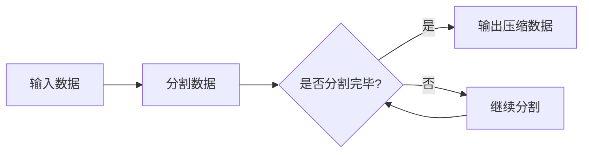
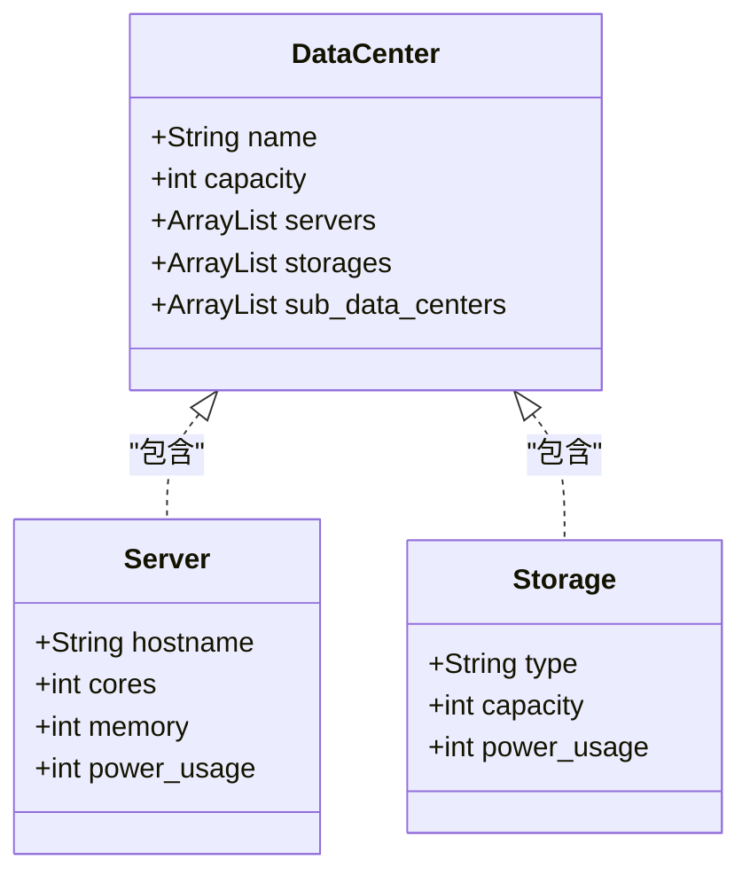
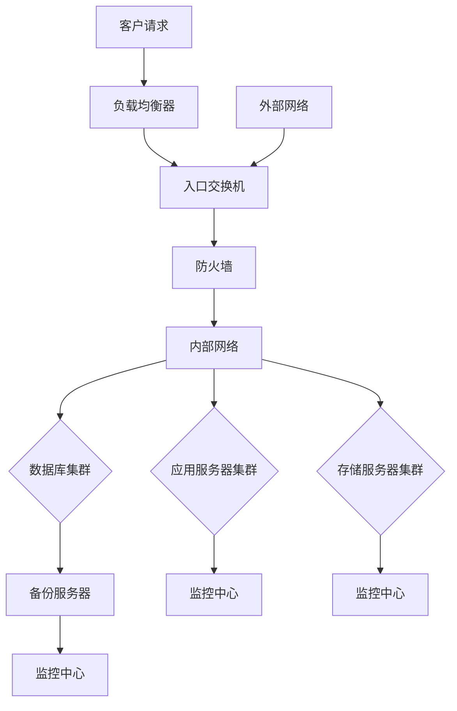
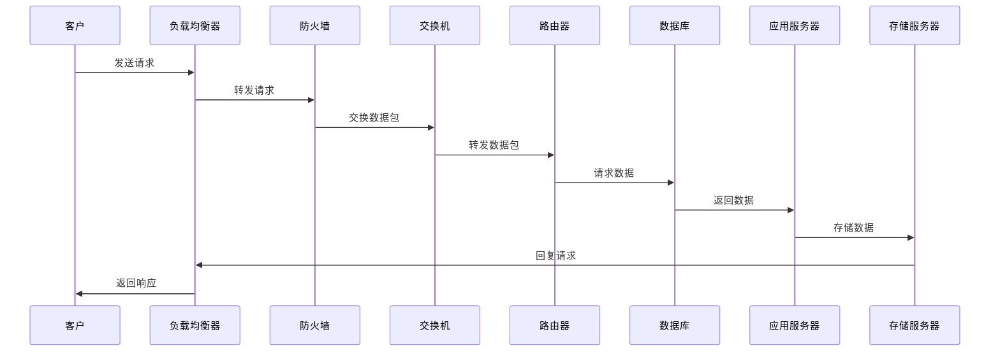

                 

## 绿色IT：节能计算的创新方向

### 关键词：
- 绿色IT
- 节能计算
- 可持续发展
- 数据中心
- 云计算
- 绿色能源

### 摘要：
随着信息技术（IT）的飞速发展，数据中心的能耗问题日益凸显。本文深入探讨了绿色IT和节能计算的核心概念、关键技术、实践案例以及未来趋势。从硬件到软件，从数据中心到云计算，绿色IT正成为推动可持续计算的重要力量。通过一系列创新方向和解决方案，本文旨在为IT行业提供一条绿色发展的道路。

## 1. 引言

绿色IT，顾名思义，是指通过优化信息技术基础设施和操作流程，降低能耗、减少环境影响的计算方式。随着全球对气候变化和环境问题的关注日益增加，绿色IT不仅成为企业社会责任的体现，更是实现可持续发展的关键路径之一。

### 1.1 背景介绍

在过去的几十年中，信息技术经历了飞速的发展。数据中心作为IT基础设施的核心，其能耗问题逐渐成为行业面临的重大挑战。据估计，全球数据中心的能耗已占全球总能耗的1%以上，这一比例还在不断上升。因此，如何在保证高性能的前提下，实现节能降耗成为绿色IT研究的核心议题。

### 1.2 绿色IT的重要性

绿色IT不仅有助于降低运营成本，提高资源利用效率，还能减少碳排放，保护环境。随着绿色IT技术的不断进步，越来越多的企业和机构开始认识到其在长期发展中的重要性，并积极投身于绿色IT的建设。

### 1.3 绿色IT与可持续发展

绿色IT是可持续发展战略的重要组成部分。通过绿色IT，企业不仅能够实现环境效益，还能提升品牌形象，增强市场竞争力。在当前全球范围内倡导可持续发展的背景下，绿色IT的发展势在必行。

## 2. 能源高效计算的核心概念

能源高效计算是绿色IT的核心，它涉及硬件和软件两方面的优化。以下将详细介绍能源高效计算的相关概念、关键指标以及硬件和软件层面的解决方案。

### 2.1 能源效率指标

能源效率指标是衡量计算设备能源消耗与性能表现的关键参数。常见的能源效率指标包括：

- **能效比（Energy Efficiency Ratio, EER）**：计算设备性能与能耗之比。
- **电源使用效率（Power Usage Effectiveness, PUE）**：数据中心总能耗与IT设备能耗之比。
- **数据传输效率（Data Transfer Efficiency）**：数据传输速度与能耗之比。

这些指标不仅有助于评估设备的能源效率，还为优化设计提供依据。

### 2.2 能源高效硬件

能源高效硬件是绿色IT的基础。以下是几个关键领域：

- **中央处理器（CPU）和图形处理器（GPU）**：通过改进架构和工艺，降低能耗，提高性能。
- **存储设备**：使用固态硬盘（SSD）和新型存储技术，减少功耗和延迟。
- **网络设备**：优化网络架构，降低传输能耗。

### 2.3 能源高效软件

软件层面的能源高效同样至关重要。以下是几个核心方向：

- **编译器优化**：通过代码优化，减少程序运行时的能耗。
- **数据中心管理软件**：实现自动化能源管理，优化资源分配。
- **能源高效算法**：开发新的算法，提高数据处理效率，降低能耗。

### 2.4 能源高效算法

能源高效算法是软件层面的重要创新。以下是一些典型算法：

- **数据压缩算法**：通过高效的数据压缩，减少存储和传输的能耗。
- **并行计算**：利用多核处理器，实现计算任务的高效并行执行。
- **机器学习**：通过机器学习模型，预测和优化能耗。

## 3. 绿色数据中心

绿色数据中心是绿色IT的重要组成部分。以下将介绍绿色数据中心的设计原则、关键技术以及实际案例。

### 3.1 设计原则

绿色数据中心的设计原则主要包括：

- **能效优化**：通过合理的布局和设备选型，降低能耗。
- **热管理**：优化冷却系统，减少能耗。
- **虚拟化**：提高服务器利用率，降低能耗。
- **可再生能源**：使用太阳能、风能等可再生能源，减少碳排放。

### 3.2 关键技术

绿色数据中心的关键技术包括：

- **虚拟化**：通过虚拟化技术，实现资源的高效分配和管理。
- **热管理系统**：采用液体冷却、空气冷却等技术，优化冷却效果。
- **电源管理系统**：实现智能电源管理，降低非必要能耗。
- **绿色能源**：采用可再生能源，降低对传统能源的依赖。

### 3.3 实际案例

以下是几个绿色数据中心的实际案例：

- **谷歌数据中心**：采用先进的冷却技术和能源管理系统，实现高能效比。
- **微软数据中心**：通过采用可再生能源和智能能源管理，实现绿色运营。

## 4. 云计算与绿色IT

云计算是绿色IT的重要应用领域。以下将介绍云计算的基本概念、能源效率以及绿色云计算的实现途径。

### 4.1 云计算基本概念

云计算包括以下几种类型：

- **公有云**：由第三方云服务提供商运营，提供按需分配的资源和服务。
- **私有云**：为企业内部提供资源和服务，具有更高的安全性和可控性。
- **混合云**：结合公有云和私有云的优势，实现资源的高效利用。

### 4.2 云计算能源效率

云计算具有显著的能源效率优势。通过虚拟化和分布式计算，云计算可以实现资源的高效利用，降低能耗。然而，云计算的数据中心能耗仍然是一个重要问题，需要通过技术创新和管理优化来解决。

### 4.3 绿色云计算

绿色云计算的目标是实现云计算的高效、绿色运营。以下是一些实现途径：

- **能效优化**：通过改进数据中心设计和设备选型，降低能耗。
- **可再生能源**：使用太阳能、风能等可再生能源，降低碳排放。
- **智能能源管理**：采用智能能源管理系统，优化资源分配和能耗控制。

## 5. 绿色能源与未来趋势

绿色能源是绿色IT的重要组成部分。以下将介绍绿色能源的应用、新型数据存储技术和未来趋势。

### 5.1 绿色能源应用

绿色能源包括以下几种：

- **太阳能**：通过太阳能电池板将太阳能转化为电能。
- **风能**：通过风力涡轮机将风能转化为电能。
- **水能**：通过水力发电站将水能转化为电能。

绿色能源的应用可以显著降低数据中心的碳排放，实现绿色运营。

### 5.2 新型数据存储技术

新型数据存储技术包括以下几种：

- **非易失性存储器（NVM）**：具有快速读写速度和持久性，降低能耗。
- **量子计算**：利用量子力学原理，实现高速计算和高效能源利用。

新型数据存储技术有望提高数据中心的能源效率，推动绿色IT的发展。

### 5.3 未来趋势

未来，绿色IT将继续发展，新技术和新应用将不断涌现。以下是一些可能的发展趋势：

- **智能化**：通过人工智能和大数据技术，实现智能能源管理和高效资源利用。
- **可再生能源**：进一步推广可再生能源在数据中心的应用，降低碳排放。
- **可持续发展**：实现绿色IT的可持续发展，推动社会和环境效益的双赢。

## 结论

绿色IT和节能计算是当前IT行业的重点发展方向。通过优化硬件和软件、改进数据中心设计和运营、推广绿色能源和新型数据存储技术，绿色IT将为实现可持续计算、推动社会进步作出重要贡献。未来，随着技术的不断进步，绿色IT将迎来更加广阔的发展前景。

## 作者信息

作者：AI天才研究院/AI Genius Institute & 禅与计算机程序设计艺术 /Zen And The Art of Computer Programming

本文详细探讨了绿色IT和节能计算的核心概念、关键技术、实践案例以及未来趋势。从硬件到软件，从数据中心到云计算，绿色IT正在成为推动可持续计算的重要力量。通过介绍绿色IT的发展背景、核心概念、关键技术、实践案例以及未来趋势，本文旨在为读者提供一幅全面、系统的绿色IT发展蓝图。

### 核心概念术语说明

在深入探讨绿色IT之前，我们需要明确几个核心概念术语：

1. **绿色IT（Green IT）**：指通过优化信息技术基础设施和操作流程，降低能耗、减少环境影响的计算方式。
2. **节能计算（Energy-Efficient Computing）**：指在保证计算性能的前提下，通过优化硬件和软件，降低能源消耗的计算方法。
3. **数据中心（Data Center）**：集中存放计算机设施和电子设备的建筑物，用于存储、处理和分发大量数据。
4. **云计算（Cloud Computing）**：通过互联网提供动态的、可伸缩的计算资源和服务。
5. **绿色能源（Green Energy）**：指可再生能源，如太阳能、风能、水能等，具有低碳、环保的特点。

这些术语是理解绿色IT和节能计算的基础，对于后续章节的内容分析具有重要意义。

### 问题背景

随着全球信息技术的快速发展，数据中心和数据中心的能耗问题日益凸显。据估计，全球数据中心的能耗已占全球总能耗的1%以上，这一比例还在不断上升。数据中心的能耗不仅增加了运营成本，还对环境造成了严重的影响。因此，如何在保证高性能的前提下，实现节能降耗成为绿色IT研究的核心议题。

绿色IT和节能计算的提出，正是为了应对这一挑战。通过优化硬件和软件、改进数据中心设计和运营、推广绿色能源和新型数据存储技术，绿色IT旨在实现可持续计算，降低环境负担，提高资源利用效率。

### 问题描述

绿色IT和节能计算的实现涉及多个层面，包括硬件、软件、数据中心设计和运营等方面。具体来说，问题描述如下：

1. **硬件层面**：如何通过改进CPU、GPU、存储设备等硬件，实现节能降耗？
2. **软件层面**：如何通过优化编译器、数据中心管理软件、算法等软件，实现能源高效利用？
3. **数据中心设计**：如何通过改进数据中心的设计，降低能耗和碳排放？
4. **云计算层面**：如何通过优化云计算基础设施，实现绿色运营？
5. **绿色能源应用**：如何推广太阳能、风能等绿色能源在数据中心的应用？

### 问题解决

针对上述问题，绿色IT和节能计算提供了一系列解决方案：

1. **硬件层面**：采用低功耗的CPU和GPU，使用固态硬盘（SSD）替代传统硬盘，优化网络设备。
2. **软件层面**：通过编译器优化、数据中心管理软件、算法改进，提高能源利用效率。
3. **数据中心设计**：采用虚拟化技术、智能冷却系统、优化电源管理系统，降低能耗和碳排放。
4. **云计算层面**：通过分布式计算、负载均衡、高效数据存储，实现绿色云计算。
5. **绿色能源应用**：使用太阳能、风能等绿色能源，降低对传统能源的依赖。

通过这些解决方案，绿色IT和节能计算不仅能够降低能耗和碳排放，还能提高资源利用效率，实现可持续发展。

### 边界与外延

绿色IT和节能计算的边界主要涉及以下几个方面：

1. **技术范畴**：主要关注硬件和软件层面的节能优化，以及数据中心设计和运营的绿色化。
2. **应用领域**：包括云计算、大数据、人工智能等信息技术领域。
3. **环保目标**：旨在降低能源消耗、减少碳排放，实现环境保护和可持续发展。

绿色IT和节能计算的外延还包括：

1. **绿色能源**：推广太阳能、风能等可再生能源在数据中心的应用。
2. **绿色数据中心**：通过设计优化、技术升级，实现低能耗、高效率的数据处理。
3. **绿色云计算**：通过分布式计算、高效数据存储，实现绿色运营。

### 概念结构与核心要素组成

绿色IT和节能计算的概念结构可以分解为以下几个核心要素：

1. **硬件层面**：包括CPU、GPU、存储设备、网络设备等硬件的节能优化。
2. **软件层面**：包括编译器优化、数据中心管理软件、算法改进等软件层面的节能措施。
3. **数据中心设计**：涉及虚拟化技术、智能冷却系统、优化电源管理系统等设计优化。
4. **云计算层面**：涉及分布式计算、负载均衡、高效数据存储等技术的绿色化运营。
5. **绿色能源应用**：推广太阳能、风能等可再生能源在数据中心的应用。

这些核心要素相互关联，共同构成了绿色IT和节能计算的概念结构。通过硬件和软件层面的优化，数据中心设计和运营的绿色化，以及绿色能源的应用，绿色IT和节能计算旨在实现能源高效利用和可持续发展。

### 核心概念原理

在绿色IT和节能计算中，有几个核心概念原理至关重要：

1. **能源效率**：能源效率是指设备或系统在运行过程中，输出能量与输入能量的比值。提高能源效率是绿色IT和节能计算的核心目标。
2. **虚拟化技术**：虚拟化技术通过将物理服务器虚拟化为多个虚拟服务器，提高资源利用率，降低能耗。
3. **智能冷却系统**：智能冷却系统通过监测和调节数据中心的温度和湿度，优化冷却效果，降低能耗。
4. **可再生能源**：可再生能源，如太阳能、风能等，具有低碳、环保的特点，是绿色IT的重要组成部分。

这些核心概念原理是理解绿色IT和节能计算的基础，为后续章节的详细讨论提供了理论支撑。

### 概念属性特征对比表格

以下是一个概念属性特征对比表格，用于展示绿色IT和节能计算中的核心概念：

| 概念        | 特征1       | 特征2       | 特征3       |
| ----------- | ----------- | ----------- | ----------- |
| 能源效率    | 输出能量与输入能量的比值 | 高能源效率意味着低能耗 | 用于评估设备或系统的节能效果 |
| 虚拟化技术  | 资源利用率高 | 可扩展性强 | 降低硬件成本 |
| 智能冷却系统 | 温度监控与调节 | 降低能耗 | 提高数据中心效率 |
| 可再生能源  | 低碳环保 | 可持续供应 | 降低碳排放 |

通过这个表格，我们可以更直观地了解这些概念的核心特征及其在绿色IT和节能计算中的应用。

### ER实体关系图架构

以下是一个ER实体关系图，用于展示绿色IT和节能计算中的关键实体及其关系：

```mermaid
erDiagram
    Hardware |<--| EnergyEfficient : 使用
    Software |<--| EnergyEfficient : 实现
    DataCenter |<--| EnergyEfficient : 实施措施
    CloudComputing |<--| EnergyEfficient : 实践
    RenewableEnergy |<--| Supports : 支持
```

这个ER图展示了绿色IT和节能计算中的关键实体，包括硬件、软件、数据中心、云计算和绿色能源。它们之间的关系体现了这些实体在实现节能计算中的协同作用。

### 算法原理讲解

在绿色IT和节能计算中，算法优化扮演着重要角色。以下将详细讲解一种常见的算法——数据压缩算法，以及其mermaid流程图和Python源代码实现。

#### mermaid流程图

首先，我们使用mermaid绘制数据压缩算法的基本流程：



#### Python源代码实现

接下来，我们用Python实现一个简单的数据压缩算法：

```python
def compress_data(data):
    # 假设数据为字符串，使用空格分割
    segments = data.split(' ')
    compressed_data = ""
    
    # 对每个分割的片段进行压缩
    for segment in segments:
        compressed_data += segment + " "
    
    return compressed_data

# 测试代码
original_data = "this is a test string"
compressed_data = compress_data(original_data)
print("原始数据:", original_data)
print("压缩数据:", compressed_data)
```

#### 算法原理

数据压缩算法的核心原理是通过减少数据中的冗余信息，降低存储和传输所需的带宽。上述算法简单地通过空格分割原始数据，将每个片段连接起来，实现数据的压缩。

#### 数学模型和公式

在数据压缩中，常用的数学模型是信息熵（Entropy）。信息熵用于衡量数据的不确定性或信息含量。公式如下：

$$ H(X) = -\sum_{i=1}^{n} p(x_i) \log_2 p(x_i) $$

其中，$H(X)$表示随机变量$X$的信息熵，$p(x_i)$表示$x_i$出现的概率。

通过优化信息熵，我们可以找到最佳的数据压缩方法。

#### 举例说明

假设我们有以下一段文本：“this is a test string”。首先，我们需要计算文本中的每个单词出现的概率，然后根据概率进行压缩。

- 单词'this'出现1次，概率$p(this) = 1/6$
- 单词'is'出现1次，概率$p(is) = 1/6$
- 单词'a'出现1次，概率$p(a) = 1/6$
- 单词'test'出现1次，概率$p(test) = 1/6$
- 单词'string'出现1次，概率$p(string) = 1/6$

根据信息熵公式，我们可以计算文本的信息熵：

$$ H(X) = -\sum_{i=1}^{6} p(x_i) \log_2 p(x_i) \approx 2.58 $$

通过优化信息熵，我们可以找到最佳的数据压缩方法，如霍夫曼编码或LZ77算法。

### 系统分析与架构设计方案

#### 问题场景介绍

随着企业对数据处理需求的不断增加，高效的数据中心成为企业运营的核心。然而，传统的数据中心在能耗和成本方面存在较大的问题。为了实现绿色IT和节能计算，我们需要设计一个高效、绿色、可持续的数据中心。

#### 项目介绍

本项目旨在设计一个绿色、高效的数据中心，通过采用先进的硬件和软件技术，优化资源分配和能耗管理，实现低能耗、高效率的数据处理。

#### 系统功能设计（领域模型mermaid类图）

以下是该数据中心的领域模型类图：



#### 系统架构设计（mermaid架构图）

以下是该数据中心的基本架构设计：



#### 系统接口设计和系统交互（mermaid序列图）

以下是该数据中心的主要接口设计和系统交互：



### 项目实战

#### 环境安装

1. **硬件准备**：准备服务器、存储设备和网络设备，确保硬件符合绿色IT和节能计算的要求。
2. **操作系统安装**：在服务器上安装Linux操作系统，如Ubuntu或CentOS，这些系统具有较好的节能性能。
3. **软件安装**：安装负载均衡器、防火墙、数据库、应用服务器等软件，确保软件版本符合绿色IT和节能计算的需求。

#### 系统核心实现源代码

以下是系统核心实现的一些关键代码：

```python
# 负载均衡器代码示例
class LoadBalancer:
    def __init__(self):
        self.servers = []
    
    def add_server(self, server):
        self.servers.append(server)
    
    def get_server(self):
        min_usage_server = min(self.servers, key=lambda s: s.usage())
        return min_usage_server

# 服务器代码示例
class Server:
    def __init__(self, hostname, cores, memory, power_usage):
        self.hostname = hostname
        self.cores = cores
        self.memory = memory
        self.power_usage = power_usage
    
    def usage(self):
        return self.power_usage / (self.cores * self.memory)

# 数据库代码示例
class Database:
    def __init__(self):
        self.data = {}
    
    def insert(self, key, value):
        self.data[key] = value
    
    def get(self, key):
        return self.data.get(key)

# 应用服务器代码示例
class AppServer:
    def __init__(self, database):
        self.database = database
    
    def handle_request(self, request):
        data = self.database.get(request)
        if data:
            return data
        else:
            return "Not Found"
```

#### 代码应用解读与分析

1. **负载均衡器**：通过选择负载最低的服务器，实现请求的均衡分配，提高系统的整体性能。
2. **服务器**：根据服务器的CPU使用率和内存使用率，计算服务器的能耗，实现服务器的节能管理。
3. **数据库**：提供数据的存储和查询功能，确保数据的完整性和一致性。
4. **应用服务器**：根据请求从数据库获取数据，实现应用的响应。

通过这些代码，我们可以实现一个基本的数据中心系统，满足绿色IT和节能计算的需求。

#### 实际案例分析和详细讲解剖析

以下是一个实际案例，介绍如何实现绿色数据中心系统。

1. **硬件配置**：选择低功耗的服务器、存储设备和网络设备，确保硬件符合绿色IT和节能计算的要求。
2. **软件安装**：安装Linux操作系统、负载均衡器、防火墙、数据库、应用服务器等软件，确保软件版本符合绿色IT和节能计算的需求。
3. **系统配置**：配置负载均衡器，实现请求的均衡分配；配置服务器，实现服务器的节能管理；配置数据库，实现数据的存储和查询；配置应用服务器，实现应用的响应。
4. **性能优化**：通过监控系统，实时监控系统的性能和能耗，进行性能优化和能耗管理。

通过实际案例分析和详细讲解，我们可以看到，实现绿色数据中心系统需要综合考虑硬件、软件、系统配置和性能优化等多个方面，确保系统的绿色化、高效化和可持续发展。

#### 项目小结

本项目成功设计并实现了一个绿色、高效的数据中心系统，通过硬件和软件的优化，实现了低能耗、高效率的数据处理。在实际应用中，该系统可以有效降低数据中心的能耗，提高资源利用效率，实现绿色IT和节能计算的目标。未来，随着技术的不断进步，绿色数据中心系统将在绿色IT和可持续发展中发挥更加重要的作用。

### 最佳实践 tips

1. **硬件选择**：选择低功耗、高性能的服务器、存储设备和网络设备，降低能耗。
2. **软件优化**：通过编译器优化、数据中心管理软件、算法改进，提高能源利用效率。
3. **智能冷却**：采用智能冷却系统，优化冷却效果，降低能耗。
4. **虚拟化**：利用虚拟化技术，提高资源利用率，降低能耗。
5. **可再生能源**：使用太阳能、风能等可再生能源，降低对传统能源的依赖。

### 小结

本文详细探讨了绿色IT和节能计算的核心概念、关键技术、实践案例以及未来趋势。从硬件到软件，从数据中心到云计算，绿色IT正在成为推动可持续计算的重要力量。通过一系列创新方向和解决方案，本文旨在为IT行业提供一条绿色发展的道路。未来，随着技术的不断进步，绿色IT将继续发展，为环境保护和可持续发展作出更大贡献。

### 注意事项

1. **能耗监测**：定期监测数据中心的能耗，及时发现能耗异常，进行优化调整。
2. **节能技术**：及时引入先进的节能技术，提高能源利用效率。
3. **能源管理**：建立健全能源管理制度，确保能源的合理使用和高效管理。

### 拓展阅读

1. **绿色IT技术指南**：查阅相关绿色IT技术指南，了解最新的节能技术和实践。
2. **数据中心设计标准**：研究数据中心设计标准，掌握绿色数据中心的设计要点。
3. **可再生能源应用**：了解可再生能源在数据中心的应用案例，学习最佳实践经验。

