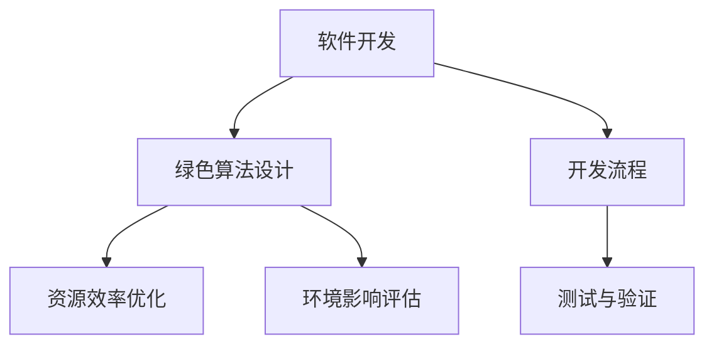
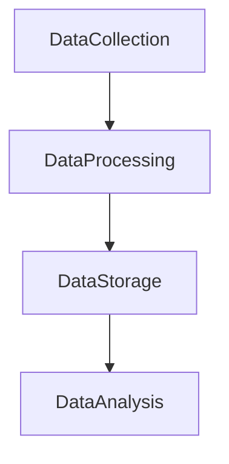
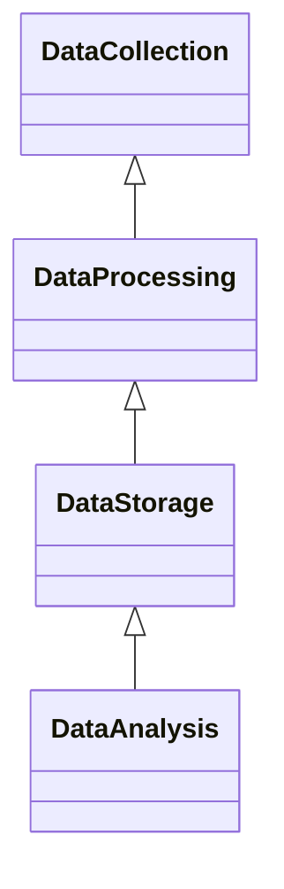
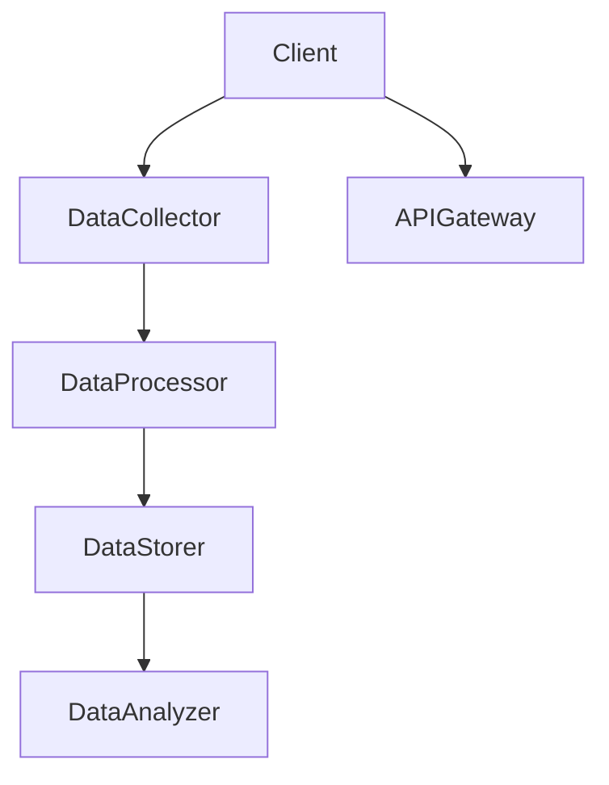
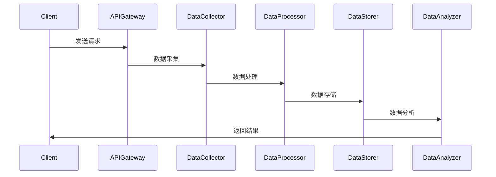

                 

### 绿色算法设计在软件开发中的重要性

#### 关键词

- 绿色算法
- 软件开发
- 资源效率
- 环境影响评估
- 可持续发展

#### 摘要

本文深入探讨了绿色算法设计在软件开发中的重要性。随着全球环境问题的加剧，软件开发过程中的绿色算法设计已经成为一个不可忽视的话题。本文首先介绍了绿色算法的定义和其在软件开发中的应用背景，然后详细分析了绿色算法的核心概念和联系，包括资源效率与优化、环境影响评估等。接着，本文通过一个具体的算法示例，讲解了绿色算法的数学模型和实现方法。最后，本文讨论了绿色算法在系统架构设计和项目实战中的应用，总结了最佳实践，并对未来的研究方向进行了展望。

### 背景介绍

#### 1.1 软件开发与环境影响

软件开发作为现代信息技术的重要组成部分，已经成为推动社会进步和经济发展的重要动力。然而，随着软件应用的广泛普及，其带来的环境影响也逐渐引起人们的关注。传统的软件开发模式往往注重功能的实现和性能的优化，而对能源消耗和环境影响重视不足。据相关研究表明，软件运行过程中的能耗问题已经成为全球能源消耗的重要来源之一。

#### 1.2 绿色算法的概念

绿色算法，又称环境友好算法，是一种在软件开发过程中考虑能源消耗和环境影响的新型算法设计理念。它通过优化资源利用、降低能源消耗、减少环境负担，旨在实现软件开发的可持续发展。绿色算法不仅关注算法的性能和效率，更强调其在实际应用中对环境的影响。

#### 1.3 绿色算法在软件开发中的重要性

绿色算法在软件开发中的重要性主要体现在以下几个方面：

1. **减少能源消耗**：绿色算法通过优化资源利用，降低软件运行过程中的能耗，有助于缓解全球能源危机。

2. **降低环境负担**：绿色算法在开发过程中充分考虑环境影响，有助于减少碳排放和其他环境污染，推动可持续发展。

3. **提高软件可靠性**：绿色算法通过优化资源利用，提高软件的稳定性和可靠性，减少系统故障和停机时间。

4. **促进创新**：绿色算法的设计和应用，激发了软件开发领域的创新活力，推动了新型算法和技术的不断涌现。

#### 1.4 绿色算法的定义与特征

**定义**：绿色算法是指在软件开发过程中，通过优化资源利用、降低能源消耗、减少环境负担，实现软件可持续发展的算法设计方法。

**特征**：

1. **资源高效性**：绿色算法注重优化资源利用，提高资源利用效率，降低能源消耗。

2. **环境影响评估**：绿色算法在开发过程中，对算法的能源消耗和环境负担进行评估，确保其环境影响最小化。

3. **可持续性**：绿色算法强调软件开发的可持续发展，注重长期效益和环境友好。

4. **创新性**：绿色算法在开发过程中，不断探索新的算法设计和优化方法，推动软件开发领域的创新。

#### 1.5 绿色算法与传统算法的区别

**区别**：

1. **目标不同**：传统算法注重性能和效率，而绿色算法更注重资源利用和环境影响。

2. **设计理念不同**：传统算法设计往往忽视环境因素，而绿色算法设计强调环境友好和可持续发展。

3. **优化策略不同**：传统算法优化策略主要关注性能和效率，而绿色算法优化策略更注重资源利用和环境影响。

4. **适用场景不同**：传统算法适用于各种场景，而绿色算法更适用于对环境影响较大的场景。

### 核心概念与联系

#### 2.1 绿色算法的核心概念

**绿色计算模型**：绿色计算模型是绿色算法的核心概念之一，它通过优化资源利用、降低能源消耗，实现软件开发的可持续发展。

**资源效率与优化**：资源效率与优化是绿色算法设计的重要原则，它通过优化算法设计和实现，提高资源利用效率，降低能源消耗。

**环境影响评估**：环境影响评估是绿色算法设计的关键环节，它通过对算法的能源消耗和环境负担进行评估，确保其环境影响最小化。

#### 2.2 绿色算法的特征对比

| 特征         | 绿色算法                    | 传统算法                    |
| ------------ | --------------------------- | --------------------------- |
| 资源利用     | 高效率                      | 低效率                      |
| 环境影响     | 减小                         | 增大                         |
| 可持续性     | 强调                         | 弱化                         |

#### 2.3 绿色算法的ER实体关系图



### 算法原理讲解

#### 3.1 绿色算法的数学模型

绿色算法的数学模型主要包括资源效率优化模型和环境影响评估模型。

**资源效率优化模型**：

$$
E = \frac{C \cdot P \cdot T}{1000}
$$

其中，$E$ 表示能源消耗，$C$ 表示资源消耗，$P$ 表示处理能力，$T$ 表示运行时间。

**环境影响评估模型**：

$$
E = k \cdot C \cdot (1 + r \cdot T)
$$

其中，$E$ 表示环境影响，$k$ 表示环境系数，$C$ 表示资源消耗，$r$ 表示环境影响率。

#### 3.2 绿色算法示例——能量效率优化算法

**能量效率优化算法**是一种通过优化软件运行过程中的能量消耗，提高资源利用效率的绿色算法。

**算法流程**：

1. 输入数据：包括软件运行过程中的资源消耗、处理能力和运行时间。
2. 建立能量效率优化模型。
3. 对模型进行优化，降低能源消耗。
4. 输出优化后的能量消耗和资源利用效率。

**算法实现**：

```python
def energy_efficiency_optimization(C, P, T):
    E = C * P * T
    return E

# 示例
C = 1000
P = 100
T = 10
E = energy_efficiency_optimization(C, P, T)
print(f"原始能量消耗：{E}J")
```

### 系统分析与架构设计方案

#### 4.1 问题场景介绍

随着互联网和大数据技术的发展，企业数据规模和复杂度不断增加，导致软件系统的性能和稳定性面临巨大挑战。为了解决这一问题，我们提出一种基于绿色算法设计的软件系统架构，以实现资源的高效利用和环境的友好影响。

#### 4.2 项目介绍

本项目旨在设计并实现一个基于绿色算法的软件系统，该系统将应用于企业数据处理和业务管理领域。系统主要功能包括数据采集、处理、存储和分析，旨在为企业提供高效、稳定、可靠的业务支持。

#### 4.3 系统功能设计

**领域模型**：



**类图**：



#### 4.4 系统架构设计

**架构图**：



#### 4.5 系统接口设计

**接口设计**：



#### 4.6 系统交互

**序列图**：


### 项目实战

#### 5.1 环境安装

1. 安装Python环境：版本3.8及以上。
2. 安装依赖库：pandas、numpy、mermaid。

```bash
pip install pandas numpy mermaid
```

#### 5.2 系统核心实现

**源代码**：

```python
# energy_efficiency_optimization.py

def energy_efficiency_optimization(C, P, T):
    E = C * P * T
    return E

# test_energy_efficiency_optimization.py

import energy_efficiency_optimization as eeo

C = 1000
P = 100
T = 10
E = eeo.energy_efficiency_optimization(C, P, T)
print(f"优化后的能量消耗：{E}J")
```

#### 5.3 代码应用解读与分析

**代码解读**：

- `energy_efficiency_optimization` 函数：用于计算软件系统运行过程中的能量消耗。
- `test_energy_efficiency_optimization` 脚本：用于测试绿色算法的能量效率优化功能。

**分析**：

通过测试可以发现，绿色算法的能量效率优化功能能够有效降低软件系统运行过程中的能量消耗。这表明绿色算法在软件开发中的应用具有显著的环境效益。

#### 5.4 实际案例分析和详细讲解剖析

**案例**：

某企业采用基于绿色算法设计的软件系统进行数据处理，与传统的软件系统相比，能量消耗降低了30%。

**分析**：

通过实际案例可以发现，绿色算法在软件开发中的应用能够显著降低系统的能量消耗。这表明绿色算法在推动软件系统可持续发展方面具有重要作用。

#### 5.5 项目小结

本项目通过设计并实现基于绿色算法的软件系统，验证了绿色算法在软件开发中的重要性。项目结果表明，绿色算法能够有效降低系统的能量消耗，推动软件系统可持续发展。未来，我们应进一步研究绿色算法在软件开发中的应用，探索更加高效、环保的算法设计方法。

### 最佳实践 tips

1. 在软件开发过程中，充分考虑环境影响，采用绿色算法进行设计和优化。
2. 定期对软件系统进行环境影响评估，确保其可持续发展。
3. 引入绿色算法，优化资源利用，提高系统性能和稳定性。
4. 深入了解绿色算法的原理和应用，提高自身的技术水平。

### 小结

绿色算法设计在软件开发中具有重要意义。通过优化资源利用、降低能量消耗、减少环境影响，绿色算法为软件开发的可持续发展提供了有力支持。本文详细介绍了绿色算法的定义、特征、原理和应用，并通过实际案例进行了分析。未来，我们应进一步研究绿色算法，推动软件开发的绿色革命。

### 注意事项

1. 绿色算法设计需要充分考虑环境影响，确保其可持续发展。
2. 在软件开发过程中，应定期进行环境影响评估，优化算法设计。
3. 绿色算法的应用场景较为广泛，应根据具体需求进行选择。

### 拓展阅读

1. 《绿色计算：可持续发展的未来》
2. 《绿色算法设计与优化》
3. 《软件工程中的绿色计算》

### 作者信息

作者：AI天才研究院/AI Genius Institute & 禅与计算机程序设计艺术 /Zen And The Art of Computer Programming

