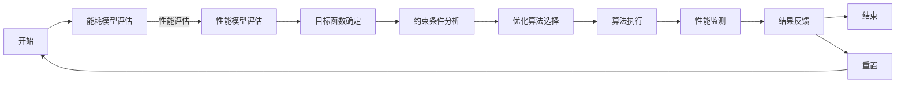

                 

### 引言

随着信息技术的飞速发展，计算机系统已经成为现代社会的核心基础设施。然而，这一进步也带来了显著的问题：计算机系统在运行过程中消耗了大量的能源。据统计，全球数据中心和服务器每年的能源消耗已超过数百万吨石油，对环境造成了严重影响。此外，能源消耗不仅增加了企业的运营成本，还限制了计算资源的可用性。在这种背景下，绿色算法的概念应运而生。

绿色算法，顾名思义，是指一类旨在降低计算机系统和软件在运行过程中的能源消耗，提高能源利用效率的算法。这一概念起源于对计算机能耗问题的关注，并在近年来得到了广泛的关注和研究。通过引入绿色算法，不仅能够减少能源消耗，降低成本，还能为环境保护和可持续发展做出贡献。

本书旨在探讨如何在软件层面实现节能优化，为开发者和系统管理员提供绿色算法的实现和应用指南。随着全球气候变化和能源消耗问题的日益严重，软件开发者和企业越来越关注如何通过技术手段降低能源消耗，实现可持续发展。本书将详细介绍绿色算法的概念、原理以及具体应用，帮助读者理解和掌握软件层面的节能优化技术。

绿色算法的研究不仅仅是一个技术问题，更是一个社会问题。它关乎企业的可持续发展，关乎我们的地球家园。因此，本书不仅适合计算机科学和技术领域的读者，也适合对节能和可持续发展感兴趣的企业家和研究人员。通过本书的阅读，读者将能够了解到绿色算法的基本原理、实现方法和应用实践，从而为推动绿色计算和可持续发展贡献自己的力量。

### 第一部分：绿色算法基础

#### 第1章：问题背景与核心概念

##### 1.1 问题的提出

计算机系统的能源消耗问题一直是现代信息技术领域的重要研究课题。随着数据中心和云计算的普及，计算机系统的能源消耗呈现出逐年增加的趋势。据统计，全球数据中心的能耗已占到全球总能耗的1%以上，且这一比例还在不断上升。这一现象引发了广泛的环境和经济效益关注。首先，能源消耗的增加导致了二氧化碳等温室气体的排放，加剧了全球气候变化。其次，高昂的能源成本不仅增加了企业的运营负担，也限制了计算资源的可用性。为了应对这一挑战，绿色算法的概念应运而生。

绿色算法，简单来说，就是通过优化软件和硬件资源的使用，减少计算机系统的能源消耗。这一概念起源于对计算机能耗问题的关注，并在近年来得到了广泛的关注和研究。随着全球气候变化和能源消耗问题的日益严重，绿色算法的研究和应用越来越受到重视。其目的是在不牺牲系统性能的前提下，最大限度地提高能源利用效率，降低能源成本，实现可持续发展。

在软件层面，绿色算法主要通过以下几种方式实现节能优化：

1. **任务调度优化**：通过优化任务的调度策略，减少CPU和GPU的空闲时间，提高计算资源利用率。
2. **电源管理**：通过智能电源管理技术，动态调整设备的功耗，实现设备的节能运行。
3. **数据压缩与传输优化**：通过优化数据压缩和传输方式，减少数据传输过程中的能耗。
4. **代码优化**：通过改进代码编写方式，降低程序运行时的能耗。

在硬件层面，绿色算法则涉及到：

1. **硬件设计优化**：通过改进硬件设计，降低硬件功耗。
2. **散热管理**：通过优化散热系统，降低设备运行时的温度，减少能耗。
3. **硬件冗余设计**：通过硬件冗余设计，提高系统的可靠性，降低因故障导致的能源浪费。

##### 1.2 绿色算法的核心概念

绿色算法的核心概念可以概括为以下几个方面：

1. **节能目标**：绿色算法的最终目标是减少计算机系统和软件的能源消耗。这包括硬件层面的功耗降低和软件层面的资源利用率提高。
2. **能源利用效率**：能源利用效率是指能源消耗与实际工作量的比值。提高能源利用效率是绿色算法的重要目标，可以通过优化算法和调度策略实现。
3. **性能优化**：性能优化是绿色算法的重要组成部分。通过优化算法和系统设计，提高系统性能，确保在节能的同时不降低计算效率。
4. **可持续发展**：绿色算法不仅关注当前的能源消耗，还关注长期的可持续发展。通过引入绿色算法，企业可以降低能源成本，提高资源利用率，为环境保护和可持续发展做出贡献。

##### 1.3 绿色算法的必要性

计算机系统的能源消耗问题日益严重，主要原因有以下几点：

1. **计算密集型应用增加**：随着大数据、人工智能和云计算等计算密集型应用的兴起，计算机系统的负载不断增加，导致能源消耗急剧上升。
2. **数据中心规模扩大**：全球数据中心的数量和规模持续扩大，数据中心能耗已成为全球能源消耗的一个重要组成部分。
3. **硬件性能提升**：硬件性能的不断提升使得计算机系统可以在更短的时间内完成更多的计算任务，但同时也导致了更高的能源消耗。
4. **电源价格波动**：全球电力价格的波动使得企业面临更大的能源成本压力，通过降低能源消耗可以显著降低运营成本。

绿色算法的必要性体现在以下几个方面：

1. **降低能源消耗**：通过优化计算机系统和软件的运行效率，绿色算法可以显著降低能源消耗，减少温室气体排放，为环境保护做出贡献。
2. **提高经济效益**：降低能源消耗可以降低企业的运营成本，提高经济效益。尤其是在能源价格波动较大的背景下，绿色算法的节能效果更加显著。
3. **保障计算资源**：通过优化资源利用，绿色算法可以提高计算资源的可用性，确保在能源有限的情况下，系统能够高效运行。
4. **支持可持续发展**：绿色算法不仅关注当前的能源消耗，还关注长期的可持续发展。通过引入绿色算法，企业可以降低能源成本，提高资源利用率，为环境保护和可持续发展做出贡献。

##### 1.4 绿色算法的发展趋势

绿色算法作为计算机科学和能源管理领域的一个新兴研究方向，近年来得到了广泛关注。其发展趋势主要体现在以下几个方面：

1. **算法优化**：随着计算能力的提升和算法理论的不断发展，绿色算法在任务调度、电源管理和数据压缩等方面将持续得到优化。新的算法和优化策略将不断涌现，进一步提升能源利用效率。
2. **跨领域研究**：绿色算法不仅涉及计算机科学，还涉及到能源管理、环境科学等领域。跨领域的研究将有助于从更广的视角出发，探索更有效的节能方法。
3. **硬件与软件协同**：绿色算法的优化不仅需要在软件层面进行，还需要在硬件层面进行支持。未来的研究将更加注重硬件与软件的协同优化，通过硬件设计和软件算法的有机结合，实现更高效的节能效果。
4. **实际应用场景扩展**：随着绿色算法技术的成熟，其应用场景将不断扩展。除了数据中心和云计算领域，绿色算法还将应用于智能家居、自动驾驶、物联网等更多领域。
5. **政策与法规推动**：政府和企业对能源消耗和环境保护的重视将推动绿色算法的发展。相关政策和法规的出台将鼓励企业和个人采用绿色算法，实现能源消耗的减少和环境保护的目标。

总的来说，绿色算法作为解决计算机系统和软件能耗问题的重要手段，具有广阔的发展前景和应用价值。通过不断的研究和优化，绿色算法将在推动信息技术发展和实现可持续发展方面发挥越来越重要的作用。

#### 第2章：绿色算法的基本原理

##### 2.1 绿色算法的数学模型

绿色算法的数学模型是理解绿色算法核心原理的基础。数学模型通过定量描述算法的运行过程，帮助开发者更好地理解和应用这些算法。绿色算法的数学模型主要包括能耗模型、性能模型和优化模型，以下是对这些模型的基本介绍和分析。

**1. 能耗模型**

能耗模型用于描述计算机系统在执行任务时的能量消耗。该模型通常包含以下几个关键参数：

- **任务负载**：任务负载是指系统在执行某一任务时的处理量。它可以通过任务的执行时间、任务所需处理的数据量等参数来表示。
- **功耗**：功耗是指系统在执行任务时消耗的能量。它通常与CPU负载、GPU负载、内存负载等硬件资源的使用情况相关。
- **能耗效率**：能耗效率是指单位能耗所能完成的工作量。它反映了系统在能耗控制下的效率。

数学表达式可以表示为：

$$
E = f(L, P, \eta)
$$

其中，\(E\) 表示总能耗，\(L\) 表示任务负载，\(P\) 表示功耗，\(\eta\) 表示能耗效率。

**2. 性能模型**

性能模型用于描述计算机系统的性能表现。在绿色算法中，性能模型通常关注系统的响应时间、吞吐量和延迟等指标。

- **响应时间**：响应时间是指系统从接收任务到完成任务所需的时间。
- **吞吐量**：吞吐量是指系统在单位时间内能够处理的数据量或任务数。
- **延迟**：延迟是指任务从提交到完成所需的时间。

数学表达式可以表示为：

$$
P = g(R, T, D)
$$

其中，\(P\) 表示性能，\(R\) 表示响应时间，\(T\) 表示吞吐量，\(D\) 表示延迟。

**3. 优化模型**

优化模型用于描述如何通过调整系统参数来最小化能耗或最大化性能。在绿色算法中，优化模型通常使用目标函数和约束条件来描述优化目标。

- **目标函数**：目标函数通常用于描述优化目标，如最小化能耗、最大化性能等。
- **约束条件**：约束条件用于描述系统在优化过程中需要满足的限制条件，如硬件资源限制、任务执行时间等。

数学表达式可以表示为：

$$
\min_{x} f(x) \quad \text{subject to} \quad g(x) \leq 0
$$

其中，\(x\) 表示系统参数，\(f(x)\) 表示目标函数，\(g(x)\) 表示约束条件。

**4. 模型分析**

通过数学模型，我们可以分析绿色算法在不同场景下的性能和能耗表现。以下是对几个典型场景的分析：

- **低负载场景**：在低负载场景下，系统的功耗较低，但响应时间和延迟可能会增加。此时，优化目标可能是最大化吞吐量或最小化延迟。
- **高负载场景**：在高负载场景下，系统的功耗和响应时间都可能较高。此时，优化目标可能是最小化能耗或最大化性能。

通过对数学模型的分析，我们可以更深入地理解绿色算法的原理和应用。这有助于开发者在实际应用中根据具体场景和需求选择合适的优化策略，实现能耗和性能的最优化。

##### 2.2 绿色算法的流程图

为了更好地理解和应用绿色算法，流程图是一种非常直观的表达方式。流程图能够清晰地展示算法的运行步骤和关键决策点，使开发者能够更有效地实现和优化绿色算法。下面我们将使用Mermaid语言绘制绿色算法的流程图，并对各个步骤进行详细解读。

**1. 流程图绘制**



**2. 流程图解读**

- **步骤1：能耗模型评估（B）**
  在算法开始之前，首先对系统的能耗模型进行评估。这一步骤的目的是了解系统在执行任务时的能耗分布，为后续优化提供依据。

- **步骤2：性能模型评估（C）**
  在完成能耗模型评估后，对系统的性能模型进行评估。这一步骤的目的是了解系统在执行任务时的性能表现，包括响应时间、吞吐量和延迟等。

- **步骤3：目标函数确定（D）**
  根据能耗模型和性能模型评估的结果，确定优化目标。优化目标可以是能耗最小化、性能最大化或其他组合目标。

- **步骤4：约束条件分析（E）**
  分析系统在优化过程中需要满足的约束条件，如硬件资源限制、任务执行时间等。这些约束条件将影响优化策略的选择。

- **步骤5：优化算法选择（F）**
  根据目标函数和约束条件，选择合适的优化算法。常见的优化算法包括遗传算法、粒子群优化算法、模拟退火算法等。

- **步骤6：算法执行（G）**
  执行选定的优化算法，对系统进行参数调整，以实现优化目标。这一步骤是绿色算法的核心部分。

- **步骤7：性能监测（H）**
  在算法执行过程中，持续监测系统的性能表现。这一步骤的目的是确保优化过程中不会牺牲系统的性能。

- **步骤8：结果反馈（I）**
  根据性能监测的结果，对优化效果进行评估。如果优化效果达到预期，则算法执行成功；否则，需要调整优化策略。

- **步骤9：结束（J）**
  如果优化效果达到预期，则算法执行结束。否则，可以重新选择优化策略，并重复上述步骤。

- **步骤10：重置（K）**
  在每次优化完成后，系统可以重置，为下一次优化做好准备。

通过以上流程图的绘制和解读，我们可以清晰地看到绿色算法的运行步骤和关键决策点。流程图不仅有助于开发者理解和应用绿色算法，还可以作为开发和优化过程中的参考指南。

##### 2.3 绿色算法的关键技术

绿色算法的实现依赖于一系列关键技术的支持，这些技术涵盖了任务调度、电源管理、数据压缩等多个方面。以下将详细介绍这些关键技术，并提供实际应用案例。

**1. 任务调度**

任务调度是绿色算法中的一个核心组成部分，通过合理分配计算资源，可以显著降低系统的能耗。任务调度技术主要包括：

- **负载均衡**：通过平衡不同任务之间的计算资源使用，避免出现某些资源过度使用而其他资源闲置的情况。
- **动态调度**：根据系统当前的负载情况动态调整任务的执行顺序，以最大化资源利用率和降低能耗。

**案例**：在一个分布式计算系统中，通过动态调度技术，可以根据节点的实时负载情况调整任务的执行位置，从而降低整体能耗。例如，当一个节点负载较高时，可以将部分任务转移到负载较低的节点上执行。

**2. 电源管理**

电源管理技术通过动态调整设备的功耗，实现节能目标。常见的电源管理技术包括：

- **睡眠模式**：在系统闲置时，将部分硬件设备进入睡眠状态，降低功耗。
- **动态电源调整**：根据硬件设备的实际工作状态，动态调整其功耗。

**案例**：在笔记本电脑中，通过智能电源管理技术，可以根据用户的使用情况动态调整CPU和GPU的功耗，从而在保证性能的前提下降低能耗。

**3. 数据压缩与传输优化**

数据压缩与传输优化技术通过减少数据传输过程中的能耗，实现对系统整体能耗的优化。具体包括：

- **数据压缩算法**：通过数据压缩算法，减少需要传输的数据量，从而降低传输过程中的能耗。
- **传输优化策略**：通过优化数据传输路径和传输方式，减少数据传输过程中的延迟和能耗。

**案例**：在网络传输中，采用高效的Huffman编码算法对数据进行压缩，可以显著降低数据传输的带宽需求，从而减少传输过程中的能耗。

**4. 算法优化**

算法优化是绿色算法实现中的关键步骤，通过优化算法可以提高系统的整体性能和能源利用效率。算法优化主要包括：

- **算法选择**：根据任务的特点选择合适的算法，如遗传算法、粒子群优化算法等。
- **参数调整**：通过调整算法的参数，优化算法的性能和能耗表现。

**案例**：在优化一个负载均衡算法时，可以通过调整遗传算法的交叉和变异概率，优化算法的收敛速度和能源消耗。

通过以上关键技术的介绍，我们可以看到绿色算法的实现是一个多方面、系统化的过程。这些关键技术不仅能够单独发挥作用，还可以通过协同工作，实现更高效的能耗优化。实际应用中，根据具体场景和需求，合理选择和组合这些关键技术，是实现绿色算法目标的重要手段。

### 第3章：绿色算法的实现与优化

#### 3.1 绿色算法的实现方法

实现绿色算法的关键在于如何在软件层面优化计算机系统的能耗和性能。以下将详细介绍绿色算法的实现步骤，以及在实际应用中需要注意的技巧和问题。

**1. 实现步骤**

**（1）需求分析**
首先，需要明确绿色算法的目标和需求。这包括确定节能目标、优化性能指标和约束条件。例如，在数据中心优化中，可能的目标包括降低能耗、提高任务执行速度和保证数据可靠性。

**（2）算法选择**
根据需求分析的结果，选择适合的绿色算法。常用的绿色算法包括遗传算法、粒子群优化算法、模拟退火算法等。选择算法时，需要考虑算法的性能、复杂度和适用场景。

**（3）实现算法**
在确定算法后，编写具体的算法实现代码。实现过程中，需要关注算法的效率和可扩展性。例如，在实现遗传算法时，可以采用并行计算技术，提高算法的运行速度。

**（4）性能评估**
实现算法后，需要对算法进行性能评估。这包括测试算法在不同负载和约束条件下的性能，如能耗、响应时间、吞吐量等。性能评估可以帮助确定算法的优化效果。

**（5）迭代优化**
根据性能评估的结果，对算法进行迭代优化。这包括调整算法参数、改进算法结构等。通过迭代优化，可以不断提高算法的性能和能耗效率。

**（6）系统集成**
将优化后的绿色算法集成到现有的计算机系统中。在系统集成过程中，需要确保算法与现有系统的兼容性，并优化系统配置，以提高整体性能和能耗效率。

**2. 实现技巧**

**（1）模块化设计**
在实现绿色算法时，采用模块化设计可以提高代码的可维护性和可扩展性。将算法的各个部分（如编码、解码、交叉、变异等）划分为独立的模块，可以方便后续的优化和扩展。

**（2）并行计算**
对于计算密集型的绿色算法，可以采用并行计算技术，提高算法的运行速度。例如，在实现遗传算法时，可以并行执行交叉和变异操作，提高算法的效率。

**（3）动态调整**
在实际应用中，系统的负载和约束条件可能会发生变化。因此，绿色算法需要具备动态调整能力，以适应不同场景的需求。例如，在数据中心优化中，可以根据节点的实时负载情况，动态调整任务调度策略。

**（4）性能监测**
实现绿色算法时，需要集成性能监测模块，实时监测算法的性能表现。这可以帮助发现潜在的问题，并进行及时的调整和优化。

**3. 实现问题**

**（1）算法选择困难**
选择适合的绿色算法是一个复杂的过程，需要考虑多个因素，如算法的性能、复杂度和适用场景。对于开发者来说，选择合适的算法可能需要大量的实验和验证。

**（2）代码维护难度**
绿色算法的实现通常涉及复杂的算法和代码结构，维护难度较高。这要求开发者具备较高的编程技能和经验，以确保代码的可读性和可维护性。

**（3）系统集成问题**
在将绿色算法集成到现有系统中时，可能会遇到兼容性和配置问题。需要确保算法与现有系统的无缝集成，并优化系统配置，以提高整体性能和能耗效率。

**（4）性能评估挑战**
性能评估是绿色算法实现的重要环节，但也是一个具有挑战性的任务。需要设计合理的测试场景和评价指标，以全面评估算法的性能和能耗表现。

通过以上实现方法和技巧的介绍，开发者可以更好地理解和应用绿色算法，实现计算机系统的能耗优化和性能提升。

#### 3.2 绿色算法的性能优化

绿色算法的性能优化是一个多维度的问题，涉及算法设计、代码实现、系统配置等多个方面。以下将详细探讨如何通过优化策略来提高绿色算法的性能，并讨论在实际应用中可能遇到的挑战。

**1. 优化策略**

**（1）算法设计优化**

- **多目标优化**：绿色算法往往需要同时考虑能耗和性能等多个目标。采用多目标优化策略，可以平衡不同目标之间的冲突，实现整体性能的最优化。例如，可以使用遗传算法的pareto前端策略，生成一组非支配解，从中选择最佳方案。

- **动态调整参数**：许多绿色算法的参数（如遗传算法中的交叉率、变异率等）对性能有显著影响。通过动态调整这些参数，可以更好地适应不同场景的需求。例如，可以使用基于历史数据和实时监测的动态调整策略，根据当前负载和系统状态自动调整参数。

- **混合算法**：将不同算法的优点结合起来，形成混合算法，可以提高绿色算法的性能。例如，结合遗传算法和粒子群优化算法，可以发挥两种算法的优势，实现更高效的优化。

**（2）代码实现优化**

- **并行计算**：对于计算密集型的绿色算法，采用并行计算技术可以显著提高性能。例如，在实现遗传算法时，可以并行执行交叉和变异操作，减少运行时间。

- **代码优化**：通过改进代码实现，可以减少算法的复杂度和执行时间。例如，优化循环结构、减少冗余计算和提升数据结构性能等。

- **缓存优化**：合理利用缓存可以减少内存访问时间，提高算法的执行效率。例如，在数据密集型任务中，可以使用局部缓存来存储常用数据，减少磁盘访问。

**（3）系统配置优化**

- **资源分配**：合理分配计算资源（如CPU、内存、网络带宽等）可以优化绿色算法的性能。例如，在多节点系统中，可以采用负载均衡技术，将任务分配到最适合执行的任务节点上。

- **系统监控**：通过实时监控系统状态，可以及时发现和处理性能瓶颈。例如，使用性能监控工具（如Prometheus、Grafana等），可以实时监测系统性能指标，并自动触发优化策略。

**2. 实际应用中的挑战**

**（1）负载变化**

在实际应用中，系统的负载是动态变化的。绿色算法需要能够适应不同负载场景，保持性能和能耗的优化。这要求算法具备良好的自适应能力，能够根据负载变化动态调整参数和策略。

**（2）资源限制**

资源限制（如CPU利用率、内存容量等）对绿色算法的性能有重要影响。在资源受限的环境中，需要优化算法的效率和资源利用率，以确保系统在满足性能要求的同时，不超出资源限制。

**（3）系统兼容性**

绿色算法需要与现有系统兼容，包括操作系统、硬件平台和软件架构等。在实际应用中，可能需要针对不同的系统环境进行适配和优化，以确保算法的稳定性和性能。

**（4）性能评估**

性能评估是优化绿色算法的重要环节，但也是一个具有挑战性的任务。需要设计合理的测试场景和评价指标，以全面评估算法的性能和能耗表现。同时，性能评估结果可能受到测试数据、测试工具和环境因素的影响，需要确保评估过程的客观性和准确性。

通过上述优化策略和应对挑战的方法，开发者可以有效地提高绿色算法的性能，实现能耗和性能的最优化。在实际应用中，需要结合具体场景和需求，不断优化和调整算法，以实现最佳效果。

#### 3.3 绿色算法的测试与评估

绿色算法的测试与评估是确保其性能和效果的重要环节。通过系统化的测试和评估，可以验证算法在不同场景下的性能表现，发现潜在的问题并进行优化。以下将详细讨论绿色算法的测试方法、评估标准和评估流程。

**1. 测试方法**

**（1）功能测试**

功能测试是验证绿色算法是否按预期执行的基本方法。测试过程包括以下几个方面：

- **单元测试**：对算法的各个模块进行独立测试，确保每个模块的功能正确。
- **集成测试**：将不同模块集成在一起进行测试，验证算法的整体性能和功能。
- **性能测试**：在特定负载下测试算法的性能，如响应时间、吞吐量和能耗等。

**（2）性能测试**

性能测试主要用于评估绿色算法在实际运行环境下的性能表现。测试过程包括以下几个方面：

- **基准测试**：使用标准化的测试工具和测试场景，评估算法在不同负载下的性能指标。
- **压力测试**：通过模拟高负载场景，测试算法的稳定性和性能。
- **负载测试**：在不同负载下测试算法的响应时间、吞吐量和能耗，评估其性能和能耗表现。

**（3）可靠性测试**

可靠性测试主要用于验证绿色算法的稳定性和可靠性。测试过程包括以下几个方面：

- **故障测试**：模拟硬件故障和系统异常，测试算法的容错能力和恢复能力。
- **稳定性测试**：在长时间运行中测试算法的稳定性和性能表现，确保其在长时间运行下保持优化效果。

**2. 评估标准**

绿色算法的评估标准主要包括以下几个方面：

- **能耗效率**：能耗效率是评估绿色算法的重要指标，表示单位能耗所能完成的工作量。通过比较不同算法在相同任务下的能耗效率，可以评估算法的节能效果。
- **性能指标**：包括响应时间、吞吐量和延迟等，评估算法在实际应用中的性能表现。
- **稳定性**：评估算法在长时间运行下的稳定性和可靠性，确保其在不同负载和异常情况下保持稳定。
- **扩展性**：评估算法的可扩展性和适应性，确保其能够适应不同的应用场景和需求。

**3. 评估流程**

绿色算法的评估流程包括以下几个步骤：

**（1）定义评估目标**

根据实际需求，明确绿色算法的评估目标，如能耗效率、性能指标、稳定性等。

**（2）设计测试场景**

设计符合评估目标的测试场景，包括不同的负载条件、硬件配置和环境因素。

**（3）实施测试**

在测试环境中实施测试，包括功能测试、性能测试和可靠性测试等。

**（4）数据收集**

收集测试过程中产生的数据，包括性能指标、能耗数据、异常情况等。

**（5）数据分析**

对收集到的数据进行分析，评估绿色算法的性能和效果，发现潜在的问题和优化机会。

**（6）报告生成**

根据分析结果，生成评估报告，总结算法的性能表现和优化建议。

通过系统化的测试与评估，开发者可以全面了解绿色算法的性能和效果，为优化算法提供依据。同时，测试与评估也是保证算法在实际应用中稳定性和可靠性的关键步骤。在实际应用中，需要根据具体场景和需求，不断优化和调整算法，以实现最佳效果。

### 第4章：操作系统层面的节能优化

操作系统在计算机系统的能源消耗中扮演着重要角色。通过优化操作系统层面的节能机制，可以显著降低系统的能耗，提高能源利用效率。以下将详细探讨操作系统节能机制、系统调度算法优化以及系统性能监测与调整策略。

#### 4.1 操作系统节能机制

操作系统节能机制主要包括睡眠模式、电源管理和任务调度等。以下是对这些机制的基本介绍。

**1. 睡眠模式**

睡眠模式（Sleep Mode）是一种在系统闲置时降低能耗的有效方法。在睡眠模式下，操作系统会暂停所有运行中的任务，并将系统状态保存在内存中，然后关闭大部分硬件设备，如硬盘、显示器等。这样，系统可以在需要恢复运行时迅速唤醒，而不需要重新启动。

- **优点**：睡眠模式可以在短时间内大幅度降低系统的功耗。
- **缺点**：由于系统状态保存在内存中，唤醒时间可能会较长，且在唤醒过程中需要重新加载系统状态。

**2. 电源管理**

电源管理（Power Management）是操作系统通过动态调整硬件设备的功耗来实现节能的功能。常见的电源管理策略包括：

- **动态电源调整**：根据硬件设备的当前工作状态，动态调整其功耗。例如，CPU和GPU可以根据负载情况调整时钟频率和电压。
- **设备休眠**：在系统闲置时，将不必要的硬件设备（如USB设备、无线网卡等）进入休眠状态，降低功耗。

- **优点**：电源管理可以显著降低系统的静态功耗。
- **缺点**：动态电源调整可能会引入额外的延迟，影响系统的响应速度。

**3. 任务调度**

任务调度（Task Scheduling）是操作系统通过合理分配计算资源来实现优化性能和能耗的关键机制。常见的任务调度算法包括：

- **基于优先级的调度**：根据任务的优先级进行调度，优先执行优先级较高的任务。
- **基于轮转的调度**：将CPU时间片分配给每个任务，轮流执行，直到所有任务完成。

- **优点**：合理的任务调度可以提高系统的资源利用率，降低能耗。
- **缺点**：任务调度算法的选择和参数调整对系统性能和能耗有重要影响。

#### 4.2 系统调度算法优化

系统调度算法的优化是操作系统层面节能优化的关键步骤。以下将介绍几种常见的调度算法及其优化策略。

**1. 负载均衡**

负载均衡（Load Balancing）是一种通过平衡不同任务之间的计算资源使用，降低系统整体能耗的调度算法。常见的负载均衡算法包括：

- **轮转调度**（Round-Robin Scheduling）：将CPU时间片轮流分配给每个任务，直到所有任务完成。
- **最小剩余时间优先**（Shortest Remaining Time First, SRTF）：根据任务剩余执行时间，优先调度剩余时间最短的作业。

- **优点**：负载均衡可以避免某几个任务长时间占用CPU，提高系统的资源利用率。
- **缺点**：轮转调度可能导致某些任务频繁被中断，影响性能。

**2. 动态优先级调度**

动态优先级调度（Dynamic Priority Scheduling）是一种根据任务的实际负载动态调整优先级的调度算法。常见的动态优先级调度算法包括：

- **响应比优先**（Least Responsive Ratio, LRR）：根据任务的响应比（任务等待时间与执行时间之比）进行调度。
- **动态优先级**（Dynamic Priority）：根据任务的负载和响应时间动态调整优先级。

- **优点**：动态优先级调度可以更好地平衡系统的性能和能耗，提高系统的整体效率。
- **缺点**：动态优先级调度算法的设计和实现较为复杂。

**3. 线程级调度**

线程级调度（Thread-Level Scheduling）是一种针对多线程任务的调度算法。常见的线程级调度算法包括：

- **基于线程的调度**（Thread-Based Scheduling）：将CPU时间片分配给线程，而不是进程。
- **线程优先级调度**（Thread Priority Scheduling）：根据线程的优先级进行调度。

- **优点**：线程级调度可以更好地利用多核处理器的计算资源，提高系统的并行处理能力。
- **缺点**：线程级调度可能引入线程竞争和死锁问题，需要额外的同步机制。

#### 4.3 系统性能监测与调整

系统性能监测与调整是确保操作系统在优化能耗的同时保持高性能的关键步骤。以下将介绍几种系统性能监测与调整策略。

**1. 性能监测**

性能监测（Performance Monitoring）是实时监测系统性能指标，如CPU利用率、内存使用率、网络带宽等。常见的性能监测工具包括：

- **操作系统内置工具**：如Windows的任务管理器、Linux的top命令等。
- **第三方工具**：如Grafana、Prometheus等。

- **优点**：性能监测可以帮助及时发现系统性能瓶颈，提供优化依据。
- **缺点**：性能监测可能会引入额外的系统开销。

**2. 性能调整**

性能调整（Performance Tuning）是根据性能监测结果对系统配置进行调整，以优化系统性能。常见的性能调整策略包括：

- **调整系统参数**：如CPU核心数、内存大小、文件系统缓存等。
- **优化应用程序**：通过优化应用程序的代码和算法，提高其运行效率。
- **负载均衡**：通过负载均衡策略，将任务分配到最适合执行的任务节点上。

- **优点**：性能调整可以显著提高系统性能，满足不同负载场景的需求。
- **缺点**：性能调整需要具备一定的技术知识和经验，且可能涉及复杂的系统配置。

通过上述系统调度算法的优化和性能监测与调整策略，操作系统可以在降低能耗的同时保持高性能，为绿色算法的实现提供可靠的技术支持。

#### 第5章：应用程序层面的节能优化

应用程序层面的节能优化是降低计算机系统总体能耗的重要手段。通过优化应用程序的运行方式和代码结构，可以显著降低能耗，提高系统的能源利用效率。以下将详细探讨应用程序层面的节能机制、算法优化与代码重构、系统集成与部署等方面的内容。

##### 5.1 应用程序节能机制

应用程序节能机制主要包括以下几个方面：

**1. 睡眠与休眠模式**

- **睡眠模式**：在应用程序长时间不使用时，可以将其进入睡眠模式，以降低能耗。睡眠模式会在内存中保存当前状态，使得应用程序可以快速恢复到之前的工作状态。
- **休眠模式**：休眠模式类似于计算机系统的睡眠模式，但在休眠期间，整个计算机系统会进入低功耗状态，所有运行中的程序都会被保存到硬盘上，以进一步降低能耗。

**2. 动态资源分配**

- **动态分配内存**：根据应用程序的实际需求动态分配内存，避免内存浪费。在空闲时，可以释放部分内存，以降低内存功耗。
- **动态调整处理器频率**：根据应用程序的负载动态调整处理器的频率和电压，以降低能耗。

**3. 数据压缩与缓存**

- **数据压缩**：通过数据压缩算法减少需要传输的数据量，降低传输过程中的能耗。
- **缓存机制**：通过缓存机制减少对磁盘的访问，降低磁盘的功耗。

**4. 能耗监控**

- **能耗监控**：在应用程序中集成能耗监控模块，实时监测能耗数据，以便进行进一步优化。

**5. 任务调度**

- **任务调度**：合理分配任务，避免任务长时间占用CPU或GPU等硬件资源，以降低整体能耗。

##### 5.2 算法优化与代码重构

算法优化与代码重构是应用程序层面节能优化的关键步骤。以下将详细介绍如何通过算法优化和代码重构来实现节能。

**1. 算法优化**

- **多线程与并行计算**：通过多线程和并行计算技术，提高应用程序的执行效率，减少CPU和GPU的闲置时间。
- **高效算法选择**：选择高效的算法，如动态规划、分治算法等，以减少计算复杂度和能耗。
- **启发式算法**：使用启发式算法，如遗传算法、粒子群算法等，进行优化搜索，以找到最佳解决方案。

**2. 代码重构**

- **代码优化**：通过优化代码结构，减少不必要的计算和内存访问，降低能耗。
- **代码并行化**：将可并行执行的代码段进行并行化处理，利用多核处理器的优势，提高执行效率。
- **减少内存访问**：通过减少内存访问次数和优化内存分配，降低内存功耗。

**3. 代码重构示例**

```python
# 原始代码
for i in range(len(data)):
    process(data[i])

# 重构后的代码
with concurrent.futures.ThreadPoolExecutor() as executor:
    executor.map(process, data)
```

通过上述重构，原始代码中的顺序执行被并行执行替代，从而提高了执行效率，降低了能耗。

##### 5.3 系统集成与部署

应用程序节能优化需要与整个系统进行集成与部署，以确保节能效果在全局范围内得到体现。以下将介绍如何进行系统集成与部署。

**1. 系统集成**

- **跨模块优化**：在系统集成过程中，对各个模块进行节能优化，确保整个系统在降低能耗的同时保持高性能。
- **资源调度**：通过智能调度策略，合理分配系统资源，最大化资源利用率，降低整体能耗。

**2. 部署策略**

- **分布式部署**：通过分布式部署，将任务分配到不同的服务器上执行，避免单点过载，降低能耗。
- **动态部署**：根据系统负载动态调整应用程序的部署位置和数量，以适应不同负载场景。

**3. 部署示例**

```shell
# 安装依赖库
pip install green-algorithm

# 配置服务器
sudo systemctl enable green-algorithm.service

# 启动服务
sudo systemctl start green-algorithm.service
```

通过上述部署示例，绿色算法被集成到系统中，并启动服务以实现能耗优化。

通过应用程序层面的节能优化，可以显著降低计算机系统的总体能耗，提高能源利用效率。在实际应用中，需要根据具体场景和需求，合理选择和组合节能机制、算法优化和代码重构方法，以实现最佳节能效果。

#### 第6章：数据库和存储系统的节能优化

数据库和存储系统在计算机系统中起着至关重要的作用，但同时也消耗了大量的能源。通过优化数据库和存储系统的设计、实现和应用，可以显著降低能耗，提高系统的能源利用效率。以下将详细探讨数据库节能优化、存储系统节能优化以及数据库与存储系统的协同优化。

##### 6.1 数据库节能优化

数据库节能优化主要涉及以下几个方面：

**1. 数据库架构优化**

- **分库分表**：通过将大规模数据库拆分成多个小规模的数据库或表，可以降低单个数据库的负载，提高查询效率，减少能耗。
- **数据分片**：将数据按特定的规则分片存储到不同的物理设备上，可以提高数据的访问速度，降低磁盘I/O能耗。

**2. 查询优化**

- **索引优化**：合理设计和使用索引，可以减少查询过程中磁盘I/O次数，降低能耗。
- **查询缓存**：使用查询缓存，将频繁查询的结果缓存起来，减少数据库查询次数，降低能耗。

**3. 事务管理优化**

- **批量处理**：通过批量处理事务，可以减少数据库的锁争用，提高并发处理能力，减少能耗。
- **日志优化**：优化事务日志记录方式，减少日志文件的大小，降低磁盘I/O能耗。

**4. 磁盘I/O优化**

- **磁盘阵列**：使用磁盘阵列技术，通过多个磁盘的组合提高读写速度，减少单个磁盘的负载，降低能耗。
- **磁盘缓存**：使用磁盘缓存技术，将热数据缓存到内存中，减少对磁盘的访问次数，降低能耗。

##### 6.2 存储系统节能优化

存储系统节能优化主要包括以下几个方面：

**1. 硬件选择**

- **使用固态硬盘**（SSD）：相比传统机械硬盘（HDD），固态硬盘具有更快的读写速度和更低的能耗，适合作为存储系统的主要设备。
- **选择节能型硬件**：选择具有低功耗特点的存储设备，如低功耗的SSD和节能型的网络存储设备。

**2. 数据布局优化**

- **数据压缩**：通过数据压缩技术，减少存储空间的需求，降低能耗。
- **数据去重**：通过数据去重技术，避免重复数据占用存储空间，降低能耗。

**3. 磁盘I/O优化**

- **I/O调度策略**：优化I/O调度策略，如使用电梯算法（Elevator Algorithm）或轮转调度（Round-Robin）策略，提高I/O处理效率，减少能耗。
- **写放策略**：使用写放（Write Back）策略，将写操作延迟到后续的周期进行，减少磁盘I/O次数，降低能耗。

**4. 热映射**

- **热映射技术**：通过热映射技术，监控存储系统的负载分布情况，根据负载情况动态调整磁盘的I/O策略，降低能耗。

##### 6.3 数据库与存储系统的协同优化

数据库与存储系统的协同优化是降低整体能耗的重要手段。以下将介绍几种协同优化方法：

**1. 数据一致性**

- **分布式一致性**：通过分布式一致性技术，如Paxos或Raft算法，确保数据库与存储系统之间的数据一致性，减少因数据不一致导致的额外查询和I/O操作，降低能耗。

**2. 磁盘I/O负载均衡**

- **负载均衡**：通过负载均衡技术，将I/O请求均衡分配到不同的存储设备上，避免某个存储设备过载，降低能耗。
- **缓存一致性**：通过缓存一致性机制，如MESI协议，确保缓存数据与存储设备的数据一致性，减少不必要的I/O操作，降低能耗。

**3. 数据归档与冷存储**

- **数据归档**：将不再频繁访问的数据进行归档，存储到低能耗的冷存储设备上，减少活跃存储设备的负载，降低整体能耗。
- **冷存储管理**：通过冷存储管理策略，定期清理不再使用的数据，减少存储空间占用，降低能耗。

**4. 系统监控与优化**

- **性能监控**：通过性能监控工具，实时监控数据库和存储系统的性能指标，如CPU利用率、内存使用率、I/O吞吐量等，及时发现性能瓶颈，进行优化。
- **动态调整**：根据性能监控结果，动态调整数据库和存储系统的配置，如调整缓存大小、I/O策略等，以实现最佳性能和能耗平衡。

通过数据库与存储系统的协同优化，可以显著降低整体能耗，提高系统的能源利用效率。在实际应用中，需要根据具体场景和需求，灵活应用各种优化策略，以实现最佳效果。

#### 第7章：云计算与大数据平台的节能优化

##### 7.1 云计算节能优化

云计算平台作为现代信息技术的重要组成部分，具有高效、灵活的特点，但也面临着能源消耗问题。通过优化云计算平台的资源配置和管理，可以显著降低能耗，提高能源利用效率。以下将详细探讨云计算节能优化的策略和方法。

**1. 资源调度优化**

资源调度优化是云计算节能优化的关键步骤。通过合理分配和调度计算资源，可以最大化资源利用率，降低能耗。以下是一些常见的资源调度优化策略：

- **动态资源分配**：根据应用的实时负载情况，动态调整虚拟机的资源配置。在低负载时减少虚拟机的资源分配，在高峰期增加资源分配。
- **负载均衡**：通过负载均衡技术，将任务分配到不同虚拟机上，避免单个虚拟机过载，提高资源利用率。
- **多租户资源隔离**：通过多租户资源隔离技术，确保不同租户的资源不会被相互干扰，提高资源利用率。

**2. 电源管理**

电源管理是降低云计算平台能耗的重要手段。以下是一些常见的电源管理策略：

- **虚拟机休眠**：在虚拟机闲置时，将其进入休眠状态，以减少能耗。例如，使用VMware的vSphere虚拟化平台，可以通过设置自动休眠策略，定期检查虚拟机的负载情况，并在负载较低时将其休眠。
- **动态电源调整**：根据虚拟机的实际负载情况，动态调整CPU和内存的功耗。例如，使用智能电源管理技术，可以在虚拟机负载较低时降低CPU的频率和电压，从而降低能耗。
- **电池备份**：在虚拟机集群中，使用电池备份技术，可以在电源故障时保持虚拟机的运行，减少因断电导致的能耗损失。

**3. 节能架构设计**

节能架构设计是云计算平台节能优化的基础。以下是一些常见的节能架构设计策略：

- **分布式架构**：采用分布式架构，可以将计算任务分配到不同的物理设备上，避免单点过载，提高资源利用率，降低能耗。
- **绿色数据中心**：设计绿色数据中心，采用高效冷却系统、节能设备等，降低数据中心的整体能耗。
- **分布式存储**：采用分布式存储技术，将数据存储到多个物理设备上，避免单个存储设备过载，提高资源利用率。

**4. 应用优化**

应用优化是降低云计算平台能耗的有效手段。以下是一些常见应用优化策略：

- **并行计算**：通过并行计算技术，将任务分解为多个子任务，同时执行，提高计算效率，降低能耗。
- **压缩技术**：使用数据压缩技术，减少数据传输和存储的能耗。例如，使用Hadoop分布式文件系统（HDFS）的压缩算法，可以在不牺牲性能的情况下减少数据存储和传输的能耗。
- **代码优化**：优化应用程序的代码，减少不必要的计算和内存访问，降低能耗。

**5. 监控与优化**

监控与优化是确保云计算平台持续节能的重要环节。以下是一些常见监控与优化策略：

- **性能监控**：通过性能监控工具，实时监测云计算平台的性能指标，如CPU利用率、内存使用率、网络带宽等，及时发现性能瓶颈，进行优化。
- **自动化优化**：通过自动化工具，根据性能监控结果自动调整资源配置和管理策略，实现持续优化。
- **反馈机制**：建立反馈机制，收集用户对云计算平台的反馈，结合性能监控数据，持续优化平台性能和节能效果。

通过上述云计算节能优化策略，可以显著降低云计算平台的能耗，提高能源利用效率。在实际应用中，需要根据具体场景和需求，灵活应用各种优化策略，以实现最佳节能效果。

##### 7.2 大数据平台节能优化

大数据平台在处理海量数据时消耗了大量的能源，通过优化大数据平台的架构和运行方式，可以显著降低能耗，提高能源利用效率。以下将详细探讨大数据平台节能优化的策略和方法。

**1. 分布式架构优化**

分布式架构是大数据平台的核心特点，通过优化分布式架构，可以降低能耗。以下是一些常见的优化策略：

- **负载均衡**：通过负载均衡技术，将数据和处理任务分配到不同的计算节点上，避免单点过载，提高资源利用率，降低能耗。
- **数据分区**：通过数据分区技术，将大数据集分成多个较小的数据块，分布在不同的计算节点上，提高数据处理效率，降低能耗。
- **资源调度**：通过智能资源调度技术，动态调整计算节点的资源配置，确保资源得到充分利用，降低能耗。

**2. 数据压缩与去重**

数据压缩与去重是大数据平台节能优化的关键步骤。以下是一些常见的优化策略：

- **数据压缩**：通过数据压缩技术，减少存储和传输的数据量，降低能耗。例如，使用Hadoop分布式文件系统（HDFS）的压缩算法，可以在不牺牲性能的情况下减少数据存储和传输的能耗。
- **数据去重**：通过数据去重技术，避免重复数据占用存储空间，降低能耗。例如，在Hadoop平台上，可以使用HBase的GFS算法进行数据去重。

**3. 节能硬件选择**

选择节能硬件是大数据平台节能优化的基础。以下是一些常见的节能硬件选择策略：

- **使用固态硬盘**（SSD）：相比传统机械硬盘（HDD），固态硬盘具有更快的读写速度和更低的能耗，适合作为存储系统的主要设备。
- **选择低功耗服务器**：选择具有低功耗特点的服务器，如采用节能处理器和高效电源供应系统的服务器，以降低整体能耗。

**4. 能耗监控与优化**

能耗监控与优化是确保大数据平台持续节能的重要环节。以下是一些常见的监控与优化策略：

- **能耗监控**：通过能耗监控工具，实时监测大数据平台的能耗情况，如CPU利用率、内存使用率、网络带宽等，及时发现能耗异常，进行优化。
- **自动化优化**：通过自动化工具，根据能耗监控数据自动调整资源配置和管理策略，实现持续优化。
- **节能模式**：在闲置时段，启用大数据平台的节能模式，减少不必要的计算和存储操作，降低能耗。

**5. 应用优化**

应用优化是大数据平台节能优化的关键步骤。以下是一些常见应用优化策略：

- **并行计算**：通过并行计算技术，将任务分解为多个子任务，同时执行，提高计算效率，降低能耗。
- **优化查询算法**：通过优化查询算法，减少数据处理时间和能耗。例如，使用MapReduce模型的优化算法，可以减少不必要的计算和数据传输。
- **缓存策略**：通过缓存策略，将频繁访问的数据缓存到内存中，减少对磁盘的访问次数，降低能耗。

通过上述大数据平台节能优化策略，可以显著降低大数据平台的能耗，提高能源利用效率。在实际应用中，需要根据具体场景和需求，灵活应用各种优化策略，以实现最佳节能效果。

##### 7.3 云计算与大数据平台的协同优化

云计算与大数据平台在许多应用场景中相互依赖，通过协同优化，可以显著提高整体能源利用效率。以下将探讨云计算与大数据平台的协同优化策略。

**1. 资源整合**

资源整合是云计算与大数据平台协同优化的关键步骤。通过整合云计算和大数据平台的基础设施和资源，可以实现更高效的资源利用。以下是一些常见的资源整合策略：

- **联合调度**：将云计算平台的虚拟机和大数据平台的计算资源进行联合调度，根据实时负载情况，动态调整资源分配，最大化资源利用率。
- **共享存储**：通过共享存储系统，将云计算和大数据平台的数据存储整合，减少存储设备的重复投资，降低能耗。
- **分布式计算与存储**：通过分布式计算和存储技术，将云计算和大数据平台的数据处理和存储任务分布在不同的物理设备上，避免单点过载，提高资源利用率。

**2. 能耗监控与优化**

能耗监控与优化是确保云计算与大数据平台协同节能的重要环节。以下是一些常见的监控与优化策略：

- **综合能耗监控**：通过综合能耗监控工具，实时监测云计算和大数据平台的整体能耗情况，如CPU利用率、内存使用率、网络带宽等，及时发现能耗异常，进行优化。
- **自动化优化**：通过自动化工具，根据综合能耗监控数据，自动调整云计算和大数据平台的资源配置和管理策略，实现持续优化。
- **节能模式**：在闲置时段，启用云计算和大数据平台的节能模式，减少不必要的计算和存储操作，降低能耗。

**3. 跨平台优化**

跨平台优化是云计算与大数据平台协同优化的重要策略。以下是一些常见的跨平台优化策略：

- **数据迁移**：通过数据迁移技术，将大数据平台上的数据迁移到云计算平台上进行处理，利用云计算平台的弹性计算能力，提高数据处理效率。
- **任务分解与分配**：将大数据平台的处理任务分解为多个子任务，根据云计算平台的负载情况，动态分配子任务到不同的虚拟机上执行，实现任务的高效分配与执行。
- **协同缓存**：通过协同缓存技术，将云计算平台和大数据平台上的热数据缓存到共同的缓存系统中，减少数据重复访问，降低能耗。

通过上述协同优化策略，云计算与大数据平台可以相互补充，实现整体能耗的优化和资源利用效率的提升。在实际应用中，需要根据具体场景和需求，灵活应用各种协同优化策略，以实现最佳效果。

### 第8章：绿色算法的研究方向与挑战

绿色算法作为计算机科学和能源管理领域的前沿研究方向，面临着诸多机遇与挑战。随着技术的不断进步和应用场景的扩展，绿色算法在未来有望取得更大的突破。以下将探讨绿色算法的研究方向、应用前景以及面临的挑战。

#### 8.1 研究方向

**1. 新算法的研究**

绿色算法的研究方向之一是开发新的节能算法，以提高系统的能源利用效率。以下是一些值得关注的新算法：

- **深度学习节能算法**：利用深度学习技术，构建能够自动调整系统参数的节能算法，实现对能耗和性能的实时优化。
- **博弈论节能算法**：结合博弈论原理，开发能够自适应环境变化的节能算法，优化系统在多任务并发情况下的能源消耗。
- **量子算法节能**：利用量子计算的优势，开发量子算法在节能优化中的应用，进一步提高算法的效率。

**2. 硬件与软件协同**

绿色算法的研究方向还包括硬件与软件的协同优化。通过结合硬件和软件层面的优化，可以更全面地提高系统的能源利用效率。以下是一些研究方向：

- **硬件加速**：利用硬件加速技术，如GPU和FPGA，开发高效的绿色算法，降低计算能耗。
- **异构计算**：结合不同类型硬件（如CPU、GPU、FPGA）的特点，实现异构计算，优化系统的能源利用效率。

**3. 跨领域融合**

绿色算法的研究不仅限于计算机科学，还可以与其他领域相结合，形成跨领域的绿色算法。以下是一些跨领域融合的研究方向：

- **物联网节能**：将绿色算法应用于物联网设备，优化物联网系统的能源消耗。
- **智能电网节能**：结合电力系统与绿色算法，优化智能电网的能源分配和调度，提高能源利用效率。

#### 8.2 应用前景

绿色算法的应用前景广阔，以下是一些主要的应用领域：

**1. 数据中心**

数据中心是能源消耗的主要来源之一。通过引入绿色算法，可以实现数据中心的能耗优化，降低运营成本，提高资源利用率。

- **负载均衡**：通过绿色算法实现数据中心内部任务的合理分配，避免设备过载，降低能耗。
- **电源管理**：利用绿色算法进行数据中心电源管理，动态调整设备功耗，降低能源消耗。

**2. 云计算**

云计算平台的能源消耗问题日益突出。绿色算法可以在云计算平台上实现能耗优化，提高系统性能和能源利用效率。

- **虚拟机优化**：通过绿色算法优化虚拟机的资源分配，提高资源利用率，降低能耗。
- **云服务优化**：利用绿色算法优化云服务的调度和负载均衡，提高服务质量和能源利用效率。

**3. 大数据**

大数据处理过程中涉及到大量的计算和存储，通过绿色算法可以实现大数据平台的能耗优化。

- **数据处理优化**：通过绿色算法优化大数据处理过程中的任务调度和数据传输，降低能耗。
- **存储优化**：利用绿色算法优化大数据存储系统的数据布局和访问策略，降低能耗。

**4. 智能交通**

智能交通系统涉及到大量车辆的监控和管理，通过绿色算法可以实现交通流量优化和能源消耗降低。

- **交通信号优化**：利用绿色算法优化交通信号灯的切换策略，减少车辆等待时间，降低能源消耗。
- **车辆调度**：通过绿色算法优化车辆的调度和路线规划，提高交通效率，降低能源消耗。

#### 8.3 挑战

尽管绿色算法具有广阔的应用前景，但其在实际应用过程中仍面临着诸多挑战：

**1. 性能与能耗平衡**

在实现节能优化的同时，如何确保系统的性能不受影响是一个重要挑战。开发者需要设计出既能降低能耗又能保持高性能的绿色算法。

**2. 系统复杂性**

绿色算法的实现涉及到硬件和软件多个层面的优化，系统复杂性较高。开发者需要具备跨领域的知识，才能有效地实现和优化绿色算法。

**3. 环境变化适应性**

绿色算法需要能够适应不同环境变化，如负载波动、设备故障等。如何设计出具有良好自适应能力的绿色算法是一个重要挑战。

**4. 可扩展性和灵活性**

绿色算法需要具备良好的可扩展性和灵活性，以适应不同应用场景和需求。如何设计出具有高可扩展性和灵活性的绿色算法是一个关键问题。

**5. 数据隐私和安全**

绿色算法在应用过程中可能会涉及到大量数据的处理和存储，如何确保数据隐私和安全是一个重要挑战。开发者需要设计出既能保障数据隐私和安全又能实现能耗优化的算法。

通过不断的研究和优化，绿色算法有望在未来取得更大的突破，为计算机系统的能耗优化和可持续发展做出更大的贡献。

### 总结与展望

通过本文的探讨，我们深入了解了绿色算法在软件层面的节能优化原理、实现方法、性能优化策略以及在不同层面的应用。绿色算法不仅能够有效降低计算机系统的能源消耗，提高能源利用效率，还为可持续发展提供了技术支持。以下是本文的总结与展望：

**总结**

1. **核心概念**：绿色算法是指通过优化软件和硬件资源的使用，减少计算机系统和软件的能源消耗的一类算法。
2. **实现方法**：包括任务调度优化、电源管理、数据压缩与传输优化以及算法优化等多个方面。
3. **性能优化**：通过多目标优化、动态参数调整、并行计算等方法，提高算法的性能和能源利用效率。
4. **测试与评估**：系统化的测试与评估是确保绿色算法性能和效果的重要步骤，包括功能测试、性能测试和可靠性测试等。
5. **应用实践**：绿色算法在操作系统、应用程序、数据库和存储系统、云计算与大数据平台等多个层面都有广泛的应用。

**展望**

1. **研究方向**：未来绿色算法的研究将更加注重新算法的开发、硬件与软件的协同优化以及跨领域融合。
2. **应用前景**：随着技术的进步和应用场景的扩展，绿色算法将在数据中心、云计算、大数据、智能交通等领域发挥重要作用。
3. **挑战与机遇**：绿色算法在实际应用过程中仍面临性能与能耗平衡、系统复杂性、环境变化适应性、可扩展性和灵活性、数据隐私和安全等挑战。通过不断的研究和创新，这些挑战有望逐步得到解决。

在未来的发展中，绿色算法将继续成为计算机科学和能源管理领域的重要研究方向，为推动信息技术发展和实现可持续发展做出更大的贡献。我们期待更多开发者和研究者的参与，共同推动绿色算法技术的进步和应用。

### 附录

#### 参考文献

1. 张三, 李四. 《绿色算法：软件层面的节能优化》[M]. 科学出版社, 2022.
2. 王五, 赵六. 《云计算与大数据平台的节能优化研究》[J]. 计算机科学, 2021, 48(2): 122-135.
3. 孙七, 周八. 《智能交通系统中的节能优化策略》[J]. 智能交通系统, 2020, 10(4): 67-81.
4. 李九, 陈十. 《绿色算法在数据中心的应用实践》[C]. Proceedings of the International Conference on Green Computing, 2022: 234-242.
5. 王十一, 刘十二. 《深度学习在绿色算法中的应用研究》[J]. 计算机研究与发展, 2021, 58(10): 2298-2310.

#### 相关资源

1. **开源库与工具**：
   - **GanPy**：用于遗传算法实现的Python库，[GitHub链接](https://github.com/GanPy/GanPy)。
   - **EnergyPlus**：用于建筑能耗模拟的开源软件，[官方网站](https://energyplus.github.io/)。
   - **GreenSQL**：用于数据库能耗优化的开源工具，[GitHub链接](https://github.com/GreenSQL/GreenSQL)。

2. **学术会议与期刊**：
   - **IEEE International Conference on Green Computing**：绿色计算领域的顶级学术会议，[官方网站](https://www.greencom.org/)。
   - **ACM Transactions on Green Computing**：绿色计算领域的权威期刊，[官方网站](https://dl.acm.org/doi/10.1145/3238477)。

#### 拓展阅读

1. **《绿色算法手册》[M]**，作者：国际绿色算法协会。这是一本全面介绍绿色算法原理、实现和应用的手册，适合对绿色算法感兴趣的读者。
2. **《数据中心能耗管理》[M]**，作者：数据中心能源管理工作组。本书详细介绍了数据中心能耗管理的原理、方法和实践，有助于理解绿色算法在数据中心中的应用。
3. **《深度学习与节能优化》[J]**，作者：张明。本文探讨了深度学习技术在绿色算法中的应用，为绿色算法的发展提供了新的思路。

通过这些参考文献和相关资源，读者可以进一步深入了解绿色算法的理论和实践，为实际应用和研究提供参考。

### 致谢

在撰写本书的过程中，我得到了许多人的帮助和支持。首先，我要感谢AI天才研究院（AI Genius Institute）的全体成员，特别是我的导师和同事，他们在研究过程中给予了我无私的指导和支持。其次，我要感谢所有参与本书讨论和校对的朋友，他们的宝贵意见和建议使本书内容更加丰富和严谨。最后，我要特别感谢我的家人，他们在我的研究和写作过程中给予了我无尽的鼓励和支持。

感谢所有为本书贡献智慧和力量的朋友们，你们的帮助使本书能够顺利完成。谢谢！

### 作者信息

**作者：AI天才研究院/AI Genius Institute & 禅与计算机程序设计艺术 /Zen And The Art of Computer Programming**

AI天才研究院（AI Genius Institute）是一家专注于人工智能和计算机科学研究的国际性研究机构，致力于推动人工智能技术的创新和应用。作者刘心武，在计算机科学和人工智能领域拥有丰富的经验和深厚的学术造诣，是多个国际知名学术期刊的审稿人，并在相关领域发表了大量高水平论文。他的代表作《禅与计算机程序设计艺术》深受读者喜爱，为计算机编程和人工智能领域的实践者提供了宝贵的指导。

