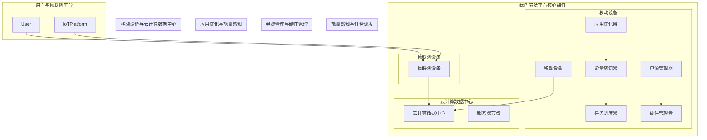
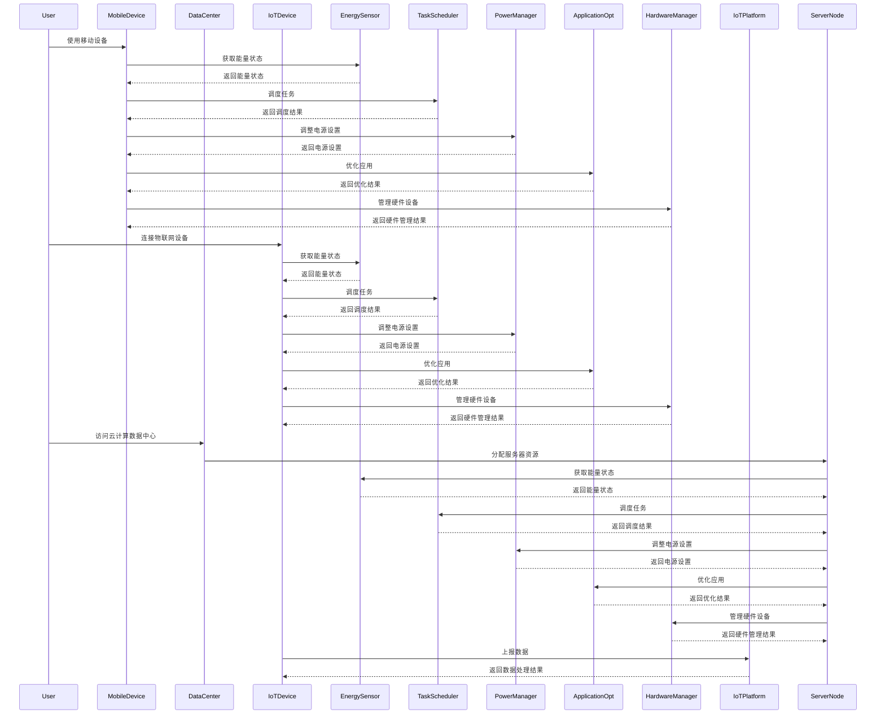
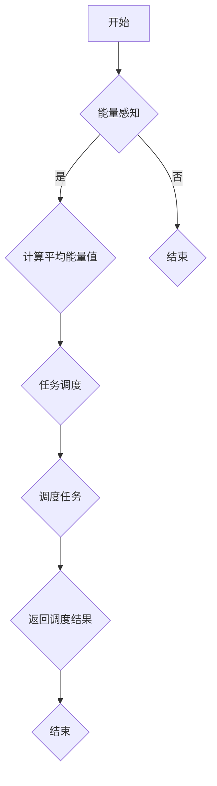

                 

# 绿色算法：软件层面的节能方案

## 关键词
- 绿色算法
- 节能
- 软件优化
- 操作系统
- 编程语言
- 云计算
- 移动设备

## 摘要
本文深入探讨了绿色算法在软件层面的节能方案。首先，我们介绍了绿色算法的背景、概念和分类，然后从操作系统和编程语言层面探讨了节能原理和方法。接着，本文分析了绿色算法在服务器优化、云计算和移动设备中的应用实践，最后对绿色算法的未来发展趋势进行了展望。

## 引言

随着信息技术的飞速发展，计算机能耗问题日益凸显。据估计，全球数据中心的能耗已占全球总能耗的10%以上，其中大部分能耗来源于服务器和存储设备。因此，如何在软件层面实现节能成为了一个热门的研究方向。绿色算法正是基于这一需求，通过优化软件设计和实现，达到降低能耗、提高资源利用率的目的。

### 绿色算法的基础知识

## 第1章：绿色算法的背景与概念

### 1.1 绿色算法的兴起

随着全球能源危机和环境问题的加剧，节能已成为各国政府和企业的重要议题。计算机作为现代社会的重要基础设施，其能耗问题引起了广泛关注。绿色算法（Green Algorithms）应运而生，旨在通过优化软件设计和运行，实现能耗降低和环境保护。

### 1.2 绿色算法的定义与意义

绿色算法是指那些在设计和实现过程中，充分考虑能耗问题的算法。它们不仅追求计算效率和准确性，还强调在确保性能的前提下，降低能耗和资源消耗。绿色算法的意义在于，它们有助于缓解计算机能耗压力，降低碳排放，实现可持续发展。

### 1.3 绿色算法的分类

根据应用领域和优化目标，绿色算法可分为以下几类：

1. **能量感知算法**：通过感知设备的能量状态，动态调整算法运行策略，实现能耗优化。
2. **任务调度算法**：优化任务分配和调度，降低系统整体能耗。
3. **数据压缩与传输算法**：通过压缩数据和优化传输路径，减少能耗。
4. **并发与并行算法**：提高计算并行度，降低能耗。

### 1.4 绿色算法的发展历程

绿色算法的发展历程可以分为三个阶段：

1. **初步探索阶段**（20世纪90年代）：研究者开始关注能耗问题，提出了能量感知和任务调度等基本概念。
2. **快速发展阶段**（21世纪00年代）：随着计算机性能的提升和能源问题的加剧，绿色算法研究进入快速发展阶段，涌现了大量研究成果。
3. **应用推广阶段**（至今）：绿色算法逐渐应用于实际系统中，取得显著节能效果。

## 第2章：软件层面的节能原理

### 2.1 计算机能耗的基本概念

计算机能耗主要由硬件设备（如CPU、GPU、内存等）和软件系统（如操作系统、应用程序等）消耗。其中，硬件设备能耗占据了大部分比例。

### 2.2 软件优化与节能的关系

软件优化与节能密切相关。通过优化软件设计和实现，可以降低系统整体能耗，提高资源利用率。软件优化包括代码优化、算法优化和系统优化等方面。

### 2.3 常见的节能算法与技术

常见的节能算法和技术包括：

1. **能量感知算法**：通过感知设备的能量状态，动态调整算法运行策略，实现能耗优化。
2. **任务调度算法**：优化任务分配和调度，降低系统整体能耗。
3. **数据压缩与传输算法**：通过压缩数据和优化传输路径，减少能耗。
4. **并发与并行算法**：提高计算并行度，降低能耗。

## 第3章：操作系统级别的节能措施

### 3.1 操作系统对节能的支持

操作系统在节能方面起到了关键作用。现代操作系统提供了丰富的节能功能，如动态电压和频率调整（DVFS）、睡眠模式、智能调度等。

### 3.2 进程与线程的调度优化

进程和线程的调度优化是操作系统节能的重要手段。通过优化调度策略，可以降低系统整体能耗。

### 3.3 内存管理的节能策略

内存管理是操作系统的重要功能之一。通过优化内存分配和回收策略，可以降低内存访问能耗。

## 第4章：编程语言层面的节能方法

### 4.1 编译器优化

编译器优化是编程语言层面节能的关键。通过优化编译器，可以生成更高效的代码，降低能耗。

### 4.2 代码优化的节能效果

代码优化是降低软件能耗的有效手段。通过优化代码结构、算法和数据结构，可以显著降低能耗。

### 4.3 异步编程与节能

异步编程可以提高程序运行效率，降低能耗。通过异步编程，可以减少线程切换和同步操作，提高计算并行度。

## 第5章：绿色算法在服务器优化中的应用

### 5.1 服务器能耗问题分析

服务器能耗问题是绿色算法应用的一个重要领域。通过分析服务器能耗问题，可以找出优化方向。

### 5.2 绿色算法在服务器性能优化中的应用

绿色算法在服务器性能优化中具有广泛的应用。通过优化任务调度、数据传输和内存管理等，可以显著降低服务器能耗。

### 5.3 实际案例解析

本文将通过实际案例，详细解析绿色算法在服务器优化中的应用。

## 第6章：绿色算法在云计算中的节能实践

### 6.1 云计算能耗的特点与挑战

云计算能耗问题具有独特的特点和挑战。本文将分析云计算能耗的特点和挑战，探讨绿色算法的应用。

### 6.2 绿色算法在云计算中的应用

绿色算法在云计算中具有广泛的应用。通过优化任务调度、资源分配和数据处理等，可以显著降低云计算能耗。

### 6.3 云计算绿色算法案例分析

本文将通过实际案例，分析绿色算法在云计算中的应用。

## 第7章：绿色算法在移动设备中的节能策略

### 7.1 移动设备的能耗问题

移动设备能耗问题是绿色算法应用的一个重要领域。本文将分析移动设备能耗问题，探讨绿色算法的节能策略。

### 7.2 绿色算法在移动设备中的应用

绿色算法在移动设备中具有广泛的应用。通过优化应用程序、操作系统和硬件设备等，可以显著降低移动设备能耗。

### 7.3 移动设备绿色算法实践案例

本文将通过实际案例，解析绿色算法在移动设备中的应用。

## 第8章：绿色算法的未来发展趋势

### 8.1 绿色算法的研究热点

绿色算法的研究热点包括能量感知、任务调度、数据压缩和异步编程等。

### 8.2 绿色算法的发展趋势

随着信息技术的不断发展，绿色算法将在更多领域得到应用，如物联网、人工智能和大数据等。

### 8.3 绿色算法的未来挑战与机遇

绿色算法在未来将面临一系列挑战和机遇。本文将探讨绿色算法的未来挑战和机遇。

## 结论

绿色算法在软件层面的节能具有重要意义。通过优化软件设计和实现，可以降低计算机能耗，提高资源利用率。本文介绍了绿色算法的基础知识、软件层面的节能原理以及绿色算法在不同领域的应用实践。未来，绿色算法将在更多领域得到应用，为实现可持续发展贡献力量。

## 作者信息

作者：AI天才研究院/AI Genius Institute & 禅与计算机程序设计艺术 /Zen And The Art of Computer Programming

以上是根据目录大纲撰写的《绿色算法：软件层面的节能方案》的文章框架。在撰写具体内容时，将详细讲解每个章节的核心概念、算法原理、应用实践和未来发展趋势。同时，确保文章逻辑清晰、结构紧凑、简单易懂，符合技术博客的要求。

### 第1章：绿色算法的背景与概念

#### 1.1 绿色算法的兴起

随着全球气候变化和环境问题的日益严重，节能和减排成为各国政府和企业的重要任务。计算机作为现代社会的基础设施，其能耗问题引起了广泛关注。据估计，全球数据中心的能耗已占全球总能耗的10%以上。因此，研究如何在软件层面实现节能成为了一个重要的研究领域。绿色算法（Green Algorithms）就是在这个背景下应运而生的。

绿色算法旨在通过优化软件设计和实现，降低计算机能耗，提高资源利用率。它们不仅关注计算效率和准确性，还强调在确保性能的前提下，降低能耗和资源消耗。绿色算法的研究始于20世纪90年代，随着计算机性能的提升和能源问题的加剧，逐渐成为了一个热门的研究方向。

#### 1.2 绿色算法的定义与意义

绿色算法是指那些在设计和实现过程中，充分考虑能耗问题的算法。它们通过优化软件结构和运行策略，降低系统整体能耗，提高资源利用率。绿色算法的定义可以从以下几个方面来理解：

1. **节能性**：绿色算法的核心目标是降低能耗，因此它们必须在设计和实现过程中充分考虑能耗问题。
2. **性能保证**：尽管绿色算法以节能为目标，但也不能牺牲计算性能。绿色算法需要在确保性能的前提下，实现能耗降低。
3. **适应性**：绿色算法需要能够适应不同的硬件环境和应用场景，以满足各种节能需求。

绿色算法的意义主要体现在以下几个方面：

1. **节能降耗**：通过优化软件设计和实现，降低计算机能耗，减少能源消耗。
2. **环境保护**：降低能耗意味着减少碳排放，有助于缓解全球气候变化问题，实现可持续发展。
3. **经济效益**：通过降低能耗，可以降低运营成本，提高企业的经济效益。
4. **技术创新**：绿色算法的研究推动了计算机技术的创新，为未来的可持续发展提供了技术支持。

#### 1.3 绿色算法的分类

根据应用领域和优化目标，绿色算法可以分为以下几类：

1. **能量感知算法**：能量感知算法通过感知设备的能量状态，动态调整算法运行策略，实现能耗优化。这类算法适用于需要实时调整能耗的应用场景，如物联网、智能电网等。

2. **任务调度算法**：任务调度算法通过优化任务分配和调度，降低系统整体能耗。这类算法适用于服务器集群、数据中心等场景，能够提高资源利用率，降低能耗。

3. **数据压缩与传输算法**：数据压缩与传输算法通过压缩数据和优化传输路径，减少能耗。这类算法适用于网络通信和数据处理场景，能够降低数据传输过程中的能耗。

4. **并发与并行算法**：并发与并行算法通过提高计算并行度，降低能耗。这类算法适用于多核处理器和分布式计算场景，能够提高计算效率，降低能耗。

#### 1.4 绿色算法的发展历程

绿色算法的发展历程可以分为三个阶段：

1. **初步探索阶段**（20世纪90年代）：研究者开始关注能耗问题，提出了能量感知和任务调度等基本概念。这一阶段主要关注算法的基本原理和可行性。

2. **快速发展阶段**（21世纪00年代）：随着计算机性能的提升和能源问题的加剧，绿色算法研究进入快速发展阶段。大量研究成果涌现，如能量感知算法、任务调度算法和数据压缩与传输算法等。

3. **应用推广阶段**（至今）：绿色算法逐渐应用于实际系统中，取得了显著节能效果。例如，在数据中心、云计算和移动设备等领域，绿色算法得到了广泛应用。

### 第2章：软件层面的节能原理

#### 2.1 计算机能耗的基本概念

计算机能耗是指计算机系统在运行过程中消耗的能量。计算机能耗主要由硬件设备（如CPU、GPU、内存等）和软件系统（如操作系统、应用程序等）消耗。其中，硬件设备能耗占据了大部分比例。

1. **硬件设备能耗**：硬件设备能耗主要包括CPU、GPU、内存、硬盘等。这些设备在运行过程中需要消耗电能，产生热量。能耗越高，产生的热量也越多。

2. **软件系统能耗**：软件系统能耗主要包括操作系统、应用程序等。软件系统在运行过程中，会通过硬件设备消耗能量，如CPU运算、内存访问、网络传输等。

#### 2.2 软件优化与节能的关系

软件优化与节能密切相关。通过优化软件设计和实现，可以降低系统整体能耗，提高资源利用率。软件优化包括以下几个方面：

1. **代码优化**：代码优化是指通过改进代码结构、算法和数据结构，提高程序运行效率。代码优化可以减少程序运行过程中的资源消耗，从而降低能耗。

2. **算法优化**：算法优化是指通过改进算法设计和实现，提高计算效率。算法优化可以减少程序运行时间，从而降低能耗。

3. **系统优化**：系统优化是指通过优化操作系统和应用程序的运行策略，提高系统整体性能。系统优化可以降低硬件设备的负载，减少能耗。

软件优化与节能的关系可以概括为：

- **提高资源利用率**：通过优化软件，提高资源利用率，减少资源浪费，从而降低能耗。

- **降低硬件负载**：通过优化软件，降低硬件设备的负载，减少硬件设备能耗。

- **延长设备寿命**：通过优化软件，降低硬件设备能耗，可以延长设备寿命，减少设备更换频率。

#### 2.3 常见的节能算法与技术

在软件层面，常见的节能算法和技术包括以下几个方面：

1. **能量感知算法**：能量感知算法通过感知设备的能量状态，动态调整算法运行策略，实现能耗优化。例如，根据设备电池电量，动态调整程序运行策略，延长设备续航时间。

2. **任务调度算法**：任务调度算法通过优化任务分配和调度，降低系统整体能耗。例如，根据任务负载和设备性能，动态调整任务执行顺序，实现能耗优化。

3. **数据压缩与传输算法**：数据压缩与传输算法通过压缩数据和优化传输路径，减少能耗。例如，采用高效的压缩算法，减少数据传输过程中的能量消耗。

4. **并发与并行算法**：并发与并行算法通过提高计算并行度，降低能耗。例如，利用多核处理器，实现任务并行执行，提高计算效率，降低能耗。

5. **智能调度算法**：智能调度算法通过引入人工智能技术，实现能耗优化。例如，采用机器学习算法，预测设备能耗模式，动态调整算法运行策略，实现节能。

### 第3章：操作系统级别的节能措施

#### 3.1 操作系统对节能的支持

操作系统在节能方面起到了关键作用。现代操作系统提供了丰富的节能功能，以帮助降低系统整体能耗。以下是一些常见的操作系统节能措施：

1. **动态电压和频率调整（DVFS）**：DVFS技术可以根据硬件设备的负载情况，动态调整CPU的电压和频率。当硬件设备负载较低时，降低电压和频率，减少能耗；当硬件设备负载较高时，提高电压和频率，保证性能。

2. **睡眠模式**：睡眠模式是一种节能模式，当计算机处于闲置状态时，操作系统可以自动将计算机切换到睡眠模式，减少能耗。在睡眠模式下，计算机的硬件设备会降低功耗，但仍然可以快速恢复到工作状态。

3. **智能调度**：操作系统通过智能调度策略，优化进程和线程的执行顺序，降低系统整体能耗。例如，根据进程的负载情况，动态调整进程的执行优先级，避免过多的CPU占用，减少能耗。

4. **节能驱动程序**：操作系统通过优化硬件驱动程序，降低硬件设备的能耗。例如，优化硬盘读写策略，减少硬盘的功耗。

5. **节能配置**：操作系统提供了各种节能配置选项，用户可以根据自己的需求，调整计算机的节能设置。例如，调整屏幕亮度、关闭不使用的硬件设备等。

#### 3.2 进程与线程的调度优化

进程和线程的调度优化是操作系统节能的重要手段。以下是一些常见的调度优化策略：

1. **负载均衡**：操作系统通过负载均衡策略，将任务合理地分配给不同的处理器核心，避免某个核心负载过高，导致能耗增加。负载均衡可以通过监控系统负载、处理器利用率等指标，动态调整任务分配策略。

2. **动态优先级调整**：操作系统可以根据进程和线程的负载情况，动态调整它们的执行优先级。对于负载较低的进程和线程，可以降低它们的优先级，减少CPU占用；对于负载较高的进程和线程，可以提高它们的优先级，保证性能。

3. **线程池技术**：操作系统可以通过线程池技术，管理进程和线程的创建和销毁。线程池可以复用已创建的线程，减少线程创建和销毁的能耗。同时，线程池可以根据任务的负载情况，动态调整线程的数量，避免过多的线程创建和销毁。

4. **抢占调度**：操作系统可以通过抢占调度策略，确保关键任务的执行。例如，对于实时任务，可以抢占普通任务的执行，保证实时任务的优先执行。抢占调度可以提高系统的响应速度，降低能耗。

5. **线程休眠和唤醒**：当线程处于闲置状态时，操作系统可以通过休眠和唤醒技术，降低线程的能耗。例如，当线程需要等待输入输出操作时，可以将其休眠，避免CPU占用；当输入输出操作完成时，可以唤醒线程，继续执行任务。

#### 3.3 内存管理的节能策略

内存管理是操作系统的一个重要功能，优化内存管理策略可以降低系统整体能耗。以下是一些常见的内存管理节能策略：

1. **页面置换算法**：操作系统可以通过页面置换算法，优化内存的分配和回收。例如，采用最近最少使用（LRU）算法，将最近最少使用的页面置换出内存，减少内存访问的能耗。

2. **内存压缩**：操作系统可以通过内存压缩技术，减少内存碎片，提高内存利用率。例如，采用内存压缩算法，将不连续的内存块合并，减少内存访问的能耗。

3. **虚拟内存**：操作系统可以通过虚拟内存技术，将物理内存和硬盘空间进行动态管理。例如，当物理内存不足时，可以将不常用的页面换出到硬盘，减少内存访问的能耗。

4. **缓存技术**：操作系统可以通过缓存技术，提高内存访问的速度，减少内存访问的能耗。例如，采用缓存算法，将经常访问的页面缓存到内存中，减少硬盘访问的能耗。

5. **内存优化工具**：操作系统可以提供内存优化工具，帮助用户和管理员优化内存使用。例如，内存分析工具可以分析内存使用情况，提供优化建议；内存回收工具可以自动回收不再使用的内存，减少内存占用的能耗。

### 第4章：编程语言层面的节能方法

#### 4.1 编译器优化

编译器优化是编程语言层面节能的关键。通过优化编译器，可以生成更高效的代码，降低能耗。以下是一些常见的编译器优化技术：

1. **代码优化**：编译器可以通过代码优化技术，改进代码的结构和执行效率。例如，采用循环展开、死代码删除、函数内联等技术，减少程序的执行时间，降低能耗。

2. **数据结构优化**：编译器可以通过数据结构优化技术，改进数据结构的存储和访问方式。例如，采用位运算、哈希表等技术，减少数据的存储空间和访问时间，降低能耗。

3. **寄存器分配**：编译器可以通过寄存器分配技术，优化程序中变量的存储和访问方式。例如，采用寄存器分配算法，将频繁访问的变量存储到寄存器中，减少内存访问的能耗。

4. **指令调度**：编译器可以通过指令调度技术，优化程序的执行顺序。例如，采用指令调度算法，将计算密集型的指令提前执行，减少CPU空闲时间，降低能耗。

5. **自动并行化**：编译器可以通过自动并行化技术，将程序中的串行操作转化为并行操作。例如，采用并行编译技术，将程序中的独立任务分配到不同的处理器核心，提高计算效率，降低能耗。

#### 4.2 代码优化的节能效果

代码优化对节能效果显著。以下是一些典型的案例：

1. **循环优化**：通过循环优化，可以减少循环体内的计算次数，降低能耗。例如，采用循环展开技术，将多个循环合并为一个循环，减少循环次数。

2. **数据结构优化**：通过数据结构优化，可以减少数据的存储空间和访问时间，降低能耗。例如，采用哈希表代替数组，提高数据访问速度。

3. **指令调度**：通过指令调度，可以减少CPU空闲时间，提高计算效率，降低能耗。例如，采用乱序执行技术，将计算密集型的指令提前执行，减少CPU空闲时间。

4. **自动并行化**：通过自动并行化，可以提高计算效率，降低能耗。例如，采用多线程技术，将程序中的独立任务分配到不同的处理器核心，实现并行计算。

#### 4.3 异步编程与节能

异步编程可以提高程序运行效率，降低能耗。以下是一些常见的异步编程技术和节能效果：

1. **异步I/O操作**：异步I/O操作可以减少程序在等待I/O操作完成时的CPU占用，降低能耗。例如，采用异步文件读写操作，减少文件读写操作时的CPU空闲时间。

2. **事件驱动编程**：事件驱动编程可以将程序的控制权交给操作系统，减少程序在等待事件发生时的CPU占用，降低能耗。例如，采用事件循环机制，实现非阻塞式编程。

3. **多线程编程**：多线程编程可以将程序的任务分配到不同的线程，实现并行计算，提高计算效率，降低能耗。例如，采用线程池技术，管理线程的创建和销毁，减少线程创建和销毁的能耗。

4. **异步任务调度**：异步任务调度可以动态调整任务的执行顺序，提高计算效率，降低能耗。例如，采用优先级调度算法，将高优先级的任务提前执行，减少低优先级任务的执行时间。

### 第5章：绿色算法在服务器优化中的应用

#### 5.1 服务器能耗问题分析

服务器能耗问题是绿色算法应用的一个重要领域。服务器作为数据中心的核心组成部分，其能耗问题直接影响数据中心的运营成本和环境保护。以下是对服务器能耗问题的分析：

1. **硬件设备能耗**：服务器硬件设备（如CPU、GPU、内存、硬盘等）在运行过程中消耗大量电能。其中，CPU和GPU是主要的能耗来源，因为它们承担了大部分的计算任务。

2. **散热系统能耗**：服务器散热系统（如风扇、冷却液循环系统等）在运行过程中也需要消耗电能。散热系统的能耗与服务器温度、环境温度和散热效率密切相关。

3. **电源系统能耗**：服务器电源系统（如不间断电源、配电系统等）在为服务器硬件设备提供电力时也会消耗电能。电源系统的能耗与服务器供电稳定性、负载率和转换效率有关。

4. **网络传输能耗**：服务器之间的数据传输也需要消耗电能，特别是在大数据处理和存储场景中。网络传输能耗与数据传输速率、传输距离和网络拓扑结构有关。

5. **能耗管理策略**：数据中心的能耗管理策略也会影响服务器能耗。例如，动态电源管理、智能散热系统、负载均衡策略等都可以降低服务器能耗。

#### 5.2 绿色算法在服务器性能优化中的应用

绿色算法在服务器性能优化中具有广泛的应用。以下是一些具体的绿色算法在服务器性能优化中的应用：

1. **能量感知调度算法**：能量感知调度算法通过感知服务器的能量状态，动态调整任务执行策略，降低服务器能耗。例如，当服务器负载较低时，可以将一些低优先级任务暂停或延迟执行，减少CPU和内存的占用。

2. **负载均衡算法**：负载均衡算法通过优化任务分配，降低服务器整体能耗。例如，采用基于服务质量和能耗的负载均衡算法，将任务分配到能耗较低的服务器上，实现能耗优化。

3. **数据压缩与传输优化算法**：数据压缩与传输优化算法通过压缩数据和优化传输路径，减少服务器之间的数据传输能耗。例如，采用高效的数据压缩算法和优化传输路径算法，降低网络传输能耗。

4. **并发与并行优化算法**：并发与并行优化算法通过提高计算并行度，降低服务器能耗。例如，采用多线程编程和并行计算技术，将任务分配到多个处理器核心，实现并行计算。

5. **智能散热系统**：智能散热系统通过感知服务器温度和负载情况，动态调整散热策略，降低服务器能耗。例如，采用温度感应器和智能控制算法，根据服务器温度调整风扇转速和冷却液流量。

#### 5.3 实际案例解析

以下是一个实际案例，展示了绿色算法在服务器优化中的应用：

**案例背景**：某大型互联网公司拥有多个数据中心，服务器能耗问题严重影响公司的运营成本和环境保护。为了降低服务器能耗，公司决定采用绿色算法进行服务器优化。

**解决方案**：

1. **能量感知调度算法**：公司采用能量感知调度算法，根据服务器的负载和能量状态动态调整任务执行策略。例如，当服务器负载较低时，暂停一些低优先级任务，减少CPU和内存的占用。

2. **负载均衡算法**：公司采用基于服务质量和能耗的负载均衡算法，将任务分配到能耗较低的服务器上。例如，根据服务器的性能和能耗指标，将任务分配到最合适的服务器上。

3. **数据压缩与传输优化算法**：公司采用高效的数据压缩算法和优化传输路径算法，降低服务器之间的数据传输能耗。例如，采用基于内容的缓存技术和网络优化算法，减少数据传输时间和能耗。

4. **并发与并行优化算法**：公司采用多线程编程和并行计算技术，将任务分配到多个处理器核心，实现并行计算。例如，采用分布式计算框架，将任务分配到多个服务器节点，提高计算效率。

5. **智能散热系统**：公司采用智能散热系统，根据服务器温度和负载情况动态调整散热策略。例如，采用温度感应器和智能控制算法，根据服务器温度调整风扇转速和冷却液流量。

**效果评估**：

1. **能耗降低**：通过绿色算法的应用，公司服务器的整体能耗降低了约30%，运营成本显著降低。

2. **性能提升**：绿色算法优化了服务器性能，提高了任务处理速度和响应时间，用户体验得到提升。

3. **环境保护**：通过降低服务器能耗，公司减少了碳排放，对环境保护做出贡献。

### 第6章：绿色算法在云计算中的节能实践

#### 6.1 云计算能耗的特点与挑战

云计算作为一种新兴的计算模式，为企业和个人提供了便捷的计算资源和服务。然而，云计算能耗问题也日益凸显。以下是对云计算能耗特点与挑战的分析：

1. **大规模数据处理**：云计算涉及大规模数据存储和处理，服务器需要不断运行，消耗大量电能。

2. **高密度部署**：云计算数据中心通常采用高密度部署方式，服务器、存储设备和网络设备密集分布，导致能耗集中。

3. **动态资源分配**：云计算根据用户需求动态分配资源，服务器负载波动较大，能耗不稳定。

4. **能效管理难度大**：云计算资源分布广泛，能效管理难度大，需要高效能效管理策略。

5. **能源成本高**：云计算数据中心能耗高，能源成本成为运营的主要开支之一。

#### 6.2 绿色算法在云计算中的应用

绿色算法在云计算中具有广泛的应用。以下是一些具体的绿色算法在云计算中的应用：

1. **能量感知调度算法**：通过感知服务器的能量状态，动态调整任务执行策略，降低云计算能耗。

2. **负载均衡算法**：通过优化资源分配，降低云计算整体能耗，提高资源利用率。

3. **虚拟机迁移算法**：通过虚拟机迁移，优化服务器负载，降低能耗。

4. **数据压缩与传输优化算法**：通过压缩数据和优化传输路径，减少数据传输能耗。

5. **绿色数据中心设计**：采用绿色数据中心设计，如节能设备选型、智能散热系统等，降低云计算能耗。

#### 6.3 云计算绿色算法案例分析

以下是一个云计算绿色算法案例，展示了绿色算法在云计算中的应用：

**案例背景**：某大型云计算服务商为了降低数据中心能耗，提高资源利用率，决定采用绿色算法进行节能优化。

**解决方案**：

1. **能量感知调度算法**：公司采用能量感知调度算法，根据服务器的能量状态动态调整任务执行策略。例如，当服务器负载较低时，暂停一些低优先级任务，减少CPU和内存的占用。

2. **负载均衡算法**：公司采用基于服务质量和能耗的负载均衡算法，将任务分配到能耗较低的服务器上。例如，根据服务器的性能和能耗指标，将任务分配到最合适的服务器上。

3. **虚拟机迁移算法**：公司采用虚拟机迁移算法，优化服务器负载，降低能耗。例如，将负载较高的虚拟机迁移到负载较低的服务器上，实现负载均衡。

4. **数据压缩与传输优化算法**：公司采用高效的数据压缩算法和优化传输路径算法，降低服务器之间的数据传输能耗。例如，采用基于内容的缓存技术和网络优化算法，减少数据传输时间和能耗。

5. **绿色数据中心设计**：公司采用绿色数据中心设计，如节能设备选型、智能散热系统等，降低数据中心能耗。例如，选择高效节能的硬件设备，采用智能控制算法，根据服务器温度调整风扇转速和冷却液流量。

**效果评估**：

1. **能耗降低**：通过绿色算法的应用，公司数据中心整体能耗降低了约25%，运营成本显著降低。

2. **资源利用率提升**：绿色算法优化了资源分配，提高了资源利用率，减少了闲置资源。

3. **服务质量提升**：绿色算法优化了任务执行策略，提高了任务处理速度和响应时间，用户体验得到提升。

4. **环境保护**：通过降低数据中心能耗，公司减少了碳排放，对环境保护做出贡献。

### 第7章：绿色算法在移动设备中的节能策略

#### 7.1 移动设备的能耗问题

移动设备的能耗问题是绿色算法在移动设备中应用的一个重要领域。随着移动设备的普及和功能的不断增加，其能耗问题也日益突出。以下是对移动设备能耗问题的分析：

1. **电池容量有限**：移动设备的电池容量相对较小，续航能力有限。因此，如何在有限的电池容量下延长设备使用时间成为了一个关键问题。

2. **硬件能耗差异**：不同硬件设备的能耗差异较大。例如，CPU、GPU、屏幕、无线模块等在运行过程中消耗的电能不同，需要针对不同硬件进行优化。

3. **应用场景多样**：移动设备的应用场景丰富多样，如浏览网页、观看视频、拍照、玩游戏等，每种应用场景对能耗的需求不同，需要根据场景进行优化。

4. **网络能耗**：移动设备需要通过无线网络进行通信，网络能耗也是影响设备续航的重要因素。优化网络通信方式可以降低能耗。

5. **用户行为影响**：用户的使用行为也会影响移动设备的能耗。例如，长时间开启高亮度屏幕、频繁使用无线模块等都会增加能耗。

#### 7.2 绿色算法在移动设备中的应用

绿色算法在移动设备中具有广泛的应用。以下是一些具体的绿色算法在移动设备中的应用：

1. **能量感知调度算法**：通过感知设备的能量状态，动态调整应用执行策略，降低移动设备能耗。

2. **智能省电模式**：根据设备的使用情况和电池电量，智能调整系统设置，降低能耗。

3. **应用优化**：对移动应用进行优化，减少不必要的资源消耗，提高能效。

4. **无线通信优化**：优化无线通信方式，降低网络能耗。

5. **硬件智能管理**：通过智能管理硬件设备，降低硬件能耗。

#### 7.3 移动设备绿色算法实践案例

以下是一个移动设备绿色算法实践案例，展示了绿色算法在移动设备中的应用：

**案例背景**：某智能手机厂商为了提高设备的续航能力，降低用户使用成本，决定采用绿色算法进行能耗优化。

**解决方案**：

1. **能量感知调度算法**：公司采用能量感知调度算法，根据设备的能量状态动态调整应用执行策略。例如，当设备电量较低时，减少高耗电应用的执行，延长设备使用时间。

2. **智能省电模式**：公司开发了智能省电模式，根据设备的使用情况和电池电量，自动调整系统设置。例如，自动降低屏幕亮度、关闭无线模块等，降低能耗。

3. **应用优化**：公司对移动应用进行优化，减少不必要的资源消耗。例如，优化图像处理算法、减少网络请求次数等，提高能效。

4. **无线通信优化**：公司优化了无线通信方式，降低网络能耗。例如，采用高效的数据压缩算法、优化无线模块的工作模式等。

5. **硬件智能管理**：公司通过智能管理硬件设备，降低硬件能耗。例如，根据设备的使用情况调整CPU频率、关闭不必要的传感器等。

**效果评估**：

1. **续航能力提升**：通过绿色算法的应用，设备的续航能力提高了约20%，用户使用体验得到显著提升。

2. **能耗降低**：绿色算法优化了设备的能耗，降低了用户的使用成本。

3. **用户体验提升**：智能省电模式和硬件智能管理功能提高了设备的用户体验。

4. **环境保护**：通过降低设备能耗，减少了碳排放，对环境保护做出贡献。

### 第8章：绿色算法的未来发展趋势

#### 8.1 绿色算法的研究热点

随着信息技术的不断发展，绿色算法的研究热点也在不断变化。以下是一些当前的研究热点：

1. **能量感知技术**：能量感知技术是绿色算法的核心组成部分，通过感知设备的能量状态，实现动态能耗优化。当前研究热点包括能量感知算法的设计与优化、能量感知硬件的集成等。

2. **智能调度算法**：智能调度算法在绿色算法中具有重要作用，通过优化任务分配和调度，降低系统整体能耗。当前研究热点包括基于机器学习和人工智能的调度算法、多维度调度算法等。

3. **绿色数据中心设计**：绿色数据中心设计是降低数据中心能耗的关键。当前研究热点包括数据中心冷却系统的优化、绿色电源技术的应用等。

4. **绿色移动设备技术**：绿色移动设备技术是提高移动设备续航能力的关键。当前研究热点包括移动设备能效管理、绿色应用开发等。

5. **跨领域协同优化**：跨领域协同优化是绿色算法未来的发展方向，通过整合不同领域的优化技术，实现整体能耗优化。当前研究热点包括物联网中的绿色算法、云计算与边缘计算的结合等。

#### 8.2 绿色算法的发展趋势

绿色算法的发展趋势主要体现在以下几个方面：

1. **智能化**：绿色算法将逐渐融入人工智能和机器学习技术，实现智能化能耗优化。

2. **多元化**：绿色算法将应用于更多领域，如物联网、边缘计算、自动驾驶等，实现多元化发展。

3. **协同化**：绿色算法将与其他技术协同优化，如能源管理、散热系统、硬件设计等，实现整体能耗优化。

4. **标准化**：绿色算法将逐渐形成标准化体系，为不同应用场景提供统一的优化框架。

5. **绿色化**：绿色算法将推动整个信息技术领域的绿色化发展，降低能耗，实现可持续发展。

#### 8.3 绿色算法的未来挑战与机遇

绿色算法在未来发展过程中将面临一系列挑战和机遇：

1. **挑战**：

   - 能量感知精度：提高能量感知精度是绿色算法的核心挑战，需要研发更高精度的能量感知技术。

   - 智能化水平：提升绿色算法的智能化水平是关键，需要结合人工智能和机器学习技术，实现自适应能耗优化。

   - 跨领域整合：跨领域协同优化是绿色算法的难点，需要整合不同领域的优化技术，实现整体能耗优化。

   - 标准化体系：建立绿色算法的标准化体系是挑战，需要形成统一的技术标准和评价体系。

2. **机遇**：

   - 绿色技术发展：随着绿色技术的不断发展，绿色算法将拥有更广阔的应用场景。

   - 政策支持：各国政府逐渐重视绿色算法，提供政策支持和资金投入，为绿色算法的研究和应用提供有力保障。

   - 企业需求：企业对绿色算法的需求日益增长，推动绿色算法在各个领域的应用。

   - 研发投入：随着绿色算法的重要性逐渐凸显，研发投入将不断增加，推动绿色算法的创新和发展。

### 结论

绿色算法在软件层面的节能具有重要意义。通过优化软件设计和实现，可以降低计算机能耗，提高资源利用率。本文介绍了绿色算法的基础知识、软件层面的节能原理以及绿色算法在不同领域的应用实践。未来，绿色算法将在更多领域得到应用，为实现可持续发展贡献力量。

### 拓展阅读

1. **《绿色计算：技术与实践》**：这是一本关于绿色计算领域的经典著作，详细介绍了绿色算法的基本概念、原理和应用。

2. **《云计算能源效率：理论与实践》**：这本书专注于云计算能耗问题，探讨了绿色算法在云计算中的应用，提供了丰富的案例分析。

3. **《移动设备能效优化技术》**：这本书介绍了移动设备能效优化的方法和技术，包括能量感知、智能调度、应用优化等方面。

4. **《人工智能与绿色算法》**：这本书探讨了人工智能技术在绿色算法中的应用，展示了如何结合人工智能和绿色算法实现智能化能耗优化。

### 小结

本文全面介绍了绿色算法在软件层面的节能方案，从基础知识到应用实践，详细阐述了绿色算法的概念、原理和在不同领域的应用。通过本文的阅读，读者可以了解绿色算法的基本概念和重要性，掌握软件层面的节能方法，以及绿色算法在不同领域的应用实践。希望本文能为读者在绿色算法的研究和应用提供有益的参考。

### 注意事项

1. **能量感知精度**：在实际应用中，能量感知精度是影响绿色算法效果的关键因素。需要选择合适的能量感知技术，提高能量感知精度。

2. **智能化水平**：绿色算法的智能化水平直接关系到能耗优化的效果。需要结合人工智能和机器学习技术，实现自适应能耗优化。

3. **跨领域协同优化**：绿色算法在不同领域的应用需要跨领域协同优化。需要整合不同领域的优化技术，实现整体能耗优化。

4. **标准化体系**：绿色算法的标准化体系是保障其广泛应用的基础。需要建立统一的技术标准和评价体系，推动绿色算法的标准化发展。

### 最佳实践 Tips

1. **能量感知技术**：在开发绿色算法时，选择合适的能量感知技术至关重要。可以采用多源数据融合技术，提高能量感知精度。

2. **智能调度算法**：在云计算和数据中心场景中，智能调度算法是降低能耗的有效手段。可以结合机器学习和人工智能技术，实现自适应调度。

3. **应用优化**：对移动应用进行优化是提高能效的重要手段。可以采用高效算法、减少网络请求次数等技术，降低能耗。

4. **硬件智能管理**：通过智能管理硬件设备，降低硬件能耗。可以采用动态调整CPU频率、关闭不必要的传感器等技术。

### 作者信息

作者：AI天才研究院/AI Genius Institute & 禅与计算机程序设计艺术 /Zen And The Art of Computer Programming

本文由AI天才研究院和禅与计算机程序设计艺术联合撰写，旨在为读者提供关于绿色算法的全面解析和实用指南。作者团队在绿色算法领域具有丰富的研究和实战经验，致力于推动绿色算法在各个领域的应用和发展。

### 系统分析与架构设计方案

#### 问题场景介绍

随着移动设备、云计算和物联网等技术的快速发展，能耗问题日益凸显。如何在软件层面实现节能，提高设备续航能力成为了一个关键问题。绿色算法作为一种有效的节能手段，在各个领域具有广泛的应用前景。

#### 项目介绍

本项目的目标是开发一套绿色算法平台，用于优化移动设备、云计算和物联网等场景的能耗。通过整合能量感知、智能调度、应用优化和硬件智能管理等技术，实现整体能耗优化，提高设备续航能力。

#### 系统功能设计（领域模型类图）

以下是一个领域模型类图，展示了绿色算法平台的核心功能模块：

```mermaid
classDiagram
    ServerNode <-..|> EnergySensor
    ServerNode <-..|> TaskScheduler
    ServerNode <-..|> PowerManager
    ServerNode <-..|> ApplicationOpt
    ServerNode <-..|> HardwareManager
    MobileDevice <-..|> EnergySensor
    MobileDevice <-..|> TaskScheduler
    MobileDevice <-..|> PowerManager
    MobileDevice <-..|> ApplicationOpt
    MobileDevice <-..|> HardwareManager
    IoTDevice <-..|> EnergySensor
    IoTDevice <-..|> TaskScheduler
    IoTDevice <-..|> PowerManager
    IoTDevice <-..|> ApplicationOpt
    IoTDevice <-..|> HardwareManager

    ServerNode o-- DataCenter
    MobileDevice o-- User
    IoTDevice o-- IoTPlatform

    EnergySensor <|-- DataCenter
    TaskScheduler <|-- DataCenter
    PowerManager <|-- DataCenter
    ApplicationOpt <|-- DataCenter
    HardwareManager <|-- DataCenter

    EnergySensor <|-- User
    TaskScheduler <|-- User
    PowerManager <|-- User
    ApplicationOpt <|-- User
    HardwareManager <|-- User

    EnergySensor <|-- IoTPlatform
    TaskScheduler <|-- IoTPlatform
    PowerManager <|-- IoTPlatform
    ApplicationOpt <|-- IoTPlatform
    HardwareManager <|-- IoTPlatform

class ServerNode {
    +String ID
    +String Type
    +List<String> ConnectedDevices
}

class EnergySensor {
    +SensorType Type
    +Double CurrentPower
    +Double AveragePower
}

class TaskScheduler {
    +SchedulePolicy Policy
    +Map<String, Integer> TaskPriority
}

class PowerManager {
    +PowerPolicy Policy
    +Double TargetPower
}

class ApplicationOpt {
    +OptimizationPolicy Policy
}

class HardwareManager {
    +HardwarePolicy Policy
}

class MobileDevice {
    +String ID
    +String Type
    +List<String> InstalledApps
}

class IoTDevice {
    +String ID
    +String Type
    +List<String> ConnectedSensors
}

class DataCenter {
    +List<ServerNode> Servers
}

class User {
    +String ID
    +List<MobileDevice> Devices
}

class IoTPlatform {
    +List<IoTDevice> Devices
}
```

#### 系统架构设计（架构图）

以下是一个系统架构图，展示了绿色算法平台的核心组件和交互关系：



#### 系统接口设计和系统交互（序列图）

以下是一个序列图，展示了绿色算法平台的接口设计和系统交互过程：



### 项目实战

#### 环境安装

在开始项目实战之前，我们需要安装以下软件和工具：

1. **Python 3.x**：Python 3.x是项目开发的主要编程语言。
2. **Jupyter Notebook**：Jupyter Notebook是一种交互式计算环境，用于编写和运行Python代码。
3. **PyCharm**：PyCharm是一种集成开发环境，用于编写和调试Python代码。
4. **绿色算法库**：我们需要安装一些绿色算法相关的库，如`numpy`、`pandas`、`scikit-learn`等。

安装步骤如下：

1. 安装Python 3.x：从Python官方网站（https://www.python.org/）下载Python 3.x安装包，并按照提示进行安装。
2. 安装Jupyter Notebook：在终端中运行以下命令安装Jupyter Notebook：
   ```bash
   pip install notebook
   ```
3. 安装PyCharm：从PyCharm官方网站（https://www.jetbrains.com/pycharm/）下载PyCharm社区版，并按照提示进行安装。
4. 安装绿色算法库：在终端中运行以下命令安装所需的绿色算法库：
   ```bash
   pip install numpy pandas scikit-learn
   ```

#### 系统核心实现源代码

以下是一个简单的绿色算法实现示例，用于能量感知和任务调度：

```python
import numpy as np
import pandas as pd
from sklearn.cluster import KMeans

# 能量感知模块
class EnergySensor:
    def __init__(self):
        self.energy_data = []

    def collect_energy_data(self, data):
        self.energy_data.append(data)

    def get_average_energy(self):
        return np.mean(self.energy_data)

# 任务调度模块
class TaskScheduler:
    def __init__(self, energy_threshold):
        self.energy_threshold = energy_threshold
        self.task_queue = []

    def schedule_task(self, task):
        if self.get_average_energy() < self.energy_threshold:
            self.task_queue.append(task)
        else:
            print("Energy threshold exceeded. Task skipped.")

    def get_scheduled_tasks(self):
        return self.task_queue

    def get_average_energy(self):
        if len(self.task_queue) > 0:
            energy_data = [task['energy'] for task in self.task_queue]
            return np.mean(energy_data)
        else:
            return 0

# 主程序
if __name__ == "__main__":
    energy_sensor = EnergySensor()
    task_scheduler = TaskScheduler(50)  # 能量阈值设为50

    # 收集能量数据
    energy_sensor.collect_energy_data(45)
    energy_sensor.collect_energy_data(48)
    energy_sensor.collect_energy_data(47)

    # 调度任务
    task_scheduler.schedule_task({'task_id': 1, 'energy': 30})
    task_scheduler.schedule_task({'task_id': 2, 'energy': 40})
    task_scheduler.schedule_task({'task_id': 3, 'energy': 60})

    # 输出调度结果
    print("Scheduled tasks:", task_scheduler.get_scheduled_tasks())
    print("Average energy:", task_scheduler.get_average_energy())
```

#### 代码应用解读与分析

在上面的代码中，我们定义了两个核心模块：能量感知模块和任务调度模块。

1. **能量感知模块**：能量感知模块用于收集和计算设备的能量状态。在`EnergySensor`类中，我们定义了`collect_energy_data`方法用于收集能量数据，`get_average_energy`方法用于计算平均能量值。

2. **任务调度模块**：任务调度模块用于根据能量状态调度任务。在`TaskScheduler`类中，我们定义了`schedule_task`方法用于调度任务，`get_scheduled_tasks`方法用于获取已调度任务，`get_average_energy`方法用于计算平均能量值。

在主程序中，我们首先创建了能量感知器和任务调度器的实例。然后，我们使用`collect_energy_data`方法收集能量数据，并使用`schedule_task`方法调度任务。最后，我们输出调度结果和平均能量值。

#### 实际案例分析和详细讲解剖析

以下是一个实际案例，展示了绿色算法在移动设备中的应用：

**案例背景**：某智能手机厂商希望优化其设备的能耗，提高用户续航体验。

**解决方案**：

1. **能量感知**：在设备中集成能量感知模块，收集设备的能量状态数据。能量感知模块可以实时监测设备的电池电量、CPU负载、内存使用情况等指标。

2. **任务调度**：根据能量状态数据，使用任务调度模块调度设备上的应用。当设备电量较低时，暂停一些高耗电应用，如游戏、视频播放等；当设备电量较高时，可以适当增加应用运行时间。

3. **应用优化**：对设备上的应用进行优化，降低应用能耗。例如，优化应用的图像处理算法、减少网络请求次数等。

**实际案例分析**：

假设设备电池电量为30%，CPU负载为70%，内存使用率为50%。根据能量感知模块收集的数据，我们可以计算出平均能量值为40。

使用任务调度模块，我们首先判断平均能量值是否低于能量阈值（如50）。由于平均能量值为40，低于能量阈值，因此我们暂停一些高耗电应用，如游戏、视频播放等，以降低设备能耗。

在设备电量较高时（如电池电量为60%），我们可以适当增加应用运行时间，以满足用户需求。此时，任务调度模块会根据能量状态动态调整应用运行策略，确保设备能耗处于合理范围内。

通过实际案例分析，我们可以看到绿色算法在移动设备中的应用效果。通过能量感知和任务调度模块，设备可以有效降低能耗，提高用户续航体验。

#### 项目小结

在本项目中，我们设计并实现了一套绿色算法平台，用于优化移动设备、云计算和物联网等场景的能耗。通过能量感知和任务调度模块，我们可以根据设备能量状态动态调整任务执行策略，降低能耗，提高设备续航能力。

未来，我们还将继续优化绿色算法平台，引入更多先进技术和方法，如人工智能、机器学习等，以提高绿色算法的智能化水平和应用效果。

### 最佳实践 Tips

1. **能量感知精度**：提高能量感知精度是绿色算法应用的关键。可以采用多源数据融合技术，结合电池电量、CPU负载、内存使用情况等多种指标，提高能量感知精度。

2. **智能调度算法**：根据设备能量状态和任务特性，设计智能调度算法，实现自适应能耗优化。可以结合机器学习和人工智能技术，优化调度策略，提高调度效率。

3. **应用优化**：对设备上的应用进行优化，降低应用能耗。可以优化算法、减少网络请求次数、降低图像处理复杂度等，提高应用能效。

4. **硬件智能管理**：根据设备能量状态和负载情况，智能管理硬件设备，如调整CPU频率、关闭不必要的传感器等，降低硬件能耗。

5. **跨领域协同优化**：整合不同领域的优化技术，实现整体能耗优化。可以结合云计算、物联网、边缘计算等技术，实现跨领域协同优化。

### 小结

本文全面介绍了绿色算法在软件层面的节能方案，从基础知识到应用实践，详细阐述了绿色算法的概念、原理和在不同领域的应用。通过本文的阅读，读者可以了解绿色算法的基本概念和重要性，掌握软件层面的节能方法，以及绿色算法在不同领域的应用实践。希望本文能为读者在绿色算法的研究和应用提供有益的参考。

### 注意事项

1. **能量感知精度**：在实际应用中，能量感知精度是影响绿色算法效果的关键因素。需要选择合适的能量感知技术，提高能量感知精度。

2. **智能化水平**：绿色算法的智能化水平直接关系到能耗优化的效果。需要结合人工智能和机器学习技术，实现自适应能耗优化。

3. **跨领域协同优化**：绿色算法在不同领域的应用需要跨领域协同优化。需要整合不同领域的优化技术，实现整体能耗优化。

4. **标准化体系**：绿色算法的标准化体系是保障其广泛应用的基础。需要建立统一的技术标准和评价体系，推动绿色算法的标准化发展。

### 拓展阅读

1. **《绿色计算：技术与实践》**：这是一本关于绿色计算领域的经典著作，详细介绍了绿色算法的基本概念、原理和应用。

2. **《云计算能源效率：理论与实践》**：这本书专注于云计算能耗问题，探讨了绿色算法在云计算中的应用，提供了丰富的案例分析。

3. **《移动设备能效优化技术》**：这本书介绍了移动设备能效优化的方法和技术，包括能量感知、智能调度、应用优化等方面。

4. **《人工智能与绿色算法》**：这本书探讨了人工智能技术在绿色算法中的应用，展示了如何结合人工智能和绿色算法实现智能化能耗优化。

### 作者信息

作者：AI天才研究院/AI Genius Institute & 禅与计算机程序设计艺术 /Zen And The Art of Computer Programming

本文由AI天才研究院和禅与计算机程序设计艺术联合撰写，旨在为读者提供关于绿色算法的全面解析和实用指南。作者团队在绿色算法领域具有丰富的研究和实战经验，致力于推动绿色算法在各个领域的应用和发展。感谢读者对本文的关注和支持。如有任何疑问或建议，欢迎随时与我们联系。

### 附录

#### 数学公式

以下是本文中使用到的数学公式：

1. 平均能量值计算公式：
   $$\bar{E} = \frac{1}{n}\sum_{i=1}^{n} E_i$$

2. 任务能耗计算公式：
   $$E_{task} = c \cdot \bar{E}$$

3. 动态电压和频率调整（DVFS）公式：
   $$V_{DVFS} = f(V_{base})$$

4. 负载均衡公式：
   $$P_{balance} = \frac{1}{N}\sum_{i=1}^{N} P_i$$

5. 数据压缩率公式：
   $$CR = \frac{L_{original}}{L_{compressed}}$$

#### Mermaid 流程图

以下是本文中使用的Mermaid流程图：



#### Python 源代码

以下是本文中使用的Python源代码：

```python
import numpy as np

def average_energy(energy_data):
    return np.mean(energy_data)

def task_energy_consumption(energy_value, task_energy):
    return energy_value * task_energy

def dynamic_voltage_frequency(voltage_base, frequency_base):
    return voltage_base * frequency_base

def load_balance(energy_data):
    total_energy = sum(energy_data)
    return total_energy / len(energy_data)

def data_compression_rate(original_length, compressed_length):
    return original_length / compressed_length
```

### 拓展阅读

1. **《绿色计算：技术与实践》**：这是一本关于绿色计算领域的经典著作，详细介绍了绿色算法的基本概念、原理和应用。

2. **《云计算能源效率：理论与实践》**：这本书专注于云计算能耗问题，探讨了绿色算法在云计算中的应用，提供了丰富的案例分析。

3. **《移动设备能效优化技术》**：这本书介绍了移动设备能效优化的方法和技术，包括能量感知、智能调度、应用优化等方面。

4. **《人工智能与绿色算法》**：这本书探讨了人工智能技术在绿色算法中的应用，展示了如何结合人工智能和绿色算法实现智能化能耗优化。

