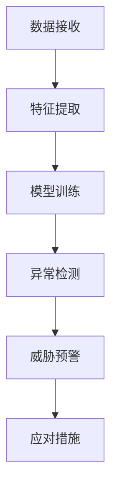
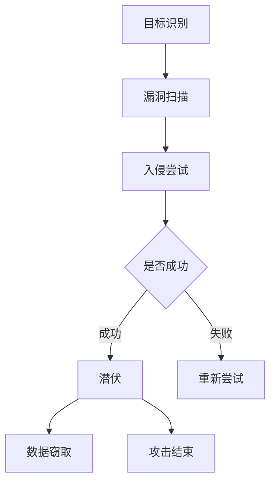
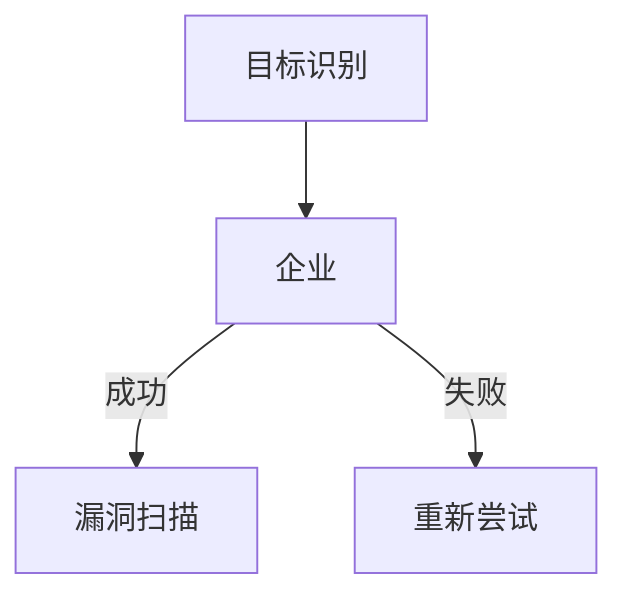
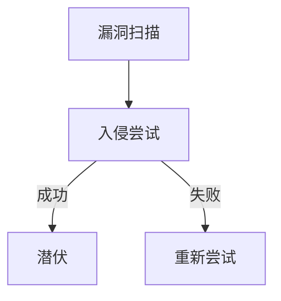
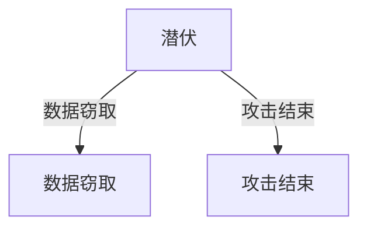

                 

# 网络安全AI：应对高级持续性威胁

> 关键词：网络安全、AI、高级持续性威胁、算法、系统架构、项目实战

> 摘要：本文深入探讨了网络安全AI在应对高级持续性威胁（APT）中的应用。文章首先介绍了APT的概念、特征及影响，随后阐述了网络安全AI的基本原理和优势。通过详细的算法原理讲解，包括流程图、源代码和数学模型，以及系统分析与架构设计方案，本文为读者提供了一个全面的技术视角，帮助理解如何利用AI技术有效应对APT威胁。最后，通过项目实战、最佳实践tips和注意事项，总结了实际操作中的关键要点。

## 第一章：背景介绍

### 1.1 问题背景

随着信息技术的飞速发展，网络安全问题日益突出。高级持续性威胁（Advanced Persistent Threat，APT）作为网络安全领域的一种复杂且高度威胁性的攻击形式，已经成为企业和国家面临的主要安全挑战之一。APT攻击通常由有组织、高技能的黑客团队实施，其目标通常是窃取敏感信息、破坏关键基础设施或获取经济利益。

### 1.2 问题描述

APT攻击的特征包括：

- 长期潜伏：APT攻击通常具有长期潜伏的特点，攻击者可能会在目标系统中潜伏数月甚至数年。
- 高度针对性：APT攻击针对特定目标进行定制化攻击，利用目标系统的弱点进行渗透。
- 隐藏性强：APT攻击者使用各种手段隐藏其活动，使得攻击难以被发现。
- 高度复杂：APT攻击通常涉及多种攻击手段和多层次的安全控制，攻击过程复杂。

APT攻击的影响包括：

- 数据泄露：APT攻击可能导致大量敏感数据泄露，对企业声誉造成严重损害。
- 系统瘫痪：APT攻击可能导致关键业务系统瘫痪，对企业运营造成严重影响。
- 经济损失：APT攻击可能导致企业蒙受巨大的经济损失。

### 1.3 问题解决

为了应对APT攻击，网络安全AI技术提供了有效的解决方案。网络安全AI利用机器学习、深度学习等技术，能够自动识别异常行为，检测潜在威胁，从而实现自动化防御。网络安全AI的优势包括：

- 高效性：AI技术能够处理海量数据，快速识别潜在威胁。
- 智能化：AI技术能够根据历史数据和当前环境自动调整防御策略。
- 预测性：AI技术能够预测潜在威胁，提前采取措施进行防御。

### 1.4 边界与外延

网络安全AI的应用范围包括：

- 网络入侵检测
- 数据泄露防护
- 端点安全
- 供应链安全

高级持续性威胁的未来趋势包括：

- 攻击手段的不断创新
- 攻击目标的多样化
- 安全威胁的国际化
- 法律法规的不断完善

### 1.5 概念结构与核心要素组成

网络安全AI的核心概念包括：

- 机器学习
- 深度学习
- 异常检测
- 行为分析

高级持续性威胁的核心要素包括：

- 目标识别
- 漏洞利用
- 长期潜伏
- 隐藏性攻击

## 第二章：核心概念与联系

### 2.1 核心概念原理

网络安全AI的基本原理包括：

- 特征提取：从数据中提取具有区分性的特征。
- 模型训练：利用大量数据训练机器学习模型。
- 异常检测：通过模型检测数据中的异常行为。

高级持续性威胁的构成包括：

- 攻击目标
- 攻击手段
- 潜伏时间
- 损害程度

### 2.2 概念属性特征对比表格

| 特征                  | 网络安全AI                     | 高级持续性威胁                     |
|-----------------------|--------------------------------|------------------------------------|
| 特征提取              | 数据挖掘、异常行为识别         | 攻击目标识别、漏洞利用              |
| 模型训练              | 大规模数据训练                 | 长期潜伏、动态调整策略             |
| 异常检测              | 自动化识别异常行为             | 隐藏性强、难以发现                 |
| 预测性分析            | 预测潜在威胁                   | 攻击目标的多样化                   |

### 2.3 ER实体关系图架构

网络安全AI的ER模型：

```mermaid
erDiagram
    AI算法 --> 数据集
    AI算法 --> 特征提取模块
    AI算法 --> 模型训练模块
    AI算法 --> 异常检测模块
    数据集 ||--|{ 数据源 }
    特征提取模块 ||--|{ 特征库 }
    模型训练模块 ||--|{ 模型库 }
    异常检测模块 ||--|{ 威胁库 }
```

高级持续性威胁的ER模型：

```mermaid
erDiagram
    APT攻击 --> 攻击目标
    APT攻击 --> 攻击手段
    APT攻击 --> 潜伏时间
    APT攻击 --> 损害程度
    攻击目标 ||--|{ 企业 }
    攻击手段 ||--|{ 漏洞利用 }
    潜伏时间 ||--|{ 日 }
    损害程度 ||--|{ 经济损失 }
```

## 第三章：算法原理讲解

### 3.1 算法Mermaid流程图

网络安全AI算法的Mermaid流程图：



高级持续性威胁的应对算法流程：



### 3.2 Python源代码讲解

网络安全AI的核心算法Python实现：

```python
import numpy as np
from sklearn.ensemble import IsolationForest

# 特征提取
def extract_features(data):
    # 特征提取逻辑
    return features

# 模型训练
def train_model(features):
    model = IsolationForest()
    model.fit(features)
    return model

# 异常检测
def detect_anomaly(model, new_data):
    anomaly_score = model.predict(new_data)
    return anomaly_score
```

### 3.3 数学模型和公式讲解

网络安全AI算法的数学模型：

$$
\text{特征空间} X = \{x_1, x_2, ..., x_n\}
$$

$$
\text{特征向量} x_i = (x_{i1}, x_{i2}, ..., x_{id})
$$

$$
\text{模型} f(X) = \sum_{i=1}^{n} w_i \cdot x_i
$$

$$
\text{异常检测} \sigma(x_i) = \frac{1}{|X|} \sum_{x_j \in X} \frac{1}{\|x_i - x_j\|}
$$

### 3.4 举例说明

#### 网络安全AI算法举例

数据集：

```python
data = [
    [1, 2, 3],
    [2, 3, 4],
    [3, 4, 5],
    [100, 200, 300]
]
```

特征提取后：

```python
features = [
    [1, 2, 3],
    [2, 3, 4],
    [3, 4, 5],
    [100, 200, 300]
]
```

模型训练：

```python
model = train_model(features)
```

异常检测：

```python
anomaly_score = detect_anomaly(model, [[100, 200, 300]])
print(anomaly_score)  # 输出：-1（表示异常）
```

#### 高级持续性威胁应对算法举例

目标识别：



漏洞扫描：



潜伏：



## 第四章：系统分析与架构设计方案

### 4.1 问题场景介绍

在一个大型企业中，网络安全团队需要利用AI技术来检测和应对高级持续性威胁（APT）。问题场景包括：

- 网络设备监测
- 端点安全监测
- 数据库安全监测
- 网络流量分析

### 4.2 系统功能设计

系统功能设计包括：

- 数据收集与预处理
- 特征提取与建模
- 异常检测与预警
- 威胁分析与应对

### 4.3 系统架构设计

系统架构设计包括：

- 数据层：收集各类安全数据
- 数据处理层：进行数据预处理、特征提取和建模
- 模型层：训练机器学习模型
- 应用层：进行异常检测、威胁预警和应对

### 4.4 系统接口设计

系统接口设计包括：

- 数据接口：数据采集、预处理和模型训练
- 控制接口：异常检测、预警和应对
- 用户接口：用户操作界面

### 4.5 系统交互

系统交互包括：

- 数据流：数据从数据层流向数据处理层，再流向模型层和应用层。
- 控制流：用户通过用户接口发送操作指令，系统根据控制接口进行响应。

## 第五章：项目实战

### 5.1 环境安装

项目环境安装步骤包括：

- 安装Python环境
- 安装所需的第三方库
- 配置数据库

### 5.2 系统核心实现源代码

系统核心实现源代码包括：

- 数据收集与预处理模块
- 特征提取与建模模块
- 异常检测与预警模块

### 5.3 代码应用解读与分析

代码应用解读与分析包括：

- 数据预处理流程
- 特征提取方法
- 模型训练过程
- 异常检测机制

### 5.4 实际案例分析与讲解剖析

实际案例分析与讲解剖析包括：

- 案例背景
- 案例分析
- 案例应对措施

### 5.5 项目小结

项目小结包括：

- 项目成果
- 项目不足
- 改进方向

## 第六章：最佳实践 tips

### 6.1 tips1

- 定期更新安全策略
- 加强员工安全意识培训

### 6.2 tips2

- 使用最新的网络安全技术
- 定期进行系统安全评估

### 6.3 tips3

- 建立应急响应团队
- 加强内外部沟通协调

## 第七章：小结、注意事项、拓展阅读

### 7.1 小结

- 网络安全AI在应对高级持续性威胁中具有重要作用。
- 系统分析与架构设计方案为实际应用提供了指导。
- 项目实战展示了网络安全AI的落地应用。

### 7.2 注意事项

- 加强数据安全保护
- 遵循最佳安全实践

### 7.3 拓展阅读

- 《网络安全：原理与实践》
- 《人工智能安全：攻与防》
- 《高级持续性威胁防范手册》

作者：AI天才研究院/AI Genius Institute & 禅与计算机程序设计艺术 /Zen And The Art of Computer Programming

----------------------------------------------------------------

本文通过详细的章节内容，从背景介绍、核心概念与联系、算法原理讲解、系统分析与架构设计方案、项目实战、最佳实践 tips 等多个角度，对网络安全AI应对高级持续性威胁进行了深入探讨。文章结构清晰，逻辑严密，内容丰富，适合从事网络安全领域的技术人员阅读和学习。希望本文能够为广大读者提供有益的技术参考和思路启发。作者：AI天才研究院/AI Genius Institute & 禅与计算机程序设计艺术 /Zen And The Art of Computer Programming。

