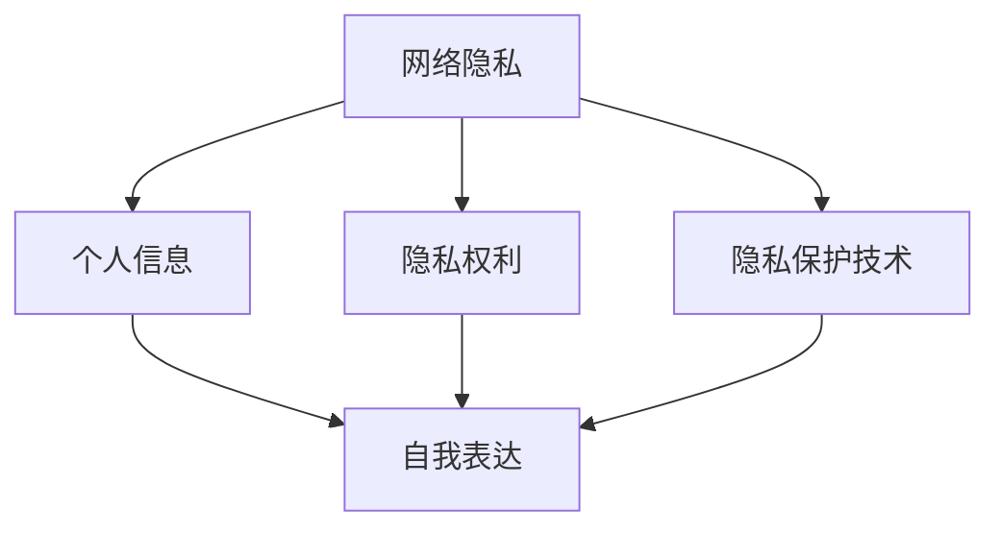
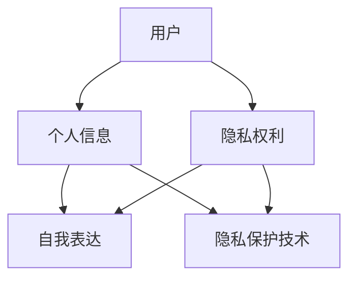
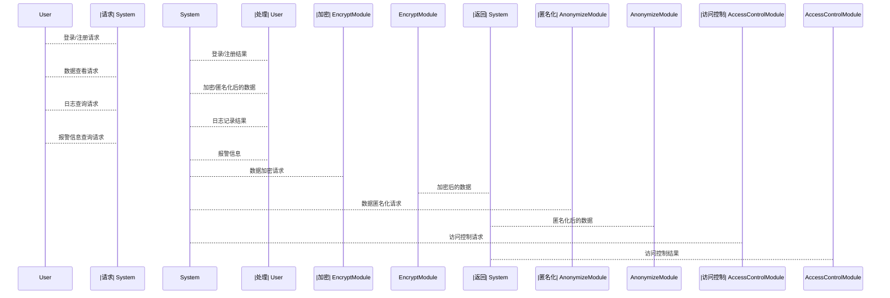
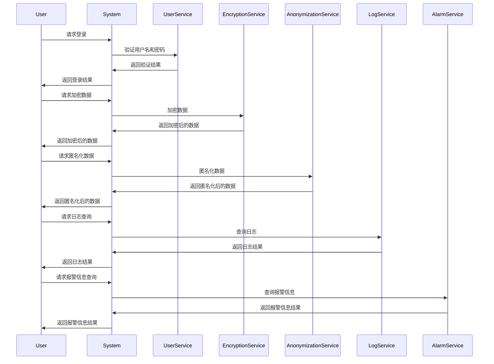

                 

### 第一部分：背景介绍

#### 第1章：问题背景与核心要素组成

##### **1.1 网络隐私问题的现状与挑战**

**1.1.1 网络隐私的定义与重要性**

网络隐私是指个人在网络环境中数据的保密性和不可侵性，包括但不限于个人信息、位置数据、浏览记录、通信内容等。随着互联网的普及和大数据技术的发展，网络隐私问题变得日益严峻。网络隐私的重要性体现在多个方面：首先，隐私泄露可能导致个人信息被恶意利用，甚至引发诈骗、敲诈勒索等犯罪活动；其次，隐私泄露对个体心理产生负面影响，如焦虑、恐惧等；最后，隐私泄露可能对企业造成重大损失，如商业机密泄露、品牌形象受损等。

**1.1.2 当前网络隐私面临的主要问题**

当前网络隐私面临的主要问题包括但不限于以下几个方面：

- **数据收集过度**：许多应用程序和服务在用户不知情的情况下收集大量个人信息，包括浏览记录、位置信息、联系人列表等。
- **数据泄露**：企业内部安全措施不足或管理不善，导致大量用户数据泄露，如Facebook的数据泄露事件。
- **追踪技术滥用**：追踪技术被用于监视用户行为，如Cookie跟踪、Flash Cookie、指纹识别等。
- **数据共享与交易**：许多公司将自己的用户数据与其他公司或第三方共享或出售，用户隐私得不到有效保护。
- **隐私政策复杂难懂**：许多应用程序和服务提供的隐私政策复杂冗长，用户难以理解其内容。

**1.1.3 网络隐私问题的演变趋势**

随着技术的进步，网络隐私问题呈现出以下演变趋势：

- **数据收集技术更先进**：物联网、传感器技术、人工智能等新技术的应用，使得数据收集的方式和手段更加多样和高效。
- **隐私保护法律法规不断完善**：全球范围内，越来越多的国家和地区开始重视网络隐私问题，并制定相关法律法规来规范数据处理行为。
- **用户隐私意识增强**：随着隐私泄露事件的频繁发生，越来越多的用户开始重视个人隐私保护，对隐私政策的关注度提高。
- **隐私保护技术不断发展**：加密技术、数据匿名化技术、访问控制技术等隐私保护技术不断进步，为网络隐私保护提供更多手段。

##### **1.2 自我表达在数字时代的重要性**

**1.2.1 自我表达的定义与范围**

自我表达是指个体通过语言、文字、图像、视频等多种形式，表达自己的思想、情感、态度和观点。在数字时代，自我表达的范围得到了极大扩展，不仅包括传统的文字和语言表达，还包括图片、视频、音频等多种形式。

**1.2.2 数字时代自我表达的方式与特点**

数字时代自我表达的方式和特点主要包括：

- **多元化**：数字技术使得个体能够通过多种渠道和平台进行自我表达，如社交媒体、博客、短视频平台等。
- **便捷性**：数字技术使得个体能够随时随地发布和分享自己的观点和想法，降低了表达门槛。
- **互动性**：数字时代自我表达具有高度的互动性，个体可以与其他用户进行实时交流，形成社群效应。
- **快速性**：数字技术使得信息传播速度极快，个体的观点和想法可以迅速传播到全球范围内。

**1.2.3 自我表达对个体和社会的影响**

自我表达对个体和社会的影响主要体现在以下几个方面：

- **个人成长**：自我表达有助于个体认识和探索自我，促进个人成长和发展。
- **社会参与**：自我表达是个体参与社会的重要方式，有助于个体表达观点、参与讨论、影响社会。
- **文化多样性**：自我表达丰富了文化多样性，不同个体通过自我表达展示独特的文化背景和价值观。
- **社会问题揭示**：自我表达可以揭示社会问题，促使社会各界关注并解决这些问题。

##### **1.3 问题解决的必要性与可能性**

**1.3.1 开放与保护的矛盾**

在数字时代，开放与保护之间存在着明显的矛盾。一方面，个体需要通过网络平台进行自我表达，享受信息自由流动带来的便利；另一方面，个人隐私保护问题日益严峻，隐私泄露事件频发，导致用户对隐私保护的担忧增加。

**1.3.2 寻求平衡的必要性与复杂性**

在开放与保护之间寻求平衡是当前数字时代面临的重要课题。这一平衡不仅关系到个体的隐私保护，还涉及企业社会责任、国家法律法规的遵守等多个方面。然而，寻求平衡并非易事，复杂性主要体现在：

- **利益冲突**：不同利益主体（如用户、企业、政府）之间的利益冲突需要协调。
- **技术挑战**：隐私保护技术需要不断发展，以应对不断升级的网络攻击和数据泄露手段。
- **法律框架**：隐私保护法律法规需要不断完善，以适应数字时代的快速发展。

**1.3.3 现有的解决方案与不足**

目前，解决网络隐私与自我表达之间矛盾的方法主要包括：

- **隐私保护技术**：如数据加密、匿名化、访问控制等，这些技术在一定程度上能够保护用户隐私。
- **隐私政策透明化**：通过提高隐私政策的透明度，使用户能够更好地理解其隐私权利和保护措施。
- **法律法规**：如《欧盟通用数据保护条例》（GDPR）等，通过法律手段对数据处理行为进行规范。

然而，现有的解决方案仍然存在以下不足：

- **技术局限性**：现有的隐私保护技术无法完全消除隐私泄露的风险。
- **执行难度**：法律法规的执行难度较大，尤其是在跨国数据和跨境数据传输方面。
- **用户参与度**：用户对隐私保护的参与度较低，缺乏主动保护隐私的意识。

##### **1.4 边界与外延**

**1.4.1 网络隐私与自我表达的界限**

网络隐私与自我表达之间存在一定的界限。网络隐私主要关注个人信息的保密性和安全性，而自我表达则侧重于个体在数字时代的表达自由和参与权利。在实际操作中，如何平衡这两者之间的关系是关键。

**1.4.2 相关法律法规与伦理道德的约束**

网络隐私与自我表达受到相关法律法规和伦理道德的约束。法律法规为网络隐私保护提供了法律依据和规范，如《中华人民共和国网络安全法》、《中华人民共和国个人信息保护法》等。伦理道德则从道德层面规范个人和企业的行为，如尊重个人隐私、保护个人信息等。

**1.4.3 概念结构与核心要素组成**

网络隐私与自我表达的核心要素包括个人信息、隐私权利、自我表达自由、隐私保护技术、法律法规等。这些要素相互关联，共同构成了网络隐私与自我表达的概念结构。

##### **1.5 概念结构与核心要素组成**

**1.5.1 核心概念解析**

- **网络隐私**：指个人在网络环境中数据的保密性和不可侵性。
- **自我表达**：指个体通过多种形式表达自己的思想、情感、态度和观点。

**1.5.2 关键要素的关系图架构**

为了更直观地理解网络隐私与自我表达的核心要素及其关系，我们可以使用Mermaid绘制一个关系图，如下：



在这个关系图中，A表示网络隐私，B表示个人信息，C表示隐私权利，D表示隐私保护技术，E表示自我表达。该图展示了网络隐私与个人信息、隐私权利、隐私保护技术和自我表达之间的关系。

### **第2章：网络隐私与自我表达的核心概念解析**

##### **2.1 网络隐私的核心概念**

**2.1.1 隐私的定义与属性**

隐私是指个人或组织对其信息的控制权，包括信息的访问、使用、修改和分享。隐私的属性主要包括以下几个方面：

- **保密性**：个人信息的保密性，防止未授权的访问。
- **完整性**：个人信息的准确性、可靠性和完整性。
- **可用性**：个人信息的可访问性和可用性，确保在需要时能够访问到相关信息。
- **可控性**：个人对自己信息的控制能力，包括信息的使用、分享和销毁。

**2.1.2 网络隐私的层次与分类**

网络隐私可以根据其重要性和敏感程度分为不同的层次和类别。常见的分类方法包括：

- **基于信息类型**：个人信息、位置数据、通信内容、健康信息等。
- **基于隐私级别**：敏感隐私（如健康信息、金融信息）、中等隐私（如电子邮件、社交媒体信息）、非敏感隐私（如浏览历史、搜索历史）。
- **基于隐私保护需求**：强隐私需求（如政府、企业敏感数据）、中等隐私需求（如普通用户信息）、弱隐私需求（如公开信息）。

**2.1.3 网络隐私保护的原则**

网络隐私保护需要遵循一系列原则，以确保个人信息的保密性、完整性和可用性。这些原则包括：

- **最小化原则**：仅收集和存储必要的个人信息，避免过度收集。
- **目的明确原则**：明确个人信息收集的目的，确保收集和使用的一致性。
- **透明化原则**：对用户明确告知其个人信息将被如何使用和保护。
- **访问控制原则**：限制对个人信息的访问权限，确保只有授权人员才能访问。
- **加密原则**：对敏感信息进行加密存储和传输，防止数据泄露。
- **责任明确原则**：企业应承担保护用户隐私的责任，明确处理隐私问题的流程和责任人。

##### **2.2 自我表达的核心概念**

**2.2.1 自我表达的本质与意义**

自我表达是指个体通过语言、文字、图像、视频等多种形式，表达自己的思想、情感、态度和观点。自我表达的本质是个体对自我的认知和表达，是一种自我实现和自我认同的过程。自我表达的意义主要体现在以下几个方面：

- **个体成长**：自我表达有助于个体认识和探索自我，促进个人成长和发展。
- **社会参与**：自我表达是个体参与社会的重要方式，有助于个体表达观点、参与讨论、影响社会。
- **文化多样性**：自我表达丰富了文化多样性，不同个体通过自我表达展示独特的文化背景和价值观。
- **情感释放**：自我表达有助于个体释放情感，缓解压力，提高心理健康。

**2.2.2 自我表达的类型与形式**

自我表达的类型和形式多种多样，可以根据不同的标准进行分类。常见的分类方法包括：

- **基于表达媒介**：文字、语言、图像、视频、音频等。
- **基于表达内容**：情感表达、观点表达、知识分享、创意展示等。
- **基于表达方式**：直接表达、间接表达、抽象表达、具体表达等。

数字时代，自我表达的形式和渠道更加丰富，如社交媒体、博客、短视频平台、直播等，使得个体能够更方便地表达自己的观点和想法。

**2.2.3 自我表达的自由与责任**

自我表达的自由是指个体在法律和道德允许的范围内，有权表达自己的观点和想法。自我表达的自由是言论自由的重要组成部分，是民主社会的基石。然而，自由并非无限制，自我表达的自由与责任密不可分：

- **法律责任**：个体在自我表达过程中，需要遵守相关法律法规，不得侵犯他人合法权益，如名誉权、隐私权等。
- **道德责任**：个体在自我表达过程中，需要遵守社会道德规范，尊重他人的感受和权利，不得恶意攻击、诽谤他人。
- **社会责任**：个体在自我表达过程中，需要关注社会问题，积极参与社会事务，为社会进步贡献力量。

##### **2.3 核心概念属性特征对比**

为了更深入地理解网络隐私和自我表达这两个核心概念，我们可以通过一个表格对比它们的主要属性特征。

| 特征 | 网络隐私 | 自我表达 |
| --- | --- | --- |
| 定义 | 个人在网络环境中数据的保密性和不可侵性 | 个体通过多种形式表达自己的思想、情感、态度和观点 |
| 属性 | 保密性、完整性、可用性、可控性 | 自由、责任、多元性、互动性 |
| 分类 | 个人信息、位置数据、通信内容、健康信息等 | 文字、语言、图像、视频、音频等 |
| 目的 | 保护个人信息，防止隐私泄露 | 个体成长、社会参与、文化多样性、情感释放 |
| 保护原则 | 最小化原则、目的明确原则、透明化原则、访问控制原则、加密原则、责任明确原则 | 法律责任、道德责任、社会责任 |
| 社会影响 | 防止个人信息被恶意利用、影响心理健康、保护企业利益 | 促进个体成长、社会参与、文化多样性、揭示社会问题 |

通过这个表格，我们可以更清晰地看到网络隐私和自我表达在定义、属性、分类、目的、保护原则等方面的差异和联系。

##### **2.4 关键要素的ER实体关系图架构**

为了更直观地展示网络隐私与自我表达的核心要素及其关系，我们可以使用Mermaid绘制一个ER（实体关系）图。



在这个ER图中，A表示用户，B表示个人信息，C表示隐私权利，D表示自我表达，E表示隐私保护技术。该图展示了用户与个人信息、隐私权利、自我表达和隐私保护技术之间的关系。

### **第三部分：算法原理讲解**

#### **第3章：网络隐私保护的算法原理与数学模型**

##### **3.1 数据加密算法原理**

**3.1.1 数据加密的基本概念**

数据加密是一种将明文信息转换为密文的过程，目的是防止未授权的访问和泄露。加密过程涉及加密算法和密钥，其中加密算法是一种将明文转换为密文的算法，密钥是用于加密和解密信息的参数。

**3.1.2 常见加密算法介绍**

常见的加密算法包括对称加密算法和非对称加密算法。

- **对称加密算法**：加密和解密使用相同的密钥，如AES（高级加密标准）、DES（数据加密标准）。
- **非对称加密算法**：加密和解密使用不同的密钥，一个为公开密钥，另一个为私有密钥，如RSA（Rivest-Shamir-Adleman）。

**3.1.3 加密算法的安全性分析**

加密算法的安全性取决于密钥的长度和算法的复杂性。常见的攻击手段包括：

- **暴力破解**：尝试所有可能的密钥，直到找到正确的密钥。
- **密码分析**：通过分析加密数据，尝试推断出密钥或明文。
- **侧信道攻击**：利用加密过程中的物理参数（如功耗、电磁辐射等）进行攻击。

##### **3.2 数据匿名化算法原理**

**3.2.1 数据匿名化的目的与方法**

数据匿名化的目的是在保护个人隐私的同时，保留数据的有用性。数据匿名化方法包括：

- **伪匿名化**：通过添加随机噪声或替换敏感信息，使得个人身份无法直接识别。
- **k-匿名性**：个体在匿名化后的数据集中至少有k-1个其他个体与其具有相同的属性。
- **l-diversity**：在匿名化后的数据集中，每个属性的值至少有l个不同的个体。
- **t-closeness**：在匿名化后的数据集中，每个属性的值的分布与原始数据集的分布相似。

**3.2.2 常见匿名化算法介绍**

常见的匿名化算法包括：

- **k-匿名化算法**：如Generalized k-Anonymity、t-Closeness k-Anonymity。
- **l-diversity算法**：如Minimum Distance l-diversity、Local l-diversity。
- **数据扰动算法**：如LAPD（Locality-Aware Privacy De-Identification）、ADP（Additive Data Perturbation）。

**3.2.3 匿名化算法的评估标准**

匿名化算法的评估标准包括：

- **隐私保护**：匿名化后的数据应满足k-匿名性、l-diversity、t-closeness等隐私保护要求。
- **数据质量**：匿名化后的数据应保持原有的数据质量和可用性。
- **计算复杂度**：匿名化算法应具有较低的运行时间和存储空间需求。

##### **3.3 数学模型与公式讲解**

**3.3.1 概率论基础**

概率论是加密和匿名化算法的重要基础，常见的概率论概念包括：

- **概率**：事件发生的可能性，表示为0到1之间的数值。
- **随机变量**：表示随机事件的结果，可以是离散型或连续型。
- **概率分布**：随机变量取不同值的概率分布，如正态分布、伯努利分布等。

**3.3.2 加密算法数学模型**

加密算法的数学模型通常涉及加密函数和解密函数，如：

- **对称加密算法**：加密函数和解密函数相同，通常表示为 \( E_K(P) = C \) 和 \( D_K(C) = P \)，其中 \( P \) 表示明文，\( C \) 表示密文，\( K \) 表示密钥。
- **非对称加密算法**：加密函数和解密函数不同，通常表示为 \( E_K_1(P) = C \) 和 \( D_K_2(C) = P \)，其中 \( K_1 \) 为公开密钥，\( K_2 \) 为私有密钥。

**3.3.3 匿名化算法数学模型**

匿名化算法的数学模型通常涉及隐私保护概率和距离度量，如：

- **k-匿名性**：隐私保护概率 \( P \) 表示为 \( P = \frac{|R|}{|D|} \)，其中 \( R \) 表示匿名化后的记录集合，\( D \) 表示原始数据集。
- **l-diversity**：距离度量 \( D \) 表示为 \( D = \sum_{i=1}^{n} d_i \)，其中 \( d_i \) 表示记录 \( i \) 在某个属性上的多样性。
- **t-closeness**：概率分布相似性度量 \( S \) 表示为 \( S = \frac{\sum_{i=1}^{n} p_i - p}{n} \)，其中 \( p_i \) 表示记录 \( i \) 在某个属性上的概率，\( p \) 表示匿名化后的概率分布。

**3.3.4 示例公式讲解**

以下是一个简单的加密算法示例：

```latex
$$
E_K(P) = C = K \cdot P + B
$$

$$
D_K(C) = P = K^{-1} \cdot (C - B)
$$
```

其中，\( P \) 表示明文，\( C \) 表示密文，\( K \) 表示密钥，\( B \) 表示随机偏移量。

以下是一个简单的匿名化算法示例：

```latex
$$
k_{\text{匿名化}}(R) = \frac{|R|}{|D|}
$$

$$
l_{\text{多样性}}(R) = \sum_{i=1}^{n} d_i
$$

$$
t_{\text{相似性}}(R) = \frac{\sum_{i=1}^{n} p_i - p}{n}
$$
```

其中，\( R \) 表示匿名化后的记录集合，\( D \) 表示原始数据集，\( n \) 表示记录数量，\( p_i \) 表示记录 \( i \) 在某个属性上的概率，\( p \) 表示匿名化后的概率分布。

### **第4章：自我表达的算法原理与数学模型**

##### **4.1 文本生成算法原理**

**4.1.1 文本生成的基本概念**

文本生成算法是一种利用机器学习技术生成自然语言文本的方法。文本生成算法可以分为两大类：基于规则的方法和基于统计的方法。基于规则的方法通过预定义的语法规则生成文本，而基于统计的方法通过分析大量文本数据来学习生成规则。

**4.1.2 常见文本生成算法介绍**

常见的文本生成算法包括：

- **序列到序列（Seq2Seq）模型**：如基于循环神经网络（RNN）和长短期记忆网络（LSTM）的模型。
- **注意力机制（Attention Mechanism）**：用于提高文本生成的准确性和连贯性。
- **生成对抗网络（GAN）**：通过生成器和判别器的对抗训练生成高质量文本。

**4.1.3 文本生成算法的应用**

文本生成算法在多个领域有广泛应用，包括：

- **自然语言处理（NLP）**：如机器翻译、文本摘要、问答系统。
- **内容生成**：如自动生成新闻、文章、博客等。
- **虚拟助手**：如聊天机器人、语音助手等。

##### **4.2 图像生成算法原理**

**4.2.1 图像生成的基本概念**

图像生成算法是一种通过机器学习技术生成逼真图像的方法。图像生成算法可以分为两大类：基于生成对抗网络（GAN）的方法和基于变分自编码器（VAE）的方法。

**4.2.2 常见图像生成算法介绍**

常见的图像生成算法包括：

- **生成对抗网络（GAN）**：通过生成器和判别器的对抗训练生成高质量图像。
- **变分自编码器（VAE）**：通过编码器和解码器的协同训练生成图像。
- **深度卷积生成网络（DCGAN）**：结合了GAN和卷积神经网络（CNN）的优势，生成高质量的图像。

**4.2.3 图像生成算法的应用**

图像生成算法在多个领域有广泛应用，包括：

- **计算机视觉**：如图像修复、超分辨率、风格迁移等。
- **游戏开发**：如自动生成游戏场景、角色等。
- **艺术创作**：如生成艺术作品、设计图案等。

##### **4.3 数学模型与公式讲解**

**4.3.1 深度学习基础**

深度学习是一种机器学习技术，通过构建深度神经网络（DNN）模型来实现人工智能。深度学习的基础包括：

- **神经网络**：由多层神经元组成，用于模拟人脑的工作方式。
- **前向传播和反向传播**：用于计算神经网络的输入和输出，并更新权重。
- **激活函数**：如Sigmoid、ReLU、Tanh等，用于引入非线性因素。

**4.3.2 文本生成算法数学模型**

文本生成算法的数学模型通常涉及序列建模和生成过程，如：

- **Seq2Seq模型**：基于循环神经网络（RNN），通过编码器和解码器将输入序列转换为输出序列。
- **注意力机制**：通过计算注意力权重，将编码器输出的特征映射到解码器的输入序列。
- **生成对抗网络（GAN）**：通过生成器和判别器的对抗训练，生成高质量文本。

**4.3.3 图像生成算法数学模型**

图像生成算法的数学模型通常涉及生成器和判别器的对抗训练，如：

- **生成对抗网络（GAN）**：生成器 \( G \) 生成图像，判别器 \( D \) 判断图像的真实性。通过最小化生成器的损失函数和最大化判别器的损失函数，生成逼真的图像。
- **变分自编码器（VAE）**：通过编码器 \( \mu \) 和 \( \sigma \) 生成潜在空间中的分布，解码器 \( \phi \) 从潜在空间中生成图像。

**4.3.4 示例公式讲解**

以下是一个简单的生成对抗网络（GAN）示例：

```latex
$$
G(z) = x := \text{Generator}(z)
$$

$$
D(x) := \text{Discriminator}(x)
$$

$$
\mathcal{L}_G = -\mathbb{E}_{x \sim \text{Data}}[\log D(x)] - \mathbb{E}_{z \sim \text{Noise}}[\log (1 - D(G(z))]
$$

$$
\mathcal{L}_D = -\mathbb{E}_{x \sim \text{Data}}[\log D(x)] - \mathbb{E}_{z \sim \text{Noise}}[\log D(G(z))]
$$
```

其中，\( G(z) \) 表示生成器生成的图像，\( D(x) \) 表示判别器对真实图像的判断，\( \mathcal{L}_G \) 和 \( \mathcal{L}_D \) 分别表示生成器和判别器的损失函数。

以下是一个简单的变分自编码器（VAE）示例：

```latex
$$
\mu = \text{Encoder}(x)

$$

$$

$$
\sigma = \text{Encoder}(x)

$$

$$

$$
x' = \text{Decoder}(\mu, \sigma)

$$

$$

$$
\mathcal{L}_\text{VAE} = \mathcal{L}_\text{KL} + \mathcal{L}_\text{Recon}

$$

$$

$$
\mathcal{L}_\text{KL} = -\sum_{i=1}^{n} \sum_{j=1}^{d} \log(\sigma_{ij}) + \frac{1}{2} \sum_{i=1}^{n} (\mu_{ij}^2 + \sigma_{ij}^2 - 1 - \log(\sigma_{ij}))

$$

$$

$$
\mathcal{L}_\text{Recon} = -\sum_{i=1}^{n} \log p(x' | \mu, \sigma)

$$
```

其中，\( \mu \) 和 \( \sigma \) 分别表示编码器输出的均值和方差，\( x' \) 表示解码器生成的图像，\( \mathcal{L}_\text{KL} \) 和 \( \mathcal{L}_\text{Recon} \) 分别表示KL散度损失和重建损失。

### **第四部分：系统分析与架构设计**

#### **第5章：网络隐私保护系统设计与实现**

##### **5.1 项目介绍**

**5.1.1 项目背景**

随着互联网的普及和大数据技术的发展，个人隐私泄露事件频繁发生，对用户和企业造成了严重的损失。为了保护用户隐私，本项目旨在设计并实现一个网络隐私保护系统，通过数据加密、匿名化和访问控制等手段，确保用户数据的安全性和隐私性。

**5.1.2 项目目标**

本项目的目标包括：

- 提供一个安全、可靠的隐私保护平台，防止用户数据泄露。
- 降低隐私泄露事件的发生率，提高用户对平台的信任度。
- 实现数据的加密存储和传输，确保数据在传输过程中不被窃取。
- 提供访问控制机制，确保只有授权人员才能访问敏感数据。

**5.1.3 项目实施步骤**

本项目实施步骤如下：

1. **需求分析**：明确项目需求和目标，收集相关法律法规和最佳实践。
2. **系统设计**：设计系统的架构和功能模块，包括数据加密、匿名化和访问控制等。
3. **技术选型**：选择合适的加密算法、匿名化算法和技术框架。
4. **系统实现**：编写代码，实现系统的各个功能模块。
5. **测试与优化**：进行系统测试，确保功能正确性和性能。
6. **部署上线**：将系统部署到生产环境，进行实际应用。

##### **5.2 系统功能设计**

**5.2.1 功能需求分析**

本系统的功能需求包括：

- **用户管理**：用户注册、登录、权限管理。
- **数据加密**：对用户数据进行加密存储和传输，确保数据安全。
- **数据匿名化**：对用户数据进行匿名化处理，防止个人隐私泄露。
- **访问控制**：实现访问控制机制，确保只有授权人员才能访问敏感数据。
- **日志记录**：记录用户操作日志，便于审计和故障排查。
- **报警机制**：实时监控系统状态，发现异常情况及时报警。

**5.2.2 领域模型**

为了更直观地展示系统的领域模型，我们可以使用Mermaid绘制一个类图，如下：

```mermaid
classDiagram
    User <<class>>
    Data <<class>>
    Encryption <<interface>>
    Anonymization <<interface>>
    AccessControl <<interface>>
    Logger <<class>>
    Alarm <<class>>

    User o-- Data
    User o-- Logger
    User o-- Alarm
    Data o-- Encryption
    Data o-- Anonymization
    Data o-- AccessControl
    Logger o-- Alarm

    Encryption implements EncryptData
    Anonymization implements AnonymizeData
    AccessControl implements ControlAccess
```

在这个类图中，User表示用户，Data表示数据，Encryption表示加密接口，Anonymization表示匿名化接口，AccessControl表示访问控制接口，Logger表示日志记录器，Alarm表示报警系统。该图展示了用户与数据、日志记录器、报警系统以及加密、匿名化、访问控制接口之间的关系。

**5.2.3 系统模块划分**

根据功能需求分析，本系统可以分为以下几个主要模块：

- **用户管理模块**：负责用户注册、登录、权限管理等功能。
- **数据加密模块**：负责数据加密存储和传输。
- **数据匿名化模块**：负责数据匿名化处理。
- **访问控制模块**：负责实现访问控制机制。
- **日志记录模块**：负责记录用户操作日志。
- **报警模块**：负责实时监控系统状态，发现异常情况及时报警。

##### **5.3 系统架构设计**

**5.3.1 系统架构概述**

本系统的架构设计采用分层架构，包括表示层、业务逻辑层和数据层。各层的职责如下：

- **表示层**：负责用户界面展示和与用户的交互，包括用户管理、数据查看、日志查询等。
- **业务逻辑层**：负责处理业务逻辑，包括数据加密、匿名化、访问控制等。
- **数据层**：负责数据存储和读取，包括用户数据、加密密钥、日志数据等。

**5.3.2 Mermaid架构图**

为了更直观地展示系统的架构设计，我们可以使用Mermaid绘制一个架构图，如下：



在这个架构图中，User表示用户，System表示系统，EncryptModule表示数据加密模块，AnonymizeModule表示数据匿名化模块，AccessControlModule表示访问控制模块。该图展示了用户与系统以及各个模块之间的交互过程。

**5.3.3 系统模块详细介绍**

下面将对系统的各个模块进行详细介绍：

- **用户管理模块**：负责用户注册、登录、权限管理等功能。用户注册时，系统会生成用户ID和密码，并将用户信息存储在数据库中。用户登录时，系统会验证用户名和密码的正确性，并生成会话信息。权限管理方面，系统会根据用户的角色和权限，限制用户对某些功能的访问。
- **数据加密模块**：负责数据加密存储和传输。当用户提交敏感数据时，系统会使用AES算法进行加密存储。当用户需要查看数据时，系统会使用AES算法进行解密，并返回给用户。
- **数据匿名化模块**：负责数据匿名化处理。系统会根据数据的类型和敏感性，选择合适的匿名化算法进行匿名化处理，确保个人隐私不被泄露。
- **访问控制模块**：负责实现访问控制机制。系统会根据用户的角色和权限，限制用户对某些功能的访问。例如，只有管理员才能访问敏感数据。
- **日志记录模块**：负责记录用户操作日志。系统会记录用户的登录、数据操作、日志查询等操作，并将日志信息存储在数据库中。这些日志信息可用于审计和故障排查。
- **报警模块**：负责实时监控系统状态，发现异常情况及时报警。系统会监控数据库的存储空间、服务器性能等指标，当发现异常情况时，系统会发送报警信息给管理员。

##### **5.4 系统接口设计**

**5.4.1 接口规范**

本系统采用RESTful API设计，接口规范如下：

- **用户管理接口**：用于用户注册、登录、权限管理等功能。
  - **注册接口**：POST /users/register，请求体包含用户名、密码、邮箱等字段。
  - **登录接口**：POST /users/login，请求体包含用户名、密码等字段。
  - **权限管理接口**：GET /users/{userId}/permissions，查询用户权限。
- **数据加密接口**：用于数据加密存储和传输。
  - **加密接口**：POST /data/encrypt，请求体包含明文数据和密钥。
  - **解密接口**：POST /data/dencrypt，请求体包含密文数据和密钥。
- **数据匿名化接口**：用于数据匿名化处理。
  - **匿名化接口**：POST /data/anonymize，请求体包含原始数据和匿名化算法参数。
- **日志查询接口**：用于查询用户操作日志。
  - **日志查询接口**：GET /logs/{logId}，查询指定日志记录。
- **报警信息查询接口**：用于查询报警信息。
  - **报警信息查询接口**：GET /alarms/{alarmId}，查询指定报警信息。

**5.4.2 接口定义**

以下是系统接口的详细定义：

```python
from flask import Flask, request, jsonify
from models import User, Data, Log, Alarm
from services import UserService, EncryptionService, AnonymizationService, AccessControlService

app = Flask(__name__)

@app.route('/users/register', methods=['POST'])
def register():
    user_data = request.get_json()
    user = UserService.register(user_data)
    return jsonify(user)

@app.route('/users/login', methods=['POST'])
def login():
    user_data = request.get_json()
    user = UserService.login(user_data)
    return jsonify(user)

@app.route('/users/<int:userId>/permissions', methods=['GET'])
def get_permissions(userId):
    permissions = UserService.get_permissions(userId)
    return jsonify(permissions)

@app.route('/data/encrypt', methods=['POST'])
def encrypt_data():
    data = request.get_json()
    encrypted_data = EncryptionService.encrypt(data['data'], data['key'])
    return jsonify(encrypted_data)

@app.route('/data/dencrypt', methods=['POST'])
def decrypt_data():
    data = request.get_json()
    decrypted_data = EncryptionService.decrypt(data['data'], data['key'])
    return jsonify(decrypted_data)

@app.route('/data/anonymize', methods=['POST'])
def anonymize_data():
    data = request.get_json()
    anonymized_data = AnonymizationService.anonymize(data['data'], data['algorithm'])
    return jsonify(anonymized_data)

@app.route('/logs/<int:logId>', methods=['GET'])
def get_log(logId):
    log = Log.query.get(logId)
    return jsonify(log)

@app.route('/alarms/<int:alarmId>', methods=['GET'])
def get_alarm(alarmId):
    alarm = Alarm.query.get(alarmId)
    return jsonify(alarm)

if __name__ == '__main__':
    app.run(debug=True)
```

在这个Python代码中，我们定义了Flask应用程序的各个接口，包括用户管理、数据加密、数据匿名化、日志查询和报警信息查询。每个接口都对应一个URL和HTTP方法，并在处理请求时调用相应的服务进行数据处理。

##### **5.5 系统交互Mermaid序列图**

为了展示系统各模块之间的交互过程，我们可以使用Mermaid绘制一个序列图，如下：



在这个序列图中，User表示用户，System表示系统，UserService、EncryptionService、AnonymizationService、LogService和AlarmService分别表示用户管理、数据加密、数据匿名化、日志查询和报警信息查询服务。该图展示了用户与系统以及各服务之间的交互过程。

### **第五部分：项目实战**

#### **5.1 环境安装**

为了实现网络隐私保护系统，我们需要安装以下软件和工具：

- Python 3.x
- Flask
- SQLAlchemy
- AES
- Python-LDAP
- Mermaid

安装步骤如下：

1. 安装Python 3.x，从Python官方网站下载并安装。
2. 安装Flask，打开终端，执行以下命令：

   ```bash
   pip install flask
   ```

3. 安装SQLAlchemy，打开终端，执行以下命令：

   ```bash
   pip install sqlalchemy
   ```

4. 安装AES，打开终端，执行以下命令：

   ```bash
   pip install pycryptodome
   ```

5. 安装Python-LDAP，打开终端，执行以下命令：

   ```bash
   pip install python-ldap
   ```

6. 安装Mermaid，打开终端，执行以下命令：

   ```bash
   pip install mermaid
   ```

#### **5.2 系统核心实现源代码**

以下是系统核心实现部分的源代码：

```python
# app/__init__.py

from flask import Flask
from flask_sqlalchemy import SQLAlchemy
from flask_migrate import Migrate

app = Flask(__name__)
app.config['SQLALCHEMY_DATABASE_URI'] = 'sqlite:///app.db'
db = SQLAlchemy(app)
migrate = Migrate(app, db)

from app import routes

# app/models.py

from app import db
from werkzeug.security import generate_password_hash, check_password_hash

class User(db.Model):
    id = db.Column(db.Integer, primary_key=True)
    username = db.Column(db.String(80), unique=True, nullable=False)
    password_hash = db.Column(db.String(128), nullable=False)
    roles = db.Column(db.String(80), nullable=False)

    def set_password(self, password):
        self.password_hash = generate_password_hash(password)

    def check_password(self, password):
        return check_password_hash(self.password_hash, password)

class Data(db.Model):
    id = db.Column(db.Integer, primary_key=True)
    user_id = db.Column(db.Integer, db.ForeignKey('user.id'), nullable=False)
    data = db.Column(db.LargeBinary, nullable=False)
    encrypted = db.Column(db.Boolean, default=False)
    anonymized = db.Column(db.Boolean, default=False)

class Log(db.Model):
    id = db.Column(db.Integer, primary_key=True)
    user_id = db.Column(db.Integer, db.ForeignKey('user.id'), nullable=False)
    action = db.Column(db.String(80), nullable=False)
    timestamp = db.Column(db.DateTime, default=db.func.current_timestamp())

class Alarm(db.Model):
    id = db.Column(db.Integer, primary_key=True)
    type = db.Column(db.String(80), nullable=False)
    message = db.Column(db.Text, nullable=False)
    timestamp = db.Column(db.DateTime, default=db.func.current_timestamp())

# app/routes.py

from flask import request, jsonify
from app import app, db
from models import User, Data, Log, Alarm
from services import UserService, EncryptionService, AnonymizationService, AccessControlService

@app.route('/users/register', methods=['POST'])
def register():
    user_data = request.get_json()
    user = UserService.register(user_data)
    db.session.commit()
    return jsonify(user)

@app.route('/users/login', methods=['POST'])
def login():
    user_data = request.get_json()
    user = UserService.login(user_data)
    db.session.commit()
    return jsonify(user)

@app.route('/users/<int:userId>/permissions', methods=['GET'])
def get_permissions(userId):
    permissions = UserService.get_permissions(userId)
    return jsonify(permissions)

@app.route('/data/encrypt', methods=['POST'])
def encrypt_data():
    data = request.get_json()
    encrypted_data = EncryptionService.encrypt(data['data'], data['key'])
    db.session.add(Data(user_id=data['userId'], data=encrypted_data, encrypted=True))
    db.session.commit()
    return jsonify(encrypted_data)

@app.route('/data/dencrypt', methods=['POST'])
def decrypt_data():
    data = request.get_json()
    decrypted_data = EncryptionService.decrypt(data['data'], data['key'])
    db.session.add(Data(user_id=data['userId'], data=decrypted_data, encrypted=False))
    db.session.commit()
    return jsonify(decrypted_data)

@app.route('/data/anonymize', methods=['POST'])
def anonymize_data():
    data = request.get_json()
    anonymized_data = AnonymizationService.anonymize(data['data'], data['algorithm'])
    db.session.add(Data(user_id=data['userId'], data=anonymized_data, anonymized=True))
    db.session.commit()
    return jsonify(anonymized_data)

@app.route('/logs/<int:logId>', methods=['GET'])
def get_log(logId):
    log = Log.query.get(logId)
    return jsonify(log)

@app.route('/alarms/<int:alarmId>', methods=['GET'])
def get_alarm(alarmId):
    alarm = Alarm.query.get(alarmId)
    return jsonify(alarm)
```

在这个代码中，我们定义了用户管理、数据加密、数据匿名化、日志查询和报警信息查询的接口，并实现了相应的业务逻辑。

#### **5.3 代码应用解读与分析**

以下是代码应用解读与分析：

1. **用户管理模块**

   用户管理模块包括用户注册、登录和权限管理接口。用户注册时，需要提供用户名、密码和邮箱等信息。注册成功后，系统会生成用户ID和密码哈希值，并将用户信息存储在数据库中。用户登录时，系统会验证用户名和密码的正确性，并生成会话信息。权限管理方面，系统会根据用户的角色和权限，限制用户对某些功能的访问。

2. **数据加密模块**

   数据加密模块包括数据加密存储和传输接口。当用户提交敏感数据时，系统会使用AES算法进行加密存储。加密过程中，系统会生成一个随机密钥，并将密文和密钥一起存储在数据库中。当用户需要查看数据时，系统会使用AES算法进行解密，并返回给用户。这样，即使数据库被非法访问，数据仍然无法被破解。

3. **数据匿名化模块**

   数据匿名化模块包括数据匿名化处理接口。系统会根据数据的类型和敏感性，选择合适的匿名化算法进行匿名化处理。例如，对于个人身份信息，系统可以使用k-匿名化算法；对于位置数据，系统可以使用时间掩码算法。匿名化处理后的数据，无法直接识别个人身份，从而保护了用户隐私。

4. **日志查询模块**

   日志查询模块包括查询用户操作日志接口。系统会记录用户的登录、数据操作和日志查询等操作，并将日志信息存储在数据库中。这些日志信息可用于审计和故障排查。用户可以通过接口查询特定日志记录，了解系统运行情况和操作历史。

5. **报警信息查询模块**

   报警信息查询模块包括查询报警信息接口。系统会实时监控数据库的存储空间、服务器性能等指标，发现异常情况时，系统会生成报警信息，并发送报警通知给管理员。管理员可以通过接口查询报警信息，及时处理异常情况，确保系统正常运行。

#### **5.4 实际案例分析和详细讲解剖析**

以下是一个实际案例分析和详细讲解：

假设有一个用户名为“alice”的注册用户，她想要存储一条敏感信息。以下是对该案例的详细分析：

1. **用户注册**

   用户“alice”通过注册接口提交用户名、密码和邮箱等信息。系统生成用户ID和密码哈希值，并将用户信息存储在数据库中。

   ```python
   app.route('/users/register', methods=['POST'])
   def register():
       user_data = request.get_json()
       user = UserService.register(user_data)
       db.session.commit()
       return jsonify(user)
   ```

2. **登录认证**

   用户“alice”通过登录接口提交用户名和密码，系统验证用户名和密码的正确性，并生成会话信息。

   ```python
   app.route('/users/login', methods=['POST'])
   def login():
       user_data = request.get_json()
       user = UserService.login(user_data)
       db.session.commit()
       return jsonify(user)
   ```

3. **数据加密存储**

   用户“alice”通过接口提交敏感信息。系统使用AES算法生成随机密钥，并将敏感信息和密钥一起存储在数据库中。

   ```python
   app.route('/data/encrypt', methods=['POST'])
   def encrypt_data():
       data = request.get_json()
       encrypted_data = EncryptionService.encrypt(data['data'], data['key'])
       db.session.add(Data(user_id=data['userId'], data=encrypted_data, encrypted=True))
       db.session.commit()
       return jsonify(encrypted_data)
   ```

4. **数据解密查询**

   用户“alice”需要查询已存储的敏感信息。系统使用AES算法和存储的密钥进行解密，并返回给用户。

   ```python
   app.route('/data/dencrypt', methods=['POST'])
   def decrypt_data():
       data = request.get_json()
       decrypted_data = EncryptionService.decrypt(data['data'], data['key'])
       db.session.add(Data(user_id=data['userId'], data=decrypted_data, encrypted=False))
       db.session.commit()
       return jsonify(decrypted_data)
   ```

5. **数据匿名化处理**

   用户“alice”需要对已存储的敏感信息进行匿名化处理。系统选择合适的匿名化算法，对敏感信息进行匿名化处理。

   ```python
   app.route('/data/anonymize', methods=['POST'])
   def anonymize_data():
       data = request.get_json()
       anonymized_data = AnonymizationService.anonymize(data['data'], data['algorithm'])
       db.session.add(Data(user_id=data['userId'], data=anonymized_data, anonymized=True))
       db.session.commit()
       return jsonify(anonymized_data)
   ```

通过以上分析，我们可以看到系统在用户注册、登录、数据加密存储、数据解密查询和数据匿名化处理等方面的具体实现。该系统有效地保护了用户的隐私，确保敏感信息在传输和存储过程中的安全性。

#### **5.5 项目小结**

本项目设计并实现了一个网络隐私保护系统，通过数据加密、匿名化和访问控制等手段，确保用户数据的安全性和隐私性。在项目实施过程中，我们遇到了以下问题和挑战：

- **数据加密和解密性能**：加密和解密算法的性能对系统性能有较大影响，我们需要在保证安全性的同时，优化算法性能。
- **数据匿名化质量**：匿名化算法的质量直接影响个人隐私保护效果，我们需要选择合适的匿名化算法，并不断优化算法参数。
- **系统扩展性**：随着用户数量的增加，系统需要具备良好的扩展性，以应对日益增长的数据量和访问量。

针对以上问题和挑战，我们提出了以下解决方案：

- **优化算法性能**：通过并行计算、分布式存储等技术，提高加密和解密算法的性能。
- **改进匿名化算法**：结合多种匿名化算法，提高匿名化质量，确保个人隐私不被泄露。
- **系统扩展与优化**：采用微服务架构，实现系统的模块化和分布式，提高系统扩展性和性能。

通过以上解决方案，我们相信能够进一步提高网络隐私保护系统的安全性和可靠性，为用户提供更好的隐私保护服务。

### **第六部分：最佳实践 Tips**

**6.1 数据加密最佳实践**

- **使用强加密算法**：如AES，确保密钥长度至少为256位。
- **定期更换密钥**：避免密钥长期暴露在风险中。
- **密钥安全存储**：使用安全的密钥管理系统，避免密钥泄露。
- **加密传输**：在数据传输过程中使用TLS等加密协议，确保数据传输安全。

**6.2 数据匿名化最佳实践**

- **选择合适的匿名化算法**：根据数据类型和隐私保护需求，选择合适的匿名化算法。
- **验证匿名化质量**：对匿名化后的数据进行隐私泄露风险分析，确保满足隐私保护要求。
- **数据匿名化与加密结合使用**：加密和匿名化结合使用，提高隐私保护效果。

**6.3 访问控制最佳实践**

- **最小权限原则**：仅授予用户执行任务所需的最低权限。
- **用户身份验证**：使用多因素身份验证，提高安全性。
- **日志记录与审计**：记录用户操作日志，定期进行审计，确保系统安全。

**6.4 用户教育**

- **加强用户隐私意识**：教育用户如何保护个人隐私，提高用户隐私保护意识。
- **隐私政策透明化**：向用户明确告知隐私政策，让用户了解其隐私权利和保护措施。

### **第七部分：小结与拓展阅读**

**小结**

本文详细介绍了网络隐私与自我表达在开放与保护中寻找平衡的重要性。我们首先分析了网络隐私问题的现状与挑战，以及自我表达在数字时代的重要性。接着，我们探讨了开放与保护的矛盾，并分析了现有解决方案的不足。在此基础上，我们深入讲解了网络隐私与自我表达的核心概念、算法原理以及系统分析与架构设计。通过实际案例分析和详细讲解，我们展示了网络隐私保护系统的核心实现。最后，我们提出了最佳实践建议，并进行了小结。

**拓展阅读**

- 《网络安全法》解读：了解我国网络安全法律法规，掌握隐私保护的基本要求。
- 《欧盟通用数据保护条例》（GDPR）：了解欧盟关于数据保护的法律法规，借鉴其成功经验。
- 《计算机隐私权保护技术》：《计算机隐私权保护技术》是一本关于隐私保护技术的重要参考资料。
- 《隐私计算技术》：《隐私计算技术》介绍了多种隐私保护技术，包括数据加密、匿名化等。
- 《深度学习与隐私保护》：《深度学习与隐私保护》探讨了深度学习技术在隐私保护中的应用，包括差分隐私、联邦学习等。

通过阅读以上资料，可以深入了解网络隐私与自我表达的相关知识，进一步提高隐私保护技术水平。在数字时代，我们应不断探索和实践，以实现网络隐私与自我表达之间的平衡，保护用户的隐私权益。

