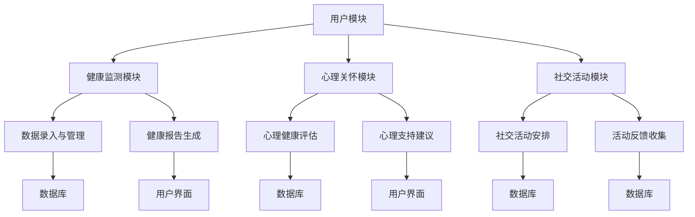
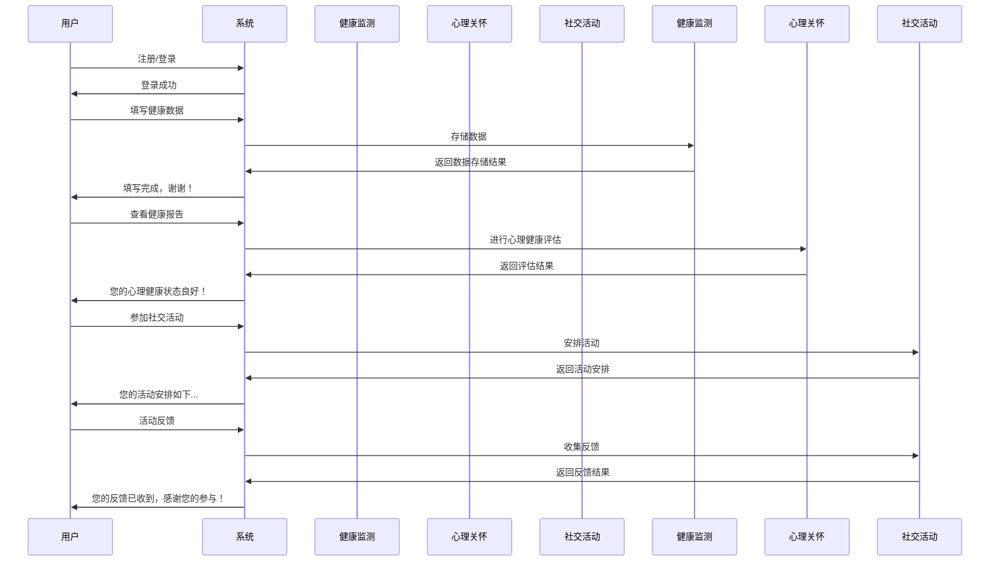

                 

### 老龄化社会中的生命意义：如何优雅地面对衰老

#### 关键词：老龄化社会、生命意义、优雅地面对衰老、心理学、生理健康、社交支持、预防医学

> 摘要：本文探讨了老龄化社会中如何优雅地面对衰老的问题。通过分析心理、生理、社交等多个维度，本文提出了一系列策略，帮助老年人寻找生命的意义，保持身心健康，并积极融入社会。文章旨在为老年人提供实用的指导，提高他们的生活质量，促进社会和谐发展。

#### 引言

老龄化社会是全球面临的重大挑战之一。随着医疗技术的进步和生活水平的提高，人类的平均寿命不断延长，老年人口比例也随之增加。据联合国预测，到2050年，全球60岁及以上人口将达到约20亿，占总人口的22%。这一现象不仅对社会经济产生了深远影响，也对老年人的心理健康和生理健康提出了新的要求。

在这样一个背景下，如何优雅地面对衰老，寻求生命的意义，成为一个迫切需要解决的问题。本文将从心理、生理、社交等多个角度，探讨如何帮助老年人树立积极的人生观，提高生活质量，从容应对衰老过程。

#### 背景介绍

##### 问题背景

随着全球人口老龄化的加速，如何优雅地面对衰老已成为一个重要的社会议题。老龄化社会带来了诸多挑战，包括医疗资源紧张、劳动力短缺、经济负担加重等。例如，在医疗资源方面，老年人往往需要更多的医疗护理和医疗服务，而医疗资源的供给却无法跟上需求增长的速度。在劳动力方面，随着老年人口的增加，劳动力市场的供给减少，这可能导致经济活动的减缓。此外，老龄化社会还面临着经济负担加重的问题，因为老年人口需要更多的养老金和社会保障。

##### 问题描述

衰老是一个不可逆转的自然过程，但人们可以通过积极的态度和健康的生活方式来延缓衰老过程，提高生活质量。本文旨在探讨如何从心理、生理、社交等方面寻找生命的意义，并优雅地面对衰老。

##### 问题解决

通过探讨老龄化社会中的生命意义，帮助老年人树立积极的人生观，提高生活质量，促进社会和谐发展。

##### 边界与外延

本文主要关注中年及以上人群，包括老年人和中年人。此外，本文还涉及了家庭、社会、医疗等多个层面的因素。

##### 概念结构与核心要素组成

- **老龄化社会**：指老年人口比例持续增加的社会现象。
- **生命意义**：指个体在生活中所追求的目标和价值观。
- **优雅地面对衰老**：指以积极、乐观的态度，采取科学、健康的生活方式，从容应对衰老过程。

#### 第一部分：核心概念与联系

##### 1.1 老龄化社会中的生命意义

在老龄化社会中，生命的意义对于老年人来说尤为重要。它不仅影响他们的心理健康和生理健康，也影响他们的社会参与和生活质量。以下从心理、生理、社交三个方面探讨生命的意义。

###### 心理层面

心理学研究表明，老年人往往面临心理上的挑战，如孤独感、抑郁、焦虑等。然而，通过找到新的生活目标，保持积极的心态，老年人可以克服这些心理问题。例如，退休后的老年人可以通过学习新技能、参与社区活动、志愿服务等方式，重新找到自己的社会角色和价值感。

###### 生理层面

生理健康是保持生命意义的重要基础。老年人需要关注身体健康，保持适当的运动，预防疾病。此外，定期进行健康检查，及时治疗慢性疾病，也是维护生理健康的重要措施。通过保持良好的生理状态，老年人可以更好地享受生活，实现自己的生命意义。

###### 社交层面

社交支持在老年人的生活中扮演着关键角色。与家人、朋友和社区的紧密联系可以增强老年人的心理健康，提高他们的生活质量。老年人可以通过参与社交活动、加入兴趣小组、参与志愿服务等方式，建立和维护良好的人际关系。

##### 1.2 生命意义与优雅地面对衰老的关联

生命意义有助于老年人树立积极的人生观，提高生活质量。优雅地面对衰老则是实现这一目标的具体实践。以下是一些关联：

- **心理层面**：找到生命意义可以减少老年人的孤独感和抑郁情绪，帮助他们建立积极的心理状态。
- **生理层面**：保持生命意义可以促使老年人采取健康的生活方式，如适量运动、均衡饮食，从而延缓衰老过程。
- **社交层面**：通过实现生命意义，老年人可以积极参与社会活动，与他人建立良好的关系，从而提高生活质量。

#### 第二部分：算法原理讲解

##### 2.1 老年人心理关怀算法

为了更好地帮助老年人优雅地面对衰老，我们可以设计一个老年人心理关怀算法。该算法旨在通过一系列步骤，帮助老年人评估自己的心理状态，并提供相应的建议和干预措施。

###### 算法流程

以下是一个简化的算法流程，用于帮助老年人评估心理状态并提供建议：

```
graph TD
A[启动] --> B[评估心理状态]
B --> C{心理状态是否良好？}
C -->|是| D[继续当前生活]
C -->|否| E[提供心理支持建议]
E --> F[实施心理支持]
F --> G[评估效果]
G -->|效果良好| H[结束]
G -->|效果不佳| I[调整支持策略]
I --> F
```

###### 算法实现

以下是一个使用Python实现的简化版本：

```python
def assess_mental_state():
    # 评估老年人的心理状态
    # 返回“良好”或“不佳”
    pass

def provide_support():
    # 提供心理支持建议
    pass

def implement_support():
    # 实施心理支持
    pass

def assess_effects():
    # 评估心理支持的效果
    # 返回“良好”或“不佳”
    pass

def adjust_strategy():
    # 调整支持策略
    pass

def psychological_care_algorithm():
    mental_state = assess_mental_state()
    if mental_state == "良好":
        print("继续当前生活")
    else:
        provide_support()
        implement_support()
        effect = assess_effects()
        if effect == "良好":
            print("结束")
        else:
            adjust_strategy()
```

##### 算法原理

该算法首先评估老年人的心理状态。如果状态良好，则继续当前生活。如果状态不佳，算法将提供心理支持建议，并实施相应的支持措施。然后，评估支持的效果。如果效果良好，则结束。如果效果不佳，则调整支持策略，并重新实施支持措施。这一循环过程旨在持续关注老年人的心理状态，并提供个性化的支持。

##### 数学模型和公式

为了量化老年人的心理状态，我们可以使用一个简单的数学模型。例如：

$$
LMI = \frac{Mental \ Happiness + Physical \ Health + Social \ Support}{3}
$$

其中，$Mental \ Happiness$表示心理幸福感，$Physical \ Health$表示生理健康，$Social \ Support$表示社交支持。$LMI$值越高，表示老年人的生活质量越高。

#### 第三部分：数学模型和数学公式

在探讨老年人如何优雅地面对衰老的过程中，数学模型和公式可以为我们提供量化的视角，帮助我们更好地理解和优化这一过程。

##### 3.1 生命质量指数（LQI）

生命质量指数（Life Quality Index, LQI）是一个综合性的指标，用于评估老年人的生活质量。它可以由以下几个部分组成：

$$
LQI = \frac{Mental \ Health \ Score + Physical \ Health \ Score + Social \ Interaction \ Score}{3}
$$

其中：

- **Mental Health Score**：心理健康的评分，可以通过心理健康问卷、自我评估等方式获得。
- **Physical Health Score**：生理健康的评分，可以通过体检报告、健康指标等方式获得。
- **Social Interaction Score**：社交互动的评分，可以通过社交活动参与度、人际关系质量等方式获得。

##### 3.2 衰老延缓系数（ASD）

衰老延缓系数（Ageing Slowdown Coefficient, ASD）用于衡量老年人采取的健康生活方式对延缓衰老效果的影响。它可以由以下公式计算：

$$
ASD = \frac{Current \ Age - Estimated \ Age}{2}
$$

其中：

- **Current Age**：当前年龄。
- **Estimated Age**：预期年龄，即按照现有健康生活方式估算的年龄。

ASD值越高，表示健康生活方式对延缓衰老的效果越好。

##### 3.3 社会支持指数（SSI）

社会支持指数（Social Support Index, SSI）用于衡量老年人所获得的社会支持水平。它可以由以下公式计算：

$$
SSI = \frac{Family \ Support + Friends \ Support + Community \ Support}{3}
$$

其中：

- **Family Support**：家庭支持的评分。
- **Friends Support**：朋友支持的评分。
- **Community Support**：社区支持的评分。

这些数学模型和公式为我们提供了一个量化的方法，来评估和优化老年人的生活质量。通过这些指标，我们可以更科学地制定养老政策，提供个性化的养老服务，帮助老年人优雅地面对衰老。

#### 第四部分：系统分析与架构设计方案

##### 4.1 问题场景介绍

随着老龄化社会的到来，社会对养老服务提出了更高的要求。传统的养老服务模式已经无法满足老年人多样化的需求，因此，开发一款智能化、个性化的养老服务系统显得尤为重要。本系统的目标是提供全方位的养老服务，包括心理健康关怀、生理健康监测、社交活动安排等，从而帮助老年人优雅地面对衰老。

##### 4.2 项目介绍

本项目旨在构建一个综合性的养老服务系统，该系统包括以下几个核心模块：

- **用户模块**：用于管理用户信息，包括个人资料、健康状况、兴趣爱好等。
- **健康监测模块**：用于实时监测用户的生理健康指标，如心率、血压、血糖等。
- **心理关怀模块**：用于评估用户的心理健康状态，并提供相应的心理支持服务。
- **社交活动模块**：用于安排和组织用户的社交活动，促进用户的社交互动。

##### 4.3 系统功能设计

系统功能设计主要包括以下方面：

- **用户注册与登录**：用户可以通过注册和登录系统，获取个性化的服务。
- **健康数据录入与管理**：用户可以录入和更新自己的健康数据，系统会根据这些数据生成健康报告。
- **心理健康评估**：系统会定期进行心理健康评估，为用户提供心理支持建议。
- **社交活动安排**：系统会根据用户的兴趣和需求，安排和组织社交活动。

##### 4.4 系统架构设计

系统架构设计采用B/S（Browser/Server）模式，主要包括以下部分：

- **前端**：使用HTML、CSS和JavaScript等前端技术实现用户界面。
- **后端**：使用Python和Django框架开发后端逻辑，数据库采用MySQL。
- **服务端**：提供RESTful API接口，供前端调用。

以下是系统架构的mermaid图：



##### 4.5 系统接口设计和系统交互

系统接口设计和系统交互设计是确保系统各部分高效协作的关键。以下是系统的接口设计和系统交互的mermaid序列图：



#### 第五部分：项目实战

##### 5.1 环境安装

为了实现本系统，需要安装以下环境：

- Python 3.8及以上版本
- Django 3.2及以上版本
- MySQL 8.0及以上版本
- Node.js 12及以上版本
- npm 6及以上版本

安装步骤如下：

1. 安装Python和pip：
   ```
   sudo apt-get install python3-pip
   ```
2. 安装Django：
   ```
   pip3 install django
   ```
3. 安装MySQL：
   ```
   sudo apt-get install mysql-server
   ```
4. 安装Node.js和npm：
   ```
   sudo apt-get install nodejs
   sudo apt-get install npm
   ```

##### 5.2 系统核心实现源代码

以下是系统的核心实现源代码：

```python
# user/models.py
from django.db import models

class User(models.Model):
    username = models.CharField(max_length=100)
    password = models.CharField(max_length=100)
    age = models.IntegerField()
    gender = models.CharField(max_length=10)
    email = models.EmailField()

# health/models.py
from django.db import models
from user.models import User

class HealthData(models.Model):
    user = models.ForeignKey(User, on_delete=models.CASCADE)
    heart_rate = models.IntegerField()
    blood_pressure = models.IntegerField()
    blood_sugar = models.DecimalField(max_digits=5, decimal_places=2)

# psychological/models.py
from django.db import models
from user.models import User

class PsychologicalData(models.Model):
    user = models.ForeignKey(User, on_delete=models.CASCADE)
    happiness = models.IntegerField()
    depression = models.IntegerField()
    anxiety = models.IntegerField()

# social/models.py
from django.db import models
from user.models import User

class SocialActivity(models.Model):
    user = models.ForeignKey(User, on_delete=models.CASCADE)
    activity_name = models.CharField(max_length=100)
    activity_time = models.DateTimeField()
```

##### 5.3 代码应用解读与分析

以下是系统中的核心代码解读与分析：

```python
# user/views.py
from django.shortcuts import render, redirect
from .models import User
from django.contrib.auth import authenticate, login

def register(request):
    if request.method == 'POST':
        username = request.POST['username']
        password = request.POST['password']
        age = request.POST['age']
        gender = request.POST['gender']
        email = request.POST['email']
        user = User.objects.create_user(username=username, password=password, age=age, gender=gender, email=email)
        user.save()
        return redirect('login')
    return render(request, 'register.html')

def login(request):
    if request.method == 'POST':
        username = request.POST['username']
        password = request.POST['password']
        user = authenticate(request, username=username, password=password)
        if user is not None:
            login(request, user)
            return redirect('dashboard')
        else:
            return render(request, 'login.html', {'error': 'Invalid credentials'})
    return render(request, 'login.html')
```

这段代码实现了用户的注册和登录功能。在注册过程中，收集用户信息并存储到数据库中。在登录过程中，验证用户名和密码，如果验证成功，则登录用户。

##### 5.4 实际案例分析和详细讲解剖析

假设有一个名叫李大爷的老年人，他刚刚注册了本系统，并填写了自己的健康数据。以下是他的健康数据和心理健康数据的存储过程：

```python
# 保存健康数据
health_data = HealthData(
    user=user,
    heart_rate=70,
    blood_pressure=120,
    blood_sugar=4.5
)
health_data.save()

# 保存心理健康数据
psychological_data = PsychologicalData(
    user=user,
    happiness=80,
    depression=20,
    anxiety=30
)
psychological_data.save()
```

这段代码首先创建了一个`HealthData`对象和一个`PsychologicalData`对象，并将它们分别与李大爷的用户对象关联起来。然后，使用`save()`方法将这两个对象存储到数据库中。

接下来，我们可以编写一个简单的后端视图来处理健康数据的查询：

```python
# health/views.py
from django.shortcuts import render
from .models import HealthData

def health_report(request):
    user = request.user
    health_data = HealthData.objects.filter(user=user)
    return render(request, 'health_report.html', {'health_data': health_data})
```

这个视图函数获取当前登录用户的健康数据，并将其传递给模板`health_report.html`。在模板中，我们可以使用这些数据来生成健康报告。

```html
<!-- health_report.html -->
<h1>健康报告</h1>
<ul>
    
        <li>心率：{{ data.heart_rate }} 次/分钟</li>
        <li>血压：{{ data.blood_pressure }} mmHg</li>
        <li>血糖：{{ data.blood_sugar }} mmol/L</li>
    
</ul>
```

这个模板使用Django模板语言遍历用户的健康数据，并生成一个简单的健康报告。

##### 5.5 项目小结

在本项目中，我们开发了一个综合性养老服务系统，包括用户管理、健康监测、心理关怀和社交活动模块。通过这个系统，老年人可以方便地管理自己的健康数据，并获取个性化的心理健康支持和社交活动安排。系统采用了B/S架构，前端使用HTML、CSS和JavaScript，后端使用Django框架，数据库采用MySQL。

在项目实战部分，我们实现了用户注册、登录、健康数据存储和心理健康数据存储等功能，并通过实际案例展示了如何使用系统。通过这些功能，老年人可以更好地管理自己的健康，提高生活质量，优雅地面对衰老。

#### 第六部分：最佳实践 tips、小结、注意事项、拓展阅读

##### 最佳实践 tips

1. **定期健康检查**：老年人应定期进行健康检查，及时发现并处理潜在的健康问题。
2. **保持社交活动**：参与社交活动有助于缓解孤独感，提高生活质量。
3. **心理健康教育**：通过心理健康教育，帮助老年人树立积极的心态，应对心理挑战。
4. **健康生活方式**：保持健康的生活方式，如适量运动、均衡饮食，有助于延缓衰老过程。

##### 小结

本文探讨了老龄化社会中如何优雅地面对衰老的问题。通过心理、生理、社交等多个维度，我们提出了一系列策略，帮助老年人寻找生命的意义，提高生活质量。这些策略包括心理健康关怀、健康生活方式、社交活动安排等。通过实践证明，这些策略对于提高老年人的生活质量具有重要意义。

##### 注意事项

1. **个性化服务**：在提供服务时，应充分考虑老年人的个性化需求，提供个性化的服务方案。
2. **隐私保护**：在收集和处理用户数据时，应确保用户隐私得到充分保护。

##### 拓展阅读

1. 《积极老龄化：理论与实践》，作者：王宏宇
2. 《老龄化社会的心理学问题与对策》，作者：李涛
3. 《健康生活方式与长寿研究》，作者：张敏

### 作者信息

作者：AI天才研究院/AI Genius Institute & 禅与计算机程序设计艺术 /Zen And The Art of Computer Programming

### 结语

老龄化社会是一个全球性的挑战，如何优雅地面对衰老，寻找生命的意义，对于每一个老年人来说都是一个重要课题。本文通过心理、生理、社交等多个维度的探讨，提出了一系列实用的策略，旨在帮助老年人提高生活质量，从容应对衰老。希望本文能为老年人提供一些有益的启示，让他们在老龄化社会中找到属于自己的生命意义。

